# Interaction effects among parameters

## Summary:

**Pros**
1. **$k$ with lower `minPoolCost`:**
   1. Delegator APR improves, particularly for small pools.
   2. The interaction induces redelegation from initially large pools toward smaller ones.
   3. Higher $k$ leaves unsaturated-pool viability largely unchanged.
2. **$k$ with larger $a_0$:**
   1. Higher $k$ tends to favor mid-sized, highly pledged pools near the new saturation point.
   2. A larger $a_0$ reinforces this benefit through the pledge channel.
3. **$a_0$ with lower `minPoolCost`:**
   1. This interaction improves delegator APR, particularly for small pools.
   2. The effect is stronger for highly pledged pools because a larger $a_0$ amplifies the pledge channel.

**Risks**
1. **$k$ with lower `minPoolCost`:**
   1. Small-pool viability is negatively affected if they reduce their declared fixed cost.
   2. Small pools may not reduce their declared fixed cost, so they do not benefit from greater delegator attractiveness and do not attract migration.
2. **$k$ with larger $a_0$:**
   1. The positive effect on highly pledged pools is limited because relatively few pools satisfy the condition.
   2. All other pools are harmed in terms of viability and delegator APR.
3. **$a_0$ with lower `minPoolCost`:**
   1. Higher $a_0$ with lower fixed costs reduces operator viability.
   2. These operators would benefit only if they can attract new delegations.

**Behavioral and equilibrium discussion**
1. Fixed-cost changes reorder unsaturated-pool rankings more than $a_0$ changes.
2. Higher $k$ alone does not change viability among unsaturated pools.
3. Higher $a_0$ reduces viability among unsaturated pools.

**Policy interpretation**
1. Higher-$k$ ranking effects are concentrated in oversaturated pools.
2. In the epoch-$644$ snapshot, median APR falls from $1.69\%$ to $1.34\%$ when $a_0$ rises from $0.3$ to $0.6$.

## Parameter values at the current state

For the numerical analysis in this section, we use the parameter values below unless stated otherwise. These values may differ from the snapshot values reported in [Parameter-Landscape.md](../../Parameter-Landscape.md), because this comparative-statics exercise is anchored to a single reference state.

| Symbol | Parameter | Value |
| --- | --- | --- | 
| $R$ | Reward pot | $14.9M$ ADA| 
| $T$ | Total ADA supply | $38.8B$ ADA | 
| $k$ | Target number of stake pools | 500 | 
| $a_0$ | Pledge influence. | 0.3 | 
| $c_{min}$ | Minimum fixed cost (`minPoolCost`). | 170 ADA |
| $m_i$ | Operator margin/commission deducted from delegator rewards. | 5%  |
| $\rho$ | Reserve decay rate.  | 0.3%  |
| $\tau$ | Treasury share.| 20% | 

## Increment in $k$ with a reduction in `minPoolCost` ($c_{\min}$)

The individual effects can be found in the corresponding files for [parameter $k$](../k/Incentive_Effects_k.md) and [`minPoolCost`](../minPoolCost/Incentive_Effects_minPoolCost.md).

### Direct combined mechanical effects

This section combines a lower minimum fixed cost, $c_{\min}$, with a higher pool target, $k$. In the reward-sharing model, the two parameters act on different margins: $k$ changes the saturation threshold $z_0(k)=1/k$, while $c_{\min}$ changes the feasible declared fixed cost $c_i$.

#### Gross pool rewards $f(\sigma_i,p_i)$

Gross pool rewards are

$$
f(\sigma_i,p_i)=\frac{R}{1+a_0}\left[\widetilde{\sigma}_i+a_0\widetilde{p}_i\frac{\widetilde{\sigma}_i-\widetilde{p}_i\frac{z_0-\widetilde{\sigma}_i}{z_0}}{z_0}\right],
\qquad
\widetilde{\sigma}_i=\min\{\sigma_i,z_0\},\quad \widetilde{p}_i=\min\{p_i,z_0\}.
$$

Note that $c_{\min}$ does not enter $f(\cdot)$. Hence, there is no direct combined effect on $f_i$. The [incentive effects of a change in $k$](../k/Incentive_Effects_k.md) analyze the effect of $k$ on $f_i$.

#### Operator gross revenue $\Pi_i$

The pool operator gross revenue function is

$$\Pi_i=\begin{cases} c_i + (f(\sigma_i,p_i)-c_i) \left[m_i +(1-m_i)\frac{\hat{p}_i}{\sigma_i}\right], & \text{if } f(\sigma_i,p_i)>c_i, \\ 
f(\sigma_i,p_i), & \text{otherwise} \end{cases}$$

where $\hat{p}_i$ is the operator's active pledge (the stake or delegation owned by the operator). We assume that declared and active pledge coincide, so $p_i=\hat p_i$.

Note that

$$
\frac{\partial \Pi_i}{\partial c_i}=1-s_i\ge 0,\qquad s_i= m_i+(1-m_i)\frac{\hat p_i}{\sigma_i}\in[0,1].
$$

After a combined shock ($k\uparrow$, $c_{\min}\downarrow$), will all pools benefit? Suppose a combined shock while $(m_i,\hat p_i,\sigma_i)$ remain fixed, and let

$$
\Delta f_i=f_i' - f_i,
\qquad
\Delta c_i=c_i'-c_i\le 0.
$$

Then

$$
\Delta\Pi_i=s_i\,\Delta f_i+(1-s_i)\,\Delta c_i>0 \quad \iff
s_i(\Delta f_i-\Delta c_i)>-\Delta c_i.
$$

When $\Delta f_i>\Delta c_i$, this gives a threshold on $s_i$:

$$
s_i>s_i^*\equiv\frac{-\Delta c_i}{\Delta f_i-\Delta c_i}.
$$

Using $s_i=m_i+(1-m_i)q_i$, where $q_i\equiv\hat p_i/\sigma_i=p_i/\sigma_i$ (since we assumed $p_i=\hat p_i$), the equivalent pledge-share threshold is

$$
q_i > q_i^{\*}\equiv\frac{s_i^{\*}-m_i}{1-m_i} =\frac{\frac{-\Delta c_i}{\Delta f_i-\Delta c_i}-m_i}{1-m_i}.
$$

Interpretation: pools far from the initial saturation point can have $\Delta f_i>0$ after $k$ increases, so they may offset the revenue loss from lowering $c_i$. Pools with low $q_i$ (and low effective $s_i$) are less able to offset that loss and are more likely to be harmed by the combined change; they will probably not choose a lower $c_i$ after a reduction in `minPoolCost`.

> *Example:* As a numerical illustration, take the baseline margin $m_i=5\%$ and a binding fixed-cost reduction from $170$ ADA to $75$ ADA, so
> $$\Delta c_i=75-170=-95\text{ ADA}.$$
> Suppose that, for a given pool below the new saturation point, the direct effect of increasing $k$ from $500$ to $1000$ raises gross rewards by
> $$\Delta f_i=150\text{ ADA}.$$
> Then the operator-revenue threshold becomes
> $$s_i^\*=\frac{95}{150+95}=\frac{95}{245}\approx 0.388,$$
> and, using $m_i=0.05$,
> $$q_i^\*=\frac{0.388-0.05}{0.95}\approx 0.356.$$
> Therefore, under this example, a pool benefits mechanically from the combined shock only if its pledge share satisfies $p_i/\sigma_i=\hat p_i/\sigma_i\gtrsim 35.6\%$. Pools with lower pledge share are still hurt in operator revenue terms, even though their gross reward rises with the higher $k$.

The following heatmap illustrates the previous discussion for different combinations of pledge and delegation.

  

### Behavioral and equilibrium effects

#### Delegators moving stake

From a purely rational perspective (more precisely, following the model in [Brünjes et al. (2020)](/Incentive-Mechanisms/Parameters-Landscape/References/papers/reward-sharing-schemes_brunjes-kiayias-et-al_2020.pdf)), delegators choose pools based on their desirability $D_i(k)$, which may change when $k$ and $c_i$ change (recall that the former is imposed by the protocol, while the latter is a decision of each pool):

$$
D_i(k, c_i)=(1-m_i)\frac{\max\{f(\sigma_i,p_i;k)-c_i,0\}}{\sigma_i}.
$$

Once $k$ increases, the saturation threshold falls and many pools become oversaturated, so delegators in those pools may have incentives to redelegate. The figure shows the immediate change in pool desirability rankings when $k$ increases from $500$ to $1,000$, before any redelegation occurs. The increase in $k$ alone already produces substantial reshuffling of rankings (Panel A), driven especially by pools that become oversaturated, whose desirability deteriorates sharply relative to unsaturated pools. By comparison, reducing declared fixed costs while keeping $k=500$ has a much smaller effect on the ranking (Panel C). When the increase in $k$ is combined with a common lower fixed cost (Panels B and D), the ranking changes even more. Overall, the figure suggests that the change in the saturation threshold is the main source of the immediate redistribution of pool competitiveness, while changes in fixed costs can further amplify these effects.

  

To isolate whether a higher $k$ affects pool competitiveness beyond the mechanical effect of creating newly oversaturated pools, the following figure repeats the previous exercise after excluding pools that would be oversaturated under $k=1,000$. This restriction separates the effect of the lower saturation threshold from changes in desirability among pools that remain unsaturated. Panel A shows that, for these pools, increasing $k$ alone leaves the desirability ranking virtually unchanged. This indicates that the large reshuffling observed in the previous figure is driven overwhelmingly by pools crossing the new saturation threshold, rather than by a general change in the relative attractiveness of unsaturated pools. By contrast, reducing declared fixed costs produces substantially more reordering (Panels B–D), showing that changes in $c_i$ can alter relative competitiveness even among pools unaffected by saturation. Thus, the two parameters operate through different channels: a higher $k$ mainly changes rankings through saturation, whereas lower fixed costs can reshuffle rankings more broadly among unsaturated pools.

  

#### Pools viability. Entry or exit of pools.

We study pool viability given the current distribution of stakes and the pool snapshot. We consider the case of increasing $k$ from $500$ to $1,000$ and reducing `minPoolCost` from $170$ ADA to $75$ ADA.

Pool rewards are determined by the standard function:

$$\Pi_i = \begin{cases} 
 f_i, & f_i \le c_i, \\ 
 c_i + (f_i - c_i)\left[m_i + (1 - m_i)\dfrac{\hat{p}_i}{\sigma_i}\right], & f_i > c_i 
\end{cases}$$

using epoch-$644$ snapshots for margins ($m_i$), total stake ($\sigma_i$), pledge ($\hat{p}_i$), and declared fixed costs ($c_i$). Rather than assuming truthful cost reporting, we assign all pools a uniform operational cost:

$$C^* = \frac{667\text{ USD/month}}{6\text{ epochs/month} \times 0.15\text{ USD/ADA}} \approx 741.1\text{ ADA/epoch}.$$

The next plot shows the pool viability comparison for $k=500$ and $k=1,000$ before any redelegation occurs, under different fixed-cost declarations. Panel A shows only the increase in $k$ with the declared fixed costs from the snapshot. Panel B assumes that all pools declare the minimum feasible fixed cost $c_i=170$ ADA. Panels C and D consider the case in which `minPoolCost` is reduced to $75$ ADA and all pools declare $c_i=75$ ADA. Note the worsening of viability across all groups.

  

| Panel | Scenario | Cover | Losing |
|:---|:---|---:|---:|
| Baseline | $k=500$, declared $c_i$ | 274 | 1949 |
| A | $k\to1000$, $c_i$ unchanged | 254 | 1969 |
| B | $k\to1000$, all $c_i\to170$ | 165 | 2058 |
| C | $k=500$, all $c_i\to75$ | 193 | 2030 |
| D | $k\to1000$, all $c_i\to75$ | 152 | 2071 |

Lowering $c_i$ diminishes the operator's net payoff $\Pi_i$ by allocating a larger share of the total fee rewards $f_i$ to delegators, thereby reducing the number of pools capable of covering baseline operating costs $C^*$. Concurrently increasing the target pool parameter $k$ exacerbates this shortfall.

A primary driver of this result is the inclusion of all pools without accounting for stake rebalancing, particularly those that become saturated as $k$ increases. In the absence of redelegation, two competing dynamics emerge. First, newly oversaturated pools suffer a reduction in fee rewards $f_i$ due to saturation caps. Second, in a dynamic setting, this reward dilution would trigger delegators to migrate toward unsaturated pools, potentially restoring their viability.

Isolating pools that remain unsaturated throughout isolates the parameter effects: increasing $k$ alone has no impact on pool viability, whereas lowering $c_i$ systematically reduces the number of pools covering baseline costs $C^*$, as detailed in the table below.

| Panel | Scenario | Covering $C^*$ | Deficit |
|:---|:---|---:|---:|
| Baseline | $k=500$, declared $c_i$ | 140 | 1872 |
| A | $k\to1000$, $c_i$ unchanged | 140 | 1872 |
| B | $k\to1000$, all $c_i\to170$ | 99 | 1913 |
| C | $k=500$, all $c_i\to75$ | 90 | 1922 |
| D | $k\to1000$, all $c_i\to75$ | 90 | 1922 |

#### Changes in staking participation: delegator APR

We measure the effect of an increase in $k$ together with a reduction in `minPoolCost` on delegators' APR using

$$\text{APR}_i \approx 73(1-m_i)\frac{\max\{f(\sigma_i,p_i)-c_i,0\}}{\sigma_i},$$

where $a_0=0.3$, $R=14.9\text{M}$ ADA, and $T=38.8\text{B}$ ADA. We take the epoch-$644$ snapshot and compute the APR after the shocks, i.e., without any redelegation or operator response. Additionally, we focus only on pools that remain unsaturated after the change in $k$, because these are the pools that may attract new delegators or redelegation.

  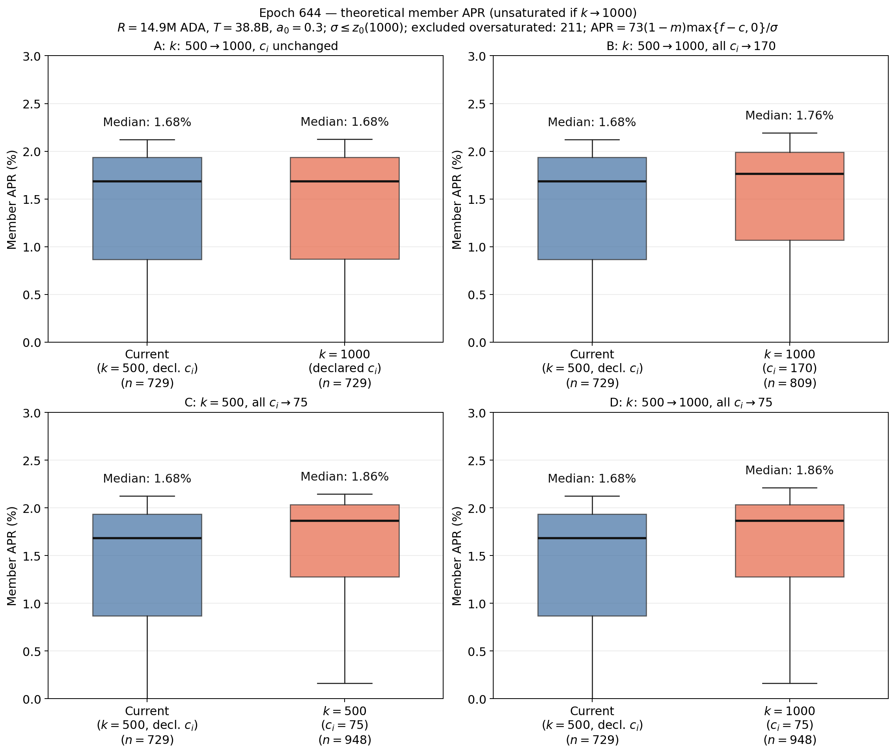

In Panel A, the effect on APR is negligible because most post-$k$-increase unsaturated pools sit far below the new saturation point, so shrinking $z_0$ barely moves the pledge term $a_0 \tilde p_i\cdot\frac{\tilde\sigma_i-\tilde p_i(z_0-\tilde\sigma_i)/z_0}{z_0}$, and most also have a low pledge share $p/\sigma$. Large absolute gains in $f$ are rare and concentrated in a few high-pledge pools near the new cap. Thus APR is not invariant to $k$ for unsaturated pools: it improves slightly when pledge is positive, but the improvement is too small to appear in the two-decimal median APR.

<!-- ##### Pool splitting by multi-pool operators

For an MPO controlling $n$ pools,

$$
\Pi^{\text{MPO}}(n)=\sum_{j=1}^{n}\Pi_j\big(k,c_{\min},\sigma_j',\hat p_j,m_j,c_j\big),
\qquad c_j\ge c_{\min}.
$$

Splitting is attractive if $\Pi^{\text{MPO}}(n+1)-\Pi^{\text{MPO}}(n)>0$. Raising $k$ increases the pressure to split because it lowers the saturation threshold, while lowering $c_{\min}$ reduces the fixed-cost penalty of maintaining additional pools. The combined reform therefore strengthens split incentives for medium-to-large operators, especially those able to reallocate pledge across multiple pools. -->

## Increments in $k$ and $a_0$

In this part, the discussion combines a higher $a_0$ (to induce more skin in the game) and a higher pool target $k$ (to reduce concentration among larger pools).

The individual effects can be found in the corresponding files for the [parameter k](../k/Incentive_Effects_k.md) and for the [parameter a0](../a0/Incentive_Effects_a0.md).

### Direct combined mechanical effects

#### Gross pool rewards $f(\sigma_i,p_i)$

Again, the gross pool rewards are given by:

$$
f(\sigma_i,p_i)=\frac{R}{1+a_0}\left[\widetilde{\sigma}_i+a_0\widetilde{p}_i\frac{\widetilde{\sigma}_i-\widetilde{p}_i\frac{z_0-\widetilde{\sigma}_i}{z_0}}{z_0}\right],
\qquad
\widetilde{\sigma}_i=\min\\{\sigma_i,z_0\\},\quad \widetilde{p}_i=\min\\{p_i,z_0\\}.
$$

<!-- With some abuse of notation, let $1/k$ denote the new saturation point under an increased value of $k$. -->
We next want to  evaluate the interaction effect between a marginal increment in $k$ and a marginal increment in $a_0$. In particular, we want to show that, in some cases, increasing $a_0$ reinforces the effect of a larger $k$.

When the pool remains below the saturation point ($p_i \le \sigma_i < 1/k$), the gross pool reward can be written as:

$$f_i = \frac{R}{1+a_0} \left[ \sigma_i + a_0\left( p_i k(\sigma_i-p_i) + p_i^2\sigma_i k^2 \right) \right],$$

therefore:

$$\frac{\partial f_i}{\partial k} = \frac{Ra_0}{1+a_0} \left[ p_i(\sigma_i-p_i) + 2p_i^2\sigma_i k \right] > 0 \quad (\text{for } p_i > 0).$$

The reason is that those unsaturated pools becomes closer to the saturation point once $k$ increases. 

Next, differentiating with respect to $a_0$ demonstrates that increasing $a_0$ reinforces the positive reward effect of raising $k$:

$$\frac{\partial^2 f_i}{\partial a_0 \partial k} = \frac{R}{(1+a_0)^2} \left[ p_i(\sigma_i-p_i) + 2p_i^2\sigma_i k \right] > 0$$

When the pool's stake exceeds the saturation point but its pledge does not ($p_i < 1/k \le \sigma_i$), the reward function becomes:

$$f_i = \frac{R}{1+a_0} \left( \frac{1}{k} + a_0 p_i \right)$$

Now, the marginal effect of $k$ is negative, but a higher $a_0$ mitigates this decline since:

$$\frac{\partial f_i}{\partial k} = -\frac{R}{(1+a_0)k^2} < 0, \qquad \frac{\partial^2 f_i}{\partial a_0 \partial k} = \frac{R}{(1+a_0)^2k^2} > 0$$

Finally, when both stake and pledge meet or exceed the saturation threshold ($1/k \le p_i \le \sigma_i$), the reward simplifies to 

$$f_i = \frac{R}{k}, \implies \frac{\partial f_i}{\partial k} = \frac{-R}{k^2}<0 \implies \frac{\partial^2 f_i}{\partial a_0 \partial k} = 0,$$ 

and the cross-effect vanishes entirely. 

Summarizing:

$$
\frac{\partial f_i}{\partial k} =  
\begin{cases} 
\frac{Ra_0}{1+a_0} \left[ p_i(\sigma_i-p_i) + 2p_i^2\sigma_i k \right] > 0, & \text{if } \sigma_i < 1/k, \\ 
-\frac{R}{(1+a_0)k^2} < 0,  & \text{if } p_i < 1/k \le \sigma_i, \\ 
\frac{-R}{k^2}<0, & \text{if } 1/k \le p_i \le \sigma_i. 
\end{cases}
$$

$$
\frac{\partial^2 f_i}{\partial a_0 \partial k} =  
\begin{cases} 
\dfrac{R}{(1+a_0)^2} \left[ p_i(\sigma_i-p_i) + 2p_i^2\sigma_i k \right] > 0, & \text{if } \sigma_i < 1/k, \\ 
\dfrac{R}{(1+a_0)^2k^2} > 0,  & \text{if } p_i < 1/k \le \sigma_i, \\ 
0, & \text{if } 1/k \le p_i \le \sigma_i. 
\end{cases}
$$

Previous local derivatives describe marginal adjustments around a fixed state. Now, we want to evaluate pools that cross saturation thresholds. For this purpose, we use a discrete shift from $(k_0, a_{0,0})$ to $(k_1, a_{0,1})$. In particular, consider pools located in the transition interval:

$$\frac{1}{k_1} \le \sigma_i < \frac{1}{k_0}, \qquad k_1 > k_0$$

These pools were unsaturated under $k_0$ but become saturated under $k_1$. Holding $a_0$ constant, the discrete reward difference becomes:

$$\Delta_k f_i = \frac{R}{1+a_0} \left[ \left(\frac{1}{k_1} - \sigma_i\right) + a_0 \left( \min\left\\{p_i, \frac{1}{k_1}\right\\} - A_i \right) \right]$$

where $A_i = p_i k_0(\sigma_i - p_i) + p_i^2 \sigma_i k_0^2$. The first term, $1/k_1 - \sigma_i \le 0$, captures the mechanical loss from the lower saturation ceiling, while the second term captures the pledge incentive.  When $p_i < 1/k_1$:

$$\Delta_k f_i = \frac{R}{1+a_0} \left[ -\left(\sigma_i - \frac{1}{k_1}\right) + a_0 p_i (1 - k_0 \sigma_i)(1 + k_0 p_i) \right]>0$$

if and only if:

$$\sigma_i - \frac{1}{k_1} < a_0 p_i (1 - k_0 \sigma_i)(1 + k_0 p_i)$$

The right-hand side is strictly increasing in $p_i$. Hence, a higher pledge expand the feasible stake interval $\frac{1}{k_1} \le \sigma_i < \bar{\sigma}_i$ over which a pool benefits from increasing $k$, where the upper boundary is defined as:

$$\bar{\sigma}_i = \frac{\frac{1}{k_1} + a_0 p_i (1 + k_0 p_i)}{1 + a_0 k_0 p_i (1 + k_0 p_i)}$$

On the other hand, from the expression for $\Delta_k f_i $, we have $\min\left\\{p_i, 1/k_1\right\\}=1/k_1$ when $p_i \ge 1/k_1$. Thus, in that case, a post-change pledge no longer yields marginal gains (as we saw with the local derivatives).

Supose now a simultaneous increase in $k$ and $a_0$ from $(k_0, a_{0,0})$ to $(k_1, a_{0,1})$. The discrete interaction effect is defined by the difference-in-differences:

$$I_i = \left[ f_i(k_1, a_{0,1}) - f_i(k_0, a_{0,1}) \right] - \left[ f_i(k_1, a_{0,0}) - f_i(k_0, a_{0,0}) \right]$$

For pools crossing the saturation threshold, $I_i > 0$. Increasing $a_0$ mitigates saturation losses or amplifies gains, directly explaining the rightmost panel of the heatmap (see below). In the heatmap, pools with $\sigma_i \ge 1/k_1 \approx 38.8\text{M}$ ADA and high pledge ($p_i \approx 35\text{M}$–$40\text{M}$ ADA) fall within the positive boundary $\sigma_i < \bar{\sigma}_i$, yielding a net gain of $+20\%$ to $+40\%$ (green region) despite reaching the lower saturation threshold. The next plot shows that results by showing the effect of both increments into a pool with different combinations of pledge and delegation.

  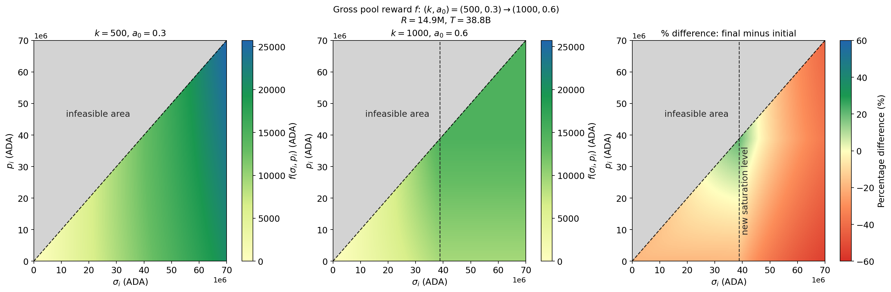

### Behavioral and equilibrium effects

As we did for the case with $k$ and `minPoolCost`, we here study the combined effects of $k$ and $a_0$ given the pools snapshot of epoch 644.

#### Delegators moving stake

To assess how parameter changes affect delegator incentives before market participants can respond (redelegations, new pools margins, new pools creation, etc), we evaluate pool desirability rankings using snapshot data from epoch 644. In the full pool population (first figure), increasing $k$ drastically disrupts relative desirability. As highlighted by the red markers, this change is heavily driven by newly oversaturated pools. Conversely, raising $a_0$ alone to $0.6$ (Panel C) preserves relative ranks. This could indicate that large pledges are uncommon, which would limit the reach of $a_0$ to only a few pools

  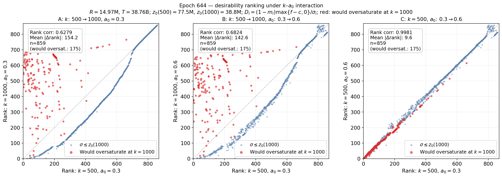

We next isolate pools that remain unsaturated ($\sigma \le z_0(1000)$). Examining this unsaturated cohort ($n = 684$) reveals where delegators would actually find stable incentives during a transition. As shown below, once oversaturated pools are excluded, raising $k$ alone (Panel A) produces a near-perfect rank preservation. Similar for the case of increasing $a_0$, with or without $k$ (Panels B and C). This demonstrates that the severe desirability change triggered by $k$ are mainly localized in pools exceeding the new cap, while the relative attractiveness among unsaturated options remains robust.

  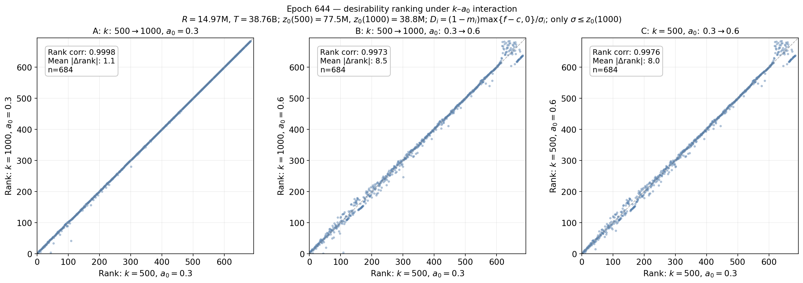

#### Pools viability. Entry or exit of pools.

We next assess the static impact over pool viability of parameter changes prior to any operator adjustment or delegator rebalancing. 

Although we already presented the equations above, we present them here again for completeness. Pool rewards comes from:

$$\Pi_i = \begin{cases} 
f_i, & f_i \le c_i, \\ 
c_i + (f_i - c_i)\left[m_i + (1 - m_i)\dfrac{\hat{p}_i}{\sigma_i}\right], & f_i > c_i ,
\end{cases}$$

and the (uniform) actual operational cost is

$$C^* = \frac{667\text{ USD/month}}{6\text{ epochs/month} \times 0.15\text{ USD/ADA}} \approx 741.1\text{ ADA/epoch}.$$

We evaluate  using actual margins, pledges, and delegations recorded in the epoch $644$ snapshot. As shown in the figure below, raising from $k=500$ to $k=1000$ in isolation (Panel A) slightly reduces the number of pools covering baseline operating expenditure ($C^* = 741.1\text{ ADA}$) from $274$ to $254$, primarily because newly oversaturated pools face capped rewards. Increasing the pledge influence parameter from $a_0 = 0.3$ to $0.6$ produces a more pronounced contraction: viable pools drop to $240$ under $k=500$ (Panel C) and further to $219$ when combined with $k=1000$ (Panel B). Therefore, in the absence of dynamic redelegation, strengthening pledge requirements (higher $a_0$) harms low-pledge pools while increasing $k$ penalizes pools that cross the lowered saturation cap.

  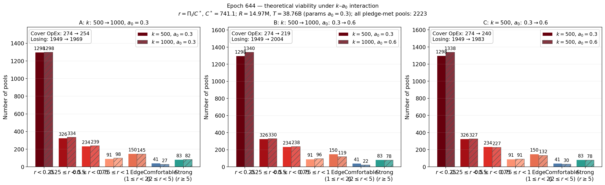

When restricting the analysis exclusively to the set of pools that remain unsaturated after raising $k$, the direct effect of $k$ disappears entirely. In contrast, increasing pledge influence to $a_0 = 0.6$ (Panels B and C) reduces viable pools identically. This confirms that the viability losses observed from higher $k$ in the full population are strictly an artifact of saturation capping on static stake distributions, whereas increasing $a_0$ exerts a direct, structural penalty on unsaturated pools with insufficient pledge.

  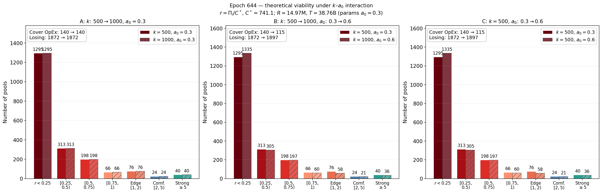

#### Changes in staking participation. Delegators APR.

To quantify delegator returns under higher saturation targets ($k$) and strengthened pledge influence ($a_0$), we estimate the annual percentage rate for pool $i$ as:

$$\text{APR}_i \approx 73(1-m_i)\frac{\max\{f(\sigma_i,p_i)-c_i,0\}}{\sigma_i},$$

using fixed macroeconomic network values of $R=14.9\text{M}$ ADA and $T=38.8\text{B}$ ADA. We apply these parameter shocks directly to the static distribution of margins, pledges, and delegations recorded at epoch $644$. We abstain of considering potential reallocation fo delegation and other player responses. We consider the subset of pools that remains unsaturated under the increased $k$, as these represent the viable targets that would naturally absorb migrating stake in subsequent rebalancing phases.

Under the baseline pledge influence parameter ($a_0 = 0.3$), doubling the target pool parameter from $k=500$ to $k=1000$ (Panel A) produces zero change in member returns, maintaining an identical median APR of $1.69\%$. On the other hand, increasing the pledge influence factor to $a_0 = 0.6$ (Panels B and C) triggers a noticeable systemic decline in member profitability: the median APR falls from $1.69\%$ to $1.34\%$. 

  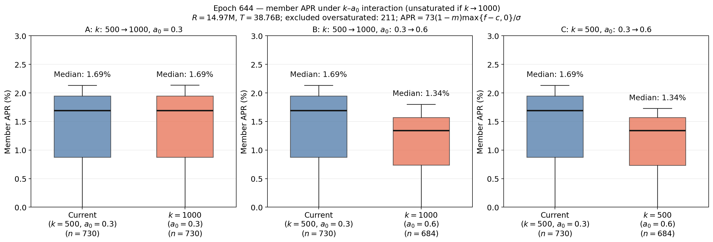

## Increment of $a_0$ with reduction of `minPoolCost`

The individual effects can be found in the corresponding files for [parameter $a_0$](../a0/Incentive_Effects_a0.md) and [`minPoolCost`](../minPoolCost/Incentive_Effects_minPoolCost.md).

### Direct combined mechanical effects

#### Gross pool rewards $f(\sigma_i,p_i)$

From the gross pool rewards:

$$
f(\sigma_i,p_i)=\frac{R}{1+a_0}\left[\widetilde{\sigma}_i+a_0\widetilde{p}_i\frac{\widetilde{\sigma}_i-\widetilde{p}_i\frac{z_0-\widetilde{\sigma}_i}{z_0}}{z_0}\right],
\qquad
\widetilde{\sigma}_i=\min\{\sigma_i,z_0\},\quad \widetilde{p}_i=\min\{p_i,z_0\},
$$

we plot

  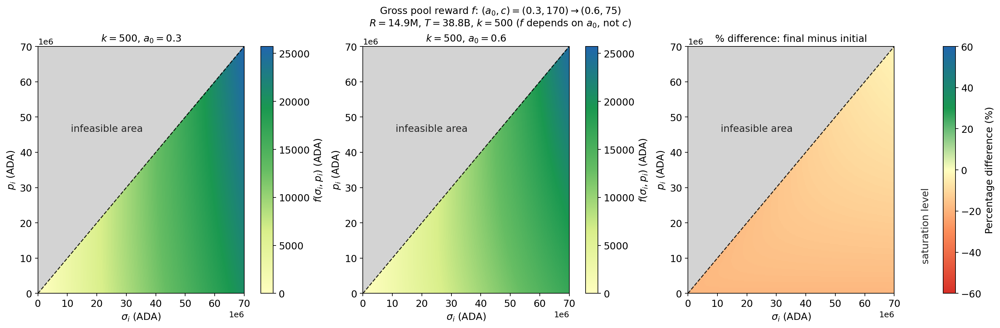

### Behavioral and equilibrium effects

As we did for the case with $k$ and `minPoolCost`, we here study the combined effects of increasing $a_0$ and reducing `minPoolCost` given the pool snapshot from epoch $644$.

#### Delegators moving stake

As we did above, we measure the incentive of delegators to migrate to another pool by considering the desirability $D_i$ of each pool. Following the theoretical model, delegators should choose those pools that are more desirable, and we define desirability as

$$
D_i(k, c_i)=(1-m_i)\frac{\max\{f(\sigma_i,p_i;k)-c_i,0\}}{\sigma_i}.
$$

The four-panel comparison demonstrates that standardizing and lowering the declared fixed cost ($c_i$) is a far stronger driver of pool rank mobility than increasing the pledge factor ($a_0$). Simply raising the pledge factor while preserving declared costs (Panel A) leaves relative desirability rankings virtually unchanged. In contrast, reducing fixed costs across the network (Panels B, C, and D) dramatically increases rank dispersion, particularly for mid-tier pools.

  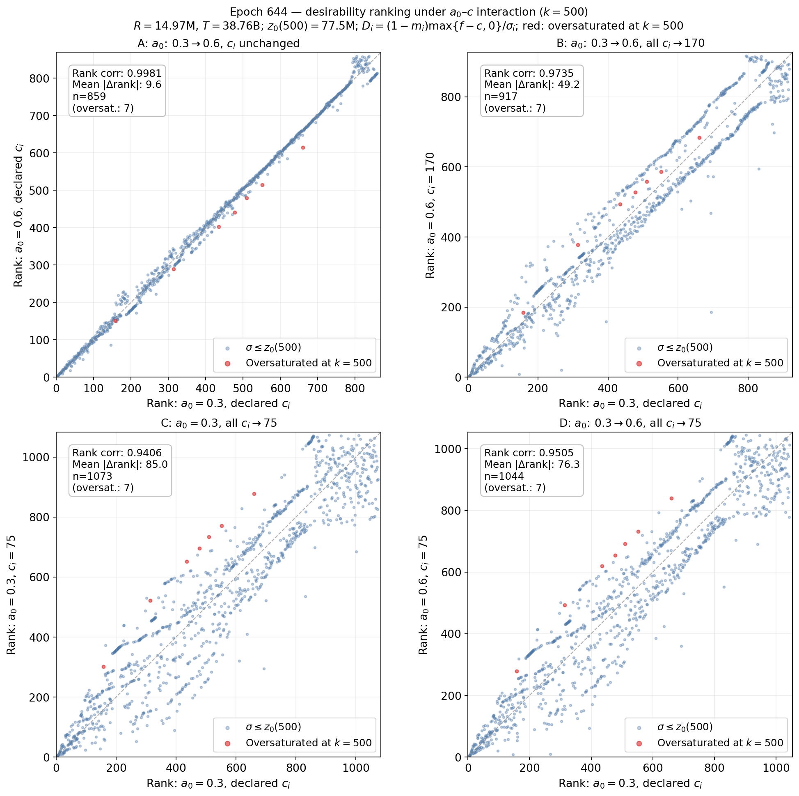

#### Pools viability. Entry or exit of pools.

From the operator perspective, the vast majority of pools already operate at a deficit under baseline conditions, failing to cover basic operational expenses ($C^*$). Increasing the pledge factor $a_0$ further concentrates operator rewards into a small subset of heavily pledged pools, driving more marginal pools into unprofitability. When low fixed costs are used, operator margins contract even more. Therefore, lower declared fixed costs combined with higher pledge ($a_0$) severely degrade the economic viability of smaller and mid-sized stake pool operators, making long-term sustainability attainable only for elite, high-pledge, and heavily delegated operations. Note, however, that our model fixes each pool's declared cost at $c_i=\text{minPoolCost}$. Smaller pools that rely heavily on fixed fee revenue would not voluntarily lower this parameter. Yet, as demonstrated in the next subsection and in the desirability discussion, maintaining higher fixed fees directly depresses delegator APR, eroding the pool's competitive appeal.

  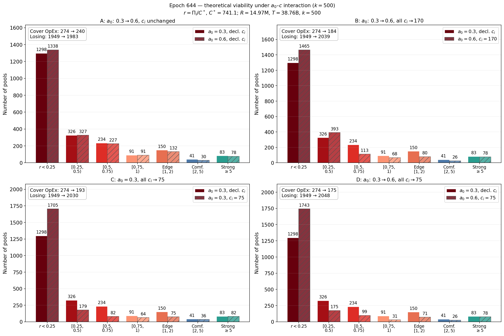

Removing oversaturated pools does not alter the dynamic mentioned above.

  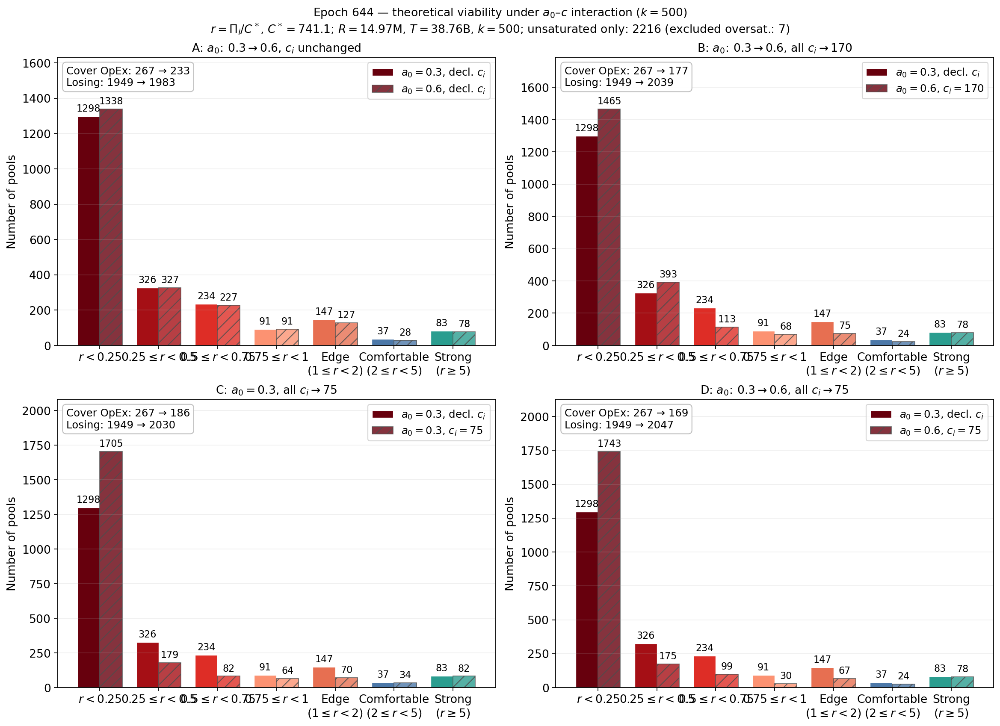

#### Changes in staking participation: delegator APR

These four boxplots illustrate how adjusting the pledge influence factor ($a_0$) and pool fixed costs ($c_i$) affect delegator returns (APR) under fixed Cardano network parameters ($k=500$, $R=14.97\text{M}$, $T=38.76\text{B}$).

Increasing the pledge influence factor from $a_0=0.3$ to $a_0=0.6$ without adjusting pool costs causes a substantial decline in overall delegator APR (Panel A). Because higher $a_0$ values shift reward distribution toward operator pledge, this drop suggests that the majority of active pools do not hold enough pledge to benefit from the change, thereby penalizing delegator returns across most pools under current configurations.

Conversely, lowering pool fixed costs counteracts this decline: reducing fixed costs across all pools to $c_i=75$ under the current $a_0$ increases median APR (Panel C), while pairing low fixed costs ($c_i=170$ or $c_i=75$) with $a_0=0.6$ cushions the yield drop for delegators (Panels B and D).

  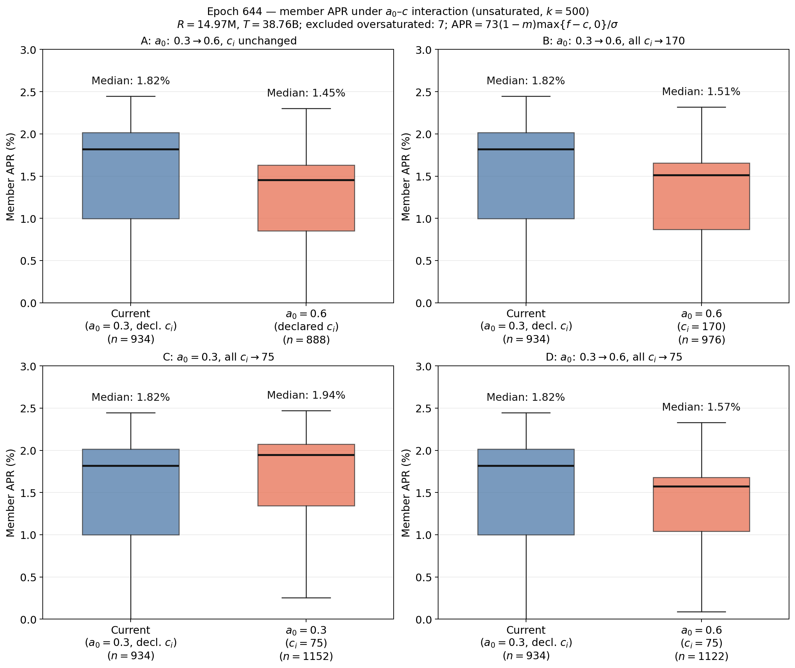

