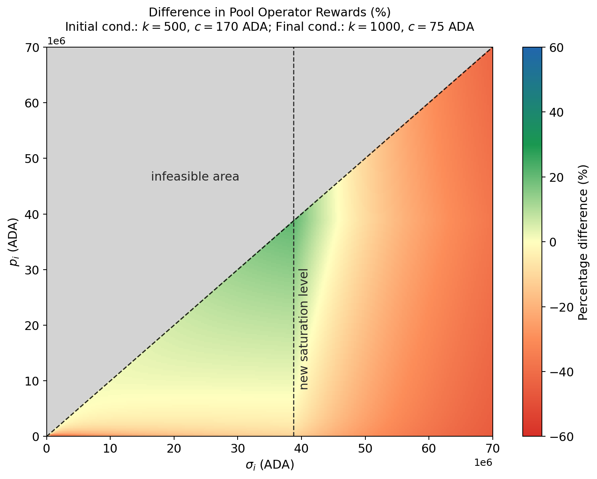
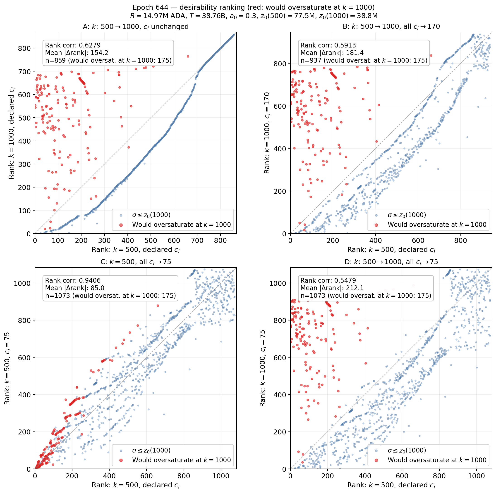
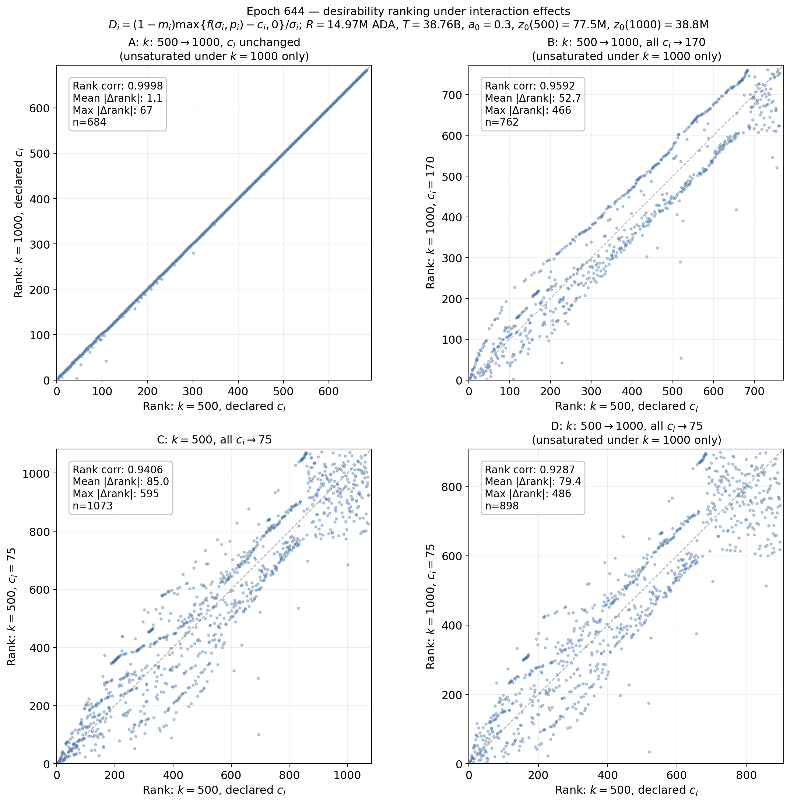
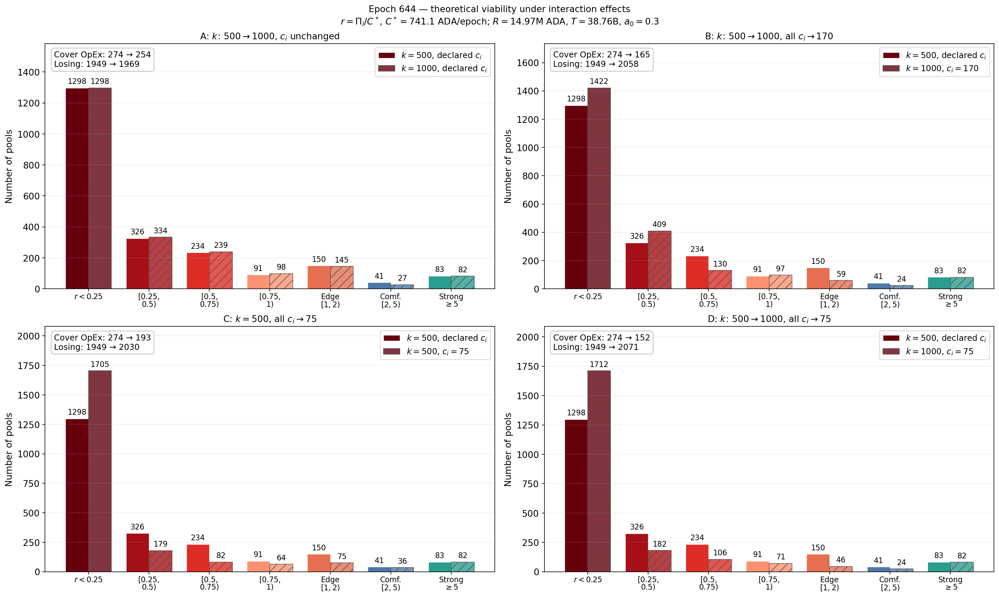

For the numerical analysis in this section, we use the parameter values below unless stated otherwise. These values may differ from the snapshot values reported in [Parameter-Landscape.md](../../Parameter-Landscape.md), because this comparative-statics exercise is anchored to a single reference state.

| Symbol | Parameter | Value |
| --- | --- | --- | 
| $R$ | Reward pot | $14.9M$ ADA| 
| $T$ | Total ADA supply | $38.8B$ ADA | 
| $k$ | Target number of stake pools | 500 | 
| $a_0$ | Pledge influence. | 0.3 | 
| $c_{min}$ | Minimum fixed cost (`minPoolCost`). | 170 ADA |
| $m_i$ | Operator margin/commission deducted from delegator rewards. | 5%  |
| $\rho$ | Reserve decay rate.  | 0.3%  |
| $\tau$ | Treasury share.| 20% | 

# Current design

This part studies the combined effects of changes in two or more parameters of the current rewards scheme design.

## k with minPoolCost ($c_{\min}$)

### Direct combined mechanical effects

The discussion combines a lower minimum fixed cost, $c_{\min}$, with a higher pool target, $k$. In the reward-sharing model, the two parameters act on different margins: $k$ changes the saturation threshold $z_0(k)=1/k,$ while $c_{\min}$ changes the feasible declared fixed cost $c_i$. 

#### Gross pool rewards $f(\sigma_i,p_i)$

Gross pool rewards are

$$
f(\sigma_i,p_i)=\frac{R}{1+a_0}\left[\widetilde{\sigma}_i+a_0\widetilde{p}_i\frac{\widetilde{\sigma}_i-\widetilde{p}_i\frac{z_0-\widetilde{\sigma}_i}{z_0}}{z_0}\right],
\qquad
\widetilde{\sigma}_i=\min\\{\sigma_i,z_0\\},\quad \widetilde{p}_i=\min\\{p_i,z_0\\}.
$$

Note that $c_{\min}$ does not enter $f(\cdot)$. Hence, there is not direct combined effect over $f_i$. The [incentive effects of a change in k](k/Incentive_Effects_k.md) analyses the change of $k$ over $f_i$. 

#### Operator gross revenue $\Pi_i$

The pool operator gross revenue function is

$$\Pi_i=\begin{cases} c_i + (f(\sigma_i,p_i)-c_i) \left[m_i +(1-m_i)\frac{\hat{p}_i}{\sigma_i}\right], & \text{if }  f(\sigma_i,p_i)>c_i, \\ 
f(\sigma_i,p_i), & \text{otherwise} \end{cases}$$

where $\hat{p}_i$ is the operator's active pledge (the stake/delegation owned by the operator). We assume declared and active pledge coincide $p_i=\hat p_i.$

Note that 

$$
\frac{\partial \Pi_i}{\partial c_i}=1-s_i\ge 0,\qquad s_i= m_i+(1-m_i)\frac{\hat p_i}{\sigma_i}\in[0,1].
$$

After a combined shock ($k\uparrow$, $c_{\min}\downarrow$), will all pools be benefited? Suppose a combined shock while $(m_i,\hat p_i,\sigma_i)$ remain fixed. and let

$$
\Delta f_i=f_i' - f_i ,
\qquad
\Delta c_i=c_i'-c_i\le 0.
$$

Then

$$
\Delta\Pi_i=s_i\,\Delta f_i+(1-s_i)\,\Delta c_i>0 \quad \iff
s_i(\Delta f_i-\Delta c_i)>-\Delta c_i.
$$

When $\Delta f_i>\Delta c_i$, this gives a threshold on $s_i$:

$$
s_i>s_i^*\equiv\frac{-\Delta c_i}{\Delta f_i-\Delta c_i}.
$$

Using $s_i=m_i+(1-m_i)q_i$ where $q_i\equiv\hat p_i/\sigma_i=p_i/\sigma_i$ (since we assumed $p_i=\hat p_i$), the equivalent pledge-share threshold is

$$
q_i > q_i^{\*}\equiv\frac{s_i^{\*}-m_i}{1-m_i} =\frac{\frac{-\Delta c_i}{\Delta f_i-\Delta c_i}-m_i}{1-m_i}.
$$

Interpretation: pools far from the initial saturation point can have $\Delta f_i>0$ after $k$ increases, so they may offset the revenue loss from lowering $c_i$. Pools with low $q_i$ (and low effective $s_i$) are less able to offset that loss and are more likely to be harmed by the combined change, and they will probably not choose a lower $c_i$ after a reduction in `minPoolCost`.

> *Example:* As a numerical illustration, take the baseline margin $m_i=5\\%$ and a binding fixed-cost reduction from $170$ ADA to $75$ ADA, so
> $$\Delta c_i=75-170=-95\text{ ADA}.$$
> Suppose that, for a given pool below the new saturation point, the direct effect of increasing $k$ from $500$ to $1000$ raises gross rewards by
> $$\Delta f_i=150\text{ ADA}.$$
> Then the operator-revenue threshold becomes
> $$s_i^\*=\frac{95}{150+95}=\frac{95}{245}\approx 0.388,$$
> and, using $m_i=0.05$,
> $$q_i^\*=\frac{0.388-0.05}{0.95}\approx 0.356.$$
> Therefore, under this example, a pool benefits mechanically from the combined shock only if its pledge share satisfies $p_i/\sigma_i=\hat p_i/\sigma_i\gtrsim 35.6\%$. Pools with lower pledge share are still hurt in operator revenue terms, even though their gross reward rises with the higher $k$.

The following heatmap illustrates the previous discussion for different combinations of pledge and delegation.

  

### Behavioral and equilibrium effects

##### Delegators moving stake

From a purely rational perspective (more precisely, following the model in ), the delegators choose pools based on pools' desirability $D_i(k)$ that may change when there is a change in $k$ and $c_i$ (recall that, while the former is a change imposed by the protocol, the latter is a decision of each pool):

$$
D_i(k, c_i)=(1-m_i)\frac{\max\\{f(\sigma_i,p_i;k)-c_i,0\\}}{\sigma_i}.
$$

Once $k$ increases, the saturation threshold falls and many pools become oversaturated, so delegators in those pools may have incentives to redelegate. The figure shows the immediate change in pools' desirability rankings when $k$ increases from $500$ to $1,000$, before any redelegation occurs. The increase in $k$ alone already produces substantial reshuffling of the ranking (Panel A), driven especially by pools that become oversaturated, whose desirability deteriorates sharply relative to unsaturated pools. By comparison, reducing declared fixed costs (when `minPoolCost` is reducing and assuming that all pools choose $c_i=$`minPoolCost`) while keeping $k=500$ has a much smaller effect on the ranking (Panel C). When the increase in $k$ is combined with a common lower fixed cost (Panels B and D), the ranking changes even more. Overall, the figure suggests that the change in the saturation threshold is the main source of the immediate redistribution of pool competitiveness, while changes in fixed costs can further amplify these effects.

  

To isolate whether a higher $k$ affects pool competitiveness beyond the mechanical effect of creating newly oversaturated pools, the following figure repeats the previous exercise after excluding pools that would be oversaturated under $k=1,000$. This restriction is informative because it separates the effect of the lower saturation threshold from changes in desirability among pools that remain unsaturated. Panel A shows that, for these pools, increasing $k$ alone leaves the desirability ranking virtually unchanged. This indicates that the large reshuffling observed in the previous figure is driven overwhelmingly by pools crossing the new saturation threshold, rather than by a general change in the relative attractiveness of unsaturated pools. By contrast, reducing declared fixed costs produces substantially more reordering (Panels B–D), showing that changes in $c_i$ can alter relative competitiveness even among pools unaffected by saturation. Thus, the two parameters operate through different channels: a higher $k$ mainly changes rankings through saturation, whereas lower fixed costs can reshuffle rankings more broadly among unsaturated pools.

  

##### Pools viability. Entry or exit of pools.

We study the pools viability given the current distribution of stakes, and pools snapshot. We take the case of increasing $k$ from $500$ to $1,000$, and reducing the `minPoolCost` from $170$ ADA to $75`ADA. 

Pool rewards are determined by the standard function:

$$\Pi_i = \begin{cases} f_i, & f_i \le c_i \\ c_i + (f_i - c_i)\left[m_i + (1 - m_i)\dfrac{\hat{p}_i}{\sigma_i}\right], & f_i > c_i \end{cases}$$

using epoch 644 snapshots for margins ($m_i$), total stake ($\sigma_i$), pledge ($\hat{p}_i$), and declared fixed costs ($c_i$). Rather than assuming truthful cost reporting, we assign all pools a uniform operational cost:

$$C^* = \frac{667\text{ USD/month}}{6\text{ epochs/month} \times 0.15\text{ USD/ADA}} \approx 741.1\text{ ADA/epoch}$$

The next plot shows the pools' viability comparison for $k=500$ and $k=1,000$ before any redelegation occurs, for different fixed cost declaration. Panel A shows only the increment in $k$ with the declared fixed cost of the snapshot. Panels B assumes all pools declared the minimum feasible fixed cost $c_i=170$ ADA. Panels C-D consider the case in which the `minPoolCost`was reduced to $75$ ADA and that all pools declare $c_i=75$ ADA. Note the worsen in the viability across all groups.

  

| Panel | Scenario | Cover | Losing |
|:---|:---|---:|---:|
| Baseline | $k=500$, declared $c_i$ | 274 | 1949 |
| A | $k\to1000$, $c_i$ unchanged | 254 | 1969 |
| B | $k\to1000$, all $c_i\to170$ | 165 | 2058 |
| C | $k=500$, all $c_i\to75$ | 193 | 2030 |
| D | $k\to1000$, all $c_i\to75$ | 152 | 2071 |

Lowering $c_i$ diminishes the operator's net payoff $\Pi_i$ by allocating a larger share of the total fee rewards $f_i$ to delegators, thereby reducing the number of pools capable of covering baseline operating costs $C^*$. Concurrently increasing the target pool parameter $k$ exacerbates this shortfall.

A primary driver of this result is the inclusion of all pools without accounting for stake rebalancing, particularly those that become saturated as $k$ increases. In the absence of redelegation, two competing dynamics emerge. First, newly oversaturated pools suffer a reduction in fee rewards $f_i$ due to saturation caps. Second, in a dynamic setting, this reward dilution would trigger delegators to migrate toward unsaturated pools, potentially restoring their viability.

Isolating pools that remain unsaturated throughout isolates the parameter effects: increasing $k$ alone has no impact on pool viability, whereas lowering $c_i$ systematically reduces the number of pools covering baseline costs $C^*$, as detailed in the table below.

| Panel | Scenario | Covering $C^*$ | Deficit |
|:---|:---|---:|---:|
| Baseline | $k=500$, declared $c_i$ | 140 | 1872 |
| A | $k\to1000$, $c_i$ unchanged | 140 | 1872 |
| B | $k\to1000$, all $c_i\to170$ | 99 | 1913 |
| C | $k=500$, all $c_i\to75$ | 90 | 1922 |
| D | $k\to1000$, all $c_i\to75$ | 90 | 1922 |

##### Changes in staking participation. Delegators APR

XXXXXX11111XXXXXX

##### Pool splitting by multi-pool operators

For an MPO controlling $n$ pools,

$$
\Pi^{\text{MPO}}(n)=\sum_{j=1}^{n}\Pi_j\big(k,c_{\min},\sigma_j',\hat p_j,m_j,c_j\big),
\qquad c_j\ge c_{\min}.
$$

Splitting is attractive if $\Pi^{\text{MPO}}(n+1)-\Pi^{\text{MPO}}(n)>0$. Raising $k$ increases the pressure to split because it lowers the saturation threshold, while lowering $c_{\min}$ reduces the fixed-cost penalty of maintaining additional pools. The combined reform therefore strengthens split incentives for medium-to-large operators, especially those able to reallocate pledge across multiple pools.

XXXXXXXXXXXXXXX

#### Behavioral deviations from the rational benchmark

We now keep the same five channels but allow market frictions, bounded rationality, and coordination limits.

##### Delegators moving stake

Observed migration is dampened by search costs and inattention:

$$
\Delta\sigma_i^{\text{obs}}=\lambda_i\,\Delta\sigma_i^D,
\qquad 0<\lambda_i<1.
$$

This matters more under the combined reform because the new destination set is larger but also more fragmented; even if the rational benchmark favors reallocation, actual migration can remain slow if acceptable alternatives are hard to find.

##### Operators changing pledge, margin, or declared fixed cost

With partial adjustment, operators move gradually toward the new optimum:

$$
c_{i,t+1}=\max\{c_{\min},\;c_{i,t}+\rho_c(c_i^{\*}-c_{i,t})\},
$$
$$
m_{i,t+1}=m_{i,t}+\rho_m(m_i^{\*}-m_{i,t}),
\qquad
\hat p_{i,t+1}=\hat p_{i,t}+\rho_p(\hat p_i^{\*}-
\hat p_{i,t}),
$$

with $0<\rho_c,\rho_m,\rho_p\le 1$. In practice, this means that fee cuts, pledge reshuffling, and pool splitting need not happen at the same speed.

##### Entry or exit of pools

Hysteresis can be represented by thresholds around participation:

$$
U_i(k,c_{\min},\sigma_i')<-H_i^{\text{exit}},
\qquad
U_i^{\text{entry}}(k,c_{\min},\sigma_i')>H_i^{\text{entry}},
$$

with $H_i^{\text{entry}},H_i^{\text{exit}}>0$. This allows weak pools to persist longer than the rational benchmark predicts, especially when delegators are slow to reallocate from large pools after $k$ increases.

##### Pool splitting by multi-pool operators

Include coordination costs in expansion value:

$$
V^{\text{split}}(n)=\Pi^{\text{MPO}}(n)-K(n),
$$

where $K(n)$ is increasing and convex. The combined proposal can make splitting attractive, but only for operators with enough organizational capacity to keep the coordination cost below the added revenue from a larger $k$ and a lower fixed-cost floor.

##### Changes in staking participation

If delegators overweight short-run gains or losses, participation reacts to a salience-weighted objective:

$$
\Delta S_t=\chi_s\big(r_t-r_{\text{alt},t}\big)+\chi_l\,\mathbb E_t\!\left[\sum_{h\ge 1}\beta^h\big(r_{t+h}-r_{\text{alt},t+h}\big)\right],
$$

with $\chi_s>\chi_l$ under short-term salience. This can delay the full reallocation implied by the rational benchmark, even when the combined reform improves the long-run positioning of smaller pools.

## k with a0

## rho with tau

# Interaction with potential new parameters

## a0 with pledge leverage L
