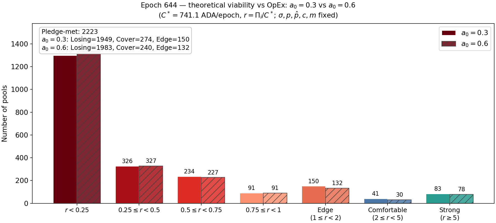
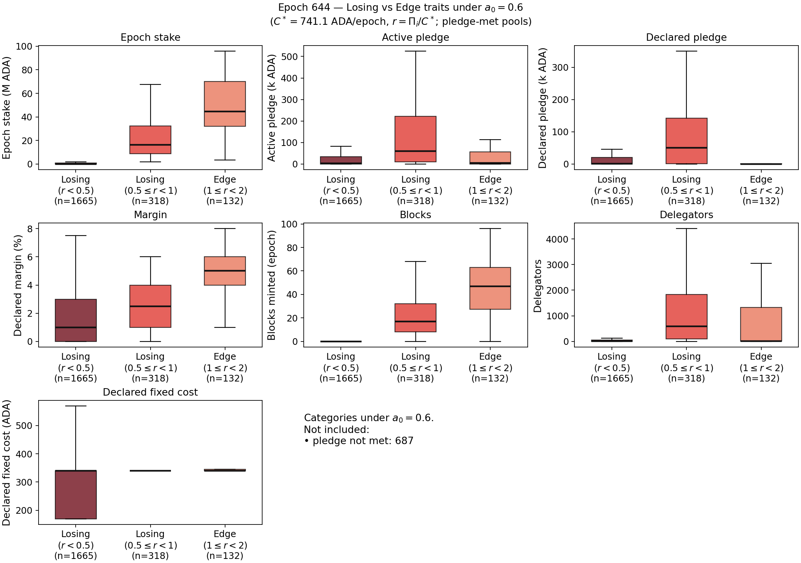
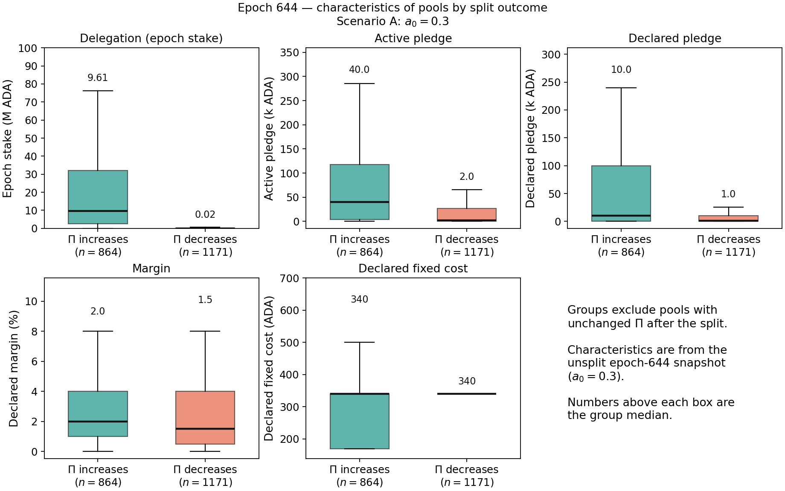
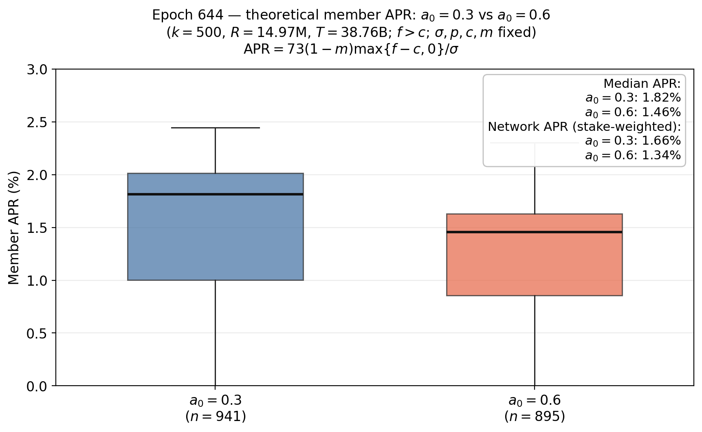
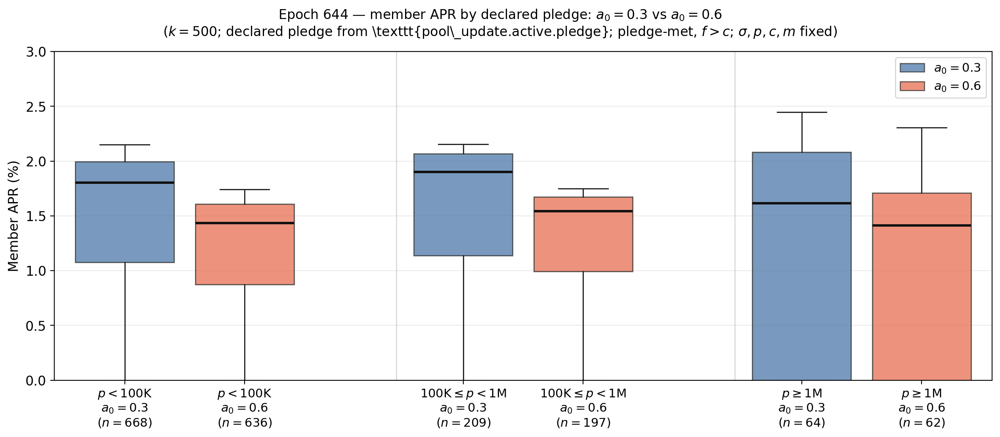

# Incentive effects of changing $a_0$

## Parameter values at the current state
For the numerical analysis in this section, we use the parameter values below unless stated otherwise. These values may differ from the snapshot values reported in [Parameter-Landscape.md](../../Parameter-Landscape.md), because this comparative-statics exercise is anchored to a single reference state.

| Symbol | Parameter | Value |
| --- | --- | --- | 
| $R$ | Reward pot | $14.9M$ ADA| 
| $T$ | Total ADA supply | $38.8B$ ADA | 
| $k$ | Target number of stake pools | 500 | 
| $a_0$ | Pledge influence. | 0.3 | 
| $c_{min}$ | Minimum fixed cost (`minPoolCost`). | 170 ADA |
| $m_i$ | Operator margin/commission deducted from delegator rewards. | 5%  |
| $\rho$ | Reserve decay rate.  | 0.3%  |
| $\tau$ | Treasury share.| 20% | 

## Design

The parameter $a_0$ plays a central role in the reward scheme by determining how strongly a pool’s declared pledge ($p_i$) influences its gross pool rewards. $a_0$ incentivizes pool operators to commit their own capital—giving them "skin in the game"—and serves as a primary defense against Sybil attacks.

Without the $a_0$ pledge incentive, an operator with little capital may attract large amounts of delegation or spin up multiple pools while committing negligible stake of their own. A higher $a_0$ makes these strategies costly: an operator attempting to split their pool into multiple ones while keeping them attractive for delegators, must also divide their declared pledge. However, the latter precisely reduces the reward potential—and thus the attractiveness to delegators—of each pool. Ultimately, setting $a_0$ involves a fundamental trade-off between Sybil resistance and accessibility: A higher $a_0$ strengthens Sybil resistance and discourages heavily leveraged or multi-pool strategies, but it inherently favors wealthy operators, raising barriers to entry for those with limited capital. A lower $a_0$ lowers barriers to entry and allows pools to compete more on performance, fees, and operational efficiency, but it provides weaker protection against operators controlling large amounts of delegated stake with little declared pledge.

## Direct mechanical effects 
In this section we consider the direct effects of changing the parameter while holding everything else equal (ceteris paribus). 

The gross reward of pool $i$ is given by:

$$f(\sigma_i,p_i) = \frac{R}{1+a_0} \left[ \tilde{\sigma}_i + a_0\tilde{p}_i \frac{\tilde{\sigma}_i-\tilde{p}_i\frac{z_0-\tilde{\sigma}_i}{z_0}}{z_0} \right],$$

where
 $$\tilde{\sigma}_i = \min\\{\sigma_i, z_0\\}, \qquad \tilde{p}_i = \min\\{p_i, z_0\\},$$

and **the pool operator $i$ utility** is:

$$
U_i=
\begin{cases}
\underbrace{c_i+(f(\sigma_i,p_i)-c_i)\left[m_i +(1-m_i)\frac{\hat{p}_i}{\sigma_i}\right]}_{\Pi_i=\text{Operator gross revenue}}-\hat{c}_i, & \text{if } f(\sigma_i,p_i)>c_i, \\
f(\sigma_i,p_i)-\hat{c}_i, & \text{otherwise}
\end{cases}
$$

where $\hat{p}_i$ denotes the operator's active pledge, m_i\in[0,1)$ the margin or pool's commission, $c_i$ the declared fixed cost, and $\hat{c}_i$ the actual fixed cost.

> **Note:** The parameter $z_0$, and variables $\sigma_i$ and $p_i$ enter the formulas as relative fractions of the total supply $T$ (for example, $z_0 = T/k$ simplifies to $1/k$ when normalized), whereas $R$ is measured in absolute ADA. With a slight abuse of notation, we use the same symbols regardless of whether these values are normalized. Consequently, the formula yields the fraction of the reward pot $R$ awarded to pool $i$ in that epoch. A pool whose active pledge falls below its declared pledge receives $f(\sigma_i, p_i) = 0$.

### Gross pool rewards

When $a_0=0$, declared pledge has no role and the gross pool reward depends only in the delegation/staking level:

$$f(\sigma_i,p_i) = R\sigma_i$$

Increasing $a_0$ has a dual effect. From one side, pools with more declared pledge receive higher rewards than otherwise comparable low-declared-pledge pools. However, a higher $a_0$ also reduces the fraction of $R$ to distribute. The second effect is stronger:

$$\frac{\partial f}{\partial a_0}v= -\frac{R}{(1+a_0)^2} \left[ \tilde{\sigma}_i \left( 1-\frac{\tilde{p}_i}{z_0} \right)+\frac{\tilde{p}_i^2}{z_0}\left(1-\frac{\tilde{\sigma}_i}{z_0}\right)\right]\leq 0
$$

with equality when $$\tilde{p}_i=\tilde{\sigma}_i=z_0.$$

For a fixed level of declared pledge, this negative impact is more significant for larger pools (left plot). <!-- At first glance, the right plot may suggest that an operator can mitigate this effect by replacing delegations with declared pledge, but the operator-revenue analysis below shows that this mitigation is generally incomplete. -->

  
  

### Operator gross revenue

Analyzing the pool reward function $f(\sigma_i,p_i)$ in isolation gives an incomplete picture of an operator’s position. While a larger declared pledge cushions the impact of increasing $a_0$ by substituting delegation with declared pledge, this smoothing applies only to **gross pool rewards $f(\sigma_i,p_i)$**. To assess the true direct mechanical impact on pool operators, we must instead evaluate **operator gross revenue ($\Pi_i$)**.

The following heatmaps illustrate this dynamic. Total pool stake $\sigma_i$ is mapped along the $x$-axis and operator declared pledge $p_i$ along the $y$-axis, with the grey region indicating the infeasible domain ($p_i > \sigma_i$). The left and center panels show operator revenue $\Pi_i$ under $a_0 = 0.3$ and $a_0 = 0.6$, respectively (evaluated at $k=500$, $c_i=170\text{ ADA}$, and $m_i=5\%$), while the right panel highlights the direct net change ( $\Delta \Pi_i = \Pi_i(a_0=0.6) - \Pi_i(a_0=0.3)$ ). In this difference plot, red gradients signify a net reduction in operator revenue ($\Delta \Pi_i < 0$), with darker shades marking larger absolute losses.

The difference heatmap shows that, over a broad range of stake levels, increasing $p_i$ does not fully compensate for an increase in $a_0$. To understand why, first consider a saturated pool ($\sigma_i=z_0$):
  
$$f(z_0,p_i) = \frac{R}{1+a_0}\bigl(z_0+a_0 p_i\bigr).$$

Increasing $a_0$ introduces two competing mechanical forces on $f(z_0,p_i)$:
1. The scaling factor $\frac{1}{1+a_0}$ reduces baseline rewards.
2. The term $a_0p_i$ gives greater weight to declared pledge, mitigating the previous effect as $p_i$ increases and fully offsetting it when $p_i=z_0$.

For operator gross revenue, we have

$$\Pi_i=c_i+\left[m_i+(1-m_i)\frac{\hat p_i}{\sigma_i}\right]\cdot(f(\sigma_i,p_i)-c_i).$$

where $\hat p_i$ is active operator pledge.

Hence, the change in **operator gross revenue** (and, equivalently, in operator utility/profit if $c_i$ and $\hat{c}_i$) after the change in $a_0$ is:

$$\Delta \Pi_i=\left[m_i+(1-m_i)\frac{\hat p_i}{\sigma_i}\right]\Delta f(\sigma_i,p_i)=\Delta U_i.$$
    
Suppose $\hat p_i=p_i$ and suppose we want to compare the effect of the increment in $a_0$ over two identical pools but with different pledge. As an example, let $\sigma_i = 50M$ ADA, $k=500$, $c_i=170$, and $m_i=5\\%$. Suppose $a_0$ increases from $0.3$ to $0.6$:

| $p_i/\sigma_i$ | $\Delta f$ | $\Delta\Pi_i$ |
|---|---|---|
| $0$ | $-2922$ | $-146$ |
| $0.5$ | $-2140$ | $-1123$ |
| $1$ | $-1690$ | $-1690$ |

When the pledge rises, the share $m_i+(1-m_i)\frac{p_i}{\sigma_i}$ rises toward $1$. Thus, even though the absolute reduction in pool gross rewards, $|\Delta f|$, becomes smaller, the operator bears a larger share of that reduction. Consequently, $\Delta\Pi_i$ can become more negative even while $\Delta f$ becomes less negative.

Bottom line: Higher pledge cushions the decline in the pool gross reward function $f(\sigma_i,p_i)$ following an increase in $a_0$. For the operator, however, higher pledge also means bearing a larger share of the remaining reward reduction. Operator gross revenue can therefore fall by more at high pledge, even though the decline in total pool rewards is smaller.

### Delegator return per unit of stake

The following heatmaps show the return received by delegators per unit of stake

$$(1-m_i)\frac{\max\\{f(\sigma_i,p_i)-c_i,0\\}}{\sigma_i}.$$

Total pool stake $\sigma_i$ is displayed on the $x$-axis and operator pledge $p_i$ on the $y$-axis, while the grey region represents the infeasible domain $p_i > \sigma_i$. The left and center panels report delegator returns under $a_0 = 0.3$ and $a_0 = 0.6$, respectively. The right panel shows the direct change resulting from the increase in $a_0$. Red regions indicate a reduction in delegator returns, with darker shades representing larger losses.

The heatmap shows that increasing $a_0$ generally reduces delegator returns per unit of stake, but that this negative effect becomes smaller as pledge increases. This contrasts with operator gross revenue, because the change in delegator return per unit of stake depends only on the change in $f(\sigma_i,p_i)$.

This can be seen analytically. After deducting the declared fixed cost and the operator margin, the return received by delegators per unit of stake is

$$r_i^{D} = (1-m_i) \frac{\max\left\\{f(\sigma_i,p_i)-c_i, 0\right\\}}{\sigma_i},$$

and, when $a_0$ changes, the direct change in the delegator return is

$$\Delta r_i^{D} = \frac{1-m_i}{\sigma_i} \Delta f(\sigma_i,p_i).$$

Since $f(\sigma_i,p_i)$ increases with $p_i$, a higher pledge mitigates the negative effect of an increase in $a_0$ on delegator returns, even though it may amplify the reduction in operator gross revenue.

  
### Reward-pot and treasury flows

The parameter $a_0$ directly influences reward pot dynamics and treasury flows. In particular, it normalizes the total reward $R$ distributed among pools by a factor of roughly $1 + a_0$. Consequently, larger values of $a_0$ reduce the overall amount of $R$ paid out to pools, directing the remaining fraction back to the reserve. By allowing more rewards to remain unspent, an increase in $a_0$ slows reserve depletion and enhances the long-term sustainability of the reward model.

An analysis of epoch 644 demonstrates how varying $a_0$ influences reserve reward retention during that specific period. The analysis considers the actual distribution of stake and pledge across the different pools (see [Pools Data e644](../../staking_pools_full_epoch_644.csv)), and calculates the gross reward $f(\sigma_i,p_i)$ per each pool for different values of $a_0$ (see [Pool Rewards vs a0](../../pools_f_vs_a0_epoch_644.csv) and [R Savings vs a0](../../savings_pct_of_R_vs_a0_epoch_644.csv) ). The effect exhibits slight concavity: for small adjustments, each $1\%$ increase in $a_0$ yields a reward savings of roughly $0.1\%$.

  

## Behavioral and equilibrium effects

This section identifies potential behavioral (or second-order) effects—primarily concerning delegator and operator decisions **given the current state**.

Changing $a_0$ can affect not only current rewards but also the rank of pools, how much pledge they commit, how they set fees, and where delegation ultimately concentrates.
    
### Rational behavior

We start from a frictionless baseline consistent with the reward-sharing analysis: forward-looking (non-myopic) players, truthful fixed-cost declaration ($c_i=\hat c_i$), and no strategic changes in declared cost after the parameter shock.

Under this baseline, ranking for competitive pools is driven by saturated outcomes:

$$
P_i(a_0)=f(z_0,p_i)-c_i,
\qquad
D_i(a_0)=(1-m_i)P_i(a_0) \quad (\text{if } f(z_0,p_i)>c_i ).
$$

where,

$$
f(z_0,p_i)=\frac{R}{1+a_0}(z_0+a_0p_i),
\qquad
\frac{\partial f(z_0,p_i)}{\partial a_0}=\frac{R(p_i-z_0)}{(1+a_0)^2}\le 0.
$$

Hence, increasing $a_0$ lowers gross pool rewards $f()$, but less so for high-pledge pools. As a consequence, a change in $a_0$ may change the rank of pools, induce redelegation, and operators responses. 

#### Operators changing pledge, margin or declared fixed costs

Since the parameter $a_0$ favours those pools with more declared pledge, we could ask whether those pools with high declared pledge choose lower fees (margin and declared fixed cost) to increase their attractiveness for delegators. The following plots show that this correlation is very weak. On the other hand, the data do not support “high pledge → higher fees” (because high pledge makes the pool competitive, opening the door to keep higher fees without losing stake). The sign goes (weakly) against that.

  

  

<!--With costs treated as truthful and fixed in this baseline, operators mainly adjust $\hat p_i$ and $m_i$ to preserve utility,

$$
U_i=\Pi_i-\hat c_i,
\qquad
\Pi_i=c_i+(f(\sigma_i,p_i)-c_i)\left[m_i+(1-m_i)\frac{\hat p_i}{\sigma_i}\right].
$$

Given expected redelegation, operators solve a reduced-form best response

$$
(\hat{p}_i^{\*},m_i^{\*})\in\arg\max_{\hat p_i,m_i}\;U_i\big(a_0,\sigma_i'(\hat p_i,m_i),\hat p_i,m_i\big),
$$

which captures that pricing and pledge choices are made jointly with their induced stake response. Low-pledge operators are pushed to increase pledged capital and/or reduce margins to retain delegation.-->

#### Entry exit of pools. Pools viability.

To study entry or exit, we use the participation constraint, which takes into account the actual fixed costs $\hat c_i$ and opportunity costs (or outside options). Let

$$
U_i=\Pi_i-\hat c_i,
\qquad
\Pi_i=c_i+(f(\sigma_i,p_i;a_0)-c_i)\left[m_i+(1-m_i)\frac{\hat p_i}{\sigma_i}\right],
\qquad
s_i\equiv m_i+(1-m_i)\frac{\hat p_i}{\sigma_i}\in[0,1].
$$

It follows that a pool decides to participate when

$$
U_i\ge \underline{U}_i \iff f_i\ge f_i^{\star} \equiv \frac{\underline{U}_i+\hat c_i-(1-s_i)c_i}{s_i},
$$

where $\underline{U}_i$ denotes the outside option. For simplicity, let's assume $\underline{U}_i=0$. Notice that if there is truthful cost reporting ($c_i=\hat c_i$), then the previous condition becomes $f_i\ge c_i$. 

Using actual data from epoch $644$, we hold delegation, pledges, margins, and declared fixed costs fixed, and recompute $\Pi_i$ under $a_0=0.3$ and $a_0=0.6$. We assume that declared fixed cost is not the actual operating cost. In particular, all pools face the same OpEx

$$
C^*=667/6/0.15=741.1\text{ ADA per epoch}.
$$

We report $r_i=\Pi_i/C^\*$ (equivalently $U_i=\Pi_i-C^*$, so $r_i<1\iff U_i<0$). Among $2223$ pledge-met pools (those in which the active pledge is at least the declared pledge), raising $a_0$ from $0.3$ to $0.6$ reduces the number that cover OpEx from $274$ to $240$ ($-34$), and increases the Losing ($r<1$) count from $1949$ to $1983$. 

| Category | $a_0=0.3$ | $a_0=0.6$ | Δ |
|---|---:|---:|---:|
| Losing ($r<0.25$) | 1298 | 1338 | +40 |
| Losing ($0.25\le r<0.5$) | 326 | 327 | +1 |
| Losing ($0.5\le r<0.75$) | 234 | 227 | -7 |
| Losing ($0.75\le r<1$) | 91 | 91 | +0 |
| Edge ($1\le r<2$) | 150 | 132 | -18 |
| Comfortable ($2\le r<5$) | 41 | 30 | -11 |
| Strong ($r\ge5$) | 83 | 78 | -5 |
| **Cover OpEx ($r\ge1$)** | **274** | **240** | **-34** |
| **Losing ($r<1$)** | **1949** | **1983** | **+34** |

The next chart shows characteristics of Losing and Edge pools under $a_0=0.6$.

| | Losing \(r<0.5\) (n=1665) | Losing \(0.5\leq r<1\) (n=318) | Edge (n=132) | Comfortable+Strong (n=108) |
|---|---:|---:|---:|---:|
| Epoch stake (M ADA), median | 0.05 | 16.33 | 44.63 | 35.88 |
| Active pledge (k ADA), median | 2.4 | 60.4 | 4.3 | 14569.8 |
| Declared pledge (k ADA), median | 1.0 | 50.0 | 0.0 | 125.0 |
| Declared fixed cost (ADA), median | 340 | 340 | 340 | 340 |
| Margin (%), median | 1.0 | 2.5 | 5.0 | 100.0 |
| Theoretical operator reward (ADA), median | 12 | 468 | 953 | 7,666 |
| Coverage ratio \(r\), median | 0.017 | 0.631 | 1.286 | 10.344 |

Relative to $a_0=0.3$, the qualitative split between deep-losing ($r<0.5$) and near-edge losing ($0.5\le r<1$) remains: tiny pools dominate the bottom of the distribution, while mid-sized pools populate $0.5\le r<1$. Raising $a_0$ compresses operator rewards through $1/(1+a_0)$ for typical low-pledge pools, so more mass shifts into deeper Losing bins even though pledge intensity can cushion high-pledge pools.

*Elasticity of viability with respect to $a_0$*

Let $\Delta a_0=0.6-0.3=0.3$. A simple margin semi-elasticity of viability is

$$\eta^{\mathrm{ext}}=\frac{s(0.6)-s(0.3)}{\Delta a_0},
\qquad
s(a_0)=\frac{\\# \\{i : r_i(a_0) \ge 1\\} }{N}= \frac{1}{N} \sum_{i=1}^{N} \mathbb{I}(r_i(a_0) \ge 1),
$$

with $N=2223$ pledge-met pools, giving  $\eta^{\mathrm{ext}}=-0.0510$ (about $-5.10$ percentage points of the viable share per unit of $a_0$).

#### Pool splitting by multi-pool operators

In this section, we study how an increase in $a_0$ affects the incentive to split one pool into multiple pools. For this parameter, we focus on each pool theoretical reward

$$
\Pi_i = c_i + (f_i-c_i)\bigl[m_i+(1-m_i)\hat p_i/\sigma_i\bigr]
\quad\text{if }f_i>c_i,\quad
\Pi_i=f_i\text{ otherwise},
$$

with $f_i=f(\sigma_i,p_i;a_0)$ and $f_i=0$ if active pledge is below declared pledge.

We compare the unsplit reward $\Pi_i$ with the split outcome $\Pi'+\Pi'=2\Pi(\sigma',p',\hat p',c_i,m_i;a_0)$, where

$$
\sigma'=\sigma_i/2,\quad p'=p_i/2,\quad \hat p'=\hat p_i/2,\quad
\text{same }m_i\text{ and declared }c_i\text{ in each half}.
$$

*Scenario A — current $a_0=0.3$*

| Outcome | All pools | Pledge-met only |
|---|---:|---:|
| $\Pi$ increases after split | 864 (32.1%) | 864 (38.9%) |
| $\Pi$ decreases after split | 1171 (43.5%) | 1171 (52.7%) |
| Unchanged | 659 (24.5%) | 188 (8.5%) |

Median $\Delta\Pi=\Pi_{\mathrm{split}}-\Pi_{\mathrm{unsplit}}$: 0.00 ADA/epoch; mean: 38.45 ADA/epoch.

Under this scenario with $a_0=0.3$, a $1\to 2$ split reduces operator reward for a majority of pools ($52.7\%$ decrease vs $38.9\%$ increase). The next plot shows that gainers are much larger and more pledged.

*Scenario B — $a_0=0.6$*

Declared fixed costs and margins are unchanged; only $a_0$ in $f(\cdot)$ is raised.

| Outcome | All pools | Pledge-met only |
|---|---:|---:|
| $\Pi$ increases after split | 818 (30.4%) | 818 (36.8%) |
| $\Pi$ decreases after split | 1217 (45.2%) | 1217 (54.7%) |
| Unchanged | 659 (24.5%) | 188 (8.5%) |

Median $\Delta\Pi$: 0.00 ADA/epoch; mean: 9.60 ADA/epoch.

When $a_0$ rises from $0.3$ to $0.6$, splitting becomes slightly less attractive. No pool switches from loser to gainer; $43$ pools switch from gainer to loser. Gainers remain larger and more pledged than losers, and the median stake among gainers rises ($9.61\to 10.88$ M ADA), so a higher size threshold is needed to still benefit from splitting under $a_0=0.6$.

Bottom line: Increasing $a_0$ to $0.6$ slightly reduces the incentive for $1\to 2$ splitting. While this confirms that the $a_0$ parameter deters Sybil attacks, its overall effectiveness in achieving this goal appears more modest than expected.

#### Changes in staking participation.

We first study the relationship between the level of skin-in-the-game (declared pledge) and external delegation (this is, that delegation that is not active pledge). This helps us to understand whether incentivizing more declared pledge could boost the staking level.

As stated above, the inclusion of $a_0$ in the design aims to put weight in the skin-in-the-game of operators. This is done by prizing the declared pledge. To examine whether higher operator declared pledge attract greater external delegation, next plot shows third-party delegation against declared pledge across $n = 2,123$ active pools in epoch 644 on a log-log scale. The OLS regression yield a slope of just $0.18$, indicating a very inelastic relationship: A $100\\%$ increase in declared pledge is associated with only an $18\\%$ increase in third-party delegation. There is substantial delegation leverage at low declared pledges: Even pools with modest declared pledges attract multi-million ADA third-party delegations.

  

Now, we measure the effect of the change of $a_0$ in APR using:

$$\text{APR}_i \approx 73(1-m_i)\frac{\max\\{f(\sigma_i,p_i)-c_i,0\\}}{\sigma_i}.$$

We measure the Median APR (middle value of the pool-level APR for those pools with $f_i>c_i$) and the Network APR measuring the stake-weighted mean of the APR distribution: 

$$
\mathrm{Network\,APR}=\frac{\sum_{i:\,f_i>c_i}\sigma_i\,\mathrm{APR}_i}{\sum_{i:f_i>c_i}\sigma_i}.
$$

Using $k=500$, $R\approx 14.97M$ ADA, $T\approx 38.76B$ ADA:

| Case | Pools (\(f>c\)) | Median APR | Network APR |
|---|---:|---:|---:|
| \(a_0=0.3\) | $941$ | $1.82\\%$ | $1.66\\%$ |
| \(a_0=0.6\) | $895$ ($−4.9\\%$)| $1.46\\%$ ($−19.8\\%$)| $1.34\\%$ ($−19.3\\%$) |

  

We can group the pools into different declared pledge:

| Pledge bin | \(a_0\) | Pools (\(f>c\)) | Median APR | Subset stake-weighted APR | 
|---|---:|---:|---:|---:|
| \(p<100\)K | $0.3$ | $668$ | $1.80\\%$ | $1.78\\%$ | 
| \(p<100\)K | $0.6$ | $636$ ($−4.8\\%$)| $1.43\\%$ ($−20.6\\%$) | $1.43\\%$ ($−19.5\\%$) | 
|&nbsp;|||||
| \(100\)K–\(1\)M | $0.3$ | $209$ | $1.90\\%$ | $1.76\\%$ | 
| \(100\)K–\(1\)M | $0.6$ | $197$ ($−5.7\\%$)| $1.54\\%$ ($−18.9\\%$)| $1.42\\%$ ($−19.3\\%$) | 
|&nbsp;|||||
| \(p\geq 1\)M | $0.3$ | $64$ | $1.61\\%$ | $0.98\\%$ | 
| \(p\geq 1\)M | $0.6$ | $62$ ($−3.1\\%$)| $1.41\\%$ ($−12.4\\%$) | $0.83\\%$ ($−15.5\\%$) | 

  

Notice that the group with the largest declared pledge shows a lower APR. In this group, $(f-c)/\sigma_i$ is higher. However, many pools of that subset, controlling near $50\\%%$ of the stake of the subset, set $m_i=1$. This result in a lower median APR compare with the other sets.
