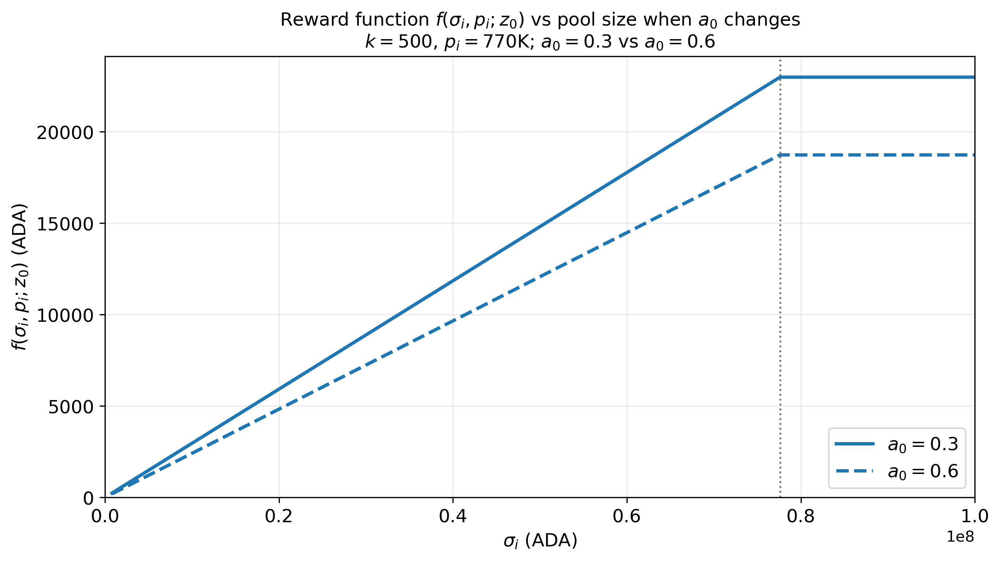
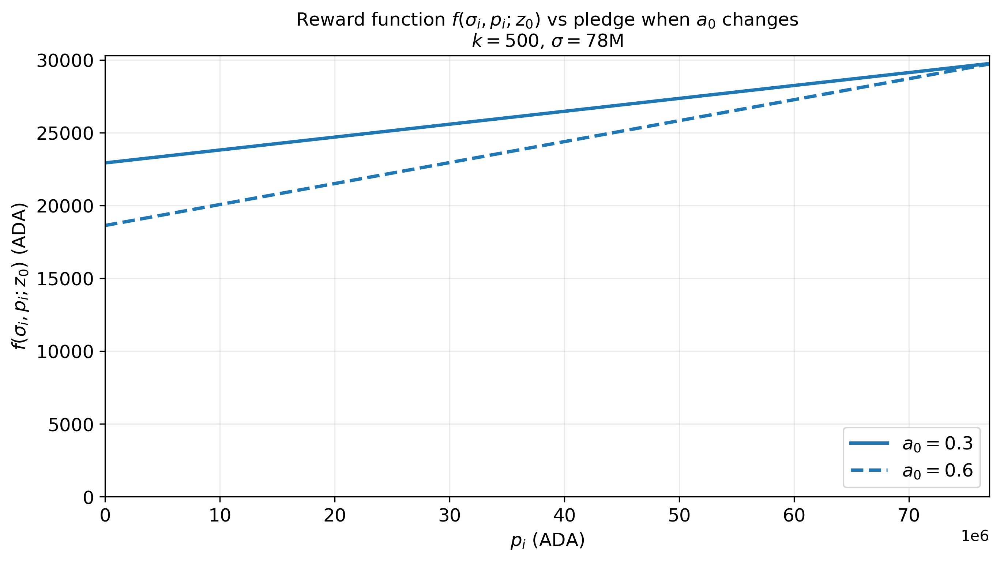
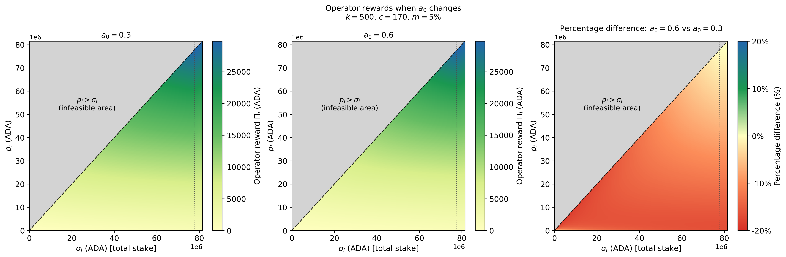
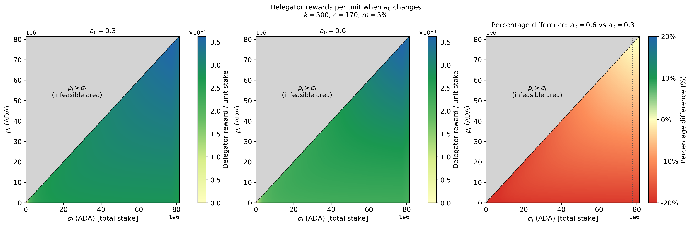
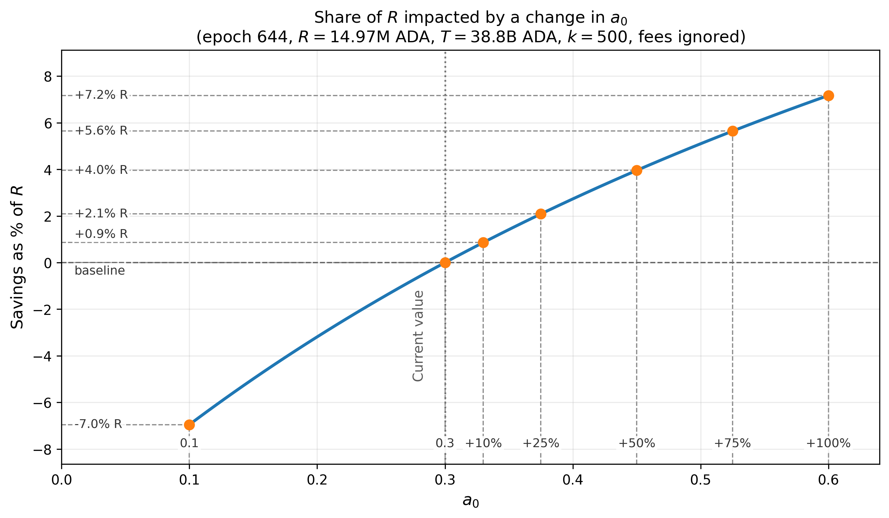
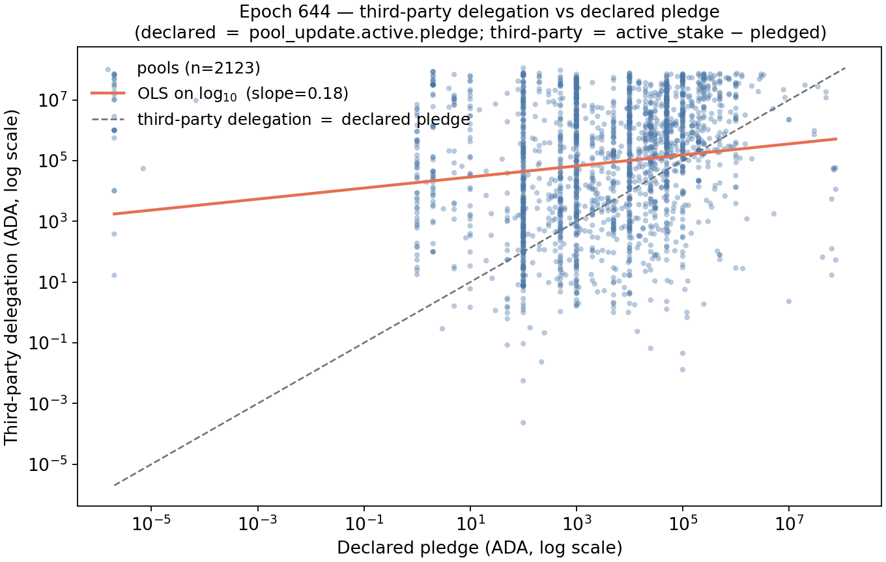
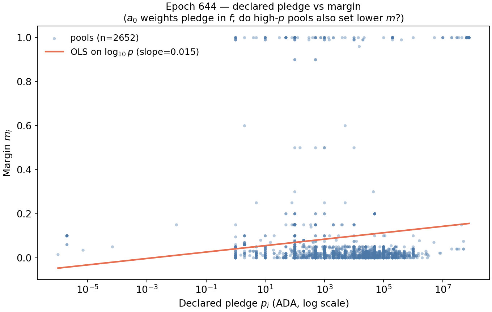
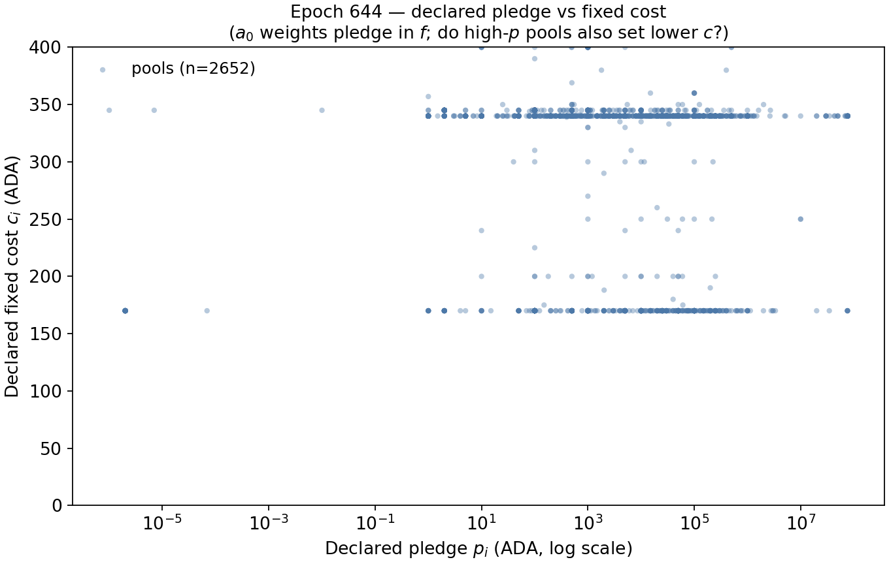

# Incentive effects of changing $a_0$

## Parameter values at the current state
For the numerical analysis in this section, we use the parameter values below unless stated otherwise. These values may differ from the snapshot values reported in [Parameter-Landscape.md](../../Parameter-Landscape.md), because this comparative-statics exercise is anchored to a single reference state.

| Symbol | Parameter | Value |
| --- | --- | --- | 
| $R$ | Reward pot | $14.9M$ ADA| 
| $T$ | Total ADA supply | $38.8B$ ADA | 
| $k$ | Target number of stake pools | 500 | 
| $a_0$ | Pledge influence. | 0.3 | 
| $c_{min}$ | Minimum fixed cost (`minPoolCost`). | 170 ADA |
| $m_i$ | Operator margin/commission deducted from delegator rewards. | 5%  |
| $\rho$ | Reserve decay rate.  | 0.3%  |
| $\tau$ | Treasury share.| 20% | 

## Design

The parameter $a_0$ determines how strongly a pool’s **declared** pledge affects its rewards. We need to distinguish between declared pledge $p_i$ and active pledge $\hat{p}_i$. The gross reward of pool $i$ is given by:

$$f(\sigma_i,p_i) = \frac{R}{1+a_0} \left[ \tilde{\sigma}_i + a_0\tilde{p}_i \frac{\tilde{\sigma}_i-\tilde{p}_i\frac{z_0-\tilde{\sigma}_i}{z_0}}{z_0} \right],$$

where
 $$\tilde{\sigma}_i = \min\\{\sigma_i, z_0\\}, \qquad \tilde{p}_i = \min\\{p_i, z_0\\},$$

and **the pool operator $i$ utility** is:

$$
U_i=
\begin{cases}
\underbrace{c_i+(f(\sigma_i,p_i)-c_i)\left[m_i +(1-m_i)\frac{\hat{p}_i}{\sigma_i}\right]}_{\Pi_i=\text{Operator gross revenue}}-\hat{c}_i, & \text{if } f(\sigma_i,p_i)>c_i, \\
f(\sigma_i,p_i)-\hat{c}_i, & \text{otherwise}
\end{cases}
$$

where $\hat{p}_i$ denotes the operator's active pledge, m_i\in[0,1)$ the margin or pool's commission, $c_i$ the declared fixed cost, and $\hat{c}_i$ the actual fixed cost.

> **Note:** The parameter $z_0$, and variables $\sigma_i$ and $p_i$ enter the formulas as relative fractions of the total supply $T$ (for example, $z_0 = T/k$ simplifies to $1/k$ when normalized), whereas $R$ is measured in absolute ADA. With a slight abuse of notation, we use the same symbols regardless of whether these values are normalized. Consequently, the formula yields the fraction of the reward pot $R$ awarded to pool $i$ in that epoch. A pool whose active pledge falls below its declared pledge receives $f(\sigma_i, p_i) = 0$.

When $a_0=0$, declared pledge has no role and the gross pool reward depends only in the delegation/staking level:

$$f(\sigma_i,p_i) = R\sigma_i$$

Increasing $a_0$ has a dual effect. From one side, pools with more declared pledge receive higher rewards than otherwise comparable low-declared-pledge pools. However, a higher $a_0$ also reduces the fraction of $R$ to distribute. The second effect is stronger:

$$\frac{\partial f}{\partial a_0}v= -\frac{R}{(1+a_0)^2} \left[ \tilde{\sigma}_i \left( 1-\frac{\tilde{p}_i}{z_0} \right)+\frac{\tilde{p}_i^2}{z_0}\left(1-\frac{\tilde{\sigma}_i}{z_0}\right)\right]\leq 0
$$

with equality when $$\tilde{p}_i=\tilde{\sigma}_i=z_0.$$

The active pledge role is to determine the operator contribution to total pool stake.

Without a declared pledge incentive $a_0$, an operator with little capital could attract large amounts of delegation or create several pools while committing little stake of their own. 

A higher $a_0$ makes such strategies more costly because an operator splitting into multiple pools may also need to divide their declared pledge to be attractive, reducing the reward potential of each pool. It therefore strengthens Sybil resistance and encourages operators to have more “skin in the game.”

The main trade-off is between Sybil resistance and accessibility. A higher $a_0$ discourages highly leveraged and multi-pool strategies, but it also favors wealthy operators and makes it harder for operators with limited capital to compete. A lower $a_0$ reduces barriers to entry and allows competition to depend more on performance, costs, and margins, but provides weaker protection against operators controlling large amounts of delegated stake with little declared pledge.

## Direct mechanical effects 
In this section we consider the direct effects of changing the parameter while holding everything else equal (ceteris paribus). 

### Gross pool rewards

We study this using the partial derivative, which measures how $f(\sigma_i,p_i)$ changes when $a_0$ changes while all other variables are held constant. Since

$$f(\sigma_i,p_i) = \frac{R}{1+a_0} \left[ \tilde{\sigma}_i + a_0\tilde{p}_i \frac{\tilde{\sigma}_i-\tilde{p}_i\frac{z_0-\tilde{\sigma}_i}{z_0}}{z_0} \right], \qquad \tilde{\sigma}_i = \min\\{\sigma_i, z_0\\}, \qquad \tilde{p}_i = \min\\{p_i, z_0\\},$$

then
    
$$\frac{\partial f}{\partial a_0} = -\frac{R}{(1+a_0)^2} \left[ \tilde{\sigma}_i + a_0\tilde{p}_i \frac{\tilde{\sigma}_i-\tilde{p}_i\frac{z_0-\tilde{\sigma}_i}{z_0}}{z_0} \right] + \frac{R}{1+a_0} \left[ \tilde{p}_i \frac{\tilde{\sigma}_i-\tilde{p}_i\frac{z_0-\tilde{\sigma}_i}{z_0}}{z_0} \right]\leq 0,$$

with equality when $\tilde{p}_i = \tilde{\sigma}_i = z_0$.

Increasing $a_0$ reduces total rewards for pools that rely primarily on external delegation rather than operator declared pledge, as $a_0$ penalizes low-declared-pledge pools relative to high-declared-pledge ones.

For a fixed level of declared pledge, this negative impact is more significant for larger pools (left plot). <!-- At first glance, the right plot may suggest that an operator can mitigate this effect by replacing delegations with operator declared pledge, but the operator-revenue analysis below shows that this mitigation is generally incomplete. -->

  
  

### Operator gross revenue

Analyzing the pool reward function $f(\sigma_i,p_i)$ in isolation gives an incomplete picture of an operator’s position. While a larger declared pledge cushions the impact of increasing $a_0$ by substituting delegation with declared pledge, this smoothing applies only to **gross pool rewards $f(\sigma_i,p_i)$**. To assess the true direct mechanical impact on pool operators, we must instead evaluate **operator gross revenue ($\Pi_i$)**.

The following heatmaps illustrate this dynamic. Total pool stake $\sigma_i$ is mapped along the $x$-axis and operator declared pledge $p_i$ along the $y$-axis, with the grey region indicating the infeasible domain ($p_i > \sigma_i$). The left and center panels show operator revenue $\Pi_i$ under $a_0 = 0.3$ and $a_0 = 0.6$, respectively (evaluated at $k=500$, $c_i=170\text{ ADA}$, and $m_i=5\%$), while the right panel highlights the direct net change ( $\Delta \Pi_i = \Pi_i(a_0=0.6) - \Pi_i(a_0=0.3)$ ). In this difference plot, red gradients signify a net reduction in operator revenue ($\Delta \Pi_i < 0$), with darker shades marking larger absolute losses.

The difference heatmap shows that, over a broad range of stake levels, increasing pledge does not fully compensate for an increase in $a_0$. To understand why, first consider a saturated pool ($\sigma_i=z_0$):
  
$$f(z_0,p_i) = \frac{R}{1+a_0}\bigl(z_0+a_0 p_i\bigr).$$

Increasing $a_0$ introduces two competing mechanical forces on $f(z_0,p_i)$:
1. The scaling factor $\frac{1}{1+a_0}$ reduces baseline rewards.
2. The term $a_0p_i$ gives greater weight to pledge, mitigating this reduction as $p_i$ increases and fully offsetting it when $p_i=z_0$.

For operator gross revenue, we have

$$\Pi_i=c_i+\left[m_i+(1-m_i)\frac{\hat p_i}{\sigma_i}\right]\cdot(f(\sigma_i,p_i)-c_i).$$

where $\hat p_i$ is active operator pledge (under full-pledge compliance, $\hat p_i=p_i$).

Hence, the change in **operator gross revenue** (and, equivalently, in operator utility/profit if $c_i$ and $\hat{c}_i$ remain constant after the parameter change) is:

$$\Delta \Pi_i=\left[m_i+(1-m_i)\frac{\hat p_i}{\sigma_i}\right]\Delta f(\sigma_i,p_i)=\Delta U_i.$$
    
As active operator pledge rises, the operator capture share $m_i+(1-m_i)\frac{\hat p_i}{\sigma_i}$ rises toward $1$. Thus, even though the absolute reduction in pool gross rewards, $|\Delta f|$, becomes smaller, the operator bears a larger share of that reduction. Consequently, $\Delta\Pi_i$ can become more negative even while $\Delta f$ becomes less negative.

Away from saturation—for example, when $\sigma_i=50\text{M ADA}$—the decline in $f$ is never fully offset as pledge increases. As a result, $\Delta\Pi_i$ may remain increasingly negative throughout the pledge range.

As an example, let $\sigma_i = 50M$ ADA, $k=500$, $c_i=170$, and $m_i=5\\%$. Suppose $a_0$ increases from $0.3$ to $0.6$:

| $\hat p_i/\sigma_i$ | $\Delta f$ | $\Delta\Pi_i$ |
|---|---|---|
| $0$ | $-2922$ | $-146$ |
| $0.5$ | $-2140$ | $-1123$ |
| $1$ | $-1690$ | $-1690$ |

Bottom line: Higher pledge cushions the decline in the pool gross reward function $f(\sigma_i,p_i)$ following an increase in $a_0$. For the operator, however, higher pledge also means bearing a larger share of the remaining reward reduction. Operator gross revenue can therefore fall by more at high pledge, even though the decline in total pool rewards is smaller.

### Delegator return per unit of stake

The following heatmaps show the return received by delegators per unit of stake. Total pool stake $\sigma_i$ is displayed on the $x$-axis and operator pledge $p_i$ on the $y$-axis, while the grey region represents the infeasible domain $p_i > \sigma_i$. The left and center panels report delegator returns under $a_0 = 0.3$ and $a_0 = 0.6$, respectively. The right panel shows the direct change resulting from the increase in $a_0$. Red regions indicate a reduction in delegator returns, with darker shades representing larger losses.

The heatmap shows that increasing $a_0$ generally reduces delegator returns per unit of stake, but that this negative effect becomes smaller as pledge increases. This contrasts with operator gross revenue, because the change in delegator return per unit of stake depends only on the change in $f(\sigma_i,p_i)$.

This can be seen analytically. After deducting the declared fixed cost and the operator margin, the return received by delegators per unit of stake is

$$r_i^{D} = (1-m_i) \frac{\max\left\\{f(\sigma_i,p_i)-c_i, 0\right\\}}{\sigma_i},$$

and, when $a_0$ changes, the direct change in the delegator return is

$$\Delta r_i^{D} = \frac{1-m_i}{\sigma_i} \Delta f(\sigma_i,p_i).$$

Consequently, higher pledge mitigates the negative effect of an increase in $a_0$ on delegator returns, even though it may amplify the reduction in operator gross revenue.

  
### Reward-pot and treasury flows

The parameter $a_0$ directly influences reward pot dynamics and treasury flows. In particular, it normalizes the total reward $R$ distributed among pools by a factor of roughly $1 + a_0$. Consequently, larger values of $a_0$ reduce the overall amount of $R$ paid out to pools, directing the remaining fraction back to the reserve. By allowing more rewards to remain unspent, an increase in $a_0$ slows reserve depletion and enhances the long-term sustainability of the reward model.

An analysis of epoch 644 demonstrates how varying $a_0$ influences reserve reward retention during that specific period. The analysis considers the actual distribution of stake and pledge across the different pools (see [Pools Data e644](../../staking_pools_full_epoch_644.csv)), and calculates the gross reward $f(\sigma_i,p_i)$ per each pool for different values of $a_0$ (see [Pool Rewards vs a0](../../pools_f_vs_a0_epoch_644.csv) and [R Savings vs a0](../../savings_pct_of_R_vs_a0_epoch_644.csv) ). The effect exhibits slight concavity: for small adjustments, each $1\%$ increase in $a_0$ yields a reward savings of roughly $0.1\%$.

  

## Behavioral and equilibrium effects

This section identifies potential behavioral (or second-order) effects—primarily concerning delegator and operator decisions **given the current state**.

Changing $a_0$ can affect not only current rewards but also the rank of pools, how much pledge they commit, how they set fees, and where delegation ultimately concentrates.

    
### Rational behavior

We start from a frictionless baseline consistent with the reward-sharing analysis: forward-looking (non-myopic) players, truthful fixed-cost declaration ($c_i=\hat c_i$), and no strategic changes in declared cost after the parameter shock ($dc_i=0$).

Under this baseline, ranking for competitive pools is driven by expected saturated outcomes. A convenient proxy is

$$
P_i(a_0)=f(z_0,p_i)-c_i,
\qquad
D_i(a_0)=(1-m_i)\,[P_i(a_0)]_+.
$$

For saturated pools,

$$
f(z_0,p_i)=\frac{R}{1+a_0}(z_0+a_0p_i),
\qquad
\frac{\partial f(z_0,p_i)}{\partial a_0}=\frac{R(p_i-z_0)}{(1+a_0)^2}\le 0.
$$

Hence, increasing $a_0$ usually lowers absolute rewards, but less so for high-pledge pools. Relative ordering shifts according to

$$
P_i(a_0)-P_j(a_0)=\frac{Ra_0}{1+a_0}(p_i-p_j)-(c_i-c_j),
$$

so pledge differences receive more weight relative to cost differences.

#### Skin-in-the-game and external delegation ($a_0$ motivation)

As stated above, the inclusion of $a_0$ in the design aims to put weight in the skin-in-the-game of opertors. This is done by prizing the declared pledge. To examine whether higher operator declared pledge attract greater external delegation, next plot shows third-party delegation against declared pledge across $n = 2,123$ active pools in epoch 644 on a log-log scale. The OLS regression yield a slope of just $0.18$, indicating a very inelastic relationship: A $100\\%$ increase in declared pledge is associated with only an $18\\%$ increase in third-party delegation. There is substantial delegation leverage at low declared pledges: Even pools with modest declared pledges attract multi-million ADA third-party delegations.

  

<!-- We expect delegators to reallocate toward pools with higher expected return per unit stake,

$$
(1-m_i)\frac{\max\{f(\sigma_i,p_i)-c_i,0\}}{\sigma_i}.
$$

SupposeLet the post-shock delegation update be

$$
\Delta \sigma_i^D=\eta\,\sigma_i\big(r_i^D-\bar r^D\big),
\qquad
\sigma_i'=\sigma_i+\Delta \sigma_i^D,
$$

with $\bar r^D$ the stake-weighted market benchmark. After an increase in $a_0$, high-pledge pools tend to have higher relative $r_i^D$, so they receive positive net flows in this benchmark.-->

#### Operator margin and fixed cost choices vs declared pledge

Since the parameter $a_0$ favours those pools with more declared pledge, we could ask whether those pools with high declared pledge choose lower fees (margin and declared fixed cost) to increase their attractiveness for delegators. The following plots show that this correlation is very weak. On the other hand, the data do not support “high pledge → higher fees” (because high pledge makes the pool competitive, opening the door to keep higher fees without losing stake). The sign goes (weakly) against that.

  

  

<!--With costs treated as truthful and fixed in this baseline, operators mainly adjust $\hat p_i$ and $m_i$ to preserve utility,

$$
U_i=\Pi_i-\hat c_i,
\qquad
\Pi_i=c_i+(f(\sigma_i,p_i)-c_i)\left[m_i+(1-m_i)\frac{\hat p_i}{\sigma_i}\right].
$$

Given expected redelegation, operators solve a reduced-form best response

$$
(\hat{p}_i^{\*},m_i^{\*})\in\arg\max_{\hat p_i,m_i}\;U_i\big(a_0,\sigma_i'(\hat p_i,m_i),\hat p_i,m_i\big),
$$

which captures that pricing and pledge choices are made jointly with their induced stake response. Low-pledge operators are pushed to increase pledged capital and/or reduce margins to retain delegation.-->

#### Entry or exit of pools

Entry and survival follow participation constraints evaluated at post-redelegation stake:

$$
U_i\big(a_0,\sigma_i'\big)\ge 0,
\qquad
U_i^{\text{entry}}\big(a_0,\sigma_i'\big)-F_i\ge 0,
$$

where $\sigma_i'=\sigma_i+\Delta\sigma_i^D$ and $F_i$ is setup/friction cost. This combines the direct impact of $a_0$ through $f(\cdot)$ and the indirect impact through redelegation from previous channels.

#### Pool splitting by multi-pool operators

For an MPO operating $n$ pools with total pledge $P$, a simple feasibility condition is

$$
\hat p_j=\frac{P}{n},
\qquad
\Pi^{\text{MPO}}(n)=\sum_{j=1}^{n}\Pi_j\big(a_0,\hat p_j,\sigma_j'\big),
$$

and splitting is attractive only if $\Pi^{\text{MPO}}(n+1)-\Pi^{\text{MPO}}(n)>0$. Higher $a_0$ makes low $\hat p_j$ more costly in ranking terms, raising the capital requirement for expansion.

#### Changes in staking participation

Let total staking participation be $S=\sum_i\sigma_i$. A compact reduced-form response is

$$
\Delta S=\chi\,\big(\bar r_{\text{exp}}-r_{\text{alt}}\big),
$$

where $\bar r_{\text{exp}}$ is expected aggregate staking return after the policy change and $r_{\text{alt}}$ is the outside option return. This clarifies that the first-order effect of $a_0$ is mostly reallocative, with aggregate participation changing only if expected net returns versus alternatives move enough.

### Behavioral deviations from the rational benchmark

We now introduce frictions that can change the speed and shape of the same five channels.

#### Delegators moving stake

Search costs, inattention, and brand/reputation effects slow migration. One simple frictional law of motion is

$$
\Delta \sigma_i^{\text{obs}}=\lambda_i\,\Delta \sigma_i^D,
\qquad 0<\lambda_i<1,
$$

so realized reallocations are a scaled-down version of the rational benchmark.

#### Operators changing pledge, margin, or declared fixed cost

With bounded rationality and experimentation, operators may only partially adjust each epoch:

$$
m_{i,t+1}=m_{i,t}+\rho_m\big(m_i^{\*}-m_{i,t}\big),
\qquad
\hat p_{i,t+1}=\hat p_{i,t}+\rho_p\big(\hat{p}_i^{\*}-\hat p_{i,t}\big),
$$

with $0<\rho_m,\rho_p\le 1$. If $\rho_p<\rho_m$, margins move faster than pledge, generating transitional pricing cycles.

#### Entry or exit of pools

Operational inertia and uncertainty can be represented with hysteresis thresholds:

$$
U_i(a_0,\sigma_i')<-H_i^{\text{exit}},
\qquad
U_i^{\text{entry}}(a_0,\sigma_i')>H_i^{\text{entry}},
$$

with $H_i^{\text{entry}},H_i^{\text{exit}}>0$. This allows weak pools to persist and delays both entry and exit relative to the frictionless benchmark.

#### Pool splitting by multi-pool operators

If MPOs face coordination and infrastructure frictions, net expansion value can be written as

$$
V^{\text{split}}(n)=\Pi^{\text{MPO}}(n)-K(n),
$$

where $K(n)$ is increasing and convex. MPOs with lower marginal $K'(n)$ can still split effectively under higher $a_0$, especially when they reallocate internal stake quickly.

#### Changes in staking participation

Behavioral salience can be captured by weighting short-run and long-run returns differently:

$$
\Delta S_t=\chi_s\big(r_t-r_{\text{alt},t}\big)+\chi_l\,\mathbb E_t\!\left[\sum_{h\ge 1}\beta^h\big(r_{t+h}-r_{\text{alt},t+h}\big)\right],
$$

with $\chi_s>\chi_l$ under short-term salience. This yields participation responses that can be stronger in the short run than in the rational benchmark.

#### Decentralization

