# Incentive effects of changing k
For the numerical analysis in this section, we use the parameter values below unless stated otherwise. These values may differ from the snapshot values reported in [Parameter-Landscape.md](../../Parameter-Landscape.md), because this comparative-statics exercise is anchored to a single reference state.

| Symbol | Parameter | Value |
| --- | --- | --- | 
| $R$ | Reward pot | $14.9M$ ADA| 
| $T$ | Total ADA supply | $38.8B$ ADA | 
| $k$ | Target number of stake pools | 500 | 
| $a_0$ | Pledge influence. | 0.3 | 
| $c_{min}$ | Minimum fixed cost (`minPoolCost`). | 170 ADA |
| $m_i$ | Operator margin/commission deducted from delegator rewards. | 5%  |
| $\rho$ | Reserve decay rate.  | 0.3%  |
| $\tau$ | Treasury share.| 20% | 

## Design

$k$ denotes the target number of economically relevant stake pools. It is not a hard cap on the number of pools that may be registered; rather, it shifts the reward function through the saturation threshold

$$
z_0 = \frac{1}{k}.
$$

The motivation is to limit the increasing-returns pattern that appears when rewards are proportional to stake. Below saturation, delegation tends to increase the reward available to the pool and to the delegators. Above saturation, additional stake no longer increases gross rewards, which weakens the advantage of very large pools. 

Choosing $k$ therefore trades off decentralization and economic viability. A higher $k$ lowers the saturation threshold ($z_0$), reducing the stake and pledge required for a pool to become competitive and making room for more economically relevant pools. However, it also lowers the maximum gross reward available to each saturated pool, which may weaken operator profitability. A lower $k$ has the opposite effect: it allows larger rewards per pool and may improve viability, but reaching saturation—and making pledge fully effective—requires more stake and substantially more pledge, favoring larger or better-capitalized operators.

## Direct mechanical effects 
In this section we consider the direct effects of changing the parameter while holding everything else equal (ceteris paribus).

The parameter change considered here is an increase in $k$, which lowers the saturation threshold and therefore changes the reward profile before any behavioral response occurs.

### Gross pool rewards
  
Let $\sigma_i$ denote the total delegation at pool $i$, $p_i$ the declared pledge of the pool, and $z_0$ the saturation threshold. The gross pool reward function is

$$f(\sigma_i,p_i) = \frac{R}{1+a_0} \left[ \tilde{\sigma}_i + a_0\tilde{p}_i \frac{\tilde{\sigma}_i-\tilde{p}_i\frac{z_0-\tilde{\sigma}_i}{z_0}}{z_0} \right], \qquad \tilde{\sigma}_i = \min\\{\sigma_i, z_0\\}, \qquad \tilde{p}_i = \min\\{p_i, z_0\\},$$

which does not depend on $c_{min}$.

> **Note:** Most of the analysis presented in this document assumes a static environment, omitting the dynamic, inter-epoch feedback effects of return flows to the reserves. While return flows can be evaluated statically for a given state, fully dynamic feedback scenarios will be explicitly indicated.

The effect of changing $k$ on $f(\sigma_i,p_i)$ depends on whether the caps  $\tilde{\sigma}_i = \min\\{\sigma_i, z_0\\},$ and $\tilde{p}_i = \min\\{p_i, z_0\\}$ are binding or not:

$$
\frac{\partial f}{\partial k} =
\begin{cases}
\displaystyle \frac{R a_0 p_i}{1+a_0} \left[\sigma_i-p_i+2kp_i\sigma_i\right]\geq 0, & k < \frac{1}{\sigma_i}, \qquad \text{equivalently $ \sigma_i < \frac{1}{k}$}\\
\displaystyle -\frac{R}{(1+a_0)k^2}\leq 0, & \frac{1}{\sigma_i} < k \leq \frac{1}{p_i}, \qquad \text{equivalently $ p_i \leq \frac{1}{k} < \sigma_i$}\\
\displaystyle -\frac{R}{k^2}\leq 0, & \frac{1}{p_i} \leq k, \qquad  \text{equivalently $ k \leq \frac{1}{p_i} $}.
\end{cases}
$$

Thus, increasing $k$ elevates $f_i$ for pools below saturation, but reduces $f_i$ once the pool becomes constrained by the lower saturation limit.

The next plot illustrates a discrete increment of $k$ from $500$ (left) to $1000$ (center), with the net difference shown on the right. Each heatmap displays the gross reward $f(\sigma_i, p_i)$ for a pool as a function of its delegation ($x$-axis) and pledge ($y$-axis), where darker green indicates higher rewards. Doubling $k$ halves the saturation threshold from $z_0 = 77\text{M ADA}$ to $z_0 = 38.5\text{M ADA}$ (marked by the vertical line in the center plot). Consequently, rewards for pools exceeding $38.5\text{M ADA}$ decrease—reflected in the muted green tones—because their rewards are capped earlier. The difference plot on the right highlights this shift: while larger pools experience reduced yields, medium-sized pools operating near the new $z_0$ now occupy the optimal reward band.
  

  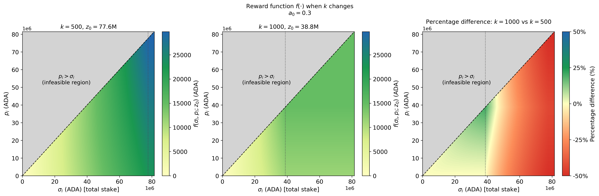

### Operator gross revenue

While gross rewards provide a baseline, a pool operator's actual earnings depend on their specific fee structure. The pool operator's gross revenue function, $\Pi_i$, is defined as:

$$\Pi_i = 
\begin{cases} c_i + \bigl(f(\sigma_i, p_i) - c_i\bigr) \left[m_i + (1 - m_i) \frac{\hat{p}_i}{\sigma_i}\right], & \text{if } f(\sigma_i, p_i) > c_i, \\ 
f(\sigma_i, p_i), & \text{otherwise} 
\end{cases}
$$

where $\hat{p}_i$ represents the operator's active pledge (the stake or delegation owned by the operator), and $c_i$ denotes the fixed pool cost (minPoolCost).

An increase in $k$ alters $f(\sigma_i, p_i)$ without directly affecting the margin $m_i$ or $c_i$. However, because this change shifts the relative weight of $f(\sigma_i, p_i)$ within $\Pi_i$, it may ultimately lead the operator to adjust $m_i$ and $c_i$—a decision dynamics studied in later sections.

The following figure plots net operator rewards under a fixed cost of $c_i = 170\text{ ADA}$ and a margin of $m_i = 5\%$. As in the previous figure, the panels compare $k = 500$ (left) and $k = 1000$ (center) across total delegation ($x$-axis) and pledge ($y$-axis), with the rightmost panel showing the net change between the two scenarios. 

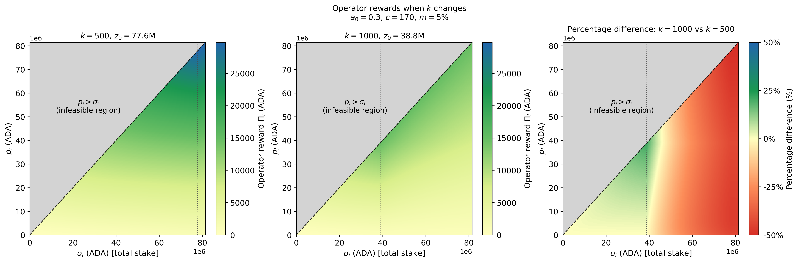

Because the protocol reimburses operators for their declared fixed costs ($c_i$), incorporating fixed-cost income mitigates the impact of increasing $k$, particularly for pools with low pledge, even if the pool becomes oversaturated. This mitigation occurs because fixed costs are deducted from the total pool rewards before they are distributed to delegators—effectively reducing the delegators' share of pool rewards, which are given by $f(\sigma_i, p_i; z_0) - c_i$. Hence, pools with lower pledge (and higher proportion of third-party delegations) redirect a larger relative portion of delegator returns toward the operator.

### Delegator return per unit of stake

Increasing $k$ affects the delegator return per unit of stake,

$$\frac{\max\{f(\sigma_i,p_i)-c_i,0\}}{\sigma_i},$$

through the reward function $f(\sigma_i,p_i)$, as detailed above. The following plots illustrate the shift in delegator returns per unit of stake when $k$ increases from $500$ to $1,000$. The right panel zooms in on the region around the maximums to highlight the marginal reward increase for delegators in newly near-saturated pools. In contrast, delegators in pools that become oversaturated face a reduction in returns, making redelegation to another pool advantageous.

  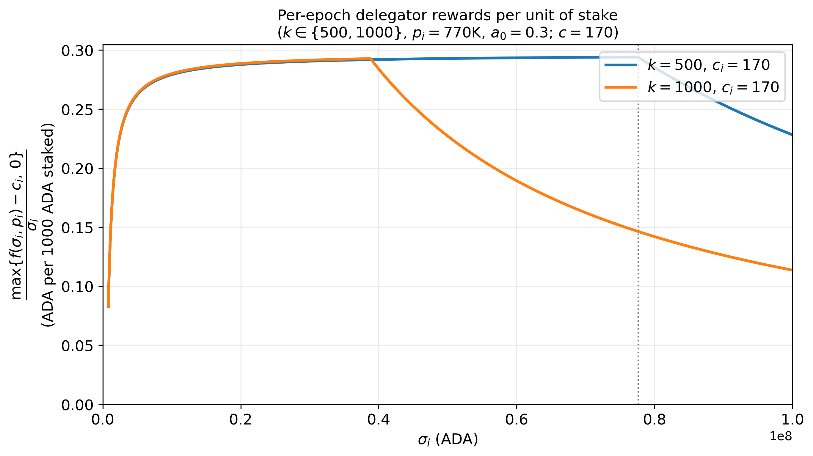
  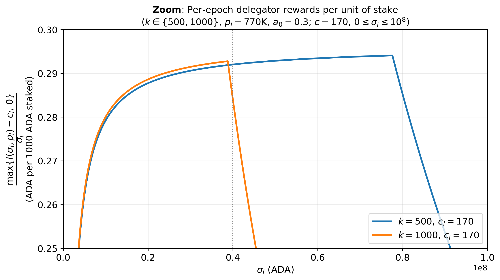

While maintaining the same delegation ($x$-axis) and pledge ($y$-axis) layout as the previous figures, this heatmap explicitly illustrates the immediate change in delegator yield per unit of stake across every combination of pledge and delegation prior to any behavioral rebalancing (such as stake migration).

Delegators remaining in now-oversaturated pools—those to the right of the vertical $z_0 = \text{38.5M ADA}$ threshold—suffer immediate yield losses. Conversely, delegators in pools operating near the new saturation boundary experience yield gains, with the most pronounced improvements concentrated in the high-pledge region along the upper area of the plot.

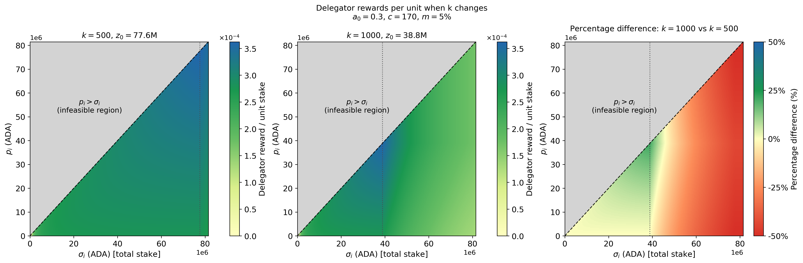

### Oversaturated stake

Denote the per-pool saturation point as $z_0(k) = \frac{T}{k},$ and the saturation level as

$$s_i(k) = \frac{\sigma_i}{z_0(k)} = \frac{\sigma_i k}{T}.$$

Pool $i$ is oversaturated if $s_i(k)>1$, i.e., $\sigma_i>z_0(k)$. The aggregate stake/delegation above saturation is calculated with
  
$$E(k) = \sum_{i : \sigma_i>0} \max\\{\sigma_i - z_0(k),0\\}.$$

The tables below summarize how doubling $k$ drives oversaturation, quantifying both the affected pool count and the aggregate delegation impacted by the change.
  
| Quantity | Value |
| :--- | ---: |
| $T$  | $38.8B$ ADA |
| $S$  | $21.4B$ ADA|
| $S / T$ | 55.2% |
| Pools with $\sigma_i>0$ | 2,694 |

| Quantity | $k=500$ | $k=1000$ | 
| :--- | ---: | ---: | 
| $z_0(k)$ (M ADA) | 77.5 | 38.8 |
| Oversaturated pools (count) | 7 | 211 | 
| Oversaturated pools (% of pools) | 0.26% | 7.8% | 
| $E(k)$ - Stake above saturation (B ADA) | 0.08 | 4.79 | 
| $E(k)$ (% of $S$) | 0.4% | 22.4% | 

Delegators in pools that become oversaturated following the increase in $k$ are expected to respond by redelegating to unsaturated pools. However, the possibility that some of this stake exits the ecosystem entirely cannot be ruled out.

### Reward-pot and treasury flows

Raising $k$ does not have a direct mechanical effect in the total size of the reward pot or the treasury's share. It only changes how the rewards are split among pools, which may affect (due to second order effects, like changes in the staking level) how much is actually paid out.

## Past Evidence

As past evidence of a change in $k$, there is the realized historical jump ($150\rightarrow500$, i.e., $3.33\times$) around epoch $228$. This section collects data about the consequence of that change. It is important to note that the consequences and behaviors observed in that jump do not need to replicate in a new one, since market conditions and sentiments may differ. 

Next, the section reports oversaturated-pool counts and stake above saturation $E(k)$ using the same definitions introduced in **Oversaturated stake** above.

### Aggregate system snapshot
  
$$E(k) = \sum_{i : \sigma_i>0} \max\\{\sigma_i - z_0(k),0\\}.$$

| Quantity | Epoch 228 | Epoch 285 |
| :--- | ---: | ---: |
| $T$ | 32.04B ADA | 33.03B ADA |
| $S$ | 17.35B ADA | 23.16B ADA |
| $S / T$ | 54.2% | 70.1% |
| Pools with $\sigma_i>0$ | 1,161 | 2,813 |

| Quantity | Epoch 228, $k=150$ | Epoch 228, $k=500$ | Epoch 285, $k=500$ |
| :--- | ---: | ---: | ---: |
| $z_0(k)$ (M ADA) | 213.58 | 64.07 | 66.06 |
| Oversaturated pools (count) | 0 | 109 | 4 |
| Oversaturated pools (% of pools) | 0.00% | 9.39% | 0.14% |
| $E(k)$ - Stake above saturation (B ADA) | 0.00 | 6.14 | 0.02 |
| $E(k)$ (% of $S$) | 0.00% | 35.41% | 0.09% |

Main observations:

- Before the change ($k=150$), oversaturation was effectively zero.
- The historical $3.33\times$ jump to $k=500$ moved the system to $109$ oversaturated pools and $E(k)=6.14$B ADA ($35.71\%$ of $S$).
- After enough epochs, the redelegation moved away from oversaturated pools, leaving oversaturated pools again near zero.
- The snapshot also shows a important increment in the staking level $S$, the ratio $S/T$, and number of pools. However, this does not imply that the change in $k$ triggered that increment.

### Changes in delegation distributions

Following the increase in $k$, delegators in newly oversaturated pools migrated to those that remained undersaturated. While some delegators left the ecosystem, overall staking participation increased, indicating that departing delegators were offset by new entrants selecting undersaturated pools. 

The next two plots illustrate how many pools—restricted to the set of active pools present at epoch 228—gained or lost delegation, along with the magnitude of those shifts. The dynamics show that small pools ($0\text{--}5\text{M ADA}$) experienced the largest total staking gains, and also the highest exit rates ($287$ pools). Because total staking grew, these aggregate plots cannot isolate new incoming stake from redistributed existing stake (to disentangle whether a pool gained capital from redelegations or new entrants, individual redelegation trajectories must be tracked, data that we do not have in the snapshots).

  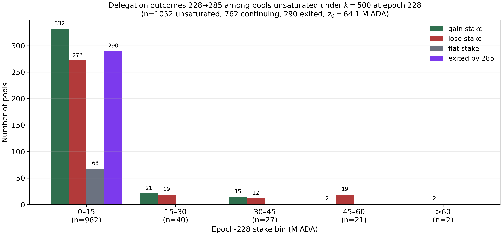
  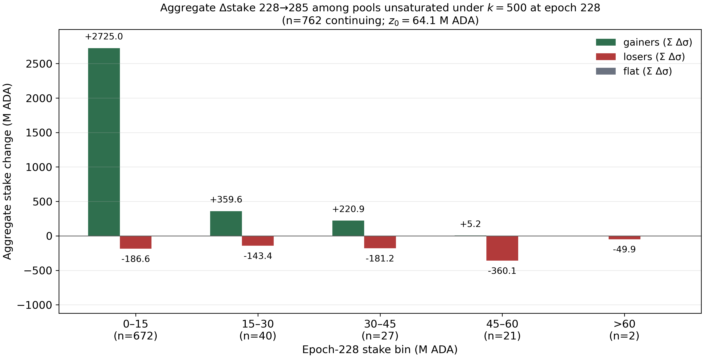

The next figure compares observed stake distributions before and after the \(k\) increment via CDFs .

- *Left panel (epoch-228 cohort)*. Dashed green is all pools present at epoch 228; solid green is the subset that still exist at epoch 285, valued at their epoch-228 stake; orange is that same continuing set at epoch 285. Relative to the full 228 census, the continuing cohort is already less “dusty” (exits were especially small: median stake \(\approx 0.07\)M ADA). Comparing solid green to orange then isolates how *survivors* evolved: the median rises (about \(0.78\)M to \(1.34\)M ADA), while the upper tail compresses sharply (far fewer pools near the new saturation region). That pattern is consistent with redelegation away from oversaturated pools and with stake flowing toward remaining unsaturated operators—not with a thicker left tail of tiny pools.

- *Right panel (full snapshots)*. Orange is *all* pools at epoch 285, including entrants after 228. Pool count rises from \(1{,}161\) to \(2{,}810\), and the median falls (about \(0.33\)M to \(0.16\)M ADA): many new small pools pull the CDF up and to the left even though the continuing cohort on the left looks less concentrated in the extreme right tail. 

The two panels answer different questions—left: composition and stake reallocation *within* the 228 set; right: the ecosystem-wide distribution once entry is allowed.

  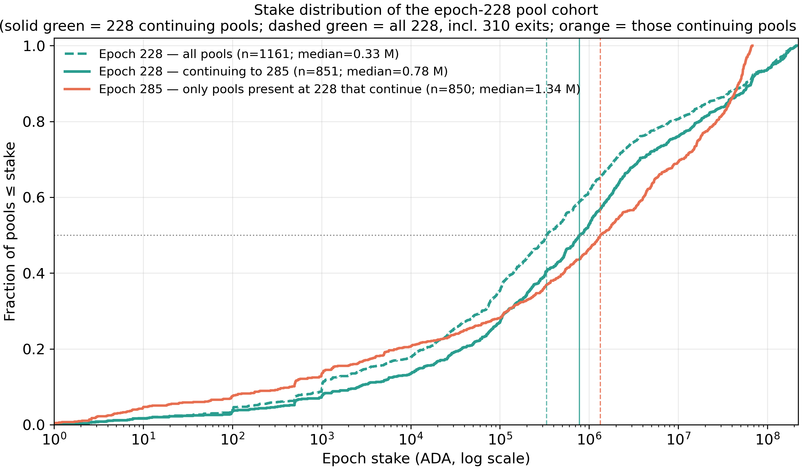
  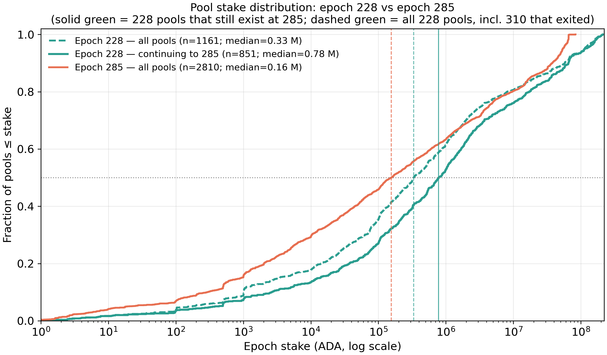

### Decentralization metrics

The following table compares decentralization metrics for epoch 228 and epoch 285. However, since many pools and new stake entered in the ecosystem in this window of time, the figures are not informative of how successful was the parameter change in this objective.

Nakamoto $N$: minimum number of pools (ranked by active stake) whose aggregate exceeds 50% of total active stake.

| Epoch | Nakamoto \(N\) | Snapshot pools | Aggregate stake of \(N\) | Total active stake | Share | Min-agg declared pledge | Min-agg active pledge |
|------:|---------------:|---------------:|-------------------------:|-------------------:|------:|------------------------:|----------------------:|
| 228 | 57 | 1,161 | 8.76B ADA | 17.35B ADA | 50.48% | 59.0M ADA | 101.6M ADA |
| 285 | 195 | 2,813 | 11.59B ADA | 23.16B ADA | 50.06% | 1.09B ADA | 1.23B ADA |

### Pools Viability

We recompute operator rewards $\Pi_i$ under $k=150$ and the counterfactual $k=500$, using $T=32.04B$ ADA, $R = 29.7M$ ADA, $a_0=0.3$, and holding each pool’s stake, pledges, margin, and declared cost fixed. With operational expenditure (or OpEx) $C^* = 667$ per month and ADA price at $0.11$ USD, we get 

$$C^* = 667/6/0.11= 1010.6 \quad \text{ADA per epoch}$$. 

Let $r = \Pi_i / C^{\*}$. Among $1'077$ pools with theoretical reward ($84$ out of $1'161$ are pools where the declared pledge exceeds the epoch-228 stake), $148$ cover $C^*$ under $k=150$, of which 65 are on the edge $1\le r<2$. Under $k=500$ with the same delegation, only $134$ remain viable and the “Strong” group $r\ge 5$ falls from 32 to 10 — large pools are capped by the lower saturation point.

The plot shows a moderate impact of the increment of $3.33x$. on $k$ in the operators' viability before any redelegation or operator resonse.

| | $k=150$ | $k=500$  | Variation |
| :--- | ---: | ---: |---: |
| Pools  | $1077$ | $1077$ ||
| Cover OpEx ($r\ge 1$) | $148$ | $134$ | $-9.5\\%$ |
| Losing ($0<r<1$) | $929$ | $943$ | $1.5\\%$ |
| Edge ($1\le r<2$) | $65$ | $71$ | $9.2\\%$ |
| Comfortable ($2\le r<5$) | $51$ | $53$ | $3.9\\%$ |
| Strong ($r\ge 5$) | $32$ | $10$ | $-68.8\\%$ |

  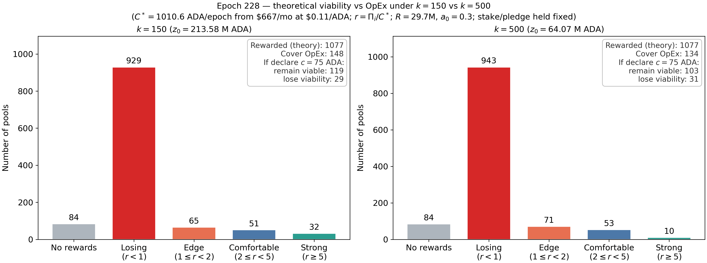

*APR*

To evaluate how shifting $k=150 \to 500$ affects delegator returns, we calculate the annualized delegator yield

$$\mathrm{APR}_i\approx73(1-m_i)\frac{\max\\{f(\sigma_i,p_i)-c_i,0\\}}{\sigma_i}.$$
 
This measures net yield per ADA after deducting fixed costs ($c_i$) and variable margins ($m_i$). To isolate operator pricing behavior from saturation mechanics, the baseline sample is restricted to the $1'052$ undersaturated pools at epoch $228$. Of these, $762$ survived through epoch 285, while $290$ exited. For the counterfactual $k=500$ scenario, surviving pools hold their epoch 228 stake and pledge fixed while adopting their actual epoch 285 fees, allowing us to capture strategic fee responses while holding delegation constant. This captures operators’ fee responses without allowing subsequent delegation changes to affect the comparison (this is a simplification since fee responses could also be a consequence of new incoming pools and delegations). Exiting pools remain in the baseline $k=150$ scenario to avoid survivorship bias, but are excluded from $k=500$ as their post-exit parameters are unobserved.

| Sample and scenario | Pools | Return $>0$ | Median APR, positive | Mean APR, positive |
| --- | --- | --- | --- | --- |
| $k=150$: all undersaturated pools | 1,052 | 431 | 4.07% | 3.63% |
| $k=150$: survivors | 762 | 393 | 4.14% | 3.71% |
| $k=500$: survivors, fees adjusted | 762 | 391 | 4.15% | 3.72% |
| $k=150$: pools exiting by epoch 285 | 290 | 38 | 3.03% | 2.87% |

The data shows that surviving pools were inherently higher-yielding at baseline, with $51.6\\%$ ($393/762$) generating positive returns (median positive APR of $4.14\%$), whereas only $13.1\\%$ ($38/290$) of exiting pools produced positive returns (median positive APR of $3.03\\%$). The change in $k$ may be responsible in purging underperforming operators, and  yielding a slight upward shift in both overall median positive APR (from $4.07\\%$ to $4.14\\%$) and mean positive APR (from $3.63\\%$ to $3.71\\%$) of the network. Notice that APR for surviving pools remain invariant under the counterfactual $k=500$ parameterization. This suggests that surviving operators may have adjusted their margins and fixed costs sufficiently to absorb protocol parameter changes and preserve steady yields for their delegators. That is, the increase in $k$ enhanced network-wide attractiveness by marginally lifting average delegator APR—a direct result of the exit of weak pools.

### Interaction effects

  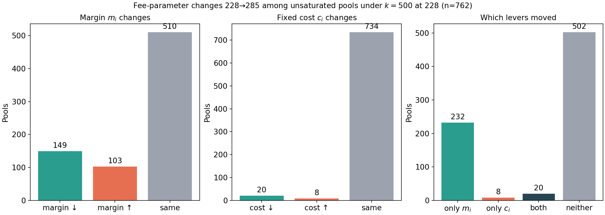

## Behavioral and equilibrium effects

This section identifies potential behavioral (or second-order) effects—primarily concerning delegator and operator decisions **given the current state**. To provide a clearer breakdown, the section below adopts a more granular approach rather than relying on these two broad categories.
    
### Rational behavior

We first discuss the equilibrium effects of increasing $k$ ($500 \to 1000$) following [Brünjes et al. (2020)](References/papers/reward-sharing-schemes_brunjes-kiayias-et-al_2020.pdf). Doubling $k$ halves the pool saturation threshold:

$$z_0(k) = \frac{1}{k}: \qquad \frac{1}{500} \longrightarrow \frac{1}{1000}$$, 

The maximum potential gross pool reward is given by:

$$f_i(\sigma_i=z_0,p_i) = \frac{R}{1+a_0} \left[ z_0 + a_0 \min\\{p_i, z_0\\} \right].$$

The active set of pools $G_{1000}$ consists of the top $1,000$ operators ranked by their desirability $(1-m_i)(f_i(z_0,p_i)-c_i)$. The following dynamics is induced:
- Stake Reallocation: Delegators shift stake to saturate all $i \in G_{1000}$. Incumbent pools lose half their stake ($\frac{1}{500} \to \frac{1}{1000}$), freeing exactly enough aggregate stake to saturate 500 new pools.
- Staking Participation: Unchanged since the model assumes that there is full active stake $\sum_i ​\sigma_i​ = T$
* **Pledge:** Operators declared as pledge all their their available stake ($p_i = \hat{p}_i$).
* **Margin:** Operators adjust their margin $m_i$ to remain competitive. The direction of the margin changes are ambiguous as $k$ alters both gross pool rewards and the marginal competitor's profit threshold.
* **Declared Cost:** Truthful reporting remains optimal.
* **Net Entry:** New pools enter in the ecosystem.

This model has several key assumptions:
- Full active stake and frictionless redelegation;
- No switching costs, search frictions, reward uncertainty, or externalities;
- Each operator manages at most one pool with stake $p_i \le \frac{1}{1000}$;
- There are sufficiently many potential operators;
- Enough profitable candidates to support the new $k$;

Overall, the stylized equilibrium changes from $500$ pools of size $T/500$ to $1000$ pools of size $T/1000$. Delegation is redistributed, the pool-leader ranking and margins are recalculated, and net pool entry equals $500$. Pool splitting may occur, but an increase in independent operators is not guaranteed. Aggregate staking participation remains unchanged.

In the reality, this benchmark is constrained by market frictions. Several observations show that the assumptions of the model do not hold in reality (however, it should be notice that the equilibrium predicted does not consider the path until reaching it, while a snapshot of the current state could be just a point in that path). 

For instance, only a fraction of $T$ is active stake $S$. With current active stake $S \approx 21.4B$ ADA and $T \approx 38.8B$ ADA, the maximum number of simultaneously saturated pools is bounded by

$$
N_{\text{sat}}^{\max}(k)=\frac{S}{T/k}=\frac{S}{T}k\approx 0.552 k,
$$

which is about $276$ for $k=500$ and about $552$ for $k=1000$. 

    
### Delegators moving stake

After an increment in $k$, several pools will become oversaturated. Yield-sensitive delegators typically leave oversaturated pools for those with available capacity. However, a mechanical increase in oversaturation does not guarantee an immediate or equivalent outflow. A slightly oversaturated pool can remain appealing if it offers lower reward variance, better fixed-cost dilution, or a strong reputation. Furthermore, identifying alternative pools requires effort: spare capacity is often fragmented across many operators, introducing search and coordination friction. Additional barriers—such as switching costs, rational inattention, or brand loyalty—can further delay adjustments, leading to persistent mild oversaturation and herding toward a small subset of pools.

**1. Why a slightly oversaturated pool may remain attractive**

Consider a simplified capped-gross-reward approximation (ignoring pledge and performance differences):

$$g_i(\sigma_i)=\bar{R} \min\\{\sigma_i,z_0\\},$$

where $\bar{R}>0$ is a constant gross reward rate per unit of reward-bearing stake. In this reduced-form approximation, $\bar{R}$ plays the role of $f(\sigma_i,p_i)/\sigma_i$ for a sub-saturated pool when pledge and performance are held fixed. The delegator net return per unit stake is

$$y_i(\sigma_i)=(1-m_i) \frac{\big[g_i(\sigma_i)-c_i\big]_+}{\sigma_i}.$$

When the pool is below saturation ($\sigma_i<z_0$),

$$y_i(\sigma_i)=(1-m_i)\left(\bar{R}-\frac{c_i}{\sigma_i}\right),$$

so returns rise with size because fixed cost is diluted. When the pool is above saturation ($\sigma_i>z_0$),

$$y_i(\sigma_i)=(1-m_i)\left(\frac{\bar{R}z_0-c_i}{\sigma_i}\right),$$

so returns decline with additional stake because gross rewards are capped at $\bar{R}z_0$. Therefore, a *slightly* oversaturated pool can still dominate a much smaller unsaturated one if fixed-cost dilution and reputation/variance effects remain favorable. The next plot shows this case:

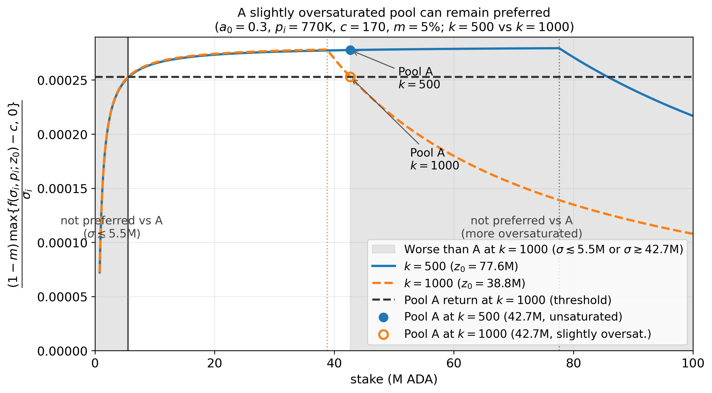

<!-- A possible empirical test is to estimate delegation outflows as a function of oversaturation while controlling for expected return, reward variance, margin, fixed cost, pool age, historical performance, and operator reputation. -->

**2. Fragmented capacity and search frictions.**

After $k$ increases, the saturation threshold falls. Define the spare capacity of pool $j$ as

$$q_j=\max\\{z_0-\sigma_j,0\\}.$$

Aggregate spare capacity is

$$Q=\sum_j q_j.$$

However, a delegator cannot move stake into aggregate capacity. They must identify a specific pool that:

1. has enough available capacity;
2. offers an acceptable expected return;
3. satisfies their quality, performance, or reputation requirements.

For a delegator with stake $x_d$, define the set of acceptable pools as

$$A_d(x_d) = \left\\{j : q_j\geq x_d \quad \text{and} \quad U_{dj}\geq U_{di}+\epsilon_d \right\\},$$

where $i$ is the delegator's current pool and $\epsilon_d$ is the minimum improvement required to justify moving.

Delegator-specific usable capacity is therefore

$$Q_d^{use} = \sum_{j\in A_d(x_d)}q_j.$$

This quantity may be much smaller than aggregate capacity $Q$. Spare capacity may be spread across many small pools, some of which:

- cannot absorb the delegator's full stake;
- have high fees or low expected returns;
- have insufficient operating history;
- have high reward variance;
- are difficult to discover.

Suppose that a fraction $\alpha_d$ of the pools inspected by delegator \(d\) are acceptable. After inspecting $n$ pools, the probability of finding at least one acceptable alternative is

$$P_d(n) = 1-(1-\alpha_d)^n,$$

which is increasing in $n$. When spare capacity is highly fragmented, $\alpha_d$ is small, and the delegator must inspect many pools before finding a suitable alternative. However, inspecting/searching is costly.

**Coordination friction**

Suppose several delegators identify the same attractive pool. Its remaining capacity becomes

$$q_j^{\mathrm{remaining}} = q_j-\sum_{d\in D_j}x_d,$$

where $D_j$ is the set of delegators moving to pool $j$.

Delegators may make decisions using the initial value of $q_j$. For an incoming delegation \(x_d\), the relevant return should therefore be evaluated at the post-delegation stake:

$$ y_j(\sigma_j+x_d) = (1-m_j)\,\frac{\big[\bar{R}\min\{\sigma_j+x_d,z_0\}-c_j\big]_+}{\sigma_j+x_d}. $$

However, simultaneous inflows can eliminate the available capacity or push the receiving pool above saturation. This can generate:

- herding toward well-known pools;
- overshooting;
- repeated redelegation;
- unused capacity in less visible pools;
- temporary oscillations around the saturation threshold.

Hence, a pool close to saturation may be highly attractive for a small delegator but unattractive—or unable to accommodate the delegation without oversaturation—for a large delegator or when many small delegators arrive simultaneously to the same pool.

**3. Switching costs, rational inattention, and brand loyalty.**

Let

$$\Delta_d = \max_j U_{dj}-U_{di}$$

denote the maximum utility gain available to delegator $d$ from leaving their current pool $i$ and migrating to the pool $j$.

The delegator switches only when $\Delta_d > \kappa_d,$ where $\kappa_d$ denotes switching costs . Thus, when $\kappa_d>0$, small return improvements do not justify moving.

If $\kappa_d$ is heterogeneous across delegators with cumulative distribution $F_\kappa$, the fraction willing to switch for a gain $\Delta_d$ is $F_\kappa(\Delta_d)$.

Suppose that $a_d\in[0,1]$ denotes the probability that delegator $d$ notices and evaluates the change. Thus, when $a_d<1$, some delegators do not reconsider their delegation. The probability of switching is then

$$P_d(\text{switch}\mid\Delta_d)=a_d F_\kappa(\Delta_d).$$

Aggregate stake leaving pool $i$ is

$$M_i = \sum_{d\in i} \sigma_d a_dF_\kappa(\Delta_d),$$

and a mechanical increase in oversaturation will not produce an equivalent outflow. 

### Operators changing pledge, margin, or declared fixed cost

After a rise in $k$, pools near or above the new $z_0$ face lower reward per unit of stake at the margin, which intensifies fee competition. To organize operator incentives, let

$$
f_i=f(\sigma_i,p_i),
$$

where $p_i$ is the declared pledge. If $f_i>c_i$, operator gross revenue is

$$
\Pi_i = c_i + (f_i-c_i)\left[m_i + (1-m_i)\frac{\hat p_i}{\sigma_i}\right],
$$

where $\hat p_i$ is active operator pledge and operator utility/profit is

$$
U_i = \Pi_i - \hat c_i.
$$

This makes the main strategic margins explicit:

- **Margin ($m_i$):** holding stake fixed, higher $m_i$ raises operator revenue but reduces delegator return $y_i=(1-m_i)(f_i-c_i)/\sigma_i$. So margin helps short-run extraction but weakens delegation demand.
- **Declared fixed cost ($c_i$):** higher $c_i$ mechanically raises operator take from rewarded pools, but also lowers delegator returns and competitiveness.
- **Pledge ($p_i$, $\hat p_i$):** a higher pledge share increases operator capture ceteris paribus, but under higher $k$ the effective pledge choice is constrained by pool splitting: one pool needs less pledge to be competitive, while multi-pool expansion requires pledge to be spread across more pools.

Hence, after a $k$ increase, we expect heterogeneous operator responses: some pools cut margins/costs to defend delegation, while others increase extraction and accept smaller delegated stake.
  
### Entry or exit of pools

A higher $k$ creates room for more active pools, but it also lowers the per-pool reward ceiling from about $R/500$ to $R/1000$ in the $500\rightarrow1000$ case. Entry is therefore more likely for low-cost operators (or operators with shared infrastructure), while high-cost marginal pools face higher exit risk.

Using $f_i=f(\sigma_i,p_i)$, we summarize entry/exit with an operator participation constraint.

If $f_i>c_i$, operator gross revenue is

$$
\Pi_i = c_i + (f_i-c_i)\left[m_i + (1-m_i)\frac{\hat p_i}{\sigma_i}\right],
$$

and utility is $U_i=\Pi_i-\hat c_i$. Pool $i$ remains active when $U_i\geq 0$, equivalently when $\Pi_i\geq \hat c_i$.

This implies

$$
f_i\geq f_i^E\equiv c_i+\frac{\hat c_i-c_i}{\left[m_i + (1-m_i)\frac{\hat p_i}{\sigma_i}\right]}.
$$

Hence, $f_i^E$ is the minimum gross reward required for viability.

The direct effect of increasing $k$ comes from the reward ceiling. With $z_0(k)=1/k$ (or $T/k$ in ADA units), a useful upper bound is

$$
\bar f(k)\approx\frac{R}{k}.
$$

So a necessary viability condition is $R/k\geq f_i^E$, and a pool-specific limit is

$$
k_i^{\max}=\frac{R}{f_i^E}.
$$

Pools with

$$
\frac{R}{1000}<f_i^E\leq\frac{R}{500}
$$

can be viable under $k=500$ but not under $k=1000$, even if saturated.

This ceiling effect is not the full story, because delegation reallocates after the shock. Let $\sigma_i(k)$ be post-adjustment stake. Then

$$
\Pi_i(k) = c_i + \left[f\big(\sigma_i(k),p_i\big)-c_i\right]\left[m_i+(1-m_i)\frac{\hat p_i}{\sigma_i(k)}\right],
$$

and therefore

$$
U_i(k)=\Pi_i(k)-\hat c_i.
$$

For weak subsaturated pools, incoming delegation can improve viability while $\partial f_i/\partial\sigma_i>0$. Once saturated, $\partial f_i/\partial\sigma_i=0$, so extra stake no longer relaxes the participation constraint.

At equilibrium, if $A(k)$ is the active set,

$$
U_i(k)\geq 0\quad\text{for }i\in A(k),
$$

and non-active pools cannot profitably enter under their best response. The central prediction is therefore: **more active pools, but less than a proportional increase in $k$**, with entry concentrated among low-cost and shared-infrastructure operators rather than necessarily among new independent operators.
    
### Pool splitting by multi-pool operators

MPOs can split stake across additional pools to keep each pool closer to the new, lower $z_0$. This can increase pool count without proportionally reducing operator-level concentration. Splitting is favored by economies of scope, brand portability, and repeated fixed-cost collection, but constrained by extra operating complexity, pledge dilution across pools, and delegator-side search/coordination frictions.
    
### Changes in staking participation

Increasing $k$ does not create a direct incentive for currently unstaked ADA to enter staking. It mainly changes the allocation of stake across pools by lowering the saturation threshold. Therefore, its expected effect on aggregate staking participation is small, while its effect on redelegation patterns may be substantial.
    

## Interaction effects

See the file analysis in the [interaction effects file](Interaction-effects/interaction_effects.md)
