# Incentive effects of changing `minPoolCost` ($c_{min}$)

## Summary: Trade-off from reducing minPoolCost.

Reducing minPoolCost is conditionally beneficial. The net effect depends on which policy objective is prioritized: operator competitiveness for delegators, operator viability, Sybil resistance, or decentralization.

**Pros**
1. Higher delegator net yield in pools that reduce fixed cost.
2. Lower entry barrier for some operators.
3. Stronger competition through fixed cost and, in some cases, margin adjustments.

**Risks**
1. Lower operator revenue, especially for smaller pools with thin margins.
2. Potential increase in concentration.

**What the evidence suggests**
1. Behavioral adjustment is partial: most operators do not actively reprice/respond to a parameter change.
2. Cost cuts alone do not guarantee delegation gains.
3. Decentralization signals in the observed window are mixed to negative.

**Policy interpretation**
1. If the primary objective is short-run improvement in delegator yield, a lower minPoolCost can help.
2. If the primary objective is long-run decentralization and operator skin-in-the-game, reducing minPoolCost in isolation is not clearly supportive.
3. minPoolCost reduction might need to be paired with complementary safeguards, not used as a standalone lever.

## Parameter values at the current state
For the numerical analysis in this section, we use the parameter values below unless stated otherwise. These values may differ from the snapshot values reported in [Parameter-Landscape.md](../../Parameter-Landscape.md), because this comparative-statics exercise is anchored to a single reference state.

| Symbol | Parameter | Value |
| --- | --- | --- | 
| $R$ | Reward pot | $14.9M$ ADA| 
| $T$ | Total ADA supply | $38.8B$ ADA | 
| $k$ | Target number of stake pools | 500 | 
| $a_0$ | Pledge influence. | 0.3 | 
| $c_{min}$ | Minimum fixed cost (`minPoolCost`). | 170 ADA |
| $m_i$ | Operator margin/commission deducted from delegator rewards. | 5%  |
| $\rho$ | Reserve decay rate.  | 0.3%  |
| $\tau$ | Treasury share.| 20% |

## Design

The parameter $c_{min}$ sets the minimum fixed cost that a stake pool operator may declare. The following plot shows the histogram of the fixed cost declarations at epoch 644.

  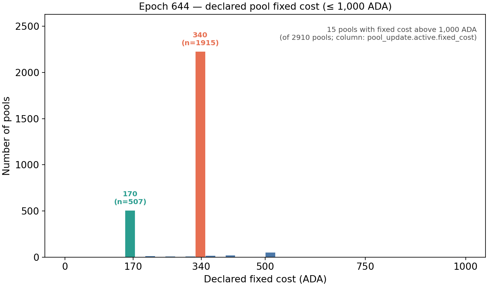

A change in $c_{min}$ or in the declared fixed cost $c_i$ does not affect the pool's gross reward. Instead, the declared fixed cost is paid to the operator before the remaining rewards are divided between the operator and delegators.

The main objective of $c_{min}$ is to support economically viable pool operation and provide some protection against Sybil attacks. Without a minimum fixed cost to declare, an operator could create many pools, declare negligible costs, and offer returns to delegators that other operators (that needs to declare their cost) may be unable to match.

The main trade-off comes from the incentive that a pool has to declare a larger fixed cost to cover their actual cost versus to declare less to become more attractive for delegators. That is, a higher $c_{min}$ can therefore protect operator revenues and discourage small, undercapitalized Sybil pools, but it also reduces the competitiveness of small and new pools and may push delegation toward larger pools. A lower $c_{min}$ facilitates entry and improves small-pool returns, but may intensify competition in $c_i$ and make it easier for multi-pool operators to expand.

The appropriate level of $c_{min}$ therefore balances operator viability and Sybil resistance against entry, competition, and decentralization.

Next, these effects and trade-off are explained with more details

## Direct mechanical effects 
In this section we consider the direct effects of **reducing** `minPoolCost` while holding everything else equal (ceteris paribus). 

### Gross pool rewards

Notice that the gross pool reward function does not depend on $c_{min}$:

$$f(\sigma_i,p_i) = \frac{R}{1+a_0} \left[ \tilde{\sigma}_i + a_0\tilde{p}_i \frac{\tilde{\sigma}_i-\tilde{p}_i\frac{z_0-\tilde{\sigma}_i}{z_0}}{z_0} \right], \qquad \tilde{\sigma}_i = \min\\{\sigma_i, z_0\\}, \qquad \tilde{p}_i = \min\\{p_i, z_0\\},$$

However, minPoolCost operates through two distinct channels: it guarantees fixed cost recovery for the operator while simultaneously dictating net delegator yield, thereby driving both operator profitability and pool competitiveness.

### Operator gross revenue

The pool operator gross revenue function is

$$\begin{cases} c_i + (f(\sigma_i,p_i)-c_i) \left[m_i +(1-m_i)\frac{\hat{p}_i}{\sigma_i}\right], & \text{if }  f(\sigma_i,p_i)>c_i, \\ 
f(\sigma_i,p_i), & \text{otherwise} \end{cases}$$

where it is assume that the  operator's active pledge is equal to its declared pledge, $\hat{p}_i=p_i$.
    
Consider a reduction in `minPoolCost` and that the operator declares $c_i=$`minPoolCost`. Note that this assumption contrasts with [Brünjes et al. (2020)](References/papers/reward-sharing-schemes_brunjes-kiayias-et-al_2020.pdf) setting where there is incentive compatibility, i.e., each operator declares their actual cost. However, the heavy concentration at 340 and 170 ADA in the [histogram](fig-min-pool-cost-644) suggests parameter inertia or active competitive optimization rather than truthful cost revelation. 

The next plot shows the effect of a reduction in `minPoolCost` change in the pool operator gross reward.

The plot shows that a reduction in the declared fixed cost (from $170$ ADA to $75$ ADA) reduces pool operator revenues, with the effect being particularly strong for small pools. This is because the fixed cost plays an important role in operator's revenues. To see this, take

$$
\Pi_i = c_i+(f(\sigma_i,p_i)-c_i)\underbrace{[m_i +(1-m_i)\frac{p_i}{\sigma_i}]}_{s\in[0,1]},
$$

Hence,

$$\Pi_i=sf(\sigma_i,p_i)+(1-s)c_i, \quad \text{and} \quad \partial \Pi_i/\partial c_i=(1-s)\geq 0.$$

It follows that the operator's profit drops with a lower $c_i$ (unless $p_i=\sigma_i=z_0$). A potential consequence is that very small pool operators will not have room to reduce their fixed costs without losing economic viability. 

### Delegator return per unit of stake

Reducing the fixed cost increases the net reward 

$$(f(\sigma_i,p_i)-c_i),$$ 

that a pool can distribute among its delegators. Next plot illustrates this benefit comparing the net rewards per unit of stake for different $c_i$, where the net rewards per unit of stake is

$$\frac{max\\{f(\sigma_i,p_i)-c_i,0\\}}{\sigma_i},$$

  
The plot suggests that cost reductions have a more significant positive impact on the competitiveness of small pools than on that of large ones. Nevertheless, large pools may still remain more attractive for delegators.

## Past evidence

On epoch 445 there was a reduction of the `minPoolCost` from $340$ ADA to $170$ ADA. The analysis in this section illustrates the effects that the measure took into operators and delegators. Note that these observations do not imply that a new reduction will produce the same results, since market conditions may differ.

Key findings from this section:

1. Operator repricing was limited: about $13\%$ reduced fixed cost and about $2.8\%$ reduced margin.
2. Cost-plus-margin cuts were associated with better delegation outcomes than cost-only adjustments.
3. Decentralization indicators moved slightly toward higher concentration over the analyzed window.
4. Viability declined in the cost-adjusted counterfactual, while delegator APR improved only modestly at the network level.

### Aggregate system snapshot

The table summarizes the aggregate state of the pools ecosystem before the reduction in `minPoolCost`(epoch 426), at the moment of the reduction (epoch 445), and after it (epoch 450). The aggregate staking level remains stable with a small reduction ($-1.6\\%$) in the number of pools. 

| Epoch | Number of pools | Total stake (B ADA) |
|---:|---:|---:|
| 426 | 2,931 | 22.73 |
| 445 | 2,886 | 23.05 |
| 500 | 2,884 | 22.85 |

### Operators and delegators responses

The following plots shows the response of operators and delegators to the reduction in `minPoolCost`. We have consider several epochs after the change to give time to players to react to that change. Notice, however, that the observed changes do not imply that all changes followed directly from the reduction in `minPoolCost`. The next plot shows that near $13\\%$ of pools reduced their declared fixed cost and that, among them, $55\\%$ gained delegation (again, we observe here correlation but not causality). That is, the vast majority of pool operators ($>87\%$) opted for a passive, static strategy rather than actively adjusting the fixed cost to compete for market share.

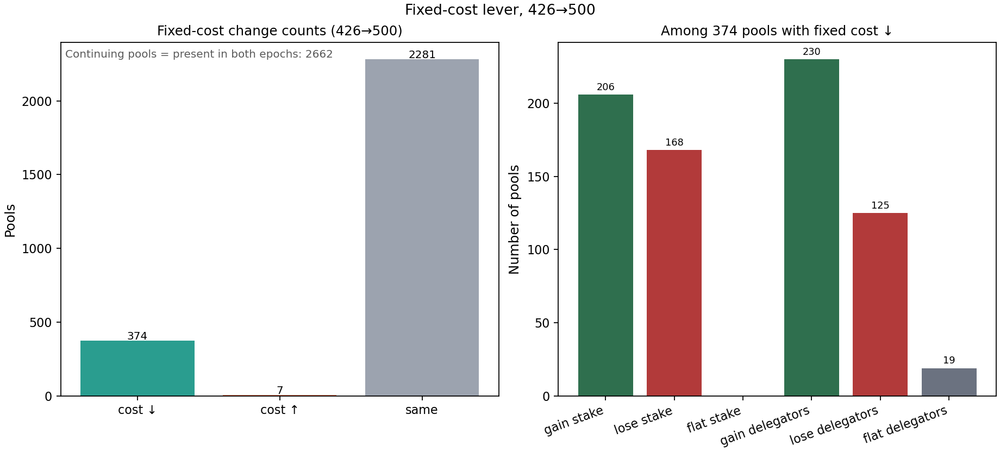

The next plots show potential reactions by the network of pools to the new market conditions. In the same window of time, only $2.8\\%$ of all pools reduced their margin but $61\\%$ of them gained delegation. This suggests that redelegation may be slightly more sensitive to variable margin ($m_i$) cuts than fixed cost ($c_i$) cuts.

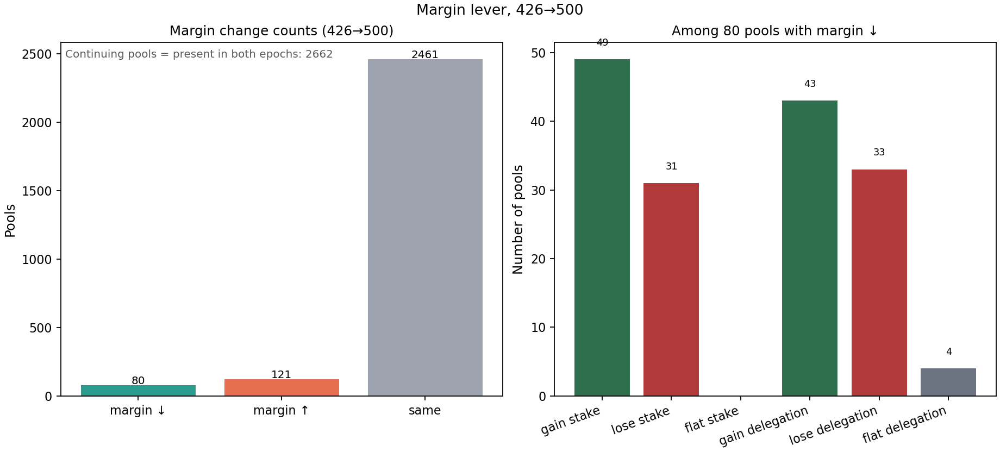

One interesting question is whether the reduction in fixed cost $c_i$ comes together with a reduction in margin $m_i$ to increase competitiveness or with an increment in margin to compensate for the lower $c_i$. The next plot  indicates a fraction $12.6\\%$ of those pools that reduced the fixed cost also reduced the margin, while $20\\%$ increased it. 

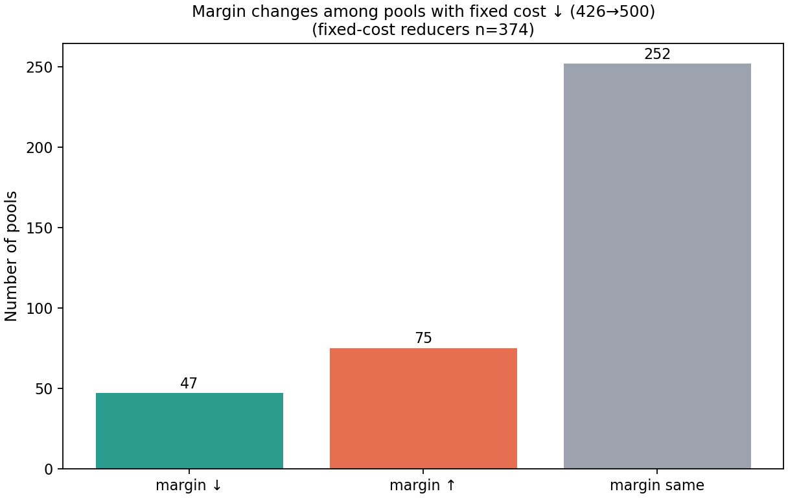

The last plot shows that those pools combining both measures is a more effective strategy to attract delegations.

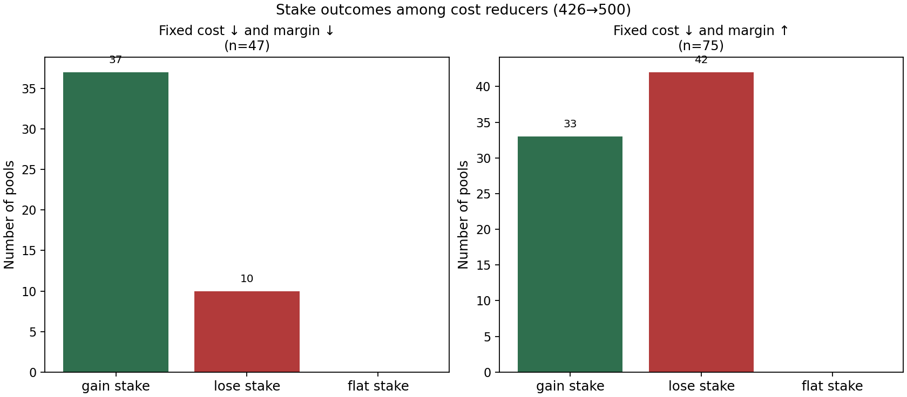

### Decentralization metrics

Next, we measure the impact of the minPoolCost reduction on network decentralization. We evaluate decentralization using two metrics: the Nakamoto coefficient (the minimum number of pools controlling over $50\%$ of total delegation) and the aggregate pledge of these top pools. Ideally, this analysis should be conducted at the level of independent operators rather than individual pools. However, because the total pool count remains relatively stable between epochs 426 and 500, comparing the relative change in these coefficients across pools provides a reliable proxy for operator dynamics.

| Epoch | Nakamoto \(N\) | Snapshot pools | Aggregate stake of \(N\) | Total active stake | Share | Min-agg declared pledge | Min-agg active pledge |
|------:|---------------:|---------------:|-------------------------:|-------------------:|------:|------------------------:|----------------------:|
| 426 | 191 | 2,931 | 11.37B ADA | 22.73B ADA | 50.02% | 1.44B ADA | 2.2B ADA |
| 500 | 186 | 2,884 | 11.45B ADA | 22.85B ADA | 50.10% | 1.28B ADA | 1.8B ADA |

Over the analyzed window (epochs 426 to 500), decentralization metrics shifted toward greater stake concentration across two key dimensions. While the Nakamoto coefficient experienced a modest drop of $-2.6\%$ (from $191$ to $186$ pools), the economic commitment securing these controlling pools eroded significantly more. Specifically, the minimum aggregate active pledge among the Nakamoto set fell by $-18.2\%$ (from $2.20\text{B}$ to $1.80\text{B}$ ADA), accompanied by an $-11.1\%$ decrease in declared pledge.These findings indicate that following the parameter adjustment, stake concentration not only consolidated into slightly fewer pools, but the controlling pools themselves operated with substantially less "skin in the game," marking a compound increase in network centralization.

### Pools viability

We recompute operator rewards $\Pi_i$ for a fixed cohort of pools present in both epoch 426 and epoch 500, holding each pool’s epoch $426$ stake $\sigma_i$, declared pledge $p_i$, active pledge $\hat p_i$, and margin $m_i$ fixed. Gross pool reward $f(\sigma_i,p_i)$ is computed once under $k=500$, using $T=36.01B$ ADA, $R=21.6M$ ADA, and $a_0=0.3$ (which are the parameters value for epoch 426). We then compare viability under each pool’s declared fixed cost at epoch $426$ (when $\text{`minPoolCost`}=340$) versus its declared fixed cost at epoch $500$ (when $\text{`minPoolCost`}=170$). This allows us to compare pool viability before and after the parameter change while isolating operator fee responses. By holding delegation and other market variables constant, we focus exclusively on how the same pool cohort adjusted its declared fixed cost in response to the `minPoolCost` reduction.

With monthly OpEx of $667$ USD and ADA at $0.31$ USD,

$$C^*=\frac{667/6}{0.31}=358.6 \text{ ADA per epoch}.$$

Let $r=\Pi_i/C^{\*}$. Among $1'991$ pools with theoretical reward (of $2'662$ continuing pools; the rest lack complete fields or have declared pledge above epoch $426$ stake), $672$ cover $C^*$ under epoch $426$ costs, of which $427$ are on the edge ($1\le r<2$). Under the same delegation but with epoch $500$ declared costs, only $588$ remain viable. The Edge group falls from $427$ to $354$, while Strong ($r\ge 5$) is unchanged at 53.

After the change in `minPoolCost`, in the analyzed cohort of $1'991$ pools, $312$ changed cost ($306$ decreases, $6$ increases), including $267$ direct $340$-to-$170$ changes.

| | Epoch-426 costs (minPoolCost 340) | Epoch-500 costs (minPoolCost 170) | Variation |
| :--- | ---: | ---: | ---: |
| Pools | 1,991 | 1,991 | — |
| Cover OpEx ($r\ge 1$) | 672 | 588 | −12.5% |
| Losing ($r<1$) | 1,319 | 1,403 | +6.4% |
| Edge ($1\le r<2$) | 427 | 354 | −17.1% |
| Comfortable ($2\le r<5$) | 192 | 181 | −5.7% |
| Strong ($r\ge 5$) | 53 | 53 | 0.0% |

The plot shows a moderate reduction in operator viability from the historical cost cuts, before any redelegation or operator response.

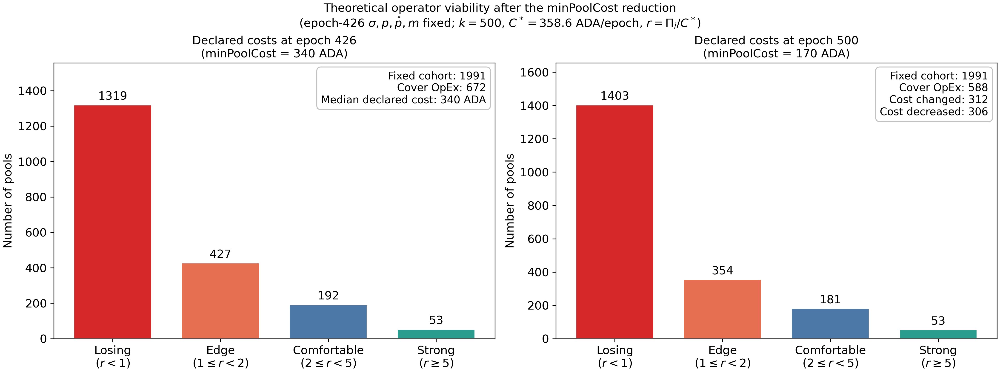

### APR

To evaluate how the reduction in `minPoolCost` affects delegator returns, we calculate the annualized delegator yield:

$$\text{APR}_i \approx 73(1-m_i)\frac{\max\\{f(\sigma_i,p_i)-c_i,0\\}}{\sigma_i}$$

This measures the net yield per ADA after accounting for fixed costs ($c_i$) and variable margins ($m_i$). Calculations are based on the epoch $426$ snapshot with parameters $T=36.01\text{B ADA}$, $R=21.6\text{M ADA}$, $a_0=0.3$, and $k=500$. Of the $2,445$ pools with complete baseline data—including those where $p_i > \hat{p}_i$ that receive zero rewards—$2,265$ survived through epoch $500$, while $180$ exited. 

For the counterfactual scenario, surviving pools hold their epoch $426$ stake, pledge, and margin fixed while adopting their actual epoch $500$ declared fixed costs. This isolates operators' fixed-cost responses while holding delegation constant (though we acknowledge that in practice, cost adjustments may also react to new pool entry and redelegation). Exiting pools are retained in the epoch $426$ baseline to prevent survivorship bias, but are excluded from the cost-adjusted scenario since their post-exit parameters are unobserved.

| Sample and scenario | Pools | Return $>0$ | Median APR, positive | Mean APR, positive |
| :--- | ---: | ---: | ---: | ---: |
| Epoch-426 costs: all pools | $2,445$ | $887$ | $2.97\\%$ | $2.58\\%$ |
| Epoch-426 costs: pools exiting by epoch $500$ | $180$ | $36$ | $2.11\\%$ | $1.98\\%$ |
| Epoch-426 costs: survivors | $2,265$ | $851$ | $2.99\\%$ | $2.60\\%$ |
| Epoch-500 costs: survivors (cost-adjusted) | $2,265$ | $878$ | $3.02\\%$ | $2.64\\%$ |

As expected, fixed-cost reductions by select operators led to a slight increase in positive delegator APRs (median rising from $2.99\\%$ to $3.02\\%$). However, because only a small fraction of operators lowered their $c_i$, the median yield network improvement remains modest. Although individual pools that cut their fixed costs may have enhanced their competitive standing, these adjustments were insufficient to materially alter network-wide median attractiveness.

## Behavioral and equilibrium effects

This section identifies potential behavioral (or second-order) effects—primarily concerning delegator and operator decisions **given the current state**.

Changing $c_{min}$ does not modify gross rewards $f(\sigma_i,p_i)$ directly, but it changes feasible declared costs $c_i$, which feed into pool desirability, operator revenue, and participation constraints. The equilibrium forces are therefore mostly mediated by redelegation and strategic pool-level adjustments.

### Rational behavior

(here short description of how the equilibrium in the paper changes, with expected responses of operators and delegators)

<!-- We start from a frictionless non-myopic benchmark (consistent with the reward-sharing game): forward-looking delegators and operators, truthful cost declaration ($c_i=\hat c_i$), and binding floor $c_i\ge c_{min}$.

For competitive ranking, use

$$
P_i(c_{min})=f(z_0,p_i)-c_i,
\qquad
D_i(c_{min})=(1-m_i)[P_i(c_{min})]_+.
$$

If the floor binds for pool $i$ (that is, $c_i=c_{min}$), then

$$
\frac{\partial P_i}{\partial c_{min}}=-1,
\qquad
\frac{\partial D_i}{\partial c_{min}}=-(1-m_i)\mathbf 1\{P_i>0\},
$$

so increasing $c_{min}$ directly lowers desirability for floor-binding pools. -->

#### Delegators moving stake (?)

<!-- Delegators allocate by expected net return per unit stake,

$$
r_i^D=(1-m_i)\frac{\max\\{f(\sigma_i,p_i)-c_i,0\\}}{\sigma_i}.
$$

With a floor change, a simple reallocation equation is

$$
\Delta\sigma_i^D=\eta\sigma_i\big(r_i^D-\bar r^D\big),
\qquad
\sigma_i'=\sigma_i+\Delta\sigma_i^D.
$$

Hence, raising $c_{min}$ tends to push stake away from small/floor-binding pools (where $c_i/\sigma_i$ is large), while reducing $c_{min}$ relaxes that pressure. -->

#### Operators changing pledge, margin, or declared fixed cost

Operator utility remains

$$
U_i=\Pi_i-\hat c_i,
\qquad
\Pi_i=c_i+(f(\sigma_i,p_i)-c_i)\left[m_i+(1-m_i)\frac{\hat p_i}{\sigma_i}\right],
$$

with feasibility $c_i\ge c_{min}$. A reduced-form best response is

$$
(c_i^{\*},m_i^{\*},\hat p_i^{\*})\in\arg\max_{c_i,m_i,\hat p_i} U_i\big(c_{min},\sigma_i'(c_i,m_i,\hat p_i),c_i,m_i,\hat p_i\big)
\quad\text{s.t. }c_i\ge c_{min}.
$$

When the floor is lowered, some operators use lower $c_i$ to gain delegation. We should expect a stronger competition for delegations by reducing the fixed cost or the margin when reducing the fixed cost is not convenient. 

Actual data shows a different behavior to the one theoretically predicted. We already pointed out that a potential consequence of reducing $c_{min}$ is that very small pool operators will not have room to reduce their fixed costs without losing economic viability. How important may this drop in the operator profit be? The [histogram](fig-min-pool-cost-644) shows that many pools prefer to stay with $c_i = 340$ ADA instead of reducing it to $170$ ADA and gain competitiveness. The next plot shows the $n=559$ pools that get a reward during epoch 644 (i.e., they produced a block). The plot shows how much reward (in percentage) these operators would lose if they report $170$ ADA instead of $340$ ADA. The figures are considerable. Note that in the first bin there are 86 pools: 64 of them lose exactly 0% because they all have a margin $m_i=100\%$, while 22 losses belongs to the range $(0,2.5\%).

Empirical data reveals behavior that diverges from theoretical predictions. As previously noted, a lower declared fixed cost may make small pools more attractive for delegators but they may find it difficult to reduce their $c_i$ without compromising their economic viability. How significant is this potential loss in operator margin? As illustrated in the [histogram](fig-min-pool-cost-644), many operators choose to retain $c_i = 340\text{ ADA}$ rather than lowering it to $170\text{ ADA}$ to gain competitive yield for delegators. To quantify the financial impact, the subsequent plot analyzes the set of $n = 559$ reward-receiving pools and declaring $c_i=340$ ADA in epoch 644 (i.e., those that produced at least one block). It plots the percentage loss in operator rewards resulting from a reduction to $170\text{ ADA}$. The revenue impact is substantial. Notably, the first bin contains 86 pools: 64 experience exactly a $0\%$ loss due to setting a margin of $m_i = 100\%$, while the remaining 22 pools incur losses within the $(0, 2.5\%]$ range.

  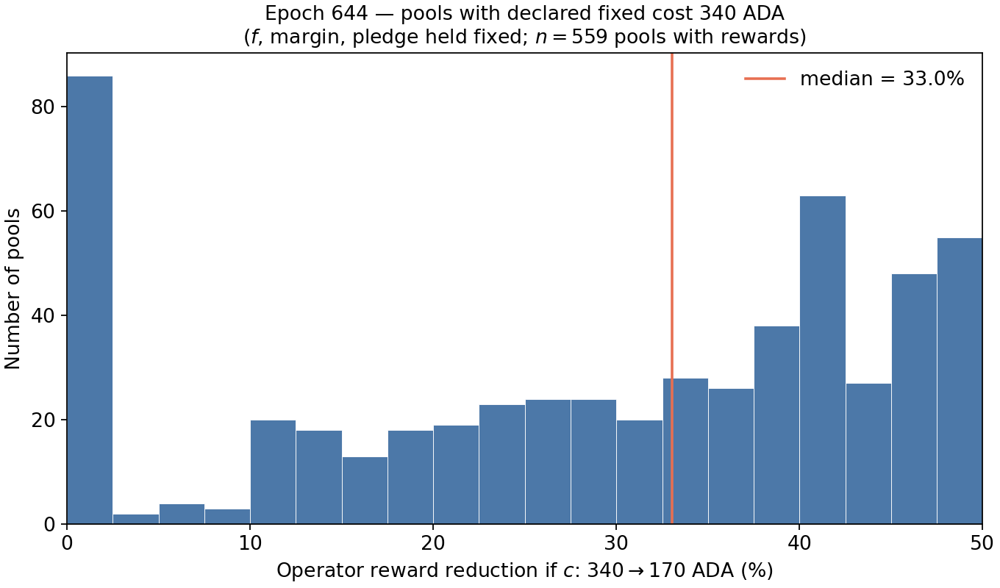

The subsequent plot demonstrates that pools adopting the lowest allowable fixed cost ($170\text{ ADA}$) tend to hold significantly higher delegation levels. Conversely, nearly $54\\%$ of pools retaining $340\text{ ADA}$ command less than $100\text{k ADA}$ in stake, compared to only $21\\%$ among those setting $170\text{ ADA}$.

  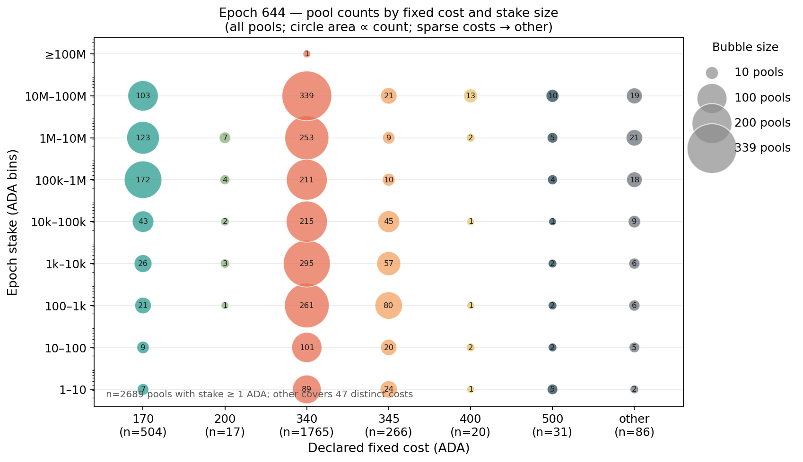

The theoretical model also predicts intensified competition in margins ($m_i$) following a reduction in $c_{min}$. However, as shown in the next plot, this price competition is mainly observed among pools declaring $c_i = 170\text{ ADA}$. In contrast, many pools retaining $340\text{ ADA}$ continue to charge high margins. Despite commanding low delegation levels, these operators show no tendency to lower their margins to improve their attractivness for delegators.

  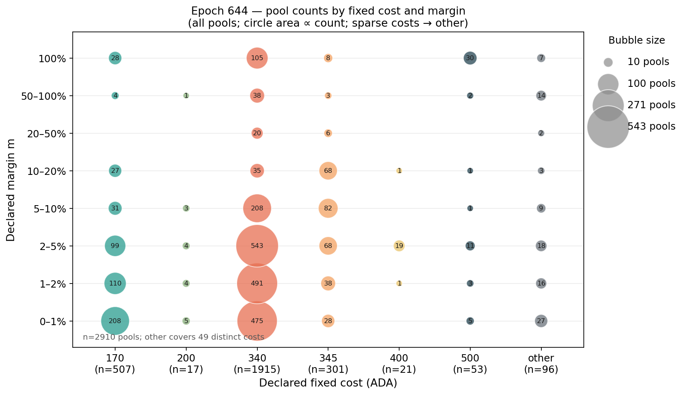

As an intriguing side note, in the preceding figures—[fixed cost versus stake size](id="fig-bubble-c-versus-size") and [fixed cost versus size](fig-bubble-c-versus-margin)—the total number of pools choosing the minimum allowable fixed cost ($170\text{ ADA}$) approaches $500$, aligning remarkably well with the target pool parameter $k$.

#### Entry or exit of pools

Entry or exit has to be analyze the participation constraint, that needs ot take into account the actual fixed costs $\hat c_i$ and opportunity costs or outside options.  Let

$$
U_i=\Pi_i-\hat c_i,
\qquad
\Pi_i=c_i+(f(\sigma_i,p_i)-c_i)\left[m_i+(1-m_i)\frac{\hat p_i}{\sigma_i}\right],
\qquad
s_i\equiv m_i+(1-m_i)\frac{\hat p_i}{\sigma_i}\in[0,1].
$$

It follows that a pool decide to participate when

$$U_i\ge \underline{U}_i \iff f_i\ge f_i^{\star} \equiv \frac{\underline{U}_i+\hat c_i-(1-s_i)c_i}{s_i},
$$

where $\underline{U}_i$ denotes the outside option. For simplicity, let's assume $\underline{U}_i=0$, however, a realistic outside option could be an anual return of $3\\%-5\\%$.

Notice that if there is truthful cost reporting ($c_i=\hat c_i$), then the previous condition becomes $f_i\ge c_i$. However, we have already argued that data do not suggests truthful reporting. 

Using actual data from epoch 644, the following chart shows how many of the pools during epoch 644 are on viability risk (note that taking only one epoch as data source may do not represent the actual state). For each pool we calculate its 

$$
\Pi_i=
\begin{cases}
f_i, & f_i\le c_i,\\
c_i+(f_i-c_i)\left[m_i+(1-m_i)\dfrac{\hat{p}_i}{\sigma_i}\right], & f_i>c_i,
\end{cases}
$$

using their margin, delegation, active and delcared pledge, and declared fixed cost. However, we consider the case in which the latter is not the actual operating cost. We assume that all pools face the same operation cost/expenditure ($C^*$) equal to $667$ USD per month (six epochs), and a token price of $0.15 USD/ADA$ giving 

$$C^*=667/6/0.15=741.1 \text{ USD per epoch}.$$

The plot measures $r=\Pi_i/C^{\*}$, where a $r<1$ indicates not enough rewards to cover costs. Among $2223$ pools, only $274$ would be able to cover the OpEx $C^*$. However, $150$ of them would be on a risky situation ($1\leq r\leq 2$)

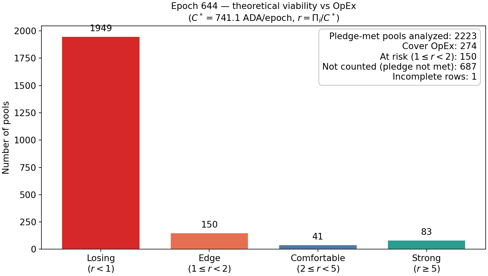

Next charts shows what are the characteristics of the losing and edge pools. 

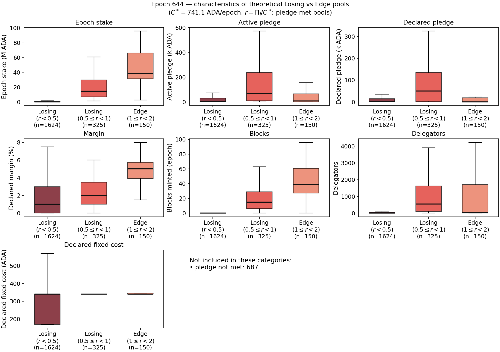

| | Losing (n=1949) | Edge (n=150) | Comfortable+Strong (n=124) |
|---|---|---|---|
| Epoch stake (M ADA), median | 0.14 | 38.29 | 35.94 |
| Active pledge (k ADA), median | 5.0 | 8.0 | 429.0 |
| Declared pledge (k ADA), median | 1.0 | 0.1 | 10.0 |
| Declared fixed cost (ADA), median | 340 | 340 | 340 |
| Margin (%), median | 1.0 | 5.0 | 100.0 |
| Theoretical operator reward (ADA), median | 43 | 933 | 8,790 |
| Coverage ratio \(r\), median | 0.058 | 1.259 | 11.860 |

Unsurprisingly, pools in the losing set hold less total delegation. This remains true even when operators attempt to attract delegators by lowering their variable margins ($m_i$). Delegators seem unresponsive to margin cuts because $m_i$ alone does not dictate a pool's market appeal—notably, the median fixed cost ($c_i$) remains anchored at $340$ ADA despite `minPoolCost` $ = 170$ ADA. Pool attractiveness seems to be driven by existing delegation volume and operator pledge size, which may create entry barriers for new or small pools.

#### Pool splitting by multi-pool operators (?)

<!-- For an MPO controlling $n$ pools,

$$
\Pi^{\text{MPO}}(n)=\sum_{j=1}^{n}\Pi_j\big(c_{min},\sigma_j',\hat p_j,m_j,c_j\big),
\qquad c_j\ge c_{min}.
$$

Splitting is attractive if $\Pi^{\text{MPO}}(n+1)-\Pi^{\text{MPO}}(n)>0$. Lower $c_{min}$ weakens the fixed-cost barrier per additional pool and can strengthen splitting incentives; higher $c_{min}$ does the opposite. -->

#### Changes in staking participation (?)

<!-- Let total active stake be $S=\sum_i\sigma_i$. A reduced-form aggregate response is

$$
\Delta S=\chi\,\big(\bar r_{\text{exp}}(c_{min})-r_{\text{alt}}\big),
$$

where $\bar r_{\text{exp}}$ is expected network staking return net of fee/cost pass-through. Because $c_{min}$ is mostly redistributive within staking, first-order effects are on allocation across pools, with aggregate participation moving mainly through perceived net-return changes. -->

### Behavioral deviations from the rational benchmark (??

<!-- We preserve the five baseline channels but relax full rationality by introducing market frictions, bounded rationality, and coordination failure.

Compared to delegators, pool operators generally act as more sophisticated market participants. Consequently, we assume operators make rational, optimizing decisions while explicitly factoring in delegator behavioral frictions or bounded rationality into their strategies. 

#### Delegators moving stake

With search and attention frictions, observed migration is dampened:

$$
\Delta\sigma_i^{\text{obs}}=\lambda_i\,\Delta\sigma_i^D,
\qquad 0<\lambda_i<1.
$$

Under this friction, even large changes in $c_{min}$ can translate into slow redelegation if delegators are inert.

#### Operators changing pledge, margin, or declared fixed cost

Rather than jumping to the optimum, operators partially adjust controls:

$$
c_{i,t+1}=\max\{c_{min},\;c_{i,t}+\rho_c(c_i^{\*}-c_{i,t})\},
$$
$$
m_{i,t+1}=m_{i,t}+\rho_m(m_i^{\*}-m_{i,t}),
\qquad
\hat p_{i,t+1}=\hat p_{i,t}+\rho_p(\hat p_i^{\*}-\hat p_{i,t}),
$$

with $0<\rho_c,\rho_m,\rho_p\le 1$. This generates transitional dynamics and temporary mispricing after a floor change.

#### Entry or exit of pools

Inertia can be represented by hysteresis thresholds around participation:

$$
U_i(c_{min},\sigma_i')<-H_i^{\text{exit}},
\qquad
U_i^{\text{entry}}(c_{min},\sigma_i')>H_i^{\text{entry}},
$$

with $H_i^{\text{entry}},H_i^{\text{exit}}>0$. This allows weak pools to remain active and viable entrants to delay launch, even when rational static constraints indicate immediate adjustment.

#### Pool splitting by multi-pool operators

Include organizational frictions in expansion value:

$$
V^{\text{split}}(n)=\Pi^{\text{MPO}}(n)-K(n),
$$

where $K(n)$ is increasing and convex. A lower floor may still fail to induce extra splits for operators with high coordination costs.

#### Changes in staking participation

If delegators overweight short-run payout changes, participation reacts to a salience-weighted objective:

$$
\Delta S_t=\chi_s\big(r_t-r_{\text{alt},t}\big)+\chi_l\,\mathbb E_t\!\left[\sum_{h\ge 1}\beta^h\big(r_{t+h}-r_{\text{alt},t+h}\big)\right],
$$

with $\chi_s>\chi_l$ under short-term salience. This can amplify short-run participation responses to changes in $c_{min}$ even when long-run effects are limited. -->

## Interaction effects (ToDo)

See the file analysis in the [interaction effects file](Interaction-effects/interaction_effects.md)

