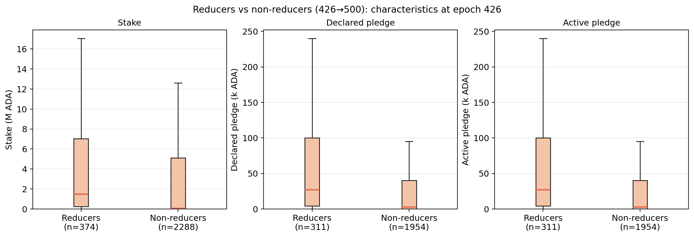
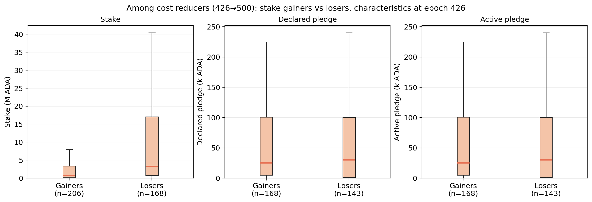
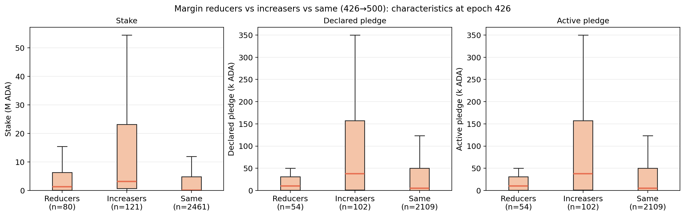
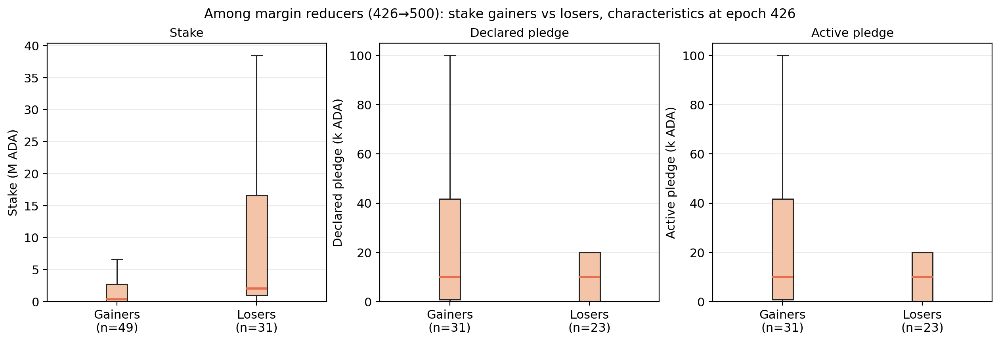
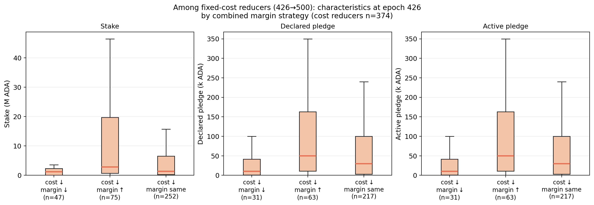
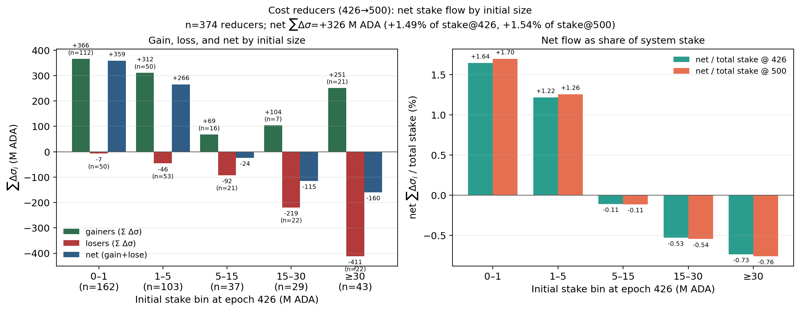
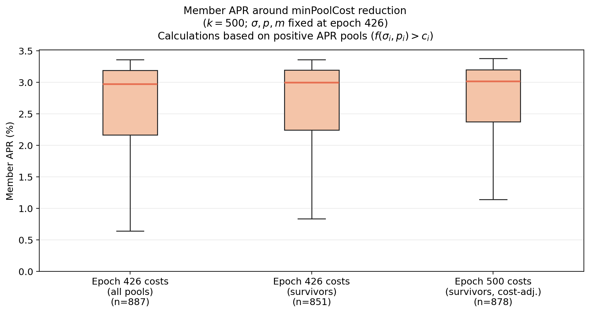
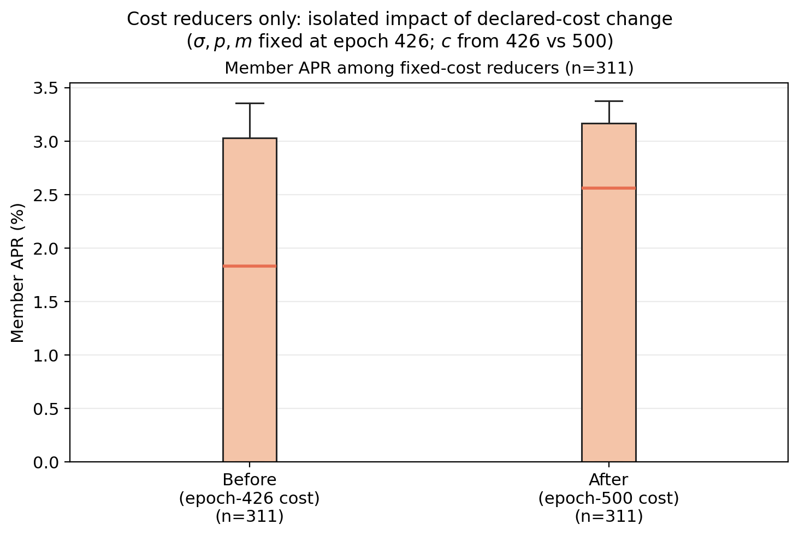
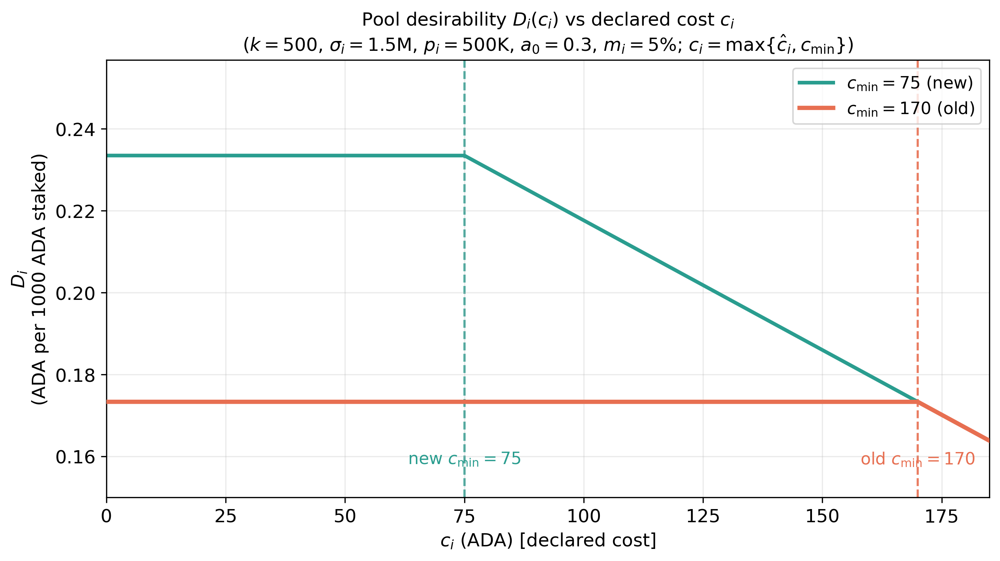
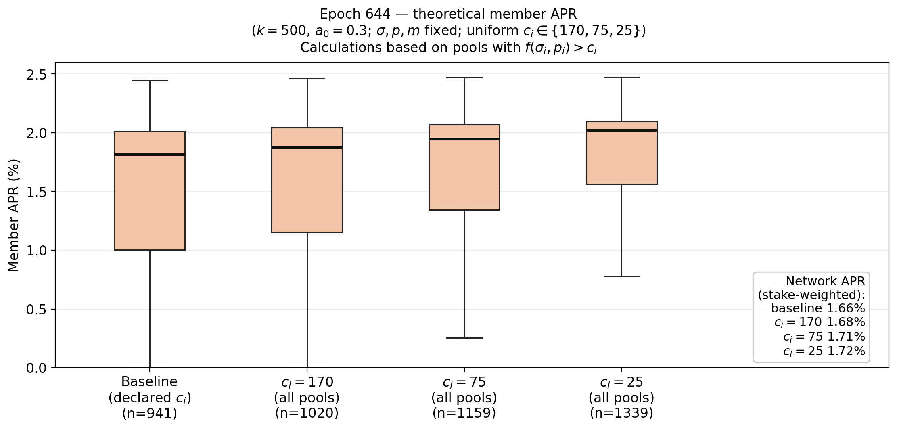

# Incentive effects of changing `minPoolCost` ($c_{min}$)

## Summary: Trade-off from reducing minPoolCost.

Reducing minPoolCost is conditionally beneficial. The net effect depends on which policy objective is prioritized: operator competitiveness for delegators, operator viability, Sybil resistance, or decentralization.

**Pros**
1. Higher delegator net yield in pools that reduce fixed cost.
2. Lower entry barrier for some operators.
3. Stronger competition through fixed cost and, in some cases, margin adjustments.

**Risks**
1. Lower operator revenue, especially for smaller pools with thin margins.
2. Potential increase in concentration.

**What the evidence suggests**
1. Behavioral adjustment is partial: most operators do not actively reprice/respond to a parameter change.
2. Cost cuts alone do not guarantee delegation gains.
3. Decentralization signals in the observed window are mixed to negative.

**Policy interpretation**
1. If the primary objective is short-run improvement in delegator yield, a lower minPoolCost can help.
2. If the primary objective is long-run decentralization and operator skin-in-the-game, reducing minPoolCost in isolation is not clearly supportive.
3. minPoolCost reduction might need to be paired with complementary safeguards, not used as a standalone lever.

## Parameter values at the current state
For the numerical analysis in this section, we use the parameter values below unless stated otherwise. These values may differ from the snapshot values reported in [Parameter-Landscape.md](../../Parameter-Landscape.md), because this comparative-statics exercise is anchored to a single reference state.

| Symbol | Parameter | Value |
| --- | --- | --- | 
| $R$ | Reward pot | $14.9M$ ADA| 
| $T$ | Total ADA supply | $38.8B$ ADA | 
| $k$ | Target number of stake pools | 500 | 
| $a_0$ | Pledge influence. | 0.3 | 
| $c_{min}$ | Minimum fixed cost (`minPoolCost`). | 170 ADA |
| $m_i$ | Operator margin/commission deducted from delegator rewards. | 5%  |
| $\rho$ | Reserve decay rate.  | 0.3%  |
| $\tau$ | Treasury share.| 20% |

## Design

The parameter `minPoolCost` (here also denoted as $c_{min}$) sets the minimum fixed cost that a stake pool operator may declare. The following plot shows the histogram of the fixed cost declarations at epoch 644.

  

A change in $c_{min}$ or in the declared fixed cost $c_i$ does not affect the pool's gross reward. Instead, the declared fixed cost is paid to the operator before the remaining rewards are divided between the operator and delegators.

The main objective of $c_{min}$ is to support economically viable pool operation and provide some protection against Sybil attacks. Without a minimum fixed cost to declare, an operator could create many pools, declare negligible costs, and offer returns to delegators that other operators (that needs to declare their cost) may be unable to match.

The main trade-off comes from the incentive that a pool has to declare a larger fixed cost to cover their actual cost versus to declare less to become more attractive for delegators. That is, a higher $c_{min}$ can therefore protect operator revenues and discourage small, undercapitalized Sybil pools, but it also reduces the competitiveness of small and new pools and may push delegation toward larger pools. A lower $c_{min}$ facilitates entry and improves small-pool returns, but may intensify competition in $c_i$ and make it easier for multi-pool operators to expand.

The appropriate level of $c_{min}$ therefore balances operator viability and Sybil resistance against entry, competition, and decentralization.

Next, these effects and trade-off are explained with more details

## Direct mechanical effects 
In this section we consider the direct effects of **reducing** `minPoolCost` while holding everything else equal (ceteris paribus). 

### Gross pool rewards

Let $\sigma_i$ denote the total delegation at pool $i$, $p_i$ to the declared pledge of the pool, and $z_0$ to the saturation threshold. The gross pool reward function is

$$f(\sigma_i,p_i) = \frac{R}{1+a_0} \left[ \tilde{\sigma}_i + a_0\tilde{p}_i \frac{\tilde{\sigma}_i-\tilde{p}_i\frac{z_0-\tilde{\sigma}_i}{z_0}}{z_0} \right], \qquad \tilde{\sigma}_i = \min\\{\sigma_i, z_0\\}, \qquad \tilde{p}_i = \min\\{p_i, z_0\\},$$

which does not depend on $c_{min}$.

> **Note:** Most of the analysis presented in this document assumes a static environment, omitting the dynamic, inter-epoch feedback effects of return flows to the reserves. While return flows can be evaluated statically for a given state, fully dynamic feedback scenarios will be explicitly indicated.

However, `minPoolCost` operates through two distinct channels: it guarantees fixed cost recovery for the operator while simultaneously dictating net delegator yield, thereby driving both operator profitability and pool competitiveness.

### Operator gross revenue

The pool operator gross revenue function is

$$\begin{cases} c_i + (f(\sigma_i,p_i)-c_i) \left[m_i +(1-m_i)\frac{\hat{p}_i}{\sigma_i}\right], & \text{if }  f(\sigma_i,p_i)>c_i, \\ 
f(\sigma_i,p_i), & \text{otherwise} \end{cases}$$

where $\hat{p}_i$ is the operator's active pledge (the stake/delegation own by the operator).
    
Consider a reduction in `minPoolCost` and that the operator declares $c_i=$`minPoolCost`. Note that this assumption contrasts with [Brünjes et al. (2020)](References/papers/reward-sharing-schemes_brunjes-kiayias-et-al_2020.pdf) setting where there is incentive compatibility, i.e., each operator declares their actual cost. However, the heavy concentration at 340 and 170 ADA in the [histogram](fig-min-pool-cost-644) suggests parameter inertia or active competitive optimization rather than truthful cost revelation. 

The next plot shows the effect of a reduction in `minPoolCost` change in the pool operator gross reward.

The plot shows that a reduction in the declared fixed cost (from $170$ ADA to $75$ ADA) reduces pool operator revenues, with the effect being particularly strong for small pools. This is because the fixed cost plays an important role in operator's revenues. To see this, take

$$
\Pi_i = c_i+(f(\sigma_i,p_i)-c_i)\underbrace{[m_i +(1-m_i)\frac{p_i}{\sigma_i}]}_{s\in[0,1]},
$$

Hence,

$$\Pi_i=sf(\sigma_i,p_i)+(1-s)c_i, \quad \text{and} \quad \partial \Pi_i/\partial c_i=(1-s)\geq 0.$$

It follows that the operator's profit drops with a lower $c_i$ (unless $p_i=\sigma_i=z_0$). A potential consequence is that very small pool operators will not have room to reduce their fixed costs without losing economic viability. 

### Delegator return per unit of stake

Reducing the fixed cost increases the net reward 

$$(f(\sigma_i,p_i)-c_i),$$ 

that a pool can distribute among its delegators. Next plot illustrates this benefit comparing the net rewards per unit of stake for different $c_i$, where the net rewards per unit of stake is

$$\frac{max\\{f(\sigma_i,p_i)-c_i,0\\}}{\sigma_i},$$

  
The plot suggests that cost reductions have a more significant positive impact on the competitiveness of small pools than on that of large ones. Nevertheless, large pools may still remain more attractive for delegators.

## Past evidence

On epoch $445$ there was a reduction of the `minPoolCost` from $340$ ADA to $170$ ADA. The analysis in this section illustrates the effects that the measure took into operators and delegators. Note that these observations do not imply that a new reduction will produce the same results, since market conditions may differ.

Key findings from this section:

1. Operator reduction of declared fixed cost was limited: about $13\\%$ reduced fixed cost.
2. Declared fixed cost $c_i$ cuts plus margin $m-i$ cuts were associated with better delegation outcomes than $c_i$ only adjustments.
3. Decentralization metrics moved slightly toward higher concentration over the analyzed window.
4. Operators viability declined after the declared fixed cost adjustment.
5. Delegator APR improved modestly at the network level.

### Aggregate system snapshot

The table summarizes the aggregate state of the pools ecosystem before the reduction in `minPoolCost`(epoch $426$), at the moment of the reduction (epoch $445$), and after it (epoch $450$). The aggregate staking remains stable with a small reduction ($-1.6\\%$) in the number of pools. 

| Epoch | Number of pools | Total stake (B ADA) |
|---:|---:|---:|
| 426 | 2,931 | 22.73 |
| 445 | 2,886 | 23.05 |
| 500 | 2,884 | 22.85 |

### Operators and delegators responses

The following plots and analysis show the response of operators and delegators to the reduction in `minPoolCost`. We have consider several epochs after the change to give time to players to react to that change. 

> Note: The observations identified in the following analysis provide suggestive evidence rather than causal proof. Consequently, they do not imply that all observed changes resulted directly from the reduction in `minPoolCost`. 

The next plots illustrates pool operator behavior following the reduction in `minPoolCost` between epochs $426$ and $500$. The left panel tracks changes in declared fixed costs of $n = 2,662$ pools present in both epochs, while the right panel highlights number of delegators and stake dynamics specifically among the subset of pools that lowered their fixed cost ($n = 374$).

Data reveals that only $14.0\\%$ of pools ($374$) reduced their declared fixed cost. Among them, $61.5\\%$ ($230$) expanded their delegator base and $55.1\\%$ ($206$) increased their total stake. In summary, the vast majority of pool operators ($>85\\%$) opted for a passive, static fixed cost strategy rather than adjusting it to compete for market share. For the minority that did cut costs, the decision was predominantly associated with positive inflows of both delegators and stake.

Next plot compares the baseline characteristics at epoch $426$ between pool operators who reduced their fixed costs ("Reducers") and those who did not ("Non-reducers"). Across all three metrics—epoch stake, declared pledge, and active pledge—pools that opted to lower their fixed costs exhibited systematically stronger baseline positions.

We next compare the baseline epoch $426$ characteristics between cost-reducing pools that gained total stake ("Gainers") and those that lost stake ("Losers"). A striking divergence emerges in baseline delegation volume: Gainers were predominantly smaller pools with a median stake of approximately $0.8\text{M ADA}$, whereas Losers held substantially higher baseline stake, with a median of $3.2\text{M ADA}$. In contrast, declared and active pledge distributions are virtually identical between the two groups. This suggests that reducing fixed costs was primarily effective for smaller pools where fee cuts yield a larger relative increase in delegator returns.

Beyond fixed-cost adjustments, operators could also alter their variable margin ($m_i$) to respond to changing market conditions. To investigate whether the reduction in minPoolCost catalyzed broader price competition across fee levers, the following analysis examines margin adjustments during the same observation window. Results show that operator adjustments to margins were even rarer than fixed-cost adjustments: only $3.0\\%$ of pools ($80$) reduced their margin. Among the $80$ pools that lowered their variable margin, $61.3\\%$ ($49$) succeeded in expanding their total stake, while $53.8\\%$ ($43$) grew their delegator count.

The following plot compares the baseline epoch $426$ characteristics across pool operators who reduced their variable margin ("Reducers", $n=80$), increased it ("Increasers", $n=121$), or kept it unchanged ("Same", $n=2,461$). The distributions reveal that margin behavior varies substantially by pool scale. Operators who raised their margins held the highest baseline stake as well as significantly larger declared and active pledges. In contrast, margin reducers were smaller pools with modest baseline stake and lower pledge levels. These patterns suggest that margin cuts were primarily utilized as a competitive catch-up strategy by mid-sized, lower-pledged pools, whereas large, well-capitalized pools held sufficient market power to increase margins without losing dominance.

Next, we compare the baseline epoch $426$ characteristics between margin-reducing pools that gained total stake ("Gainers", $n=49$) and those that lost stake ("Losers", $n=31$). Similar to fixed-cost reducers, Gainers were smaller pools with a median stake of under $0.5\text{M ADA}$, whereas Losers held higher baseline stake with a median near $2.0\text{M ADA}$. Regarding pledge levels, both Gainers and Losers shared identical median declared and active pledges. However, Gainers displayed a much wider dispersion in capital commitment. This suggests that reducing margins was primarily successful for smaller pools while larger pools continued to lose stake despite lowering their margins.

Having evaluated how pools responded to isolated fee adjustments, a natural follow-up question is whether operators coordinate both fee levers simultaneously. Specifically, does a reduction in fixed cost $c_i$ serve as a complement paired with a lower margin $m_i$ to maximize competitiveness, or as a substitute where operators raise $m_i$ to offset revenue lost from a lower $c_i$? The following analysis examines this interaction among cost-reducing pools: $12.6\\%$ ($47$) also reduced their variable margin, whereas $20.1\\%$ ($75$) increased it, leaving the remaining $67.4\\%$ ($252$) with an unchanged margin. 

The last plot shows that those pools combining both measures is a more effective strategy to attract delegations.

The next plot analyizes the pools characteristics—epoch stake, declared pledge, and active pledge—across fixed-cost reducers ($n=374$) grouped by their secondary margin strategy: those that also reduced margin ($n=47$), those that raised margin ($n=75$), and those that kept margin unchanged ($n=252$). Pools that combined fixed-cost reductions with margin increases held the highest baseline stake as well as the largest pledged capital. Conversely, operators adopting a dual-discount strategy were smaller, less-capitalized pools. These patterns suggests that smaller pools relied on double fee cuts to build market presence, whereas larger pools leveraged fixed-cost reductions as a buffer to simultaneously raise margins.

### Decentralization metrics

Next, we evaluate the impact of the minPoolCost reduction on network decentralization. We begin by examining fixed-cost reducers ($n = 374$) and measuring net stake flows across different initial stake tiers. The data reveals a net redistribution toward smaller pools. This shift provides suggestive evidence of decentralization among cost reducers.

 

The previous plot does not constitute whole-network causal proof, as it excludes non-reducing pools ($85\\%+$ of the network) that may have absorbed outflowing stake.

We next evaluate network decentralization using two metrics: the Nakamoto coefficient (the minimum number of pools controlling over $50\%$ of total delegation) and the aggregate pledge of these top pools. Ideally, this analysis should be conducted at the level of independent operators rather than individual pools. However, because the total pool count remains relatively stable between epochs 426 and 500, comparing the relative change in these coefficients across pools provides a reliable proxy for operator dynamics.

| Epoch | Nakamoto \(N\) | Snapshot pools | Aggregate stake of \(N\) | Total active stake | Share | Min-agg declared pledge | Min-agg active pledge |
|------:|---------------:|---------------:|-------------------------:|-------------------:|------:|------------------------:|----------------------:|
| 426 | 191 | 2,931 | 11.37B ADA | 22.73B ADA | 50.02% | 1.44B ADA | 2.2B ADA |
| 500 | 186 | 2,884 | 11.45B ADA | 22.85B ADA | 50.10% | 1.28B ADA | 1.8B ADA |

Over the analyzed window (epochs 426 to 500), decentralization metrics shifted toward greater stake concentration across the two key dimensions. While the Nakamoto coefficient experienced a modest drop of $-2.6\\%$ (from $191$ to $186$ pools), the economic commitment securing these controlling pools eroded significantly more. Specifically, the minimum aggregate active pledge among the Nakamoto set fell by $-18.2\\%$ (from $2.20\text{B}$ to $1.80\text{B}$ ADA), accompanied by an $-11.1\\%$ decrease in declared pledge. These findings indicate that, in the time window considered, stake concentration not only consolidated into slightly fewer pools, but the controlling pools themselves operated with substantially less "skin in the game," marking an increase in network centralization. 

### Pools viability

We recompute operator rewards $\Pi_i$ for a fixed cohort of pools present in both epoch 426 and epoch 500, holding each pool’s epoch $426$ stake $\sigma_i$, declared pledge $p_i$, active pledge $\hat p_i$, and margin $m_i$ fixed. Gross pool reward $f(\sigma_i,p_i)$ is computed once under $k=500$, using $T=36.01B$ ADA, $R=21.6M$ ADA, and $a_0=0.3$ (which are the parameters value for epoch 426). We then compare viability under each pool’s declared fixed cost at epoch $426$ (when $\text{`minPoolCost`}=340$) versus its declared fixed cost at epoch $500$ (when $\text{`minPoolCost`}=170$). This allows us to compare pool viability before and after the parameter change while isolating operator fee responses. By holding delegation and other market variables constant, we focus exclusively on how the same pool cohort adjusted its declared fixed cost in response to the `minPoolCost` reduction.

With monthly OpEx of $667$ USD and ADA at $0.31$ USD,

$$C^*=\frac{667/6}{0.31}=358.6 \text{ ADA per epoch}.$$

Let $r=\Pi_i/C^{\*}$. Among $1'991$ pools with theoretical reward (of $2'662$ continuing pools; the rest lack complete fields or have declared pledge above epoch $426$ stake), $672$ cover $C^*$ under epoch $426$ costs, of which $427$ are on the edge ($1\le r<2$). Under the same delegation but with epoch $500$ declared costs, only $588$ remain viable. The Edge group falls from $427$ to $354$, while Strong ($r\ge 5$) is unchanged at 53.

After the change in `minPoolCost`, in the analyzed cohort of $1'991$ pools, $312$ changed cost ($306$ decreases, $6$ increases), including $267$ direct $340$-to-$170$ changes.

| | Epoch-426 costs (minPoolCost 340) | Epoch-500 costs (minPoolCost 170) | Variation |
| :--- | ---: | ---: | ---: |
| Pools | 1,991 | 1,991 | — |
| Cover OpEx ($r\ge 1$) | 672 | 588 | −12.5% |
| Losing ($r<1$) | 1,319 | 1,403 | +6.4% |
| Edge ($1\le r<2$) | 427 | 354 | −17.1% |
| Comfortable ($2\le r<5$) | 192 | 181 | −5.7% |
| Strong ($r\ge 5$) | 53 | 53 | 0.0% |

The plot shows a moderate reduction in operator viability from the historical cost cuts, before any redelegation or operator response.

### APR

To evaluate how the reduction in `minPoolCost` affects delegator returns, we calculate the annualized delegator yield:

$$\text{APR}_i \approx 73(1-m_i)\frac{\max\\{f(\sigma_i,p_i)-c_i,0\\}}{\sigma_i}$$

This measures the net yield per ADA after accounting for fixed costs ($c_i$) and variable margins ($m_i$). APR summary statistics in this subsection are computed over pools with positive delegator return, that is, pools satisfying $f(\sigma_i,p_i)>c_i$. Calculations are based on the epoch $426$ snapshot with parameters $T=36.01\text{B ADA}$, $R=21.6\text{M ADA}$, $a_0=0.3$, and $k=500$. Of the $2,445$ pools with complete baseline data, $2,265$ survived through epoch $500$, while $180$ exited. 

For the counterfactual scenario, surviving pools hold their epoch $426$ stake, pledge, and margin fixed while adopting their actual epoch $500$ declared fixed costs. This isolates operators' fixed-cost response effects over APR. Exiting pools are retained in the epoch $426$ baseline to prevent survivorship bias, but are excluded from the cost-adjusted scenario.

| Sample and scenario | Pools |  Median APR | Mean APR |
| :--- | ---: | ---: | ---: | 
| Epoch-426 costs: all pools | $2,445$ |  $2.97\\%$ | $2.58\\%$ |
| Epoch-426 costs: pools exiting by epoch $500$ | $180$ |  $2.11\\%$ | $1.98\\%$ |
| Epoch-426 costs: survivors | $2,265$ |  $2.99\\%$ | $2.60\\%$ |
| Epoch-500 costs: survivors (cost-adjusted) | $2,265$ |  $3.02\\%$ | $2.64\\%$ |

Fixed-cost reductions led to a slight increase in positive delegator APRs (median rising from $2.99\\%$ to $3.02\\%$). However, because only a small fraction of operators lowered their $c_i$, the median yield network improvement remains modest. Although individual pools that cut their fixed costs may have enhanced their competitive standing, these adjustments were insufficient to materially alter network-wide median attractiveness.

The next plot compares the APR distribution for the epoch-$426$ cohort under baseline costs versus cost-adjusted costs. It shows a mild upward shift in the distribution after cost adjustment, consistent with the small increase observed in the median and mean APR statistics.

The following plot isolates pools that reduced their fixed costs, demonstrating the resulting increase in APR and their enhanced competitiveness.

## Behavioral and equilibrium effects

This section identifies potential behavioral (or second-order) effects—primarily concerning delegator and operator decisions **given the current state**.

Changing $c_{min}$ does not modify gross rewards $f(\sigma_i,p_i)$ directly, but it changes feasible declared costs $c_i$, which feed into pool desirability, operator revenue, and participation constraints. <!-- The equilibrium forces are therefore mostly mediated by redelegation and strategic pool-level adjustments. -->

### Rational behavior

In [Brünjes et al. (2020)](References/papers/reward-sharing-schemes_brunjes-kiayias-et-al_2020.pdf), `minPoolCost` ($c_{min}$) is not a parameter of the theoretical model. The paper initially treats costs as publicly known. Later, it allows an operator to declare a cost $\hat{c}\_i$ different from its true cost $c_i$, and argues that truthful declaration is a dominant strategy at the perfect equilibrium.

In such a case of truthful declaration, the reduction in `minPoolCost` would have a limited effect: Only those pools with an actual fixed cost $c\_{min}^{new} < \hat{c}\_i < c\_{min}^{original}$  would redeclared their fixed cost. Although this should trigger a new equilibrium, the impact may be moderated. In particular, lowering $c_min$ does not change the equilibrium number or size of pools. It can instead change which operators run the $k$ pools.

<!-- We start from a frictionless non-myopic benchmark (consistent with the reward-sharing game): forward-looking delegators and operators, truthful cost declaration ($c_i=\hat c_i$), and binding floor $c_i\ge c_{min}$.

For competitive ranking, use

$$
P_i(c_{min})=f(z_0,p_i)-c_i,
\qquad
D_i(c_{min})=(1-m_i)[P_i(c_{min})]_+.
$$

If the floor binds for pool $i$ (that is, $c_i=c_{min}$), then

$$
\frac{\partial P_i}{\partial c_{min}}=-1,
\qquad
\frac{\partial D_i}{\partial c_{min}}=-(1-m_i)\mathbf 1\{P_i>0\},
$$

so increasing $c_{min}$ directly lowers desirability for floor-binding pools. -->

#### Delegators moving stake

Delegators allocate by expected net return per unit stake, ranking pools based on their desirability. Suppose $f(\sigma_i, p_i)>c_i$, where $c_i$ is the declared fixed cost (when $f(\sigma_i, p_i)<c_i$, the protocol does not distribute rewards to delegators). The operator declares their actual cost whenever it is larger or equal than than $c_{min}$. Otherwise, the operator declares $c_{min}$. That is, $c_i = max \\{ \hat{c}\_i, c_{min}\\}$. Then

$$
D_i(c_i)=
\begin{cases}
(1-m_i)\frac{f(\sigma_i, p_i)-\hat{c}\_i}{\sigma_i}, & \quad \text{if } \quad \hat{c} \geq c_{min},\\
(1-m_i)\frac{f(\sigma_i, p_i)-c_{min}}{\sigma_i}, & \quad \text{if } \quad \hat{c}\_i < c_{min}.
\end{cases}
$$

A reduction in $c_{\min}$ allows certain pools to declare their actual costs rather than being constrained by the fee floor. This increases the net rewards, $f(\sigma_i, p_i) - c_i$, distributed to delegators, thereby shifting stake toward smaller pools.

#### Operators changing pledge, margin, or declared fixed cost

The operator utility is

$$
U_i=\Pi_i-\hat c_i,
\qquad
\Pi_i=c_i+(f(\sigma_i,p_i)-c_i)\left[m_i+(1-m_i)\frac{\hat p_i}{\sigma_i}\right],

where $\hat c_i$ is the actual operating cost and $c_i$ the declared cost. Following [Brünjes et al. (2020)](References/papers/reward-sharing-schemes_brunjes-kiayias-et-al_2020.pdf), operators should declared their actual cost (unless this declaration is constrained by `minPoolCost`). However, actual data shows a different behavior to the one theoretically predicted. The [histogram](fig-min-pool-cost-644) shows clusters around declared cost $340$ ADA and $170$ ADA. Even more, once that `minPoolCost` was reduced, many pools prefered to stay with $c_i = 340$ ADA instead of reducing it to $170$ ADA and gain competitiveness. Both aspects suggest that not all pools may be declaring their actual costs.

When the `minPoolCost` is lowered, some operators may use a lower $c_i$ to become more competitive and gain delegation. However, we already pointed out that a potential consequence of reducing $c_{min}$ is that very small pool operators will not have room to reduce their fixed costs without losing economic viability. The next plot shows the $n=559$ pools that get a reward during epoch $644$ (i.e., they produced a block). The plot shows how much reward (in percentage) these operators would lose if they report $170$ ADA instead of $340$ ADA. The figures are considerable and may be preventing those pools to declare a lower fixed cost. Note that in the first bin there are $86$ pools: $64$ of them lose exactly $0\\%$ because they all have a margin $m_i=100\\%$, while $22$ losses belongs to the range $(0,2.5\\%).

  

The subsequent plot shows that pools adopting the lowest feasible fixed cost ($170$ ADA) tend to hold significantly higher delegation levels. Conversely, nearly $54\\%$ of pools retaining $340$ ADA command less than $100K$ ADA in stake, compared to only $21\\%$ among those setting $170$ ADA.

  

Theoretically, a lower $c_{min} leads to lower equilibrium margins $m_i$, intensifying competition among pool operators. However, as shown in the next plot, this price competition is mainly observed among pools declaring $c_i = 170$ ADA. In contrast, many pools retaining $340$ ADA continue to charge high margins. Despite commanding low delegation levels, these operators show no tendency to lower their margins to improve their attractiveness for delegators.

  

As an intriguing side note, in the preceding figures—[fixed cost versus stake size](id="fig-bubble-c-versus-size") and [fixed cost versus size](fig-bubble-c-versus-margin)—the total number of pools choosing the minimum allowable fixed cost ($170$ ADA) approaches $500$, aligning remarkably well with the target pool parameter $k$.

#### Entry or exit of pools

Entry or exit can be analyzed with the participation constraint, that needs to take into account the actual fixed costs $\hat c_i$ and opportunity costs (or outside options).  Let

$$
U_i=\Pi_i-\hat c_i,
\qquad
\Pi_i=c_i+(f(\sigma_i,p_i)-c_i)\left[m_i+(1-m_i)\frac{\hat p_i}{\sigma_i}\right],
\qquad
s_i\equiv m_i+(1-m_i)\frac{\hat p_i}{\sigma_i}\in[0,1].
$$

It follows that a pool decide to participate when

$$U_i\ge \underline{U}_i \iff f_i\ge f_i^{\star} \equiv \frac{\underline{U}_i+\hat c_i-(1-s_i)c_i}{s_i},
$$

where $\underline{U}_i$ denotes the outside option. For simplicity, let's assume $\underline{U}_i=0$, however, a realistic outside option could be an annual return of $3\\%-5\\%$.

Notice that if there is truthful cost reporting ($c_i=\hat c_i$), then the previous condition becomes $f_i\ge c_i$. However, we have already argued that data do not suggests truthful reporting. 

Using actual data from epoch $644$, the following chart shows how many of the pools during that epoch are on viability risk (note that taking only one epoch as data source may do not represent the actual situation of those pools). For each pool we calculate its 

$$
\Pi_i=
\begin{cases}
f_i, & f_i\le c_i,\\
c_i+(f_i-c_i)\left[m_i+(1-m_i)\dfrac{\hat{p}_i}{\sigma_i}\right], & f_i>c_i,
\end{cases}
$$

using their margin, delegation, active and declared pledge, and declared fixed cost. We consider the case in which the latter is not the actual operating cost that the pools face. In particular, we assume that all pools have the same operation cost/expenditure ($C^*$) equal to $667$ USD per month (six epochs), and a token price of $0.15 USD/ADA$ giving 

$$C^*=667/6/0.15=741.1 \text{ USD per epoch}.$$

The plot measures $r=\Pi_i/C^{\*}$, where any $r<1$ indicates not enough rewards to cover costs. Among $2223$ pools, only $274$ would be able to cover the OpEx $C^*$. However, $150$ of them would be on a risky situation ($1\leq r\leq 2$)

Next charts shows what are the characteristics of the losing and edge pools. 

| | Losing \(r<0.5\) (n=1624) | Losing \(0.5\leq r<1\) (n=325) | Edge (n=150) | Comfortable+Strong (n=124) |
|---|---:|---:|---:|---:|
| Epoch stake (M ADA), median | 0.04 | 14.53 | 38.29 | 35.94 |
| Active pledge (k ADA), median | 2.1 | 68.9 | 8.0 | 429.0 |
| Declared pledge (k ADA), median | 1.0 | 50.0 | 0.1 | 10.0 |
| Declared fixed cost (ADA), median | 340 | 340 | 340 | 340 |
| Margin (%), median | 1.0 | 2.0 | 5.0 | 100.0 |
| Theoretical operator reward (ADA), median | 12 | 460 | 933 | 8,790 |
| Coverage ratio \(r\), median | 0.017 | 0.620 | 1.259 | 11.860 |

The old aggregate “Losing” category masks a sharp split. Pools with $r<0.5$ are typically tiny (median stake $\approx 0.04M$ ADA) and earn almost no operator reward, whereas those with $0.5\leq r<1$ already look like mid-sized pools (median stake $\approx 14.5M$ ADA)—still well below Edge on stake, but often with higher active and declared pledge than Edge. Across both losing bands and Edge, the median declared fixed cost remains anchored at $340$ ADA despite `minPoolCost` $=170$ ADA. Lower margins $m_i$ among losing pools do not close the gap: attractiveness is driven more by existing delegation volume than by $m_i$ cuts alone.

#### Pool splitting by multi-pool operators

For an MPO controlling $n$ pools,

$$
\Pi^{\text{MPO}}(n)=\sum_{j=1}^{n}\Pi_j\big(c_{min},\sigma_j',\hat p_j,m_j,c_j\big),
\qquad c_j\ge c_{min}.
$$

Splitting is attractive if $\Pi^{\text{MPO}}(n+1)-\Pi^{\text{MPO}}(n)>0$. Lower $c_{min}$ weakens the fixed-cost barrier per additional pool and can strengthen splitting incentives; higher $c_{min}$ does the opposite.

#### Changes in staking participation

Changes in staking participation are closely tied to shifts in delegator APR, though external factors such as market sentiment and alternative investment opportunities also play a role. Past data from the previous minPoolCost reduction demonstrates that pools—particularly smaller ones—that lowered their declared fixed costs experienced an increase in both APR and stake. However, neither the network-wide median APR nor the total aggregate stake shifted significantly. The stability in median APR is likely because only a small fraction of pools actually reduced their costs, while the unchanged aggregate stake suggests that capital was simply redelegated among existing pools rather than drawn from new incoming stake.

The following plot shows how much the network delegator APR would change if all the pools were reducing their declared fixed cost to the current `minPoolCost`$\=170$ ADA.

| Scenario | $f>c$ | Change | Mean APR | Change | Median APR | Change | Losing ($r<1$) $C^*=741.1$ | Change |
|---|---:|---:|---:|---:|---:|---:|---:|---:|
| Baseline | 941 | — | 1.46% | — | 1.82% | — | 1949 | — |
| $c_i=170$ | 1020 | +8.4% | 1.51% | +3.3% | 1.88% | +3.4% | 2007 | +3.0% |
| $c_i=75$ | 1159 | +23.2% | 1.59% | +9.2% | 1.94% | +7.1% | 2030 | +4.2% |
| $c_i=25$ | 1339 | +42.3% | 1.67% | +14.6% | 2.02% | +11.3% | 2036 | +4.5% |

<!-- ### Behavioral deviations from the rational benchmark (??

 We preserve the five baseline channels but relax full rationality by introducing market frictions, bounded rationality, and coordination failure.

Compared to delegators, pool operators generally act as more sophisticated market participants. Consequently, we assume operators make rational, optimizing decisions while explicitly factoring in delegator behavioral frictions or bounded rationality into their strategies. 

#### Delegators moving stake

With search and attention frictions, observed migration is dampened:

$$
\Delta\sigma_i^{\text{obs}}=\lambda_i\,\Delta\sigma_i^D,
\qquad 0<\lambda_i<1.
$$

Under this friction, even large changes in $c_{min}$ can translate into slow redelegation if delegators are inert.

#### Operators changing pledge, margin, or declared fixed cost

Rather than jumping to the optimum, operators partially adjust controls:

$$
c_{i,t+1}=\max\{c_{min},\;c_{i,t}+\rho_c(c_i^{\*}-c_{i,t})\},
$$
$$
m_{i,t+1}=m_{i,t}+\rho_m(m_i^{\*}-m_{i,t}),
\qquad
\hat p_{i,t+1}=\hat p_{i,t}+\rho_p(\hat p_i^{\*}-\hat p_{i,t}),
$$

with $0<\rho_c,\rho_m,\rho_p\le 1$. This generates transitional dynamics and temporary mispricing after a floor change.

#### Entry or exit of pools

Inertia can be represented by hysteresis thresholds around participation:

$$
U_i(c_{min},\sigma_i')<-H_i^{\text{exit}},
\qquad
U_i^{\text{entry}}(c_{min},\sigma_i')>H_i^{\text{entry}},
$$

with $H_i^{\text{entry}},H_i^{\text{exit}}>0$. This allows weak pools to remain active and viable entrants to delay launch, even when rational static constraints indicate immediate adjustment.

#### Pool splitting by multi-pool operators

Include organizational frictions in expansion value:

$$
V^{\text{split}}(n)=\Pi^{\text{MPO}}(n)-K(n),
$$

where $K(n)$ is increasing and convex. A lower floor may still fail to induce extra splits for operators with high coordination costs.  -->

## Interaction effects (ToDo)

See the file analysis in the [interaction effects file](Interaction-effects/interaction_effects.md)

