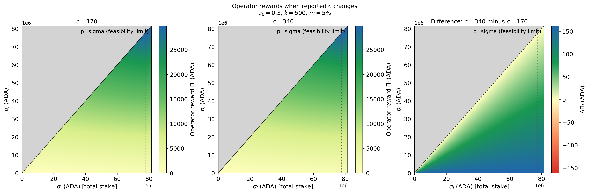
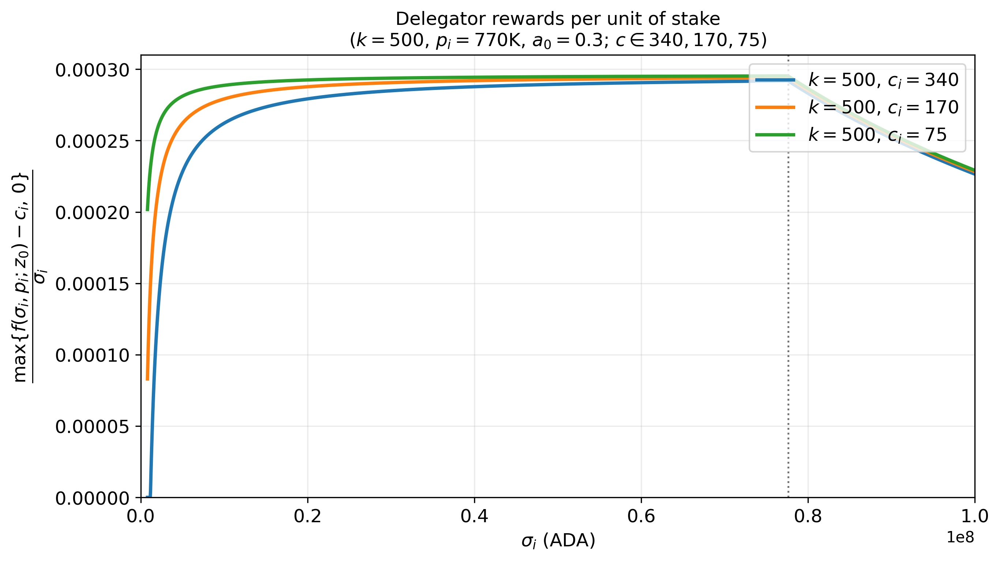
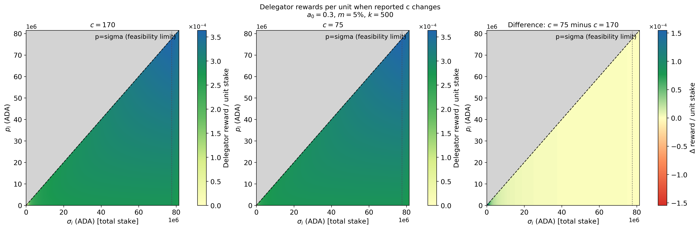

# Incentive effects of changing `minPoolCost` ($c_{min}$)
For the numerical analysis in this section, we use the parameter values below unless stated otherwise. These values may differ from the snapshot values reported in [Parameter-Landscape.md](../../Parameter-Landscape.md), because this comparative-statics exercise is anchored to a single reference state.

| Symbol | Parameter | Value |
| --- | --- | --- | 
| $R$ | Reward pot | $14.9M$ ADA| 
| $T$ | Total ADA supply | $38.8B$ ADA | 
| $k$ | Target number of stake pools | 500 | 
| $a_0$ | Pledge influence. | 0.3 | 
| $c_{min}$ | Minimum fixed cost (`minPoolCost`). | 170 ADA |
| $m_i$ | Operator margin/commission deducted from delegator rewards. | 5%  |
| $\rho$ | Reserve decay rate.  | 0.3%  |
| $\tau$ | Treasury share.| 20% |

## Design

The parameter $c_{\min}$ sets the minimum fixed cost that a stake pool operator may declare. It does not affect the pool's gross reward. Instead, the declared fixed cost is paid to the operator before the remaining rewards are divided between the operator and delegators.

The main objective of $c_{\min}$ is to support economically viable pool operation and provide some protection against Sybil attacks. Without a minimum fixed cost, an operator could create many pools, declare negligible costs, and offer returns that other operators may be unable to match.

The main trade-off is that a fixed cost affects small pools more strongly because it is spread over less stake. Its burden per unit of stake is approximately proportional to

$$
\frac{c_i}{\sigma_i}.
$$

A higher $c_{\min}$ can therefore protect operator revenues and discourage small, undercapitalized Sybil pools, but it also reduces the competitiveness of small and new pools and may push delegation toward larger pools. A lower $c_{\min}$ facilitates entry and improves small-pool returns, but may intensify fee competition and make it easier for multi-pool operators to expand.

The appropriate level of $c_{\min}$ therefore balances operator viability and Sybil resistance against entry, competition, and decentralization.

## Effects of change in $c_{min}$

### Direct mechanical effects 
In this section we consider the direct effects of changing the parameter while holding everything else equal (ceteris paribus). 

- **Gross pool rewards**

    The gross pool reward function does not depend on $c_{min}$:

     $$f(\sigma_i,p_i) = \frac{R}{1+a_0} \left[ \tilde{\sigma}_i + a_0\tilde{p}_i \frac{\tilde{\sigma}_i-\tilde{p}_i\frac{z_0-\tilde{\sigma}_i}{z_0}}{z_0} \right], \qquad \tilde{\sigma}_i = \min\\{\sigma_i, z_0\\}, \qquad \tilde{p}_i = \min\\{p_i, z_0\\},$$

  
- **Operator gross revenue**

    The pool operator gross revenue function is

$$\begin{cases} c_i + (f(\sigma_i,p_i)-c_i) \left[m_i +(1-m_i)\frac{\hat{p}_i}{\sigma_i}\right], & \text{if }  f(\sigma_i,p_i)>c_i, \\ 
f(\sigma_i,p_i), & \text{otherwise} \end{cases}$$

where it is assume that the  operator's active pledge is equal to its declared pledge, $\hat{p}_i=p_i$.
    
Consider a reduction in `minPoolCost` and that the operator declares this `minPoolCost`. Next plot shows the effect of this change in the pool operator gross reward.

The plot shows that a reduction in the declared fixed cost, holding everything else constant reduces pool operator revenues, with the effect being particularly strong for small pools. This is because the fixed cost plays an important role in operator's revenues. To see this, take

$$
\Pi_i = c_i+(f(\sigma_i,p_i)-c_i)\underbrace{[m_i +(1-m_i)\frac{p_i}{\sigma_i}]}_{s\in[0,1]},
$$

Hence,

$$\Pi_i=sf(\sigma_i,p_i)+(1-s)c_i$, \quad \text{and} \quad $\partial \Pi_i/\partial c_i=(1-s)\geq 0.$$

It follows that the operator's profit drops with a lower $c_i$. A potential consequence is that very small pool operators will not have room to reduce their fixed costs without losing economic viability. 
  
  
- **Delegator return per unit of stake**

    Reducing the fixed cost increases the net reward that a pool can distribute among its delegators since

    $$\frac{f(\sigma_i,p_i)-c_i}{\sigma_i},$$

    Next plot illustrates this benefit comparing the net rewards per unit of stake for different $c_i$. For that comparison, let's first define the net rewards per unit of stake:

    

    
    

  
    The plot suggests that cost reductions have a more significant positive impact on the competitiveness of small pools than on that of large ones. Nevertheless, large pools may still remain more attractive for delegators.

    

    
    

### Behavioral and equilibrium effects

### Decentralization

### Interaction effects

