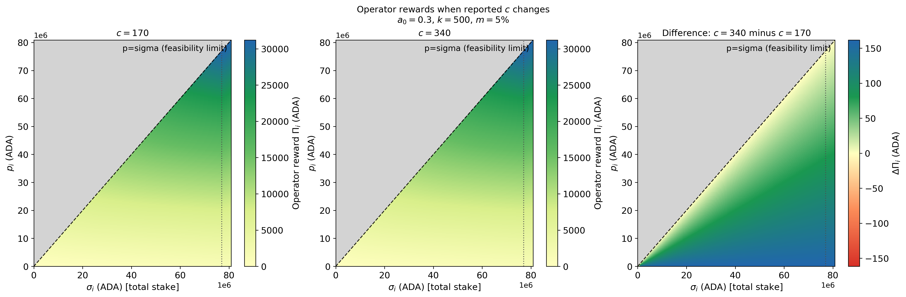
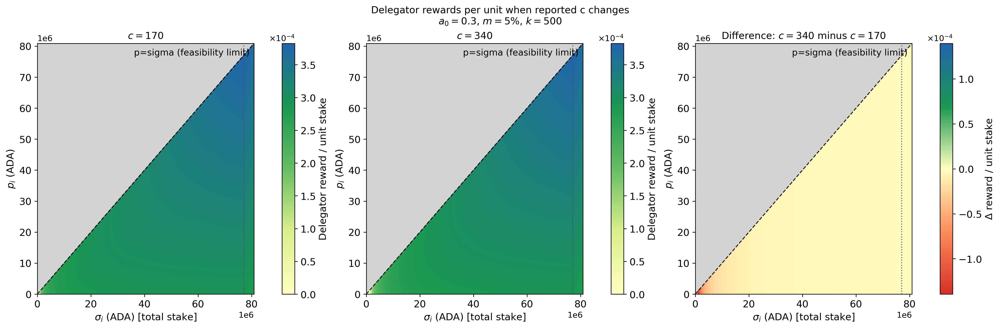
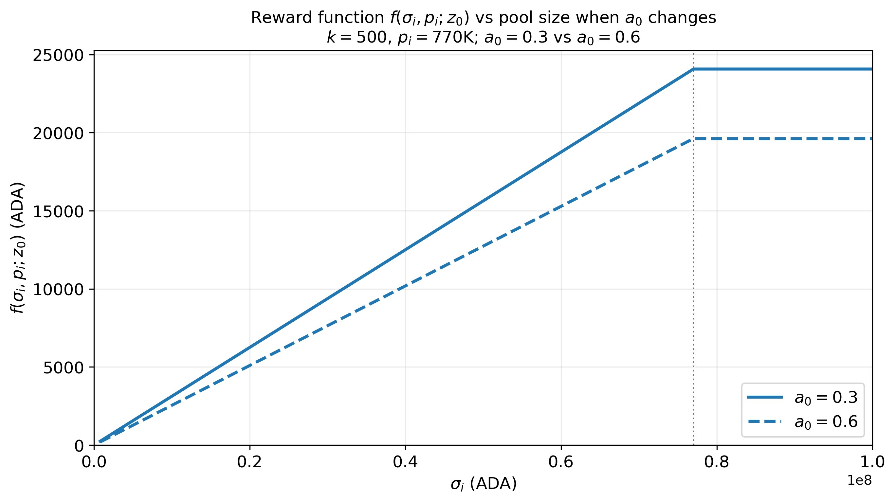
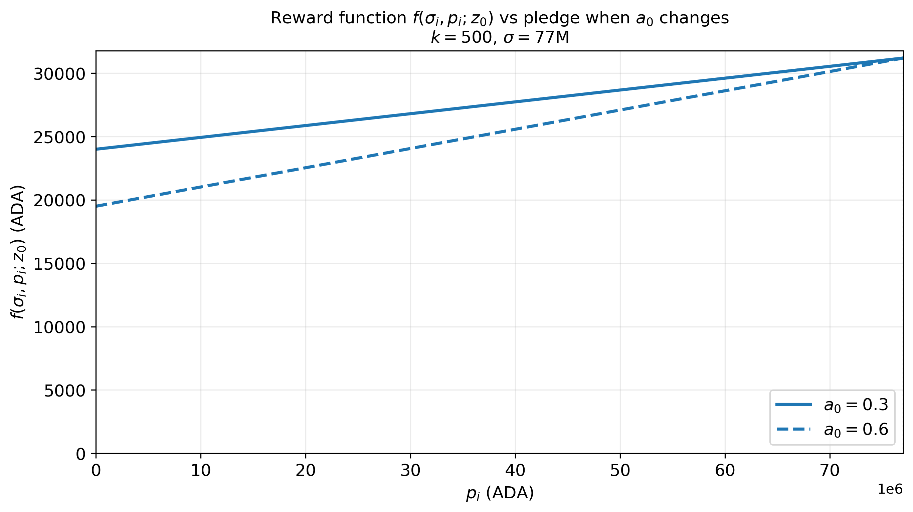
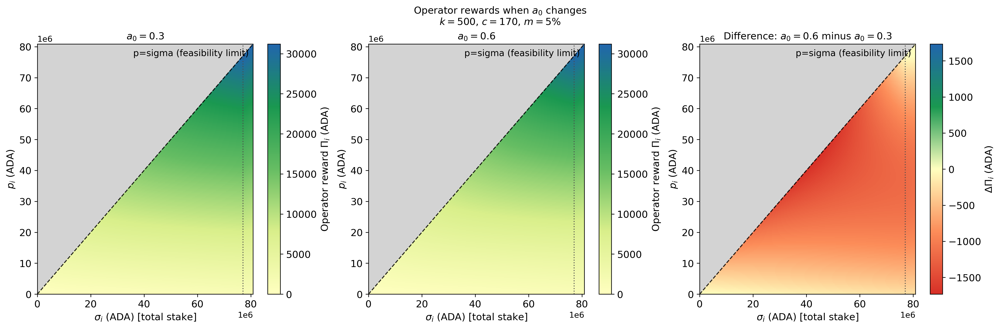
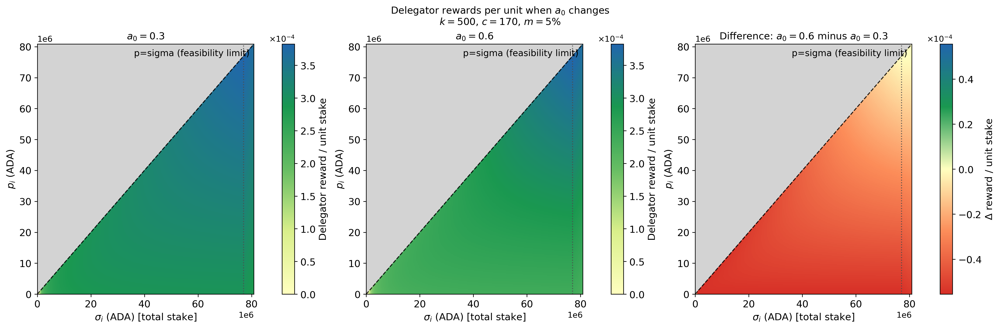

# Goal
This section analyzes how varying parameter values affects key protocol outcomes—such as operator and delegator rewards, decentralization, etc—while **keeping the underlying design fixed**. Structural changes—such as introducing new parameters or varying `minPoolCost` across pool sizes—are addressed in a separate section.

Generally, a parameter change can directly affect one type of actor, prompting a reaction that propagates through the network and influences other agents. For example, a change impacting operators may provoke a strategic response that subsequently affects other operators and delegators. While we discuss these broader feedback dynamics where relevant, this section focuses primarily on the direct impact of parameter changes on a given agent type.

# Summary of incentive-channel findings
(ToDo: update table based on the results and findings)

| Parameter Change | Mechanical Effect | Delegator Incentive | Operator Incentive | Decentralization Effect | Comments |
| :--- | :--- | :--- | :--- | :--- | :--- |
| **Increase $k$** | Lowers $z_0$. | Shift away from oversaturated pools. | - Operator of oversaturated pools may open new pools and redistribute delegation (whenever possible) and pledge.   - Does this measure improve small pool competitiveness? | Does it reduce stake concentration? | Does it lower efficiency? (More pools $\rightarrow$ higher aggregate fixed costs $\rightarrow$ higher aggregate reward dilution). |
| **Decrease $k$** | Raises $z_0$. | Stake can remain in larger pools. | Large pools gain appeal. | May increase concentration? | — |
| **Increase $a_0$** | Increases pledge premium. | Prefer high-pledge pools. | Operators need higher pledge to compete. | May favor capital-rich operators. | — |
| **Decrease $a_0$** | Lowers pledge premium. | Pledge impacts returns less. | Lowers entry barrier for low-pledge pools. | May improve entry, but weakens skin-in-the-game. | — |
| **Increase $c_{min}$** | Raises minimum operator fee. | Lowers net returns in small pools. | Protects minimum operator revenue. | May hurt small-pool competitiveness. | — |
| **Increase $\tau$** | Reduces staking reward pot. | Lowers staking yields. | Reduces pool profitability. | May reduce overall participation. | — |
| **Increase $\rho$** | Releases reserves faster. | Boosts short-term staking yields. | Boosts short-term pool profitability. | Improves immediate incentives, but risks long-term sustainability. | — |

# Change in $c_{min}$
(ToDo: Describe and elaborate on the intended design role of the parameter.)

## Increment in $c_{min}$
This parameter acts as a lower bound on the fixed costs an operator can declare for their pool(s). That is, while $c_{min}$ may change, each operator $i$ ultimately decides whether to update their declared fixed cost $c_i$ (this is particularly true if the $c_{min}$ is reduced, while operators may need to update if the $c_{min}$). In this subsection, we assume operators always set their fixed costs equal to $c_{min}$.

### Impact over operators

### Impact over delegators

# Change in $a_0$
(ToDo: Describe and elaborate on the intended design role of the parameter.)

## Increment in $a_0$
Increasing $a_0$ directly reduces the rewards assigned to a given pool by the protocol through $f()$. For a fixed level of pledge, this negative impact is more significant for larger pools (left plot). However, right plot suggest that an operator can mitigate this effect by replacing delegations with operator pledge. We will see that the latter is not the case. 

  
  

### Impact over operators
From the previous plots, we could expect that a pool with larger pledge can mitigate the negative effect of the increment of $a_0$ by replacing delegations with pledge. However, the previous plots only illustrate the effect over the **reward function $f()$** while to address the effect over the operator we have to check the **operator rewards**.

To see the aparent discrepancy between the two plots, let's consider the case of $\sigma=z_0$ in $f()$:

$$ f=\frac{R}{1+a_0}\bigl(z_0+a_0 p_i\bigr).$$

Raising $a_0$ has two effects:
1. the factor $1/(1+a_0)$ shrinks the reward, and
2. the $a_0 p_i$ term rewards pledge more.

It is easy to see that this function is more increasing in $p_i$ when $a_0$ growth.

When we check the **operator gross revenue**, the operator receives

$$\Pi_i=c_i+s_i\cdot(f-c_i),\quad where \quad s_i=m_i+(1-m_i)\frac{p_i}{\sigma_i}.$$

Hence, the change in the **operator gross revenue** (or, equivalently, the change in the operator utility/profit if $c_i$ and $\hat{c}_i$ remain constant after the parameter change) is:

$$\Delta \Pi_i=s_i\cdot\Delta f()=\Delta U_i$$

As pledge rises, $s_i$ rises toward $1$. Even if $|\Delta f|$ shrinks, the operator’s **share** of that loss grows. So, $\Delta\Pi_i$ can become **more negative** even while $\Delta f$ becomes **less negative**. Away from saturation (e.g. $\sigma=50$M), $\Delta f()$ never fully recovers, so $\Delta\Pi$ can stay more negative all the way up the pledge axis.

As an example, let $\sigma_i=50M$ ADA, $k=500$, $c_i=170$, and $m_i=5\\%$. Suppose $a_0$ increases from $0.3$ to $0.6$:

| $p_i/\sigma_i$ | $\Delta f(\cdot)$ | $\Delta\Pi_i$ |
|---|---|---|
| $0$ | $-2922$ | $-146$ |
| $0.5$ | $-2140$ | $-1123$ |
| $1$ | $-1690$ | $-1690$ |

Bottom line: Higher pledge cushions the reward function $f()$ under a larger $a_0$. For the **operator**, it also means owning a larger slice of a still-smaller pie, so the operator comparison can look worse when pledge is very high.

### Impact over delegators

# Discussion

