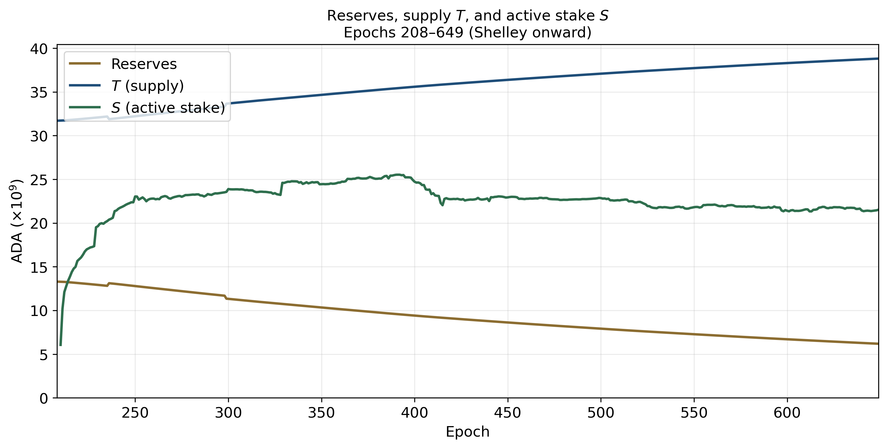
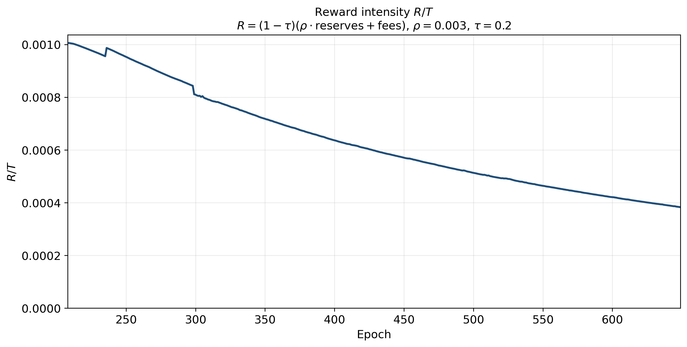
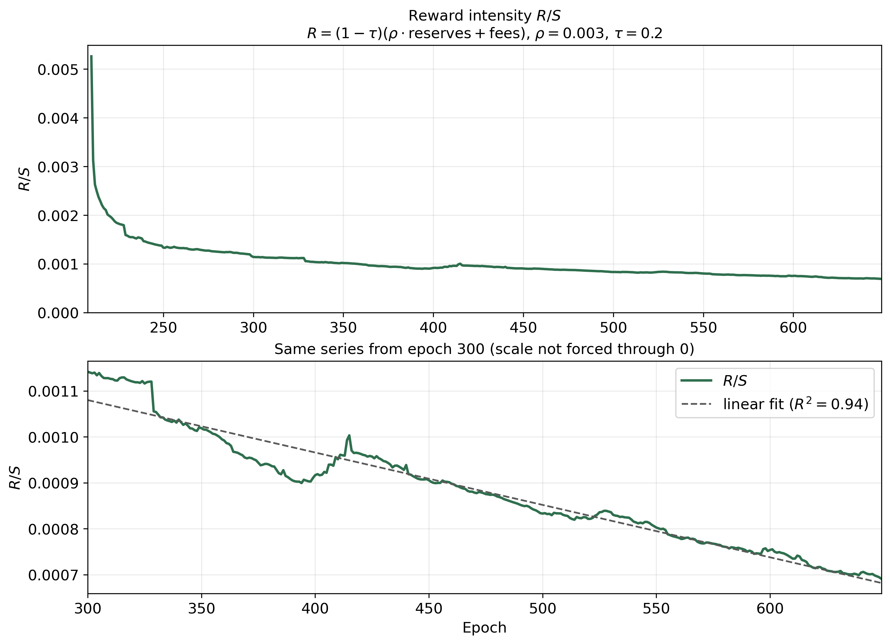
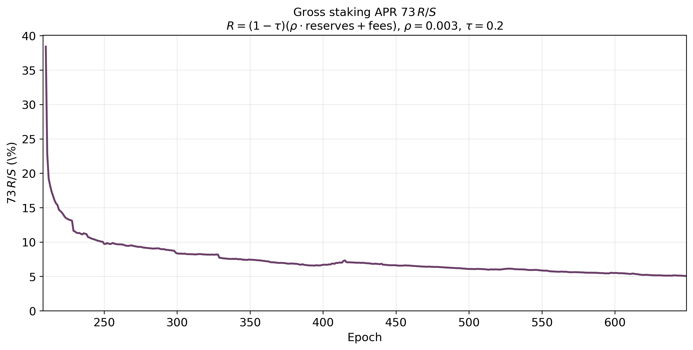
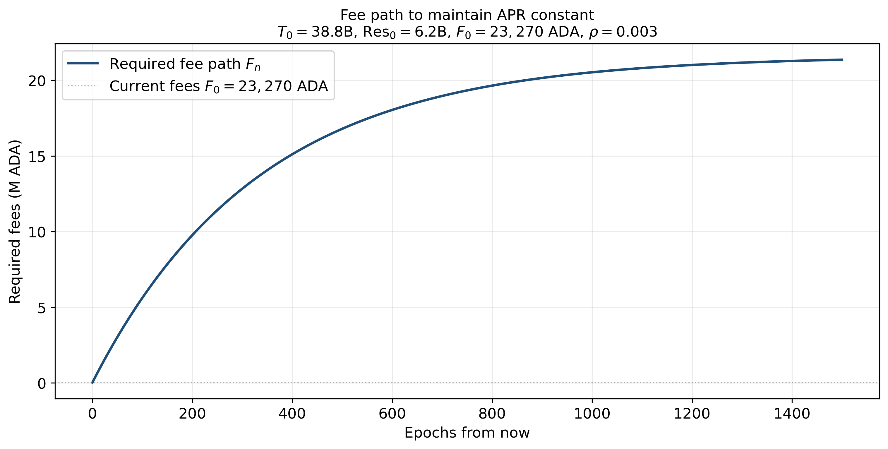
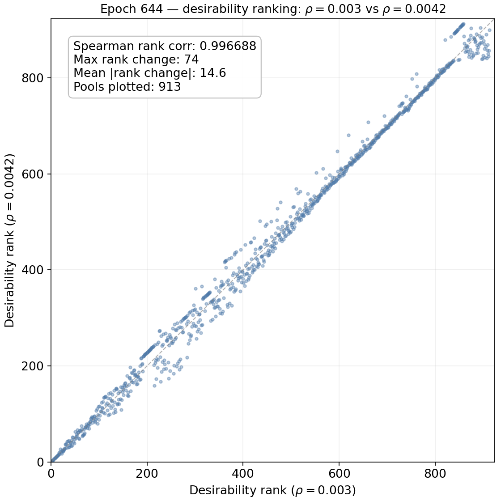
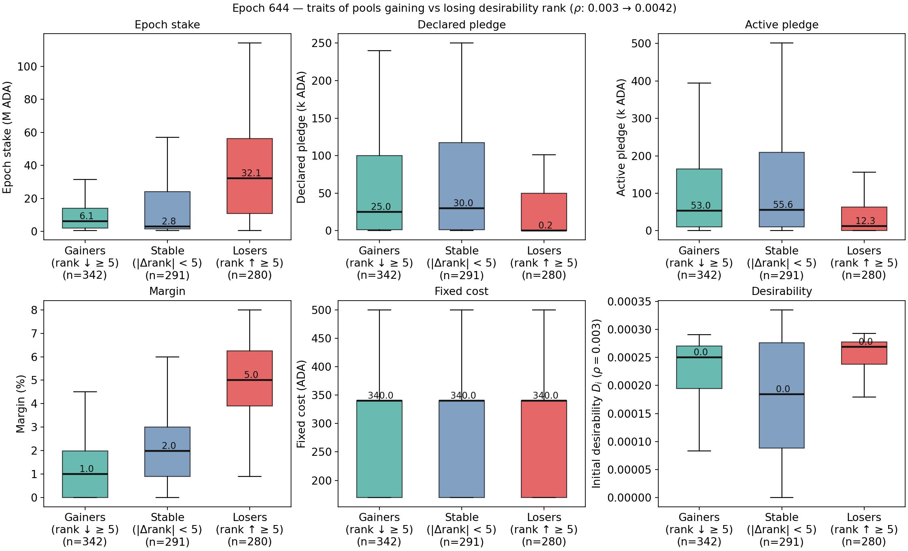
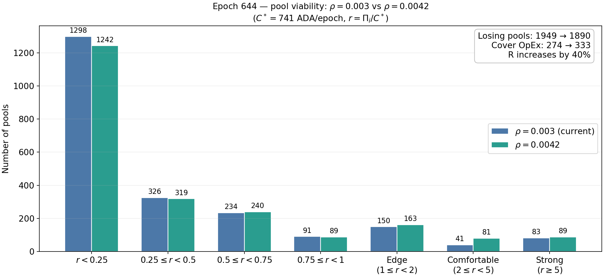
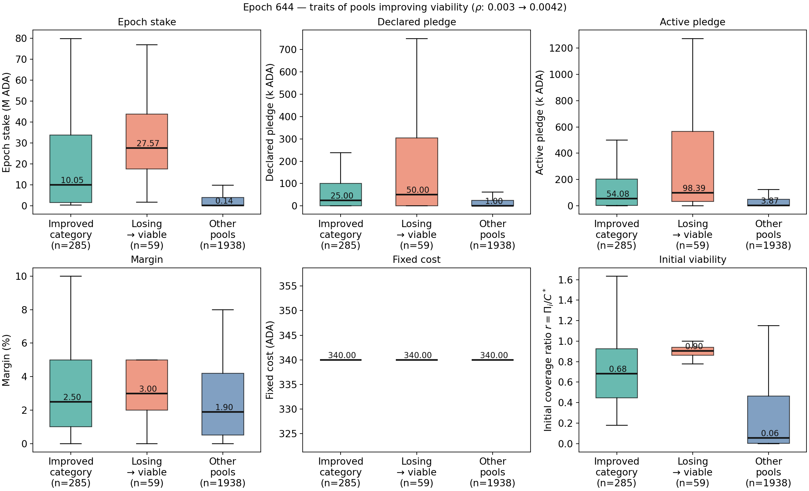
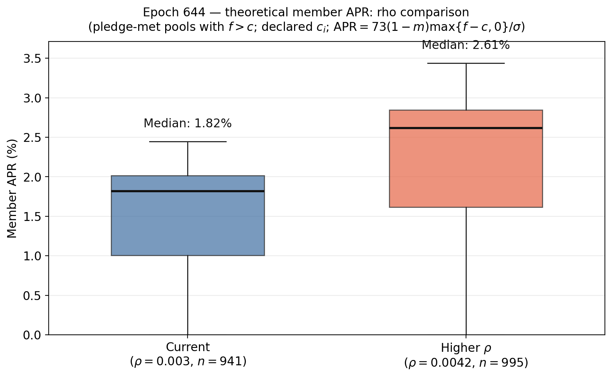

# Incentive effects of changing monetary policy parameters: Reserve decay rate ($\rho$), Treasury share ($\tau$)

## Summary: Trade-off from changing the monetary policy parameters

Increasing $\rho$ raises the reserve draw and can expand the reward pot, while increasing $\tau$ reduces the share of rewards that reaches pools. Together, these parameters determine how fast rewards are extracted from the reserve and how much of the resulting payout remains available to operators and delegators.

**Pros**
1. A higher $\rho$ can increase the reward pot and temporarily raise pool and delegator yield.
2. A lower $\tau$ leaves more of the gross pot available for staking rewards and can support stronger delegation incentives.
3. Reward-pot increases can improve pool viability for some pools, especially those already near the participation threshold.

**Risks**
1. A higher $\tau$ directly lowers the share of rewards available to pools and compresses net APR.
2. Even when $\rho$ rises, the reward pot can still fall in real terms because reserve depletion and total supply growth dilute the effect.
3. If the reward budget contracts persistently, marginal pools face lower viability, redelegation pressure, and stronger entry/exit dynamics.
4. Aggregate reward intensity is mechanically declining as reserves shrink and total supply expands, so the benefits of higher $\rho$ are often temporary.

**Historical dynamics**
1. The reward pot is driven by reserve depletion and transaction fees, not by the reward-sharing function itself.
2. Reward intensity $R_t/T_t$ and $R_t/S_t$ declines mechanically as reserves shrink and circulating supply grows.
3. Aggregate APR falls over time unless fees rise enough to offset the reserve draw and treasury extraction.
4. These dynamics create a persistent downward pressure on pool-level competitiveness unless operators cut margins or lower declared costs.

**Behavioral and equilibrium conclusions**
1. Delegators reallocate toward pools that preserve higher net return per unit of stake when the reward pot shrinks or when the treasury share rises.
2. Operators react by adjusting margins, declared fixed costs, and pledge strategies, but the response is constrained by pool size and viability.
3. Entry and exit is especially sensitive near the participation threshold: marginal pools are more likely to exit when the reward budget falls.
4. Pool splitting becomes more attractive only when a larger reward pot can support multiple smaller entities without diluting competitiveness.
5. The main equilibrium response to changes in $\rho$ and $\tau$ is therefore a reduction in the number of marginally viable pools and a reallocation of stake toward the highest-yield pools, rather than a structural change in the reward-sharing formula itself.

**Policy interpretation**
1. Increasing $\rho$ can temporarily expand the reward budget, but the effect is partly offset by reserve depletion and by the growth of total supply.
2. Increasing $\tau$ directly lowers the share of rewards reaching pools and therefore weakens net APR and pool viability.
3. The policy trade-off is between a stronger near-term reward budget and a lower long-run reward intensity, with the largest losses concentrated in marginal pools.

## Parameter values at the current state
For the numerical analysis in this section, we use the parameter values below unless stated otherwise. These values may differ from the snapshot values reported in [Parameter-Landscape.md](../../Parameter-Landscape.md), because this comparative-statics exercise is anchored to a single reference state.

| Symbol | Parameter | Value |
| --- | --- | --- | 
| $R$ | Reward pot | $14.9M$ ADA| 
| $T$ | Total ADA supply | $38.8B$ ADA | 
| $k$ | Target number of stake pools | 500 | 
| $a_0$ | Pledge influence. | 0.3 | 
| $c_{min}$ | Minimum fixed cost (`minPoolCost`). | 170 ADA |
| $m_i$ | Operator margin/commission deducted from delegator rewards. | 5%  |
| $\rho$ | Reserve decay rate.  | 0.3%  |
| $\tau$ | Treasury share.| 20% |

## Design

Cardano funds staking rewards and its treasury through a combination of transaction fees and predefined monetary expansion from its reserve—the difference between the $45B$ ADA maximum supply and the circulating supply. For each epoch $t$, let's denote the reserve level by $Q_t$, transaction fees by $F_t$, the **treasury share** parameter by $\tau$ (currently $20\\%$), and the **reserve decay rate** (or monetary expansion parameter) by $\rho$ (currently $0.3\\%$). Because the treasury share and reserve decay rate remain constant across epochs, they do not carry a subscript $t$.

> **Note:** Cardano Constitution constrains monetary-expansion changes: $\rho$ must remain between $0.001$ and $0.005$, and the recommended guardrails say it should not vary by more than $±10\\%$ in any $73\text{-epoch}$ period (roughly a year) and should not be changed more than once in any $36\text{-epoch}$ period ($\approx 6\text{ months}$).

The protocol calculates the amount taken from reserves $M_t$ by scaling $\rho$ by a network performance factor $\eta_t$:

$$M_t = \min\\{\eta_t, 1\\} \cdot\rho Q_t$$

Denote $P_t$ to the gross pot:

$$P_t = F_t + M_t = F_t + \min\\{\eta_t, 1\\} \cdot\rho Q_t.$$

> **Note:** In Cardano's design, transaction fees and reserve depletion should act as funding substitutes; as reserves decline, fees progressively should become the primary source of rewards. However, there is not a parameter or function connecting these two reward sources. It was expected that the substitution occur while the market and Cardano usage matures.

From this gross pot, a fraction $\tau$ goes to und the treasury, i.e., 

$$G_t = \tau P_t = \tau \left[ F_t + \min\\{\eta_t, 1\\} \cdot\rho Q_t \right]$$

The remaining share $(1 - \tau)$ forms the available pool reward pot for that epoch $R_t$:

$$R_t = (1 - \tau) P_t = (1 - \tau) \left[ F_t + \min\\{\eta_t, 1\\} \cdot\rho Q_t \right]$$,

This $R_t=R$ corresponds to the total pot entering the gross pool reward function:

$$f(\tilde{\sigma}_i, \tilde{p}_i) = \frac{R}{1 + a_0} \left[ \tilde{\sigma}_i + a_0 \tilde{p}_i \frac{\tilde{\sigma}_i - \tilde{p}_i \frac{z_0 - \tilde{\sigma}_i}{z_0}}{z_0} \right]$$

Rewards are only distributed on active, staked ADA. If less than $100\\%$ of the circulating supply is staked, unearned rewards return directly to the reserves.

## Direct mechanical effects

In this section we consider the direct effects of changing $\rho$ and $\tau$ while holding everything else equal (ceteris paribus). The key point is that these two parameters act on the reward pot and therefore on the aggregate level of rewards available to pools, rather than on the shape of the reward-sharing function itself.

### Gross pool rewards

Let $\sigma_i$ denote total delegation to pool $i$, $p_i$ its declared pledge, and $z_0$ the saturation threshold. The pool-level gross reward function remains

$$f(\sigma_i,p_i) = \frac{R}{1+a_0} \left[ \tilde{\sigma}_i + a_0\tilde{p}_i \frac{\tilde{\sigma}_i-\tilde{p}_i\frac{z_0-\tilde{\sigma}_i}{z_0}}{z_0} \right], \qquad \tilde{\sigma}_i = \min\{\sigma_i, z_0\}, \qquad \tilde{p}_i = \min\{p_i, z_0\},$$

and the change in $\rho$ or $\tau$ operates through the total reward budget $R_t$, not through the internal reward-sharing formula.

The protocol depletes the reserve by a fraction $\rho$ and allocates a share $\tau$ of the gross pot to the treasury. The gross pot is

$$P_t = F_t + \min\{\eta_t,1\}\cdot \rho Q_t,$$

where $Q_t$ is the reserve level and $F_t$ are transaction fees. The treasury receives

$$G_t = \tau P_t = \tau \left[ F_t + \min\{\eta_t,1\}\cdot \rho Q_t \right],$$

and the amount available to pools is

$$R_t = (1-\tau)P_t = (1-\tau)\left[ F_t + \min\{\eta_t,1\}\cdot \rho Q_t \right].$$

Hence,

$$\frac{\partial R_t}{\partial \rho} = (1-\tau)\min\{\eta_t,1\}\cdot Q_t \geq 0,$$

and

$$\frac{\partial R_t}{\partial \tau} = -\left[ F_t + \min\{\eta_t,1\}\cdot \rho Q_t \right] \leq 0.$$

If both parameters change simultaneously, the net effect on $R_t$ depends on the relative magnitudes of the changes. For a small move around a baseline, the total differential is

$$dR_t = \frac{\partial R_t}{\partial \tau} d\tau + \frac{\partial R_t}{\partial \rho} d\rho = 0,$$

which gives the local trade-off

$$\frac{d\rho}{d\tau} = \frac{F_t + \rho\min\{\eta_t,1\}Q_t}{(1-\tau)\min\{\eta_t,1\}Q_t} = \frac{1}{1-\tau}\left( \frac{F_t}{\min\{\eta_t,1\}Q_t} + \rho \right).$$

Thus, a higher treasury share must be offset by a higher reserve decay rate to keep the reward pot constant, and the degree of compensation depends on the share of rewards coming from transaction fees versus reserve depletion.

For both delegators and operators, the direct mechanical effect comes from the change in $R_t$ and therefore in the pool-level reward available after the treasury extraction. The operator gross revenue is

$$
\Pi_i=
\begin{cases}
 c_i + \bigl(f(\sigma_i,p_i)-c_i\bigr)\left[m_i +(1-m_i)\frac{\hat{p}_i}{\sigma_i}\right], & \text{if } f(\sigma_i,p_i)>c_i, \\
 f(\sigma_i,p_i), & \text{otherwise},
\end{cases}
$$

where $\hat{p}_i$ is the operator's active pledge and $c_i$ the declared fixed cost. The corresponding delegator return per unit of stake is

$$
U_d =
\begin{cases}
(1-m_i)\frac{f(\sigma_i,p_i)-c_i}{\sigma_i}\sigma_d, & \text{if } f(\sigma_i,p_i)>c_i, \\
0, & \text{otherwise},
\end{cases}
$$

so a fall in $R_t$ reduces the reward budget available to all pools and compresses both operator and delegator income unless offset by lower fees or lower costs.

### Reward-pot dynamics

The next plots illustrate the evolution of the reserve, total supply, and the amount of rewards entering the system.

The following plot shows the evolution of the reserves, the total supply, and the staking level. As expected, reserves and total supply are strongly correlated because total supply expands as reserve depletion flows into circulation. The relationship with the staking level is weaker, especially after epoch $400$, suggesting that a large share of the newly released tokens is not immediately used to secure the protocol.

  

The reward scheme extracts a fixed fraction from the reserve each epoch through $\rho$ while simultaneously allocating a fixed share $\tau$ to the treasury. The next plot therefore measures reward intensity through $R_t/T_t$ and $R_t/S_t$. The ratio $R_t/T_t$ is mechanically decreasing because total supply expands as the reserve declines and because $R_t$ is itself proportional to the reserve draw. In particular, if $R_t = \rho\,Q_t$ in the reserve-based component, then

$$\frac{R_t}{T_t} = \frac{\rho}{\frac{45\text{B}}{Q_t}-1},$$

which falls as $Q_t$ falls.

  

The following plot shows the same effect against total stake. Reward intensity is highest at launch, when aggregate stake is low, and then gradually flattens as the network matures. Across the observed period from epoch $300$ onward, the relationship is nearly linear, with a slope mostly driven by the drop in the reward pot. This indicates that capital is sticky: $S$ declines much more slowly than $R$, so $R/S$ keeps trending downward. If the reserve draw continues while stake remains relatively stable, net staking yield will continue to compress.

  

### Aggregate APR and reward intensity

The following plot shows the variation in gross APR over time. We illustrate the lower bound (zero pledge), computed as $73\cdot\frac{R}{(1+a_0)T}$, and the upper bound, computed as $73\cdot\frac{R}{T}$. The theoretical APR is strictly decreasing over time by design: the reserve draw falls as the reserve shrinks, while total supply grows as newly released tokens enter circulation.

  

To see how large a fee increase would be required to keep APR constant, define the annualized staking APR as

$$
APR_t = 73\frac{R_t}{T_t} = 73\frac{(1-\tau)[F_t+\rho Q_t]}{T_t},
$$

with

- $F_t$ = transaction fees in epoch $t$,
- $Q_t$ = reserve level,
- $T_t$ = circulating supply,
- $\rho$ = reserve decay rate,
- $\tau$ = treasury share.

Under the laws of motion

$$Q_{t+1}=(1-\rho)Q_t, \qquad T_{t+1}=T_t+\rho Q_t,$$

keeping APR constant requires

$$\frac{F_{t+1}+\rho Q_{t+1}}{T_{t+1}} = \frac{F_t+\rho Q_t}{T_t},$$

which gives the required fee change

$$\Delta F_t = F_{t+1}-F_t = \rho^2 Q_t + \frac{\rho Q_t}{T_t}R_t.$$

Hence, maintaining APR can require a very large increase in fees if the reserve draw continues to shrink while supply expands. The following plot illustrates the needed fee path to hold APR at a constant level.

  

## Behavioral and equilibrium effects of changing $\rho$ and $\tau$

This section studies the second-order effects of changing the reward-pot parameters on delegator and operator decisions, given the current state of the system. Unlike $k$ or $a_0$, these parameters do not change the geometry of the reward function directly. Instead, they alter the size of the reward budget, the share that reaches the pool layer, and therefore the viability and relative attractiveness of pools.

### Rational behavior

Under a frictionless benchmark, delegators choose the pools with the highest expected net return, while operators choose margins, declared costs, and deployment strategies that maximize expected utility given the reduced reward budget. A change in $\rho$ or $\tau$ therefore matters through realized pool-level yield,

$$APR_i \approx 73(1-m_i)\frac{\max\{f(\sigma_i,p_i)-c_i,0\}}{\sigma_i},$$

not through the raw parameter value itself. If the reward pot shrinks, a pool's relative position improves only if it can preserve net yield through lower margins, lower declared costs, or a stronger pledge-based competitive position.

#### Delegators moving stake

Delegators allocate stake based on expected net return. A negative shock to the reward budget should therefore shift delegation away from low-yield pools and toward pools that preserve higher net return per unit of stake. This mechanism is strongest for marginal pools whose reward margin is already thin. In practice, the response is likely gradual because stake is persistent and because delegators face search and inertia costs, but the direction of the response is straightforward: lower expected APR should reduce the attractiveness of weak or high-cost pools.

We can see the effect of increasing $\rho$ on pool ranking by observing how the pools desirability changes in epoch $644$

$$D_i=(1-m_i)\max\\{f(\sigma_i,p_i)-c_i,0\\}/\sigma_i.$$

The effect is shown in the next plot. It shows how pools' rank changes when we increase $\rho$ from $0.3\\%$ to $0.42\\%$. For instance, if a pool is the $200th$ most desirable under $\rho=0.003$ and becomes the $210th$ most desirable under $\rho=0.0042$, it's plotted at coordinate $(200, 210)$. Points above the diagonal lost rank (became relatively less attractive), points below gained rank.

  

We next identify who the rank winners and losers are.

  

Pools that gain desirability rank are those with low margins and meaningful pledge. Pools that lose rank are large-stake pools with minimal pledge and high margins. The mechanism is straightforward: because $D_i$ definition a uniform scaling of $f$ benefits pools with lower $m_i$ disproportionately. High-margin pools see a smaller absolute gain in $D_i$, so they slip in the ranking.

#### Operators changing pledge, margin, or declared fixed cost

Operators have a direct incentive to stabilize revenue by adjusting margins ($m_i$), declared fixed costs ($c_i$), or pledge commitments ($\hat{p}_i$) when the aggregate reward budget contracts. The core trade-off lies between preserving operator revenue and retaining delegation. Because a higher treasury share ($\tau$) or a lower reserve draw reduces pool-level surplus before fee adjustments, the pressure to cut margins or lower declared costs is strongest for pools operating near the delegator participation threshold. Conversely, pools with substantial pledge and high delegation have greater capacity to absorb these shocks without losing competitiveness. This strategic behavior directly links to the participation threshold and entry/exit incentives analyzed in the next section.

#### Entry or exit of pools

Entry or exit decisions are governed by whether expected pool utility exceeds the outside option. In reduced-reward environments, pools near the viability threshold are most exposed to exit, especially if they cannot cut margin or maintain enough delegation to cover fixed costs. The relevant condition is

$$U_i = \Pi_i - \hat c_i \geq \underline U_i,$$

where $\Pi_i$ is operator revenue and $\underline U_i$ is the outside option (for simplicity, we assume $\underline{U}_i=0$). When $\rho$ falls or $\tau$ rises, the participation constraint becomes binding for a larger set of pools, especially those with modest delegation, weak pledge, or high declared costs. On the other had, a higher $\rho$ or a lower $\tau$ help to improve the pools viabilty. 

Using actual data from epoch $644$, the following chart shows how many pools during that epoch are at viability risk (note that using only one epoch as a data source may not represent the actual situation of those pools). For each pool we calculate its

$$
\Pi_i=
\begin{cases}
f_i, & f_i\le c_i,\\
c_i+(f_i-c_i)\left[m_i+(1-m_i)\dfrac{\hat{p}_i}{\sigma_i}\right], & f_i>c_i,
\end{cases}
$$

using their margin, delegation, active and declared pledge, and declared fixed cost. We consider the case in which the latter is not the actual operating cost that the pools face. In particular, we assume that all pools have the same operation cost/expenditure ($C^*$) equal to $667$ USD per month (six epochs), and a token price of $0.15 USD/ADA$ giving 

$$C^*=667/6/0.15=741.1 \text{ USD per epoch}.$$

The plot measures $r=\Pi_i/C^{\*}$, where any $r<1$ indicates not enough rewards to cover costs. Among $2223$ pools, only $274$ would be able to cover the OpEx $C^*$. However, $150$ of them would be on a risky situation ($1\leq r\leq 2$)

Despite a $40\\%$ increase in the reward pot ($R$), only $59$ pools transition from "unviable" ($r < 1$) to "viable" ($r \ge 1$). The underlying issue is structural rather than parametric: most losing pools hold such low stake that even a $40\\%$ reward expansion fails to generate enough operator revenue to cover operational expenditures (OpEx). The pools that cross the viability threshold are exclusively those that were already operating immediately below $r = 1$. Consequently, increasing $\rho$ is an ineffective lever for rescuing small pools.

Increasing $\rho$ accelerates reserve depletion while yielding only small gains in the count of viable stake pools.

The following plot shows the characteristics of those pools that improved their viability (but remained with $r<1$) and those that jump from "unviable" to viable". We can confirm that the latter are larger pools in terms of delegation and pledge.

#### Pool splitting by multi-pool operators

An increase in the monetary expansion rate ($\rho$) expands the total reward pot, strengthening the economic incentive to operate multiple pools rather than a single consolidated entity. With a larger gross reward budget, pool operators can capture greater fixed cost fees and avoid saturation caps by splitting delegation across multiple nodes while amortizing actual operational costs. 

#### Changes in staking participation

The following figure illustrates the impact of a $40\\%$ increase in $\rho$ on delegator APR, defined as:

$$\text{APR}_i = 73(1 - m_i) \frac{\max(f_i - c_i, 0)}{\sigma_i}$$

The relative increase in APR exceeds $40\\%$ primarily because the marginal gains are magnified for pools operating near the break-even threshold ($f_i \approx c_i$). Furthermore, the expansion in total rewards lowers the barrier to profitability, enlarging the set of viable pools that satisfy the eligibility condition ($f_i > c_i$).

## Interaction effects (ToDo)

See the file analysis in the [interaction effects file](Interaction-effects/interaction_effects.md)

