# Goal
This section uses comparative statics to analyze how varying parameter values affects key protocol outcomes—such as operator and delegator rewards, decentralization, etc—while **keeping the underlying design fixed**. Structural changes—such as introducing new parameters or varying `minPoolCost` across pool sizes—are addressed in a separate section.

Besides the design analysis, we also aim to evaluate—where relevant—the impact of parameter adjustments under current network conditions, which may differ from original design assumptions.

Generally, a parameter change can directly affect one type of actor, prompting a reaction that propagates through the network and influences other agents. For example, a change impacting operators may provoke a strategic response that subsequently affects other operators and delegators. While we discuss these broader feedback dynamics where relevant, this section focuses primarily on the direct impact of parameter changes on a given agent type.

# Summary of incentive-channel findings
(ToDo: update table based on the results and findings)

| Parameter Change | Mechanical Effect | Delegator Incentive | Operator Incentive | Decentralization Effect | Comments |
| :--- | :--- | :--- | :--- | :--- | :--- |
| **Increase $k$** | Lowers $z_0$. | Shift away from oversaturated pools. | - Operator of oversaturated pools may open new pools and redistribute delegation (whenever possible) and pledge.   - Does this measure improve small pool competitiveness? | Does it reduce stake concentration? | Does it lower efficiency? (More pools $\rightarrow$ higher fixed costs $\rightarrow$ greater reward dilution). |
| **Decrease $k$** | Raises $z_0$. | Stake can remain in larger pools. | Large pools gain appeal. | May increase concentration? | — |
| **Increase $a_0$** | Increases pledge premium. | Prefer high-pledge pools. | Operators need higher pledge to compete. | May favor capital-rich operators. | — |
| **Decrease $a_0$** | Lowers pledge premium. | Pledge impacts returns less. | Lowers entry barrier for low-pledge pools. | May improve entry, but weakens skin-in-the-game. | — |
| **Increase $c_{\min}$** | Raises minimum operator fee. | Lowers net returns in small pools. | Protects minimum operator revenue. | May hurt small-pool competitiveness. | — |
| **Increase $\tau$** | Reduces staking reward pot. | Lowers staking yields. | Reduces pool profitability. | May reduce overall participation. | — |
| **Increase $\rho$** | Releases reserves faster. | Boosts short-term staking yields. | Boosts short-term pool profitability. | Improves immediate incentives, but risks long-term sustainability. | — |

# Preliminaries
While the following formulas were detailed in other sections, they are restated below to ensure this section remains standalone.

## Reward function
The reward function for pool $i$ is defined as:

$$f(\sigma_i,p_i) = \frac{R}{1+a_0} \left[ \tilde{\sigma}_i + a_0\tilde{p}_i \frac{\tilde{\sigma}_i-\tilde{p}_i\frac{z_0-\tilde{\sigma}_i}{z_0}}{z_0} \right].$$

This reward is then adjusted for a pool's performance factor that we denote here with $\lambda_i$. Then, the realized gross reward is

$$\lambda_i f(\sigma_i,p_i).$$

Assume $\lambda_i = 1$, let $c_i\ge 0$ denote the fixed cost charged by the pool and $m_i\in[0,1)$ its margin. For pool $i$, the protocol first pays the fixed cost $c_i$ whenever $f(\sigma_i,p_i) > c_i$. The remaining amount, $\bigl[f(\sigma_i,p_i)-c_i\bigr]_+$, is then allocated as follows: a fraction $m_i$ is taken by the operator as the pool margin, that is, as a commission on delegation rewards, and the residual fraction $(1-m_i)$ is distributed proportionally among all stake delegated to the pool, including the operator's own pledged stake. Thus, **the pool operator gets**:

$$
\begin{cases}
c_i+(f(\sigma_i,p_i)-c_i)\left[m_i +(1-m_i)\frac{\hat{p}_i}{\sigma_i}\right], & \text{if } f(\sigma_i,p_i)>c_i, \\
f(\sigma_i,p_i), & \text{otherwise}
\end{cases}
$$

where $\hat{p}_i$ denotes the operator's active pledge, and **a delegator $d$ with stake $\sigma_d$ receives**:

$$
\begin{cases}
(1-m_i)(f(\sigma_i,p_i)-c_i)\frac{\sigma_d}{\sigma_i}, & \text{if } f(\sigma_i,p_i)>c_i, \\
0, & \text{otherwise}
\end{cases}
$$

### Notation and normalization
Unless stated otherwise, stake variables are measured as fractions of total ADA supply ($T$).
Thus,

$$\sigma_i = \frac{\text{pool } i \text{ stake in ADA}}{T}, \qquad p_i = \frac{\text{pool } i \text{ pledge in ADA}}{T}, \qquad z_0 = \frac{1}{k}.$$

If variables are measured directly in ADA, we use the ADA-denominated versions, e.g., with some abuse of notation, $z_0=\frac{T}{k}$.  

Notation is not fully standardized across the literature. In particular, pledge is sometimes denoted by $p_i$, $\lambda_i$, or $s_i$. Here we use $p_i$ for declared pledge.

# Change in k
(ToDo: better describe and elaborate on the intended design role of the parameter.)

## Design

**$k$** denotes the desired or target number of economically relevant stake pools. It is not a hard cap on the number of pools that may be registered. Instead, it enters the reward function to make an equilibrium with approximately $k$ competitive pools attractive.

A reward scheme in which pools are compensated proportionally to their stake, $\sigma$, tends to encourage centralization. Because pool operating costs are largely fixed, larger pools can spread these costs over more delegated stake and offer higher rewards per unit of stake. Delegators therefore have an incentive to move toward already large pools.

> *Insert plot of delegator rewards per unit of stake as a function of $\sigma$.*

The parameter **$k$** is introduced to limit this increasing-returns mechanism. It determines the saturation threshold

$$
z_0 = \frac{1}{k},
$$

up to which pool rewards increase with stake. This creates two complementary incentives:

1. **Below saturation**, additional delegation helps spread the pool's fixed operating cost.
2. **Above saturation**, additional stake does not increase the pool's gross reward, discouraging further concentration.

Choosing $k$ therefore involves a trade-off between decentralization and economic viability. A higher $k$ lowers the saturation threshold and creates room for more competitive pools, but reduces the economic scale available to each pool. A lower $k$ makes it easier for pools to cover their operating costs, but allows stake to concentrate among fewer operators.

Thus, $k$ defines the protocol's decentralization target by jointly determining the saturation threshold, the expected number of competitive pools, and the economic scale at which those pools operate.

## Increment in k
The direct effect of increasing $k$ is a reduction in the saturation threshold, $z_0$, which consequently lowers the maximum reward: 

$$f(\sigma_i,p_i;z_0)>f(\sigma_i,p_i;z_0')\quad \text{for any} \quad z_0>z_0'.$$ 

### Impact over operators
Let us first consider the impact of an increase in $k$ on operators prior to any behavioral response—that is, the isolated effect of the change, holding all else constant ($ceteris\ paribus$). Indeed, any subsequent operator response will be driven by how this initial change affects their current state.

The following plots illustrate this impact on the reward function, $f(\sigma_i,p_i;z_0)$. As expected, larger pools are negatively affected since their rewards are capped at a lower threshold. On the other hand, medium-sized pools closer to the new saturation point are now near the range where their rewards are maximized.
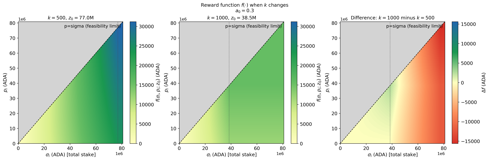

  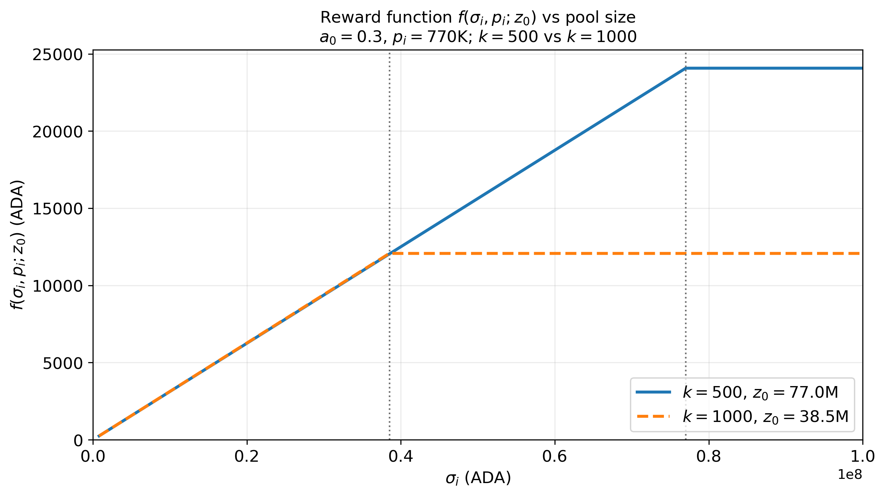

The previous plots present an incomplete picture, as an operator's total reward must also account for their declared fixed costs. The following plots illustrate the operator rewards when their fixed cost is $c_i=170$ ADA and the margin (the commision retained to delegators) is $m_i=5\\%$. 
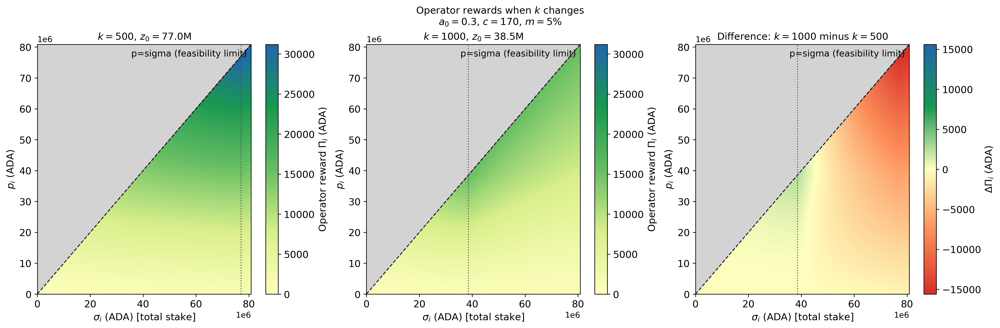

Because the protocol reimburses operators for their declared fixed costs ($c_i$), incorporating fixed-cost income mitigates the impact of increasing $k$, particularly for pools with low pledge, even if the pool becomes oversaturated. This mitigation occurs because fixed costs are deducted from the total pool rewards before remaining returns are distributed to delegators—effectively reducing the delegators' share of pool rewards, which are given by $f(\sigma_i, p_i; z_0) - c_i$. Hence, pools with lower pledge (and higher proportion of third-party delegations) redirect a larger relative portion of delegator returns toward the operator.

### Impact over delegators
Shifting the focus to delegator returns, the following charts illustrate how rewards per unit of stake change before delegators take action (e.g., migrating from an oversaturated, post-$k$-increment pool to a newly saturated pool). The interpretation of these plots follows directly from our previous formulas. Delegators remaining in now-oversaturated pools suffer immediate yield losses. Conversely, those who happen to be aligned with pools that have newly reached the lower saturation threshold experience yield gains, particularly if those pools feature high operator pledge.
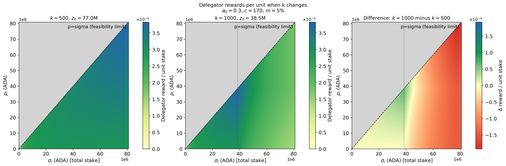

## Discussion
A lower saturation threshold resulting from an increase in $k$ has several key implications. First, smaller or newer pools require less pledge and delegation to reach maximum rewards, lowering the cost to compete with large, established pools. Additionally, previous plots might suggest that large pools are invariably harmed by the change. However, fully evaluating this parameter change requires analyzing how pools adjust their strategies, as well as how delegators react to these new incentives.

### Pool splitting 
A larger pool that faces its reward negatively affected by the increment in $k$ may split into smaller pools. By doing this, it may achieve, at least, the same reward. To see this, suppose a change that doubles the value of $k$. Before the increment, 

$$f(\sigma_i,p_i;z_0)=\frac{R}{1+a_0} \left[ \tilde{\sigma}_i + a_0\tilde{p}_i \frac{\tilde{\sigma}_i-\tilde{p}_i\frac{z_0-\tilde{\sigma}_i}{z_0}}{z_0} \right],$$

where we assume $\tilde{\sigma}_i=\sigma_i$ and $\tilde{p}_i=p_i$. 

After doubling $k$, the new saturation threshold becomes $z_0/2$. Suppose an operator responds by splitting their existing pool into two identical pools, each allocated half of the initial stake ($\sigma_i/2$) and pledge ($p_i/2$). Then, in each of these two pools:

$$
\begin{aligned}
f\left(\frac{\sigma_i}{2},\frac{p_i}{2};\frac{z_0}{2}\right) &= \frac{R}{1+a_0} \left[ \frac{\sigma_i}{2} + a_0\frac{p_i}{2} \frac{\frac{\sigma_i}{2}-\frac{p_i}{2}\frac{\frac{z_0}{2}-\frac{\sigma_i}{2}}{\frac{z_0}{2}}}{\frac{z_0}{2}} \right], \\
f\left(\frac{\sigma_i}{2},\frac{p_i}{2};\frac{z_0}{2}\right) &= \frac{f(\sigma_i,p_i;z_0)}{2}.
\end{aligned}
$$

This calculation does not yet account for fixed costs. Managing two separate pools enables the operator to collect fixed fee revenues twice, increasing their total revenues as seen in the following plot:

  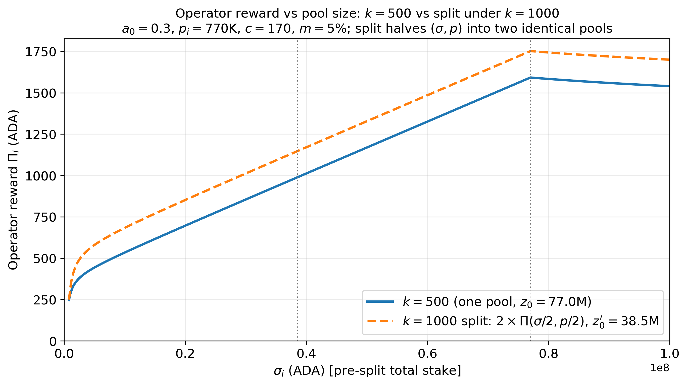

All these open some questions and comments: (ToDo: once finished, reorder from most relevant)
1. **Incentive to split under constant $k$:** The previous observation raises the question of whether a large pools operator may find it profitbale to split pools even when there is no change in $k$.
    Comparing $f(\sigma_i,p_i;z_0)$ directly with $f\left(\frac{\sigma_i}{2},\frac{p_i}{2};z_0\right)$ shows that

    $$f(\sigma_i,p_i;z_0) >2*f\left(\frac{\sigma_i}{2},\frac{p_i}{2};z_0\right),$$

    holds whenever total delegation is less than or equal to $z_0$ (more strictly, there exists a threshold $\sigma_i^* > z_0$ such that the inequality holds for all $\sigma_i < \sigma_i^*$). Conversely, the inequality reverses when delegation exceeds this threshold. Consequently, pool splitting (or creating an additional pool) is beneficial strictly for oversaturated pools—a result that was intentionally design.

    However, again the income coming from the fixed cost has something to say. By splitting into two identical pools, 

    

    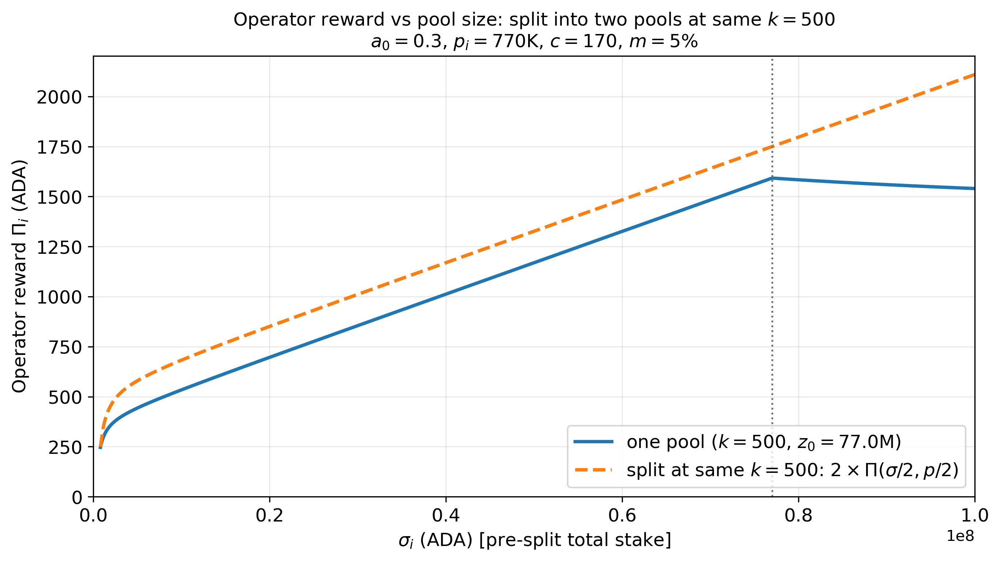
    

    The plot compares the total revenue of a single pool operator across varying delegation levels against the revenue achieved by splitting the stake into two identical pools. The curves are plotted starting from $\sigma_i \ge p_i = 700\text{k}$ ADA. Again once the single pool reaches or exceeds the saturation threshold, splitting becomes more advantageous, as neither of the two smaller sub-pools suffers from the saturation cap.

    These observations may explain the prevalence of medium-sized multi-pool operators (MPOs) alongside the relative scarcity of fully saturated (or near-saturated) pools.

    Note that the current analysis focus on gross revenues rather than net profits. The latter must account for operational expenditures. Under the assumption of incentive compatibility, operators truth-tell by declaring their actual fixed costs, offsetting the positive impact of the fixed-cost fee over operators revenues since the profit function becomes:

$$
\begin{aligned}
\Pi_i &= c_i+(f(\sigma_i,p_i)-c_i)\left[m_i +(1-m_i)\frac{\hat{p}_i}{\sigma_i}\right]-c_i, \\
&= (f(\sigma_i,p_i)-c_i)\left[m_i +(1-m_i)\frac{\hat{p}_i}{\sigma_i}\right].
\end{aligned}
$$ 

2. **Incentives to split after a change in $k$.** A change in $k$ does not increase or decrease the extra revenues that the operator may achieve by splitting the pool, as the following plot shows
    

    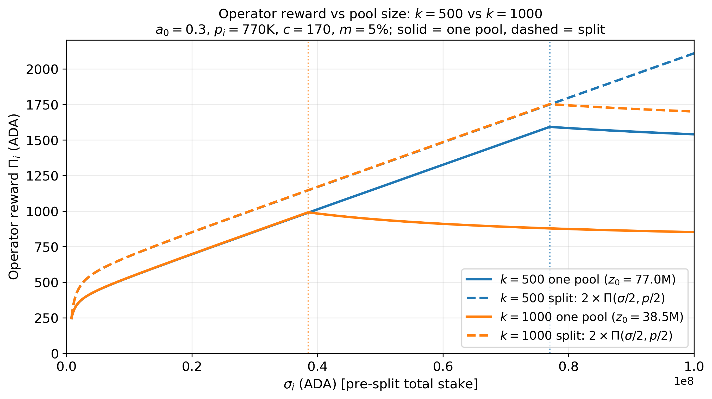
    

3. **Small pools competitivness:** Since the operator of a large pool increase their overall returns by splitting into two identical pools, this operator could reduce $m_i$ and/or $c_i$ (whenever feasible) to become more competitive. This raises a critical question: to what extent does an increase in $k$ truly improve the competitiveness of small pools?

# Change in $c_{min}$
(ToDo: Describe and elaborate on the intended design role of the parameter.)

## Increment in $c_{min}$
This parameter acts as a lower bound on the fixed costs an operator can declare for their pool(s). That is, while $c_{\min}$ may change, each operator $i$ ultimately decides whether to update their declared fixed cost $c_i$ (this is particularly true if the $c_{min}$ is reduced, while operators may need to update if the $c_{min}$). In this subsection, we assume operators always set their fixed costs equal to $c_{\min}$.

### Impact over operators
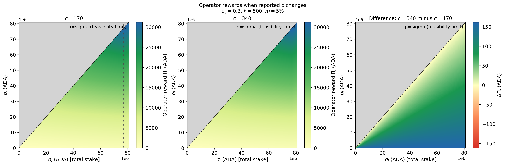

### Impact over delegators
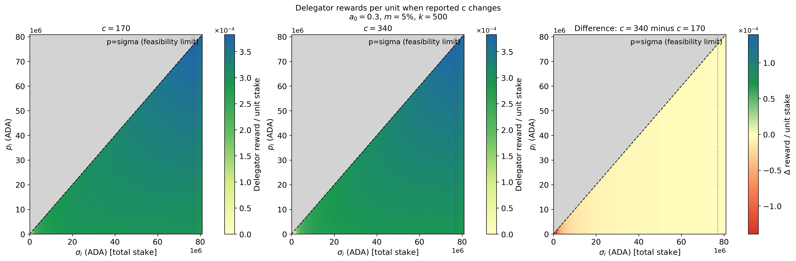

# Change in $a_0$
(ToDo: Describe and elaborate on the intended design role of the parameter.)

## Increment in $a_0$
Increasing $a_0$ directly reduces the rewards assigned to a given pool by the protocol through $f()$. For a fixed level of pledge, this negative impact is more significant for larger pools (left plot). However, right plot suggest that an operator can mitigate this effect by replacing delegations with operator pledge. We will see that the latter is not the case. 

  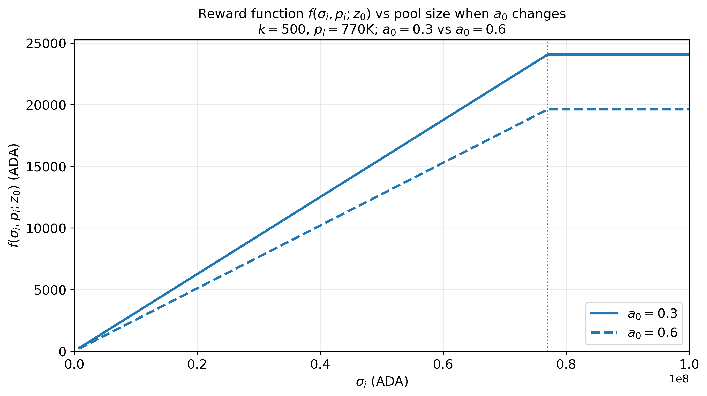
  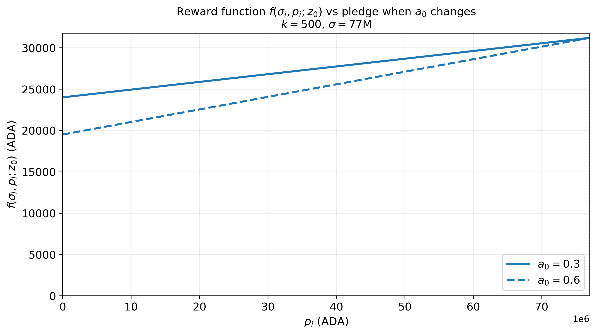

### Impact over operators
From the previous plots, we could expect that a pool with larger pledge can mitigate the negative effect of the increment of $a_0$ by replacing delegations with pledge. However, the previous plots only illustrate the effect over the **reward function $f()$** while to address the effect over the operator we have to check the **operator rewards**.
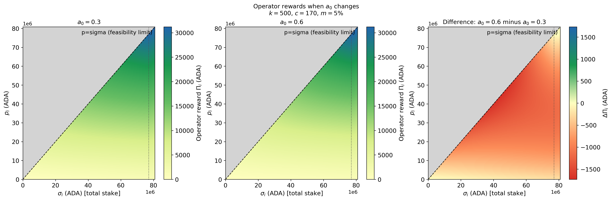

To see the aparent discrepancy between the two plots, let's consider the case of $\sigma=z_0$ in $f()$:

$$ f=\frac{R}{1+a_0}\bigl(z_0+a_0 p_i\bigr).$$

Raising $a_0$ has two effects:
1. the factor $1/(1+a_0)$ shrinks the reward, and
2. the $a_0 p_i$ term rewards pledge more.

It is easy to see that this function is more increasing in $p_i$ when $a_0$ growth.

When we check the **operator reward**, the operator receives approximately

$$\Pi_i=s_i\cdot(f-c_i),\quad where \quad s_i=m_i+(1-m_i)\frac{p_i}{\sigma_i}.$$

Hence, the change in the **operator reward** ($\Delta\Pi$) is approximately:

$$s_i\cdot\Delta f()$$

As pledge rises, $s_i$ rises toward $1$. Even if $|\Delta f|$ shrinks, the operator’s **share** of that loss grows. So, $\Delta\Pi_i$ can become **more negative** even while $\Delta f$ becomes **less negative**. Away from saturation (e.g. $\sigma=50$M), $\Delta f()$ never fully recovers, so $\Delta\Pi$ can stay more negative all the way up the pledge axis.

As an example, let $\sigma_i=50M$ ADA, $k=500$, $c_i=170$, and $m_i=5\\%$. Suppose $a_0$ increases from $0.3$ to $0.6$:

| $p_i/\sigma_i$ | $\Delta f(\cdot)$ | $\Delta\Pi_i$ |
|---|---|---|
| $0$ | $-2922$ | $-146$ |
| $0.5$ | $-2140$ | $-1123$ |
| $1$ | $-1690$ | $-1690$ |

Bottom line: Higher pledge cushions the reward function $f()$ under a larger $a_0$. For the **operator**, it also means owning a larger slice of a still-smaller pie, so the operator comparison can look worse when pledge is very high.

### Impact over delegators
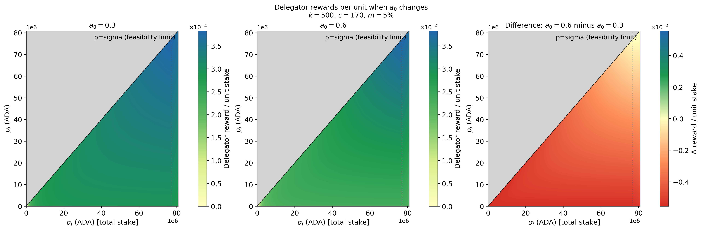

# Discussion
A lower saturation threshold when $k$ raises has several key implications. First, smaller or newer pools require less pledge and delegation to reach maximum reward, making it easier and less costly to compete with established, large pools. However, a lower saturation threshold also caps the maximum rewards a single pool can earn. As a result, while small pools improve their competitivness for delegators (that do not want to leave the ecosystem), the lower reward ceiling may make the overall ecosystem less appealing to investors looking to maximize their staking returns.

This last point highlights a critical design dilemma: Should the mechanism prioritize small operator viability or delegator attraction? While a balanced approach sounds ideal, the precise definition of 'balance' is rarely specified. Furthermore, protocol design must account for long-term feedback loops. For example, a policy that boosts small operator viability at the expense of delegator returns risks triggering a negative spiral: higher operator viability leads to reduced delegator yields $\rightarrow$ delegators exit $\rightarrow$ network security declines $\rightarrow$ adoption drops $\rightarrow$ token price falls $\rightarrow$ operator viability ultimately collapses under lower prices and fewer remaining delegators.
