# The Staking Census — The Four Game Player Populations of Cardano's Reward Pipeline

Before any conclusion can be drawn about how rewards are *shared*, a prior question must be answered: **who is on the field, how many they are, how much capital each side controls, and who is paying for the chain that distributes the rewards.** This report establishes that ground truth across the **four game player populations** that the SL-D1 reward formula operates on — *pool operators, delegators, non-participants, and transaction submitters* — and the **ADA supply** they share.

These four populations are not abstract roles; they are concrete, countable groups of addresses with measurable behaviours, capital, and overlap. The companion [*The Intended Game*](../../../../the-intended-game/README.md) frames the staking mechanism as a game; this census names the *players*. Each chapter zooms in on one: §3 the pool operators, §4 the delegators, §5 the non-participants (the ADA that *could* play but doesn't, or *can't* by construction), §6 the transaction submitters (the addresses paying the fees that fund the pot). §2 sets the supply context they share.

The census is also, deliberately, a **noise-removal protocol**. The raw db-sync tables register **5,919 pools** and **1.85M delegation certificates** — but most of those pools earn no blocks and most of those certificates are ghosts of empty wallets. Iterative cleaning (production threshold → entity attribution → balance-bearing delegations) brings the productive count down to **733 pools** and **1,227,281 delegations** carrying **21.18B ADA**. The companion [*Pools Pot Distribution*](../../pools-distribution/mainnet-analysis/) and [*Operator's Cut*](../../operator-delegator-distribution/mainnet-analysis/) reports chain off these cleaned denominators; *every metric they report inherits the choices documented here*.

The analysis spans the full Shelley history (epochs 211–627, ~5 years) with a snapshot anchor at **epoch 623** for the staking-side aggregates (§2–§5) and at **epoch 627** for the transaction-submitter analysis (§6, refreshed once Instance B's full db-sync caught up with chain tip). It produces **twelve headline observations** (CEN.O1–CEN.O12) that the rest of the report makes auditable. The headline picture below walks through the four populations in order.

**Pool operators (§3) — the supply side has crystallised, and capital has flowed to consolidators rather than independents.** **21.75B ADA** (60.2% of circulating supply) is staked across **2,877 pools**. After cutting at the production threshold (≥3M ADA, the 95%-block-probability bar), the productive core is **733 pools** controlled by **367 entities**: **83 attributed entities** hold **76.7%** of productive stake through **449 productive pools**, and within that **10 centralised exchange and institutional-validator entities** alone hold **34.3%** at structurally zero pledge. The pool count has been stable in a **700–1,000 band** since epoch 300 — turnover at **~16 pools per epoch** sustains the stock by replacement, not growth (3,497 entries against 3,070 exits over the full history). The mechanism's intended pathway from independent entrant to established operator has no observable expression: the independent single-pool segment contracted from **555 pools / 39.1% of stake** at the epoch-300 peak to **291 / 24.4%** today (a 48% loss), while multi-pool fleets grew from **23 → 85 entities** and **135 → 660 pools**, with the mid-tier (6–20 pool) entity count tripling. *Capital flowed toward institutional consolidators, not toward the independents the design intended.*

**Delegators (§4) — the demand side is concentrated, settled, and price-blind.** **1.36M delegators** carry **21.18B ADA** across the productive pool set; concentration is extreme — **1,000 delegators (0.07%)** hold **57%** of staked ADA, the top **10,000 (0.74%)** hold **79.2%**, Gini **0.976**. Concentration crystallised by epoch 300 and has not moved since: a **9× growth** in delegator count has not budged the top-1% share. The base is bimodal — **42% loyal** (201+ epochs, > 2.7 years), **21% volatile** (≤ 5 epochs), **37% moderate** — and switching collapsed **75%** from **2,000–3,500** redelegations per epoch in early Shelley to **600–800** today. When delegators do switch, **50.5%** land in pools with statistically indistinguishable yield (median ROS differential **+0.02 bps**), take direction is symmetric (30.8% cheaper / 31.5% pricier / 37.7% flat), and **92.1%** of loyal delegations sit in the same 0–5% margin band — *loyalty and low fees coexist rather than trade off*. The one asymmetric signal is pool size: capital drifts toward larger pools regardless of price. *Visibility, not return, is what moves stake — and most of the network's stake sits in the hands of its most actively-managed delegations* (whales hold **65%** of stake but only **38%** of that capital is in loyal delegations).

**Non-participants (§5) — most of the unstaked supply is structurally beyond reach of any reward-design change.** **14.36B ADA (39.8% of circulation)** sits unstaked, and only **134.6M (0.37%)** belongs to accounts with a registered stake credential that have simply not delegated — the *addressable* pool that incentive design can, in principle, reach. The remaining **14.2B** sits in addresses with **no stake credential at all**: enterprise (`addr1v`, exchange custody), script-without-staking (`addr1w`, Plutus contracts and DeFi vaults), Byron-era legacy, and base addresses whose staking key was never registered. The "unreachable" core is **not a faceless retail tail** — top-3 wallets control **19.1%**, top-200 control **68.9%** of the **2.5B identified residual**; the addresses split into recognisable archetypes (exchange hot wallets, institutional cold storage, pre-staking-era legacy holders, DeFi vaults). The *addressable* pool itself collapses to **~2,100 active accounts and 0.06% of supply** once zero-balance shells and a single 80M-ADA DeFi vault are removed. *The recruitment ceiling is narrower than the headline 0.37% suggests by an order of magnitude — meaningful re-engagement requires changing the address architecture, not the incentive curve.*

**Transaction submitters (§6) — a shrinking population funds the chain, and the funders are largely not the people who get rewarded.** Fees contribute roughly **0.2%** of the current epoch pot; every long-term sustainability scenario assumes that ratio reverses, and the fee-paying population is moving the wrong way. Unique submitters fell from a peak of **790,335 (epoch 304)** to **31,176 (epoch 627)** — a **96%** contraction against a 92% drop in transactions; the same shrinking core now transacts **~3.8× per epoch** (vs ~2.0× at peak). The fee base is concentrated: **the top 500 addresses pay 58.4% of recent fees** out of ~147K active submitters, and the top 10 alone pay **20.0%** — a recognisable handful (a MinSwap DEX-script, addresses tied to NUFI / TITAN / BERRY / OYSTR pools, plus enterprise-script DEX contracts and bot wallets). And **the funder population barely overlaps the reward population**: only **41.8%** of fee revenue comes from currently-delegating addresses, **30.1%** from addresses that structurally cannot delegate, **28.1%** from base addresses that *could* delegate but aren't. From the delegator side, **only 3.1% of the 1.352M active delegators submit any transaction in a 30-day window**. *Fewer than 4 ADA in every 10 ADA of fees flow back through the delegation channel to the population that paid them.*

# Table of Contents

1. [Mainnet Observations](census.html#1-mainnet-observations)
2. [The ADA Supply](#2-the-ada-supply)
3. [Pool Operators](#3-pool-operators)
   - [3.1. What the raw db-sync shows — 5,919 pools, most of them empty](#31-what-the-raw-db-sync-shows-5919-pools-most-of-them-empty)
   - [3.2. Three quarters of pools earn no blocks — the production threshold cut](#32-three-quarters-of-pools-earn-no-blocks-the-production-threshold-cut)
   - [3.3. Behind the pools — 4 entities on-chain become 85 with off-chain attribution](#33-behind-the-pools-4-entities-on-chain-become-85-with-off-chain-attribution)
   - [3.4. The productive operator landscape — 733 pools, 367 entities, 21.18B ADA at stake](#34-the-productive-operator-landscape-733-pools-367-entities-2118b-ada-at-stake)
     - [3.4.1. The headline picture at epoch 623](#341-the-headline-picture-at-epoch-623)
     - [3.4.2. The shape of the multi-pool fleet — 12 entities run 41% of the productive stake](#342-the-shape-of-the-multi-pool-fleet-12-entities-run-41-of-the-productive-stake)
     - [3.4.3. What the productive total looked like before the threshold cut](#343-what-the-productive-total-looked-like-before-the-threshold-cut)
   - [3.5. The market has crystallised — replacement, not growth](#35-the-market-has-crystallised-replacement-not-growth)
     - [3.5.1. Pool entries and exits — turnover sustains the stock, not growth](#351-pool-entries-and-exits-turnover-sustains-the-stock-not-growth)
     - [3.5.2. How entities are born, grow, and exit — the lifecycle of the 85 attributed players](#352-how-entities-are-born-grow-and-exit-the-lifecycle-of-the-85-attributed-players)
     - [3.5.3. Who actually holds the productive set today — and who used to](#353-who-actually-holds-the-productive-set-today-and-who-used-to)
     - [3.5.4. The independent operator pipeline has no observable expression in the data](#354-the-independent-operator-pipeline-has-no-observable-expression-in-the-data)
   - [3.6. A pool's stake stability is segment-driven, not random](#36-a-pools-stake-stability-is-segment-driven-not-random)
4. [Delegators](#4-delegators)
   - [4.1. What the raw db-sync shows — 1.85M certificates, half of them ghosts](#41-what-the-raw-db-sync-shows-185m-certificates-half-of-them-ghosts)
   - [4.2. Removing the ghosts — certificates without ADA aren't delegators](#42-removing-the-ghosts-certificates-without-ada-arent-delegators)
   - [4.3. Removing delegations to dead pools — the active set the mechanism actually rewards](#43-removing-delegations-to-dead-pools-the-active-set-the-mechanism-actually-rewards)
   - [4.4. The productive delegator landscape — 1.355M delegations, 21.18B ADA, Gini 0.976](#44-the-productive-delegator-landscape-1355m-delegations-2118b-ada-gini-0976)
     - [4.4.1. The headline picture at epoch 623](#441-the-headline-picture-at-epoch-623)
     - [4.4.2. Half the delegator base stakes less than a transaction fee — the wealth is in the top 0.07%](#442-half-the-delegator-base-stakes-less-than-a-transaction-fee-the-wealth-is-in-the-top-007)
     - [4.4.3. Concentration crystallised by epoch 300 — 9× growth in delegators, no change in the top-1%](#443-concentration-crystallised-by-epoch-300-9-growth-in-delegators-no-change-in-the-top-1)
   - [4.5. Net delegator inflows have stabilised — the population stopped growing meaningfully around epoch 300](#45-net-delegator-inflows-have-stabilised-the-population-stopped-growing-meaningfully-around-epoch-300)
   - [4.6. Pool-switching collapsed 75% — the market has settled](#46-pool-switching-collapsed-75-the-market-has-settled)
     - [4.6.1. The certificate stream tells a three-act story — experimentation, hard-fork shocks, then stillness](#461-the-certificate-stream-tells-a-three-act-story-experimentation-hard-fork-shocks-then-stillness)
     - [4.6.2. Most delegators stay put — 42% have held the same pool for over 2.7 years](#462-most-delegators-stay-put-42-have-held-the-same-pool-for-over-27-years)
     - [4.6.3. The bigger the delegation, the more it moves — whales switch 4–5× more often than micro-delegators](#463-the-bigger-the-delegation-the-more-it-moves-whales-switch-45-more-often-than-micro-delegators)
     - [4.6.4. Switching is a retail-only phenomenon — custodial pools contribute negligible churn](#464-switching-is-a-retail-only-phenomenon-custodial-pools-contribute-negligible-churn)
   - [4.7. The yield signal is too flat to drive behaviour — what actually moves capital](#47-the-yield-signal-is-too-flat-to-drive-behaviour-what-actually-moves-capital)
     - [4.7.1. Half of all switches produce zero yield change — the price signal is invisible](#471-half-of-all-switches-produce-zero-yield-change-the-price-signal-is-invisible)
     - [4.7.2. Operator take direction is balanced — no fee-chasing pattern in the data](#472-operator-take-direction-is-balanced-no-fee-chasing-pattern-in-the-data)
     - [4.7.3. Pool size — not price — is the only asymmetric signal in switching behaviour](#473-pool-size-not-price-is-the-only-asymmetric-signal-in-switching-behaviour)
     - [4.7.4. Loyalty and low fees coexist — the cheapest pools are the stickiest](#474-loyalty-and-low-fees-coexist-the-cheapest-pools-are-the-stickiest)
   - [4.8. DeFi operates almost entirely outside the staking system — only 0.03% of delegations are script-based](#48-defi-operates-almost-entirely-outside-the-staking-system-only-003-of-delegations-are-script-based)
5. [Non-Participants](#5-non-participants)
   - [5.1. 2/5 of the supply has sat unstaked for over 300 epochs](#51-25-of-the-supply-has-sat-unstaked-for-over-300-epochs)
   - [5.2. Most non-participants have no staking key — only 0.4 % of supply is reachable by reward design](#52-most-non-participants-have-no-staking-key-only-04-of-supply-is-reachable-by-reward-design)
   - [5.3. The locked share splits cleanly between probably-lost and operationally-active](#53-the-locked-share-splits-cleanly-between-probably-lost-and-operationally-active)
   - [5.4. A few hundred custodians hold three-quarters of the structurally-excluded ADA](#54-a-few-hundred-custodians-hold-three-quarters-of-the-structurally-excluded-ada)
     - [5.4.1. The DeFi-locked share is one contract](#541-the-defi-locked-share-is-one-contract)
   - [5.5. The "addressable" pool collapses to about 2,100 active accounts](#55-the-addressable-pool-collapses-to-about-2100-active-accounts)
   - [5.6. What the four levers can and cannot reach](#56-what-the-four-levers-can-and-cannot-reach)
6. [Transaction Submitters](#6-transaction-submitters)
   - [6.1. A shrinking crowd paying for a busy chain](#61-a-shrinking-crowd-paying-for-a-busy-chain)
   - [6.2. Most submitters can stake — but the loudest of them can't](#62-most-submitters-can-stake-but-the-loudest-of-them-cant)
   - [6.3. ~3,800 smart contracts carry a third of the fees](#63-3800-smart-contracts-carry-a-third-of-the-fees)
   - [6.4. The fee floor rests on a few dozen recognisable names](#64-the-fee-floor-rests-on-a-few-dozen-recognisable-names)
   - [6.5. The people who pay are not the people who get rewarded](#65-the-people-who-pay-are-not-the-people-who-get-rewarded)
   - [6.6. What this means for the reward pipeline](#66-what-this-means-for-the-reward-pipeline)
7. [Synthesis](#7-synthesis)
   - [Key metrics (staking snapshot epoch 623; submitter snapshot epoch 627)](#key-metrics-staking-snapshot-epoch-623-submitter-snapshot-epoch-627)
   - [Concentration headline](#concentration-headline)
   - [Noise removal log](#noise-removal-log)
   - [What remains noisy](#what-remains-noisy)
8. [Bridges to Companion Analyses](#8-bridges-to-companion-analyses)
- [Appendix A — methodological notes for the submitter analysis](#appendix-a-methodological-notes-for-the-submitter-analysis)
- [Appendix B — methodological notes for the non-participant analysis](#appendix-b-methodological-notes-for-the-non-participant-analysis)
- [Appendix C — global data sources and methodology](#appendix-c-global-data-sources-and-methodology)

# 1. Mainnet Observations

| # | Observation | Section | Nature |
| --- | --- | --- | --- |
| | **CEN.O1 — Multi-pool entities flourished (23 → 85 entities, 65% → 76% of productive stake) while single-pool operators struggle (555 → 291 pools, 39% → 24% of stake)** | | *The designed entry → growth → established path is no longer observable.* The productive set tracks a **700–1,000 band** since epoch 300 (**733 pools at epoch 623** as the threshold rises with total stake), with only **1.7%** turnover per epoch — but composition has hardened underneath that flat aggregate. **83 attributed entities** control **76.7%** of productive stake (12 with 11+ pools alone hold **41.0%**); multi-pool fleets grew from **23 to 85** while single-pool operators contracted from **39.1% to 24.4%** of stake. |
| CEN.O1.F1 | **Three quarters of registered pools are economically irrelevant.** 2,144 of 2,877 (75%) sit below the production threshold (~3M ADA) and together hold only 2.7% of stake | [The structural floor](../../../README.md#12411-the-structural-floor) | Structural threshold |
| CEN.O1.F2 | **Three quarters of productive stake sits in 83 named entities.** They control 76.7% through 449 productive pools (71 strict multi-pool + 12 attributed single-pool) — and the count is a lower bound (operators using fully separate per-pool infrastructure stay invisible) | [SPO supply side — fewer and fewer entities participate in consensus](../../../README.md#2131-spo-supply-side-fewer-and-fewer-entities-participate-in-consensus) | Concentration — supply side |
| CEN.O1.F3 | **The pool count flat-lined since epoch 300; the equilibrium is replacement, not growth.** The productive set tracks a 700–1,000 historical band (733 at epoch 623) with 1.7% turnover per epoch — 3,497 entries against 3,070 exits balance to near-zero net flow | [The market has crystallised — replacement, not growth](#35-the-market-has-crystallised-replacement-not-growth) | Market maturity |
| CEN.O1.F4 | **Concentration is heavy-tailed: 12 entities run 41% of productive stake.** Of the 83 attributed, 12 with 11+ productive pools control 41.0% (8.69B / 21.18B); the top 2 alone (Coinbase 41p, YUTA 25p) hold 13.4% | [The productive operator landscape — 733 pools, 367 entities](#34-the-productive-operator-landscape-733-pools-367-entities-2118b-ada-at-stake) | Scale dominance |
| CEN.O1.F5 | **Custodial dominance sets a structural pledge floor.** CEX + IVaaS (10 entities, 181 pools, 7.40B ADA, 34.3% of productive stake) operate at zero pledge by *architectural* constraint — custodied retail balances cannot legally be pledged | [The productive operator landscape — 733 pools, 367 entities](#34-the-productive-operator-landscape-733-pools-367-entities-2118b-ada-at-stake) | Custodial constraint |
| CEN.O1.F6 | **Independent operators are losing the field — 48% pool-count loss in 323 epochs.** Single-pool operators contracted from 555 pools / 39.1% of productive stake (epoch 300 peak) to 291 / 24.4% (epoch 623); the contraction has accelerated in the most recent window | [The market has crystallised — replacement, not growth](#35-the-market-has-crystallised-replacement-not-growth) | Structural decline |
| CEN.O1.F7 | **Multi-pool entities absorbed the contraction and then some — fleet count nearly quadrupled.** From 23 entities / 135 pools / 65% of stake (epoch 210) to 85 / 660 / 75.6% (epoch 623); the mid-tier (6–20 pools) tripled in entity count and nearly doubled in stake share | [The market has crystallised — replacement, not growth](#35-the-market-has-crystallised-replacement-not-growth) | Entity expansion |
| CEN.O1.F8 | **The mechanism's designed progression path is invisible in the data.** Entry → growth → established is supposed to feed the independent segment; instead the independent population is contracting and the replacement pools that maintain the productive total are entity-operated | [The market has crystallised — replacement, not growth](#35-the-market-has-crystallised-replacement-not-growth) | Pipeline failure |
| CEN.O1.F9 | **On-chain attribution alone misses the bulk of fleet structure — 4 entities vs 85, a ~20× jump.** Most multi-pool operators use separate keys per pool, so on-chain ownership clustering catches only the small minority that doesn't separate keys; any analysis stopping at the on-chain layer materially understates MPO concentration | [Behind the pools — entity attribution layers 4 on-chain entities into 85](#33-behind-the-pools-4-entities-on-chain-become-85-with-off-chain-attribution) | Methodological — attribution layer matters |
| | **CEN.O2 — When a Titan delegator switches pools, the whole pool moves with them — whale-funded pools swing ±20% between epochs (1 in 5 swings >50%) while retail pools barely move (±8%)** | | *A pool's stake stability depends on who its delegators are — not on the market segment it competes in.* In **whale-funded pools** (the 28 *custodial-by-delegation* pools, where the typical delegator holds ≥ 100K ₳), a single Titan-tier address (10M+ ₳) is large enough that when they move, the whole pool moves: **stake swings ~±20% between epochs**, and **1 in 5** of them swings more than 50%. The operator loses revenue predictability and the remaining delegators see their block-production rhythm wobble. **Retail** pools (broad small-delegator base) absorb churn smoothly — they only move **±8%** between epochs. **Custodial-by-extraction** pools (≥ 99% margin) barely budge (**±7%**) because their delegators are locked in by inertia. What looks like *delegator activity* in the aggregate is mostly a handful of institutional treasuries shifting capital. |
| CEN.O2.F1 | **A single Titan delegator moving in or out can shake a whole pool — whale-funded pools swing ~±20% between epochs vs ±8% for retail.** In the **28 custodial-by-delegation pools** (typical delegator holds ≥ 100K ₳), stake moves by roughly **±20% between epochs**, with **21%** of them swinging by more than 50% — these are pools where a single address is large enough that its movement dominates the variance. **Retail** (809 pools, broad small-delegator base) is mostly stable (**±8%**) — no single delegator can move the pool. **Custodial-by-extraction** (79 pools, ≥99% margin) is the most inert (**±7%**) — stagnation, not active management | [A pool's stake stability is segment-driven](#36-a-pools-stake-stability-is-segment-driven-not-random) | Segment-driven variance |
| | **CEN.O3 — The delegator population is wildly skewed in stake — 1,000 of 1.36M delegators (0.07%) hold 57% of staked ADA, and 9× population growth has not shifted the shape** | | *The delegator population is shaped like a power-law tail — almost all the staked capital sits in a tiny upper sub-population.* Of the **1.36M active delegators**, **1,000 (0.07%) hold 57% of staked ADA**; the top **10,000** (0.74%) hold **79.2%**; Gini = **0.976** — more concentrated than US wealth (~0.85) and comparable to the most unequal asset distributions in financial markets. The **median** delegator holds just **32 ADA** while the **mean** is **16,055 ADA** — a 500× gap that quantifies the skew. *The population has grown 9× since epoch 300 without changing its shape*: every cohort of new entrants has joined at the bottom of the distribution, leaving the top-1% share locked at **78–82%**. |
| CEN.O3.F1 | **Half the delegator base stakes less than a single transaction fee at peak congestion.** Median: 32 ADA. Mean: 16,055 ADA. The 500× gap measures the skewness of a power-law distribution where each tier above 10K ADA holds roughly 20% of total stake despite containing exponentially fewer delegators | [Half the delegator base stakes less than a transaction fee](#442-half-the-delegator-base-stakes-less-than-a-transaction-fee-the-wealth-is-in-the-top-007) | Structural inequality |
| CEN.O3.F2 | **The delegator population's stake is concentrated in its top 0.07%.** 1,000 delegators (0.07% of the 1.36M population) hold 57% of staked ADA; the top 10,000 (0.74%) hold 79.2%. Gini = 0.976 — more concentrated than US wealth (~0.85) and comparable to the most unequal asset distributions observed in financial markets | [Half the delegator base stakes less than a transaction fee](#442-half-the-delegator-base-stakes-less-than-a-transaction-fee-the-wealth-is-in-the-top-007) | Concentration — demand side |
| CEN.O3.F3 | **Concentration crystallised by epoch 300 and has not moved since.** A 9× growth in delegator count has not budged the top-1% share (locked at 78–82%) — new entrants are overwhelmingly micro-delegators (<1K ADA, 96% of new joins) who inflate the denominator without touching the numerator. The economic weight of staking was set in its first ~90 epochs | [Concentration crystallised by epoch 300 — 9× growth in delegators, no change in the top-1%](#443-concentration-crystallised-by-epoch-300-9-growth-in-delegators-no-change-in-the-top-1) | Structural lock-in |
| | **CEN.O4 — Most delegators stay put for years — 42% have stuck with the same pool for 2.7+ years, only 21% switch within 25 days, and the population's switching rate is 75% below early Shelley** | | *The delegator population settled long ago — most of it doesn't move.* Tenure splits the population cleanly into three sub-groups: **42% have stayed with the same pool for 2.7+ years** (201+ epochs), **21% switch within 25 days** (≤ 5 epochs), **37% sit in the middle** (somewhere between). Aggregate switching has collapsed **75%** from **2,000–3,500 redelegations per epoch** in early Shelley to **600–800 today** — three regimes: experimentation → middle → mature. And almost all of that switching comes from the retail population: custodial and private pools barely move. |
| CEN.O4.F1 | **Pool-switching collapsed 75% from early Shelley.** Redelegations fell from 2,000–3,500 per epoch (early Shelley experimentation) to 600–800 today — three regimes: experimentation (epochs 210–260) → middle period with hard-fork spikes (260–500) → mature settled market (500+) | [The certificate stream tells a three-act story](#461-the-certificate-stream-tells-a-three-act-story-experimentation-hard-fork-shocks-then-stillness) | Market maturity |
| CEN.O4.F2 | **The base splits cleanly into stickers and switchers, with a thin middle.** 42% loyal (201+ epochs, > 2.7 years), 21% volatile (≤ 5 epochs, < 25 days), 37% moderate. The loyal majority anchors pool economics; the volatile tail generates the bulk of the churn signal | [Most delegators stay put — 42% have held the same pool 2.7+ years](#462-most-delegators-stay-put-42-have-held-the-same-pool-for-over-27-years) | Structural bimodality |
| CEN.O4.F3 | **Switching is a retail-market phenomenon — custodial and private pools contribute negligible churn.** A retail-only filter (margin < 99.9%, excluding by-pledge / by-extraction custodial) produces near-identical aggregates: 40.0% switch rate, 42.4% loyal tenure, ~799 redelegations per epoch | [Switching is a retail-only phenomenon](#464-switching-is-a-retail-only-phenomenon-custodial-pools-contribute-negligible-churn) | Churn is retail-only |
| | **CEN.O5 — The bigger the delegation, the more it moves — whales (1M+ ₳) hold 65% of the staked supply and switch ~4× more often than small delegators** | | *The bigger the delegation, the more often it moves.* The smallest delegators (**< 1K ₳**) average just **0.67 pool switches over their lifetime** — they delegate once and forget. **Whales (1M+ ₳)** average **3.06 switches** — about **4–5× more**. And whales hold **14.1B of the 21.8B staked supply (65%)** — yet only **38%** of that capital sits in long-term (201+ epoch) delegations. *The bulk of the network's staked capital sits in the hands of its most actively-managed delegations.* Pool operators depending on a few whale delegators therefore face structurally higher stake instability than those with a broad retail base. |
| CEN.O5.F1 | **Whales switch 4–5× more often than micro-delegators.** Lifetime switches: <1K = 0.67, 1K–10K = 0.95, 10K–100K = 1.64, 100K–1M = 2.65, 1M+ = 3.06. Loyal share (201+ epochs): <1K = 82%, 1M+ = 39%. Switching intensity scales monotonically with stake size — small delegators delegate once and forget; large delegators actively manage their position | [The bigger the delegation, the more it moves](#463-the-bigger-the-delegation-the-more-it-moves-whales-switch-45-more-often-than-micro-delegators) | Size-driven behaviour |
| CEN.O5.F2 | **Most of the network's staked capital sits in delegations that move.** Whales (1M+) hold 14.1B of the 21.8B staked total (65%), yet only 38% of that stake sits in loyal (201+ epoch) delegations — the rest distributes across moderate and volatile tenures. Pool operators dependent on a few large delegations face structurally higher stake instability than those with a broad base of small loyal delegators | [Loyalty and low fees coexist](#474-loyalty-and-low-fees-coexist-the-cheapest-pools-are-the-stickiest) | Capital instability |
| | **CEN.O6 — The delegator population doesn't shop on price — half their switches produce zero yield change, switch direction is balanced (30.8% cheaper / 31.5% pricier), and 92% of long-term delegators sit in the cheapest 0–5% margin band** | | *The delegator population behaves like passive parkers, not yield-shoppers.* When delegators do switch, **half (50.5%) land in pools with statistically indistinguishable yield** (±5 bps; median ROS differential **+0.02 bps** — well below any threshold a delegator could observe). Switch *direction* is symmetric too: **30.8% go cheaper / 37.7% stay flat / 31.5% go pricier** — no fee-chasing pattern. The one asymmetric move is by *pool size* (the population drifts toward larger pools regardless of price). And **92.1% of long-term delegators (201+ epochs) sit in the cheapest 0–5% margin band** — the cheapest pools are also the stickiest, so loyalty and low fees coexist, they don't trade off. The DeFi sub-population is essentially absent: **99.83% of staked ADA is key-based**; only 38M ADA across 399 script addresses is held by smart contracts. |
| CEN.O6.F1 | **Delegators cannot see what they're paying for — the yield signal is too flat to act on.** Half of all switches (50.5%) produce zero yield change (±5 bps); the median ROS differential is +0.02 bps with an interquartile range of −0.47 to +0.55 bps. The signal is an order of magnitude below any threshold a delegator could observe, let alone optimise against | [Half of all switches produce zero yield change](#471-half-of-all-switches-produce-zero-yield-change-the-price-signal-is-invisible) | Price signal invisible |
| CEN.O6.F2 | **Operator take direction is balanced — no fee-chasing pattern is detectable.** 30.8% of switches go to a cheaper pool, 31.5% to a more expensive one, 37.7% land at the same take. The take × ROS matrix's diagonal dominates (lower take → better ROS at 18.4%, similar → similar at 25.6%, higher → worse at 16.5%) — confirming take and ROS are two views of one signal, and that signal is too flat to drive behaviour | [Operator take direction is balanced — no fee-chasing](#472-operator-take-direction-is-balanced-no-fee-chasing-pattern-in-the-data) | No fee-chasing |
| CEN.O6.F3 | **Pool size — not price — is the only asymmetric signal in switching behaviour.** Moves to smaller pools tend to accept higher take (21.5%), moves to larger pools tend to stay take-neutral (21.0%). The asymmetry suggests moves toward small pools follow non-economic factors (community affinity, retirement at origin, decentralisation preference); moves toward larger pools follow a path of least resistance — *visibility, not optimisation* | [Pool size — not price — is the only asymmetric signal](#473-pool-size-not-price-is-the-only-asymmetric-signal-in-switching-behaviour) | Visibility over optimality |
| CEN.O6.F4 | **Loyalty and low fees coexist — the cheapest pools are the stickiest.** 92.1% of loyal delegations (201+ epochs) sit in the 0–5% margin range. Loyalty is a consequence of *initial pool selection* into the competitive neighbourhood, not a barrier to leaving it; fees segment the market at entry, not during tenure | [Loyalty and low fees coexist](#474-loyalty-and-low-fees-coexist-the-cheapest-pools-are-the-stickiest) | Entry filter, not trigger |
| CEN.O6.F5 | **DeFi operates almost entirely outside the staking system.** 99.97% of delegations and 99.83% of stake are key-based; script-based delegation (smart contracts, multisig, governance) is 399 addresses and 38M ADA. The DeFi ecosystem has not integrated with delegation in any meaningful way — and the credential type cannot separate custodial from retail capital, since both present as key-based | [DeFi operates almost entirely outside the staking system](#48-defi-operates-almost-entirely-outside-the-staking-system-only-003-of-delegations-are-script-based) | No smart-contract staking |
| | **CEN.O7 — The non-participant population is 39.8 % of the supply, structurally inert, and held by a tightly-concentrated minority of custodians and legacy holders** | | The **non-participant population** — addresses controlling ADA that is not delegated to any pool — has been **stable at 36–39 % of circulation for over 300 epochs** (14.4 B ADA at epoch 623). Only **0.37 %** of circulation is *reachable* by reward design (registered staking key but not delegated); the remaining **39.4 %** sits in addresses that cannot delegate without a protocol-level change. The "unreachable" core is **not a faceless retail tail** — **246 wallets hold 74 %** of it, top-3 alone hold 19 %; the addresses split cleanly into recognisable archetypes (exchange hot wallets, institutional cold storage, pre-staking-era legacy holders, DeFi vaults). The "addressable" pool collapses to **~2,100 active accounts and 0.06 % of supply** once zero-balance shells and a single DeFi vault are removed. *The reward mechanism's recruitment ceiling is narrow; meaningful re-engagement requires changing the address architecture, not the incentive curve.* |
| CEN.O7.F1 | **The staking rate is structurally declining despite persistent net delegator inflows.** The rate has fallen from **71% (epoch ~260)** to **59% (epoch 623)** — a **12 pp loss over ~360 epochs**. Circulating ADA grew from ~32B to ~37B while staked ADA grew from ~23B to only ~22B; the non-participant pool is growing faster than the staking pool. | §2 | Supply-side erosion |
| CEN.O7.F2 | **14.36B ADA (39.8% of circulating supply) does not participate in staking — and only a sliver of that is reachable by reward design.** The non-participant pool has been stable at **36–39%** for over 300 epochs. **Only 0.37% of circulation (134.6M ADA, 24,176 accounts)** is *nominally addressable* by an incentive-design change — and even that figure shrinks under scrutiny (§5.5). The remaining **39.4%** sits in addresses that **cannot delegate without a protocol-level change**. | [2/5 of the supply has sat unstaked for over 300 epochs](#51-25-of-the-supply-has-sat-unstaked-for-over-300-epochs) | Structural non-participation |
| CEN.O7.F3 | **The non-participant floor is structural, not behavioural — incentive changes alone cannot reach 99% of it.** Reward-mechanism changes (curve adjustments, fee-structure reforms) can at most shift the **0.37% addressable pool**. Moving the other **39.4%** requires protocol-level changes — enabling exchange-style addresses to stake, mandating staking-capable DeFi script standards, or introducing delegation-by-default for newly minted wallets. | [Most non-participants have no staking key](#52-most-non-participants-have-no-staking-key-only-04-of-supply-is-reachable-by-reward-design) | Structural protocol limit |
| CEN.O7.F4 | **The "no staking key" residual is dominated by legacy and custody, not by active DeFi.** Among the **2.45B identified by address shape**, exchange-style addresses (**1.04B**) and pre-staking-era legacy addresses (**1.32B**) together account for **96%**. DeFi contract addresses without staking total just **91M** — one tenth as much, growing only slowly. The remaining ~11.8B sits in standard wallets where the holder never bothered to register a staking key. *The unreachable mass is overwhelmingly inertia, not active opt-out.* | [Most non-participants have no staking key](#52-most-non-participants-have-no-staking-key-only-04-of-supply-is-reachable-by-reward-design) | Composition — legacy not DeFi |
| CEN.O7.F5 | **The no-staking-key pool is bimodal: 37% is pre-staking-era dormant, 44% is from the last 73 epochs — the middle is empty.** The dormant fraction (**928M**) erodes at about **0.8M ADA per epoch** as wallets occasionally awaken. The recent fraction (**1,110M from epochs 550–623**) reflects active exchange and DeFi cycling. The middle eras are essentially spent — the population splits cleanly into *probably lost* and *operationally active*, with very little in between. | [The locked share splits cleanly between probably-lost and operationally-active](#53-the-locked-share-splits-cleanly-between-probably-lost-and-operationally-active) | Bimodal — dormant vs operationally active |
| CEN.O7.F6 | **The structurally-excluded 2.5B is held by a few hundred wallets, not by a diffuse retail base.** Top-3 wallets control **19.1%**, top-10 control **41.6%**, top-200 control **68.9%** of the **2.5B residual**. The top of the distribution splits into recognisable archetypes — **exchange hot wallets**, **institutional cold storage**, **pre-staking-era legacy holders** — addresses that can be named, not anonymous retail. Any policy aimed at this pool acts on a small, identifiable counterparty list. | [A few hundred custodians hold three-quarters of the structurally-excluded ADA](#54-a-few-hundred-custodians-hold-three-quarters-of-the-structurally-excluded-ada) | Concentration of structurally-excluded ADA |
| CEN.O7.F7 | **DeFi-locked-without-staking is a one-contract problem, not an ecosystem problem.** **89% of the 91M residual lives in one 80M-ADA contract**; the remaining 99 contracts together hold ~10M (11%). Mandating staking-capable contract addresses in DeFi standards would primarily move *that one contract* — the rest of DeFi has either already integrated staking or holds amounts too small to materially shift the residual. | [The DeFi-locked share is one contract](#541-the-defi-locked-share-is-one-contract) | DeFi exclusion is a one-contract problem |
| CEN.O7.F8 | **The "addressable" pool is mostly inert — the real ceiling for reward-driven recruitment is 0.06% of circulation, not 0.37%.** Of the 24,176 nominally-addressable accounts, **91% hold zero ADA**, **89% have been dormant since the first 41 epochs of Shelley**, and **80% of the residual ADA sits in one DeFi vault**. The genuine ceiling for reward-driven re-engagement is **~22.5M ADA (0.06% of circulation)**, spread across ~2,100 active accounts. *The reward mechanism's recruitment ceiling is narrower than the headline 0.37% suggests by an order of magnitude.* | [The "addressable" pool collapses to about 2,100 active accounts](#55-the-addressable-pool-collapses-to-about-2100-active-accounts) | Real ceiling on reward-driven recruitment |
| | **CEN.O8 — The active submitter population is shrinking and concentrating into a smaller, more active core** | | The submitter population — addresses paying fees in any given epoch — collapsed from a peak of **790,335 actors** (epoch 304) to **31,176** (epoch 627), a **−96%** contraction against only a 92% drop in transactions. The same population now transacts **~3.8× per epoch** (vs ~2.0× at peak), and the address-to-transaction ratio fell from 0.88 (epoch 210) to 0.26 (epoch 627). *The chain is not losing activity; the **population doing it** is shrinking while each surviving member transacts more often.* |
| CEN.O8.F1 | **The submitter population peaked at 790K addresses and has since contracted by 96% — the chain runs busily, with a much smaller crowd.** The population grew in step with transaction count through early Shelley, peaking at **790,335 unique addresses and 1,566,974 transactions** at epoch 304 (the CNFT minting frenzy). From epoch 310 onward the population collapsed faster than volume: **101K submitters at epoch 384**, **58K at epoch 500**, **31,176 at epoch 627**. Transaction volume fell only 92% over the same window — *a population one twenty-fifth of its peak still sustains three quarters of the per-epoch transaction rate seen during 2023–2024*. | [A shrinking crowd paying for a busy chain](#61-a-shrinking-crowd-paying-for-a-busy-chain) | Population contraction |
| CEN.O8.F2 | **Breadth is collapsing while per-actor intensity is rising — the same shrinking core just transacts more often.** The address-to-transaction ratio fell from **0.88 (epoch 210)** to **0.26 (epoch 627)**, and tx-per-submitter rose from **~2.0 (epoch 304)** to **~3.8 (epoch 627)**. Cumulative Shelley-era throughput totals **118.07M transactions** and **37.85M ADA in fees**. The growth-trajectory signal is unambiguous: *new addresses are not entering the fee-paying population at a rate that would sustain breadth — the same shrinking core is just transacting more often.* | [A shrinking crowd paying for a busy chain](#61-a-shrinking-crowd-paying-for-a-busy-chain) | Same shrinking core, more active per-member |
| | **CEN.O9 — Two submitter sub-populations coexist: a stakeable head-count majority and a small non-stakeable minority that pays a third of the fees** | | At epoch 627, the **stakeable majority** — base-key (`addr1q`) addresses carrying a stake credential — is **73.3%** of submitter head-count and pays 47.4% of fees. The **non-stakeable minority** — enterprise (`addr1v`, `addr1w`) and legacy Byron addresses that structurally cannot delegate — is only **~16%** of head-count but generates **30.1%** of fee revenue (averaged 622–627), and that share has not fallen below 14% since the Alonzo era. *The reward pipeline taxes a sub-population it cannot reward.* |
| CEN.O9.F1 | **By address count, the submitter population remains overwhelmingly stakeable — but the script segment has grown structurally.** At epoch 627: **73.3%** base-key (`addr1q`) addresses carrying a stake credential, **10.8%** base-script (`addr1z`), **9.2%** enterprise-key (`addr1v`), **4.9%** legacy Byron, **1.6%** enterprise-script (`addr1w`), **0.2%** base-other. Compared to the earlier snapshot at epoch 384 (87% base-key, <1% script), the shift is clear — base-key dropped 14 pp while base-script grew from 0.4% to 10.8%. *The count-based picture remains misleading: the small script population punches far above its weight in fee terms.* | [Most submitters can stake — but the loudest of them can't](#62-most-submitters-can-stake-but-the-loudest-of-them-cant) | Headcount remains overwhelmingly stakeable |
| CEN.O9.F2 | **Roughly 30% of fee revenue is generated by addresses that structurally cannot delegate, and this share has been stable since Alonzo.** Over the recent 6-epoch window (622–627): enterprise-script (`addr1w`) **17.0%**, enterprise-key (`addr1v`) **10.8%**, legacy Byron **2.3%** — totalling **30.1%**. The non-stakeable fee share has oscillated between 18% and 44% since epoch 300, averaging ~25%; the structural floor is set by DeFi contract activity, the ceiling by speculative episodes. *At no point since Alonzo has it fallen below 14% — the reward mechanism taxes a constituency it excludes.* | [Most submitters can stake — but the loudest of them can't](#62-most-submitters-can-stake-but-the-loudest-of-them-cant) | The fee base is structurally misaligned with the reward base |
| | **CEN.O10 — A small DeFi-script sub-population — ~3,800 contracts at epoch 627 — generates a third of the fee base** | | The **script-using sub-population** — base-script (`addr1z`) and enterprise-script (`addr1w`) addresses — is **3,851 actors** at epoch 627 (**12.4%** of submitters) and generates **36.0%** of epoch fees. Across the full post-Alonzo era it represents 12.5% of transaction count but **29.6%** of cumulative fees. The per-address fee rate of an enterprise-script submitter (12.1 ADA/epoch) is **14×** that of a base-key submitter (0.83 ADA/epoch). *The chain's fee floor is supported by a population of roughly 3,800 smart contracts — a population dimension the current incentive design does not address.* |
| CEN.O10.F1 | **Script transactions are 12.5% of post-Alonzo count but 29.6% of cumulative fees — the DeFi economy pays a 2.4× per-transaction premium.** The premium peaked above **3×** during the Alonzo era (epochs 310–340), when fewer than 30% of transactions commanded over 60% of fees. It has moderated to **~1.5×** in recent epochs but remains structurally above parity. *For the sustainability argument, this means per-transaction fee intensity is coupled to script adoption — a variable the current incentive design does not address.* | [~3,800 smart contracts carry a third of the fees](#63-3800-smart-contracts-carry-a-third-of-the-fees) | DeFi subsidises the epoch pot |
| CEN.O10.F2 | **At epoch 627, ~3,800 script addresses (12% of submitters) generate 36% of fee revenue — the pipeline depends on the continued operation of these contracts.** Specifically: **490 enterprise-script + 3,361 base-script = 3,851 actors** (12.4% of the submitter population) generated **14,481 ADA in fees — 36.0% of the epoch total**. The per-address rate of an enterprise-script submitter (12.1 ADA/epoch) is **14×** that of a base-key submitter (0.83 ADA/epoch). The script population grew sixteen-fold since epoch 384 (0.7% → 12.4%) while their fee share held steady around one third — *the per-address premium has moderated but the structural dependency has deepened.* | [Most submitters can stake — but the loudest of them can't](#62-most-submitters-can-stake-but-the-loudest-of-them-cant) | Concentration on script activity |
| | **CEN.O11 — The fee-paying population is bimodal: a heavy-paying core of a few hundred high-frequency actors and a long tail of ~147K small contributors** | | Over epochs 622–627, the **top 10** addresses generate **20.0%** of fees and the **top 500** generate **58.4%** — out of ~147K active submitters. The heavy-paying core is recognisable: a MinSwap DEX-script address leads, followed by addresses tied to the **NUFI**, **TITAN**, **BERRY**, and **OYSTR** pools and several enterprise-script DEX contracts and bot wallets. The concentration is heavy-tailed but below the delegation Gini of 0.976. *500 addresses out of 147K (0.34%) pay the majority of fees — the fee floor depends on a sub-population small enough to know by name.* |
| CEN.O11.F1 | **The top 10 addresses pay 20% of all fees; the top 500 (out of ~147K) pay 58%.** Over epochs 622–627, **500 addresses out of ~147K (0.34%) pay the majority of fees**. Concentration is heavy-tailed but less extreme than delegation stake (Gini 0.976). Compared to the prior 618–623 window (top-10 = 24.3%, top-500 = 60.8%), the recent window shows a **mild de-concentration of 4 pp at the top** — driven by a single very-high-volume address whose activity tapered. *The fee base sits on a few hundred high-frequency automated actors, not a diffuse retail tail.* | [The fee floor rests on a few dozen recognisable names](#64-the-fee-floor-rests-on-a-few-dozen-recognisable-names) | High-frequency automated actors (DEX aggregators, exchange hot wallets, arbitrage bots) |
| CEN.O11.F2 | **The top 10 fee payers ran 110,739 transactions over 6 epochs (16.1% of volume) — fee-pot stability hinges on a population small enough to know by name.** The top 50 ran **219,720 transactions (32.0%)** over the same 6-epoch window. The top fee payers are dominated by **recognisable archetypes**: a **MinSwap** DEX-script address leads at **12,105 ADA over 6 epochs**; pools tied to **NUFI** (NuFi exchange-style operator), **TITAN**, **BERRY**, and **OYSTR** appear among the top 10 alongside enterprise-script DEX contracts and bot wallets. *The fee floor of the network depends on a population of ~10 actors whose churn risk is not modelled by any incentive parameter.* | [The fee floor rests on a few dozen recognisable names](#64-the-fee-floor-rests-on-a-few-dozen-recognisable-names) | Single-actor exposure |
| | **CEN.O12 — The fee-paying population and the delegator population barely overlap — funders and beneficiaries are largely different people** | | Joining the submitter set (~147K addresses, epochs 622–627) to the **1,352,113 active delegators at epoch 627** reveals the population gap: only **41.8%** of fee revenue comes from currently-delegating addresses; **28.1%** from base addresses whose stake credential is *not* in the delegation set; **30.1%** from addresses with *no stake credential*. From the delegator side, **only 3.1%** of the 1.352M delegators submit any transaction in a 6-epoch window. *Fewer than 4 ADA in every 10 ADA of fees flow back to the population that paid them through any reward channel.* |
| CEN.O12.F1 | **Only 41.8% of fee revenue comes from currently-delegating addresses; the remaining 58.2% comes from addresses outside the delegation set at the snapshot epoch.** Across epochs 622–627, the **1.352M delegators at epoch 627** contributed **41.8% of fee revenue (92,538 ADA out of 221,565)**. The **stakeable-but-inactive segment** (base addresses whose stake credentials are not in the delegation set) contributed **28.1% (62,340 ADA)**. The **structurally non-stakeable segment** (enterprise + legacy) contributed **30.1% (66,684 ADA)**. *The mismatch is symmetric on both sides — the funding base does not match the reward base.* | [The people who pay are not the people who get rewarded](#65-the-people-who-pay-are-not-the-people-who-get-rewarded) | Fee base ≠ reward base |
| CEN.O12.F2 | **Only 3.1% of delegators submit any transaction in a 6-epoch window — 96.9% of delegators are passive holders.** Of the **1,352,113 active delegators at epoch 627**, only **42,082** appear as the first input of any transaction during epochs 622–627 (a 30-day window). The remaining **1,310,031 (96.9%)** hold stake, accrue rewards, and never touch the chain. From the other side, the submitter base has **76,561 unique stake credentials** over the same window, of which **42,082 (55.0%)** are in the delegation set — *the rest carry a stake credential that has never been delegated, has been deregistered, or sits idle*. | [The people who pay are not the people who get rewarded](#65-the-people-who-pay-are-not-the-people-who-get-rewarded) | Delegators are passive; submitters are a different population |
| CEN.O12.F3 | **In the top 500 fee-paying addresses, the largest segment by fee weight is the population the reward mechanism cannot reach.** Top-500 split: **no-stake-cred 39.4%** (213 addresses, 50,960 ADA), **delegating 39.2%** (161 addresses, 50,685 ADA), **has-cred-not-delegating 21.4%** (126 addresses, 27,728 ADA). *The pipeline's largest fee contributors are concentrated in the population it cannot reward — half of the heavy-paying actors are structurally outside the delegation game by design (DEX scripts, exchange enterprise wallets), and another fifth are technically inside but have opted out.* Any fee-redistribution mechanism that passes value through the delegation channel returns less than 40 ADA in every 100 ADA of fees to the population that paid them. | [The people who pay are not the people who get rewarded](#65-the-people-who-pay-are-not-the-people-who-get-rewarded) | Heavy-paying actors are concentrated outside the delegation channel |

# 2. The ADA Supply

The Cardano monetary policy fixes the maximum supply at **45 billion ADA**.

At epoch 623, the circulating supply has reached **36.88B**, with **6.45B** remaining in the reserve and **1.66B** accumulated in the treasury. Monetary expansion — the rate at which reserve ADA enters circulation — **decays geometrically**.

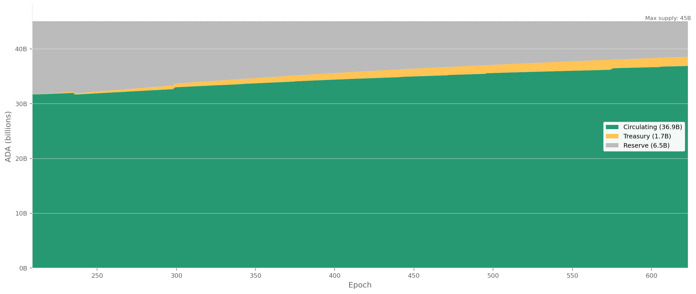

*CEN.2.1 — ADA supply decomposition into circulating, reserve, and treasury across the Shelley era. At epoch 623, circulating supply has reached **36.88B** of the **45B ADA** maximum, with **6.45B** remaining in the reserve and **1.66B** accumulated in the treasury under geometric monetary expansion.*

At epoch 623: **21.755B ADA** staked out of **36.110B** circulating = **60.2%** staking rate. The remaining **14.355B ADA (39.8%)** is not staked.

Of this, only **134.6M (0.37%)** has a registered stake credential without delegation — the *addressable* non-participant pool. The remaining **14.2B** sits in addresses with **no stake credential at all**. This population is decomposed in §5.

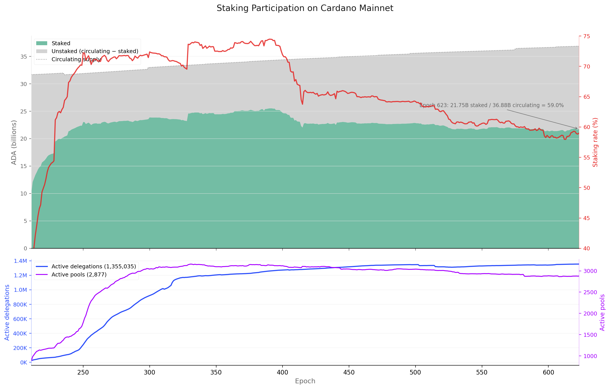

*CEN.2.2 — Staked versus unstaked decomposition of circulating supply with the staking rate (red, right axis). The rate peaked near **71%** around epoch 260 and has drifted to **59%** at epoch 623 — driven by circulating supply growth outpacing new stake inflows.*

The top panel shows the staked/unstaked decomposition of circulating supply with the staking rate (red line, right axis). The rate peaked near **71%** around epoch 260 and has been **declining gently**, driven by circulating supply growth outpacing new stake inflows.

> **Finding CEN.O7.F1 — The staking rate is structurally declining despite persistent net delegator inflows.** The rate has fallen from 71% (epoch ~260) to 59% (epoch 623) — a 12 pp loss over ~360 epochs. The decline is driven entirely by supply-side expansion: circulating ADA grew from ~32B to ~37B while staked ADA grew from ~23B to ~22B. The non-participant pool is growing faster than the staking pool.

# 3. Pool Operators

## 3.1. What the raw db-sync shows — 5,919 pools, most of them empty

The pool count from epoch_stake peaked at **3,160** (epoch 331) and currently stands at **2,877**.

This counts only pools that appear in the staking snapshot with non-zero delegated stake — the registration-certificate count of **5,919** includes **3,042 empty pools** and is discarded (see [§3.2 — the production-threshold cut](#32-three-quarters-of-pools-earn-no-blocks-the-production-threshold-cut) for the full rationale).

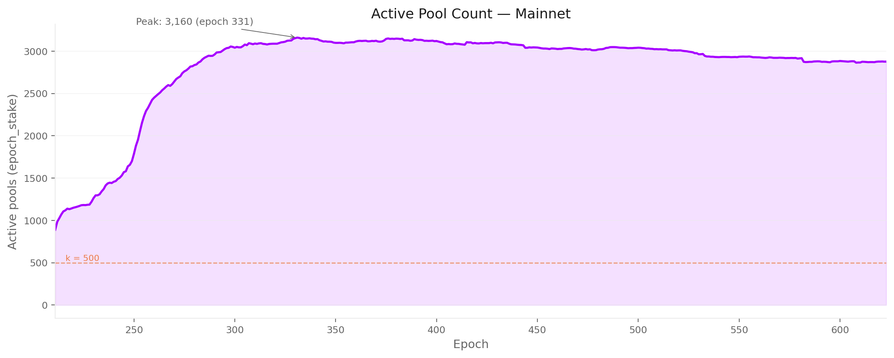

*CEN.3.1 — Productive pool count from `epoch_stake` against the **k = 500** target across the Shelley era. The cleaned count peaked at **3,160** (epoch 331) and currently stands at **2,877** — discarding the **3,042 empty pools** and **2,877 idle registrations** that inflate the raw certificate-based count.*

The **k=500** reference line shows the protocol's target number of pools (the saturation parameter). The actual pool count has been **~5.8× k** since epoch 330, though many of these pools carry **negligible stake**.

## 3.2. Three quarters of pools earn no blocks — the production threshold cut

Block production on Cardano is a **lottery**: each slot, a pool is selected to produce a block with probability proportional to its share of total staked ADA.

With ~21,600 slots per epoch, a pool holding stake σ out of a total S expects to be elected for λ = 21,600 × σ / S blocks per epoch. The number of blocks actually produced follows a **Poisson distribution** with parameter λ.

A pool that expects **fewer than one block per epoch** (λ < 1) is unreliable to the consensus protocol. But even at λ = 1, Poisson variance is severe — there is a **37% chance the pool produces zero blocks in a given epoch** ($P(\text{zero}) = e^{-\lambda}$), so the operator and delegators face a swingy yield. The cleaner threshold is the stake level at which the pool produces ≥1 block in an epoch with **95% probability** — which requires **λ ≥ 3** (since $1 - e^{-3} = 0.95$).

The production threshold therefore corresponds to **λ = 3**: $\sigma_{\min} = 3 \times S / 21{,}600$. This is a **structural property of the protocol** — it follows directly from the number of slots per epoch and the total staked ADA, **not** from any tuneable incentive parameter. (See [POL.O3.F1](../../pools-distribution/mainnet-analysis/README.md#3-mainnet-observations) in the companion *Pools Pot Distribution* report for the full derivation.)

Because $\sigma_{\min}$ scales **linearly with S**, the threshold rises as staking participation grows. At epoch 211 (Shelley launch, S ≈ 10B ADA), $\sigma_{\min}$ ≈ **1.4M ADA**. By epoch 623 (S ≈ 21.75B ADA), it sits at **~3M ADA**.

If total staked ADA continues to increase — whether through higher participation or circulating-supply growth — the threshold will continue to rise, **pushing the minimum reliable pool size upward over time**.

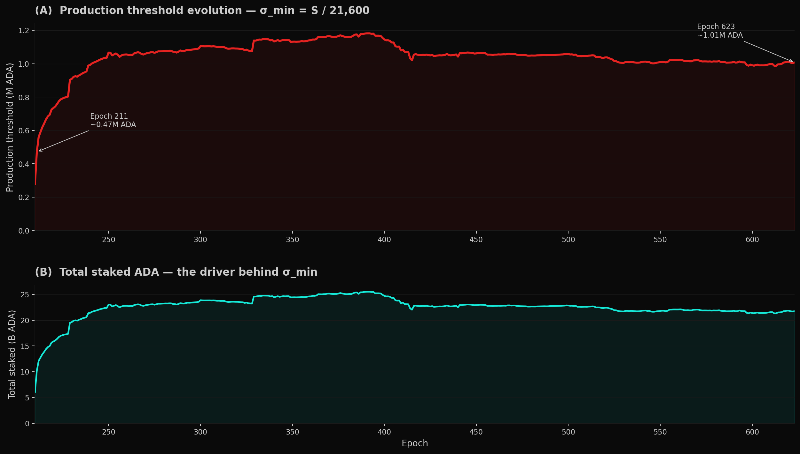

*CEN.3.2 — Production threshold $\sigma_{\min} = 3S/21{,}600$ across the Shelley era. The threshold first crossed **3M ADA** in the early Shelley window once staking participation rose, peaked at **~3.5M ADA** at epoch 391 (when total staked ADA reached **25.5B**), and currently sits at **~3.0M ADA** — a structural property of the slot count, not an incentive parameter.*

The threshold is **bounded by the total ADA supply**. With a maximum supply of 45B ADA, even 100% staking participation would place $\sigma_{\min}$ at **~5–6M ADA** at full dilution.

At the current staking rate of ~60%, $\sigma_{\min}$ sits at roughly **3M ADA** and will rise or fall only if total staked ADA changes.

| Segment | Pools | Share of pools | Stake | Share of stake | Delegations |
|---|---|---|---|---|---|
| **Above threshold (≥3M ADA — productive)** | **733** | **25.5%** | **21.18B** | **97.4%** | **1,227,281 (90.6%)** |
| Sub-reliable tail (1M–3M ADA) | 219 | 7.6% | 0.39B | 1.8% | 67,817 (5.0%) |
| Sub-block tail (< 1M ADA) | 1,925 | 66.9% | 0.19B | 0.9% | 59,937 (4.4%) |

**Roughly three quarters of all pools sit below the production threshold.** Together they hold less than **3%** of staked ADA. Their **127,754 delegators** collectively control ~**580M ADA** — a small share that earns intermittent and unpredictable rewards.

Below-threshold pool breakdown by stake:

| Tier | Pools | Stake |
|---|---|---|
| Sub-block (< 1M ADA) | 1,925 | 0.19B |
| — < 1K ADA | 778 | 0.1M |
| — 1K–10K | 394 | 1.4M |
| — 10K–100K | 323 | 12.4M |
| — 100K–500K | 286 | 69.0M |
| — 500K–1M | 144 | 104.3M |
| Sub-reliable (1M–3M ADA) | 219 | 0.39B |

The median sub-block pool holds just **2,547 ADA**; three quarters hold less than **68K ADA**. The 219 sub-reliable pools (1M–3M) are block-producing in expectation but face Poisson variance too high to drive predictable returns.

**After cleaning:** the productive pool count drops from 2,877 to **733** — slightly above the protocol's $k = 500$ target.

> **Finding CEN.O1.F1 — Three quarters of registered pools are economically irrelevant.** 2,144 of 2,877 (75%) sit below the production threshold (~3M ADA): 1,925 sub-block pools (< 1M) and 219 sub-reliable pools (1M–3M) together hold only **0.58B ADA — 2.7% of staked supply**. The median sub-block pool holds 2,547 ADA, orders of magnitude below the threshold — these are addresses on the registry, not infrastructure operating in production.

## 3.3. Behind the pools — 4 entities on-chain become 85 with off-chain attribution

The **733 productive pools are not 733 single-pool operators**. Many pools share a controlling entity — detectable on-chain through shared `pool_owner` keys, and off-chain through metadata, ticker naming patterns, relay DNS, reward addresses, and public disclosures.

This cleaning pass groups pools by entity to reveal the **true operator landscape**.

**Two layers of attribution.**

| Layer | Signal | Result on the productive set |
|---|---|---|
| **On-chain only** | Shared `pool_owner` keys across productive pools | **4 entities** sharing keys across 8 pools; 943 pools appear as single-pool operators. On-chain keys are a *lower bound* — most multi-pool operators use separate keys per pool, so this layer alone misses the bulk of fleets. |
| **Off-chain layered heuristics** | Public brand declarations (tickers, metadata URLs, websites), relay/metadata clustering (shared IPs, identical hashes, co-located infrastructure), on-chain ownership clusters, and manual resolution from community databases | Across **all registered pools**: **85 named entities** controlling **660 pools**. Combining the two layers is what catches the off-chain fleet structure that on-chain keys alone don't expose. |

> **Finding CEN.O1.F9 — On-chain attribution alone misses the bulk of fleet structure — 4 entities vs 85, a ~20× jump.** The on-chain layer reveals **4 entities sharing keys across 8 pools**; everything else *appears* as single-pool operators. Most multi-pool operators use separate keys per pool, so on-chain ownership clustering catches only the small minority that doesn't separate keys. Any analysis that stops at the on-chain layer treats fleet pools as if they were single-pool operators and materially understates network concentration. The combined-attribution numbers — **85 entities across the registered set, 83 in the productive set** — are the foundational inputs for every entity-level claim downstream.

**Filtering to the 733 productive pools.** From the 85 named entities, 2 disappear entirely (RAID — 7 pools, RockX — 10 pools, all below threshold), and 10 shrink to a single productive pool (reclassified as attributed single-pool operators), leaving **83 attributed entities** controlling **449 productive pools** (16.24B ADA, **76.7% of productive stake**). The remaining **284 productive pools** (4.94B ADA, **23.3%**) are unattributed single-pool operators.

| Segment | Pools | Stake | Share of productive stake |
|---|---|---|---|
| Attributed to named entities | 449 | 16.24B ADA | 76.7% |
| Unattributed (single-pool operators) | 284 | 4.94B ADA | 23.3% |

The productive landscape splits almost evenly by pool count but is **heavily skewed by stake**: attributed entities control **three quarters of productive stake through half the pools**.

> **Finding CEN.O1.F2 — Three quarters of productive stake sits in 83 named entities.** They control 76.7% through **449 productive pools** (71 strict multi-pool fleets + 12 attributed single-pool operators). The 284 unattributed single-pool operators are the numerical majority but hold only **23.3%** of productive stake. The 83-entity count is a *lower bound* — operators running entirely separate infrastructure per pool stay invisible to the attribution pipeline.

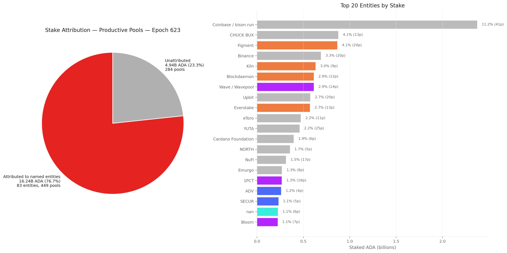

*CEN.3.3 — Productive-pool stake split between attributed entities and unattributed single-pool operators at epoch 623. **83 attributed entities** control **449 productive pools** (76.7% of productive stake) through half the pools; **284 unattributed single-pool operators** are the numerical majority but hold only a quarter.*

The entity attribution data lives in:
- [`data/mpo_entity_pool_mapping_mainnet.csv`](data/mpo_entity_pool_mapping_mainnet.csv) — pool → entity
- [`data/mpo_entity_archetypes.csv`](data/mpo_entity_archetypes.csv) — entity → archetype
- [`data/entity_stake_summary_623.csv`](data/entity_stake_summary_623.csv) — per-entity stake at epoch 623
- [`docs/mpo_entity_profiles.md`](docs/mpo_entity_profiles.md) — detailed entity profiles

## 3.4. The productive operator landscape — 733 pools, 367 entities, 21.18B ADA at stake

All figures and tables in this section refer to **productive pools only** — the **733 pools** above the production threshold at epoch 623, carrying **97.4% of staked ADA**. The 1,925 sub-threshold pools (0.9% of stake) are excluded.

### 3.4.1. The headline picture at epoch 623

> **n-MPO is counted on productive pools only.** An entity is **strict multi-pool** when it controls **≥ 2 productive pools** (≥ 3M ADA each). An entity that owns several pools but has **only one productive pool** — even if its nominal fleet is large — is classified as an **attributed single-pool operator**, because the rest of the fleet sits below the production threshold and is economically inactive. This split is what gives 71 + 12 = 83 attributed entities, not 83 multi-pool operators.

| Segment | Entities | Pools | Stake | Share |
|---|---|---|---|---|
| **Productive total** | **367** | **733** | **21.18B** | **100%** |
| _of which:_ | | | | |
| Identified entities | 83 | 449 | 16.24B | 76.7% |
| — strict multi-pool (n-MPO ≥ 2 productive pools) | 71 | 437 | 15.69B | 74.1% |
| — attributed single-pool (n-MPO = 1, even when more pools are owned but sub-threshold) | 12 | 12 | 0.55B | 2.6% |
| Unattributed single-pool operators | 284 | 284 | 4.94B | 23.3% |

The 12 attributed single-pool entities collectively own **58 pools**, but only **12 of those are productive**; the remaining **46 sit below 3M ADA**. The most extreme case is **IOG itself**: 34 owned pools at epoch 623, only **1 productive**. These entities look like multi-pool fleets on paper but contribute only one productive pool each to the network, so they fall in the same productive-set bucket as a pure single-pool operator (see [`data/mpo_attributed_single_pool_detail.csv`](data/mpo_attributed_single_pool_detail.csv) for the full list).

The entity attribution is a **current-epoch snapshot** and a **lower bound** — entities using entirely separate infrastructure and branding for each pool remain invisible. The real strict multi-pool count is **certainly higher than 71** (and the attributed-entity total higher than 83).

### 3.4.2. The shape of the multi-pool fleet — 12 entities run 41% of the productive stake

The **83 identified entities** are now bucketed by **n-MPO — the count of productive pools they control** (not the count of pools they own on paper). On this basis, the productive set covers **449 pools** spread across fleet sizes from 1 to 41.

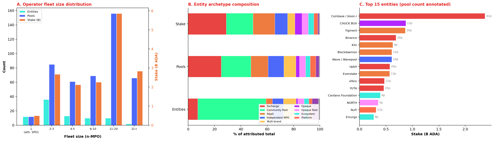

*CEN.3.4 — Multi-pool operator fleet-size distribution and entity archetype composition at epoch 623, counted on productive pools only. Fleet size is heavy-tailed: **12 entities with 11+ productive pools** control **41.0%** of productive stake; CEX and IVaaS together — 10 entities — capture **45.4%** of attributed stake at structurally zero pledge.*

**Fleet size distribution** (panel A):

| Fleet size (n-MPO, productive pools only) | Entities | Productive pools | Stake (B) | % of productive |
|---|---:|---:|---:|---:|
| 1 (attributed single-pool operator) | 12 | 12 | 0.50 | 2.4% |
| 2–3 | 36 | 85 | 2.67 | 12.6% |
| 4–5 | 13 | 61 | 2.12 | 10.0% |
| 6–10 | 10 | 69 | 2.26 | 10.7% |
| 11–20 | 10 | 156 | 5.86 | 27.7% |
| 21+ | 2 | 66 | 2.83 | 13.4% |
| **Total attributed** | **83** | **449** | **16.24** | **76.7%** |

The first row of the table covers the **attributed single-pool operators**: entities whose nominal fleet may be larger but whose productive footprint is exactly one pool. They are **not strict multi-pool operators** — even though some of them own dozens of pools — because the rest of those pools sit below the production threshold and produce no blocks. **IOG itself sits in this bucket**: 34 pools owned, 1 productive.

The **2–3 pool tier** is the most populated (36 entities) but each tier above it controls **more aggregate stake despite fewer entities**.

Two entities alone — **Coinbase (41 productive pools) and YUTA (25)** — operate **66 productive pools** and hold **2.83B ADA (13.4%)** of productive stake. Binance, which would have placed a third entity in the 21+ tier under an "owned pools" count, sits in the 11–20 tier on a productive-pool count.

> **Finding CEN.O1.F4 — Concentration is heavy-tailed: 12 entities run 41% of productive stake.** Counted on *productive* pools only, 12 entities with 11+ productive pools hold **8.69B / 21.18B = 41.0%** of productive stake. The mid-range (2–10 productive pools, 59 entities) is the numerical majority but its aggregate weight (33.3%) is smaller than the concentrated top. Stake scales super-linearly with fleet size — a 21+ productive-pool entity holds on average 1.42B; a 2–3 productive-pool entity holds 0.07B.

**Entity archetype composition** (panel B). Exchanges (**CEX**: 6 entities, 119 pools, 4.71B) and institutional validators (**IVaaS**: 4 entities, 62 pools, 2.69B) together account for **10 entities** but **45.4%** of attributed stake.

Community-branded fleets (**43 entities**, 3.30B) are the most numerous archetype but hold **less stake than the exchange tier alone**. The remaining archetypes — independent MPOs, multi-brand fleets, opaque entities, ecosystem actors, and platforms — fill the long tail.

> **Finding CEN.O1.F5 — Custodial dominance sets a structural pledge floor.** CEX + IVaaS together — **10 entities, 181 pools, 7.40B ADA, 34.3% of productive stake** — operate at zero pledge by *architectural* constraint: their delegation source is custodied retail balances and institutional client assets, which cannot legally be pledged by the operator. Their dominance sets a floor on how much of the stake landscape is unreachable by pledge-based incentive mechanisms.

### 3.4.3. What the productive total looked like before the threshold cut

The production threshold — the stake at which a pool produces a block with **95% probability** in a given epoch (λ ≥ 3) — **rises mechanically with total staked ADA**. At epoch 211 (Shelley launch, S ≈ 10B ADA), σ_min ≈ **1.4M ADA**; by epoch 623 (S ≈ 21.75B ADA) it sits at **~3M ADA**.

The number of pools clearing this rising threshold has remained **remarkably stable in the 700–1,000 band** since epoch 300 — historical figures use the time-varying threshold, while the canonical epoch-623 productive set is **733 pools**. The sub-threshold tail grew from near zero to over **2,000 pools** by epoch 330 and has hovered there since.

The productive share of pools has therefore fallen from **near 100%** in early Shelley to roughly **25%** today — yet productive pools continue to control **over 97%** of staked ADA throughout the entire history.

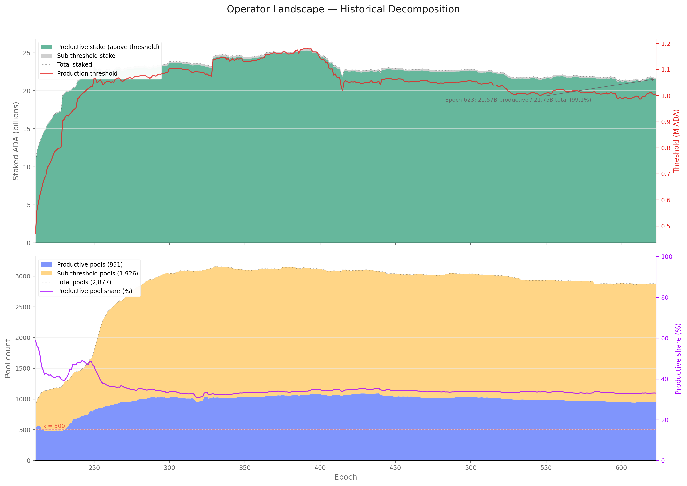

*CEN.3.5 — Productive versus sub-threshold pools across the Shelley era — by stake (top) and pool count (bottom). The productive pool count has held at **~900–1,000** since epoch 300 while the sub-threshold tail grew to nearly **2,000**; productive pools nonetheless retain over **99%** of staked ADA throughout.*

The top panel shows the staked-ADA split between productive and sub-threshold pools (left axis) alongside the production threshold itself (red line, right axis).

The bottom panel shows the pool-count decomposition, with the productive share (purple line, right axis) declining as the long tail of sub-threshold pools **inflated the denominator without capturing meaningful stake**. The **k=500** reference line marks the protocol's target pool count.

## 3.5. The market has crystallised — replacement, not growth

The near-constant stock of productive pools (a **700–1,000 historical band**, **733 at epoch 623**) masks significant underlying churn. This section decomposes the aggregate into three views:

- **the entry/exit flow**;
- **the entity-level lifecycle** that drives it;
- **the stake variability** that pools experience even while they remain in the productive set.

### 3.5.1. Pool entries and exits — turnover sustains the stock, not growth

Tracking individual pools across consecutive epochs — counting those that cross the production threshold upward (**entries**) and those that fall below it or disappear (**exits**) — reveals the turnover that the aggregate count obscures.

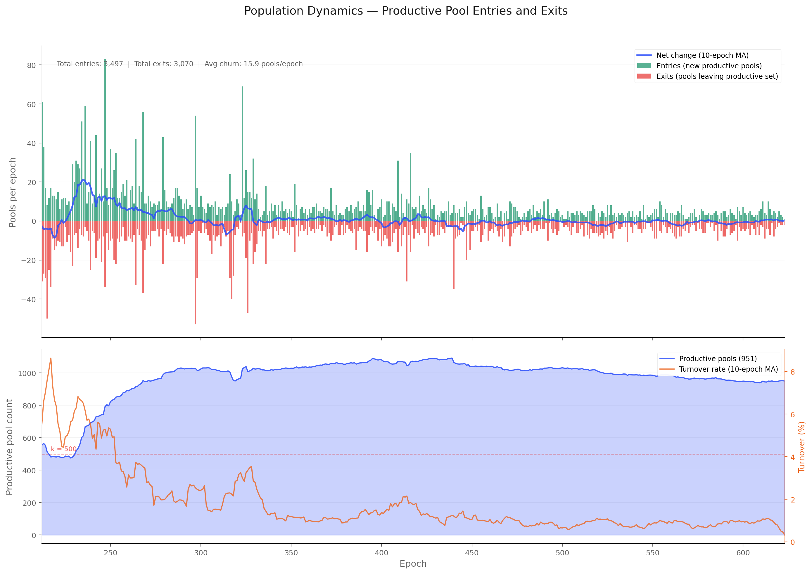

*CEN.3.6 — Productive-pool entries and exits per epoch across the Shelley era. The ~700–1,000-pool quasi-equilibrium since epoch 300 conceals **3,497 entries** against **3,070 exits** with an average churn of **~15.9 pools per epoch** — a **1.7%** turnover rate driven by fragility near the production threshold.*

The early Shelley period (epochs 212–300) saw **rapid net growth** as the pool population expanded from **~450 to ~1,000** productive pools. Growth epochs outnumbered decline epochs roughly **2∶1** during this phase.

From epoch 300 onward, the productive population stabilised: net changes per epoch fluctuate around zero, with growth and decline epochs occurring in roughly equal proportion. Over the full history (epochs 212–623), the productive set gained a **net +427 pools** — but the near-flat trajectory since epoch 300 means the **overwhelming majority** of that net gain occurred in the first 90 epochs.

The stability of the stock alongside non-trivial per-epoch fluctuation implies a **quasi-equilibrium**: pools that exit the productive set (falling below the rising threshold, retiring, or losing delegation) are replaced at roughly the same rate by new entrants or returning pools.

Tracking individual pool presence per epoch (`05_pool_population_dynamics.sql`) confirms this: over the full history the productive set recorded **3,497 entries** against **3,070 exits**, with an **average churn of ~15.9 pools per epoch**. The turnover rate (entries + exits as a share of the productive population) averages around **1.7% per epoch** — higher than the delegator-side turnover of **~0.5%**, reflecting the **greater fragility of pool economics near the production threshold**.

> **Finding CEN.O1.F3 — The pool count flat-lined since epoch 300; the equilibrium is replacement, not growth.** Across the post-300 window, the productive count tracks a **700–1,000 band** as the threshold rises with total stake — landing at **733 pools at epoch 623**. **3,497 entries balance against 3,070 exits** (~15.9 pools per epoch, 1.7% turnover). The apparent stability of the aggregate conceals a continuous replacement process: pools that fall below the rising threshold or retire are substituted at roughly the same rate by new entrants — but the *composition* shifts in favour of entity-operated pools (see CEN.O1.F6/F7).

### 3.5.2. How entities are born, grow, and exit — the lifecycle of the 85 attributed players

Part of the churn is driven by **entity-level dynamics**. The entity lifecycle analysis ([`data/entity_lifecycle_623.csv`](data/entity_lifecycle_623.csv)) classifies the 85 named entities into four phases — **dead, declining, stable, and growing** — based on their stake trajectory and productive-pool retention.

Declining and dead entities contract their pool fleets, **feeding the exit side**; growing entities and new single-pool operators **feed the entry side**. The entity-level decline trajectories are visualised in the figures below.

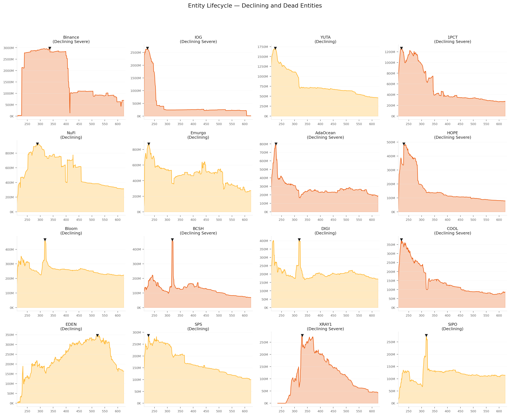

*CEN.3.7 — Stake and pool-count trajectories of declining and dead entities. These entities contract their fleets and feed the exit side of the productive-pool churn, accounting for a meaningful share of the **3,070 cumulative exits** observed across the Shelley era.*

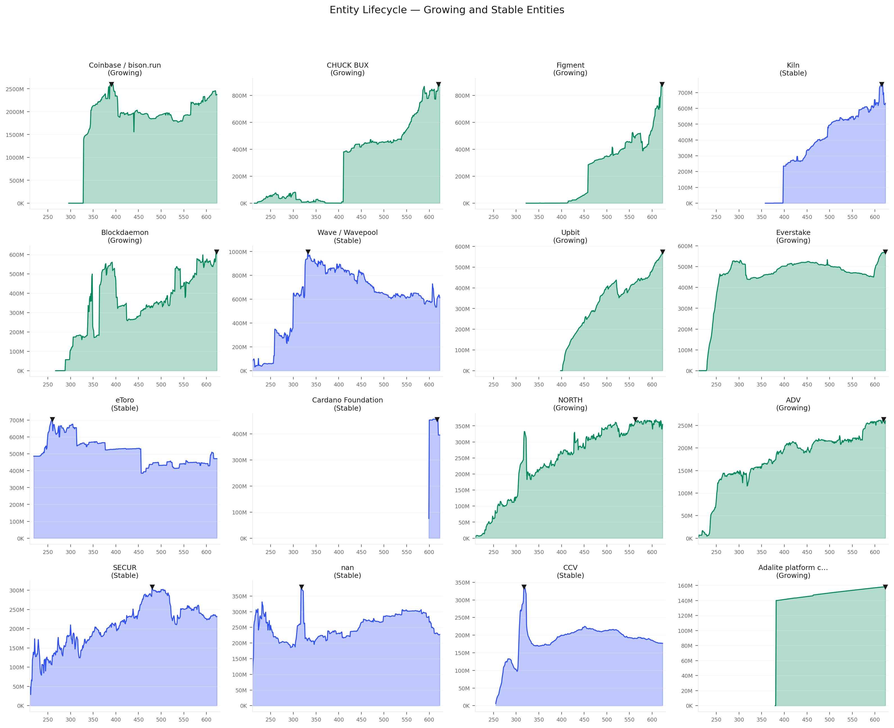

*CEN.3.8 — Stake and pool-count trajectories of growing entities. These entities feed the entry side of the productive-pool churn — partly offsetting the contraction of declining and dead entities tracked in the prior figure.*

### 3.5.3. Who actually holds the productive set today — and who used to

The entries-and-exits view ([Entries and exits](#351-pool-entries-and-exits-turnover-sustains-the-stock-not-growth)) treats the productive pool set as a **homogeneous stock**. This section decomposes it into two populations — pools operated by **identified multi-pool entities** and **single-pool operators** — and tracks each cohort's pool count and stake share across the full history.

The underlying data is in [`data/cohort_population_dynamics.csv`](data/cohort_population_dynamics.csv), derived by subtracting the per-epoch entity aggregate ([`data/entity_stake_history.csv`](data/entity_stake_history.csv)) from the productive totals in [`data/operator_landscape_history.csv`](data/operator_landscape_history.csv).

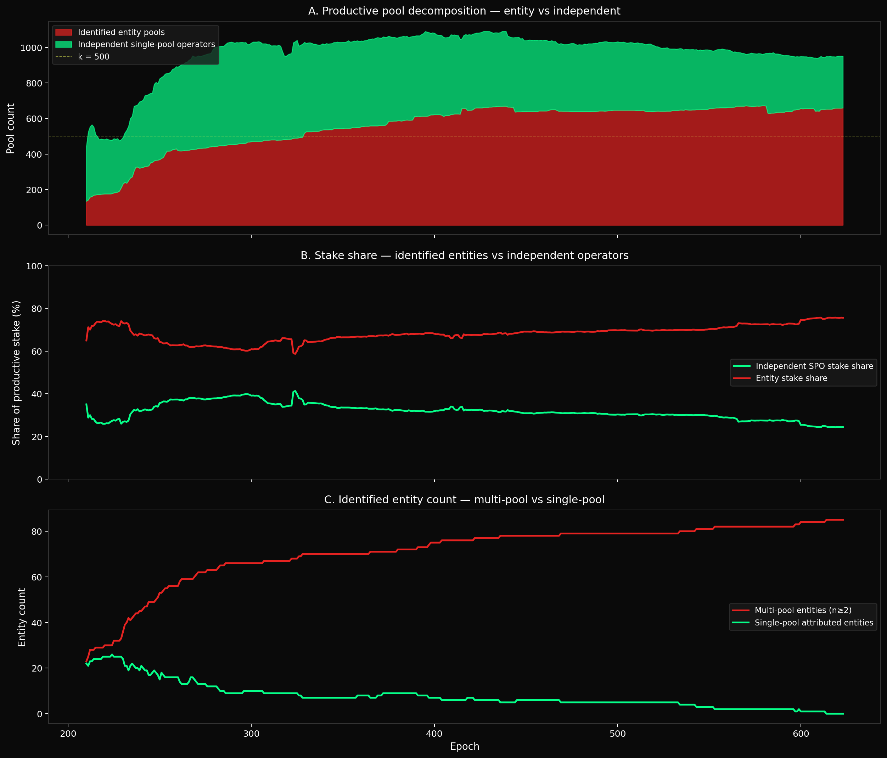

*CEN.3.9 — Productive-pool cohort decomposition into single-pool operators versus multi-pool entities across the Shelley era. The single-pool cohort peaked at **555 pools (39.1%** of stake) at epoch 300 and has contracted to **291 pools (24.4%)** — a **48% loss in pool count and 15pp loss in stake share**.*

**The single-pool operator segment is in structural decline.**

The independent population peaked at **555 pools** and **39.1%** of productive stake around epoch 300 — the end of the Shelley expansion phase. Since then it has **contracted in every period**:

| Period | Epochs | Independent pools | Stake share | Change |
|---|---|---|---|---|
| Shelley expansion | 250–300 | 455 → 555 | 35.6% → 39.1% | +100 pools, +3.5pp |
| Early maturity | 300–400 | 555 → 459 | 39.1% → 31.9% | −96 pools, −7.3pp |
| Mid maturity | 400–500 | 459 → 385 | 31.9% → 30.3% | −74 pools, −1.6pp |
| Recent | 500–623 | 385 → 291 | 30.3% → 24.4% | −94 pools, −5.9pp |

The contraction **accelerated in the recent period**: **94 pools lost in 123 epochs**, with the stake share dropping **below 25% for the first time**. The independent population has lost **nearly half its pool count** (555 → 291) and **nearly 15 percentage points** of stake share since its peak.

> **Finding CEN.O1.F6 — Independent operators are losing the field — 48% pool-count loss in 323 epochs.** The single-pool population peaked at **555 pools / 39.1% of productive stake** at epoch 300 and has contracted to **291 pools / 24.4%** at epoch 623 — a **48% loss in pool count and 15pp loss in stake share**. The contraction is continuous and has accelerated most recently (epochs 500–623). The quasi-equilibrium of [Entries and exits](#351-pool-entries-and-exits-turnover-sustains-the-stock-not-growth) masks a composition shift: the replacement pools that maintain the productive total are increasingly entity-operated, not independent.

**Identified entities expanded steadily.**

The number of multi-pool entities (n-MPO ≥ 2) grew from **23 at Shelley launch** to **85 at epoch 623**. Their pool count rose from **135 to 660**, and their stake share from **65% to 75.6%** of productive stake.

The expansion was **not driven by a few large entrants** — the fleet-size distribution shifted across all tiers:

| Fleet size | Epoch 300 | Epoch 623 |
|---|---|---|
| 2–3 pools | 29 entities (12.4%) | 36 entities (14.2%) |
| 4–5 pools | 17 entities (15.9%) | 16 entities (13.5%) |
| 6–10 pools | 11 entities (11.0%) | 18 entities (13.2%) |
| 11–20 pools | 3 entities (12.8%) | 9 entities (30.3%) |
| 21+ pools | 6 entities (46.4%) | 6 entities (28.8%) |

The most striking shift is in the **11–20 pool tier**: from **3 entities holding 12.8%** of entity stake to **9 entities holding 30.3%**.

The 21+ tier declined in share (46.4% → 28.8%) as IOG and Binance contracted, but the **mid-tier fleets (6–20 pools) absorbed the gap**.

*Entity power is not merely growing — it is spreading across a broader fleet-size distribution.*

> **Finding CEN.O1.F7 — Multi-pool entities absorbed the contraction and then some — fleet count nearly quadrupled.** From **23 entities / 135 pools / 65% of stake** at Shelley launch to **85 / 660 / 75.6%** at epoch 623. The mid-tier fleets (6–20 pools) tripled their entity count and nearly doubled their stake share — *entity power is not merely growing, it is spreading across a broader fleet-size distribution*. The ~700–1,000-pool quasi-equilibrium is increasingly populated by entity-operated pools substituting for departing independents.

### 3.5.4. The independent operator pipeline has no observable expression in the data

The Cardano reward mechanism was designed to produce a **progression path for operators**: entry with an initial pledge, delegation-driven growth, and eventually full commitment as an established pool ([*The Intended Game* §3.2](../../../../the-intended-game/README.md#32-operators-from-first-pledge-to-full-commitment)).

The single-pool operator segment is the population where this trajectory **should** be observable — small operators entering, building reputation, attracting delegation, and graduating into established entities.

**The data shows the opposite.** The independent population contracted from **555 to 291 pools** while its stake share fell from **39.1% to 24.4%**.

The entity lifecycle analysis ([Entity lifecycle](#352-how-entities-are-born-grow-and-exit-the-lifecycle-of-the-85-attributed-players), [companion document](entity-lifecycle/README.md)) tracks where the capital went: toward **late institutional entrants** (IVaaS), **exchanges holding ground**, and a handful of **community operators that grew against the tide**. It did **not** flow toward a cohort of single-pool operators graduating into established entities.

The census cannot track individual single-pool operators over time (they are unattributed by definition), but the aggregate trajectory is unambiguous: *the independent segment is shrinking, not graduating.*

The absence of evidence for the designed growth path is **itself diagnostic**. If the mechanism were producing the intended progression — small operators growing into established ones — the independent segment would show either **stable pool count** (graduates replaced by new entrants) or **growing stake share** (successful operators attracting more delegation).

**It shows neither.** The pool count is falling and the stake share is falling faster, which means the independents that remain are also **losing average delegation**. The replacement process that maintains the productive total is driven by **entity fleet expansion**, not by new independent entrants.

> **Finding CEN.O1.F8 — The mechanism's designed progression path is invisible in the data.** Entry → growth → established was supposed to feed the independent segment; instead it is contracting in both pool count and stake share, while the replacement pools that sustain the productive total are entity-operated. The growth path described in the formal design ([*The Intended Game* §3.2](../../../../the-intended-game/README.md#32-operators-from-first-pledge-to-full-commitment)) exists as a theoretical property of the intended equilibrium but not as an empirical feature of the observed one.

## 3.6. A pool's stake stability is segment-driven, not random

The entry/exit analysis tracks whether a pool is *in* the productive set; this section asks **how much its stake fluctuates while it stays there**.

A pool that survives all **73 epochs** of the last year (epochs 551–623) may nonetheless experience **large swings in delegation**, with consequences for block production regularity and operator revenue predictability.

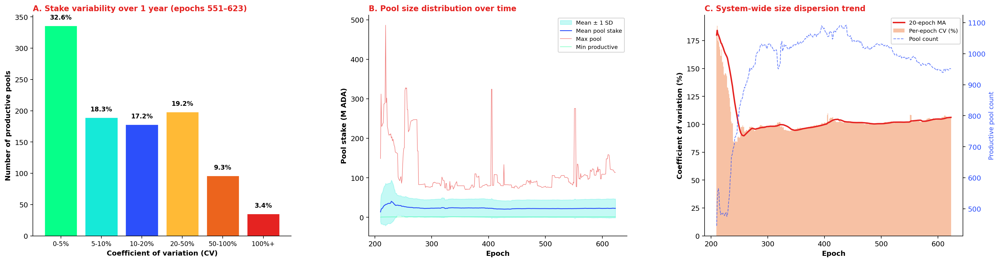

*CEN.3.10 — Pool-stake variability over the trailing 73 epochs. Roughly **half** the productive set has CV under **10%**; **9.3%** of pools sit between 50–100% CV and **3.4%** exceed 100%. System-wide cross-sectional CV has compressed from **>180%** in early Shelley to **~105%** since epoch 500.*

**Most productive pools are remarkably stable.** Of the **1,032 pools** present in at least 10 of the last 73 epochs and above the production threshold, roughly a third (**32.6%**) have a coefficient of variation (CV) of **5% or less** — their stake barely moves from epoch to epoch.

Another **18.3%** sit in the 5–10% band. Together, **half the productive set** operates with stake fluctuations under 10% over a full year.

**A long tail of volatile pools exists.** At the other extreme, **9.3%** of productive pools have CV between 50% and 100%, and **3.4%** exceed 100% — meaning their standard deviation is **larger than their mean stake**.

These are typically pools near the production threshold that **oscillate in and out of viability**, or pools that experienced a single large delegation event (arrival or departure of a whale) that dominates their variance.

**System-wide dispersion has compressed over time.** Panel C shows the cross-sectional CV of pool stakes across all productive pools at each epoch.

In the early Shelley era (epochs 210–260), the CV exceeded **180%** — a handful of very large pools coexisted with hundreds of small entrants, producing **extreme size dispersion**.

As the pool population matured and the largest pools approached the saturation cap (~70.8M ADA at k=500), the CV declined steadily to **~105%** by epoch 500 and has since plateaued. The remaining dispersion reflects the structural range between pools near the production threshold (~3M ADA) and the largest pools near saturation (~114M ADA) — a **100× ratio** that the protocol's incentive design deliberately permits.

**Variability differs across market segments.** Crossing the per-pool coefficient of variation with the custodial taxonomy from the companion [*Operator's Cut*](../../operator-delegator-distribution/mainnet-analysis/)  reveals that **not all segments fluctuate equally**.

The custodial classification uses the per-pool **median delegation** from db-sync `epoch_stake` — the amount held by the typical delegator in each pool — rather than the mean ADA per delegation, which is inflated by whale addresses by a factor of **50–300,000×** (see the companion [*Operator's Cut*](../../operator-delegator-distribution/mainnet-analysis/) for the methodology and rationale).

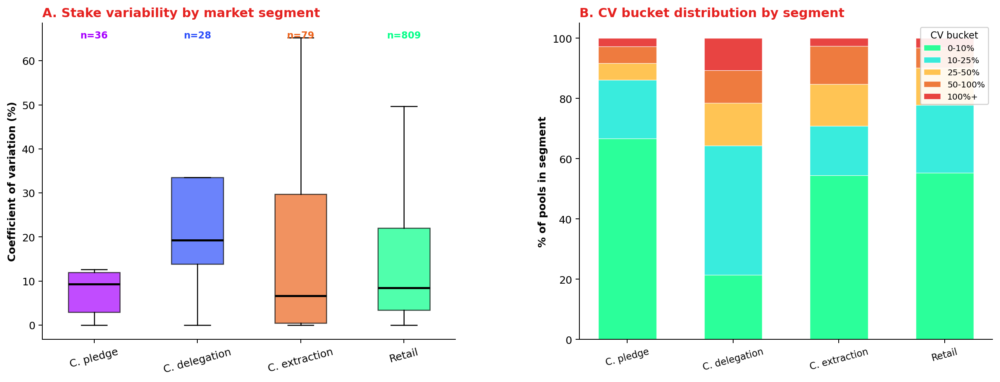

*CEN.3.11 — Pool-stake coefficient of variation by custodial segment. Custodial-by-delegation pools are most volatile (median **19.3%**, mean **43.0%**), retail sits at **8.4%** median, custodial-by-pledge at **9.3%**, and custodial-by-extraction at **6.6%** — stagnation, not active management, keeps the latter steady.*

**Custodial-by-delegation** pools (28 pools where the median delegation exceeds 100K ₳) are the **most volatile**: median coefficient of variation of **19.3%**, mean **43.0%**, and **21% exceed 50%**. These are pools dominated by **whale self-delegation** — a single address moving capital in or out produces large proportional swings.

By contrast, **custodial-by-pledge** pools (36 private, self-funded pools) sit at a median coefficient of variation of **9.3%** — the operator controls the capital and has little reason to move it, with 67% below 10%.

**Custodial-by-extraction** pools (79 pools with ≥ 99% margin) sit at **6.6% median**, with 54% below 10% — consistent with pools whose delegators are **locked in by inertia or institutional constraint**.

The **retail market** (809 pools, median delegation below 100K ₳) lands at a median coefficient of variation of **8.4%**, with 55% of pools below 10%. This segment includes the large institutional operators (Coinbase, Binance, Kiln, YUTA) whose pools have high mean ADA per delegation but **low median delegation** — the majority of their delegators are small retail wallets.

The **10% tail above 50%** in the retail segment captures pools that gained or lost a whale delegator — a single large address arriving or leaving a pool with hundreds of small delegators.

> **Finding CEN.O2.F1 — When a Titan delegator switches pools, the whole pool moves with them — whale-funded pools swing ~±20% between epochs vs ±8% for retail.** In **28 custodial-by-delegation pools** (where the typical delegator holds ≥ 100K ₳), stake swings by roughly **±20% between epochs**, and **21% of them swing more than 50%** — a single Titan-tier address (10M+ ₳) is large enough that its in/out movement dominates the pool's variance, leaving the operator with unpredictable revenue and the remaining delegators with a wobbly block-production rhythm. **Retail** pools (809, broad small-delegator base) are mostly stable at **±8%** between epochs — no single delegator is large enough to move the pool — but a 10% tail above 50% shows that even retail pools are vulnerable to single-whale shocks. **Custodial-by-extraction** (79 pools, ≥ 99% margin) barely budge (**±7%** between epochs, 54% below 10%) — stagnation, not active management, keeps their stake steady (delegators are locked in by inertia or institutional constraint). The technical metric used is the per-pool **coefficient of variation** (standard deviation / mean) over the trailing 73 epochs — see [§3.6](#36-a-pools-stake-stability-is-segment-driven-not-random) for methodology.

**Implications for delegators.** A pool's stake stability matters because it affects **block-production regularity** and, by extension, the **consistency of epoch rewards**.

Delegators in low-CV pools experience **smoother returns**; those in high-CV pools face **more variance**. The data in `data/pool_size_variability.csv` provides per-pool CV, min, max, and range for further analysis; `data/pool_cv_by_segment.csv` gives the segment-level aggregate.

# 4. Delegators

## 4.1. What the raw db-sync shows — 1.85M certificates, half of them ghosts

Two db-sync tables count delegators in different ways:

| Source | What it counts | Epoch 623 value |
|---|---|---|
| `epoch_stake` aggregation | Rows with non-zero stake in the epoch snapshot | **1,355,035 delegations** across **2,877 pools** |
| `delegation` table reconstruction | Active delegation certificates (regardless of balance) | **1,847,713 addresses** across **5,919 pools** |

The gap: **~493K addresses** hold an active delegation certificate but have **zero balance** in the epoch_stake snapshot. Similarly, **~3,042 registered pools** have delegation certificates pointing at them but carry **no actual stake**.

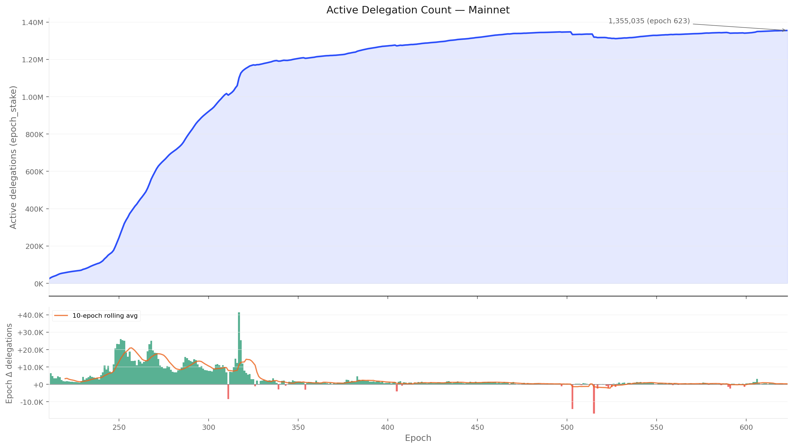

*CEN.4.1 — Raw versus cleaned delegator count across the Shelley era. The raw delegation table records **1,847,713 addresses** and **5,919 pools**, but **~493K certificates** are zero-balance "ghosts" and **3,042 pools** carry no actual stake; cleaning yields **1,355,035 active delegations** across **2,877 pools**.*

## 4.2. Removing the ghosts — certificates without ADA aren't delegators

A delegation certificate is a *declaration of intent*: it records on-chain that an address wishes to delegate to a given pool, but it **does not lock any funds**. The ADA remains freely spendable.

An epoch_stake row, by contrast, is *capital at work* — it reflects the actual balance present at the snapshot boundary. An address with a certificate but **no ADA earns no rewards** and does not participate in consensus.

The gap between the two views arises because delegation certificates are **never automatically revoked**. When an address is emptied — typically because the holder transferred funds to an exchange, moved to another wallet, or simply stopped using Cardano — the certificate persists as a **residual record** pointing at a pool with zero backing stake. These orphaned records are the **"certificate ghosts"** removed in this step.

| Metric | Raw (delegation table) | Clean (epoch_stake) | Noise removed |
|---|---|---|---|
| Active delegations | 1,847,713 | **1,355,035** | 492,678 certificate ghosts (26.7%) |
| Active pools | 5,919 | **2,877** | 3,042 empty pools (51.4%) |

**After cleaning:** 1,355,035 delegations, 21.75B ADA across 2,877 pools.

## 4.3. Removing delegations to dead pools — the active set the mechanism actually rewards

The **1,925 pools** below the production threshold ([The structural floor](../../../README.md#12411-the-structural-floor)) carry **59,937 delegations** and **0.19B ADA**. These delegators earn **intermittent and unpredictable rewards**. Removing them aligns the delegator population with the productive operator landscape.

**After cleaning:** 1,227,281 delegations, 21.18B ADA across 733 productive pools.

## 4.4. The productive delegator landscape — 1.355M delegations, 21.18B ADA, Gini 0.976

### 4.4.1. The headline picture at epoch 623

After the two cleaning passes ([§4.2](#42-removing-the-ghosts-certificates-without-ada-arent-delegators) and [§4.3](#43-removing-delegations-to-dead-pools-the-active-set-the-mechanism-actually-rewards)), the delegator population at epoch 623 is:

| Segment | Delegations | Stake | Share | Pools | Entities |
|---|---|---|---|---|---|
| **Raw (delegation certificates)** | **1,847,713** | — | — | **3,190** | **2,374** |
| Zero-balance certificates (noise) | 492,678 | 0 | — | 313 | 72 |
| **epoch_stake total** | **1,355,035** | **21.75B** | **100%** | **2,877** | **2,302** |
| Sub-reliable pool delegations (1M–3M, noise) | 67,817 | 0.39B | 1.8% | 219 | 215 |
| Sub-block pool delegations (< 1M, noise) | 59,937 | 0.19B | 0.9% | 1,925 | 1,742 |
| **Productive pool delegations (≥ 3M)** | **1,227,281** | **21.18B** | **97.4%** | **733** | **367** |

The **1,227,281 productive pool delegations** are the cleaned population handed to the companion [*Operator's Cut*](../../operator-delegator-distribution/mainnet-analysis/) analysis, which decomposes them further into **operator self-stake, custodial, and retail segments**.

### 4.4.2. Half the delegator base stakes less than a transaction fee — the wealth is in the top 0.07%

The **1.36M delegations** carry **21.75B ADA** — but the distribution across individual delegations is **extremely unequal**.

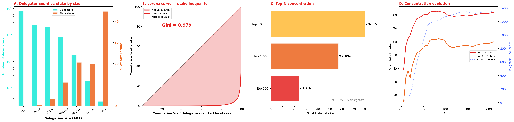

*CEN.4.2 — Delegator stake distribution at epoch 623 with the Lorenz curve. The bottom **59.1%** of delegators (under 100 ADA) collectively hold **0.05%** of stake; the top **318 delegators (0.02%)** hold **44.8%**. Gini coefficient: **0.976**.*

**Size buckets:**

| Size cohort | Delegators | % of delegators | Stake (ADA) | % of stake | Mean (ADA) |
|---|---:|---:|---:|---:|---:|
| < 100 | 801,067 | 59.1% | 11.2M | 0.05% | 14 |
| 100 – 1K | 249,181 | 18.4% | 94.2M | 0.43% | 378 |
| 1K – 10K | 201,797 | 14.9% | 679.0M | 3.12% | 3,365 |
| 10K – 100K | 83,307 | 6.1% | 2.43B | 11.18% | 29,188 |
| 100K – 1M | 17,439 | 1.3% | 4.49B | 20.63% | 257,327 |
| 1M – 10M | 1,926 | 0.14% | 4.31B | 19.80% | 2.24M |
| 10M+ | 318 | 0.02% | 9.75B | 44.80% | 30.6M |

The bottom **59.1%** of delegators (under 100 ADA) collectively hold **0.05%** of stake — **less than any single delegation in the top tier**. The top **318 delegators (0.02%)** hold **44.8%** of all staked ADA.

> **Finding CEN.O3.F1 — Half the delegator base stakes less than a single transaction fee at peak congestion.** **Median: 32 ADA. Mean: 16,055 ADA.** The 500× gap measures the skewness of a power-law distribution — each tier above 10K ADA holds roughly 20% of total stake despite containing exponentially fewer delegators. Below 100 ADA: 801,067 delegators (59.1% of population) holding 0.05% of stake; above 10M: 318 delegators (0.02%) holding 44.8%.

**Concentration metrics:**

| Metric | Value |
|---|---:|
| Gini coefficient | 0.976 |
| Top 100 delegators → % of stake | 23.7% |
| Top 1,000 → % of stake | 57.0% |
| Top 10,000 → % of stake | 79.2% |
| Median | 32 ADA |
| P90 | 5,866 ADA |
| P99 | 142,775 ADA |

The Lorenz curve (panel B) is **nearly flat until the last few percent of delegators**, then rises steeply — the classic signature of **extreme concentration**.

At **Gini = 0.976**, the Cardano staking distribution is **more concentrated than the US wealth distribution** (~0.85) and comparable to the most unequal asset distributions observed in financial markets.

> **Finding CEN.O3.F2 — The delegator population's stake is concentrated in its top 0.07%.** Of the **1.36M active delegators**, just **1,000** (0.07%) hold **57%** of staked ADA; the top **10,000** (0.74%) hold **79.2%**. Gini = **0.976** — more concentrated than US wealth (~0.85) and comparable to the most unequal asset distributions observed in financial markets. The identity of those top few thousand addresses (individual whale, exchange hot wallet, institutional custodian) determines whether the population's aggregate delegation signal reflects genuine preference or operational logistics.

### 4.4.3. Concentration crystallised by epoch 300 — 9× growth in delegators, no change in the top-1%

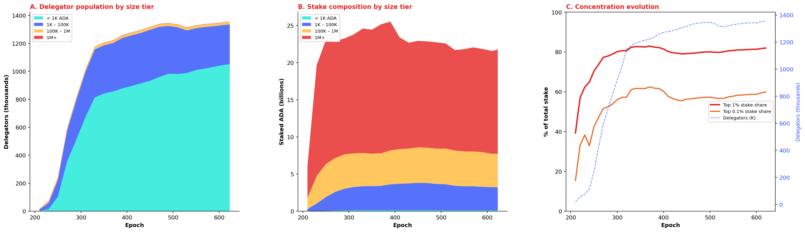

*CEN.4.3 — Delegator population growth, stake composition, and concentration evolution from Shelley launch to epoch 623. The micro-delegator tier absorbs **96%** of new entrants; the top-1% share rose to **78–82%** by epoch 280 and has held there despite a **9×** increase in delegator count.*

The three panels trace how the delegator population, its stake composition, and its concentration structure evolved from Shelley launch (epoch 210) to epoch 623.

**Panel A — Population growth by size tier.** The delegator count grew from **17K** (epoch 210) to **1.36M** (epoch 623). Virtually all growth comes from the **micro-delegator tier** (< 1K ADA, cyan): this tier expanded from ~1,500 to ~1.05M, **absorbing 96% of new entrants**.

The 1K–100K tier grew from ~10K to ~285K. The 100K–1M tier plateaued around 17K, and the 1M+ tier barely moved — from ~1,100 at launch to ~2,200 today.

**Panel B — Stake composition by size tier.** In contrast to population, the stake is **dominated by the 1M+ tier** (red), which holds **14.1B ADA** — **65%** of total staked ADA — in just **2,244 addresses**.

This tier reached its current level by epoch ~260 and has **fluctuated within a narrow band since**. The 100K–1M tier (gold) contributes 4.5B, the 1K–100K tier (blue) adds 3.1B, and the <1K tier — despite being **77% of the population** — carries just **0.1B (0.5%)**. Stake composition has been **essentially frozen since epoch 300**.

**Panel C — Concentration evolution.** The top-1% share rose rapidly from **39% at Shelley launch** to **~80% by epoch 280**, then plateaued at **78–82%**. The top-0.1% share follows a similar trajectory, stabilising at **48–52%**.

The delegator count (dashed line) grew **9×** over the same period **without affecting the concentration ratio**.

*The mechanism is straightforward:* new entrants are overwhelmingly micro-delegators who add to the **denominator** without touching the **numerator** of the concentration ratio.

> **Finding CEN.O3.F3 — The delegator population grew 9× without changing its shape — every cohort joined at the bottom.** The top-1% share has been locked at **78–82%** for over 300 epochs despite a **9× growth in the delegator population**. Growth since epoch 300 has come almost exclusively from the **< 1K ₳ tier** (**600K new micro-delegators** who collectively added 0.06B ADA — 0.3% of stake), inflating the denominator without touching the numerator. The shape of the population was set in its first ~90 epochs and has been structurally locked since.

## 4.5. Net delegator inflows have stabilised — the population stopped growing meaningfully around epoch 300

Applying the same epoch-over-epoch tracking used for pools in [The market has crystallised — replacement, not growth](#35-the-market-has-crystallised-replacement-not-growth), but at the **delegator level**: for each epoch, count addresses that appear in a productive pool's delegation set for the first time (**entries**) and those that disappear from it (**exits**). Only delegators to pools above the production threshold are counted.

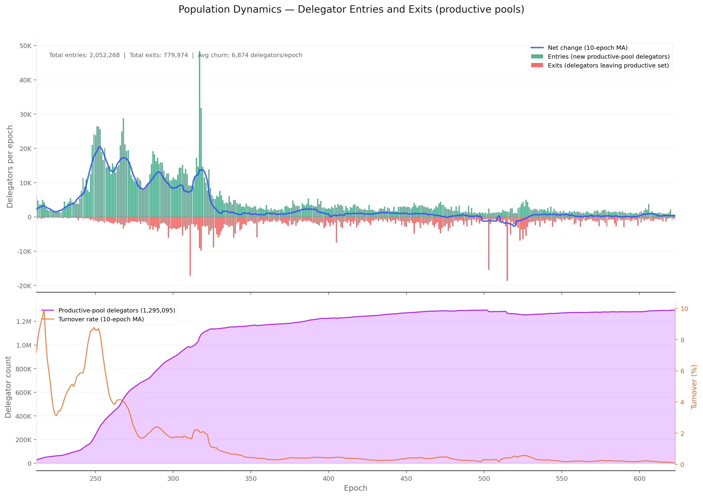

*CEN.4.4 — Productive-pool delegator entries and exits across epochs 212–623. Net flow is structurally asymmetric — entries consistently exceed exits — yielding **+1,272,294** net delegators and a **6:1** ratio of growth to decline epochs; the post-epoch-530 plateau suggests saturation under the current ~59% staking rate.*

The delegator population tells a **fundamentally different story** from the pool population. Where the productive pool count stabilised early and has fluctuated within a narrow band since epoch 300, the delegator count grew **almost monotonically** from **~28,700** (epoch 212) to **~1,295,000** (epoch 623).

Over the full 412-epoch history, the productive set recorded **2,052,268 individual entries** against **779,974 exits** — a **net gain of +1,272,294 delegators**. The average per-epoch churn (entries + exits) is **~6,870 addresses**, implying that roughly **0.5% of the delegator base** turns over each epoch.

Growth epochs outnumber decline epochs roughly **6∶1**, and the few negative epochs involve small absolute drops. The moving average of net change was **strongly positive through epoch ~380**, then settled into a lower but still persistently positive regime.

Two features stand out.

- **Distinct waves rather than a smooth ramp.** The initial Shelley on-boarding surge (epochs 212–260), a secondary acceleration around epochs 280–330 (coinciding with the Alonzo-era smart-contract boom and increased retail attention), and a third wave around epochs 480–510.
- **A plateau from epoch ~530 onward** — where net growth drops close to zero — suggests the delegator population may be approaching a **saturation point** under the current staking participation rate of **~59%**.

The turnover rate (gross entries + exits as a share of the active population) averages around **0.5% per epoch** but spikes markedly during protocol upgrades and market events, revealing that the apparently stable stock masks **episodic surges of rebalancing**.

Unlike pool dynamics, where entries and exits are roughly balanced post-epoch 300, delegator dynamics remain **structurally asymmetric** — entries consistently exceed exits — reflecting **ongoing organic adoption** even as the growth rate decelerates.

## 4.6. Pool-switching collapsed 75% — the market has settled

The population dynamics above track whether delegators are *in* the productive set; this section tracks what they do *within* it — **how often they switch pools, who switches, and why**.

The `delegation` table records every delegation certificate ever submitted on-chain (**3,491,680 certificates** across the Shelley era). Each certificate binds a stake address to a pool; a new certificate from the same address to a different pool constitutes a **redelegation (pool switch)**.

### 4.6.1. The certificate stream tells a three-act story — experimentation, hard-fork shocks, then stillness

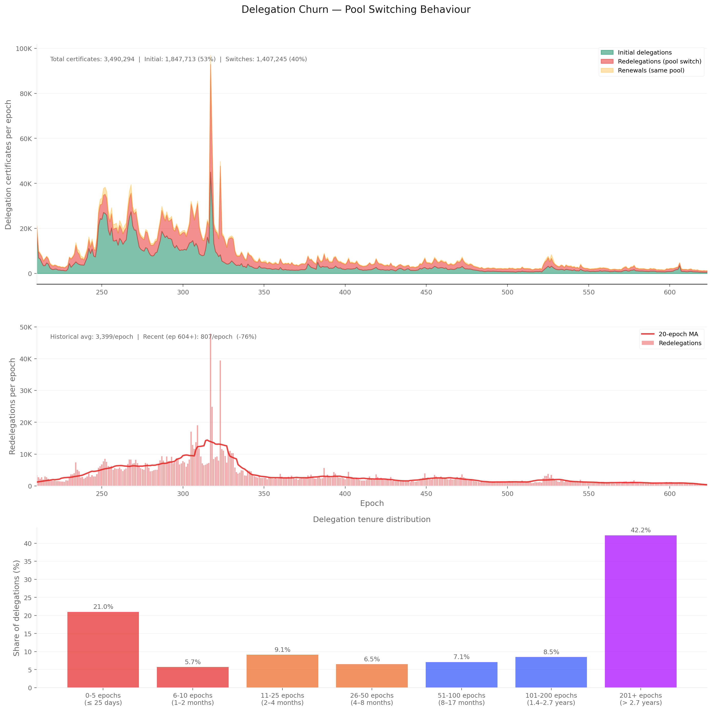

*CEN.4.5 — Per-epoch delegation certificate composition across the Shelley era. Three distinct regimes are visible: **2,000–3,500** redelegations/epoch in early Shelley, **1,000–2,000** through epoch 500, and a settled **600–800/epoch** thereafter — a **75%** decline marking market maturation.*

Of the **3.49M delegation certificates** submitted between epochs 210 and 623:

| Certificate type | Count | Share |
|---|---:|---:|
| Initial delegation (first certificate for an address) | 1,847,713 | 52.9% |
| Redelegation (switch to a different pool) | 1,407,245 | 40.3% |
| Renewal (same pool, re-registration cycle) | 235,336 | 6.7% |

The per-epoch pattern reveals **three regimes**:

- **Early Shelley (epochs 210–260):** **2,000–3,500** redelegations per epoch — a turbulent phase of experimentation with the new staking system.

- **Middle period (epochs 260–500):** **1,000–2,000** per epoch, with periodic spikes around protocol upgrades (Alonzo, Babbage) and market events.

- **Mature regime (epoch 500+):** **600–800** redelegations per epoch — a stable market where most delegators have settled.

> **Finding CEN.O4.F1 — Pool-switching collapsed 75% from early Shelley.** Redelegation activity fell from **2,000–3,500 per epoch** in early Shelley to **600–800** today — a 75% decline through three distinct regimes: experimentation (epochs 210–260) → middle period with hard-fork spikes (260–500) → mature settled market (500+). The transition is from active price discovery to settled allocation.

### 4.6.2. Most delegators stay put — 42% have held the same pool for over 2.7 years

The tenure distribution confirms a bimodal structure:

| Tenure bucket | Share of delegations | Profile |
|---|---:|---|
| 201+ epochs (> 2.7 years) | 42.2% | Committed long-term delegators who anchor pool economics |
| 6–200 epochs (25 days – 2.7 years) | 36.8% | Moderate — roughly uniform distribution across bands |
| 0–5 epochs (≤ 25 days) | 21.0% | Rapid switchers — yield optimisation, pool retirement, or exchange rebalancing |

> **Finding CEN.O4.F2 — The delegator base splits cleanly into stickers and switchers, with a thin middle.** **42% loyal** (201+ epochs, > 2.7 years) — committed long-term delegators who anchor pool economics. **21% volatile** (≤ 5 epochs, < 25 days) — yield optimisation, pool retirement, or exchange rebalancing. **37% moderate** (6–200 epochs, distributed roughly uniformly across bands). The loyal majority anchors pool economics; the volatile tail generates most of the churn signal.

### 4.6.3. The bigger the delegation, the more it moves — whales switch 4–5× more often than micro-delegators

Crossing tenure with delegator stake size at epoch 623 reveals a **clear gradient**: *the larger the delegation, the more active the delegator.*

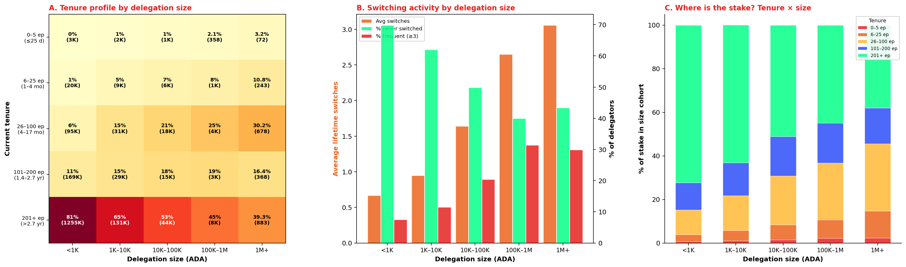

*CEN.4.6 — Tenure profile and switching activity stratified by delegation stake size. Loyalty falls as stake rises: **82%** of <1K delegators are loyal vs **39%** of 1M+; whales average **3.06** lifetime switches against **0.67** for micro-delegators.*

**Switching activity by size cohort:**

| Size cohort | Avg lifetime switches | Never switched | Frequent (≥ 3 switches) |
|---|---:|---:|---:|
| < 1K ADA | 0.67 | 70% | 8% |
| 1K – 10K | 0.95 | 62% | 12% |
| 10K – 100K | 1.64 | 50% | 20% |
| 100K – 1M | 2.65 | 40% | 31% |
| 1M+ | 3.06 | 43% | 30% |

**Tenure profile by size cohort** (panel A). The share of loyal delegators (201+ epochs) falls steadily as stake rises: **82%** for <1K, **65%** for 1K–10K, **53%** for 10K–100K, **45%** for 100K–1M, and **39%** for 1M+.

*Small delegators delegate once and forget; large delegators actively manage their position.*

> **Finding CEN.O5.F1 — Whales switch 4–5× more often than micro-delegators.** Lifetime switches scale monotonically with stake: <1K = **0.67** (70% have never moved), 1K–10K = 0.95, 10K–100K = 1.64, 100K–1M = 2.65, 1M+ = **3.06** (only 43% have never moved). Loyal share (201+ epochs) falls from **82%** for <1K to **39%** for 1M+. *Small delegators delegate once and forget; large delegators actively manage their position.*

**Capital implications** (panel C). In the <1K cohort, **72%** of stake is held by loyal delegators. In the 1M+ cohort, only **38%** sits with loyals — the rest distributes across moderate and volatile tenures.

Since whales hold the majority of staked ADA (**14.1B of 21.8B total**), a large share of the network's capital is in the hands of delegators who **move actively**.

> **Finding CEN.O5.F2 — Most of the network's staked capital sits in delegations that move.** Whales (1M+ ADA) hold **14.1B of the 21.8B** staked total — **65% of staked supply** — yet only **38%** of that stake sits in loyal (201+ epoch) delegations. The remaining 8.7B distributes across moderate and volatile tenures. Pool operators dependent on a few large delegations face structurally higher stake instability than those with a broad base of small, loyal delegators — *the network's economic substrate is structurally mobile*.

### 4.6.4. Switching is a retail-only phenomenon — custodial pools contribute negligible churn

The top pool-to-pool flows (`data/delegation_flow_matrix.csv`) reveal that the **highest-volume corridors are between pools controlled by the same entity** — particularly within IOG's pool fleet and between major exchange operators.

*A significant share of observed "switching" is internal rebalancing by multi-pool operators rather than genuine delegator choice.*

**Retail-only filter.** Restricting to retail pools (margin < 99.9%, excluding private and custodial-by-extraction pools — same filter as the companion [*Operator's Cut*](../../operator-delegator-distribution/mainnet-analysis/)) yields near-identical results:

| Metric | All pools | Retail only |
|---|---|---|
| Switch share of certificates | 40.3% | 40.0% |
| Recent redelegations per epoch | ~800 | ~799 |
| Loyal tenure (201+ epochs) | 42.2% | 42.4% |
| Volatile tenure (≤ 5 epochs) | 21.0% | 20.8% |

The private pool population (**47 pools, ~300 delegations**) generates **negligible churn**. *Essentially all observed switching behaviour originates in the retail delegation market.* The retail flow matrix is available at `data/retail_delegation_flow_matrix.csv`.

> **Finding CEN.O4.F3 — Switching is a retail-market phenomenon — custodial and private pools contribute negligible churn.** The retail-only filter (margin < 99.9%, excluding by-pledge / by-extraction custodial) produces **near-identical aggregate metrics**: 40.0% switch rate (vs 40.3% all-pools), 42.4% loyal tenure (vs 42.2%), ~799 redelegations per epoch (vs ~800). The private pool population (47 pools, ~300 delegations) generates negligible churn — *essentially all observed switching originates in the retail market*.

## 4.7. The yield signal is too flat to drive behaviour — what actually moves capital

The previous section established *who* switches and *how often*. This section asks *why* delegators move and *where* loyal delegators stay.

The companion [*Operator's Cut*](../../operator-delegator-distribution/mainnet-analysis/) ([Operator/Delegator Problem Induction](../../../README.md#133-problem-induction)) established that **margin alone is a poor proxy** for what a delegator pays — the **operator take** (combining fixed cost and margin into a single composite fee) and the resulting **net ROS** (delegator yield after fees) are the correct metrics.

Finding F3.10 further showed that net ROS is **near-homogeneous across the hollow segment** (8–22 bps of spread). The analysis below uses these metrics rather than raw margin to assess switch motivation.

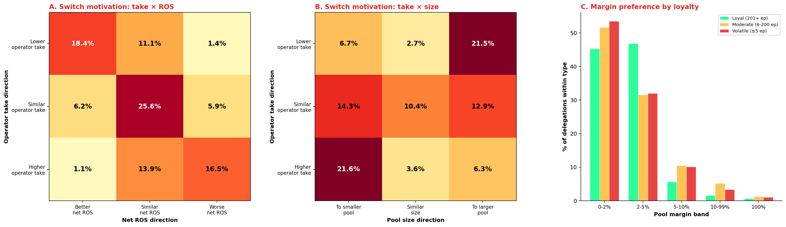

*CEN.4.7 — Switch direction across operator take, net ROS, and pool size for the top 500 corridors (170,064 matched switches). Net ROS differential is effectively zero (median **+0.02 bps**); pool size is the only systematically asymmetric signal — switches favour migration toward larger pools regardless of price.*

### 4.7.1. Half of all switches produce zero yield change — the price signal is invisible

For each of the **top 500 pool-to-pool flow corridors** (**170,064 matched switches**), the origin and destination pools are compared on **operator take, net ROS, and pool size** using the reward-split snapshot at epoch 614.

**Net ROS direction:**

| Direction | Share |
|---|---:|
| Better net ROS (> +5 bps) | 25.6% |
| Similar net ROS (± 5 bps) | 50.5% |
| Worse net ROS (> −5 bps) | 23.8% |

**Half of all switches** land in a pool with a **statistically indistinguishable net ROS**. The median ROS differential is **+0.02 bps** — effectively zero. The interquartile range spans −0.47 to +0.55 bps, **well below any threshold a delegator could observe or act on**.

> **Finding CEN.O6.F1 — Delegators cannot see what they're paying for — the yield signal is too flat to act on.** Half of all switches (**50.5%**) land in a pool with statistically indistinguishable net ROS (±5 bps). The **median ROS differential is +0.02 bps**; the interquartile range spans −0.47 to +0.55 bps — well below any threshold a delegator could observe, let alone optimise against. The finding is consistent with the companion *Operator's Cut* analysis showing gross ROS varies by less than 3 bps across 90% of the non-custodial market.

### 4.7.2. Operator take direction is balanced — no fee-chasing pattern in the data

**Operator take direction** (threshold: ±1 pp):

| Direction | Share |
|---|---:|
| Lower take (cheaper pool) | 30.8% |
| Similar take (± 1 pp) | 37.7% |
| Higher take (more expensive pool) | 31.5% |

The three buckets are **near-equal**. *Delegators do not systematically move toward lower-take pools.*

**The take × ROS matrix** (panel A) shows the mechanical coupling between the two metrics: the **diagonal dominates** (lower take → better ROS at 18.4%, similar → similar at 25.6%, higher → worse at 16.5%). The off-diagonal cells are sparse, confirming that take and ROS are **two views of the same signal** — and that signal is **too flat to drive behaviour**.

> **Finding CEN.O6.F2 — Operator take direction is balanced — no fee-chasing pattern is detectable.** **30.8%** of switches go to a cheaper pool, **31.5%** to a more expensive one, **37.7%** to a similar-take pool. The take × ROS matrix's diagonal dominates (lower take → better ROS at 18.4%, similar → similar at 25.6%, higher → worse at 16.5%) — confirming that take and ROS are two views of the same signal. *That signal is too flat to drive behaviour.*

### 4.7.3. Pool size — not price — is the only asymmetric signal in switching behaviour

**Take × size** (panel B) reveals the one systematic pattern in the data:

| Cell | Share |
|---|---:|
| Higher take + to smaller pool | 21.5% |
| Similar take + to larger pool | 21.0% |
| Lower take + to smaller pool | 6.7% |

When delegators move to a **smaller pool**, they tend to **accept a higher operator take (21.5%)**. When they move to a **larger pool**, they tend to **stay at a similar take (21.0%)**.

The asymmetry suggests that moves toward smaller pools may be driven by **non-economic factors** (community affinity, pool retirement at origin, decentralisation preference) while moves toward larger pools follow a **path of least resistance**.

> **Finding CEN.O6.F3 — Pool size — not price — is the only asymmetric signal in switching behaviour.** Moves to smaller pools tend to **accept higher take (21.5%)** — likely driven by non-economic factors (community affinity, retirement at origin, decentralisation preference). Moves to larger pools tend to be **take-neutral (21.0%)** — likely path-of-least-resistance flows toward more visible operators. This is consistent with the companion *Operator's Cut* finding that delegation concentration tracks visibility, not return optimisation.

### 4.7.4. Loyalty and low fees coexist — the cheapest pools are the stickiest

The margin-band distribution across loyalty segments confirms that fee levels segment the market at entry, not during tenure:

| Segment | 0–2% margin | 2–5% margin | 0–5% combined |
|---|---:|---:|---:|
| Loyal (201+ epochs) | 45.3% | 46.8% | **92.1%** |
| Moderate (6–200 epochs) | 51.7% | 31.5% | 83.2% |
| Volatile (≤ 5 epochs) | 53.5% | 32.0% | 85.5% |

*Loyal delegators are not paying a premium for stability — they sit in the cheapest pools.*

Their stability reflects satisfaction with a combination of **competitive fees, predictable returns, and community trust** rather than an inability to switch.

> **Finding CEN.O6.F4 — Loyalty and low fees coexist — the cheapest pools are the stickiest.** **92.1%** of loyal delegations (201+ epochs) sit in the **0–5% margin range** (45.3% in 0–2%, 46.8% in 2–5%). Moderate (83.2%) and volatile (85.5%) cohorts are also concentrated in this band — fees segment the market *at entry*, not during tenure. Loyalty is a consequence of initial pool selection into the competitive neighbourhood, not a barrier to leaving it.

**The top 20 pools by loyal-delegation count** (`data/loyal_delegator_pools.csv`) are **overwhelmingly single-pool operators** with margins of **2–4%** and fixed costs of **340–400 ADA**.

Average tenure among their loyal delegations ranges from **290 to 362 epochs** (roughly **4 to 5 years**). These pools support **10,000–36,000 delegators each** and have operated **since the early Shelley era** — their delegator bases crystallised early and have remained **remarkably stable**.

## 4.8. DeFi operates almost entirely outside the staking system — only 0.03% of delegations are script-based

The on-chain transaction carries **no metadata identifying the originating wallet software** — a `stake_delegation_certificate` is identical regardless of the interface that submitted it.

The credential type, however, is encoded in the stake address: `stake1u…` for **key-based** credentials (wallet controlled by a private key) and `stake17…` for **script-based** credentials (smart contract, multisig, or governance script). This is the **finest on-chain classification available** for delegator provenance.

From `stake_account_census_623.csv` (epoch 623, db-sync):

| Credential | Delegations | % | Stake (B ADA) | % |
|---|---:|---:|---:|---:|
| Key-based | 1,354,636 | 99.97% | 21.72 | 99.83% |
| Script-based | 399 | 0.03% | 0.04 | 0.17% |

Script-based delegations are **negligible** — **399 addresses** out of **1.355M**, carrying **38M ADA**. DeFi vaults, DAO treasuries, and multisig governance mechanisms account for **almost none** of the staking capital.

The companion [*Operator's Cut*](../../operator-delegator-distribution/mainnet-analysis/) per-pool breakdown confirms that the distribution is **uniformly key-dominated** across operator strategies: hollow pools show 0.03% script delegations (0.22% of stake), balanced pools 0.05% (0.03%), and private pools 0.37% (≈0%). The only entity with material script-stake is a **single hollow fleet** (3 script-delegations, 9.5M ADA).

The credential type **cannot separate custodial from retail capital** — both are key-based. The ADA-per-delegator heuristic used in the companion Operator's Cut (median delegation as proxy for custodial platform signatures) remains the most effective on-chain classification tool.

The key/script split does, however, confirm one structural observation: *the DeFi ecosystem has not yet integrated with the delegation system in any meaningful way.*

If protocol changes were to mandate staking-capable script addresses in DeFi standards (cf. [Most non-participants have no staking key](#52-most-non-participants-have-no-staking-key-only-04-of-supply-is-reachable-by-reward-design)), the script-based share could grow substantially — but **under current conditions it rounds to zero**.

> **Finding CEN.O6.F5 — DeFi operates almost entirely outside the staking system.** **99.97%** of delegations and **99.83%** of stake are key-based; script-based delegation (smart contracts, multisig, governance) is **399 addresses** and **38M ADA**. The DeFi ecosystem has not integrated with delegation in any meaningful way. The credential type is the finest on-chain classification available but cannot distinguish custodial from retail capital — both present as key-based delegations (the ADA-per-delegator heuristic in the companion *Operator's Cut* is what disambiguates them).

_Data: `data/stake_account_census_623.csv`; per-pool credential breakdown in `operator-delegator-distribution/mainnet-analysis/data/delegator_credential_by_pool.csv`._

# 5. Non-Participants

Sections 3 and 4 measured **who is staking** and **how**. This one measures the **complement** — the ADA that is **not** delegated to any pool. The five sections below trace the population from the headline ratio to the smallest reachable subset; the operational details — data sources, the two complementary lenses, the question-to-section mapping — live in [Appendix B — methodological notes for the non-participant analysis](#appendix-b-methodological-notes-for-the-non-participant-analysis).

## 5.1. 2/5 of the supply has sat unstaked for over 300 epochs

At epoch 623, circulating ADA splits into three quantities:

| Component | Epoch 623 | Share of circulating |
|---|---|---|
| **Staked ADA** (delegated to a pool) | **21.755 B** | **60.2 %** |
| **Non-participant ADA** | **14.355 B** | **39.8 %** |
| _of which: spendable balances + unclaimed rewards_ | _14.350 B_ | _39.7 %_ |
| _of which: protocol deposits_ | _0.006 B_ | _< 0.1 %_ |
| **Circulating supply** | **36.110 B** | **100 %** |

Protocol deposits — the 2-ADA fee paid to register a staking key, plus DRep and governance-proposal deposits — are locked by construction and trivial in size. The substantive question is what fills the **14.350 B** of unstaked spendable balances.

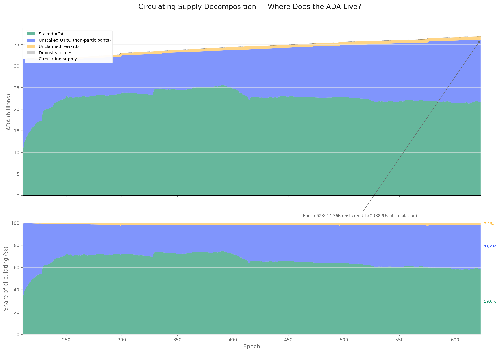

*CEN.5.1 — Circulating supply over the Shelley era, split into staked, non-participant, and deposits. The non-participant share has hovered between **36–39 %** since epoch ~300; the brief upward spike around epoch 365 coincides with the Alonzo hard fork and the first wave of smart-contract deployments.*

> **Finding CEN.O7.F2 — 14.4 B ADA (39.8 % of circulating supply) does not participate in staking.** The pool has been stable at 36–39 % for over 300 epochs. The decomposition that follows shows that **only 0.37 % of circulation is nominally addressable** by an incentive-design change — and even that figure shrinks under scrutiny (§5.5). The remaining 39.4 % sits in addresses that cannot delegate without a protocol-level change.

## 5.2. Most non-participants have no staking key — only 0.4 % of supply is reachable by reward design

The 14.4 B of unstaked supply divides naturally along a single axis: **does the address have a registered staking key?**

| Category | Accounts | ADA | Share | What it is |
|---|---|---|---|---|
| **Delegated** | 1,355,035 | **21.755 B** | **60.25 %** | Standard stakers (§§3–4) |
| **Registered staking key, not delegated** *(addressable in principle)* | 24,176 | **0.135 B** | **0.37 %** | Has a staking key, paid the 2-ADA deposit, but has not delegated |
| **No registered staking key** *(structurally excluded)* | — | **14.215 B** | **39.37 %** | Address shape cannot delegate without modification |
| **Protocol deposits** | — | 0.006 B | < 0.1 % | Locked by the protocol |
| **Circulation** | | **36.110 B** | **100 %** | |

The **"registered staking key, not delegated"** row is the *nominally addressable* pool: an incentive change could in principle reach it without any protocol modification. It is **134.6 M ADA across 24,176 accounts — 0.37 % of circulation**. Section 5.5 shows that what is *operationally* addressable is much smaller still.

The **"no registered staking key"** row — **14.215 B (39.4 % of circulation)** — has four identifiable shapes:

| Shape | ADA | What it is |
|---|---:|---|
| Exchange / institutional addresses | 1.04 B | Payment-only addresses with no staking part by design — used by exchanges, custodians, payment processors |
| Pre-staking legacy addresses | 1.32 B | Wallets that predate the modern address format — some fraction permanently lost |
| DeFi contract addresses without staking | 0.09 B | Smart contracts whose authors did not embed a staking part |
| Wallet addresses with an unregistered staking key | ~11.8 B | Standard wallets where the holder never registered a staking key — a single transaction would move them into the addressable column |
| **Total no registered staking key** | **14.215 B** | |

The fourth shape — wallets *capable* of staking where the holder simply never registered — is the largest single component (~11.8 B) and is more accurately described as **dormant capacity** than structural exclusion. The other three are architectural: the address shape itself prevents delegation.

The **mix among the three architectural shapes is shifting**. The exchange-to-DeFi-contract ratio has fallen from **145 ∶ 1** (epoch 376) to **19 ∶ 1** (epoch 513) to **11.4 ∶ 1** (epoch 623), as DeFi locks grow and exchanges move more of their custody into delegating pools.

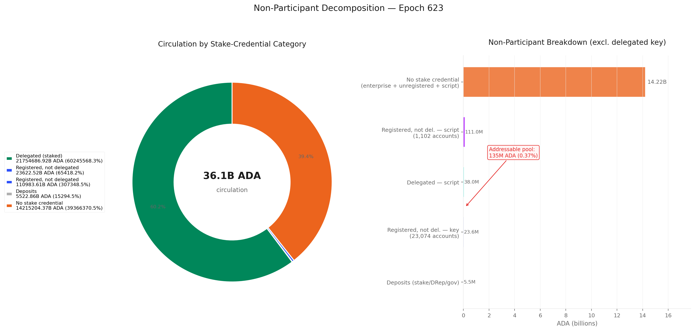

*CEN.5.2 — The 14.4 B non-participant pool by stake-credential category. Only **134.6 M (0.37 %)** is nominally addressable; the remaining **14.215 B (39.4 %)** has no registered staking key and is structurally unreachable without protocol-level changes.*

> **Finding CEN.O7.F3 — The non-participant floor is structural, not behavioural.** Reward-mechanism changes (curve adjustments, fee-structure reforms) can at most shift the 0.37 % addressable pool. Moving the other 39.4 % requires protocol-level changes — enabling exchange-style addresses to stake, mandating staking-capable DeFi script standards, or introducing delegation-by-default for newly minted wallets.

> **Finding CEN.O7.F4 — The "no registered staking key" residual is dominated by legacy and custody, not by active DeFi.** Among the 2.45 B identified by address shape, exchange-style addresses (1.04 B) and pre-staking legacy addresses (1.32 B) together account for **96 %**. DeFi contract addresses without staking total just **91 M** — one tenth as much, growing only slowly. The remaining ~11.8 B sits in standard wallets where the holder never bothered to register a staking key.

## 5.3. The locked share splits cleanly between probably-lost and operationally-active

Of the 2.45 B identified residual (the three architectural shapes from §5.2), how much is genuinely dormant or lost, and how much is moving every day? The creation date of each unspent output is a first-order proxy: **value created before staking existed and never touched since** is the dormant-or-lost candidate; **value created recently** is exchange custody or DeFi contracts cycling funds.

Bucketing by creation epoch:

| Vintage | Epoch range | ADA | Share |
|---|---|---:|---:|
| Byron legacy (no epoch tag) | — | 318 M | 12.7 % |
| **Pre-Shelley** | 0–207 | **609 M** | **24.3 %** |
| Shelley + Allegra | 208–250 | 14 M | 0.5 % |
| Mary | 251–299 | 38 M | 1.5 % |
| Early Alonzo | 300–349 | 139 M | 5.6 % |
| Alonzo + Babbage | 350–449 | 128 M | 5.1 % |
| Early Conway | 450–549 | 94 M | 3.7 % |
| **Late Conway** | 550–623 | **1,110 M** | **44.3 %** |

The distribution is **bimodal**.

The **pre-Shelley + Byron-untagged** buckets — value untouched since before staking became available, totalling **928 M (37 %)** — are the strongest candidates for dormant or lost wallets. This fraction has eroded slowly across snapshots: 1,127 M at epoch 376, 808 M at 513, 609 M at 623 — about **0.8 M ADA per epoch awakens** from this dormant tail.

The **Late Conway** bucket — value created in just the last 73 epochs — holds **1,110 M (44 %)**. This is the opposite signature: actively cycled outputs from exchange custody and DeFi.

The middle eras (Shelley through Early Conway) together contribute only **413 M (16.9 %)**: most outputs from those periods have long since been spent and consolidated.

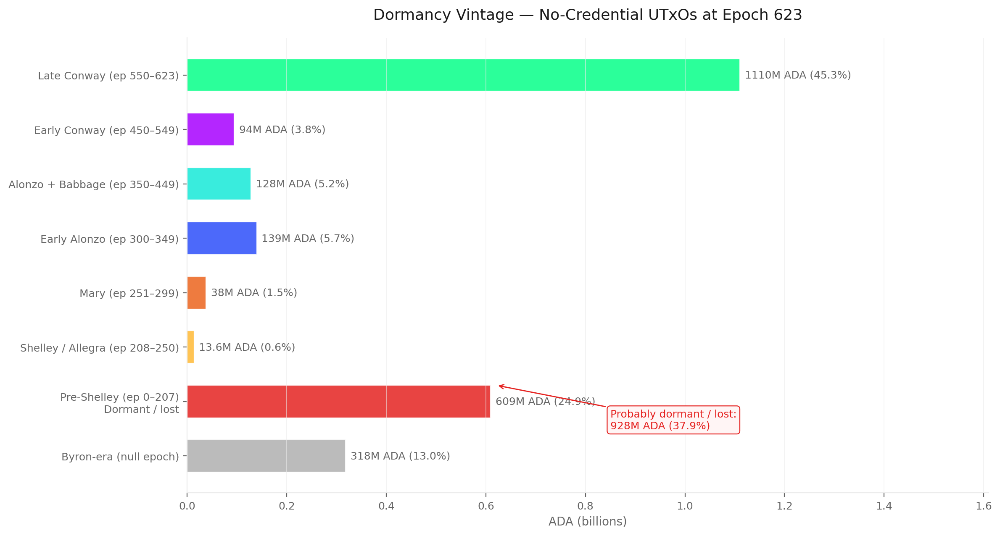

*CEN.5.3 — No-staking-key value by creation-epoch vintage. Pre-Shelley + Byron-untagged total **928 M (37 %)** — the dormant-or-lost candidates. Late Conway (last 73 epochs) holds **1,110 M (44 %)** in actively cycled outputs. The middle is largely empty.*

> **Finding CEN.O7.F5 — The no-staking-key pool is bimodal: 37 % is pre-staking-era dormant, 44 % is from the last 73 epochs.** The dormant fraction (928 M) erodes at about **0.8 M ADA per epoch**. The recent fraction (1,110 M from epochs 550–623) reflects active exchange and DeFi cycling. The middle eras are essentially empty — the population splits cleanly into "probably lost" and "operationally active", with very little in between.

## 5.4. A few hundred custodians hold three-quarters of the structurally-excluded ADA

In aggregate the structurally-excluded 2.5 B reads like a faceless mass. Aggregating *by address* tells a very different story: **372,361 distinct addresses** hold the entire residual, and **a few hundred of them hold most of it**.

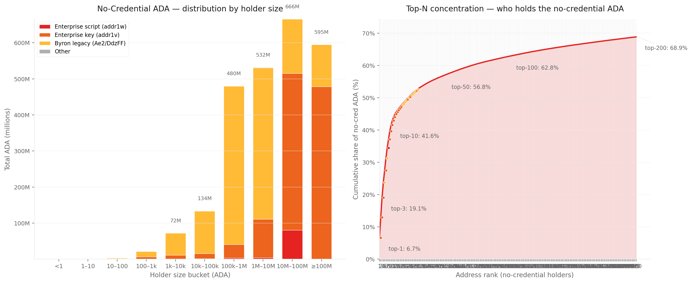

*CEN.5.4 — Distribution and concentration of the **2.50 B ADA** held in addresses without a registered staking key. Left: ADA stacked by holder size and address type — the **≥10M-ADA** bucket alone holds **1.26 B across just 8 addresses**. Right: cumulative concentration — the **top 3** addresses capture **19.1 %** of the residual, the **top 10** capture **41.6 %**, the **top 200** capture **68.9 %**. The remaining 372 K addresses share the bottom 31 %.*

The size distribution is **extremely top-heavy**:

- **Top 3 addresses → 19 %** of the residual
- **Top 10 → 42 %**
- **Top 200 → 69 %**
- The remaining 372 K addresses → **just 31 %**

The combined ≥10M-ADA bucket holds **1.26 B ADA across just 8 addresses**: 6 pre-staking legacy whales (266 M total), 13 large exchange-style wallets in the 10–100 M band plus 3 above 100 M (913 M combined), and 1 DeFi vault at 80 M. With the 1–10 M tier added, **246 addresses hold 1.86 B — 74 % of the entire structurally-excluded pool — out of 372 K total**.

### What the top wallets *look like*

The **shape** of these top holdings is itself diagnostic. Three patterns recur:

| Pattern | Signature | Likely identity |
|---|---|---|
| **Cold storage** | A handful of high-value outputs at one address | Institutional / treasury cold wallet |
| **Hot wallet** | Many small outputs at high total value | Exchange cycling deposits and withdrawals |
| **Legacy whale** | Pre-staking-era address holding large balance | Early Cardano holder who never migrated |

The top three holdings illustrate the first two patterns directly:

| Rank | Holding | Outputs | Likely identity |
|---:|---:|---:|---|
| 1 | 166.6 M ADA (6.7 %) | 7 | Institutional cold wallet |
| 2 | 158.5 M ADA (6.3 %) | 3,034 | Exchange hot wallet |
| 3 | 153.5 M ADA (6.1 %) | 10 | Institutional cold wallet |

Together those three addresses control **478.6 M ADA** — more than the entire dormant pre-Shelley + Byron-untagged population combined. Ranks 4–10 mix a 116 M legacy whale, a high-cycling 94 M legacy hot wallet (55,007 outputs), the 80 M DeFi vault discussed below, and four more exchange-style cold/hot wallets.

> **Finding CEN.O7.F6 — The "structurally-excluded" 2.5 B is held by a few hundred wallets, not by a diffuse retail base.** Top-3: 19.1 %; top-10: 41.6 %; top-200: 68.9 %. The combined ≥1M-ADA shoulder of 246 addresses holds 74 % of the residual. **Output count vs total value cleanly separates exchange hot wallets from institutional cold storage by inspection.** The remaining 26 % is split among 372 K addresses averaging ~1,750 ADA each — the genuine retail tail. The mass is therefore far less unreachable than it looks: it is a small, identifiable set of custodians whose address shape is a deliberate custody choice, not an architectural barrier.

### 5.4.1. The DeFi-locked share is one contract

The 91 M-ADA "DeFi contract without staking" sub-population — already the smallest of the three architectural shapes — is even more concentrated than the rest of the no-staking-key pool. **A single contract holds 80.6 M ADA across 3 outputs — 89 % of the entire DeFi-locked-without-staking residual.** The next-largest holds 1.5 M (1.7 %), and ranks 3–5 each hold 0.9–1.3 M.

DeFi-locked-without-staking is therefore not a generalised phenomenon but the footprint of **one large protocol** whose authors chose not to embed a staking part in their contract address. If that one contract were upgraded to a staking-enabled address, the category would shrink by an order of magnitude in a single transaction.

> **Finding CEN.O7.F7 — DeFi-locked-without-staking is dominated by a single 80 M contract, not by the DeFi ecosystem at large.** 89 % of the 91 M residual lives in one contract; the remaining 99 contracts together hold ~10 M (11 %). Mandating staking-capable contract addresses in DeFi standards would primarily move this one contract; the rest of DeFi has either already integrated staking or holds amounts too small to materially shift the residual.

## 5.5. The "addressable" pool collapses to about 2,100 active accounts

The 134.6 M-ADA "registered staking key, not delegated" pool is the only non-participant category that incentive design — not protocol architecture — can in principle re-engage. Decomposed three ways, very little of it turns out to be *actually* incentive-addressable.

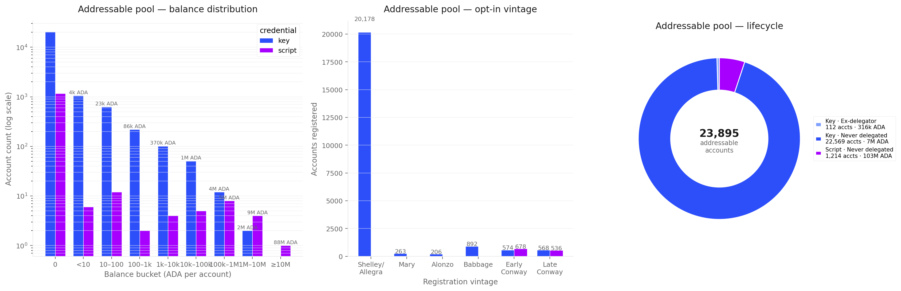

*CEN.5.5 — The 23,895 nominally addressable accounts decomposed three ways. **Left:** balance distribution — **91 % of accounts hold zero ADA**. **Middle:** opt-in vintage — **89 % of accounts registered in the first 41 epochs of Shelley** and have not moved since. **Right:** lifecycle — **94.5 %** of accounts have **never delegated** to any pool; only 0.5 % are ex-delegators.*

Three patterns dominate.

**Most of the pool is empty.** Of 23,895 accounts, **21,787 (91 %) hold zero ADA**. They are staking keys that were registered (paying the 2-ADA deposit) and then drained — the registration is alive, but the spendable balance migrated to a different address. The actually populated subset is **2,108 accounts**, which together hold the entire 110 M ADA of the addressable residual.

**Most of *that* ADA is in one contract.** Of the 110 M, **88 M (80 %) sits in a single DeFi vault** — the same contract flagged from the no-staking-key side in [The DeFi-locked share is one contract](#541-the-defi-locked-share-is-one-contract), seen here from the staking-key side. Excluding it, the addressable pool collapses to **22.5 M ADA across roughly 2,100 accounts**.

**The pool is a Shelley-era fossil.** **89 % of the registered staking keys come from the first 41 epochs of Shelley** (epochs 208–249) and have not delegated, deregistered, or moved a stake-control transaction since. They are consistent with users who registered a staking key during the initial Shelley wallet wave and then either lost interest, lost the key, or moved their funds to a different wallet and forgot the old one. Only 0.5 % of the pool is ex-delegators who once delegated and later undelegated — movement *out* of staking is not what built this category. It was built by accounts that opted in once and then **stopped one transaction short of delegating**.

> **Finding CEN.O7.F8 — The "addressable" pool is mostly inert.** 91 % of accounts hold zero ADA, 89 % have been dormant since the first 41 epochs of Shelley, and 80 % of the active residual sits in one DeFi vault. Setting the vault aside (it is reachable but governed by contract logic, not by individual choice) leaves **~22.5 M ADA across ~2,100 active accounts — about 0.06 % of circulation**. That is the genuine ceiling for what a reward-design change can recruit. Below this floor, no on-chain population exists for the mechanism to reach.

## 5.6. What the four levers can and cannot reach

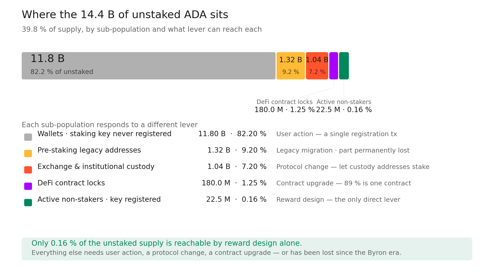

*CEN.5.6 — The 14.4 B unstaked ADA, sized by sub-population and colour-coded by the lever that reaches each. **Only 0.16 % of the unstaked supply is reachable by reward design alone**; the dominant 82 % sits in standard wallets where the holder simply never registered a staking key, and the rest splits between custody (protocol-level change required), DeFi contract locks (contract upgrade required), and pre-staking legacy holdings (some permanently lost).*

The non-participant population is best understood as four sub-populations that respond to four different levers:

- **Custody (the largest reachable block).** Centralised exchanges and institutional custodians hold ADA in addresses that have no staking part by design. The [custodian-concentration ranking](#54-a-few-hundred-custodians-hold-three-quarters-of-the-structurally-excluded-ada) confirms this: the top 10 no-staking-key holdings split between low-output cold vaults and high-output exchange hot wallets. The ≥1M-ADA shoulder of 246 addresses holds 74 % of the residual — small enough to identify and cluster by inspection in a follow-up. Some exchanges (Coinbase, Binance) already operate their own delegating pools (visible in the [SPO supply side — fewer and fewer entities participate in consensus](../../../README.md#2131-spo-supply-side-fewer-and-fewer-entities-participate-in-consensus) entity attribution), but the custodial ADA they don't stake by choice sits here. **Mobilising this share requires a protocol-level change** that lets these address shapes delegate.

- **One DeFi vault.** Rather than a generalised "DeFi-locked" phenomenon, the DeFi-locked-without-staking residual is **one 80 M contract**. The other 99 contracts together hold ~10 M. **At the protocol-design level this is a one-contract problem.**

- **Dormant and lost.** Pre-Shelley + Byron-untagged outputs total ~928 M (37 % of the no-staking-key value) and erode at ~0.8 M per epoch — a slowly decaying tail of legacy wallets, with an unknown fraction permanently lost. **No design change reaches this share.**

- **Active non-stakers — far smaller than the headline.** The 24,176 nominally-addressable accounts (134.6 M) collapse on inspection to roughly **2,100 active accounts holding 22.5 M ADA — about 0.06 % of circulation** — once zero-balance shells and the single DeFi vault are removed. **These are the only holders an incentive-design change can plausibly recruit**; everything beyond requires protocol-level changes that bring the other 14.2 B into reach.

# 6. Transaction Submitters

The preceding sections map the staking ecosystem — operators, delegators, and the ADA that sits outside it. But the reward pipeline has a **fourth population** that cuts across all three: **transaction submitters**, the addresses that pay the fees feeding the epoch pot.

The fee component is **negligible today** (~0.19% of the epoch pot; see the companion [*Treasury & Pool Pots Distribution*](../../treasury-and-pool-pots-distribution/mainnet-analysis/README.md)). But **every sustainability scenario** depends on fees eventually replacing monetary expansion as the dominant input. The population that generates those fees — its size, who is in it, and who is *not* in it — is therefore a first-order variable for the pipeline's long-term viability.

Transaction submitters are **orthogonal to staking roles**. A submitter can be an operator (pool registration and retirement transactions), a delegator (delegation certificates, transfers), a non-participant (exchange withdrawals, DeFi interactions from enterprise addresses), or an automated script. The same address can be a loyal delegator in §4 and a prolific submitter in this section. The population overlap is **itself analytically significant**:

> *If fee revenue is dominated by addresses that do not participate in staking, the reward mechanism funds itself from a constituency it does not reward.*

Five questions guide what follows: *how many submitters there are today, how concentrated their fee contributions are, what kind of addresses they use, whether they overlap with delegators, and whether the population is growing or shrinking*. Each question is answered by one of the five sections below; the operational details — db-sync queries, the first-input heuristic, the recent-window definition — live in [Appendix A — methodological notes for the submitter analysis](#appendix-a-methodological-notes-for-the-submitter-analysis).

## 6.1. A shrinking crowd paying for a busy chain

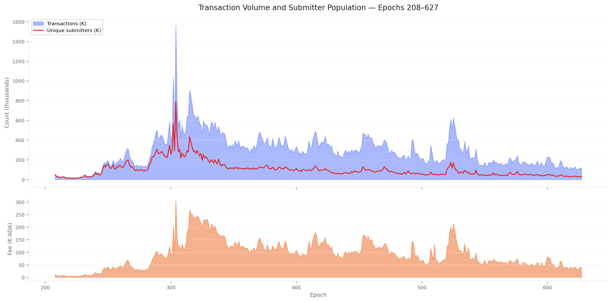

*CEN.6.1 — Per-epoch transaction count and unique submitter population across epochs 208–627, with fee revenue tracked beneath. The submitter population peaked at **790K addresses** (epoch 304, CNFT minting frenzy) and has since contracted by **96%** to **31,176** at epoch 627, while transaction volume fell **92%**.*

The top panel overlays two series across the full Shelley era: **per-epoch transaction count** (blue area) and **unique submitter addresses** (red line). The bottom panel tracks **fee revenue per epoch**.

The two lines used to move together; they no longer do. At the epoch-304 peak, **790,335** addresses sent **1,566,974** transactions — almost one tx per active address. Five years later the address curve has fallen off a cliff (**31,176** at epoch 627) while the transaction curve fell only halfway as far (**118,358** at epoch 627). The chain still runs busily; a much smaller crowd is running it.

> **Finding CEN.O8.F1 — The submitter population peaked at 790K addresses (epoch 304) and has since contracted by 96%, while transaction volume fell by 92%.** The submitter population grew in step with transaction count through early Shelley, peaking at 790,335 unique addresses and 1,566,974 transactions at epoch 304 — the CNFT minting frenzy. From epoch 310 onward the population collapsed faster than volume: by epoch 384, unique submitters had fallen to 101K while transactions remained above 330K. The decline continued through the post-Alonzo era: by epoch 500, 58K submitters generated 217K transactions; at epoch 627, 31,176 submitters generated 118,358 transactions. The fee base has consolidated dramatically: a population one twenty-fifth the size of its peak still sustains three quarters of the per-epoch transaction rate seen during 2023–2024.

> **Finding CEN.O8.F2 — The address-to-transaction ratio fell from 0.88 (epoch 210) to 0.26 (epoch 627), and tx-per-submitter rose from ~2.0 (epoch 304) to ~3.8 (epoch 627) — breadth is collapsing while intensity is rising.** Over the recent 6-epoch window (epochs 622–627), throughput averaged 114,502 transactions per epoch with 36,928 ADA in fees and 31,783 unique submitters. Cumulative Shelley-era throughput totals **118.07M transactions** and **37.85M ADA** in fees; the all-time peak occurred at epoch 304 (1,566,974 tx, 790,335 submitters, 308,294 ADA in fees). The growth-trajectory signal is unambiguous: new addresses are not entering the fee-paying population at a rate that would sustain breadth — the same shrinking core is just transacting more often.

## 6.2. Most submitters can stake — but the loudest of them can't

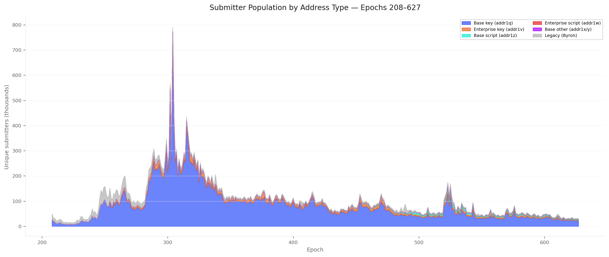

*CEN.6.2 — Submitter population decomposed by CIP-19 address type across epochs 208–627. Base-key dominates at **73.3%** (epoch 627) but base-script reached **10.8%**; legacy Byron addresses fell from **48%** to **4.9%** as the Shelley format became universal.*

The first chart counts heads. At epoch 627, almost three quarters of submitters (**73.3%**) are base-key addresses (`addr1q`) — addresses that carry a stake credential and are technically capable of delegating. Add base-script (`addr1z`, **10.8%**) and base-other (0.2%) and the **stakeable** majority covers **84.3%** of the active population.

The remaining **15.7%** is structurally non-stakeable: enterprise-key addresses (`addr1v`, **9.2%**) used by exchanges and institutional custody, enterprise-script addresses (`addr1w`, **1.6%**) used by DeFi contracts, and legacy Byron addresses (**4.9%**) — formats that simply have no place to attach a stake credential. By head-count, this is a small minority.

Three structural transitions span the timeline:

- **Legacy Byron addresses collapsed** from **48%** of submitters (epoch 208) to **4.9%** (epoch 627) as the Shelley-era address format became universal.
- **Enterprise-key addresses** grew from **near-zero** to a **stable 9–10% band** from epoch 300 onward.
- **Script-typed addresses emerged after Alonzo** (epoch ~290) and grew steadily — base-script from zero to **10.8%**, enterprise-script stabilising at **1–2%**.

> **Finding CEN.O9.F1 — By address count, the submitter population remains overwhelmingly stakeable, but the script segment has grown structurally.** At epoch 627, 73.3% of unique submitters are base-key (`addr1q`) addresses carrying a staking credential, 10.8% are base-script (`addr1z`), 9.2% are enterprise-key (`addr1v`), 4.9% are legacy Byron, 1.6% are enterprise-script (`addr1w`), and 0.2% are base-other. Compared to the earlier snapshot at epoch 384 (87% base-key, <1% script), the shift is clear: base-key's share dropped 14 pp while base-script grew from 0.4% to 10.8%. The count-based picture, however, remains misleading — the small script population punches far above its weight in fee terms, as the next chart reveals.

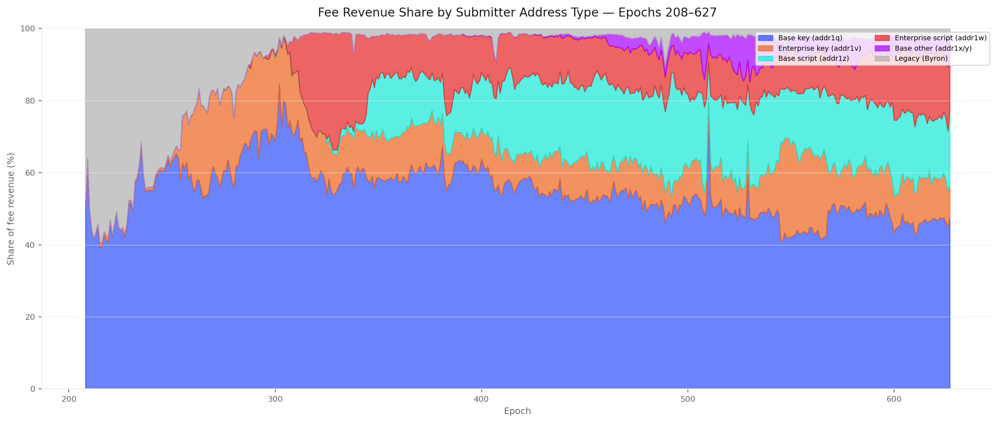

*CEN.6.3 — Fee revenue share by CIP-19 submitter address type across epochs 208–627. At epoch 627, base-key holds **47.4%**, base-script **21.2%**, enterprise-script **14.7%**, enterprise-key **8.9%** — meaning roughly **24%** of fee revenue still comes from non-base (enterprise / legacy) addresses that cannot carry a staking credential.*

The second chart re-weights the same population by **how much each segment pays**. Now base-key holds **less than half the area** (47.4% at epoch 627), and the non-stakeable minority — only ~16% of head-count — generates **30.1%** of the fees on average over the recent window.

The history makes the pattern even sharper. At epoch 300 (early post-Alonzo), base-key paid **69%** of all fees. By epoch 340 — the height of "DeFi summer" — base-key was down to 62% and **enterprise-script alone**, just **197 addresses** at the time, was paying **25%**. Enterprise-key + enterprise-script peaked together at **44% (epoch 328)** before settling into a **20–30% band** that has now held through the entire Conway era.

> **Finding CEN.O9.F2 — Roughly 30% of fee revenue is generated by addresses that structurally cannot participate in delegation, and this share has been stable since the Alonzo era.** Over the recent 6-epoch window (622–627), enterprise-script addresses (`addr1w`) generate 17.0% of fees, enterprise-key addresses (`addr1v`) 10.8%, and legacy Byron 2.3%, totalling 30.1%. These addresses have no staking credential — the reward mechanism taxes a constituency it excludes. The non-stakeable fee share has oscillated between 18% and 44% since epoch 300, averaging ~25%. The structural floor is set by DeFi contract activity; the ceiling by speculative episodes. At no point since Alonzo has the non-stakeable share fallen below 14%.

## 6.3. ~3,800 smart contracts carry a third of the fees

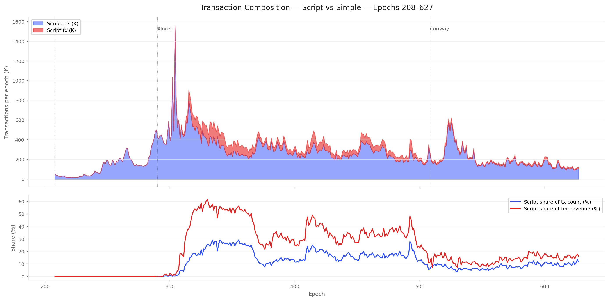

*CEN.6.4 — Script versus simple transactions across the Shelley era. Script activity peaked at **29.2%** of count (epoch 355) and **61.7%** of fees (epoch 330) during the Alonzo "DeFi summer", and has since stabilised at **9–14%** of count with a persistent **~1.5×** per-transaction fee premium.*

The fee-decomposition chart in §6.2 grouped addresses by the *kind* of payment instrument they carry. This section zooms in on the sub-population the chain depends on most heavily relative to its size: **the smart contracts**.

Script transactions first appeared at **epoch 290 (Alonzo HFC)**, initially at **0.09%** of volume. Activity **exploded** between epochs 308 and 340, reaching a peak script share of **29.2%** (epoch 355) and a peak script fee share of **61.7%** (epoch 330) — the "DeFi summer" of the Alonzo era consumed over half of all fee revenue while representing less than a third of transaction count.

Since epoch ~370, script activity **retreated sharply** — falling below **10% of transaction count** by epoch 500 and stabilising around **9–14%** through the Conway era. The **fee premium persists**: over the recent window (622–627), scripts account for **11.0%** of transaction count but **16.5%** of fees — a **1.50× multiplier** structurally embedded via Plutus execution costs.

At epoch 627, that premium concentrates on a remarkably small population: **3,851 script addresses** (490 enterprise-script + 3,361 base-script — **12.4%** of the active submitter base) generated **14,481 ADA** in epoch fees, **36.0%** of the total. The average enterprise-script submitter pays **12.1 ADA** per epoch in fees; the average base-key submitter pays **0.83 ADA** — a **14×** per-address premium.

> **Finding CEN.O10.F1 — Script transactions represent 12.5% of post-Alonzo transaction count but 29.6% of cumulative fees — the DeFi economy pays 2.4× the per-transaction rate.** The fee premium peaked above 3× during the Alonzo era (epochs 310–340), when fewer than 30% of transactions commanded over 60% of fees. The premium has moderated to ~1.5× in recent epochs, but remains structurally above parity. For the sustainability argument, this means per-transaction fee intensity is coupled to script adoption — a variable the current incentive design does not address.

> **Finding CEN.O10.F2 — Script addresses represent 12% of submitters but generate 36% of fee revenue.** At epoch 627, 490 enterprise-script addresses and 3,361 base-script addresses (3,851 total, 12.4% of the population) together generated 14,481 ADA in fees — 36.0% of the epoch total. The average enterprise-script submitter pays 12.1 ADA per epoch in fees; the average base-key submitter pays 0.83 ADA — a 14× premium reflecting Plutus execution costs. The script share of the population has grown sixteen-fold since epoch 384 (from 0.7% to 12.4%) while their fee share roughly held steady around one third, meaning the per-address premium has moderated but the structural dependency on script activity has deepened: the pipeline's fee revenue is coupled to the continued operation of roughly 3,800 smart contracts.

## 6.4. The fee floor rests on a few dozen recognisable names

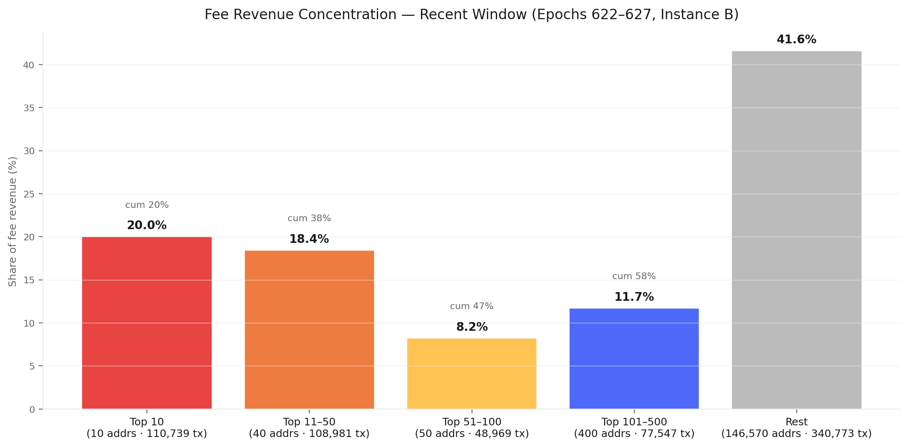

*CEN.6.5 — Fee revenue distribution across submitter tiers for epochs 622–627. The top **10** addresses generate **20.0%** of fees and the top **500** generate **58.4%** — out of ~147K active submitters. The top 10 alone account for **110,739 transactions** over six epochs (16.1% of volume).*

Inside the recent 6-epoch window, the **top 10** fee-paying addresses generate **20.0%** of fees, the **top 500** generate **58.4%**, and the entire long tail of ~146K small contributors splits the remaining 41.6%. **500 addresses out of ~147K (0.34%) pay the majority of fees** — heavy-tailed, but less extreme than delegation stake (Gini 0.976 in §4).

The heavy-paying core is recognisable, not anonymous. Looking at the top 10:

- A **MinSwap** DEX-script address leads at **12,105 ADA** over 6 epochs (linked to the **MIN** pool).
- Two more enterprise-script DEX contracts and several base-script aggregator wallets follow.
- Pool-tied addresses appear: **TITAN**, **BERRY**, **OYSTR**, and **NUFI** (a NuFi exchange-style operator).
- A handful of enterprise-key bot wallets fill out the rest.

These are not retail users — they are protocol-level actors whose transaction patterns are operational, not discretionary. The chain's fee floor rests on a population small enough to know by name.

> **Finding CEN.O11.F1 — The top 10 fee-paying addresses generate 20.0% of all fee revenue; the top 500 generate 58.4%.** 500 addresses out of ~147K (0.34%) pay the majority of fees. The concentration is heavy-tailed but less extreme than delegation stake (Gini 0.976 in §4). Compared to the prior snapshot at the 618–623 window (top 10 = 24.3%, top 500 = 60.8%), the recent window shows a mild de-concentration of 4 pp at the top — driven by a single very-high-volume address whose activity tapered.

> **Finding CEN.O11.F2 — The top 10 fee payers ran 110,739 transactions over 6 epochs (16.1% of volume); the top 50 ran 219,720 transactions (32.0%) — fee-pot stability hinges on a few dozen automated actors.** The top fee payers are dominated by a small set of recognisable archetypes: a DEX-script address (linked to the **MIN** pool, MinSwap) is the largest single contributor at 12,105 ADA over 6 epochs; pools tied to **NUFI** (NuFi exchange-style operator), **TITAN**, **BERRY**, and **OYSTR** appear among the top 10 along with two enterprise-script DEX contracts and several enterprise-key bot wallets. The fee floor of the network depends on a population of ~10 actors whose churn risk is not modelled by any incentive parameter.

## 6.5. The people who pay are not the people who get rewarded

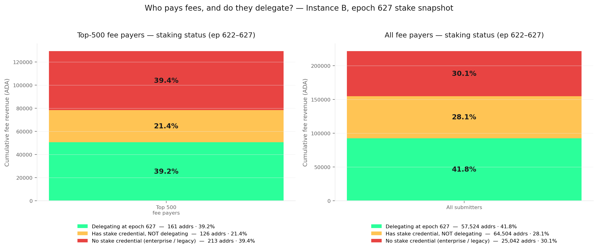

*CEN.6.6 — Decomposition of fee revenue by submitter staking status (left: top 500; right: full population) over the recent window 622–627. **Only 39% of top-500 fee revenue and 42% of all fee revenue come from currently-delegating addresses**; 21% (top 500) and 28% (full) come from base addresses with a stake credential that is not in the epoch 627 delegation set; the remainder (39% / 30%) sits in enterprise or legacy addresses that have no stake credential at all.*

The previous four sections looked at submitters in isolation. This one joins them to the delegator population at epoch 627 — the 1.352M addresses that are *supposed* to receive the rewards. Three regimes separate cleanly:

- **Delegating** — the submitter address is a base address whose `stake_address_id` is in `epoch_stake` at epoch 627.
- **Has a stake credential, not delegating** — base address whose `stake_address_id` is *not* in `epoch_stake` (either deregistered or never used).
- **No stake credential** — enterprise (`addr1v`, `addr1w`) or legacy Byron addresses; structurally outside the delegation system.

Across the recent window, only **41.8%** of fee revenue comes from currently-delegating addresses. The other **58.2%** splits between **28.1%** (base addresses that *could* delegate but aren't) and **30.1%** (addresses that structurally can't delegate at all). From the delegator side the gap is even starker: only **3.1%** of the 1.352M active delegators submit any transaction in the 6-epoch window. The remaining **96.9%** are passive holders — they delegate, accrue rewards, never touch the chain.

> **Finding CEN.O12.F1 — Only 41.8% of fee revenue comes from currently-delegating addresses; the remaining 58.2% comes from addresses that are not delegating at the snapshot epoch.** Across epochs 622–627, the 1.352M delegators at epoch 627 contributed 41.8% of fee revenue (92,538 ADA out of 221,565). The stakeable-but-inactive segment (base addresses whose stake credentials are not in the delegation set) contributed 28.1% (62,340 ADA). The structurally non-stakeable segment (enterprise + legacy) contributed 30.1% (66,684 ADA). The mismatch is symmetric on both sides: the *funding* base does not match the *reward* base.

> **Finding CEN.O12.F2 — Only 3.1% of delegators submit any transaction in a 6-epoch window; conversely, 55% of submitter stake credentials are also delegating.** Of the 1,352,113 active delegators at epoch 627, only **42,082** appear as the first input of any transaction during epochs 622–627 — a 30-day window. The remaining **1,310,031 (96.9%)** are passive holders: they hold stake, accrue rewards, and never touch the chain. From the other side, the submitter base has 76,561 unique stake credentials over the same window, of which 42,082 (55.0%) are in the delegation set — the rest carry a stake credential that has never been delegated, has been deregistered, or sits idle.

> **Finding CEN.O12.F3 — In the top 500 fee-paying addresses, the *largest* segment by fee weight is the no-stake-credential one — 39.4% — followed by the delegating segment at 39.2% and the has-cred-not-delegating segment at 21.4%.** The 213 no-credential addresses (enterprise + legacy) in the top 500 generated 50,960 ADA in fees, slightly more than the 161 delegating addresses (50,685 ADA) and well over the 126 has-cred-not-delegating addresses (27,728 ADA). The pipeline's largest fee contributors are concentrated in the population it cannot reward: half of the heavy-paying actors are structurally outside the delegation game by design (DEX scripts, exchange enterprise wallets), and another fifth are *technically inside* but have *opted out* of delegation. Any fee-redistribution mechanism that passes value back through the delegation channel returns less than 40 ADA in every 100 ADA of fees to the population that paid them.

## 6.6. What this means for the reward pipeline

Read in sequence, the five sections above describe a system whose fee base is structurally misaligned with its reward base. The population paying for the chain has shrunk to a tight, hyper-active core (§6.1). That core is most of the time stakeable on paper but, when sorted by fee weight, dominated by sub-populations that the reward mechanism either cannot reach (§6.2) or reaches only partially (§6.5). A small number of smart contracts carry a disproportionate fee share (§6.3), and the very top of the distribution is a handful of identifiable protocol actors (§6.4) whose churn is not priced into any incentive parameter.

Three structural consequences follow. First, **fee growth is bounded by the size of a known and shrinking population** — increasing fee revenue requires either bringing new submitter populations on-chain or moving more of the existing rate-paying activity onto delegating addresses. Second, **the reward channel is a leaky bucket**: less than 40 ADA in every 100 paid as fees flow back through delegation rewards to the addresses that paid them. Third, **the dependency on ~3,800 smart contracts and ~10 named operators is a single-point-of-failure risk** the current parameter set does not model.

The companion [*Treasury & Pool Pots Distribution*](../../treasury-and-pool-pots-distribution/mainnet-analysis/README.md) translates these population facts into pot-level pressures: the fee component of the epoch pot is too small to substitute for monetary expansion at the current population scale, and the redistribution channel is too narrow to close the funder-vs-beneficiary gap on its own.

# 7. Synthesis

## Key metrics (staking snapshot epoch 623; submitter snapshot epoch 627)

| Metric | Value | Source |
|---|---|---|
| Circulating supply | 36.110B ADA | Koios totals (epoch 623) |
| Staked (delegated) | 21.755B ADA (60.2%) | epoch_stake |
| Non-participant ADA | 14.355B ADA (39.8%) | residual |
| _Addressable (reg, !delegated)_ | _134.6M ADA (0.37%)_ | _Koios account_info + Instance B_ |
| _No stake credential_ | _14.215B ADA (39.4%)_ | _residual_ |
| _Deposits_ | _5.5M ADA (<0.1%)_ | _Koios totals_ |
| Active delegations (raw productive) | 1,355,035 across 2,877 pools | epoch_stake |
| Productive pool delegations (≥3M filter) | 1,227,281 across 733 pools | epoch_stake + production threshold |
| Productive entities | 367 (83 attributed: 71 strict multi-pool + 12 attributed single-pool; 284 unattributed single-pool operators) | entity attribution on productive pools |
| Delegations per productive pool | ~1,675 | 1,227,281 / 733 |
| ADA per delegation (raw) | ~16,050 ADA | epoch_stake |
| Gini coefficient (stake concentration) | 0.976 | tier-aggregated Lorenz |
| Active delegators at epoch 627 | 1,352,113 | epoch_stake (Instance B) |
| Unique submitters at epoch 627 | 31,176 | §6, Instance B |
| Total transactions (ep 208–627) | 118.07M | §6, Instance B |
| Total fee revenue (ep 208–627) | 37.85M ADA | §6, Instance B |
| Top-10 submitters fee share (ep 622–627) | 20.0% | §6, CEN.O11.F1 |
| Top-500 submitters fee share (ep 622–627) | 58.4% | §6, CEN.O11.F1 |
| Script tx fee share (post-Alonzo cumulative) | 29.6% | §6, CEN.O10.F1 |
| Script tx fee share (recent, ep 622–627) | 16.5% | §6, CEN.O10.F1 |
| Peak script fee share (ep 330) | 61.7% | §6, CEN.O10.F1 |
| Fee revenue from currently-delegating addresses (622–627) | 41.8% | §6, CEN.O12.F1 |
| Fee revenue from no-stake-credential addresses (622–627) | 30.1% | §6, CEN.O12.F1 |
| Active delegators who submit any tx in 6 epochs | 3.1% (42,082 of 1,352,113) | §6, CEN.O12.F2 |
| Submitter stake credentials that are also delegating | 55.0% (42,082 of 76,561) | §6, CEN.O12.F2 |
| Fee revenue/epoch (baseline) | ~37K ADA (622–627 mean) | §6 |

## Concentration headline

| Population slice | Count | Share of delegations | Stake | Share of stake |
|---|---|---|---|---|
| Titan (10M+ ADA) | 318 | 0.02% | 9.75B | 44.8% |
| Mega + Titan (1M+) | 2,244 | 0.17% | 14.05B | 64.6% |
| Micro (<100 ADA) | 801,067 | 59.1% | 0.01B | 0.05% |

## Noise removal log

| Section | What changed | Impact |
|---|---|---|
| §3 Pool Operators | Removed pools below production threshold (~3M ADA) | Productive pools: 2,877 → 733 (−75%). Removed pools (1,925 sub-block + 219 sub-reliable = 2,144) carry 2.7% of stake. |
| §3 Pool Operators | Grouped productive pools by entity (on-chain keys + off-chain attribution) | 83 attributed entities controlling 449 productive pools (76.7% of stake); 284 unattributed single-pool operators (23.3%). CEX + IVaaS together = 34.3% at structurally zero pledge. |
| §4 Delegators | Removed zero-balance certificates | 1.85M → 1.36M delegations (−27%). 5,919 → 2,877 pools (−51%). |
| §4 Delegators | Removed sub-threshold pool delegations | 67,817 sub-reliable + 59,937 sub-block = 127,754 delegations on 2,144 sub-threshold pools (0.58B, 2.7% of stake). |
| §4 Delegators | Productive pool delegations isolated | 1,227,281 delegations, 21.18B ADA across 733 productive pools and 367 entities. Further decomposition (operator self-stake, custodial, retail) deferred to the Operator's Cut. |

## What remains noisy

1. **Delegator-side entity attribution** — which delegation tiers delegate to exchange pools vs independent pools? The pool-side is resolved; the delegator-side is not.
2. **Historical single-pool-operator / multi-pool-operator partition** — current snapshot only. Need per-epoch owner-key reconstruction.
3. **Submitter address vintage / cohort retention** (§6) — Address-type decomposition (CEN.O9), fee concentration (CEN.O11), and the staking overlap (CEN.O12) now cover the full Shelley range (epochs 208–627) on Instance B. The remaining open question is **cohort retention**: of the 30K+ unique submitters per epoch, what fraction was already submitting one year ago, and what fraction is genuinely new? The growth-trajectory finding (CEN.O8.F2) gives the breadth-vs-intensity decomposition at the aggregate level — running script `20_submitter_growth.sql` end-to-end on Instance B (cost: full scan of 335M tx_in rows) would close the per-epoch first-tx attribution.

# 8. Bridges to Companion Analyses

This census produces **population denominators** that companion analyses chain off. Each companion doc owns its own framework and snapshot epoch; this section only summarises which census number each one consumes.

| Companion analysis | Census denominator it consumes | Snapshot epoch |
|---|---|---|
| [Pools Pot Distribution](../../pools-distribution/mainnet-analysis/) — participation gap, λ_size, λ_pledge | Staking rate (CEN.O7); circulating-vs-staked split | epoch 616 |
| [Operator's Cut](../../operator-delegator-distribution/mainnet-analysis/) — pledge stances, custodial classes, saturation-scale taxonomy | Productive set (733 pools, 1,227,281 delegations, 21.18B ADA, 83 attributed entities) — identical to §3.4.1 / §4.4.1 | epoch 623 |
| [Treasury & Pool Pots](../../treasury-and-pool-pots-distribution/mainnet-analysis/) — fee, reserve, treasury pressure | Total fee revenue and submitter overlap (CEN.O8, CEN.O12) | epoch 627 |
| [Main report](../../../../spo_incentives/report.tex) — main narrative | Staking rate, delegator count (older 548–583 window) | epochs 548–583 |

When a companion stat looks different from a census number, **the difference is almost always one of three things**: (a) certificate counts vs `epoch_stake` (1.85M certs → 1.355M live delegations; 5,919 pool certs → 2,877 live pools), (b) snapshot epoch drift (staking rate 57.4% at 548–583 → 59.0% at 623), or (c) scope (reward-earning pools only at epoch 614 → all staked pools at 623). Apply this lens before flagging a real discrepancy.

# Appendix A — methodological notes for the submitter analysis

This appendix collects the framing and the operational details for §6. It exists so the body of §6 can stay readable; analysts who want to reproduce or extend the work will find here what they need.

## A.1. The five questions guiding §6

Five questions define the analytical scope. Each maps to one of the five sections in §6.

**Population size and breadth.** How many distinct addresses submit transactions per epoch? How does this compare to the **1.352M active delegations** at epoch 627? Is the fee-generating population larger, smaller, or roughly the same as the staking population — and how has the ratio evolved since Shelley? *Answered in [§6.1 — A shrinking crowd paying for a busy chain](#61-a-shrinking-crowd-paying-for-a-busy-chain).*

**Composition — who is in the population.** The Alonzo hard fork (epoch ~290) introduced Plutus scripts, splitting the submitter population into key-based (transfers, delegation certificates) and script-based (DeFi interactions). How is the population distributed across CIP-19 address types, and how does that distribution differ when you weight by fee revenue? *Answered in [§6.2 — Most submitters can stake](#62-most-submitters-can-stake-but-the-loudest-of-them-cant) and [§6.3 — ~3,800 smart contracts carry a third of the fees](#63-3800-smart-contracts-carry-a-third-of-the-fees).*

**Concentration.** Does fee revenue follow the same power-law pattern as delegation stake (Gini 0.976, §4)? If the top 100 addresses generate the majority of fees, the sustainability of the entire pipeline depends on a handful of actors — and the identity of those actors (DEX contracts, exchange hot wallets, known entities) determines whether the fee base is diversified or fragile. *Answered in [§6.4 — The fee floor rests on a few dozen recognisable names](#64-the-fee-floor-rests-on-a-few-dozen-recognisable-names).*

**Overlap with staking populations.** The structural question: does the population that *funds* the reward pipeline (fee payers) overlap with the population that *benefits* from it (delegators)? If the fee base is dominated by enterprise addresses and script addresses that structurally cannot delegate (§5), the pipeline taxes a constituency it excludes from rewards. Crucially, *having* a stake credential is not the same as *using* it: an `addr1q` address whose stake credential is not in `epoch_stake` is technically capable of delegating but currently is not. Cross-referencing the per-address `stake_address_id` with `epoch_stake` at the snapshot epoch separates three regimes — *delegating* / *has-credential-not-delegating* / *no-credential* — and completes the picture. *Answered in [§6.5 — The people who pay are not the people who get rewarded](#65-the-people-who-pay-are-not-the-people-who-get-rewarded).*

**Growth trajectory.** Is the fee-generating population expanding, contracting, or stable? Is growth driven by new addresses entering (breadth) or by higher activity from existing ones (intensity)? Comparing submitter growth to the delegator growth curve and to the staking-rate decline (CEN.O7) establishes whether the two populations are diverging — and in which direction. *Answered in [§6.1 — A shrinking crowd paying for a busy chain](#61-a-shrinking-crowd-paying-for-a-busy-chain), CEN.O8.F2.*

## A.2. Data sources

The analysis runs end-to-end on **db-sync Instance B** (full, synced from genesis to epoch 628 at the time of writing) and anchors at **epoch 627** — the most recently completed epoch. Instance B retains unpruned `tx_out` rows, which enables address resolution for the submitter-identification heuristic and direct access to `tx_out.stake_address_id` for the staking-overlap analysis.

The query inputs are `tx` (fee, block reference, `script_size`), `tx_in` + `tx_out` (source addresses, `stake_address_id`, `address_has_script`), `block` (epoch attribution), and `epoch_stake` at epoch 627 (delegation snapshot for the overlap analysis).

> **Data coverage.** All findings in §6 are produced from **Instance B alone**. Instance A's pruned schema is no longer required: every script-size, address-resolution, and staking-overlap query now runs against the full unpruned data on Instance B.

## A.3. Submitter-identification heuristic

The submitter-identification heuristic is **the first input of each transaction** (the address that pays the fee). For multi-input transactions this is an approximation — but it covers the vast majority of cases and matches the convention used by wallet software and block explorers.

The "first input" is implemented as the lowest `tx_in.id` for each consuming `tx_in_id`. In newer db-sync schemas, `tx_in.tx_in_id` (formerly `tx_id`) holds the consuming-tx pointer; queries written against the older schema must be updated.

## A.4. Window definitions

- **Full Shelley range** (figures CEN.6.1 — CEN.6.4): epochs 208–627, ~5 years.
- **Recent window** (§6.4 fee concentration, §6.5 staking overlap, headline percentages in §6.2 and §6.3): **epochs 622–627**, six full epochs, ~30 days. Chosen to match the Cardano reward-payout cadence and to dampen single-epoch spikes.

## A.5. Reproduction scripts

The reproduction SQL is in [`scripts/15_tx_epoch_summary.sql`](scripts/15_tx_epoch_summary.sql) through [`scripts/20_submitter_growth.sql`](scripts/20_submitter_growth.sql); the figures are produced by [`scripts/build_submitter_figures.py`](scripts/build_submitter_figures.py) reading the CSVs in [`data/`](data/). Output CSVs use the `_627` suffix to mark the epoch anchor.

# Appendix B — methodological notes for the non-participant analysis

This appendix collects the framing and the operational details for §5. It exists so the body of §5 can stay readable; analysts who want to reproduce or extend the work will find here what they need.

## B.1. The three questions guiding §5

Three questions define the analytical scope. Each maps to one or more sections in §5.

**What kind of address holds the unstaked supply?** Is the 14.4 B non-participant pool one undifferentiated mass, or does it split along an architectural axis the reward mechanism can act on? Two complementary lenses are used: an account-level decomposition by stake-credential status, and an unspent-output decomposition by address shape. *Answered in [2/5 of the supply has sat unstaked for over 300 epochs](#51-25-of-the-supply-has-sat-unstaked-for-over-300-epochs) and [Most non-participants have no staking key](#52-most-non-participants-have-no-staking-key-only-04-of-supply-is-reachable-by-reward-design).*

**How much of the locked share is dormant or lost vs operationally active?** The unspent-output set carries a creation date for each output, which gives a first-order proxy for whether the controlling wallet is alive. Bucketing by creation epoch separates outputs that have not moved since before staking became available (probably-lost) from outputs created in the last few epochs (operationally-active). *Answered in [The locked share splits cleanly between probably-lost and operationally-active](#53-the-locked-share-splits-cleanly-between-probably-lost-and-operationally-active).*

**How much of the unstaked supply can a reward-design change actually reach?** Reframed at population level: how many *distinct* addresses hold the structurally-excluded 2.5 B, how concentrated is their grip, and what does the ranked top of the distribution actually look like? Symmetrically: how many of the nominally-addressable 24,176 accounts are populated and recently active? *Answered in [A few hundred custodians hold three-quarters of the structurally-excluded ADA](#54-a-few-hundred-custodians-hold-three-quarters-of-the-structurally-excluded-ada) and [The "addressable" pool collapses to about 2,100 active accounts](#55-the-addressable-pool-collapses-to-about-2100-active-accounts), with the practical implications spelled out in [What the four levers can and cannot reach](#56-what-the-four-levers-can-and-cannot-reach).*

## B.2. Data sources

All §5 findings run against the same full unpruned db-sync used by §6. The supply totals (circulation, deposits, reward-account balances) come from the per-epoch supply table; the staking-side aggregates from the per-epoch stake snapshot at epoch 623; the per-account balance for the 24,176 nominally-addressable accounts via the public Koios `account_info` endpoint, cross-checked against the on-chain stake-account state.

## B.3. The two complementary lenses

The 14.4 B non-participant pool is decomposed two ways because no single query covers both axes:

- **Account-level decomposition** (`scripts/15_utxo_from_koios.py`). Lists every registered staking key, their delegation status, and (via Koios) their current balance. Yields the headline split into delegated / registered-not-delegated / no-staking-key / deposits used in [Most non-participants have no staking key](#52-most-non-participants-have-no-staking-key-only-04-of-supply-is-reachable-by-reward-design). Cannot see *what kind of address* the no-staking-key ADA sits in.

- **Unspent-output decomposition** (`scripts/16_non_participant_insights.sql` + the existing dormancy snapshots). Walks every unspent output, classifies its address by shape (exchange-style, pre-staking legacy, DeFi contract without staking, base wallet), aggregates by address and by creation epoch. Used for the concentration analysis in §5.4 and the bimodal dormancy split in §5.3. Cannot directly attribute the ~11.8 B residual that sits in base addresses with an unregistered staking key — that gap is closed by the account-level subtraction.

## B.4. Window definition

§5 anchors at **epoch 623** for the staking-side aggregates (matches §3, §4) and at the **current chain tip** (~epoch 628) for the address-level concentration data in §5.4 and the addressable-pool deep-dive in §5.5. The five-epoch drift between the two is small enough not to affect any conclusion (~5 M ADA at the population level).

## B.5. Reproduction scripts

The reproduction SQL is in [`scripts/07_non_participant_decomposition.sql`](scripts/07_non_participant_decomposition.sql) and [`scripts/16_non_participant_insights.sql`](scripts/16_non_participant_insights.sql); the account-level work runs through [`scripts/15_utxo_from_koios.py`](scripts/15_utxo_from_koios.py). The figures are produced by [`scripts/build_non_participant_decomposition_figure.py`](scripts/build_non_participant_decomposition_figure.py), [`scripts/build_dormancy_vintage_figure.py`](scripts/build_dormancy_vintage_figure.py), [`scripts/build_no_cred_concentration_figure.py`](scripts/build_no_cred_concentration_figure.py), and [`scripts/build_addressable_pool_figure.py`](scripts/build_addressable_pool_figure.py). Output CSVs use the `_623` suffix for the staking-side snapshot anchor.

# Appendix C — global data sources and methodology

This appendix collects what is true across all sections of the document. Per-section operational notes — submitter heuristic, non-participant decomposition, etc. — live in [Appendix A](#appendix-a-methodological-notes-for-the-submitter-analysis) and [Appendix B](#appendix-b-methodological-notes-for-the-non-participant-analysis).

## C.1. Data sources

All data comes from **cardano-db-sync** (PostgreSQL). **No third-party API**, with one exception flagged in Appendix B (Koios `account_info` cross-check for the 24,176 nominally-addressable accounts in §5).

Two db-sync instances feed the document:

- **Instance A** (pruned, snapshot at **epoch 623**) — used by §2–§5 staking-side aggregates.
- **Instance B** (full, synced from genesis through epoch 628 at the time of writing) — used by §6 transaction-submitter analysis at **epoch 627**, and by §5's UTxO-level decompositions. Retains unpruned `tx_out` rows, which enables address resolution and direct access to `tx_out.stake_address_id` and `tx_out.address_has_script`.

| Table | Content |
|---|---|
| `ada_pots` | Per-epoch supply decomposition: reserve, treasury, circulating, UTxO, unclaimed rewards, deposits |
| `epoch_stake` | Per-epoch staking snapshot: total staked per delegation, ~560M rows |
| `delegation` | Individual delegation certificates: addr → pool |
| `pool_update` + `pool_owner` | Pool registration history and owner keys |
| `stake_deregistration` | Stake key deregistration events |
| `tx` | Transaction metadata: fee, block reference, script size |
| `tx_in` + `tx_out` | Transaction inputs and outputs: source/destination addresses, `stake_address_id`, `address_has_script` (Instance B only for the `tx_out` columns) |

## C.2. Method — iterative cleaning

The raw db-sync tables contain **structural noise** that must be understood and progressively removed before drawing conclusions.

Rather than presenting only a final "clean" picture, this document shows each cleaning pass explicitly: **what noise was identified**, **what was done about it**, and **how the numbers changed**. This makes the analytical choices visible and auditable.

Each section therefore follows a **raw → clean** structure: the raw query result is shown first, then the noise is named, then the cleaned version is presented.

---

> **Status** — Built on 2026/05/04. Staking-side aggregates (§2–§5) anchor on `cardano-db-sync` Instance A snapshot at **epoch 623**; transaction-submitter analysis (§6) anchors on Instance B (full, synced through epoch 628) at **epoch 627**. Last §6 refresh: 2026/05/04.
