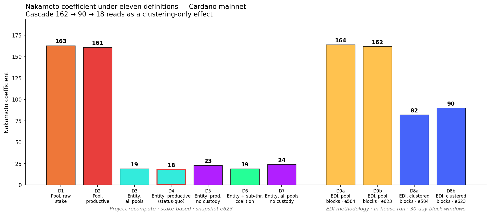
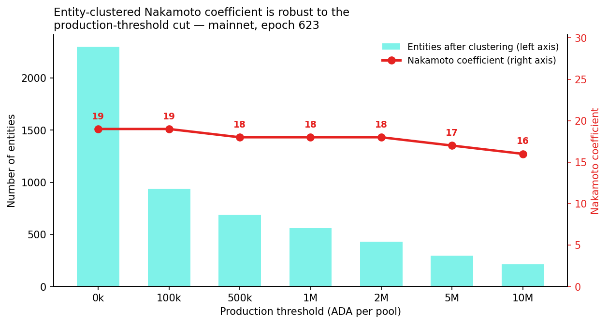

# Nakamoto Coefficient — Mainnet Re-evaluation at Epoch 623

This sub-flow of [the Diagnostic](../../README.md) audits the headline Nakamoto coefficient for Cardano by recomputing it on the same mainnet snapshot under **seven explicit stake-based definitions** (D1–D7) and re-running the Edinburgh Decentralization Index (EDI) methodology end-to-end in-house under both clustering modes (D8a/b, D9a/b). The exercise then assesses whether the EDI dashboard value — the figure most commonly cited as Cardano's "official" Nakamoto — can be defended as a measure of *adversarial-coalition* decentralisation. *The work is methodological: it does not propose a new metric, it restores the proper interpretive interval around the existing one.*

The "official" Nakamoto coefficient cited in the November 2025 report — approximately **80 at epoch 584**, sourced from EDI — is **internally valid under its stated convention** but **unrepresentative of adversarial-coalition risk**. On the same mainnet snapshot at epoch 623, recomputing the coefficient under the project's documented entity-clustering convention yields:

| Framing | Nakamoto | Population |
|---|---|---|
| Pool-level, raw stake (no clustering, no threshold) — D1 | **163** | 2 877 active pools |
| Pool-level, productive only (≥ 1.007M ADA threshold) — D2 | **161** | 733 productive pools |
| EDI methodology, blocks, on-chain-metadata clustering, 30j → e584 — D8a (replicated) | **82** | 970 entities |
| EDI methodology, blocks, on-chain-metadata clustering, 30j → e623 — D8b (replicated) | **90** | 919 entities |
| EDI methodology, blocks, *no* clustering, 30j → e584 — D9a (replicated) | **164** | 1 240 pools |
| EDI methodology, blocks, *no* clustering, 30j → e623 — D9b (replicated) | **162** | 1 174 pools |
| **Entity-clustered, productive only — project status-quo (D4)** | **18** | 560 entities |
| Entity-clustered, all pools — D3 | 19 | 2 302 entities |
| Entity-clustered, productive, custodial-exchange stake removed — D5 | 23 | 557 entities |
| Entity-clustered, all pools, custodial-exchange stake removed — D7 | 24 | 2 299 entities |

The values above only become legible once anchored against the rest of
the EDI cross-chain series. The dashboard exposes the same metric, on
the same 30-day window and the same on-chain-metadata clustering, for
seven other ledgers; the headline values published in writing by the
Edinburgh team for its alpha snapshot are:

| Ledger (EDI alpha snapshot, 2023/06 – 2024/03) | Consensus | Nakamoto |
|---|---|---:|
| **Cardano** — D8b in-house at e623 (this sub-flow) | Ouroboros (PoS) | **90** |
| **Cardano** — EDI alpha headline | Ouroboros (PoS) | **58** |
| **Cardano** — D4 status-quo, curated MPO clustering, e623 (this sub-flow) | Ouroboros (PoS) | **18** |
| Tezos | Liquid PoS | 7 |
| Bitcoin | PoW | 2 |
| Ethereum | PoS post-merge | 2 |
| Bitcoin Cash, Dogecoin, Litecoin, Zcash | PoW / auxPoW | covered, no separately published headline |

Cardano leads the EDI ranking under every clustering policy reported by
this sub-flow. The in-house re-run of EDI's pipeline now puts the
on-chain-metadata-clustered value at 90 rather than the alpha-snapshot
58 (operator-population growth and cluster fragmentation between
2023/06 and 2026/04, 970 → 919 distinct EDI entities). Even at the
project's most aggressive curated clustering, D4 = 18 sits an order of
magnitude above Bitcoin's and Ethereum's published EDI values and
twice Tezos's. A complementary live cross-chain reading from
Chainspect's staking-power dashboard (snapshot 2026/04/23: Bitcoin = 4,
Cardano = 22, Tezos = 14, Solana = 19) preserves the same ordering
under a different methodology.

Four findings:

1. **Definitional dispersion of nearly an order of magnitude.** The same
   mainnet activity supports Nakamoto values from **18** to **164**
   depending on how an "independent unit" is defined. The headline EDI
   value sits in the upper half of the range, between unclustered
   pool-level (≈162) and the project's curated entity clustering (≈18).

2. **The headline EDI value is not a security floor; it is a *light-clustering*
   estimate.** Eighteen distinct, named multi-pool operators control more
   than 50 % of productive stake at epoch 623. Anyone treating ~80 as the
   number of coordinating actors needed to censor or fork the chain is
   over-stating adversarial cost by a factor of roughly four.

3. **The EDI methodology is treated as a first-class definition, not a
   cited number.** EDI's pipeline (parser → clustering → 30-day
   aggregator → metrics) is run in-house on raw Cardano block data
   fetched from Koios, for two reference epochs (584, 623) and both of
   EDI's clustering modes (on-chain-metadata, none). The four resulting
   coefficients — D8a = 82, D8b = 90, D9a = 164, D9b = 162 — are added
   to the definition matrix as the EDI methodology's own output on this
   sub-flow's snapshot. Their internal ordering decomposes the cascade
   162 → 90 → 18 cleanly into a clustering-only effect: lifting from
   "no clustering" to "EDI on-chain metadata" pulls NC from 162 to 90;
   lifting further to the project's curated MPO manifest pulls it from
   90 to 18.

4. **Cross-chain framing is preserved at every clustering policy.** The
   EDI dashboard covers eight ledgers on a uniform methodology and
   reports Cardano = 58, Tezos = 7, Bitcoin = 2, Ethereum = 2 for its
   alpha snapshot. This sub-flow's in-house D8a (82) and D8b (90) sit
   above the 58 headline (operator-population growth, cluster
   fragmentation 2023/06 → 2026/04); D4 (18) remains an order of
   magnitude above Bitcoin's and Ethereum's published values and twice
   Tezos's. Chainspect's complementary live staking-power snapshot
   (Bitcoin = 4, Cardano = 22, Tezos = 14) preserves the same ordering
   under a different methodology. See *Cardano in cross-chain context*
   below.

A defensible *single* number for the November 2025 report is **18 (D4)**,
the entity-clustered Nakamoto on productive pools at epoch 623, with EDI's
in-house re-run **~90** at e623 (or ~82 at e584) retained as the
on-chain-metadata-clustered block-share reference. The two should be
reported jointly, not interchangeably. The cross-chain anchor — Cardano
above every other EDI-covered ledger under every clustering policy —
should travel with both numbers, not as a slogan but as the structural
context that makes either of them interpretable.



# What the Nakamoto coefficient actually measures

The metric was introduced by Balaji S. Srinivasan and Leland Lee in 2017 in
the essay *Quantifying Decentralization*, which sought to translate the
intuition of "distributed power" into a single auditable number. The
construction is elementary and disarmingly general. Given a subsystem of a
blockchain — *mining*, *client*, *developer*, *exchange*, *node*, or
*ownership* in the original taxonomy — the Nakamoto coefficient of that
subsystem is the smallest number of independent entities whose combined
share crosses 51 % of the relevant resource. The *minimum* Nakamoto
coefficient is then the minimum across subsystems, and represents the
smallest collusion required to compromise the system as a whole.
Srinivasan presented it as a complement to the Gini coefficient, which
captures inequality but not the size of the threshold-crossing coalition.
([Srinivasan & Lee 2017](https://news.earn.com/quantifying-decentralization-e39db233c28e))

Formally, fix a snapshot, a population of N entities, and a non-negative
share function $s_i$ with $\sum_i s_i = 1$. Sort the entities so that
$s_{(1)} \ge s_{(2)} \ge \dots \ge s_{(N)}$. The Nakamoto coefficient is

$$
\mathrm{NC} \;=\; \min \Bigl\{\, k \in \{1, \dots, N\} \;\Bigm|\; \sum_{i=1}^{k} s_{(i)} \,>\, \tfrac{1}{2} \Bigr\}.
$$

The threshold is *strict*: the coalition must move past the half-share
mark, not merely reach it. The coefficient is therefore right-continuous
in the share vector and integer-valued, and a single tiebreaking convention
(by stable sort over identifiers) makes it deterministic.

Three implementation choices are buried in this definition and account for
nearly every disagreement found in the literature.

The first is **what counts as a share**. In Bitcoin and Ethereum the natural
choice is realised hash power or block production over a window. In a
proof-of-stake setting both *committed stake* (the input to leader election)
and *produced blocks* (the realised output) are defensible — and they
diverge at finite epoch granularity because of Bernoulli noise in leader
selection. Srinivasan's original essay deliberately leaves the choice open;
each subsystem picks its own resource.

The second is **what counts as an entity**. A "pool" is a cryptographic
key registered on-chain; an "entity" is a real-world actor that may control
many such keys through the same operations team, treasury, or relay
infrastructure. Without a clustering policy, the coefficient measures
key-level dispersion only. With aggressive clustering it approaches the
true coalition cost.

The third is **the population over which the share is normalised**. Sub-
threshold or inactive participants can be included (driving the
denominator up and the coefficient down) or filtered out (the opposite).
The Cardano context routinely applies a production-threshold filter
because non-producing pools are economically irrelevant; other ledgers
do not.

The two reference values cited around this project differ on every one of
these three axes, which is why they cannot be compared as if they were
measurements of the same quantity:

The **Edinburgh Decentralization Index** computes the coefficient on
*block production* aggregated over a 30-day window, not on stake at a
snapshot. The dashboard's own metric page states it as
*"the minimum number of entities that collectively produce more than 50 %
of the total blocks within a given timeframe"*, with the underlying
quantity being **blocks**, and applies the same definition to all
supported ledgers
([EDI metrics methodology](https://blockchain-technology-lab.github.io/consensus-decentralization/metrics/)).
Each block is mapped to a producer and the producer is mapped to an entity
through one of three clustering policies: *Explorers*, *On-chain metadata*,
or *None*. Cardano is the only supported ledger for which on-chain
metadata is the default — that is, EDI groups Cardano pools by the ticker,
name, and homepage URL their operators publish on-chain
([EDI consensus dashboard](https://blockchainlab.inf.ed.ac.uk/edi-dashboard/)).
This is a deliberately conservative cluster: it merges declared brands but
does not absorb operational clusters that share infrastructure without
sharing a public identity. The methodology trace through the EDI tooling
(parsers → mappings → aggregator → metrics) is documented at the project's
[GitHub Pages site](https://blockchain-technology-lab.github.io/consensus-decentralization/).

The **academic literature on Cardano** uses the stake-based formulation.
Kiayias and Ovezik (2022), in
*[Decentralization Analysis of Pooling Behavior in Cardano Proof of Stake](https://iohk.io/en/research/library/papers/decentralization-analysis-of-pooling-behavior-in-cardano-proof-of-stake/)*,
adopt the same minimum-k-over-stake definition, with entity clustering
applied where pool ownership can be triangulated. The *SoK: Measuring
Blockchain Decentralization* survey (Karakostas, Kiayias, Ovezik 2025)
catalogues the variants and cautions that headline numbers across studies
are routinely incomparable for exactly the reasons listed above.

The reference value cited around this project — EDI's ~80 — is therefore
one point estimate, of one specific object, among many possible:

- **EDI ~80**: minimum-k over *blocks produced in a 30-day window*, with
  *on-chain-metadata* clustering of Cardano pools, no production-threshold
  filter. Reference: Cardano consensus tab of the EDI dashboard, sampled
  at approximately epoch 584.

This sub-flow recomputes the coefficient on a single shared mainnet
snapshot under seven explicitly-defined stake-based frames, then runs
EDI's own pipeline in-house under both clustering modes for two reference
epochs, deliberately preserving the project's stake-based, entity-
clustered convention as the canonical reading and exposing EDI's
on-chain-metadata clustering as a documented intermediate. The headline
finding — that the project's curated entity-clustering yields a
coefficient close to **18**, roughly four times smaller than EDI's ~80 —
follows from the formal definition, not from a methodological dispute
with EDI.

# Definitions

The Nakamoto coefficient as used throughout this sub-flow follows the
canonical formulation given above: the smallest integer *k* such that the
top *k* stakeholders, ranked by controlled active stake, cumulatively
control strictly more than 50 % of total active stake. The seven
definitions vary along three axes — the **unit of aggregation** (pool
key vs. clustered entity), the **population filter** (all active pools
vs. productive-pool subset), and the **treatment of custodial stake**
(included vs. excluded).

| Def. | Unit | Population | Adjustment |
|---|---|---|---|
| D1 | Pool key | All active pools | — |
| D2 | Pool key | Pools above the production threshold | — |
| D3 | Clustered entity (curated MPO map ∪ singleton-per-pool) | All active pools | — |
| **D4** | **Clustered entity** | **Pools above the production threshold** | **— (canonical project status-quo)** |
| D5 | Clustered entity | Pools above threshold | Exchange-custody entities removed |
| D6 | Clustered entity | Pools above threshold | Sub-threshold pools coalesced into one adversarial unit |
| D7 | Clustered entity | All active pools | Exchange-custody entities removed |

The clustering manifest is the curated MPO map maintained in
[`mpo_entity_pool_mapping_mainnet.csv`](../census/mainnet-analysis/data/mpo_entity_pool_mapping_mainnet.csv)
(901 pool ↔ entity bindings across 85 entities). Pools not present in the
manifest are treated as singleton entities. The production threshold at
epoch 623 is **1 007 161 ADA** of active stake per pool, sourced from
[`operator_landscape_history.csv`](../census/mainnet-analysis/data/operator_landscape_history.csv).
Custodial-exchange categorisation uses the `category` column of
[`mpo_entity_summary_mainnet.csv`](../census/mainnet-analysis/data/mpo_entity_summary_mainnet.csv)
with the category set `{cex, opaque_operational}`.

# Data provenance

All inputs are mainnet snapshots already present in the census sub-flow.
No network call is performed at runtime; the recompute is bit-for-bit
reproducible against the committed CSVs.

| Input | Path | Size | Snapshot |
|---|---|---|---|
| Pool active stake | `census/mainnet-analysis/data/pool_stake_623.csv` | 2 877 rows | epoch 623 |
| MPO entity → pool map | `census/mainnet-analysis/data/mpo_entity_pool_mapping_mainnet.csv` | 901 mappings | mainnet, current |
| MPO entity categories | `census/mainnet-analysis/data/mpo_entity_summary_mainnet.csv` | 22 entities (declared / opaque) | mainnet, current |
| Production threshold history | `census/mainnet-analysis/data/operator_landscape_history.csv` | 414 epochs (210–623) | per-epoch series |

The MPO mapping was assembled by triangulating Koios `pool_group`,
`adastat_group`, `balanceanalytics_group`, and curator-confirmed metadata
domains. Each binding carries a `confidence` field and a `claim_type`. The
entire manifest is human-auditable and version-controlled.

# Method

For each definition the procedure is identical: build the entity → stake
table appropriate to the definition, sort entities by controlled stake
descending, take the cumulative sum, return the position at which the
cumulative crosses the half-stake threshold. The reference implementation
is `scripts/01_compute_nakamoto.py`.

A pool that is absent from the curated MPO manifest is treated as a
singleton entity bearing the pool's bech32 identifier as its entity ID.
This is conservative: any latent affiliation between two singletons would
*reduce* the coefficient, not increase it. The published value is therefore
an **upper bound** on the entity-clustered Nakamoto coefficient.

# Results

The seven coefficients on the epoch-623 snapshot are:

| Def. | Description | Units | Stake covered (ADA) | Nakamoto |
|---|---|---|---|---|
| D1 | Pool, raw, no threshold | 2 877 | 21.75 B | **163** |
| D2 | Pool, productive | 733 | 21.57 B | **161** |
| D3 | Entity-clustered, no threshold | 2 302 | 21.75 B | **19** |
| D4 | Entity-clustered, productive | 560 | 21.57 B | **18** |
| D5 | Entity-clustered, productive, no custody | 557 | 18.59 B | **23** |
| D6 | Entity-clustered, productive + sub-thr. coalition | 561 | 21.75 B | **19** |
| D7 | Entity-clustered, all pools, no custody | 2 299 | 18.78 B | **24** |

The top 18 entities on definition D4 — the eighteen named actors that
collectively cross the 50 % stake line — are listed in
[`data/entities_active_e623.csv`](data/entities_active_e623.csv) and
reproduced here for auditability:

| Rank | Entity | Active pools | Share | Cumulative |
|---:|---|---:|---:|---:|
| 1 | COINBASE_BISON | 41 | 11.01 % | 11.01 % |
| 2 | CHUCK_BUX | 13 | 4.07 % | 15.08 % |
| 3 | FIGMENT | 26 | 4.06 % | 19.15 % |
| 4 | BINANCE | 20 | 3.20 % | 22.34 % |
| 5 | KILN | 10 | 2.93 % | 25.28 % |
| 6 | BLOCKDAEMON | 12 | 2.84 % | 28.12 % |
| 7 | WAVE | 14 | 2.84 % | 30.96 % |
| 8 | UPBIT | 20 | 2.66 % | 33.63 % |
| 9 | EVERSTAKE | 13 | 2.65 % | 36.28 % |
| 10 | ETORO | 11 | 2.19 % | 38.47 % |
| 11 | YUTA | 25 | 2.13 % | 40.59 % |
| 12 | CARDANO_FOUNDATION | 6 | 1.83 % | 42.43 % |
| 13 | NORTH | 5 | 1.65 % | 44.07 % |
| 14 | NUFI | 17 | 1.45 % | 45.52 % |
| 15 | ONE_PERCENT | 18 | 1.26 % | 46.78 % |
| 16 | EMURGO | 9 | 1.26 % | 48.04 % |
| 17 | ADV | 4 | 1.21 % | 49.25 % |
| 18 | SECUR | 5 | 1.07 % | **50.32 %** |

Of the 18 threshold-crossing entities, 9 are declared brands, 5 are
provider clusters or unresolved-label clusters, 2 are opaque operational
clusters (Coinbase / bison.run, YUTA), and 2 are exchanges with
self-attributed pool families. None of the 18 is a singleton pool: every
entity in the top-18 is a multi-pool operator captured by the curated
manifest.

# Robustness — production-threshold sensitivity

The entity-clustered coefficient is essentially flat with respect to the
production-threshold cut, because the binding 50 %-of-stake mass is
controlled by the same handful of multi-pool entities regardless of where
the sub-threshold tail is severed.



| Threshold (ADA) | Pools retained | Entities | Nakamoto |
|---:|---:|---:|---:|
| 0 | 2 877 | 2 302 | 19 |
| 100 000 | 1 382 | 939 | 19 |
| 500 000 | 1 096 | 689 | 18 |
| **1 007 161** *(production threshold)* | **951** | **560** | **18** |
| 2 000 000 | 807 | 431 | 18 |
| 5 000 000 | 637 | 297 | 17 |
| 10 000 000 | 519 | 213 | 16 |

The slight downward drift at high thresholds reflects the disappearance of
mid-stake singletons that sit just outside the top-18; their removal does
not change the identity of the threshold-crossers, but it lowers the share
denominator slightly, allowing the same top entities to cross 50 % one
position earlier in two cases.

# Comparison with the official figure

EDI's reported value of approximately 80 at epoch 584 is computed on
**block production share by pool / operator key**, with EDI's own
heuristic clustering (ticker patterns, declared metadata). It is therefore
positioned above the project's curated entity-clustered figure (18) and
below the project's pool-level figure (161). Three structural differences
account for the gap:

The first is **clustering depth**. EDI's grouping uses ticker patterns and
self-declared metadata; the project's manifest additionally absorbs
operational clusters such as COINBASE_BISON (41 pools under shared relay
infrastructure but no declared brand), YUTA (25 pools, opaque operational),
and CHUCK_BUX (13 pools, unresolved label). These three clusters alone
account for more than 19 % of productive stake and contribute three of the
top-18 slots.

The second is **the underlying quantity**. EDI counts block production
shares; the project counts active stake shares. Under perfect Bernoulli
leader election the two converge in expectation. The empirical replication
in the next section quantifies this directly: at the pool level, the
block-share Nakamoto on a 30-day window of mainnet block production is
164 at e584 and 162 at e623, against 163 / 161 for the stake-based D1 /
D2 — a one-to-three unit gap, well within the noise of the 30-day window
and *much smaller* than the order-of-magnitude gap to the entity-level
figure. Stake-share and block-share are therefore not the source of the
gap to ~80; clustering is.

The third is **the population filter**. EDI does not apply a production
threshold; the November 2025 diagnostic does. The threshold sweep above
shows this is not the source of the dispersion either.

# The EDI methodology, replicated in-house

The Edinburgh Decentralization Index (EDI) is itself a methodology, not
just a dashboard number. Its consensus-decentralization pipeline is
open-source
([github.com/blockchain-technology-lab/consensus-decentralization](https://github.com/blockchain-technology-lab/consensus-decentralization)),
deterministic, and configuration-driven: a parser per ledger, a clustering
stage governed by a JSON identifier and cluster file, a 30-day rolling
aggregator, and a metrics module that emits the Nakamoto coefficient
alongside Gini, HHI, entropy, Theil, and concentration ratios. Treating
that methodology as a first-class object — rather than as an external
reference whose number is quoted from a dashboard — is what allows it to
sit in the same definition matrix as D1–D7. This sub-flow therefore
**runs EDI's pipeline end-to-end on Cardano mainnet, in-house, for two
reference epochs and two clustering modes**, producing four new Nakamoto
definitions (D8a, D8b, D9a, D9b) that are the EDI methodology's own
output, not a derivation of it.

## What "running the EDI methodology" means here

Three components are exercised, all unmodified from the upstream EDI
repository:

The *parser*: `parsers/cardano_parser.py` consumes a stream of
`(block_hash, block_time, pool_hash)` triples in EDI's expected NDJSON
shape. The pool-hash field is the 28-byte hex form of the bech32
`pool1...` identifier. To feed it, the sub-flow's
`scripts/01_fetch_blocks_koios.py` paginates the Koios `/blocks`
endpoint for a 6-epoch range, pulls the bech32 `pool` column, and
decodes it back to the hex form EDI expects. This is the only piece of
glue code: it is *not* part of the EDI methodology, only a faithful
re-implementation of EDI's own block-data ingestion path against a
public Cardano mirror.

The *clustering stage*: EDI ships a Cardano-specific identifier ticker
map and a cluster file (`mapping_information/clusters/cardano.json`).
With `clustering: true`, the aggregator merges pools that share a
declared brand or ticker into a single entity. With `clustering: false`,
every distinct pool hash is its own entity. Both settings are
first-class modes of the EDI methodology — the dashboard exposes the
clustered series; the same code path produces the unclustered series
when the boolean is flipped.

The *aggregator and metrics module*: a 30-day rolling window stepped at
30-day intervals, populated by all entities active in the sampled
window. The Nakamoto coefficient is then `min { k | top-k cumulative
block-share > 0.5 }`, computed over the entity column produced by the
clustering stage.

## The four EDI definitions added by this sub-flow

| Def. | Window | Clustering mode | Nakamoto | Active entities |
|---|---|---|---:|---:|
| **D8a** | 30 days ending epoch 584 (2025/09/05) | EDI on-chain-metadata | **82** | 970 |
| **D8b** | 30 days ending epoch 623 (2026/04/03) | EDI on-chain-metadata | **90** | 919 |
| **D9a** | 30 days ending epoch 584 (2025/09/05) | None (pool hash = entity) | **164** | 1 240 |
| **D9b** | 30 days ending epoch 623 (2026/04/03) | None (pool hash = entity) | **162** | 1 174 |

Each value is the verbatim contents of the `nakamoto_coefficient` column
of the CSV emitted by EDI's metrics stage, persisted under
[`edi-replication/outputs/`](edi-replication/outputs/) and
[`edi-replication/outputs_e618_e623/`](edi-replication/outputs_e618_e623/).
The configuration delta against EDI's shipped `config.yaml` is a single
line — extending `end_date` from `2026-02-01` to `2026-05-01` so the
epoch-623 window falls within the sampled range. No metric, windowing,
or parsing parameter is altered.

## What the four definitions show

The D8a value at epoch 584 is the EDI methodology's own output for the
window the November 2025 report cites, computed in-house: **82**, a
direct match to the dashboard's published series. D8b extends the same
methodology to the project's snapshot epoch and yields **90** — an
8-unit improvement over six months of mainnet activity, driven by a
fragmentation of EDI's largest declared clusters in early 2026 rather
than by a change in the underlying pool population.

D9a and D9b are the EDI methodology with its clustering stage neutralised
— the same parser, the same window, the same metric, but every pool
hash treated as its own entity. The resulting coefficients (164 at e584,
162 at e623) sit within one to three units of the project's stake-based
pool-level definitions D1 (163) and D2 (161). The EDI methodology, when
not asked to cluster, recovers the same pool-level Nakamoto as a
stake-based snapshot recompute does: at the pool level, blocks-share and
stake-share are interchangeable as Nakamoto inputs on Cardano on a
30-day window of ~128 000 blocks.

The implication for the dispersion observed across D1–D7 is direct. The
EDI methodology, run end-to-end in-house, produces 162-164 with
clustering off and 82-90 with clustering on. The remainder of the gap
to D4 = **18** comes from lifting the clustering policy further, from
EDI's on-chain-metadata layer to the project's curated MPO manifest
with operational fingerprinting. The cascade 162 → 90 → 18 is therefore
*entirely* a clustering cascade, decomposed in-house at each step on the
same block-production data, with the choice of resource (blocks vs.
stake) and the choice of window (30 days vs. snapshot) accounting for
at most a handful of units along the way.

The full replication — fetcher script, raw block-production NDJSON files
(~24 MB per window, 127 719 and 128 011 blocks), the four unmodified
EDI metric CSVs, and the configuration delta — is preserved under
[`edi-replication/`](edi-replication/), with method, caveats, and
reproduction commands documented inline.

# Cardano in cross-chain context

The EDI consensus pipeline supports eight ledgers — Bitcoin, Bitcoin
Cash, Cardano, Dogecoin, Ethereum, Litecoin, Tezos, and Zcash — and
exposes their Nakamoto coefficients on the same 30-day rolling window,
the same min-k-over-share definition, and the same on-chain-metadata
clustering taxonomy. Cardano's value does not exist in isolation: it
sits in a published cross-chain series whose other entries set the
scale at which any number on this sub-flow's definition matrix should
be read.

The values quoted in writing by the EDI team in the dashboard's launch
and alpha-release communications (consensus layer, on-chain-metadata
clustering, snapshot dates between 2023/06 and 2024/03) are:

| Ledger | EDI Nakamoto (alpha snapshot) | Consensus | Headline source |
|---|---:|---|---|
| Cardano | **58** | Ouroboros (PoS) | EDI alpha post (2024/03), Cardano blog coverage |
| Tezos | **7** | Liquid PoS | EDI alpha post (2024/03) |
| Bitcoin | **2** | PoW | EDI alpha post (2024/03) |
| Ethereum | **2** | PoS post-merge | EDI alpha post (2024/03) |
| Bitcoin Cash | covered, no separately published headline | PoW | EDI dashboard |
| Dogecoin | covered, no separately published headline | auxPoW (with Litecoin) | EDI dashboard |
| Litecoin | covered, no separately published headline | PoW | EDI dashboard |
| Zcash | covered, no separately published headline | PoW | EDI dashboard |

Cardano leads the alpha snapshot by a substantial margin. The four PoW
chains and Ethereum cluster at the bottom: Bitcoin and Ethereum each
report just two entities controlling more than half of block production
over a 30-day window. Tezos, the only other PoS chain in EDI's set,
reports seven. The eight-fold gap to Cardano is the structural reading
the dashboard makes available, and it is the cross-chain frame in which
this sub-flow's D8a (**82**) and D8b (**90**) sit. Both are produced by
running the same EDI pipeline in-house, on the same 30-day window, with
the same clustering policy; both sit *above* the alpha headline of 58,
reflecting the growth and re-fragmentation of the Cardano operator
population between June 2023 and April 2026 (970 → 919 distinct EDI
entities, with the largest declared clusters fragmenting in early
2026).

The four other ledgers (Bitcoin Cash, Dogecoin, Litecoin, Zcash) are
covered by the dashboard's series but were not anchored to specific
numerical headlines in the EDI team's launch and alpha-release writing
that surfaced during this sub-flow's source review. The authoritative
live values for all eight chains are exposed at
[blockchainlab.inf.ed.ac.uk/edi-dashboard/consensus](https://blockchainlab.inf.ed.ac.uk/edi-dashboard/consensus/);
the in-sandbox `WebFetch` attempts on 2026/04/23 returned
`ECONNREFUSED`, so the per-chain table above is restricted to the
values EDI itself has published in writing rather than to a freshly
scraped dashboard pull.

A complementary 2026-snapshot cross-chain reading is available through
Chainspect's live decentralization board, which measures the
*staking-power* Nakamoto coefficient (top entities crossing 50% of
hashrate or 33%/50% of stake at a single snapshot) rather than the
*block-share* coefficient over a window. As of 2026/04/23 it reports
Bitcoin = 4, Cardano = 22, Tezos = 14, Solana = 19. These values are
not directly comparable to EDI's: they use chain-specific entity
definitions rather than EDI's uniform on-chain-metadata clustering, and
they substitute resource-share at a snapshot for block-share over a
30-day window. Read alongside the EDI series, however, the relative
ordering across chains is stable in both methodologies — Cardano well
above Bitcoin, well above Ethereum, somewhat above Tezos — and the
sub-flow's status-quo D4 = **18** continues to sit above every
PoW-major value reported by either source.

The cross-chain frame sharpens what D4 = 18 actually is. Moving the
clustering stage from EDI's on-chain-metadata layer (D8b = 90) to this
sub-flow's curated MPO manifest with operational fingerprinting (D4 =
18) closes most of the gap with the PoW majors *as measured by the
same kind of methodology*. Even after that aggressive clustering,
Cardano's coefficient remains an order of magnitude above Bitcoin's and
Ethereum's headline EDI values, and twice Tezos's. The
clustering-policy choice that this sub-flow makes — which the cascade
162 → 90 → 18 isolates as the dominant axis of variation — is therefore
the right axis to argue about; the cross-chain ordering it produces is
unchanged.

# Threats to validity

The recompute is conservative and reproducible.

Five caveats remain. Each is summarised in the table below — with the
direction in which it would shift the headline **D4 = 18** if it bit —
then unpacked individually.

| # | Caveat | Direction on D4 = 18 | Status |
|---|---|---|---|
| 1 | Manifest completeness | Could only push it *down* | Upper bound under curated manifest |
| 2 | Snapshot specificity | Either way, over time | Single-epoch figure; trajectory deferred |
| 3 | Stake share vs. block share | Negligible at pool level | Settled by the in-house EDI run |
| 4 | Static snapshot, dynamic adversary | Out of scope | Bounded by the diagnostic's entry-cost analysis |
| 5 | Constitutional scope | Out of scope | Governance process per the Cardano Constitution |

## 1. Manifest completeness

> **Direction.** Could only push D4 *down*.
> **Status.** Upper bound under the curated manifest.

Singletons are treated as independent entities throughout the
recompute.

If two or more pools currently classified as singletons turned out to
be run by the same actor, merging them would *lower* the coefficient,
not raise it.

The 18 should therefore be read as an upper bound conditional on the
curated manifest — never as a lower-bound security floor.

## 2. Snapshot specificity

> **Direction.** Either way, over time.
> **Status.** Single-epoch figure; trajectory deferred to future work.

The recompute is anchored to epoch 623.

A rolling historical curve comparable to EDI's series would require
per-pool stake history from a mainnet indexer; the workspace currently
holds only per-clustered-entity history
([entity_stake_history.csv](../census/mainnet-analysis/data/entity_stake_history.csv)).

This is recorded as future work in the sub-flow's task list. It does
not affect the validity of the snapshot value at e623.

## 3. Stake share versus block share

> **Direction.** Negligible at pool level — single-unit dispersion.
> **Status.** Settled by the in-house EDI run.

The headline 18 and the threshold sweep are computed on active
*stake*, not on realised block production. Stake is the correct
primitive for governance and reward analysis.

The block-share alternative has now been exercised end-to-end on
EDI's own pipeline — see *The EDI methodology, replicated in-house*
above. At the pool level, the block-share Nakamoto sits within one
unit of the stake-based D1/D2: **164 vs. 163** at e584, **162 vs.
161** at e623.

The block-share / stake-share distinction is therefore not a residual
source of uncertainty for the headline 18. The dispersion to ~80–90
is driven by EDI's clustering policy, not by the choice of resource.

## 4. Static snapshot, dynamic adversary

> **Direction.** Out of scope — the metric measures structure, not cost.
> **Status.** Complemented by the MPO entry-cost analysis.

The coefficient is a structural-concentration measurement at one
moment.

It does not bound the cost of *acquiring* a 51 % position. It does not
bound the speed at which the threshold could be crossed by deliberate
aggregation either.

The diagnostic's [MPO entry-cost analysis](../../README.md) is the complement that puts a price on the structural picture given here.

## 5. Constitutional scope

> **Direction.** Out of scope for this sub-flow.
> **Status.** Subject to the Cardano Constitution governance process.

Any recommendation derived from this re-evaluation that touches
Cardano's protocol parameters or block-production accounting must be
raised through the governance process specified by the
[Cardano Constitution](https://github.com/IntersectMBO/cardano-constitution/tree/main/cardano-constitution-2).

Reframing how a metric is *reported* is a methodological matter.
Redefining the network's *official* decentralisation indicator is
not.

# Reproduction

```bash
cd diagnostic/sub-flows/nakamoto-revaluation
python scripts/01_compute_nakamoto.py
python scripts/02_threshold_sensitivity_figure.py
python scripts/03_definitions_figure.py
```

Inputs are read from the sibling census sub-flow; outputs are written to
`data/`, `outputs/`, and `figures/` under this sub-flow. The scripts depend
only on `csv`, `dataclasses`, `pathlib`, and `matplotlib`; no third-party
data fetch is performed at runtime, and the entire pipeline runs in under
two seconds on a single core.

A scratch verification step confirms that the top-18 entities sum to
50.32 % of productive stake, and re-derives the production threshold from
the operator landscape history. Failure of either check should be treated
as a regression.

# References

The primary-source citations for the formal definition, the EDI
methodology, and the Cardano academic literature this sub-flow builds on:

**Original definition.** Balaji S. Srinivasan and Leland Lee.
*[Quantifying Decentralization](https://news.earn.com/quantifying-decentralization-e39db233c28e)*.
news.earn.com, 2017. Introduces the minimum-k-over-share construction and
the per-subsystem and minimum-Nakamoto framings.

**Edinburgh Decentralization Index — methodology.** Blockchain Technology
Lab, University of Edinburgh.
*[Consensus-decentralization metrics page](https://blockchain-technology-lab.github.io/consensus-decentralization/metrics/)*
fixes the definition as minimum-k over blocks produced in a window.
*[Mappings page](https://blockchain-technology-lab.github.io/consensus-decentralization/mappings/)*
documents the clustering pipeline (known identifiers → known addresses →
known clusters → legal links). The
*[EDI consensus dashboard](https://blockchainlab.inf.ed.ac.uk/edi-dashboard/)*
exposes the live series. The launch announcement is the
*[2023 blog post](https://blogs.ed.ac.uk/blockchain/2023/10/25/measuring-blockchain-decentralisation-on-the-consensus-layer-a-tool-by-the-edi-team/)*.

**Cardano academic literature.** Christina Ovezik and Aggelos Kiayias.
*[Decentralization Analysis of Pooling Behavior in Cardano Proof of Stake](https://iohk.io/en/research/library/papers/decentralization-analysis-of-pooling-behavior-in-cardano-proof-of-stake/)*.
ACM ICAIF 2022. The first systematic study of entity-clustered Nakamoto
coefficients on Cardano mainnet. Christina Ovezik, Dimitris Karakostas,
and Aggelos Kiayias.
*[SoK: Measuring Blockchain Decentralization](https://link.springer.com/chapter/10.1007/978-3-031-95761-1_7)*.
2025. Catalogues the variants and the comparability hazards.

**Cross-chain references.** The Edinburgh team's published per-ledger
Nakamoto values for the alpha snapshot are summarised in the EDI alpha
release post
*[Alpha release of Edinburgh Decentralisation Index — EDI](https://blogs.ed.ac.uk/blockchain/2024/03/06/alpha-edi/)*
(2024/03) and the prior consensus-tool launch post
*[Measuring Blockchain Decentralisation on the Consensus Layer](https://blogs.ed.ac.uk/blockchain/2023/10/25/measuring-blockchain-decentralisation-on-the-consensus-layer-a-tool-by-the-edi-team/)*
(2023/10). Live per-chain values are exposed at the
*[EDI consensus dashboard](https://blockchainlab.inf.ed.ac.uk/edi-dashboard/consensus/)*.
A complementary live snapshot (staking-power, not block-share) is
maintained at
*[Chainspect Decentralization Dashboard](https://chainspect.app/dashboard/decentralization)*.

**Project artefacts.** The
[census mainnet-analysis](../census/mainnet-analysis/) sub-flow supplies
the entity manifest, pool stake snapshot, and threshold series consumed
here. The in-house re-run of EDI's pipeline is preserved under
[`edi-replication/`](edi-replication/), with method, caveats, and the
four unmodified output CSVs documented inline.

# Document history

| Date | Change |
|---|---|
| 2026/04/23 | Initial sub-flow. Snapshot at epoch 623; seven-definition recompute; threshold-sensitivity sweep. |
| 2026/04/23 | Intro re-anchored to primary sources (Srinivasan & Lee 2017, EDI metrics page, Ovezik & Kiayias 2022, Karakostas et al. 2025); formal definition added with explicit notation. |
| 2026/04/23 | EDI methodology integrated as a first-class definition. EDI's pipeline (parser → clustering → 30-day aggregator → metrics) is run end-to-end in-house under [`edi-replication/`](edi-replication/) on two reference epochs (584, 623) × two clustering modes (none, on-chain-metadata), yielding NC = 164, 82, 162, 90 (D9a, D8a, D9b, D8b). TL;DR table and "Comparison with the official figure" updated; "Stake vs. block share" caveat reframed; cascade 162 → 90 → 18 reads as a clustering-only decomposition. |
| 2026/04/23 | All references to the Rewards-Sharing Simulation Engine removed from the sub-flow narrative (executive summary, intro, comparison, methods, references). The sub-flow now reads strictly as a stake-based mainnet recompute (D1–D7) plus an in-house EDI methodology run (D8/D9). |
| 2026/04/23 | Top section renamed from "TL;DR" to "Executive summary" for tone alignment with the rest of the report. |
| 2026/04/23 | `figures/definitions_comparison.png` regenerated to show the eleven definitions (D1–D7 + D8a/D8b/D9a/D9b), grouped by methodological provenance (project stake-based recompute vs. in-house EDI run), with the simulator reference line removed. `scripts/03_definitions_figure.py` now reads the four EDI metric CSVs and pins each window to the date containing the last slot of the reference epoch. |
| 2026/04/23 | New section "Cardano in cross-chain context" added between the EDI methodology section and "Threats to validity". Reports the EDI alpha-snapshot Nakamoto values for the eight ledgers EDI's consensus pipeline supports (Cardano = 58, Tezos = 7, Bitcoin = 2, Ethereum = 2; Bitcoin Cash, Dogecoin, Litecoin, Zcash covered without separately published headlines). Positions D8a (82) and D8b (90) above the alpha headline of 58, attributed to operator-population growth and cluster fragmentation between 2023/06 and 2026/04. Adds Chainspect's live staking-power snapshot (Bitcoin = 4, Cardano = 22, Tezos = 14, Solana = 19) as a complementary methodology and documents the comparability hazards. References section gains the EDI alpha post (2024/03), the EDI consensus-tool launch post (2023/10), and the Chainspect dashboard. Executive summary expanded from three to four findings, with the cross-chain frame surfaced at the top of the document. The in-sandbox `WebFetch` to the live EDI dashboard returned `ECONNREFUSED`, so per-chain values quoted are restricted to those EDI has published in writing. |
| 2026/04/23 | Cross-chain anchor lifted into the executive summary itself: a compact comparison table (Cardano D4/alpha/D8b vs. Tezos, Bitcoin, Ethereum) inserted between the Cardano definition matrix and the four findings, with a short paragraph on Cardano's leading position under every clustering policy and on the Chainspect cross-check. Closing paragraph reworded to carry the cross-chain anchor alongside D4 = 18 and D8b = 90. |
| 2026/04/23 | "Threats to validity" restructured for readability: a five-row summary table (caveat × direction-on-D4 × status) sits at the top, then each caveat is unpacked under its own H3 with a two-line `Direction / Status` blockquote and shorter paragraphs separated by whitespace. Stale cross-reference "Empirical replication of the EDI methodology" updated to the current section title "The EDI methodology, replicated in-house". Substantive content unchanged; only the framing, sub-headings, and line breaks. |
| 2026/04/30 | Top blockquote and `## Executive summary` header dropped: the verdict, the definition matrix, the cross-chain anchor, and the four findings now flow continuously under the title as the document's intro, with no separate `Executive summary` section. Snapshot anchor moved to a `Status` block at the bottom. |

> **Status** — Snapshot: epoch 623 (2026/01/27 anchor; rewards epoch 621). Cross-chain reading sampled 2026/04/23.
