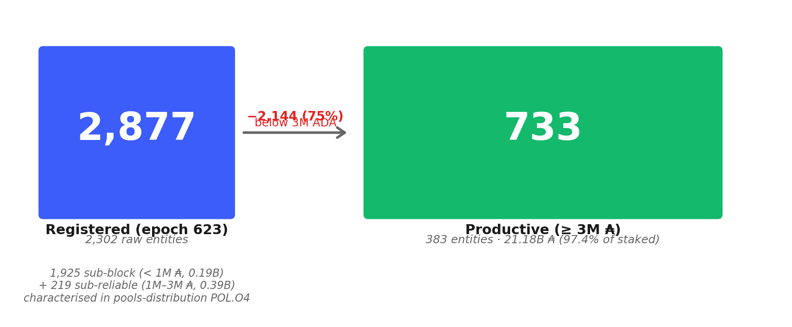
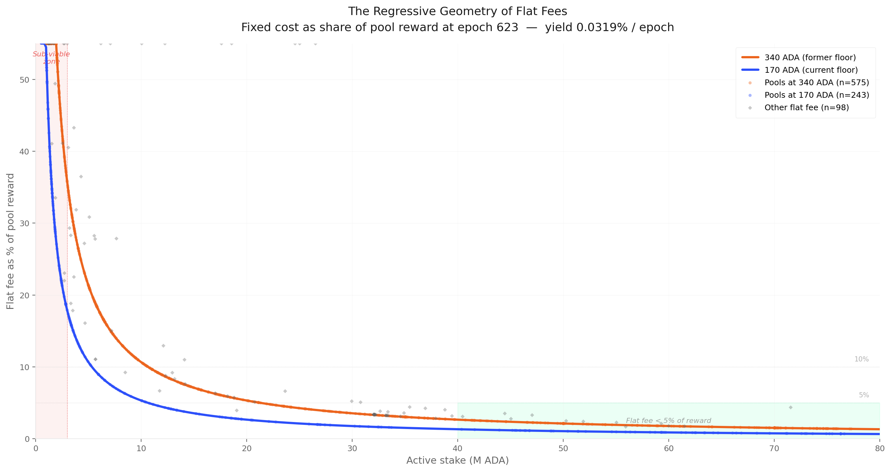
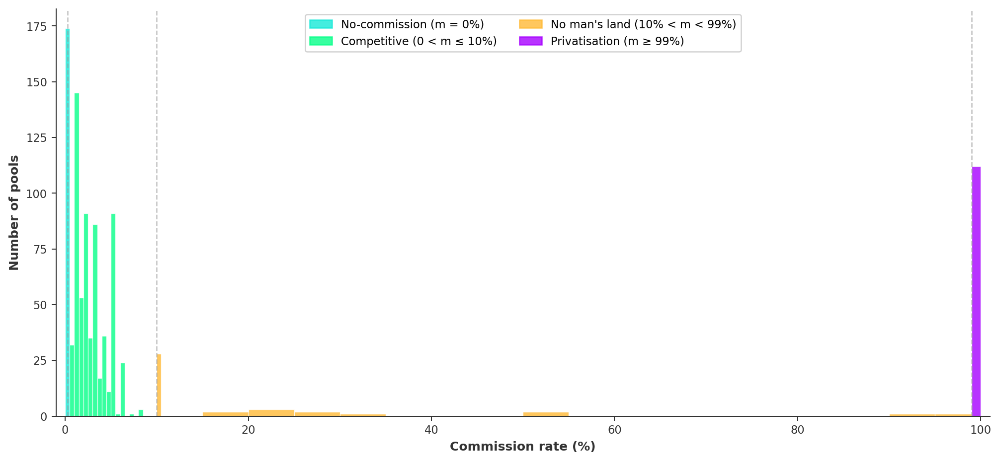
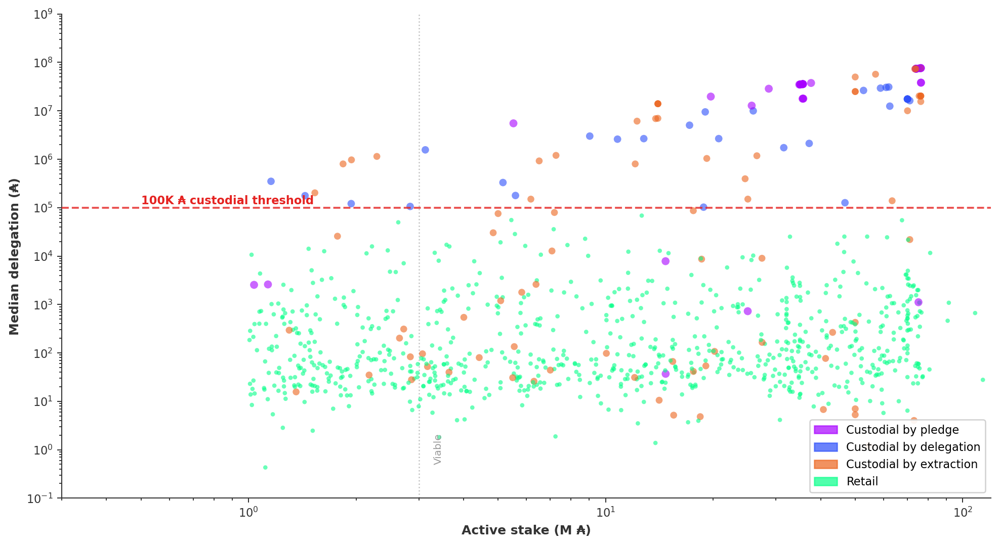
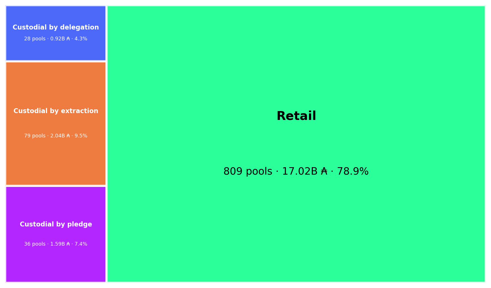
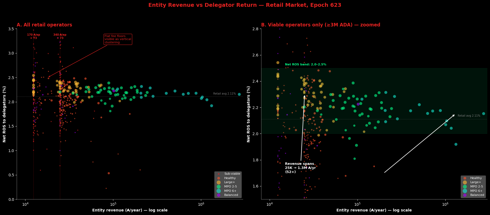
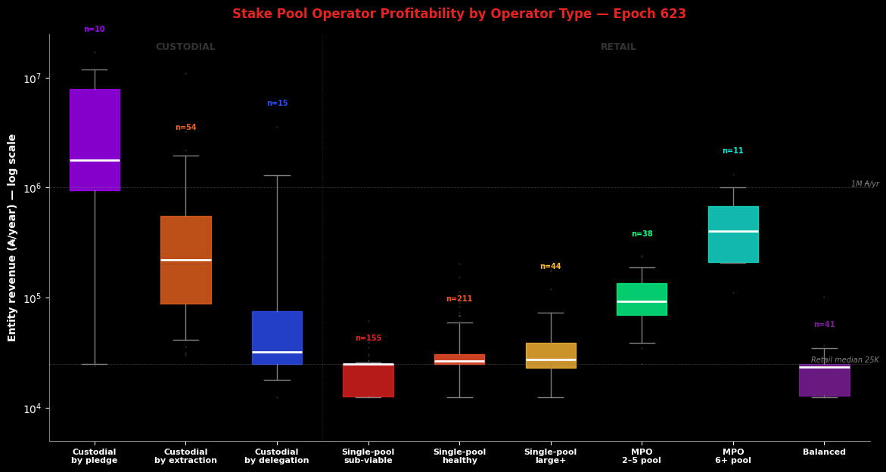
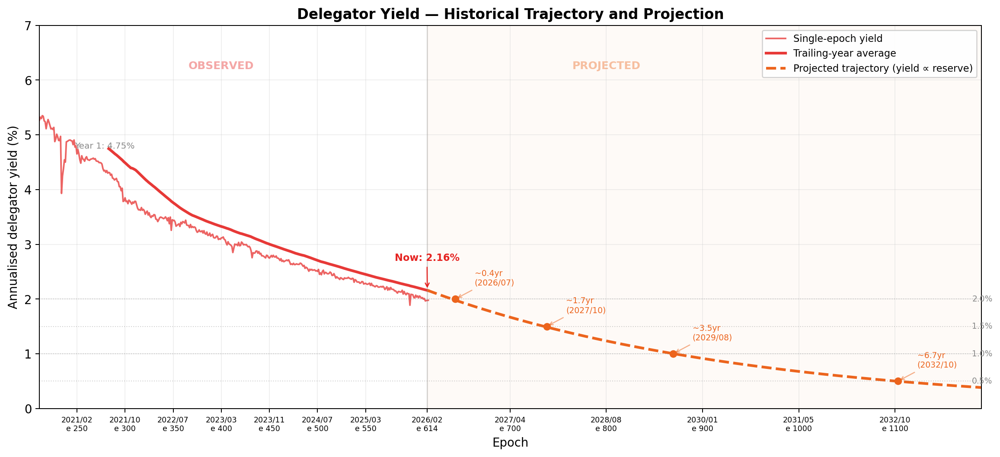
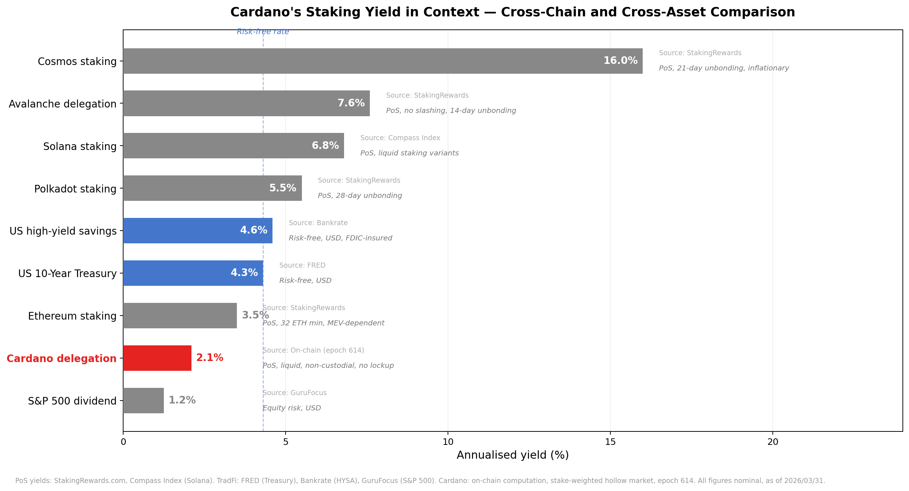

# The Operator's Cut — A Mainnet Analysis of Intra-Pool Reward Sharing

This report analyses the **third and final stage of Cardano's reward pipeline** — the intra-pool split — and traces the structural forces that determine how much of each pool's reward reaches delegators versus operators. It builds on the empirical baseline established in the [*Analysis of Cardano's Incentive Mechanism*](https://github.com/input-output-hk/spo-incentives/blob/main/report.pdf) (Lopez de Lara, 2025; hereafter the *Incentive Mechanism Analysis*) and operates downstream of the companion reports [*Treasury & Pool Pots Distribution*](../../treasury-and-pool-pots-distribution/mainnet-analysis/) (stage 1) and [*The Pools Pot Distribution Gaps*](../../pools-distribution/mainnet-analysis/) (stage 2).

Every epoch, once the reward curve assigns a total reward to each pool, a second mechanism activates. The pool operator extracts a **flat fee** (a fixed ₳ amount, on-chain `fixed_cost`) and a **commission** (a proportional share, on-chain `margin`); the remainder is distributed pro-rata among all stake holders. Together the flat fee and commission compose the operator's **pricing plan**; their sum — the **effective price** — is the fraction of pool reward that never reaches delegators. *This report asks how operators price, what the resulting market looks like, and whether the price-return relationship the mechanism produces can sustain the delegator–operator partnership the protocol depends on.*

At epoch 623, **733 productive pools** process **21.18B ADA** of staked capital. After filtering the **21%** of stake that is custodial (where the operator controls delegation addresses), the retail market consists of **809 pools, 516 entities, 17.02B ADA, and 1,272,836 delegators** — with a **median delegation of 87 ₳**. This is the population where the pricing plan produces a *genuine market outcome*.

**The flat fee dominates revenue but is frozen.** The flat fee delivers **60%** of retail operator revenue, yet behaves as a frozen governance artefact: **89.5%** of pools pick one of two floor values, and **64%** still declare the pre-halving **340 ₳** floor — **178 epochs** after governance halved it to **170 ₳**. The channel that dominates revenue is the one operators touch the least. Its shape is regressive: a fixed-in-₳ levy on a size-proportional reward produces a $1/\sigma$ hyperbola — **47.5%** of pool reward at the sub-reliable tier, **1.5%** at near-saturation. *No other major PoS protocol uses a flat fee — Ethereum, Solana, Cosmos, and Polkadot all price validators on proportional rules.*

**The commission market is bimodal with an empty middle.** **87%** of pools set a commission ≤ **10%**; **12%** set ≥ **99%** (privatisation); the **89-percentage-point range between them contains 12 pools**. Four discrete bands: no-commission (170 pools, 17.9%), competitive (658, 69.1%), no man's land (12, 1.3%), privatisation (112, 11.8%). *No economic attractor exists between competitive pricing and full extraction.*

**21% of productive stake is custodial through three mechanisms, each with distinct economics.** **79 entities** operating **143 pools** (4.55B ADA) are custodial via three on-chain-detectable patterns: **by pledge** (10 entities self-fund their pools, median **1.76M ₳/yr** revenue per entity), **by extraction** (57 entities charge ≥99% commission on inert delegators, **282K ₳/yr** median), and **by delegation** (15 entities operate pools where the median delegation exceeds 100K ₳ — a single whale's wallet, **29K ₳/yr** median). The three mechanisms produce three distinct economic outcomes — *only the retail residual exhibits market dynamics*.

**Delegators pay 18× more for the same return.** A delegator in a sub-reliable pool pays **48.3%** effective price for **2.04%** net return; a delegator in a near-saturation pool pays **2.7%** for **2.34%** — **18× the price for 0.30 percentage points of return**. Net return converges to **1.95–2.34%** across the entire retail market regardless of effective price, operator type, or pool size. *The return signal is too weak to discipline pricing — the discrimination threshold collapses inside block-production noise.*

**Operators who charge the most earn the least.** A sub-reliable single-pool operator absorbs **48.3%** of pool rewards but earns **24,820 ₳/yr**. An 11+ pool MPO absorbs **7.7%** but earns **1,035,496 ₳/yr** — **42× more revenue at 6× less effective price**. MPO revenue scales **horizontally** (more pools), not **vertically** (higher price): the 11+ pool bracket captures **26.5%** of retail rewards through 7 entities. **No single-pool operator in the retail market earns a competitive wage** — the median ~**25,000 ₳/yr** ($6,250 at $0.25/ADA) covers infrastructure but not the 5–15 hrs/month of skilled work; competitive compensation begins only at the 2-pool MPO tier (~68,700 ₳/yr). *The single-pool operator subsidises the network — and the flat fee penalises small-pool delegators without compensating small-pool operators.*

**Delegation follows visibility, not return.** **65.9%** of retail delegators sit in hollow MPO pools at **2.18%** net return; hollow single-pool near-saturation pools offer **2.34%** — **0.16pp** more — yet hold only **2.7%** of delegators. The pledge premium is *negative* in the retail data: balanced median net return **1.98%** vs hollow **2.08%**, because the flat fee drag (1.06pp for balanced, 0.47pp for hollow single-pool) overwhelms the pledge benefit. *The incentive mechanism's core assumption — that delegators can differentiate pools by return — fails in the empirical record.*

**The mechanism is on a structural clock.** Reserve depletion compresses the yield surface every epoch. Delegator yield has fallen **5.3% → 2.0%** in 413 epochs (5.5 years), tracking reserve depletion with $R^2 = 0.99$; projected sub-**1.5%** within ~1.7 years, sub-**1.0%** within ~3.5 years. At 2.0%, Cardano sits below the USD risk-free rate (4.3%) and at the bottom of the PoS landscape. As the epoch pot shrinks, the fixed-in-₳ flat fee consumes a growing share of pool rewards — *the confiscatory zone expands upward every epoch* — and the **0.39pp** retail yield spread compresses proportionally (at 1.0% base yield, the same relative dispersion produces ~0.20pp, indistinguishable from block-production noise). The decline is irreversible without protocol-level intervention: it is built into the monetary expansion formula. *The selection ratchet against single-pool operators tightens with every epoch.*

The remainder of the report walks the analysis in four parts: [the formula](#2-the-formula-intra-pool-reward-sharing) presents the SL-D1 split rule in three layers (original notation → residual-split decomposition → reader-friendly rewrite → mainnet parameterisation); [the productive population](#3-the-productive-population) traces the operator and delegator sides from raw certificates to the productive set (≥3M ADA); [the pricing plan landscape](#4-the-pricing-plan-landscape) analyses the flat fee, commission, custodial/retail boundary, operator profitability, and delegator return; [the delegator yield](#5-the-delegator-yield-trajectory-context-and-structural-compression) traces the trajectory, cross-chain comparison, and structural compression. All counts and amounts use epoch **623**. Source data: `pool_choice_quality_623.csv`, `pool_median_delegation_623.csv` (db-sync `epoch_stake`), `reward_split_snapshot_623.csv` (synthetic, estimated from epoch 614 reward rate), `koios_pool_history_mainnet.csv`, `mpo_entity_pool_mapping_mainnet.csv`.

# Table of Contents

1. [Mainnet Observations](operator.html#1-mainnet-observations)
2. [The formula — intra-pool reward sharing](#2-the-formula-intra-pool-reward-sharing)
   - 2.1 [SL-D1 (Original)](#21-sl-d1-original)
   - 2.2 [Residual split decomposition](#22-residual-split-decomposition)
   - 2.3 [Reader-friendly formulation](#23-reader-friendly-formulation)
   - 2.4 [Mainnet parameterization](#24-mainnet-parameterization)
   - 2.5 [Concept glossary](#25-concept-glossary)
3. [The productive population](#3-the-productive-population)
   - 3.1 [Operators](#31-operators)
   - 3.2 [Delegators](#32-delegators)
4. [The pricing plan landscape](#4-the-pricing-plan-landscape)
   - 4.1 [The flat fee (fixed cost)](operator.html#41-the-flat-fee-fixed-cost)
   - 4.2 [The commission (margin)](#42-the-commission-margin)
   - 4.3 [Custodial versus retail](#43-custodial-versus-retail)
      - 4.3.1 [Clear custodial — by pledge and by extraction](#431-clear-custodial-by-pledge-and-by-extraction)
      - 4.3.2 [Custodial by delegation — the high-concentration signal](#432-custodial-by-delegation-the-median-delegation-signal)
      - 4.3.3 [Summary](#433-summary)
   - 4.4 [Operator profitability versus delegator return](#44-operator-profitability-versus-delegator-return)
   - 4.5 [Is operator revenue competitive? — a market benchmark](#45-is-operator-revenue-competitive-a-market-benchmark)
      - 4.5.1 [The cost of operating a pool — infrastructure and labour](#451-the-cost-of-operating-a-pool-infrastructure-and-labour)
      - 4.5.2 [Revenue versus cost — a price-sensitivity view](#452-revenue-versus-cost-a-price-sensitivity-view)
      - 4.5.3 [Cross-chain comparison — the validator cost spectrum](#453-cross-chain-comparison-the-validator-cost-spectrum)
      - 4.5.4 [Implications](#454-implications)
5. [The delegator yield — trajectory, context, and structural compression](#5-the-delegator-yield-trajectory-context-and-structural-compression)
   - 5.1 [The yield trajectory — level and decline](#51-the-yield-trajectory-level-and-decline)
   - 5.2 [The yield in context — cross-chain and cross-asset comparison](#52-the-yield-in-context-cross-chain-and-cross-asset-comparison)
   - 5.3 [The yield spread — structural compression](#53-the-yield-spread-structural-compression)

# 1. Mainnet Observations

_Terminology note._ The protocol uses "fixed cost" and "margin" for the two extraction channels. This report adopts pricing-plan terminology: the fixed cost is the **flat fee** (a fixed ₳/epoch amount), the margin is the **commission** (a proportional share), and their sum — the operator take — is the **effective price** the delegator faces. The on-chain parameter names appear in §2 (the formula) and at first use in §4. Everywhere else, the pricing-plan terms apply.

| # | Observation | Section | Nature |
| --- | --- | --- | --- |
| | **OPE.O1 — The flat fee (fixed cost) dominates operator revenue — but governance sets it, and operators resisted the last cut** | | The flat fee delivers **60%** of retail operator revenue — yet operators don't compete on it. **89.5% of pools pick one of two floor values** (the ones governance allows), so the parameter is effectively a **governance-set price**, not a competitive lever. When governance halved the floor from **340 ₳ to 170 ₳** in 2023, only ~36% of operators moved to the new floor — **64% still declare 340 ₳ today, 178 epochs (~1.5 years) after the cut**. *Operators are slow to follow even governance, and they actively resisted lowering the price the cut was meant to deliver to delegators.* |
| OPE.O1.F1 | **The passive channel dominates the active one — the flat fee delivers 60% of operator revenue, the commission only 40%.** Across the retail market, the fixed ₳/epoch flat fee accounts for **60%** of operator revenue; the proportional commission accounts for the remaining **40%**. *The channel that dominates revenue is the one operators almost never touch.* | [Operator profitability versus delegator return](#44-operator-profitability-versus-delegator-return) | Structural — the passive channel dominates the active one |
| OPE.O1.F2 | **Governance halved the floor 178 epochs ago — 64% of pools have not moved.** The `minPoolCost` floor was halved from **340 ₳ to 170 ₳** through a successful governance action. **178 epochs later** (~1.5 years), **64% of pools still declare 340 ₳** — including most of the largest entities. *The price most operators charge is not a pricing decision; it is a governance setting they never revised.* | [The flat fee (fixed cost)](operator.html#41-the-flat-fee-fixed-cost) | Governance inertia — driven by the largest entities |
| OPE.O1.F3 | **The flat fee is a binary choice, not a pricing parameter.** **89.5% of pools declare one of two floor values** (170 ₳ or 340 ₳). The "custom" values that exist are mostly near-floor inertia (Binance 345, Everstake 400) or commission-mode extraction. *Operators are not pricing — they are picking a floor.* | [The flat fee (fixed cost)](operator.html#41-the-flat-fee-fixed-cost) | The flat fee is a binary choice, not a pricing parameter |
| OPE.O1.F4 | **The flat fee is regressive by design — a fixed ₳ levy on a size-proportional reward.** Because the pool reward grows roughly linearly with stake $\sigma$ but the flat fee is fixed in ₳, the fee's share of pool reward follows a $1/\sigma$ hyperbola — **47.5%** of pool reward at the sub-reliable tier, **1.5%** at near-saturation. The same 170 ₳ that disappears in a saturated pool's accounts is a **third of all rewards** in a sub-reliable pool's accounts | [The flat fee (fixed cost)](operator.html#41-the-flat-fee-fixed-cost) | Regressive by design — a fixed-in-₳ levy on a size-proportional reward |
| OPE.O1.F5 | **No other major PoS protocol uses a flat fee — the fixed-cost model is unique to Cardano.** Ethereum (validator-flat reward via the protocol), Solana (commission), Cosmos (commission), and Polkadot (commission) all price validators on **proportional rules** that scale with stake. The Cardano flat fee has no cross-chain precedent or comparator — meaning the regressive dynamics in F4 are unique to this network | [The flat fee (fixed cost)](operator.html#41-the-flat-fee-fixed-cost) | Unique to Cardano — no cross-chain precedent |
| | **OPE.O2 — The commission (margin) is doing two unrelated jobs: pricing a service on one side, privatising a pool without pledging on the other** | | The commission was designed as the operator's pricing tool: set a rate, charge it on each reward. On mainnet that role has split in two. **87% of pools use it as intended** — commission ≤ 10%, pricing the service. **12% of pools set it ≥ 99%**, taking essentially all rewards regardless of who delegates: *a private pool funded by delegation*, functionally equivalent to a self-pledged pool but **without locking any capital**. The 89-percentage-point range between the two uses is essentially empty (only 12 pools). *The protocol exposes a continuous parameter; operators reduce it to two unrelated economic stances — price a service, or quietly privatise the pool.* |
| OPE.O2.F1 | **The commission distribution is bimodal with an 89pp empty middle.** **87% of pools** set a commission **at or below 10%**; **12%** set **≥ 99%** (privatisation). The **89-percentage-point range between 10% and 99% contains only 12 pools**. *No economic attractor exists between competitive pricing and total extraction* — operators either compete or fully privatise their pool, and almost no one in between | [The commission (margin)](#42-the-commission-margin) | No man's land — no attractor between pricing and extraction |
| OPE.O2.F2 | **The market self-organises into four discrete tiers, not a continuous price distribution.** No-commission (**170 pools, 17.9%** — almost certainly self-pledged), competitive (**658 pools, 69.1%** — at or below 10%), no man's land (**12 pools, 1.3%** — between 10% and 99%), privatisation (**112 pools, 11.8%** — at or above 99%). *The four bands are an emergent equilibrium, not a design choice — the formula offers a continuous parameter and operators reduce it to four economic stances.* | [The commission (margin)](#42-the-commission-margin) | The market self-organises into discrete tiers |
| | **OPE.O3 — 21% of productive stake is custodial — three mechanisms, three economics** | | **21.1% of productive stake** sits in pools where the operator effectively *keeps* the rewards rather than delivering them to a retail delegation market. The delegation flow exists on-chain, but it isn't doing the work the formula assumes — the operator is. Three on-chain-detectable mechanisms achieve this, with very different per-entity economics:  **(i) By pledge — self-funded pools.** 10 entities self-stake their own pools (operator owns ≥95% of the delegation). They capture 100% of rewards because *they are the delegators*. Median: **1.76M ₳/yr** per entity.  **(ii) By extraction — near-100% commission.** 57 entities set the commission ≥ 99%, taking essentially all rewards regardless of who delegates. The pool is funded by delegation, but the operator collects everything (see [OPE.O2](operator.html#1-mainnet-observations)). Median: **282K ₳/yr**.  **(iii) By delegation — whale-only pools.** 15 entities operate pools where the *typical* (median) delegation exceeds 100K ADA — meaning the "delegators" are a small circle of whales, not retail. The pool serves an inner circle, not the open market. Median: **29K ₳/yr**.  *The three mechanisms produce three very different revenue scales (60× spread), but share the same underlying property: the open delegation market is not allocating this stake — the operator is.* |
| OPE.O3.F1 | **A fifth of productive stake is custodial — and it splits into three distinct mechanisms, not one.** **79 entities operating 143 pools** hold **4.55B ADA — 21.1% of productive stake** in custodial pools. The split: **(i) by pledge** (10 entities, 36 pools, **1.59B** — operator self-funds the pool); **(ii) by extraction** (57 entities, 79 pools, **2.04B** — high commission on inert delegators); **(iii) by delegation** (15 entities, 28 pools, **0.92B** — typical delegation ≥100K ₳). *Each mechanism is detectable from on-chain observables and produces a different operator economics* | [Custodial versus retail](#43-custodial-versus-retail) | Three distinct mechanisms |
| OPE.O3.F2 | **The median delegation is what separates retail from custodial — not the mean.** Custodial-by-delegation flags pools where the **per-pool median delegation** (db-sync `epoch_stake`) is **≥ 100K ₳** — i.e., where the *typical* delegator is a whale, not the average dragged up by one whale. For comparison, a delegation of 50K ₳ is already in the **top 1.5%** of all delegations on the network. *The median measures the delegator's experience; the mean measures capital concentration. They are not the same signal.* | [Custodial by delegation — the median delegation signal](#432-custodial-by-delegation--the-median-delegation-signal) | The median measures delegator experience |
| OPE.O3.F3 | **Each custodial mechanism produces a different economic outcome — by an order of magnitude.** Median operator revenue per entity: **custodial-by-pledge: 1,759,252 ₳/yr** (operator captures 100% of rewards on self-funded pools); **custodial-by-extraction: 281,831 ₳/yr** (privatisation commission on inert-delegator pools); **custodial-by-delegation: 29,329 ₳/yr** (small whale pools, not revenue machines). *Treating "custodial" as one population obscures a 60× revenue spread* | [Summary](#433-summary) | Each custodial mechanism is its own economy |
| | **OPE.O4 — The retail market is 79% of stake and the typical delegator holds 87 ₳** | | Once custodial pools are filtered out, the retail market is **809 pools, 516 entities, 17.02B ADA and 1,272,836 delegators** — with a **median delegation of 87 ₳** that is remarkably uniform across operator types, from independent single-pool to Coinbase and Binance. |
| OPE.O4.F1 | **Once custodial pools are filtered out, the retail market is bigger than mean-based estimates suggested — and it includes institutions.** **809 retail pools, 516 entities, 17.02B ADA, 1,272,836 delegators**. The retail-by-median-delegation classification keeps Coinbase, Binance, Kiln and other institutional operators *inside* the retail market — because their *typical delegator* is a small holder, even if the institutional brand is large. *The retail market is the population the mechanism was designed for; it is the population every reform has to address* | [Summary](#433-summary) | The retail market is larger than mean-based estimates |
| OPE.O4.F2 | **The typical retail delegator holds 87 ₳ — and the median is remarkably uniform across operator types.** The median retail delegation across the entire 1.27M-delegator population is **87 ₳**. Per-operator-type medians range from **45 to 962 ₳** — a tight 20× span across pool types from independent single-pool to Coinbase. *Retail delegators are small, homogeneous, and yield-insensitive at this scale — any reform that prices below 87 ₳/year of incremental yield will not change their behaviour* | [Operator profitability versus delegator return](#44-operator-profitability-versus-delegator-return) | Retail delegators are small and homogeneous |
| | **OPE.O5 — Delegators pay 18× more for the same return** | | A sub-reliable delegator pays **48.3%** effective price for **2.04%** net return; a near-saturation delegator pays **2.7%** for **2.34%** — **18× the price for 0.30 percentage points** of extra yield. Net return converges to **1.95–2.34%** across the entire retail market — a signal too narrow to discipline pricing. |
| OPE.O5.F1 | **A delegator pays 18× more for 0.30 percentage points of extra yield.** A delegator in a sub-reliable pool pays a **48.3% effective price** (flat fee + commission as % of pool reward) for a **2.04% net return**. A delegator in a near-saturation pool pays **2.7%** for **2.34%** — 18× lower price for 0.30pp more return. *The effective price is a mechanical artefact of pool size (the flat fee's 1/σ regression), not a market signal — operators are not pricing competitively, the formula is pricing them* | [Operator profitability versus delegator return](#44-operator-profitability-versus-delegator-return) | Effective price is a 1/σ artefact, not a signal |
| OPE.O5.F2 | **Net return converges to a narrow 1.95–2.34% band across the entire retail market — the signal is too weak to drive delegation.** Regardless of pool size, operator type, or pricing plan, a retail delegator's **net yield ends up between 1.95% and 2.34%** — a **0.39 percentage point** spread across the whole market. *At this resolution, the yield signal cannot discipline operator pricing — delegators are not chasing 0.4pp of return; they are picking on visibility, brand, or convenience* | [Operator profitability versus delegator return](#44-operator-profitability-versus-delegator-return) | Return signal too narrow to discipline pricing |
| | **OPE.O6 — Stake pool operator profitability ranges from 24K to 1M ₳/yr — operators who charge the most earn the least** | | Operator revenue scales with fleet size, not price — the sub-reliable single-pool operator absorbs **48.3%** of pool rewards for **24,820 ₳/yr**, while an 11+ pool MPO absorbs **7.7%** for **1,035,496 ₳/yr** (**42× more revenue at 6× less price**). No single-pool operator in the retail market earns a competitive wage. |
| OPE.O6.F1 | **The operators who charge the most earn the least — and vice versa.** A sub-reliable single-pool operator absorbs **48.3%** of pool rewards but earns only **24,820 ₳/yr**. An 11+ pool MPO absorbs only **7.7%** of pool rewards but earns **1,035,496 ₳/yr** — **42× more revenue at 6× less effective price**. *The flat fee penalises small-pool delegators without compensating the operators who run those pools — both sides of the small-pool transaction lose* | [Operator profitability versus delegator return](#44-operator-profitability-versus-delegator-return) | Small pools penalise both sides |
| OPE.O6.F2 | **MPO revenue scales horizontally (more pools), not vertically (higher price).** The **11+ pool bracket captures 26.5% of retail rewards through 7 entities**. Their per-pool fee is the same 170/340 ₳ floor everyone else uses — they win by running more pools, not by pricing differently. *Fleet size, not pricing, drives MPO operator economics — meaning a reform that targets pricing leaves fleet revenue untouched* | [Operator profitability versus delegator return](#44-operator-profitability-versus-delegator-return) | Fleet size, not pricing, drives operator economics |
| OPE.O6.F3 | **The retail market is dominated by hollow operators — 95% of revenue, 0% pledge.** **57 hollow MPOs capture 64.4% of retail rewards**; **414 hollow single-pool operators share 31.1%**. Together hollow operators absorb **95.5% of retail reward flow** through pools that pledge near-zero. The **41 balanced operators** (those with meaningful pledge) share only **1.2%**. *Pledge is not the dominant revenue strategy — neither for fleets nor for single-pool operators* | [Operator profitability versus delegator return](#44-operator-profitability-versus-delegator-return) | Structural concentration on hollow operators |
| OPE.O6.F4 | **No single-pool operator in the retail market earns a competitive wage for their labour.** Median single-pool revenue is **~25,000 ₳/yr (~$6,250 at $0.25/ADA)** — covers infrastructure (~$1,300–3,200/yr) but not the **5–15 hours/month of skilled DevOps** at any reasonable hourly rate. Competitive compensation begins only at the **2-pool MPO tier (~68,700 ₳/yr)**. *The single-pool operator is economically subsidising the network — sustained by non-economic motivation, not by the reward mechanism* | [Is operator revenue competitive? — a market benchmark](#45-is-operator-revenue-competitive--a-market-benchmark) | Single-pool operators subsidise the network |
| | **OPE.O7 — Delegation follows visibility, not return** | | Delegators do not chase yield — **65.9%** sit in hollow MPO pools at **2.18%** net return while hollow single-pool near-saturation peers offer **2.34%**. The pledge premium is negative once the flat fee drag (**1.06pp** for balanced vs **0.47pp** for hollow) is priced in. |
| OPE.O7.F1 | **Two thirds of retail delegators sit in pools that pay less than the alternative — yield is not what they are choosing on.** **65.9% of retail delegators sit in hollow MPO pools at 2.18% net return**; hollow single-pool near-saturation pools offer **2.34% — 0.16pp more** — and yet hold only **2.7% of delegators**. *Delegators are not chasing yield — they are picking on visibility, brand, exchange convenience, or default selection. The return signal does not drive delegation* | [Operator profitability versus delegator return](#44-operator-profitability-versus-delegator-return) | Delegation follows visibility, not return |
| OPE.O7.F2 | **The pledge premium is *negative* in the retail data — balanced operators deliver less net return than hollow ones.** Balanced (genuine pledge commitment) operators deliver a median net return of **1.98%**; hollow operators deliver **2.08%**. The reason is mechanical: **balanced single-pool operators incur a 1.06pp flat-fee drag vs 0.47pp for hollow ones**, and that drag overwhelms whatever pledge premium the reward curve is supposed to add. *The incentive mechanism's core assumption — that pledge commitment translates to better delegator outcomes — does not hold in the data* | [Operator profitability versus delegator return](#44-operator-profitability-versus-delegator-return) | The mechanism's core assumption fails |
| | **OPE.O8 — Reserve depletion is a structural clock: every epoch, the pot shrinks, the confiscatory zone widens, and yields erode** | | Reserve depletion is a structural clock built into the formula. Yield has fallen **5.3% → 2.0%** in **413 epochs** (R² = 0.99 with reserve), and the trajectory is irreversible without protocol-level intervention.  **Concrete projections** (from epoch 623, ~April 2026): **~12 months out (~Q2 2027)** — yield at ~**1.7%**. **~20 months out (~Q4 2027)** — yield crosses **1.5%**. **~42 months out (~Q3 2029)** — yield crosses **1.0%**.  Each epoch the pot shrinks, the fixed-in-₳ flat fee consumes a growing share of pool rewards, and the retail yield spread compresses toward block-production noise. *The failures documented in §4 don't stay still — they degrade every epoch by the same mechanical clock.* |
| OPE.O8.F1 | **The delegator yield has fallen from 5.3% to 2.0% in 5.5 years and the decline is built into the formula.** Yield has tracked reserve depletion with **$R^2 = 0.99$** across **413 epochs**. Projection from epoch 623 (~April 2026): **~1.7%** within ~12 months, **sub-1.5% within ~20 months (~Q4 2027)**, **sub-1.0% within ~42 months (~Q3 2029)**. *The decline is irreversible without protocol-level intervention — it is built into the monetary expansion formula. The entire yield surface descends as a unit; no pool-level strategy can offset the macro trajectory* | [The yield trajectory — level and decline](#51-the-yield-trajectory-level-and-decline) | Yield decline is structural, not pool-level |
| OPE.O8.F2 | **The confiscatory zone expands upward every epoch — the failures in §4 are not static, they get worse mechanically.** As the epoch pot shrinks, the flat fee (fixed at 170/340 ₳) consumes a growing share of pool rewards — the confiscatory zone from [§4.1](operator.html#41-the-flat-fee-fixed-cost) expands upward. The 0.39pp retail yield spread compresses proportionally: at **1.0% base yield (~Q3 2029), the same relative dispersion produces ~0.20pp** — indistinguishable from block-production noise. Pools productive today will cross the sub-reliable threshold purely from macro depletion. *The failures documented in §4 are not static — they degrade every epoch* | [The yield spread — structural compression](#53-the-yield-spread-structural-compression) | Failures degrade every epoch |
| OPE.O8.F3 | **The declining yield is a selection ratchet against small single-pool operators.** The flat fee is fixed in absolute terms while the epoch pot shrinks — the confiscatory zone expands upward every epoch. Single-pool operators bear the full drag with no fleet to amortise it; multi-pool operators are insulated by horizontal scaling. *The structural feedback loop (yield compression → confiscatory expansion → single-pool attrition → delegation migration → fleet concentration) drives the centralisation the mechanism was designed to prevent* | [The yield spread — structural compression](#53-the-yield-spread-structural-compression) | The mechanism selects against its smallest operators and reinforces its largest |
| | **OPE.O9 — Cardano's yield is no longer competitive — and the case for staking now rests on an ADA appreciation that hasn't materialised** | | At **2.0%**, Cardano's delegation yield sits **below the USD risk-free rate (4.3%)** and at the **bottom of the PoS chains' yield ladder**. No other major chain combines this low a yield with liquid, non-custodial, slashing-free design.  The mechanism's design premise was that delegators stake because **(i)** the yield itself is meaningful and **(ii)** ADA appreciates in real terms (the formula's monetary design assumes deflation-like behaviour). **Both assumptions are now under stress.** The yield premise has empirically degraded (OPE.O8); and ADA has not shown the appreciation/deflation behaviour the formula was designed around — the case for delegation now rests almost entirely on a price thesis the protocol cannot guarantee.  *If ADA fails to deliver real appreciation, the psychological effect compounds: delegators face low yield AND uncertain price, leaving only conviction-driven holders. The mechanism assumes yield-sensitive delegators; the regime now selects against them.* |
| OPE.O9.F1 | **At 2.0%, Cardano sits below the USD risk-free rate and at the bottom of the PoS landscape.** Cardano's current **2.0%** delegation yield is **below the USD risk-free rate of 4.3%** and at the **bottom of the PoS chains' yield ladder**. No other major chain combines this low a yield with liquid, non-custodial, slashing-free design. *The low return is the cost of that design — but the design now asks delegators to accept a yield below the risk-free rate, which only conviction-driven holders will do* | [The yield in context — cross-chain and cross-asset comparison](#52-the-yield-in-context-cross-chain-and-cross-asset-comparison) | Yield is uncompetitive vs alternatives |
| OPE.O9.F2 | **The mechanism's premise depends on ADA appreciation that hasn't materialised — and if it doesn't, only conviction-driven holders remain.** The reward formula was designed around a monetary regime where ADA itself appreciates (the reserve-depletion design implies deflationary-like behaviour as the supply approaches its cap). In practice, ADA price has not delivered that appreciation, leaving delegators with **low yield + uncertain price**. The mechanism's assumption — that yield-sensitive delegators allocate based on competitive returns — collapses to a self-selected pool of long-conviction holders, who do not respond to the formula's pricing levers. *If the deflation premise fails, the psychological pressure compounds: there is no yield case AND no appreciation case, only a conviction case — which the formula cannot manufacture* | [The yield in context — cross-chain and cross-asset comparison](#52-the-yield-in-context-cross-chain-and-cross-asset-comparison) | Yield + price = double-sided pressure on the conviction case |

# 2. The formula — intra-pool reward sharing

These formulas define how a pool's realized allocation is split between the operator and the rest of the pool participants. The split happens only after the pool-level reward has already been computed and adjusted by apparent performance.

The distribution logic is sequential:

- first, the operator **flat fee** (on-chain: `fixed_cost`, denoted $c$) is deducted — a fixed ₳ amount per epoch
- second, the operator **commission** (on-chain: `margin`, denoted $m$) is applied to the remaining amount — a proportional share
- finally, the residual reward is distributed proportionally across all stake holders

The sum of flat fee and commission is the **effective price** (on-chain: `pool_fees`) — the fraction of pool reward that never reaches delegators.

In this final step, the operator still receives a stake-proportional share through the pledge held inside the pool, while delegators receive the complementary share.

The intra-pool split was specified in [*Design Specification for Delegation and Incentives in Cardano*](https://github.com/IntersectMBO/cardano-ledger/releases/latest/download/shelley-delegation.pdf) (Kant, Brünjes & Coutts, IOHK, 2019 — deliverable **SL-D1**, [Implications](#454-implications)). The mechanism has been operational on mainnet since the Shelley hard fork on 2020/07/29. The split logic itself has never been modified; the only governance action affecting the intra-pool split was the reduction of `minPoolCost` from 340 to 170 ADA at epoch 445 (2023/10/27).

## 2.1. SL-D1 (Original)

The operator and member rewards are two complementary views of the same split rule applied to the realized pool allocation.
Once the pool-level reward has been computed, the split follows the same sequence:

- cover the operator fixed cost first
- apply the operator margin to the remaining amount
- distribute the residual proportionally across stake holders

Under this rule, the operator receives both the explicit operator share and the stake-proportional share attached to the pledge held inside the pool, while each member receives a stake-proportional share of the residual amount.

Operator reward, using the operator stake-share ratio $\frac{s}{\sigma}$ as a single input:

$$
r_{\text{operator}}\left(\hat f,c,m,\frac{s}{\sigma}\right)=
\begin{cases}
\hat f, & \hat f \le c \\
 c + (\hat f-c)\left(m + (1-m)\frac{s}{\sigma}\right), & \hat f > c
\end{cases}
$$

Member reward, using the member stake-share ratio $\frac{t}{\sigma}$ as a single input:

$$
r_{\text{member}}\left(\hat f,c,m,\frac{t}{\sigma}\right)=
\begin{cases}
0, & \hat f \le c \\
(\hat f-c)(1-m)\frac{t}{\sigma}, & \hat f > c
\end{cases}
$$

## 2.2. Residual split decomposition

Before switching to reader-friendly variable names, it is useful to separate the split rule into the two regimes induced by the fixed operator cost $c$. Let

$$
\rho_{\text{operator}} = \frac{s}{\sigma}, \qquad
\rho_{\text{member}} = \frac{t}{\sigma}
$$

denote the operator and member pool-share ratios.

If the realized pool allocation does not cover the fixed cost,

$$
\hat f \le c
$$

then the operator absorbs the full realized reward and members receive nothing:

$$
r_{\text{operator}}(\hat f,c,m,\rho_{\text{operator}}) = \hat f,
\qquad
r_{\text{member}}(\hat f,c,m,\rho_{\text{member}}) = 0
$$

If instead the realized pool allocation is large enough to cover the fixed cost,

$$
\hat f > c
$$

let

$$
\mu(\hat f,c,m) := m(\hat f-c),
\qquad
\psi(\hat f,c,m) := (1-m)(\hat f-c)
$$

where $\mu(\hat f,c,m)$ is the operator margin extracted from the residual reward and $\psi(\hat f,c,m)$ is the remaining amount to be shared proportionally across stake holders.

The split then becomes

$$
r_{\text{operator}}(\hat f,c,m,\rho_{\text{operator}})
= c + \mu(\hat f,c,m) + \psi(\hat f,c,m)\,\rho_{\text{operator}}
$$

$$
r_{\text{member}}(\hat f,c,m,\rho_{\text{member}})
= \psi(\hat f,c,m)\,\rho_{\text{member}}
$$

This makes the three-layer structure explicit: fixed cost first, operator margin second, proportional sharing of the remainder third.

## 2.3. Reader-friendly formulation

Let the operator and member pool-share ratios be defined as:

$$
\rho^{\text{operator}}_{i} := \frac{s^{\text{pledged}}_{i}}{\sigma^{\text{totalStaked}}_{i}},
\qquad
\rho^{\text{member}}_{i} := \frac{\sigma^{\text{poolMember}}_{\text{delegated},i}}{\sigma^{\text{totalStaked}}_{i}}
$$

If the realized pool allocation does not cover the fixed cost,

$$
PoolPot^{\text{actual}}_{i} \le Cost^{\text{operator}}_{\text{fixed}}
$$

then the operator absorbs the full realized reward and members receive nothing:

$$
Reward^{\text{operator}} = PoolPot^{\text{actual}}_{i}
$$

$$
Reward^{\text{member}} = 0
$$

If instead the realized pool allocation is large enough to cover the fixed cost, define the three layers of the split directly as:

$$
Cost := Cost^{\text{operator}}_{\text{fixed}}
$$

$$
Margin := \mu^{\text{operator}}
\left(
PoolPot^{\text{actual}}_{i}-Cost^{\text{operator}}_{\text{fixed}}
\right)
$$

$$
Share := \left(1-\mu^{\text{operator}}\right)
\left(
PoolPot^{\text{actual}}_{i}-Cost^{\text{operator}}_{\text{fixed}}
\right)
$$

Then the split becomes:

$$
Reward^{\text{operator}} = Cost + Margin + Share\,\rho^{\text{operator}}_{i}
$$

$$
Reward^{\text{member}} = Share\,\rho^{\text{member}}_{i}
$$

This makes the split easy to read: fixed cost first, operator margin second, and proportional sharing of the remainder third.

A fundamental property becomes visible in this form. The operator's reward has two structurally distinct components:

$$
Reward^{\text{operator}} = \underbrace{Cost + Margin}_{\text{extracted from the pool's total reward}} + \underbrace{Share\,\rho^{\text{operator}}_{i}}_{\text{earned exactly as a delegator would}}
$$

The third term — $Share\,\rho^{\text{operator}}_{i}$ — is identical in form to any member's reward: a pro-rata share of the residual, proportional to the stake contributed.

For the capital the operator pledges into the pool, the protocol treats the operator *exactly* as it treats a delegator. **There is no special reward channel for pledge at this stage** — the operator earns the same per-ADA yield as every other participant in the pool.

What distinguishes the operator from a delegator is the first two terms: **$Cost$ and $Margin$**. These are the only channels through which the operator can redirect part of the reward flow that is generated by *other participants' stake*. The fixed cost is a flat extraction; the margin is a proportional extraction. Both apply to the pool's total reward before pro-rata distribution, and both reduce the yield that delegators receive.

In other words: the operator's *own* capital is rewarded **identically** to delegated capital. The operator's *privilege* — the compensation for running infrastructure, bearing the pledge risk, and maintaining the pool — is expressed **entirely through cost and margin**.

*The split formula does not reward the operator for pledging; it rewards the operator for operating.*

The pledge mechanism that makes commitment economically significant lives **upstream**, in the reward curve (§2 of the [main report](../../../README.md#2-the-player-populations)), not in the intra-pool split.

## 2.4. Mainnet parameterization

| Parameter | Value | Set by |
| --- | --- | --- |
| `minPoolCost` ($c_{\min}$) | 170 ADA (reduced from 340 at epoch 445) | Protocol parameter (governance) |
| Fixed cost ($c$) | Operator-declared, $\geq c_{\min}$ | Pool registration certificate |
| Margin ($m$) | Operator-declared, $\in [0, 1]$ | Pool registration certificate |

At epoch 623 (hollow-strategy pools): the majority of rewarded hollow-strategy pools declare $c = 340$ ADA (the former minimum). The median declared margin is 2.0%; the entity-level median is 1.0% and the stake-weighted mean is 3.8%.

## 2.5. Concept glossary

| Symbol | Name | Definition |
| --- | --- | --- |
| $\hat{f}$ | Actual pool reward | Performance-adjusted output of the reward curve (stage 2) |
| $c$ | Declared fixed cost | Operator-declared flat ADA, $\geq c_{\min}$ |
| $c_{\text{eff}}$ | Effective fixed cost | $\min(c, \hat{f})$ — the actual ADA deducted |
| $m$ | Margin | Operator's declared share of reward after cost deduction |
| $c_{\min}$ | Minimum pool cost | Protocol-enforced floor on $c$ (currently 170 ADA; formerly 340 ADA) |
| Operator take | $c_{\text{eff}} + m(\hat{f} - c_{\text{eff}})$ | Total declared-fee extraction (= on-chain `pool_fees`) |
| Delegator pot | $(1-m)(\hat{f} - c_{\text{eff}})$ | Amount entering pro-rata distribution |
| Effective tax | Operator take / $\hat{f}$ | Fraction of pool reward extracted before pro-rata |

# 3. The productive population

All analysis from §4 onwards operates on the **productive population** at epoch **623** — the subset of pools, operators, and delegations that clear the **production threshold (≥3M ADA)**: a 95% probability of producing ≥1 block per epoch (λ=3 in the Poisson model — see [POL.O3.F1](../../pools-distribution/mainnet-analysis/README.md#3-mainnet-observations) in the companion *Pools Pot Distribution* report). Below this threshold, pools produce blocks too sporadically for delegator returns or operator economics to be meaningful — they are dropped from the analysis here, then characterised separately in pools-distribution as the *sub-block* (< 1M) and *sub-reliable* (1M–3M) tails.

*Figure 3.1 — From raw to productive population at epoch 623 on both sides of the market. Of **2,302 raw entities** and **2,877 raw pools**, the productive set (pools ≥3M ADA, the 95%-block-probability bar) retains **383 entities** across **733 productive pools** holding **21.18B ADA** — 97.4% of all staked supply.*

## 3.1. Operators

| Segment | Entities | Pools | Stake | Share |
|---|---:|---:|---:|---:|
| **Raw total (`epoch_stake`)** | **2,302** | **2,877** | **21.75B** | **100%** |
| Sub-block tail (< 1M ADA — noise floor) | 1,742 | 1,925 | 0.19B | 0.9% |
| Sub-reliable tail (1M–3M ADA — block-producing but economically marginal) | 213 | 219 | 0.39B | 1.8% |
| **Productive total (≥3M ADA)** | **383** | **733** | **21.18B** | **97.4%** |
| *of which:* | | | | |
|   Identified entities | 83 | 449 | 16.24B | 76.7% |
|     — multi-pool fleets | 71 | 437 | 15.69B | 74.1% |
|     — single-pool attributed | 12 | 12 | 0.55B | 2.6% |
|   Unattributed single-pool operators | 284 | 284 | 4.94B | 23.3% |

The **219 sub-reliable pools** (1M–3M ADA) are block-producing in expectation but economically marginal: 91% are single-pool operators, 117 still declare the 340 ₳ flat fee, and 9 reach 100% effective price — the flat fee alone consumes the entire pool reward. They are characterised in [*Pools Pot Distribution* — POL.O4](../../pools-distribution/mainnet-analysis/README.md) as part of the sub-block tail; they are excluded from the operator-economics analysis here because the pricing-plan signal is dominated by the production-threshold geometry at that scale, not by operator decisions.

Entity attribution is a lower bound — operators using entirely separate infrastructure and branding for each pool remain invisible.

## 3.2. Delegators

The delegation pipeline starts from 1.85M raw delegation certificates and removes two layers of noise: zero-balance certificates (27% of raw — delegation records with no ADA behind them) and delegations to sub-productive pools.

| Segment | Delegations | Stake | Share | Pools |
|---|---:|---:|---:|---:|
| **Raw (delegation certificates)** | **1,847,713** | **—** | **—** | **3,190** |
| Zero-balance certificates (noise) | 492,678 | 0 | — | 313 |
| **`epoch_stake` total** | **1,355,035** | **21.75B** | **100%** | **2,877** |
| Sub-block tail delegations (< 1M pools) | 59,937 | 0.19B | 0.9% | 1,925 |
| Sub-reliable tail delegations (1M–3M pools) | 67,817 | 0.39B | 1.8% | 219 |
| **Productive pool delegations (≥3M)** | **1,227,281** | **21.18B** | **97.4%** | **733** |
| *of which:* | | | | |
|   Identified entity pools | 904,850 | 16.24B | 76.7% | 449 |
|   Unattributed single-pool operators | 322,431 | 4.94B | 23.3% | 284 |

The **1,227,281 delegations** in productive pools are where the pricing plan produces meaningful outcomes. The downstream analysis ([§4.3 — Custodial versus retail](#43-custodial-versus-retail)) decomposes this productive population into operator self-stake, custodial, and retail segments.

The companion [*Staking Census*](../../census/mainnet-analysis/) documents the full cleaning pipeline. All counts and amounts reference epoch **623** unless otherwise noted.

# 4. The pricing plan landscape

The formula gives operators two extraction channels: a fixed cost $c$ (on-chain: `fixed_cost`, constrained by protocol parameter `minPoolCost`) and a proportional margin $m$ (on-chain parameter `margin`). In pricing terms, the fixed cost functions as a **flat fee** — a fixed ADA amount per epoch, independent of pool size — and the margin functions as a **commission** — a proportional share of the reward after the flat fee is deducted. Together they compose the operator's pricing plan; their sum, the **operator take**, is the effective price the delegator faces. This section categorises the pool population along each pricing channel; [§4.3 — Custodial versus retail](#43-custodial-versus-retail) classifies the delegation side (custodial versus retail); and [§4.4 — Operator profitability versus delegator return](#44-operator-profitability-versus-delegator-return) crosses both to measure operator profitability against delegator return.

## 4.1. The flat fee (fixed cost)

The flat fee is the ADA amount deducted from every pool's reward before commission and pro-rata distribution (on-chain: declared `fixed_cost` $c$, constrained by protocol parameter `minPoolCost`). It is constrained by the protocol floor $c_{\min}$, currently **170 ₳** (reduced from 340 ₳ at epoch 445, on 2023/10/27).

> **Finding OPE.O1.F1 — The flat fee delivers 60% of retail operator revenue while behaving as a frozen governance artefact.** Across the retail market, the fixed-cost channel — set once and rarely revisited — generates **60%** of operator income; the actively priced commission channel generates only **40%**. The economic weight runs through the *passive* parameter, not the *active* one. The split inverts the usual intuition that operators compete on commission: in practice, the floor value an operator declared at registration dominates what they earn.

**No other major PoS protocol uses a flat fee** — Cosmos, Solana, Polkadot, Ethereum, and Tezos all use either a single proportional commission or no protocol-level fee at all. The flat fee is unique to Cardano, and its economic weight follows a **$1/\sigma$ hyperbola**: *confiscatory for small pools, invisible for large ones*.

> **Finding OPE.O1.F5 — No other major proof-of-stake protocol uses a flat fee.** **Ethereum, Solana, Cosmos, Polkadot, and Tezos** all price validators on proportional rules — a single commission, or no protocol-level fee at all. The fixed-cost channel is unique to Cardano. There is therefore no cross-chain comparator for the regressive geometry it produces, and no precedent for tuning it. Every observation about its effect on the pool economy is an observation about a **single-network experiment**.

At epoch 623, **89.5%** of the 733 productive pools declare one of the two floor values — **170 ₳ or 340 ₳**. The remaining 10.5% (100 pools) declare other values.

Decomposing this population reveals that the "custom" label conceals **three structurally distinct behaviours**:

- **Near-floor inertia** (Binance at 345 ₳, Everstake at 400 ₳, OCEAN at 500 ₳);
- **Extraction** (11 pools with FC > 500 ₳ and commission ≥ 99%);
- **A handful of single-pool operators** at intermediate values.

| Flat-fee strategy | Definition | Pools | Share | Entities | Stake (B) | Stake share | Delegators | Del. share |
|---|---|---:|---:|---:|---:|---:|---:|---:|
| **Adopted** | $c = 170$ ₳ (current floor) | 244 | 25.6% | 186 | 5.13 | 23.8% | 223,419 | 17.2% |
| **Legacy** | $c = 340$ ₳ (former floor) | 608 | 63.9% | 350 | 14.38 | 66.7% | 679,158 | 52.4% |
| **Near-floor** | $171 < c \leq 500$, $c \neq 170, 340$ | 84 | 8.8% | 48 | 1.82 | 8.4% | 381,652 | 29.5% |
| **Extraction** | $c > 500$ | 16 | 1.7% | 14 | 0.24 | 1.1% | 10,869 | 0.8% |

The inertia is **structural**: **70% of floor-declaring stake remains at 340 ₳**, 178 epochs after the reduction, driven by the largest entities (Coinbase, Kiln, Upbit, eToro, Wave) which have not updated.

> **Finding OPE.O1.F3 — The flat fee is a binary choice, not a continuous pricing parameter.** **89.5%** of productive pools declare one of two floor values (**170 ₳** or **340 ₳**); the remaining **10.5%** are split between **near-floor inertia** (Binance at **345 ₳**, Everstake at **400 ₳**) and outright **extraction** (16 pools above 500 ₳, typically paired with ≥ 99% commission). The "custom value" label conceals two structurally distinct behaviours and almost no genuine pricing in between. Operators do not set a flat fee — they pick one of two floors or signal extraction.

*OPE.4.1 — Flat-fee share of pool reward as a function of pool stake. Because the fee is fixed in ADA but reward scales with stake, the share absorbed follows a **$1/\sigma$** hyperbola — **47.5%** at the sub-reliable tier shrinking to **1.5%** near saturation, a **32×** span in effective extraction from the same nominal price.*

> **Finding OPE.O1.F4 — The flat fee follows a $1/\sigma$ hyperbola: 47.5% of pool reward at sub-reliable, 1.5% near saturation.** Because $c$ is fixed in ADA but the pool reward scales with stake, the share absorbed by the flat fee falls as $1/\sigma$. At the **sub-reliable tier** the channel consumes **47.5%** of pool reward; at the **near-saturation tier** it consumes only **1.5%**. The same nominal price produces a 32× span in effective extraction. The flat fee is therefore *regressive by design* — a fixed-in-ADA levy on a size-proportional reward — and the regressivity is the structure, not a calibration error.

> **Finding OPE.O1.F2 — 64% of pools still declare the former floor (340 ₳) — 178 epochs after the governance action halved it.** The inertia is not transient. It is driven by the largest entities and reflects a structural feature of the network: the flat fee is a set-and-forget parameter for most operators. Among the 219 sub-reliable pools (1M–3M ADA), the distribution mirrors the productive population (84 adopted, 117 legacy) — but the economic meaning is different. At this tier, a 170 ₳ flat fee absorbs ~27% of pool reward and a 340 ₳ fee absorbs ~54%. The adopted/legacy distinction, which is a governance-responsiveness signal for productive pools, becomes a confiscation-severity signal for sub-reliable ones.

## 4.2. The commission (margin)

The commission is the operator's proportional share of the reward after the flat fee is deducted (on-chain: `margin` $m \in [0, 1]$). Unlike the flat fee, which clusters at two protocol-floor values, the commission is continuously variable and has no enforced floor or ceiling. It is the only fully unconstrained parameter in the intra-pool split, and the one that most directly expresses the operator's pricing intent.

The commission distribution is bimodal: the median is 2.0% and has been stable for over 400 epochs. The distribution clusters at round values — 1%, 2%, 3%, 5%, 10% account for the bulk of the competitive band.

| Band | Range | Pools | Share | Stake (B) | Stake share | Delegators | Del. share | Economic logic |
|---|---|---:|---:|---:|---:|---:|---:|---|
| **No-commission** | $m = 0\%$ | 170 | 17.9% | 2.70 | 12.5% | 146,931 | 11.3% | Flat-fee-only pricing — the operator earns through the flat fee and pro-rata owner share only |
| **Competitive** | $0 < m \leq 10\%$ | 658 | 69.1% | 15.23 | 70.6% | 1,125,795 | 86.9% | The market norm — operators blend flat fee and commission. The upper end (6–10%) includes institutional operators: Binance, Figment, Blockdaemon, Kiln |
| **No man's land** | $10\% < m < 99\%$ | 12 | 1.3% | 0.09 | 0.4% | 331 | <0.1% | Structurally empty — 12 isolated pools scattered across an 89pp range |
| **Privatisation** | $m \geq 99\%$ | 112 | 11.8% | 3.55 | 16.5% | 22,041 | 1.7% | Total extraction — de facto private operation. Top entities: CHUCK BUX, Upbit, eToro |

**87% of pools price at or below 10%**; density drops to near zero above 10% and resurfaces only at **99–100%**.

No man's land makes the bimodality explicit: the **89pp gap** between competitive pricing and privatisation is a desert — an operator pricing above 10% is **either extracting** (and would go to 99%+) **or running a niche service** (and would not need more than 10%).

> **Finding OPE.O2.F1 — The commission distribution is bimodal with an 89pp structural gap.** 87% of pools sit at or below 10%; 12% sit at ≥ 99%. The range between 10% and 99% contains 12 pools. No economic attractor exists between competitive pricing and total extraction.

> **Finding OPE.O2.F2 — The market self-organises into four discrete commission bands.** **170 pools (17.9%)** charge no commission; **658 (69.1%)** sit in the competitive band (0–10%); **12 (1.3%)** occupy the 10–99% no-man's-land; **112 (11.8%)** declare privatisation (≥ 99%). The bands are not statistical artefacts — each carries a distinct economic logic, from flat-fee-only pricing through the market norm to total extraction. The **89pp** gap between competitive and privatisation is the absence of any viable strategy in between.

*OPE.4.2 — Commission distribution at epoch 623. The market self-organises into four discrete bands: **17.9%** of pools at no-commission, **69.1%** in the competitive 0–10% band, **1.3%** in the 10–99% no-man's-land, and **11.8%** at privatisation (≥ 99%) — with an **89pp** structural gap.*

**Commission bands × owner-stake strategy.** The bands cross-cut the three owner-stake strategies. The hollow segment fills all four bands. Balanced pools concentrate in no-commission and competitive with marginal presence in privatisation. Private pools occupy only competitive (3 pools — Wave and one anonymous) and privatisation — private × no-commission is empty because an operator who funds the pool has no reason to set commission to zero.

## 4.3. Custodial versus retail

Not all staked ADA is delegated by independent participants choosing a pool on the open market. A significant share is **custodial** — controlled by operators rather than by the on-chain delegators themselves. Identifying these pools is necessary before the profitability analysis ([§4.4 — Operator profitability versus delegator return](#44-operator-profitability-versus-delegator-return)) can isolate the genuine pricing market.

### 4.3.1. Clear custodial — by pledge and by extraction

Two mechanisms produce unambiguous custodial outcomes, detectable from a single on-chain observable.

**Custodial by pledge** — private-strategy entities (owner-stake ≥ 95%) that fund their pools with their own capital. The operator *is* the delegator. The commission (typically 100%) is self-directed — it never leaves the operator's control.

**Custodial by extraction** — non-private pools that declare a privatisation commission (≥ 99%). The operator does not fund the pool but captures virtually all rewards through the commission. Delegators earn near-zero yield; whether they remain through inertia, ignorance, or institutional constraint, their delegation is not a meaningful market signal.

### 4.3.2. Custodial by delegation — the median delegation signal

The third mechanism is more subtle. Some pools appear hollow to the protocol (low owner-stake, competitive commission) but their delegation is concentrated in few, large addresses — the hallmark of operator-routed capital.

The signal is the **median delegation** per pool, computed from the full `epoch_stake` distribution (db-sync, epoch 623). The median measures the amount held by the typical delegator in the pool. When it exceeds 100K ADA — meaning the typical delegator holds more than 100K — the pool is genuinely non-retail. A delegation of 50K ₳ is already in the top 1.5% of the network; a median above 100K indicates that the majority of addresses in the pool hold capital well above any retail threshold.

At epoch 623, **28 pools** (across 15 entities) exceed this threshold, carrying 0.92B ADA and 158 delegators. They split into two sub-populations:

| Sub-type | Entities | Pools | Stake (B) | Delegators | Profile |
|---|---:|---:|---:|---:|---|
| **Median ≥ 1M ₳** | 8 | 20 | 0.84 | 68 | Whale self-delegation pools with 2–6 delegators each holding millions. Pure capital parking |
| **Median 100K–1M ₳** | 8 | 8 | 0.08 | 90 | Smaller pools where the typical delegator holds 100K–1M — a mix of high-net-worth self-delegation and small custodial arrangements |

*OPE.4.3 — Per-pool median delegation against pool stake at epoch 623. **28 pools** across **15 entities** clear the 100K ₳ median threshold that separates custodial-by-delegation from retail — splitting into whale self-delegation pools (median ≥ 1M ₳) and smaller high-net-worth arrangements.*

### 4.3.3. Summary

The table below continues the population decomposition from §3:

| Segment | Entities | Pools | Share | Stake (B) | Stake share | Delegations | Del. share | Median deleg. (₳) | Med. entity revenue (₳/yr) |
|---|---:|---:|---:|---:|---:|---:|---:|---:|---:|
| **Productive total** | **383** | **733** | **100%** | **21.57** | **100%** | **1,227,281** | **100%** | **116** | **25,763** |
| Custodial by pledge | 10 | 36 | 3.8% | 1.59 | 7.4% | 122 | <0.1% | 35,579,368 | 1,759,252 |
| Custodial by extraction | 57 | 79 | 8.3% | 2.04 | 9.5% | 21,982 | 1.7% | 9,009 | 281,831 |
| Custodial by delegation (median ≥ 100K) | 15 | 28 | 2.9% | 0.92 | 4.3% | 158 | <0.1% | 3,008,028 | 29,329 |
|   ↳ Median ≥ 1M ₳ | 8 | 20 | 2.1% | 0.84 | 3.9% | 68 | <0.1% | 12,489,163 | 55,704 |
|   ↳ Median 100K–1M ₳ | 8 | 8 | 0.8% | 0.08 | 0.4% | 90 | <0.1% | 176,666 | 25,023 |
| **Total custodial** | **79** | **143** | **15.0%** | **4.55** | **21.1%** | **22,262** | **1.7%** | **1,038,234** | **151,744** |
| **Retail market** | **516** | **809** | **85.0%** | **17.02** | **78.9%** | **1,272,836** | **98.3%** | **87** | **25,235** |

*OPE.4.4 — Productive stake decomposed by custodial mechanism versus retail at epoch 623. Custodial holds **21.1%** of productive stake (4.55B ADA across 143 pools); retail captures **78.9%** (17.02B ADA across 809 pools and 1.27M delegations).*

The custodial segment is **smaller than the mean-APD estimate suggested** — **21.1%** of stake, not 49.9% — because most institutional pools (Coinbase, Binance, Kiln, YUTA) are retail by their delegation median. They route large capital through few addresses, but the majority of their delegators are small retail wallets.

> **Finding OPE.O3.F1 — 21.1% of productive stake is custodial, distributed across three on-chain-detectable mechanisms.** **79 entities** running **143 pools** hold **4.55B ADA** under operator-controlled delegation: **custodial-by-pledge** (10 entities, 36 pools, **1.59B ADA**), **custodial-by-extraction** (57 entities, 79 pools, **2.04B ADA**), and **custodial-by-delegation** (15 entities, 28 pools, **0.92B ADA**). Each mechanism is detectable from a single observable — owner-stake share, declared commission, or per-pool median delegation — and produces a different economic outcome. Filtering them out is what isolates the genuine retail pricing market analysed downstream.

The retail market — **809 pools, 516 entities, 17.02B ADA, 1,272,836 delegators** — encompasses **78.9% of productive stake** and **98.3% of delegation relationships**.

> **Finding OPE.O4.F1 — The retail market is larger than mean-based estimates suggested: 809 pools, 516 entities, 17.02B ADA, 1,272,836 delegators.** Once the three custodial mechanisms are filtered out, what remains carries **78.9%** of productive stake and **98.3%** of delegations. The set includes institutional operators (Coinbase, Binance, Kiln) — they qualify as retail by their per-pool *median* delegation rather than by their headline stake. This is the population where the pricing plan produces a genuine market outcome rather than an internal transfer.

> **Finding OPE.O4.F2 — The median retail delegation is 87 ADA — and remarkably uniform across operator types.** Across single-pool operators, multi-pool fleets, and institutional brands like Coinbase and Binance, the median sits in a tight **45–962 ADA** band. The typical delegator is small everywhere: the operator type does not select for delegator size. *Whatever else differs between hollow MPOs and single-pool operators, the customer they serve is the same person.* This homogeneity is what makes the 0.39 pp net-return spread (§4.4) effectively flat for the audience that actually receives it.

> **Finding OPE.O3.F2 — The median delegation separates custodial from retail by four orders of magnitude.** Custodial pools: 1,038,234 ₳ median. Retail pools: 87 ₳ median. A delegation of 50K ₳ is already in the top 1.5% of all delegations on the network.

> **Finding OPE.O3.F3 — Each custodial mechanism produces a different economic outcome.** Custodial-by-pledge entities earn 1,759,252 ₳/yr median — they fund their own pools and capture 100% of rewards. Custodial-by-extraction entities earn 281,831 ₳/yr — privatisation commission extracts from pools whose delegators have not re-delegated. Custodial-by-delegation entities earn 29,329 ₳/yr — these are small whale pools, not institutional revenue engines. The three mechanisms share the label "custodial" but produce economics that span two orders of magnitude.

## 4.4. Operator profitability versus delegator return

The effective price is only meaningful **in the retail market** — where the operator does not control the delegator addresses. In custodial pools, the "price" is an **internal transfer**; it carries no information about market competition. This section analyses the **809 retail pools** (516 entities, 17.02B ADA, 1,272,836 delegators) identified in [§4.3 — Custodial versus retail](#43-custodial-versus-retail).

The central question is what the pricing plan produces for each side of the market. The operator earns a **revenue** (the operator take, annualised in ₳/year); the delegator receives a **return** (the net ROS, after fees).

If the mechanism worked as intended, these two quantities would be **linked**: operators who charge more would earn more, and delegators would see a meaningful ROS difference that informs their delegation choice.

*The table below tests this assumption.*

| Operator type | Entities | Pools | Delegators | Del. share | Stake (B) | Median deleg. (₳) | Flat fee | Commission | Effective price | Gross ROS | Net ROS | Med. entity revenue (₳/yr) | Drag (pp) | Reward share |
|---|---:|---:|---:|---:|---:|---:|---:|---:|---:|---:|---:|---:|---:|---:|
| **Hollow single-pool** | **414** | **414** | **399,089** | **31.4%** | **5.29** | **78** | **7.0%** | **2.1%** | **9.1%** | **2.48%** | **2.08%** | **24,965** | **0.47pp** | **31.1%** |
|   ↳ Sub-reliable (<3M) | 155 | 155 | 52,557 | 4.1% | 0.28 | 72 | 47.5% | 0.8% | 48.3% | 3.89% | 2.04% | 24,820 | 1.59pp | 1.6% |
|   ↳ Healthy (3–38.5M) | 214 | 214 | 221,279 | 17.4% | 2.44 | 74 | 8.3% | 2.9% | 11.2% | 2.35% | 2.03% | 26,652 | 0.32pp | 14.3% |
|   ↳ Large healthy (38.5–62M) | 29 | 29 | 91,238 | 7.2% | 1.47 | 125 | 1.7% | 1.4% | 3.0% | 2.37% | 2.31% | 31,757 | 0.06pp | 8.7% |
|   ↳ Near-saturation (62–77M) | 16 | 16 | 34,015 | 2.7% | 1.11 | 962 | 1.2% | 1.5% | 2.7% | 2.40% | 2.34% | 27,244 | 0.04pp | 6.5% |
| **Hollow MPO** | **57** | **330** | **838,593** | **65.9%** | **10.95** | **107** | **3.0%** | **3.3%** | **6.3%** | **2.33%** | **2.18%** | **124,100** | **0.14pp** | **64.4%** |
|   ↳ 2-pool | 17 | 34 | 102,253 | 8.0% | 1.30 | 91 | 2.5% | 1.3% | 3.9% | 2.27% | 2.19% | 68,667 | 0.10pp | 7.7% |
|   ↳ 3–5 pool | 24 | 94 | 271,460 | 21.3% | 2.77 | 78 | 3.3% | 1.6% | 5.0% | 2.33% | 2.19% | 132,851 | 0.14pp | 16.3% |
|   ↳ 6–10 pool | 9 | 67 | 112,454 | 8.8% | 2.37 | 67 | 2.7% | 3.8% | 6.5% | 2.38% | 2.18% | 263,959 | 0.15pp | 13.9% |
|   ↳ 11+ pool | 7 | 135 | 352,426 | 27.7% | 4.51 | 292 | 3.0% | 4.7% | 7.7% | 2.31% | 2.15% | 1,035,496 | 0.20pp | 26.5% |
| **Balanced** | **41** | **42** | **15,844** | **1.2%** | **0.20** | **45** | **17.8%** | **1.4%** | **19.2%** | **3.06%** | **1.98%** | **23,513** | **1.06pp** | **1.2%** |
|   ↳ Single-pool sub-reliable (<3M) | 27 | 27 | 5,041 | 0.4% | 0.04 | 45 | 49.4% | 1.0% | 50.4% | 3.70% | 1.95% | 23,513 | 2.19pp | 0.3% |
|   ↳ Single-pool healthy (≥3M) | 13 | 13 | 4,051 | 0.3% | 0.10 | 56 | 11.2% | 1.1% | 12.3% | 2.41% | 2.14% | 17,199 | 0.43pp | 0.6% |
|   ↳ MPO | 1 | 2 | 6,752 | 0.5% | 0.06 | 25 | 5.2% | 2.0% | 7.2% | 2.40% | 2.22% | 101,849 | 0.17pp | 0.4% |
| **Retail total** | **516** | **809** | **1,272,836** | **100%** | **17.02** | **87** | **4.4%** | **2.9%** | **7.4%** | **2.45%** | **2.11%** | **25,235** | **0.41pp** | **100%** |

The table reads left to right: operator type → population → pricing channels (flat fee + commission as % of pool reward) → what the pool produces (gross ROS) → what the delegator receives (net ROS) → what the operator earns (median entity revenue annualised) → the cost to the delegator (Drag (pp)) → share of total retail pool rewards.

Three observations emerge from this decomposition.

**Delegators pay 18× more for the same return — and operators who charge the most earn the least.** A delegator in a sub-reliable pool pays **48.3%** effective price for **2.04%** net return; a delegator in a near-saturation pool pays **2.7%** for **2.34%**. *The price differs by 18×; the return by 0.30pp.*

On the operator side, the sub-reliable operator absorbs **48.3%** of pool rewards but earns **24,820 ₳/yr**; an 11+ pool MPO absorbs **7.7%** but earns **1,035,496 ₳/yr** — **42× more revenue at 6× less effective price**.

> **Finding OPE.O5.F1 — Delegators pay 18× more for the same return.** A delegator in a sub-reliable pool pays 48.3% effective price and receives 2.04% net return. A delegator in a near-saturation pool pays 2.7% and receives 2.34%. The effective price varies by 18× across pool tiers; the return varies by 0.30 percentage points. The pricing plan does not produce a signal that delegators can act on.

> **Finding OPE.O6.F1 — Operators who charge the most earn the least.** A sub-reliable single-pool operator absorbs 48.3% of pool rewards but earns 24,820 ₳/yr. An 11+ pool MPO absorbs 7.7% but earns 1,035,496 ₳/yr — 42× more revenue at 6× less effective price. The flat fee penalises small-pool delegators without compensating the operators who run those pools.

**155 sub-reliable single-pool operators** absorb 48.3% of their pools' output as effective price but operate on **just 1.6% of total retail rewards**. Meanwhile, hollow MPOs earn **3–42× more** (69k–1M ₳/yr) at a **lower** effective price (3.9–7.7%) — *the scaling is horizontal (more pools) rather than vertical (higher extraction)*.

> **Finding OPE.O6.F2 — Multi-pool operator revenue scales horizontally, not vertically.** Adding pools — not raising prices — is the path to higher entity income. The **11+ pool bracket** captures **26.5%** of all retail rewards through just **7 entities**, while the median entity revenue moves from **~25K ₳/yr** at the single-pool tier to **~1.04M ₳/yr** at the 11+ pool tier. The pricing channels (flat fee, commission) actually *fall* as fleet size rises. Fleet expansion, not price discovery, is the operating economic strategy in the retail market.

The reward share column makes the structural imbalance explicit:

- **57 hollow MPOs** operate on **64.4%** of the retail economy;
- **414 hollow single-pool operators** share **31.1%**;
- **41 balanced operators** share **1.2%**.

> **Finding OPE.O6.F3 — 414 hollow single-pool operators share 31.1% of retail rewards; 41 balanced operators share 1.2%.** The bulk of single-pool operators — **414 entities** with no MPO fleet and minimal owner-stake — collectively earn less than a third of the retail pool — averaging the **~25,000 ADA/yr** floor that does not cover labour at current ADA price. The **41 balanced operators** that *do* pledge meaningfully are the squeezed middle: they bear the flat-fee drag (1.06 pp) without the fleet leverage that compensates hollow MPOs. The reward share is consistent with the operator-distribution shape: a heavy-tailed MPO economy on top, a thin balanced layer in between, and a long flat single-pool tail.

**Delegator returns are near-identical regardless of operator type.** Net ROS ranges from **1.95%** (balanced single-pool sub-reliable) to **2.34%** (hollow single-pool near-saturation) — a **0.39 percentage-point spread** across the entire retail market. The flat fee creates large differences in effective price **without producing corresponding differences in delegator return**.

> **Finding OPE.O5.F2 — Net return converges to a 1.95–2.34% band across the entire retail market.** The convergence is independent of effective price, operator type, and pool size: a **18×** difference in price and a **42×** difference in operator revenue compress to a **0.39 pp** spread on the delegator side. A signal that narrow cannot discipline pricing — a delegator who switches across the entire productive retail market gains, at most, three-tenths of a percentage point of yield, well below the noise floor of single-epoch block-production variance. The accountability loop the mechanism assumes does not close.

Sub-reliable pools generate the highest gross ROS (**3.70–3.89%** — the reward curve is generous per ADA at small pool sizes) but the flat fee erases the surplus: **1.59–2.19pp of drag**. Above the production threshold, drag collapses to **0.04–0.43pp**. For MPOs, drag rises gently with fleet size (**0.10–0.20pp**) as the commission channel takes over from the flat fee.

*The delegator cannot meaningfully distinguish operators by return.*

**Delegation concentration does not follow return.** **65.9%** of retail delegators sit in hollow MPO pools at **2.18% net ROS**, while hollow single-pool near-saturation pools offer **2.34%** — **0.16pp more** — and hold only **2.7%** of delegators.

The **11+ pool MPOs** concentrate **27.7%** of all retail delegators (352,426) on **26.5%** of rewards. This concentration reflects **visibility and wallet-integration defaults, not yield optimisation**.

> **Finding OPE.O7.F1 — Delegation follows visibility, not return.** 65.9% of retail delegators sit in hollow MPO pools despite hollow single-pool near-saturation pools offering 0.16pp more. The return spread across the retail market (0.39 percentage points) is too narrow to inform delegation decisions.

> **Finding OPE.O7.F2 — The pledge premium is negative in the retail data.** Balanced pools (genuine pledge commitment) deliver 1.98% median net return vs 2.08% for hollow. The flat fee drag (1.06pp for balanced vs 0.47pp for hollow single-pool operators) overwhelms the pledge benefit from the reward curve. The incentive mechanism's core assumption — that pledge commitment translates to better delegator outcomes — does not hold.

| Entity | Type | Pools | Delegators | Stake (M) | Effective price | Net ROS | Drag (pp) | Revenue (₳/yr) |
|---|---|---:|---:|---:|---:|---:|---:|---:|
| Everstake | 11p-MPO | 11 | 264,997 | 566.6 | 5.4% | 2.17% | 0.13pp | 717,323 |
| AWP / Atomic Wallet | 3p-MPO | 3 | 83,802 | 47.5 | 11.5% | 2.06% | 0.27pp | 127,112 |
| BERRY | single-pool | 1 | 22,053 | 32.9 | 4.7% | 2.48% | 0.12pp | 35,941 |
| Emurgo | 8p-MPO | 8 | 15,334 | 269.4 | 3.3% | 2.31% | 0.08pp | 210,097 |

Everstake dominates the retail market: 264,997 delegators (21% of retail) across 11 pools at 5.4% effective price — a competitive deal. AWP / Atomic Wallet shows the wallet-integration effect: 83,802 delegators routed by the app into 3 pools at 11.5% effective price and the lowest net ROS among top entities (2.06%). BERRY is the counter-example — a single-pool operator that attracts 22,053 delegators at the highest net ROS in the table (2.48%) through community visibility rather than platform integration. The three entities illustrate three delegation mechanisms: institutional routing (Everstake), app defaults (AWP), and community reputation (BERRY).

**The figures below synthesise the retail market economics.**

*OPE.4.5 — Entity revenue (log scale) against net delegator ROS across the retail market. The productive population (Panel B) shows net ROS in a tight **2.0–2.5%** band across a **52×** spread in operator revenue — the pricing plan is invisible to the delegator above the production threshold.*

Panel A shows the full retail market. The x-axis is entity revenue (₳/year, log scale); the y-axis is net ROS (%). Two vertical clusters are visible at 12,410 ₳/yr and 24,820 ₳/yr — these are the two flat fee floor values (170 ₳ and 340 ₳) annualised (× 73 epochs). Sub-reliable operators (red) are pinned to these floor values: their revenue is almost entirely the flat fee, and the commission adds negligible income. The scatter tail below 2% ROS is exclusively sub-reliable — these are pools where the flat fee absorbs so much of the reward that delegator return degrades visibly.

Panel B removes the sub-reliable population and zooms to the productive market (≥3M ADA). The picture sharpens: net ROS sits in a tight band between 2.0% and 2.5% across the entire revenue range from 25K to 1.3M ₳/yr — a 52× spread in operator revenue for a 0.5 percentage-point spread in delegator return. The pricing plan is invisible to the delegator in the productive market.

**The full profitability distribution.** The figure below shows the entity-level revenue distribution across all operator types — custodial and retail — on a logarithmic scale. Each box spans the interquartile range (P25–P75); whiskers extend to P5–P95; dots are outliers.

*OPE.4.6 — Entity-level revenue distribution across operator types on a logarithmic scale. Custodial-by-pledge entities earn **~1.8M ₳/yr** median while single-pool retail operators are compressed near **25K ₳/yr** regardless of pool size; MPO revenue scales with fleet size from **~94K ₳/yr** (2–5 pools) to **~402K ₳/yr** (6+ pools).*

The visual makes three patterns immediately legible. First, the custodial segment spans three orders of magnitude internally: custodial-by-pledge entities (n=10) earn 1.8M ₳/yr median with a range up to 16.9M, while custodial-by-delegation (n=15) clusters near the retail baseline at 32K. Second, single-pool retail operators (sub-reliable, healthy, large+) are compressed into a narrow band around 25K ₳/yr — regardless of pool size, the revenue barely moves. Third, MPO revenue scales with fleet size: 2–5 pool MPOs earn ~94K, 6+ pool MPOs earn ~402K. The jump from single-pool to 2-pool is the most significant transition in operator economics — it roughly triples entity revenue.

## 4.5. Is operator revenue competitive? — a market benchmark

[§4.4 — Operator profitability versus delegator return](#44-operator-profitability-versus-delegator-return) quantifies **what operators earn**; this section asks whether those earnings are **competitive** — whether they compensate for the real resources consumed.

A reward mechanism that **underpays** its operators relative to their costs and opportunity cost will eventually lose them. A mechanism that **overpays** has room to optimise.

*The question is where Cardano's operator economics sit on that spectrum.*

### 4.5.1. The cost of operating a pool — infrastructure and labour

A Cardano stake pool requires, at minimum, one block-producing node and two relay nodes, each running 24/7 with adequate CPU, RAM (16–32 GB), NVMe storage, and bandwidth (~1 GB/hour). The operator is responsible for uptime, security patching, key rotation, and monitoring. The typical deployment uses either bare-metal servers or cloud VPS instances across geographically distinct locations.

| Cost component | Monthly estimate (USD) | Annual estimate (USD) |
|---|---:|---:|
| Block producer (VPS or bare metal) | $40–80 | $480–960 |
| Relay nodes (×2, geographically separated) | $60–160 | $720–1,920 |
| Monitoring, DNS, backups | $10–30 | $120–360 |
| **Infrastructure total** | **$110–270** | **$1,320–3,240** |

_Estimates based on common VPS providers (Hetzner, OVH, Contabo, AWS Lightsail) as of Q1 2026. Bare-metal setups at the lower end; multi-region cloud at the upper end. Excludes operator labour._

At ADA ≈ $0.25 (April 2026), the infrastructure floor translates to approximately **5,300–13,000 ₳/year**. This is the minimum a pool must generate to avoid operating at a cash loss — before any compensation for the operator's time.

Infrastructure is the **smaller** cost. *The binding constraint is the operator's time.*

Running a pool is not passive income: it demands **monitoring, upgrades** (node releases, hard forks), **security management, community engagement**, and — increasingly — **governance participation** (DRep voting, parameter discussions). The workload varies, but a conscientious single-pool operator reports **5–15 hours per month** in steady state, with spikes during hard forks or incidents.

The relevant benchmark is the market rate for comparable skills. A stake pool operator performs a subset of what the industry calls DevOps or Site Reliability Engineering (SRE): infrastructure provisioning, monitoring, incident response, and system upgrades on Linux servers running a blockchain node.

| Role | Hourly rate (USD) | Source |
|---|---:|---|
| DevOps / System Administrator | $43–67 | ZipRecruiter, Salary.com (2026) |
| SRE / DevOps Engineer | $64–78 | ZipRecruiter, PayScale (2026) |
| Senior DevOps Engineer | $72–86 | Salary.com (2026) |

Even at the lower end of the range ($43/hr for a junior DevOps role), 10 hours per month of operator labour is worth $430/month or **$5,160/year** — approximately **20,600 ₳/year** at current prices.

Combining infrastructure and a conservative labour estimate:

| Component | Annual cost (₳, at $0.25) |
|---|---:|
| Infrastructure (mid-range) | ~8,000 |
| Operator labour (10 hrs/mo × $43/hr) | ~20,600 |
| **Total cost floor** | **~28,600** |

This is a *lower bound*. It assumes the cheapest infrastructure tier, the lowest market rate for the relevant skillset, and minimal monthly hours. An operator running redundant infrastructure across multiple regions, maintaining a community presence, and participating in governance easily exceeds 20 hours per month — doubling the labour component.

### 4.5.2. Revenue versus cost — a price-sensitivity view

Infrastructure and labour are denominated in fiat; operator revenue is denominated in ADA. The economic viability of pool operation is therefore a function of two variables: the ₳ revenue (set by the mechanism) and the ADA/USD exchange rate (set by the market). The [§4.4 — Operator profitability versus delegator return](#44-operator-profitability-versus-delegator-return) revenue data maps directly onto this cost framework. The table below holds the first constant — each tier's median ₳/yr from [§4.4 — Operator profitability versus delegator return](#44-operator-profitability-versus-delegator-return) — and varies the second across five price points spanning a 40× range.

| Operator tier | Revenue (₳/yr) | @$0.25 | @$0.50 | @$1.00 | @$5.00 | @$10.00 |
|---|---:|---:|---:|---:|---:|---:|
| Sub-reliable single-pool | 24,820 | $6,205 | $12,410 | $24,820 | $124,100 | $248,200 |
| Healthy single-pool (3–38.5M) | 26,652 | $6,663 | $13,326 | $26,652 | $133,260 | $266,520 |
| Large healthy single-pool (38.5–62M) | 31,757 | $7,939 | $15,879 | $31,757 | $158,785 | $317,570 |
| Near-saturation single-pool (62–77M) | 27,244 | $6,811 | $13,622 | $27,244 | $136,220 | $272,440 |
| 2-pool MPO | 68,667 | $17,167 | $34,334 | $68,667 | $343,335 | $686,670 |
| 3–5 pool MPO | 132,851 | $33,213 | $66,426 | $132,851 | $664,255 | $1,328,510 |
| 6–10 pool MPO | 263,959 | $65,990 | $131,980 | $263,959 | $1,319,795 | $2,639,590 |
| 11+ pool MPO | 1,035,496 | $258,874 | $517,748 | $1,035,496 | $5,177,480 | $10,354,960 |

_Reference cost floor: ~$2,000/yr infrastructure (mid-range) + ~$5,160/yr labour (10 hrs/mo × $43/hr) = **~$7,160/yr**. An operator is competitive when revenue covers this floor with meaningful surplus._

The table reveals that the mechanism's economic story changes entirely depending on which column the reader inhabits.

**At $0.25** (April 2026 spot), no single-pool operator covers the cost floor. The median single-pool revenue of ~$6,500 falls short of the conservative $7,160 estimate — the operator works at a net loss before accounting for any return on time beyond the bare minimum. The 2-pool MPO tier ($17,200) is the first to clear the threshold with margin, but the income remains modest. Only the 6+ pool MPOs earn what would qualify as a professional income.

**At $0.50**, single-pool operators cross the cost floor comfortably (~$12,500) but the surplus (~$5,300 above costs) compensates roughly 10 hours per month at $43/hr — the operator breaks even on the minimum estimate but earns nothing beyond it. The 2-pool MPO tier ($34,300) begins to look like a viable part-time income. The 3–5 pool tier ($66,400) reaches a full-time junior-engineer salary in most markets.

**At $1.00**, the picture inverts. Single-pool revenue (~$25,000) covers costs and leaves ~$18,000 of surplus — a meaningful part-time income or a modest full-time salary in lower-cost markets. The 2-pool MPO ($68,700) earns a comfortable full-time salary. The 3–5 pool tier ($132,900) reaches senior-engineer compensation. Pool operation becomes an economically rational activity at every tier.

**At $5.00**, single-pool operation pays ~$124,000 — a senior professional salary in most geographies. The 2-pool MPO earns $343,000. The economics are no longer about survival but about whether the mechanism overpays relative to the work required. At this price, the incentive design functions as intended: operators are well compensated, and the market can afford to compete on service quality rather than subsistence.

**At $10.00**, even the sub-reliable single-pool tier earns $248,000 — more than enough to fund a dedicated operations team. The 11+ pool MPO generates over $10M/yr. The mechanism's revenue distribution remains structurally flat (the sub-reliable pool still earns 24× less than the 11+ pool MPO), but the absolute level renders the flatness tolerable: every tier is profitable, and the question shifts from "can the operator survive?" to "is the mechanism's rent distribution equitable?"

The pattern across columns is stark.

**At current prices, no single-pool operator in the retail market earns a competitive wage for their labour.** The break-even point for competitive compensation sits at the **2-pool MPO tier** — and even there, the income is modest.

But the mechanism itself is not structurally broken; it is structurally **contingent**. The same ₳ revenue that produces a net loss at **$0.25** produces a professional salary at **$1.00** and a generous one at **$5.00**.

*The protocol's operator economics are hostage to a single exogenous variable.*

### 4.5.3. Cross-chain comparison — the validator cost spectrum

Cardano's operator economics are unusually lean relative to other PoS networks. The comparison is instructive because it reveals, chain by chain, that the small-operator viability problem is universal — but the *binding constraint* differs in each design, and so does the structural response.

| Network | Infra cost (USD/yr) | Capital / entry requirement | Ongoing fixed costs | Typical small-operator revenue | Viable? |
|---|---:|---|---|---|---|
| **Cardano** (single pool) | $1,300–3,200 | None (pledge optional) | None | ~$6,250/yr (25K ₳ at $0.25) | No — labour uncompensated |
| **Cardano** (3–5 pool MPO) | $4,000–10,000 | None | None | ~$33,200/yr (133K ₳) | Marginal — part-time |
| **Ethereum** (solo validator) | $500–2,000 | 32 ETH locked (~$64,000) | None | ~$2,000–2,500/yr (yield on 32 ETH) | No — capital-intensive, low return |
| **Solana** (validator) | $10,000–18,000 | Stake account recommended | Vote tx ~400 SOL/yr (~$32,000) | Variable, commission-dependent | Marginal — high fixed costs |
| **Polkadot** (validator) | $3,000–6,000 | 10,000 DOT self-stake (~$40,000) | None | 10% min commission on nominated stake | Yes — if nominated into active set |
| **Cosmos Hub** (validator) | $2,000–5,000 | Self-delegation required | None (but multi-chain is de facto) | 5–10% commission on delegated stake | Marginal mono-chain; viable multi-chain |

_Prices: ADA = $0.25; ETH = $2,000; SOL = $80; DOT = $4; ATOM = $5. Infrastructure from Cherry Servers, Everstake, Hetzner benchmarks (Q1 2026). Capital requirements are protocol-enforced minimums; effective requirements are higher._

The summary table captures the cost structure, but the economics of each chain require a closer reading.

**Ethereum — the most capital-intensive, the least infra-intensive.** A solo validator needs **32 ETH (~$64,000)** locked in the beacon chain and earns ~**2.9–3.3%** on that capital — approximately **$1,900–2,100/yr** in base yield. Infrastructure is trivial: a consumer-grade NUC or a $40/month VPS is sufficient.

The economics are therefore dominated by the **opportunity cost of locked capital**, not by operational expense. At a 4.3% Treasury yield, the 32 ETH earn **less staked than they would in a risk-free USD instrument** — the solo validator is paying a premium for the privilege of securing the network.

The market's response has been **industrialisation**: over **93% of staked ETH** flows through liquid staking protocols (Lido, Rocket Pool) or institutional custodians (Coinbase, Kiln) that spread operational costs across thousands of validators. MEV-boost tips can add $500–2,000/yr depending on block proposals, but this is variable and skewed toward large operators with sophisticated relay infrastructure.

*Solo validating Ethereum is, like solo Cardano operation, an act of civic participation rather than economic rationality.*

**Solana — the most expensive to operate, the most punishing at the bottom.** Solana validators require high-performance hardware (128–256 GB RAM, enterprise NVMe, 10 Gbps bandwidth), translating to **$10,000–18,000/yr** in infrastructure alone — **5–10× Cardano's cost floor**.

On top of this, every validator must submit **vote transactions** each slot, costing approximately 1.1 SOL/day or ~**400 SOL/yr** (~$32,000 at $80/SOL). This vote cost is a **fixed** expense regardless of delegated stake, creating a structural break-even point: a validator must attract enough delegation for their commission share to exceed **~$50,000/yr** in combined costs.

Small validators who fail to attract delegation are **structurally unprofitable**. The Solana Foundation's delegation programme mitigates this by bootstrapping new validators with Foundation stake, but the programme is discretionary and creates a dependency: Foundation-delegated validators that lose their allocation often shut down.

*The result is a validator set that is economically viable at the top and structurally hostile at the bottom — more hostile than Cardano's, because the cost floor is an order of magnitude higher.*

**Polkadot — the most "corrected" design, post-reform.** The Pi Day overhaul (2026/03/14) addressed several of the problems visible in other chains.

- The protocol-enforced **10% minimum commission** prevents the race-to-zero that compresses Cardano operator margins (median commission 2%).
- The **10,000 DOT minimum self-stake** (~$40,000 at $4/DOT) creates a capital barrier to entry, but in exchange, validators who enter the **active set (~297 slots)** receive a meaningful share of era rewards.
- The reduction of **unbonding from 28 days to 24–48 hours** removed the largest friction for delegators (called *nominators* in Polkadot's NPoS model).

The result is a system where the binding constraint is **selection rather than revenue**: a validator who secures enough nominations to enter the active set is generally well compensated, but the limited set size means many candidates are excluded entirely.

*The viability question is therefore binary (in the set or not) rather than graduated (more stake = slightly more revenue, as in Cardano).*

**Cosmos Hub — viable only through multi-chain aggregation.** The Cosmos Hub limits its active validator set to **180 slots**. Commission rates typically sit at **5–10%**, and revenue depends on the ATOM delegated to the validator plus the prevailing inflation rate (7–10% post-Proposal 848).

A mono-chain Cosmos validator with modest delegation earns **$5,000–15,000/yr** — similar to Cardano's single-pool range and often insufficient to cover infrastructure plus labour.

The structural response is **multi-chain operation**: most professional Cosmos validators run nodes on **10–30 IBC-connected chains** (Osmosis, Celestia, dYdX, Injective, etc.), aggregating commission revenue across the ecosystem. A validator operating on 15 chains at $8,000/yr average earns **~$120,000** — comparable to Cardano's 3–5 pool MPO tier.

*The Cosmos model thus mirrors Cardano's MPO economics: fleet operation (across chains rather than across pools) is the path to viability, and mono-chain operators are structurally subsidising the network.*

**The binding constraint differs, but the outcome converges.**

Every chain underpays its smallest operators. The table below distils the structural pattern.

| Chain | Binding constraint | What the small operator lacks | Structural response | Cardano analogue |
|---|---|---|---|---|
| Cardano | Revenue flatness (flat fee) | Differentiation — revenue barely scales with stake | MPO fleet operation | — |
| Ethereum | Capital lock-up (32 ETH) | Return on capital — yield < risk-free rate | Liquid staking pools (Lido, etc.) | Custodial-by-pledge entities |
| Solana | Fixed costs (infra + vote tx) | Delegation volume to cover $50K/yr floor | Foundation delegation programme | No equivalent — Cardano's cost floor is 10× lower |
| Polkadot | Active set selection (297 slots) | Nominations to enter the set | NPoS election algorithm; lobbying nominators | Saturation cap (but inverted: Cardano limits the top, Polkadot limits the bottom) |
| Cosmos | Chain fragmentation | Revenue on a single chain | Multi-chain validator operation | MPO fleet operation (pools ↔ chains) |

The distinguishing feature of Cardano is that the barrier to **entry is the lowest in the peer set** (no capital, no heavy hardware, no vote costs, no set-size limit), but the barrier to **viability is reached later** (the 2-pool MPO tier). Other chains set the entry barrier higher but reward those who clear it more generously.

*This is a design trade-off between access and compensation — Cardano maximises the first at the expense of the second.*

A second distinguishing feature is the **flatness of the single-pool revenue band**. Whether a Cardano single-pool operator manages 2M or 60M of delegated stake, their revenue barely moves (**24,800–31,800 ₳/yr**).

The flat fee compresses revenue at the bottom; the commission is too low (median 2%) and the pool reward too similar to create meaningful differentiation at the top. The operator's pricing plan is **not a functioning market** — it is a mechanical artefact of pool size, and the artefact produces the same answer for almost everyone: approximately **25,000 ₳/yr**.

*No other chain exhibits this degree of revenue compression across a 30× range of delegated stake.*

### 4.5.4. Implications

Three implications follow from this benchmarking.

**The single-pool operator is subsidising the network.** At current prices, the median single-pool operator donates approximately **8–10 months of skilled labour per year** to the Cardano network.

This is not sustainable as a market equilibrium — it is sustained by **non-economic motivations** (community identity, ideological commitment, ADA appreciation thesis). Any mechanism change that aims to retain single-pool operators must close this gap, either by **increasing their revenue** or by **reducing the labour burden** through better tooling and automation.

**The MPO model is the only economically rational structure.** Fleet economics — spreading fixed infrastructure costs and operator time across multiple pools — is the only path to competitive compensation under the current mechanism.

This is not a market failure in the narrow sense (MPOs **are** efficient), but it concentrates operational control in fewer entities and works **against the decentralisation goal** that motivated the incentive design.

**ADA price is the dominant variable.** The price-sensitivity table above makes this visible at a glance: the same **25,000 ₳/yr** that produces a net loss at **$0.25** funds a part-time salary at **$1.00** and a senior professional income at **$5.00**.

The mechanism's viability is **hostage to the fiat price of ADA** — a variable entirely outside the protocol's control. This price dependency is a **structural fragility**: Cardano's operator economics can swing from unviable to comfortable without any change in protocol parameters, pool performance, or operator behaviour.

*Any assessment of "is the mechanism working?" is inseparable from "what is the ADA price?" — a question no protocol designer can answer in advance.*

> **Finding OPE.O6.F4 — No single-pool operator in the retail market earns a competitive wage for their labour.** The median single-pool revenue of ~25,000 ₳/yr ($6,250 at $0.25/ADA) covers infrastructure but not the 5–15 hours per month of skilled work required to operate a pool. Competitive compensation begins at the 2-pool MPO tier (~68,700 ₳/yr). The single-pool operator is economically subsidising the network — sustained by non-economic motivations, not by the reward mechanism.

# 5. The delegator yield — trajectory, context, and structural compression

The pricing plan landscape (§4) establishes what the delegator **pays**; this section examines what the delegator **receives**.

The annualised return on stake (ROS) — the single metric that aggregates pool performance, operator fees, and pool size — is the delegator's natural selection criterion and the mechanism's intended signal.

*If the yield spread across pools is wide enough, delegators can differentiate operators and the accountability loop closes. If it is not, the mechanism's core assumption fails regardless of how prices are set.*

## 5.1. The yield trajectory — level and decline

At epoch 623, a delegator in the retail hollow market earns a **stake-weighted annualised yield of approximately 2.0%**. A delegation of 10,000 ADA produces **~200 ADA/year**, or ~2.7 ADA per epoch.

This yield has been **declining since the Shelley launch** (epoch 211), mechanically tracking the depletion of the monetary expansion reserve. The reserve feeds the epoch pot at a fixed draw rate ($\rho = 0.003$); each draw reduces the remaining reserve, which reduces the next draw.

*The entire yield surface descends together, regardless of pool selection.*

A calibrated model (yield $\propto$ reserve) fits the historical data with **$R^2 = 0.99$**.

Over the observed window (epochs 211–615, approximately 5.5 years), the hollow-market delegator yield has fallen from **5.3% to 2.0%** — a **63% decline**. The projection, assuming constant active stake and no governance action, places the continuation on a roughly exponential path:

| Threshold | Approximate time from epoch 623 | Context |
|---|---|---|
| Below 2.0% | ~0.4 years | Current level |
| Below 1.5% | ~1.7 years | Below S&P 500 dividend yield |
| Below 1.0% | ~3.5 years | Approaching negligibility for retail delegators |
| Below 0.5% | ~6.7 years | Delegation premium becomes symbolic |

Both assumptions will eventually break — active stake may decline as yield compresses, and the community may revise protocol parameters before the yield reaches negligibility.

*But the trajectory establishes the default path: absent intervention, the native staking yield halves roughly every 3 years, reaching sub-1% within a single governance cycle.*

The declining yield also tightens the **participation constraint for operators**: as the epoch pot shrinks, the operator's flat fee and commission revenue shrinks proportionally. At some point, operating a pool becomes unprofitable at any price the delegation market will bear. This is the downstream dependency that the *Incentive Mechanism Analysis* (§2.4.4.4) identifies.

*OPE.5.1 — Hollow-market delegator yield from epoch 211 to epoch 615 with forward projection. Yield has fallen from **5.3% to 2.0%** — a **63% decline** over **5.5 years** — tracking reserve depletion with $R^2 = 0.99$. Sub-1.5% within ~1.7 years and sub-1.0% within ~3.5 years on the projected path.*

> **Finding OPE.O8.F1 — The delegator yield has fallen from 5.3% to 2.0% in 5.5 years and the decline is built into the formula.** Yield has tracked reserve depletion with **$R^2 = 0.99$** across **413 epochs**. Projection from epoch 623 (~April 2026): **~1.7%** within ~12 months, **sub-1.5% within ~20 months (~Q4 2027)**, **sub-1.0% within ~42 months (~Q3 2029)**. *The decline is irreversible without protocol-level intervention — it is built into the monetary expansion formula. The entire yield surface descends as a unit; no pool-level strategy can offset the macro trajectory.*

## 5.2. The yield in context — cross-chain and cross-asset comparison

At **~2.0%** annualised, Cardano's native staking yield sits at the lower end of the PoS landscape and **below the risk-free rate** in traditional finance.

*Headline APY is one of the most misleading numbers in crypto-economics.*

A meaningful evaluation requires **decomposing** each network's yield into its constituent parts, **adjusting for token-supply inflation**, and **comparing** the result not only against peer blockchains but also against the traditional financial instruments with which institutional capital competes.

### Why nominal APY is insufficient

Staking rewards on most PoS networks are funded, in whole or in part, by the **creation of new tokens**. When a protocol mints 10% more tokens per year and distributes them to stakers, the staker's nominal balance grows — but so does the total supply.

*The staker who does not participate is diluted; the staker who does participate merely preserves their share.*

The economically relevant quantity is the **real yield**: the nominal APY minus the network's effective inflation rate. A chain offering **15% APY with 12% inflation** delivers roughly the same real return as a chain offering **3% APY with 0.5% inflation**. The former merely obscures the dilution behind a larger headline number.

This mechanism is analogous to **money-printing in fiat economies**. An investor who earns 5% on a bond while the central bank inflates the currency at 4% captures only **1%** in real purchasing power.

The same logic applies to token economies, with one additional asymmetry: in most PoS systems, **non-stakers bear the full cost of inflation without receiving any compensation**. High-APY networks thus embed a **coercive element** — stake or be diluted — that is often mistaken for generosity.

### Cross-chain yield decomposition

The table below decomposes the staking economics of six major PoS networks as of Q1 2026. For each chain, the nominal APY is separated into its inflation component and the residual real yield. The table also captures two structural risk factors — lock-up duration and slashing exposure — that directly affect the risk-adjusted return.

| Network | Ticker | Nominal APY | Net inflation | **Real yield** | Lock-up | Slashing |
|---|---|---|---|---|---|---|
| Cardano | ADA | 2–4% | ~1.5–2% | **~1–2%** | None | No |
| Ethereum | ETH | 2.9–3.3% | ~0.2% | **~2.5–3%** | None (post-Shanghai) | Yes |
| Solana | SOL | 6–8% | ~4–5% | **~0–3%** | 2–3 days | Yes |
| Avalanche | AVAX | 7–8% | ~5.5% | **~1.5–2.5%** | 14 days | Yes |
| Polkadot | DOT | 9–12% | ~3.1% | **~4–7%** | 24–48h | Yes |
| Cosmos | ATOM | 14–20% | ~7–10% | **~2–8%** | 21 days | Yes |

_Sources: Staking Rewards, CoinLaw, Spotted Crypto, Blocklr. Polkadot reflects the post-Pi-Day (2026/03/14) inflation reduction. Cosmos reflects Proposal 848 cap at 10% max inflation. Ranges reflect validator-commission variation and epoch-to-epoch fluctuation._

Several observations emerge from this decomposition.

**Cardano's real yield is honest but modest.** At **1–2%**, it ranks among the lowest in absolute terms. However, this figure reflects a design with **no hidden subsidy**: the rewards are drawn from a finite, declining reserve ([The yield trajectory — level and decline](#51-the-yield-trajectory-level-and-decline)), not from perpetual token issuance.

The low inflation rate means that non-stakers suffer minimal dilution, and stakers capture **nearly the full nominal return** as genuine value. *This transparency is a structural advantage.*

**Ethereum delivers the strongest risk-adjusted return.** With net inflation near **0.2%** (buoyed by the EIP-1559 burn mechanism, though reduced post-Dencun as L2 blob transactions lower mainnet gas pressure), nearly the entire **2.9–3.3%** nominal APY translates into real yield.

Combined with no lock-up (post-Shanghai) and the deepest institutional liquidity of any PoS chain, Ethereum represents **the benchmark against which all other staking yields are measured**.

**Solana's yield is substantially overstated.** The headline **6–8%** APY masks an inflation rate of approximately **4–5%** (following a 15% annual disinflation from an initial 8%, approaching a terminal floor of 1.5% around 2031).

The resulting real yield of **0–3%** is comparable to — or worse than — Cardano's, despite appearing nearly three times larger in nominal terms. A proposal to accelerate disinflation (SIMD-0411, doubling the annual reduction to 30%) has been debated but faces implementation delays.

*Non-staking SOL holders are diluted at 4–5% per year — a coercive incentive structure: stake or lose value.*

**Polkadot is a notable reformer.** The "Pi Day" overhaul of 2026/03/14 halved inflation to approximately **3.1%** through a hard supply cap of 2.1 billion DOT and a stepped disinflation schedule (13.14% reduction every two years).

Combined with the reduction of the unbonding period from 28 days to **24–48 hours**, Polkadot has materially improved its risk-adjusted profile. The resulting real yield of **4–7%** is currently the highest in the peer set, though it remains to be seen whether the new equilibrium will hold as staking participation adjusts.

**Cosmos illustrates the inflation illusion most starkly.** An APY of **14–20%** sounds extraordinary, but with inflation capped at **10%** (Proposal 848, down from a previous 20% ceiling) and a 21-day unbonding period, the real yield compresses to **2–8%** under significant illiquidity risk.

The wide range reflects the dynamic inflation mechanism: ATOM inflation adjusts continuously to target a **67% bonding ratio**, oscillating between 7% and 10% depending on participation. *In low-activity periods, the real yield can fall below Cardano's while carrying substantially more risk.*

### Inflation funding models — finite stock versus perpetual flow

The divergence in real yields is rooted in fundamentally different monetary architectures. These can be grouped into **three families**.

**Finite-reserve model (Cardano, partially Bitcoin).** Rewards are drawn from a pre-allocated reserve that decays exponentially. Cardano's reserve of approximately **8 billion ADA** (from a hard cap of 45 billion) is depleted at a rate governed by the monetary expansion parameter ρ = 0.003 per epoch.

This creates a smooth, predictable disinflation curve — analogous to Bitcoin's halving schedule, but **continuous rather than discrete**. As [The yield trajectory — level and decline](#51-the-yield-trajectory-level-and-decline) establishes, the reserve is projected to approach exhaustion around **epoch 3500**, at which point the network must be self-sustaining through transaction fees alone.

*The critical implication: Cardano's yield is structurally declining and will eventually converge to zero unless fee revenue scales proportionally.*

**Perpetual-issuance model with disinflation (Solana, Avalanche, Polkadot).** New tokens are minted indefinitely, but at a decreasing rate. Solana targets a **1.5% terminal inflation floor**; Polkadot's stepped schedule reduces issuance by **13.14% biennially**.

These models guarantee a permanent base yield at the cost of **permanent dilution**. The terminal inflation rate effectively sets a floor on the minimum real yield the network can offer — and a ceiling on the dilution non-stakers will perpetually endure.

**Dynamic-inflation model (Cosmos).** Inflation is a **control variable** that adjusts in real time to target a bonding ratio.

This creates a **feedback loop**: if staking participation drops below the target, inflation rises to attract more stakers, increasing dilution for non-participants. If participation exceeds the target, inflation decreases. The system is **self-correcting but volatile**, and the real yield varies significantly across market cycles.

Each architecture embeds a different bet:

- **Cardano** bets that on-chain activity will generate enough fee revenue to replace the declining reserve.
- **Solana** bets that perpetual low-level inflation is an acceptable cost for guaranteed validator compensation.
- **Cosmos** bets that a dynamic feedback mechanism can balance participation incentives in real time.

*None of these bets has been conclusively validated; all represent open economic experiments.*

### Beyond crypto — the traditional-finance yield landscape

A staking yield does not exist in isolation. Institutional allocators and retail investors alike evaluate it against the opportunity cost of traditional financial instruments. The table below places the major PoS real yields alongside conventional fixed-income and equity-income benchmarks as of April 2026.

| Asset class | Nominal yield | Real yield (adj.) | Key risk factor |
|---|---|---|---|
| US 10-Year Treasury | 4.3% | ~2.0–2.5% | Interest-rate / duration risk |
| High-yield savings (USD) | 3.9–5.0% | ~1.5–2.5% | Inflation erosion; FDIC cap |
| S&P 500 dividend yield | 1.1–1.3% | ~1.0% | Equity market risk |
| REITs (diversified) | 3.4–7.0% | ~2.0–5.0% | Real-estate cycle; leverage |
| | | | |
| Cardano (ADA staking) | 2–4% | ~1–2% | Protocol risk; ADA price volatility |
| Ethereum (ETH staking) | 2.9–3.3% | ~2.5–3% | Slashing; smart-contract risk |
| Polkadot (DOT staking) | 9–12% | ~4–7% | Governance change; DOT price volatility |

_Traditional-finance yields: US Treasury (TradingEconomics, April 2026); savings (Bankrate, April 2026); S&P 500 dividend (Multpl.com); REITs (Commercial Property Executive, 2026). Real yields adjusted for US CPI inflation of ~2.0–2.5%. Crypto real yields adjusted for network-level token inflation per the cross-chain table above._

The comparison reveals a **striking convergence**.

- **Cardano's** real staking yield of **1–2%** falls within the same band as the S&P 500 dividend yield and the lower end of high-yield savings accounts.
- **Ethereum's** **2.5–3%** real yield competes directly with the US 10-Year Treasury.
- **Only Polkadot**, after its recent inflation reform, offers a meaningfully higher real yield than traditional fixed income — but at the cost of substantially higher volatility and protocol-governance risk.

This convergence is not coincidental. As crypto staking matures and institutional capital enters through regulated vehicles, yields are being **arbitraged toward traditional risk-adjusted benchmarks**.

A rational allocator choosing between a 4.3% Treasury and a 3% ETH staking yield must be compensated for the additional smart-contract risk, custody complexity, and price volatility — or the capital will not flow.

*The era of "free" double-digit yields as a crypto-native anomaly is largely over; what remains are instruments whose risk-return profiles must now compete on traditional terms.*

### The ETF multiplier — how lock-up and custody reshape yield attractiveness

The emergence of staked-asset Exchange-Traded Funds introduces a new dimension to yield evaluation.

In **March 2026**, BlackRock launched the **iShares Staked Ethereum Trust ETF** (ticker: ETHB), the first regulated vehicle to combine spot crypto exposure with on-chain staking yield. The fund debuted with **$107M in seed capital** and approximately **80% of its ETH staked on-chain** from day one, distributing the staking yield to shareholders as income.

This precedent has immediate structural implications for how different PoS networks can participate in institutional capital flows.

*The core constraint is operational: an ETF must honour daily redemptions. Any lock-up period on the underlying staked asset creates a liquidity mismatch that the fund manager must buffer against.*

**Cardano is structurally ideal for staked ETFs.** Delegated ADA is never locked, never leaves the delegator's wallet, and carries no slashing risk. A fund manager could stake 100% of the underlying ADA with zero liquidity buffer, zero unbonding delay, and zero risk of principal loss from validator misbehaviour. No other major PoS asset offers this combination.

**Ethereum is workable but imperfect.** Post-Shanghai, unstaking delays are typically hours to days depending on the exit queue. BlackRock's ETHB accommodates this with a partial liquidity reserve, staking approximately 80% rather than 100% of holdings. Slashing risk exists but is mitigated through institutional-grade validators. The result is a functional but not frictionless product.

**Solana, Avalanche, and Cosmos face material friction.** The 2–3 day (Solana), 14-day (Avalanche), and 21-day (Cosmos) unbonding periods require significant liquidity buffers that directly reduce the effective yield. A Cosmos ETF staking only 70% of its ATOM (to maintain a redemption buffer) would see its already-compressed real yield drop further. Slashing risk adds an additional actuarial cost.

**Polkadot's recent reform improves its position.** The reduction of unbonding from 28 days to 24–48 hours dramatically narrows the liquidity mismatch, making a staked DOT ETF operationally viable. However, the 10,000 DOT minimum self-stake for validators and fixed 10% commission structure introduce rigidities that differ from Cardano's permissionless delegation model.

The broader implication is that *yield attractiveness is not determined by APY alone, but by the structural compatibility between a network's staking mechanics and the operational requirements of the vehicles through which capital is deployed*.

Cardano's modest nominal yield, combined with **zero lock-up** and **non-custodial delegation**, creates an **unusually clean institutional wrapper** — an advantage that may prove more consequential than the headline APY gap suggests.

### Three evaluation frames

The comparison invites three evaluation frames that depend on what the delegator holds and what alternatives are available.

**Frame 1 — staking versus idle ADA (same-asset).** A delegator who already holds ADA faces a simple decision: stake or not. The staking premium is unconditionally positive (~2.0%/year). Every ADA held idle is diluted by the monetary expansion that funds the epoch pot; every ADA staked captures a share of it. There is no threshold at which delegation becomes irrational in this frame — the premium is always positive.

**Frame 2 — ADA staking versus risk-free alternatives (cross-asset, USD terms).** A delegator choosing between ADA staking and a USD instrument faces a different calculus. To match a 4.3% Treasury yield, the delegator needs ADA to appreciate by at least +2.3%/year on top of the staking yield. In this frame, Cardano delegation is not a yield play — it is a conviction bet on the underlying asset. The yield is a bonus on top of a price thesis, not a substitute for one.

**Frame 3 — native staking versus Cardano DeFi (same-asset, different risk).** DeFi protocols within the Cardano ecosystem typically offer higher nominal yields but carry smart-contract risk, impermanent loss, and counterparty risk. Native staking is the risk-free rate of the ADA economy: the baseline that any higher-risk strategy must beat by a margin sufficient to compensate for the additional risk.

What Cardano's delegation mechanism loses in yield, it gains in **liquidity and simplicity**: no lock-up, no unbonding delay, no slashing risk, no minimum threshold, no custodial transfer. **No other major PoS chain offers this combination.**

*The low yield is the price of a design that prioritises liquid, non-custodial participation — a deliberate trade-off, not an oversight.*

### Toward a framework for "attractive" yield

The analysis above reveals that the question "is Cardano's yield competitive?" cannot be answered with a single number. Competitiveness depends on who is asking and what alternatives they face.

For a **retail staker** already holding ADA, the relevant comparison is the opportunity cost of *not* staking. Since Cardano imposes no lock-up, no slashing, and no minimum, the cost of staking is effectively zero. Any positive yield — even 1% — is rational to capture. The real question for this cohort is not whether the yield is attractive in absolute terms, but whether it is sufficient to retain their ADA holdings against competing chains.

For an **institutional allocator**, the relevant comparison is risk-adjusted return versus traditional benchmarks. At 1–2% real yield, Cardano staking underperforms the US 10-Year Treasury (real yield ~2%) and roughly matches the S&P 500 dividend yield. The institutional case for ADA staking therefore cannot rest on yield alone — it must incorporate the appreciation thesis (token price upside), the governance-participation value (voting rights in Voltaire), and the structural advantages described above (ETF compatibility, non-custodial safety).

For an **ETF product designer**, the relevant metric is *distributable income after operational friction*. On this metric, Cardano's zero-lock-up, zero-slashing architecture means that nearly 100% of the nominal yield is distributable, whereas competing chains lose a fraction to liquidity buffers, insurance provisions, and custody complexity. An ETF distributing 2.5% on ADA could be operationally cleaner than one distributing 4% on a chain with 21-day unbonding.

[The yield spread — structural compression](#53-the-yield-spread-structural-compression) takes this framework to the intra-pool level: given that the absolute yield is modest and declining, is the *spread* between pools wide enough to drive delegation decisions?

*OPE.5.2 — Cardano's real staking yield against PoS peers and traditional fixed-income benchmarks. At **1–2%** real yield, Cardano sits below the **4.3%** US 10-Year Treasury and at the bottom of the PoS landscape — but offers zero lock-up, zero slashing, and non-custodial delegation that no other major chain combines.*

> **Finding OPE.O9.F1 — At 2.0%, Cardano sits below the USD risk-free rate (4.3%) and at the bottom of the PoS landscape.** No other major chain combines this low a yield with liquid, non-custodial, slashing-free design. *The low return is the cost of that design — but the design now asks delegators to accept a yield below the risk-free rate, which only conviction-driven holders will do.*

> **Finding OPE.O9.F2 — The mechanism's premise depends on ADA appreciation that hasn't materialised — and if it doesn't, only conviction-driven holders remain.** The reward formula was designed around a monetary regime where ADA itself appreciates (the reserve-depletion design implies deflationary-like behaviour as the supply approaches its cap). In practice, ADA price has not delivered that appreciation, leaving delegators with **low yield + uncertain price**. The mechanism's assumption — that yield-sensitive delegators allocate based on competitive returns — collapses to a self-selected pool of long-conviction holders, who do not respond to the formula's pricing levers. *If the deflation premise fails, the psychological pressure compounds: there is no yield case AND no appreciation case, only a conviction case — which the formula cannot manufacture.*

## 5.3. The yield spread — structural compression

The more important question for the delegator is not the absolute level but the **spread** — how much yield varies across the pools available for delegation. [§4.4 — Operator profitability versus delegator return](#44-operator-profitability-versus-delegator-return) established that net ROS ranges from **1.95% to 2.34%** across the entire retail market — a **0.39 percentage-point spread**. This section places that spread in the context of the declining trajectory.

The spread is narrow because the reward curve distributes rewards **roughly proportional to stake**:

- The flat fee hyperbola penalises only small pools ([§4.1 — The flat fee (fixed cost)](operator.html#41-the-flat-fee-fixed-cost));
- Commission competition has compressed fees in the large-pool regime ([§4.2 — The commission (margin)](#42-the-commission-margin));
- Block production is proportional to stake;
- The single-pool/MPO distinction has no net yield effect ([§4.4 — Operator profitability versus delegator return](#44-operator-profitability-versus-delegator-return)).

The only pools that offer **materially different returns** are those the delegator **should avoid**: sub-reliable pools (median 2.04%, but 48.3% effective price), oversaturated pools (0.5–0.9pp penalty), and dead pools that extract 100% of rewards.

Among productive retail pools (≥3M ADA), the middle half of pools fall within **±0.25 percentage points** of the median yield. The 30–77M band — where 70% of delegation lives — shows a middle-half spread of approximately **0.46pp** at the single-epoch level, much of which is block-production luck that averages out over a trailing year.

*The structural spread that persists across epochs is an order of magnitude smaller than the single-epoch noise.*

As the reserve depletes, the spread **compresses further**. The yield surface is descending as a unit — the gap between the best and worst productive pools is shrinking in absolute terms even as it remains roughly constant in relative terms.

A 0.39pp spread at 2.0% yield is **20% of the base rate**; at 1.0% yield, the same relative spread would be **0.20pp** — *indistinguishable from measurement noise*.

> **Finding OPE.O8.F2 — The confiscatory zone expands upward every epoch — the failures in §4 are not static, they get worse mechanically.** As the epoch pot shrinks, the flat fee (fixed at 170/340 ₳) consumes a growing share of pool rewards — the confiscatory zone from [§4.1 — The flat fee (fixed cost)](operator.html#41-the-flat-fee-fixed-cost) expands upward into currently productive tiers. The 0.39pp retail yield spread compresses proportionally: at **1.0% base yield (~Q3 2029), the same relative dispersion produces ~0.20pp** — indistinguishable from block-production noise. Pools productive today will cross the sub-reliable threshold purely from macro depletion. *The failures documented in §4 are not static — they degrade every epoch.*

The combined effect is a selection pressure that operates **asymmetrically** across the operator population. Each epoch the yield surface descends, the confiscatory zone of the flat fee hyperbola extends upward ([§4.1 — The flat fee (fixed cost)](operator.html#41-the-flat-fee-fixed-cost)), and the production threshold rises.

**Single-pool operators are the first casualties**: they cannot distribute the flat fee drag across a fleet, they cannot amortise infrastructure costs over multiple pools, and they have no margin buffer to absorb the compression.

Multi-pool operators, by contrast, are **structurally insulated** — horizontal scaling lets them hold per-pool costs constant while the per-ADA fee drag falls with pool size.

The mechanism therefore produces a **ratchet**: as yield declines, the population of sub-reliable single-pool operators grows, their delegators migrate to larger fleets, and the concentration documented in [§4.3 — Custodial versus retail](#43-custodial-versus-retail) deepens.

*Each epoch, the system designed to incentivise decentralised participation selects against its smallest operators and reinforces the dominance of its largest.*

> **Finding OPE.O8.F3 — The declining yield is a selection ratchet against small single-pool operators.** The flat fee is fixed in absolute terms; the epoch pot is shrinking. The intersection moves upward every epoch — pools that are productive today cross the sub-reliable threshold tomorrow. Single-pool operators bear the full weight of the flat-fee drag and have no fleet over which to amortise it; multi-pool operators are insulated by horizontal scaling. *The structural feedback loop (yield compression → expanding confiscatory zone → single-pool attrition → delegation migration → fleet concentration) drives the centralisation the mechanism was designed to prevent.*

> **Status** — Built on 2026/04/14 from mainnet data at epoch `623` plus historical analysis from epoch `211` (413 epochs).
