# The Pools Pot Distribution Gaps — A Mainnet Analysis of Cardano's Pool Reward Distribution

This report analyses the **second stage of Cardano's reward pipeline** — the pool-level reward distribution — and traces a single diagnostic thread from **mechanism** to **actors** to **consequences**. It builds on the empirical baseline established in the [*Analysis of Cardano's Incentive Mechanism*](https://github.com/input-output-hk/spo-incentives/blob/main/report.pdf) (Lopez de Lara, 2025; hereafter the *Incentive Mechanism Analysis*).

Every epoch, the pools pot (**~15.5M ADA** at epoch 616) enters this stage. The reward curve allocates it across pools based on **stake**, **pledge**, and **block performance**. What is not distributed **returns to the reserve**. At epoch 616, only **43.7%** of the pools pot reached operators and delegators. *This report asks why, and follows the answer where it leads.*

The companion [*Treasury & Pool Pots Distribution*](../../treasury-and-pool-pots-distribution/mainnet-analysis/) covers the upstream stage that assembles the pot; the companion [*The Operator's Cut*](../../operator-delegator-distribution/mainnet-analysis/) covers the downstream stage that splits each pool's allocation between operator and delegators.

**Participation gap and unused pledge-incentive budget return 54% of the pool pot to reserve.** Of the **15.53M ADA/epoch** budget, only **6.79M (44%)** reaches operators and delegators. The participation gap (unstaked ADA) accounts for **31.6%** — outside the formula's control, upstream of this stage. The unused pledge-incentive budget accounts for **22.1%**, with **95.6%** of the bonus allocation wasted — *the single largest addressable inefficiency in the system*. All other causes — pledge-not-met confiscation (**2.1%**), missed blocks (**0.5%**), oversaturation (**0.3%**) — are an order of magnitude smaller.

**Pledge is unused at scale and structurally unfair across pool sizes.** **78%** of staked ADA sits in pools with pledge ratio **< 1%**; the stake-weighted median is **0.07%** — the bonus is silent for almost every operator.

The unfairness is **algebraic, not just empirical**. The activation function $A(\nu, \pi) = \nu^2 \cdot \pi[1 - \pi(1-\nu)]$ has three structural defects: a permanent **quadratic size penalty** $\nu^2$ at every pledge ratio, a **non-monotone regime in π** for any pool below half-saturation (pledging more pays less), and a **cubic collapse to $\nu^3$** at full self-pledge. The strongest commitment signal is paid the worst-case scaling on size — and the entire mainnet population sits in the regime where increasing pledge can *reduce* the bonus.

Empirical consequence: pledge yield tops out at **0.68%/yr** at saturation, well below the **2.3%/yr** delegators earn passively, and **3.4M ADA per epoch** (22% of the pot) reserved for the bonus returns to reserve unclaimed. The pledge mechanism, designed as Cardano's primary Sybil-resistance tool, has never activated.

**Two structural thresholds shape pool space.** The **production threshold** (~3M ADA at today's active stake) is the stake level at which a pool produces ≥1 block per epoch with **95% probability** (λ=3 in the Poisson process) — a physics boundary, emergent from slot-leadership, not a parameter. The **saturation cap** (77M ADA = $z_0 = 1/k$) is the formula ceiling that limits any single pool's share of network reward. Operator-viability — the stake level at which the operator can pay themselves enough to cover real costs — is a separate, volatile concept that tracks the ADA/USD price and the operator's fee-structure choices; at today's prices it coincides with the production threshold (the pool generates ~5.5× the operator's cost), so we treat viability **as orders of magnitude only** in [§4.1.2.2](#4122-viability-threshold-orders-of-magnitude-only) and **do not draw it as a separate line** elsewhere.

The cleaner future state would collapse viability into production by zeroing `minPoolCost` — the [§1.2.4.4.1 *Enforce the production threshold*](../../../README.md#12441-enforce-the-production-threshold-build-a-rocket-pool-for-cardano) proposal makes this explicit.

**The pool distribution is sharply asymmetric.** **1,987 pools (73%)** sit below the viability line, holding only **2.7% of active stake** and destroying value for their delegators. Conversely, **27% of pools (Healthy and above) hold 96.6%** of all staked ADA — the inversion of headline pool count vs. stake share is the defining structural feature of the landscape.

**But pools live under two pressures, not one.** Per-pool economics is only half the story: each pool appears as an independent on-chain entry, yet multi-pool entities can run sub-reliable pools as part of fleet strategy and split aggregate stake across many pools. The upper-tail concentration is *structurally invisible* at the pool level — entity attribution (POL.O5) reveals that **76.7% of productive stake** is held by **83 MPO entities**.

The boundaries are *dynamic* — they shift with active stake, fixed costs, and $k$ — so any CIP must be evaluated against where they move, not against a snapshot.

**83 multi-pool operators control 76.7% of productive stake.** They operate **449 productive pools** (≥3M ADA at epoch 623, the production threshold) holding **16.24B ADA**. Of those, **48 are saturation-scale** to play the pledge game, **35 are not** — and **42 of the 48** saturation-scale MPOs are zero-pledge, forfeiting **~550K ADA/epoch** in pledge bonus rather than pledge. CEX + IVaaS alone hold **7.39B ADA** (34.9% of productive stake) at *structurally* zero pledge: custodial operators cannot pledge capital they do not own. **Two exemplary MPOs capture the entire bonus** among pledgers — and one of them (Cardano Foundation) pledges by mandate, so the mechanism's output rests on a single private entity.

**The single-pool operator base is far smaller and weaker than it appears.** The *Incentive Mechanism Analysis*'s headline of **741 healthy pools** collapses to **284 single-pool operators** once MPO fleet members are removed — **61%** of the headline were fleet pools, *the competitive field is 3× smaller than it appears*. **80.6%** of single-pool productive stake is zero-pledge: pledge is correctly priced as irrelevant at their scale. Only **51 marginal single-pool operators** (13.9% of single-pool productive stake) partially pledge, sitting at the decision boundary that any policy reform must target. The segment's share of active stake fell from **28.0% → 25.0%** since epoch 583 — slow structural decline.

**The incentive-responsive field is a fraction of the network.** Once non-responsive entities are stripped out, the arena that demonstrably reacts to the pledge signal holds **7.89B ADA — only 36% of active stake**. **77 of 83 MPO entities** (13.89B ADA, 65.6% of productive stake) are outside the pledge-response path through three distinct mechanisms: CEX cannot pledge custodied funds, IVaaS cannot pledge client assets, and community fleets choose not to. *The reward sharing scheme was designed for a world of single-pool operators competing on pledge commitment; the world that exists is a multi-game environment dominated by entities operating outside the mechanism's reach.*

The remainder of the report walks the diagnostic in four steps: [the initial design](#2-the-initial-design) presents the SL-D1 reward formula in three layers (original notation → normalized saturation coordinates → mainnet parameterization); [distribution efficiency](#3-distribution-efficiency) decomposes the 56% pot loss; [the pool landscape](#4-the-pool-landscape-who-wastes-who-pledges-and-who-struggles) dissects the populations by tier, by entity, and by the independent base; and the [synthesis at the end of §4](#44-the-full-picture) reassembles the layers. All counts and amounts use the latest available pool snapshot (**epoch 618**) and the latest complete epoch with reward data (**epoch 616**) unless stated otherwise.

# Table of Contents

1. [Mainnet Observations](pools.html#1-mainnet-observations)
2. [The initial design](#2-the-initial-design)
   - 2.1 [Upstream: how the pools pot is assembled](#21-upstream-how-the-pools-pot-is-assembled)
   - 2.2 [Flow overview](#22-flow-overview)
   - 2.3 [Formulas](#23-formulas)
      - 2.3.1 [SL-D1 (Original)](#231-sl-d1-original)
      - 2.3.2 [Interpretation of the original reward function](#232-interpretation-of-the-original-reward-function)
      - 2.3.3 [Why rewrite the original formulation](#233-why-rewrite-the-original-formulation)
      - 2.3.4 [Normalized saturation coordinates](#234-normalized-coordinates-pool-size-and-pledge-ratio)
      - 2.3.5 [Reader-friendly reward function](#235-reader-friendly-reward-function)
      - 2.3.6 [Summary in normalized notation](#236-summary-in-normalized-notation)
      - 2.3.7 [Mainnet parameterization](#237-mainnet-parameterization)
      - 2.3.8 [Concept glossary](#238-concept-glossary)
3. [Distribution efficiency](#3-distribution-efficiency)
   - 3.1 [The participation gap](#31-the-participation-gap)
   - 3.2 [Pledge-not-met confiscation](#32-pledge-not-met-confiscation)
   - 3.3 [The reward formula](#33-the-reward-formula)
   - 3.4 [The eligible pot and the pledge problem](#34-the-eligible-pot-and-the-pledge-problem)
      - 3.4.1 [Why pledge matters — and why this is not zero-sum](#341-why-pledge-matters-and-why-this-is-not-zero-sum)
      - 3.4.2 [The playing field: what pledge actually buys](#342-the-playing-field-what-pledge-actually-buys)
      - 3.4.3 [The envelope mechanics — and the three structural defects of A](#343-the-envelope-mechanics-and-the-three-structural-defects-of-a)
      - 3.4.4 [The evidence on mainnet](#344-the-evidence-on-mainnet)
   - 3.5 [Performance and oversaturation](#35-performance-and-oversaturation)
   - 3.6 [Summary](#36-summary)
      - 3.6.1 [Current snapshot](#361-current-snapshot)
      - 3.6.2 [Historical evolution](#362-historical-evolution)
      - 3.6.3 [Conclusion](#363-conclusion)
4. [The pool landscape — who wastes, who pledges, and who struggles](#4-the-pool-landscape-who-wastes-who-pledges-and-who-struggles)
   - 4.1 [Theoretical pool classification](#41-theoretical-pool-classification)
      - 4.1.1 [The case for pool categorization](#411-the-case-for-pool-categorization)
      - 4.1.2 [Structural thresholds](#412-structural-thresholds)
         - 4.1.2.1 [Production threshold](#4121-production-threshold)
         - 4.1.2.2 [Viability threshold (orders of magnitude only)](#4122-viability-threshold-orders-of-magnitude-only)
         - 4.1.2.3 [Saturation threshold](#4123-saturation-threshold)
      - 4.1.3 [Tier definitions](#413-tier-definitions)
      - 4.1.4 [Pool distribution by tier](#414-pool-distribution-by-tier)
      - 4.1.5 [Conclusion](#415-conclusion)
   - 4.2 [Behind the pools — entity-level analysis](pools.html#42-behind-the-pools-entity-level-analysis)
      - 4.2.1 [Attribution method and headline figures](#421-attribution-method-and-headline-figures)
      - 4.2.2 [The scale-class divide](#422-the-scale-class-divide)
      - 4.2.3 [Operator archetypes](#423-operator-archetypes)
         - 4.2.3.1 [Classification](#4231-classification)
         - 4.2.3.2 [Current distribution](#4232-current-distribution)
         - 4.2.3.3 [Historical evolution](#4233-historical-evolution)
      - 4.2.4 [Pledge compliance — who plays and who doesn't](#424-pledge-compliance-who-plays-and-who-doesnt)
         - 4.2.4.1 [Pledge compliance classification](#4241-pledge-compliance-classification)
         - 4.2.4.2 [Architectural zero-pledge — CEX and IVaaS](#4242-architectural-zero-pledge-cex-and-ivaas)
         - 4.2.4.3 [The cost of zero-pledge](#4243-the-cost-of-zero-pledge)
            - 4.2.4.3.1 [Top 10 contributors to MPO pledge waste](#42431-top-10-contributors-to-mpo-pledge-waste)
            - 4.2.4.3.2 [Top 10 most exemplary MPOs](#42432-top-10-most-exemplary-mpos)
         - 4.2.4.4 [Pledge compliance × pool tier](#4244-pledge-compliance-pool-tier)
      - 4.2.5 [Conclusion](#425-conclusion)
   - 4.3 [The remaining single-pool operators](#43-the-remaining-single-pool-operators)
      - 4.3.1 [Tier distribution — what MPO removal reveals](#431-tier-distribution-what-mpo-removal-reveals)
      - 4.3.2 [Pledge compliance and the policy-sensitive population](#432-pledge-compliance-and-the-policy-sensitive-population)
      - 4.3.3 [Historical evolution](#433-historical-evolution-has-the-single-pool-landscape-always-looked-like-this)
      - 4.3.4 [Conclusion](#434-conclusion)
   - 4.4 [The full picture](#44-the-full-picture)
      - 4.4.1 [The bad actors](#441-the-bad-actors)
      - 4.4.2 [The good actors](#442-the-good-actors)
      - 4.4.3 [The struggling middle](#443-the-struggling-middle)
      - 4.4.4 [The incentive-responsive field](#444-the-pledge-mechanisms-actual-reach)
      - 4.4.5 [The structural mismatch](#445-the-structural-mismatch)
5. [Reproduction](#5-reproduction)
   - 5.1 [Full rebuild](#51-full-rebuild)
   - 5.2 [Refreshing MPO data](#52-refreshing-mpo-data)

---

# 1. Mainnet Observations

| # | Observation | Section | Nature |
| --- | --- | --- | --- |
| | **POL.O1 — Participation gap and unused pledge-incentive budget return 54% of the pool pot to reserve** | | Only **6.79M of 15.53M ADA/epoch** reaches operators and delegators — a **44% distribution efficiency**.<br><br>**Two causes dominate the loss:** the **participation gap** (unstaked ADA) returns **4.91M ADA/epoch** — **31.6%** of the pot, *upstream — outside formula control*; the **unused pledge-incentive budget** returns **3.43M ADA/epoch** — **22.1%** of the pot, **95.6%** of the bonus allocation wasted.<br><br>All other causes are an order of magnitude smaller — pledge-not-met confiscation (**2.1%**), performance (**0.5%**), oversaturation (**0.3%**). |
| POL.O1.F1 | **Less than half the pool pot reaches its targets.** Only **6.79M of the 15.53M ADA per epoch** budgeted for distribution actually reaches operators and delegators — a **44% distribution efficiency**. The other **56% returns to the reserve unused** | [Current snapshot](#361-current-snapshot) | Epoch 616 |
| POL.O1.F2 | **ADA that isn't staked at all is the single largest source of waste.** Every epoch, **4.91M ADA** is forfeited because roughly a third of the supply sits unstaked — that's **31.6% of the pot**, returned to the reserve before the formula even gets a chance to distribute it | [Overview](../../../README.md#31-overview) | Upstream — outside formula control |
| POL.O1.F3 | **Almost all of the pledge-bonus budget is wasted.** Every epoch, **3.43M ADA** earmarked as the pledge bonus returns unclaimed — **22.1% of the pot** and **95.6% of the bonus allocation**. Unlike the participation gap, this loss is entirely within the formula's control | [Why pledge matters — and why this is not zero-sum](#341-why-pledge-matters-and-why-this-is-not-zero-sum) | Addressable by formula reform |
| POL.O1.F4 | **Two causes account for almost all the waste; everything else is rounding error.** The participation gap and the unused pledge-incentive budget together return **53.7% of the pot** to reserve. The remaining sources combined — pledge-not-met confiscation (**2.1%**), missed blocks (**0.5%**), oversaturation (**0.3%**) — add up to less than **3%** of the pot | [Current snapshot](#361-current-snapshot) | The reform priority is clear |
| | **POL.O2 — Pledge is unused at scale and structurally unfair across pool sizes** | | **78%** of staked ADA sits in pools with pledge ratio **< 1%**; the stake-weighted median is **0.07%**. The bonus that should reward commitment is silent for almost every operator.<br><br>**The unfairness is algebraic, not just empirical.** The activation function $A(\nu, \pi) = \nu^2 \cdot \pi[1 - \pi(1 - \nu)]$ has three structural defects: a **permanent quadratic size penalty** $\nu^2$ that scales every pledge ratio against pool size; a **non-monotone regime in π** for any pool below half-saturation, where pledging more than $\pi^* = 1/[2(1-\nu)]$ pays *less*; and a **cubic collapse to $\nu^3$** at full self-pledge, where the strongest possible commitment is paid the worst-case scaling on size.<br><br>The combined consequence: yield on pledge capital tops out at **0.68%/yr** at saturation (vs. **2.3%/yr** passive delegation), and **3.4M ADA/epoch** (22% of pot) reserved for the bonus returns to reserve unclaimed. |
| POL.O2.F1 | **Almost no operator pledges meaningfully.** **78% of staked ADA** sits in pools where the operator pledges **less than 1%** of the stake they manage; the stake-weighted median pledge ratio is **0.07%** | [The evidence on mainnet](#344-the-evidence-on-mainnet) | Empirical — pledge is absent where stake concentrates |
| POL.O2.F2 | **Pledging earns less than passive delegation, even at maximum scale.** A fully-saturated pool whose operator pledges the entire saturation amount earns just **0.68%/yr** on that pledged capital — below the **2.3%/yr** anyone can earn by passively delegating | [The playing field: what pledge actually buys](#342-the-playing-field-what-pledge-actually-buys) | Economically irrational to pledge |
| POL.O2.F3 | **The pledge bonus budget goes unused.** **3.4M ADA every epoch** — **22%** of the pool pot — is reserved for the pledge bonus, but the formula's distribution mechanics return almost all of it to the reserve unclaimed | [Current snapshot](#361-current-snapshot) | Structural cost of maintaining $a_0 = 0.3$ |
| POL.O2.F4 | **Small pools cannot earn meaningful pledge bonus, no matter how committed the operator.** The formula scales the bonus by **pool-size squared** ($\nu^2$) before pledge is priced — at every pledge ratio. A pool at **10% of saturation** is structurally capped at **1% of the bonus a saturated pool earns**, regardless of operator commitment | [The envelope mechanics — and the three structural defects of A](#343-the-envelope-mechanics-and-the-three-structural-defects-of-a) | Algebraic — pre-empirical |
| POL.O2.F5 | **Pledging more pays less past a sweet spot — for almost every pool on mainnet.** For any pool below half-saturation, the bonus peaks at an interior pledge ratio $\pi^{*} = 1/[2(1-\nu)] < 1$, and pledging beyond that point *reduces* the bonus. At $\nu = 0.3$ the peak sits near **71%** pledge ratio, and full self-pledge pays **16% less** than the peak. The formula formally rewards operators for **under-committing** | [The envelope mechanics — and the three structural defects of A](#343-the-envelope-mechanics-and-the-three-structural-defects-of-a) | Algebraic — pre-empirical |
| POL.O2.F6 | **The strongest possible commitment signal is paid the worst-case reward.** When the operator pledges 100% of their own pool ($\pi = 1$), the bonus collapses to **pool-size cubed** ($\nu^3$). A half-saturated pool earns **12.5%** of the maximum bonus; a pool at 10% of saturation earns just **0.1%** | [The envelope mechanics — and the three structural defects of A](#343-the-envelope-mechanics-and-the-three-structural-defects-of-a) | Algebraic — pre-empirical |
| | **POL.O3 — Three structural thresholds shape pool space: production (physics), viability (economics), saturation (formula)** | | **Three thresholds emerge from the protocol's own mechanics and partition the pool population.** Each has a different nature and a different mutability profile.<br><br>**Production threshold** (~3M ADA) — *physics, emergent*. The stake at which a pool produces ≥1 block per epoch with **95% probability** (λ=3 in the Poisson process — blocks are produced reliably enough for yield to be a usable signal for delegators). Not a protocol parameter; rises with active stake (to ~5.35M at full supply). The 1-block-expectation point (~1M ADA) is a special case at the bottom edge of this regime — below it, pools produce less than one block in expectation per epoch.<br><br>**Viability threshold** — *economic, and it moves; sits structurally above the production threshold*. The protocol's `minPoolCost` floor (currently 170 ADA, halved from 340 at epoch 445 / 2023-10-27; most pools still set 340) gives a *nominal* break-even at ~1.1M ADA — but this is just the formula's internal floor. Real economic viability requires covering **infrastructure** (~$1,320–3,240/yr for block-producer + 2 relays + monitoring) plus **operator labour at market DevOps/SRE rates** (~$5,160/yr minimum at 10 hrs/mo × $43/hr) — totalling **~$7,160/yr minimum**, easily doubling for a more demanding setup. Because operator costs are fiat-denominated while revenue is in ADA, the real target tracks the ADA/USD price (~28,600 ADA/yr at $0.25; ~71,600 at $0.10). At today's prices no single-pool tier comfortably clears it; competitive compensation begins only at the 2-pool MPO tier.<br><br>**Saturation cap** (77M ADA = $z_0 = 1/k$) — *formula, fixed by parameter*. The reward ceiling per pool, designed to limit any single pool's share of network reward.<br><br>**The cleaner future state would collapse viability into production**, leaving only the physics-grounded boundary. This is harder than it sounds — zeroing `minPoolCost` removes the protocol-imposed floor, but the real labour-cost floor remains unless a structural mechanism (e.g., Rocket-Pool-style shared operations) is introduced. See [§1.2.4.4.1 *Enforce the production threshold*](../../../README.md#12441-enforce-the-production-threshold-build-a-rocket-pool-for-cardano).<br><br>The boundaries are **dynamic** — they shift with active stake, fixed costs, $k$, and the ADA/USD price — so any CIP must be evaluated against where they move, not against a snapshot. |
| POL.O3.F1 | **The production threshold is physics-based — emergent from slot-leadership, not a parameter.** At today's active stake (~21.18B ADA), regular block production starts at **~3M ADA**, the stake level at which a pool has a **95% probability** of producing at least one block per epoch (λ=3 in the Poisson process) — the point where yield is usable as a delegator signal. The 1-block-expectation point (~0.97M ADA) is a special case at the bottom of the regime: below it, pools have less than one expected block per epoch and rewards are noise, not signal. The threshold rises with active stake — at full supply (~38.5B ADA), the 3-block point climbs to **~5.35M ADA**, pushing more pools below it | [Production threshold](#4121-production-threshold) | Physics — emergent, not a parameter |
| POL.O3.F2 | **Operator-viability is volatile and tracks the ADA/USD price; at today's prices it coincides with the production threshold, but separates upward when ADA falls.** A single-pool operator needs to extract roughly **390 ADA/epoch** today (~$7,160/yr cost floor — infrastructure ~$1,320–3,240/yr + DevOps labour ~$5,160/yr min — at $0.25 ADA). At the production threshold (~3M ADA stake), the pool generates ~2,145 ADA/epoch on average, more than enough — viability and production coincide. At lower ADA prices the cost in ADA rises, and the reliable-income floor rises above production. The threshold is therefore not drawn as a fixed line in the rest of this document; it is treated as a separate volatile concept whose stability is a question for the V2 spec, not the diagnostic | [Viability threshold (orders of magnitude only)](#4122-viability-threshold-orders-of-magnitude-only) | Economic — volatile, ADA/USD-dependent, treated separately |
| POL.O3.F3 | **The saturation cap is a formula ceiling — $z_0 = 1/k$.** At $k = 500$, $z_0 = $ **77M ADA**. Beyond it, the per-pool reward stops scaling with stake. The cap exists to limit any single pool's share of the network's reward — a per-pool anti-Sybil device, fixed by parameter | [Saturation threshold](#4123-saturation-threshold) | Formula — fixed by parameter |
| POL.O3.F4 | **The cleaner future state collapses viability into production.** Zeroing `minPoolCost` (or making it scale with the reward curve) removes the protocol-imposed floor, but the real labour-cost floor remains and viability stays above production unless a structural mechanism is introduced — e.g., a Rocket-Pool-style shared-operations path that lets sub-scale stake fund a single operator. The [§1.2.4.4.1 *Enforce the production threshold*](../../../README.md#12441-enforce-the-production-threshold-build-a-rocket-pool-for-cardano) proposal pairs both: a `minPoolCost` reform AND a sub-threshold path for stake that cannot reach the production line on its own | [Conclusion](#415-conclusion) | Design intent — simplification path |
| POL.O3.F5 | **Tier boundaries are dynamic — they shift with active stake, fixed costs, and $k$.** When a CIP proposes $k = 1000$, the saturation threshold halves to ~38.5M and every "Large healthy" pool reclassifies as near-saturation. When active stake grows from 21B to 35B ADA, production and viability lines rise proportionally. The taxonomy is a **framework for reasoning across scenarios**, not a snapshot of today's values — reform evaluation must track where the boundaries *move* | [Conclusion](#415-conclusion) | Framework — not a snapshot |
| | **POL.O4 — A 73% sub-block tail (useless to consensus) and a 27% productive segment (unreadable without entity-level investigation)** | | **The pool population splits cleanly at the production threshold, and the two segments answer different questions.**<br><br>**Below the production threshold (~3M ADA): a sub-block tail invisible to consensus.** **1,987 pools (73% of all pools with stake)** sit below the 95%-block-probability bar and produce blocks too sporadically to be useful for the consensus protocol — they hold only **2.7% of active stake** and exist as ghost capacity the protocol admits but cannot reliably activate. Below this threshold, a delegator cannot read a meaningful yield signal from any single pool — Poisson noise dominates the mean.<br><br>**Above the production threshold: the productive segment cannot be read pool-by-pool.** **731 pools (27%)** hold **96.6% of staked ADA** and carry the network's actual block production. But each pool appears on-chain as if it were independent, while in fact multi-pool entities run fleets — pool count is therefore a poor proxy for operator count, and pool-level metrics conceal entity-level concentration. The entity-level breakdown — counts, archetypes, who responds to the pledge signal — is the subject of [POL.O5 — entity-level analysis](pools.html#42-behind-the-pools-entity-level-analysis). |
| POL.O4.F1 | **1,987 pools (73%) sit below the production threshold (~3M ADA) and produce blocks too sporadically to carry consensus reliably.** At the production threshold a pool has a **95% probability** of producing ≥1 block per epoch (λ=3); below it Poisson noise dominates and yield is statistical noise. Collectively these pools hold only **2.7% of active stake** — ghost capacity the protocol admits but cannot reliably activate; neither delegators nor the consensus layer can read a meaningful signal from any single pool in this segment | [Pool distribution by tier](#414-pool-distribution-by-tier) | Empirical — sub-block tail |
| POL.O4.F2 | **The productive segment (731 pools, 27%) holds 96.6% of staked ADA — the actual consensus-carrying population.** This is the segment any reform of $k$, the pledge curve, or the saturation cap actually moves. Pool count is not stake share: the inversion of headline pool count vs. stake share is the defining structural feature of the landscape | [Pool distribution by tier](#414-pool-distribution-by-tier) | Empirical — productive segment |
| POL.O4.F3 | **The productive segment cannot be read pool-by-pool — it must be read at the entity level.** Many of the 731 productive pools are operated as fleets by a smaller set of entities; pool-by-pool analysis of the upper tail conceals the actual concentration and over-counts independent actors. The pool view tells us *how much stake is productive*; only the entity view tells us *who controls that stake* and *who responds to the pledge signal*. The entity-level breakdown — counts, archetypes, pledge stances — is the subject of [POL.O5 — entity-level analysis](pools.html#42-behind-the-pools-entity-level-analysis) | [Conclusion](#415-conclusion) | Methodological — entity lens required |
| | **POL.O5 — 83 multi-pool operators control 76.7% of productive stake — and almost none of them pledge** | | **83 attributed entities** operate **449 productive pools** holding **16.24B ADA** — **76.7% of productive stake**.<br><br>The pledge picture is stark: of the **48** entities with enough capital to ever fill a pool to saturation, **42 sit at zero-pledge** (pledge ratio < 2%), holding **12.20B ADA** combined.<br><br>Architecture explains *part* of it: **10 of those 42** (CEX + IVaaS — Coinbase, Binance, Figment, Kiln…) hold **7.39B ADA** they *legally cannot pledge* — exchanges custody retail balances, institutional validators run client assets. **But that is only half the story.** The other **32 are sovereign saturation-scale MPOs** holding **4.80B ADA (22.7% of productive stake)** that **could** pledge meaningfully but **choose not to** — they forfeit ~556K ADA/epoch in pledge bonus and absorb the cost. The architectural barrier is real; the strategic abandonment is *larger as a share of the entities that could play*. **Only 2 of the 48 MPOs actually pledge most of their stake** (≥80% pledge ratio) — Cardano Foundation (which pledges out of institutional duty, not in response to the formula) and Adalite Platform. **Among private operators making an economic decision, the pledge mechanism currently succeeds on exactly one entity** (Adalite). |
| POL.O5.F1 | **Three quarters of the network's productive stake sits in 83 named entities.** They operate **449 productive pools** (≥3M ADA at epoch 623, the production threshold) holding **16.24B ADA** — **76.7%** of productive stake. 71 are strict multi-pool fleets; 12 are single-pool operators attributed by ticker, metadata, or relay clustering. The remaining 23.3% (4.94B ADA across 284 pools) sits in unattributed single-pool operators — attribution is a *lower bound* | [Attribution method and headline figures](#421-attribution-method-and-headline-figures) | Structural — concentration |
| POL.O5.F2 | **48 MPO entities concentrate 14.55B ADA — 68.7% of productive stake — in operators each big enough to fill a saturation cap.** These are the *saturation-scale* MPOs (aggregate stake ≥ $z_0 \approx 77\text{M ADA}$). Concentration at the entity tier is **sharper** than the 76.7% headline once the 35 sub-saturation entities (1.69B ADA, multi-pool by form but single-pool-like in economics) are stripped out. The top 5 of the 48 alone hold **5.44B ADA — 25.7% of productive stake** (Coinbase, CHUCK BUX, Figment, Binance, Kiln); the top 10 hold **39.1%**. The split is purely structural — pledge is taken up next | [The scale-class divide](#422-the-scale-class-divide) | Entity-tier concentration — 68.7% of productive in 48 actors |
| POL.O5.F3 | **Among the 48 saturation-scale MPOs, 42 are zero-pledge.** They sit below the **2% pledge ratio** bar and forfeit **~556K ADA/epoch** (~40.6M/year) in pledge bonus rather than lock capital that would qualify for it. The responsive middle is tiny: 1 marginal, 3 compliant, 2 exemplary. *The pledge gap is universal among saturation-scale MPOs*; the bonus penalty (~11–21% of maximum reward for the largest offenders) is a modest tax on operators of multi-million-ADA fleets — not a deterrent | [Pledge compliance classification](#4241-pledge-compliance-classification) | Mass zero-pledge |
| POL.O5.F4 | **Architecture explains 10 of those 42 — exchanges and institutional validators legally cannot pledge.** CEX (6 entities, 119 productive pools) + IVaaS (4 entities, 54 productive pools) hold **7.39B ADA — 34.9% of productive stake** — at architecturally zero pledge. Exchanges custody retail balances; institutional validators run client assets they do not own. Pledging this capital is precluded by the legal/business model, not chosen — *no parameter change moves this stake into the pledge game* | [Architectural zero-pledge — CEX and IVaaS](#4242-architectural-zero-pledge-cex-and-ivaas) | Architectural barrier — partial explanation |
| POL.O5.F5 | **The remaining 32 sovereign MPOs choose not to pledge — they hold 4.80B ADA (22.7% of productive stake) that *could* enter the pledge game but doesn't.** After excluding the 10 architecturally-barred CEX+IVaaS entities, **32 saturation-scale MPOs remain in the zero-pledge bucket** — community-branded fleets, independent multi-pool operators, multi-brand fleets, opaque fleets, ecosystem stewards. They have no architectural barrier; they could lock capital and capture the pledge bonus. They don't. *This is strategic abandonment, not custodial constraint — and it is the share of the MPO landscape any incentive reform must actually address* | [The sovereign-MPO puzzle](#4243-the-sovereign-mpo-puzzle) | Strategic abandonment |
| POL.O5.F6 | **The mechanism's exemplary signal rests on one private entity.** Only **two MPO entities** clear the ≥80% pledge bar at epoch 623 — **Cardano Foundation** (99.1%) and **Adalite Platform** (93.0%). CF pledges by institutional mandate, not economic incentive; remove it and the exemplary band collapses to a single private actor. *A Sybil-resistance tool designed for 500 pools is, in practice, a transfer programme for one private entity* | [The cost of zero-pledge](#4244-the-cost-of-zero-pledge) | Exemplary collapse |
| POL.O5.F7 | **Zero-pledge dominates every viable tier — no single-tier reform reaches it.** Among saturation-scale MPO productive pools, **85.5% of stake** (12.44B of 14.55B ADA) sits in zero-pledge pools, and that stake spreads across Healthy, Large healthy, Near-saturation, and Saturated/Oversaturated. A reform targeting one tier leaves the others untouched and propagates secondary effects everywhere; *any change reshapes the whole landscape, not just the segment it targets* | [Pledge compliance × pool tier](#4245-pledge-compliance-pool-tier) | Reform constraint |
| | **POL.O6 — Only 284 productive single-pool operators remain — and almost none of them pledge (like MPOs)** | | **The "741 healthy pools" headline was 3× inflated.** Strip out the fleet pools that were actually being run by multi-pool entities, and only **284 productive single-pool operators** remain (productive = pool stake ≥3M ADA at epoch 623, the production threshold).<br><br>**Almost none of them pledge.** **80.6%** of single-pool productive stake sits at zero-pledge (< 2% pledge ratio). This is not irrational — at single-pool scale, the pledge bonus pays *less than passive delegation*, so locking ADA into the pledge is dominated. They are responding correctly to weak incentives, not failing to play.<br><br>**Only 51 operators sit in the middle** (pledge ratio between 2% and 30%) — the narrow group a parameter reform could plausibly move. Everyone else is either above the bar already (very rare) or below it (zero-pledge).<br><br>**And the segment is shrinking.** Its share of active stake fell from **28.0% → 25.0%** since epoch 583 — capital is flowing toward MPO fleets, not toward the single-pool operators the mechanism was designed for. |
| POL.O6.F1 | **The competitive field of single-pool operators is 3× smaller than the *Incentive Mechanism Analysis* headline.** Lopez de Lara reported **741 'healthy' pools** as evidence of a functioning incentive landscape; once MPO fleet members are stripped out, only **284** single-pool operators remain. **61% of the headline were fleet pools** — operating under entity-level strategies (delegation source, fee setting, pledge), not the single-pool economics the headline was supposed to be about | [Reassessing the *Incentive Mechanism Analysis* landscape](#431-reassessing-the-incentive-mechanism-analysiss-landscape) | The competitive field is 3× smaller than headline |
| POL.O6.F2 | **At single-pool scale, pledging is rationally priced as not worth it.** **80.6% of single-pool productive stake** (227 of 284 pools) sits in pools whose **self-pledge is less than 2% of the stake they manage** — call this **zero-pledge**: the operator has effectively declined the pledge bonus. The economics explain why: at single-pool scale, locking own ADA into the pledge yields at best **0.68%/year** while passive delegation pays **~2.3%/year**, so the pledge is dominated by the alternative use of capital at every realistic ratio. *These operators are not failing to pledge — they are correctly responding to a formula that prices their effort below the delegation alternative.* | [Pledge compliance and the policy-sensitive population](#432-pledge-compliance-and-the-policy-sensitive-population) | Rational zero-pledge |
| POL.O6.F3 | **Only 51 single-pool operators (18% of the 284) pledge a non-trivial fraction of their stake — and that small group is the entire population a parameter reform could move.** "Marginal" here means **pledge ratio between 2% and 30%** — operators who have engaged with the bonus but are not capturing it meaningfully (bonus capture scales roughly linearly with pledge ratio, so a 2–30% pledge captures only 2–30% of the available bonus). They hold **685M ADA — 13.9% of single-pool productive stake**. *Everyone outside this band is either above the bar already (≥30%, very rare at single-pool scale — 6 operators total) or below it (zero-pledge — bonus not worth the opportunity cost)*; so any parameter reform that aims to move pledge upward has only this 51-operator middle to work with | [Pledge compliance and the policy-sensitive population](#432-pledge-compliance-and-the-policy-sensitive-population) | Target for parameter reform |
| POL.O6.F4 | **Single-pool operators are quietly losing ground — the segment is shrinking, but its pledge mix is not improving.** Single-pool operators' share of active stake fell from **28.0% to 25.0%** since epoch 583 (a 3 percentage-point loss in 35 epochs). Inside the segment, the split between zero-pledge / marginal / compliant operators has barely moved across the same window — *the decline is in volume, not in behaviour*. Capital flowed away from single-pool operators toward MPO fleets; the operators who remained kept the same pledge mix | [Historical evolution — has the single-pool landscape always looked like this?](#433-historical-evolution-has-the-single-pool-landscape-always-looked-like-this) | Slow structural decline |
| | **POL.O7 — The pledge mechanism reaches only 36% of stake — and the 64% outside it splits into three populations no single parameter can pull back in** | | The pledge bonus was designed to discipline operator behaviour across the network. In practice it reaches only **36% of active stake (7.89B ADA)** — single-pool operators plus the few MPOs that pledge meaningfully.<br><br>The **other 64%** is unreachable for *three different reasons*, each requiring a different fix:<br>**(i) Architectural — 10 entities, 7.39B ADA.** CEX + IVaaS legally cannot pledge — exchanges custody retail balances, institutional validators run client assets they don't own.<br>**(ii) Strategic — 32 sovereign saturation-scale MPOs, 4.80B ADA.** Community fleets, independent MPOs, multi-brand fleets, ecosystem stewards. They *could* pledge — they choose not to because the bonus pays less than passive delegation at their scale.<br>**(iii) Sub-scale — 35 sub-saturation MPOs, 1.69B ADA.** Aggregate stake below one saturation cap; the pledge bonus is mechanically too small at their size to register.<br><br>**77 of 83** attributed entities sit in one of these three buckets. *Conflating them into a single "raise $a_0$" debate is why parameter reform alone keeps producing the same equilibrium*. |
| POL.O7.F1 | **The pledge mechanism's actual reach is 36% of active stake — 7.89B ADA.** Strip out the entities that don't respond to the pledge signal, and what remains (single-pool operators + the few MPOs that do pledge meaningfully) carries 7.89B ADA out of ~21.7B active. The other **13.89B ADA — 65.6% of productive stake** — is held by entities the bonus does not reach. *The mechanism was designed to discipline operator behaviour across the whole network; in practice it operates on roughly a third of it.* | [The pledge mechanism's actual reach](#444-the-pledge-mechanisms-actual-reach) | The actual incentive-responsive arena |
| POL.O7.F2 | **MPO non-response splits into three distinct populations — confusing them is what keeps reform from working.** *Architectural*: 10 entities (CEX + IVaaS) holding **7.39B ADA** that **cannot** pledge by law/business model — exchanges custody retail balances, institutional validators run client assets they don't own. *Strategic*: 32 sovereign saturation-scale MPOs holding **4.80B ADA** that **could** pledge but choose not to — at their scale the bonus pays less than passive delegation. *Sub-scale*: 35 sub-saturation MPOs holding **1.69B ADA** whose entire fleet cannot fill one saturated pool — pledging is mechanically too small to matter. *These are three different problems wearing the same label* | [The full picture](#44-the-full-picture) | Three distinct populations |
| POL.O7.F3 | **No single parameter change addresses all three populations — each requires a different lever.** *Architectural* responds to constitutional or contractual change (or to accepting that ~7.4B ADA is permanently outside the mechanism's scope). *Strategic* responds to altering the relative payoff of pledging vs delegating — i.e., reforming the pledge-yield curve so the bonus is no longer dominated. *Sub-scale* responds to a structural path (e.g., a shared-operations layer) for stake that cannot reach saturation alone. *Raising $a_0$ — the "calibration" lever — addresses only the strategic group, and weakly* | [The full picture](#44-the-full-picture) | Reform constraint — three levers, not one |

---

# 2. The initial design

The pool-level reward mechanism analysed in this report was specified in [*Design Specification for Delegation and Incentives in Cardano*](https://github.com/IntersectMBO/cardano-ledger/releases/latest/download/shelley-delegation.pdf) (Kant, Brünjes & Coutts, IOHK, 2019 — deliverable **SL-D1**).

The scheme has been operational on mainnet since the Shelley hard fork on **2020/07/29** and its core parameters ($a_0$, $k$, $\rho$, $\tau$) have **never been modified** since.

This section presents the mechanism in two parts: the **upstream pipeline** that produces the budget ([The Staking Populations](../../../README.md#21-the-staking-populations)), and the **formula** that allocates it across pools ([Transaction Submitters](../../../README.md#22-transaction-submitters)–2.3). Understanding both is necessary to interpret the efficiency and behavioural analysis that follows.

## 2.1. Upstream: how the pools pot is assembled

Before any individual pool receives rewards, the protocol must answer a prior question: **how much ADA is available this epoch?**

The answer comes from the *Treasury & Pool Pots Distribution* stage — the first layer of the reward pipeline. Each epoch, the protocol assembles an **epoch pot** from three on-chain sources, then splits it between the treasury and the pools:

$$
Pot^{\text{epoch}}
= Fee^{\text{epoch}}_{\text{tx}}
+ Deposit^{\text{epoch}}_{\text{nonRefundable}}
+ \min\!\left(\frac{Blocks^{\text{epoch}}_{\text{produced}}}{Blocks^{\text{epoch}}_{\text{expected}}},\,1\right)
\cdot \rho \cdot (T_{\infty} - T)
$$

$$
PoolsPot^{\text{epoch}} = (1 - \tau) \cdot Pot^{\text{epoch}}
\qquad\qquad
TreasuryPot^{\text{epoch}} = \tau \cdot Pot^{\text{epoch}}
$$

On mainnet: $\rho = 0.3\%$ (monetary expansion rate), $\tau = 20\%$ (treasury take). The split is **exhaustive** — nothing is lost.

In practice, this stage is dominated by a single input: **monetary expansion accounts for ~99.8% of the epoch pot**. Transaction fees contribute **~0.19%**; deposits are unmeasurable at epoch granularity.

SPOs produce **~97%** of assigned blocks on average, so the pot assembles reliably. *The mechanism works — but it runs on a finite fuel supply.*

**Key facts from the upstream analysis** (documented in the companion report *Treasury & Pool Pots Distribution*):

- **The reserve has crossed its half-life.** From **13.29B to 6.53B ADA** in 5.5 years. The nominal expansion draw has halved from **~39.9M to ~19.5M ADA/epoch**. Significant reward pressure is projected around epochs 1000–1200 (~2028–2029).

- **Fee revenue is orders of magnitude below self-sufficiency.** Even at full realistic capacity (**~3.1 TPS**), fees would cover only **~1.3%** of the reserve expansion term. Reaching fee self-sufficiency requires fee revenue to grow by **~100× (two orders of magnitude)** — combining a capacity upgrade (Leios), structurally higher transaction demand, and higher per-tx pricing (no single lever suffices).

- **Only ~44% of the pools pot is distributed.** Of the **~15.5M ADA** entering the pool-distribution stage at epoch 616, only **~6.8M** reaches operators and delegators. The rest returns to the reserve — primarily because **43.5%** of circulating ADA does not participate in delegation.

- **Reward parameters have never been adjusted.** $\rho = 0.3\%$ and $\tau = 20\%$ are unchanged since Shelley inception. Neither has been the subject of a formal governance proposal.

These upstream conditions define the **sustainability context** within which the pool-level mechanism operates. They are outside the scope of the pool-distribution formula analysed below — but they set the budget ceiling that makes every inefficiency at this layer more consequential.

## 2.2. Flow overview

The pools pot ($PoolsPot^{\text{epoch}}$) enters this stage as a single budget. The protocol distributes it across individual pools in **three steps**:

1. **Saturation clipping.** Both total stake ($\sigma_i$) and pledge ($s_i$) are capped at the saturation threshold $z_0 = 1/k$. This prevents any single pool from capturing a disproportionate share.

2. **Reward curve evaluation.** A reward function $f$ computes the pool's *optimal* allocation from its clipped stake and pledge. The curve has two components: a **base stake term** (proportional to delegation) and a **pledge-bonus term** (nonlinear, governed by $a_0$). The pledge bonus is meant to reward operator commitment ("skin in the game").

3. **Performance adjustment.** The optimal allocation is scaled by apparent performance $\bar{p}_i$ to produce the *actual* allocation. Pools that miss blocks receive less. If the registered pledge is not met, the allocation is **zeroed entirely**.

Any rewards not distributed ($\sum_i \hat{f}_i < R$) **return to the reserve**.

Two design choices matter for the rest of the analysis:

- **Pledge sensitivity via $a_0$.** The parameter $a_0$ controls how much additional reward a pool can earn through pledge. At $a_0 = 0.3$, the pledge bonus represents at most **~23%** of the optimal allocation. Whether this is sufficient to meaningfully incentivise pledge is a **central question**.

- **Uniform saturation threshold.** All pools share the same cap $z_0 = 1/k$. There is **no mechanism** to differentiate saturation based on pledge level or pool characteristics — CIP-0050 and CIP-0037 both propose to change this.

## 2.3. Formulas

### 2.3.1. SL-D1 (Original)

The original SL-D1 pool-distribution rules are:

$$
f(s,\sigma)
= \frac{R}{1+a_0}
\left(
\sigma' + s'a_0\cdot\frac{\sigma' - s'\left(\frac{z_0-\sigma'}{z_0}\right)}{z_0}
\right)
$$

$$
\hat f(s,\sigma,\bar p) := \bar p \cdot f(s,\sigma)
$$

$$
\sum_i \hat f(s_i,\sigma_i,\bar p_i) \le R
$$

$$
R - \sum_i \hat f(s_i,\sigma_i,\bar p_i) \; \text{is not paid out and remains accounted in } (T_{\infty}-T)
$$

$$
\text{if pledge not met in epoch } \Rightarrow \hat f = 0
$$

### 2.3.2. Interpretation of the original reward function

The core reward function is evaluated on the **clipped inputs**
$s' := \min(s,z_0)$ and $\sigma' := \min(\sigma,z_0)$, not directly on the raw quantities $s$ and $\sigma$.

Thus:

- $s$ — operator pledge before clipping
- $\sigma$ — total stake delegated to the pool before clipping
- $s'$ — pledge after clipping at the saturation threshold
- $\sigma'$ — total stake after clipping at the saturation threshold

The function has two components:

- A **base term**, $\sigma'$, which rewards stake up to saturation.
- A **pledge-bonus term**, $s'a_0 \cdot \dfrac{\sigma' - s'\left(\frac{z_0-\sigma'}{z_0}\right)}{z_0}$.

The factor $\left(\frac{z_0-\sigma'}{z_0}\right)$ measures the **remaining headroom** before saturation. As the pool approaches saturation, this headroom shrinks and the pledge-bonus term is progressively dampened. The outer factor $\dfrac{R}{1+a_0}$ keeps the overall reward mass bounded.

### 2.3.3. Why rewrite the original formulation

The original SL-D1 formula is correct, but awkward to analyze directly:

- It mixes two separate concerns in a single expression — the clipping step that enforces saturation, and the reward computation performed after clipping.
- The pledge-sensitive part is harder to read than it needs to be. The term $\sigma' - s'\left(\frac{z_0-\sigma'}{z_0}\right)$ hides a quadratic dependence on pledge that only becomes obvious after expansion.
- The most natural coordinates for analysis are not the raw stake shares $s$ and $\sigma$, but their positions relative to the saturation threshold $z_0$.

### 2.3.4. Normalized coordinates: pool size and pledge ratio

In the **non-saturated regime** where clipping is inactive ($s' = s$, $\sigma' = \sigma$), we introduce two dimensionless coordinates that capture the two structurally independent degrees of freedom an operator controls:

$$
\nu := \frac{\sigma}{z_0}
\qquad\text{and}\qquad
\pi := \frac{s}{\sigma}
$$

Under $0 < s \le \sigma \le z_0$, these satisfy $0 \le \nu \le 1$ and $0 \le \pi \le 1$. The pair $(\nu, \pi)$ ranges over the **unit square** $[0,1] \times [0,1]$.

The variables have a direct interpretation:

- $\nu$ is the **stake saturation level** — what fraction of the saturation threshold is covered by the pool's total stake. $\nu = 1$ means the pool is fully saturated; $\nu = 0$ means it is empty.
- $\pi$ is the **within-pool pledge ratio** — the fraction of the pool's stake that the operator commits as their own. $\pi = 0$ means a hollow pool (zero pledge); $\pi = 1$ means the operator owns 100 % of the pool (full self-pledge).

An important structural property emerges: the allocation depends only on **how big the pool is relative to saturation** and on **the operator's commitment fraction** — not on absolute ADA values.

The saturation threshold $z_0$ acts purely as a **scaling parameter**; the shape of the reward curve is governed by $a_0$ alone.

Pledge in absolute terms recovers as $s = \pi \cdot \sigma = \pi \nu z_0$. Substituting $\sigma = \nu z_0$ and $s = \pi \nu z_0$ into the non-saturated SL-D1 formula gives:

$$
f(\pi \nu z_0,\nu z_0)
= z_0 R
\left(
\frac{1}{1+a_0}\nu
\;+\;
\frac{a_0}{1+a_0}\,\pi\nu^2\bigl[1 - \pi(1-\nu)\bigr]
\right)
$$

This makes the structure explicit:

- $z_0R$ — the **maximum reward scale of a fully saturated pool**
- $\frac{1}{1+a_0}\nu$ — the **base stake component**
- $\frac{a_0}{1+a_0}\,\pi\nu^2\bigl[1 - \pi(1-\nu)\bigr]$ — the **pledge-sensitive component**

The nonlinear pledge-sensitive part isolates as

$$
A(\nu, \pi) \;:=\; \nu^2 \cdot \pi \cdot \bigl[1 - \pi(1-\nu)\bigr]
$$

which we call the **pledge-bonus activation function**. Its factorisation into an outer **size factor** $\nu^2$ and an inner **pledge-intensity factor** $\pi\bigl[1 - \pi(1-\nu)\bigr]$ is the central observation for the rest of the analysis: pool size and commitment intensity contribute to the bonus *multiplicatively*, with the size factor dominating at low $\nu$.

### 2.3.5. Reader-friendly reward function

Define three derived quantities:

| Symbol | Name | Definition | Interpretation |
| --- | --- | --- | --- |
| $P_{\max}$ | **Reward ceiling** | $z_0R$ | Maximum any single pool can earn per epoch. In the ideal design, $k$ pools each earn $P_{\max}$ and the full pot is distributed. |
| $\lambda_{\text{size}}$ | **Size fraction** | $\frac{1}{1+a_0}$ | Share of $P_{\max}$ accessible through stake alone (zero pledge). Defines the **size ceiling**. |
| $\lambda_{\text{pledge}}$ | **Pledge fraction** | $\frac{a_0}{1+a_0}$ | Remaining share of $P_{\max}$ unlockable by pledge. The **commitment premium**. |

These satisfy $\lambda_{\text{size}} + \lambda_{\text{pledge}} = 1$.

The reward function becomes:

$$
f'(\nu, \pi)
= P_{\max}
\left(
\lambda_{\text{size}}\nu
+
\lambda_{\text{pledge}}\,A(\nu, \pi)
\right)
$$

This reads as: **ceiling** ($P_{\max}$) × **proportioning envelope** $E(\nu, \pi)$, where

$$
E(\nu, \pi) = \lambda_{\text{size}}\nu + \lambda_{\text{pledge}}\,A(\nu, \pi)
$$

The envelope determines what fraction of $P_{\max}$ the pool captures, and ranges from 0 to 1:

| Tier | Envelope value | What it requires | Interpretation |
| --- | --- | --- | --- |
| Absolute ceiling | $E = 1$ | $\nu = 1, \pi = 1$ | Full saturation + full self-pledge → pool earns $P_{\max}$ |
| Size ceiling | $E = \lambda_{\text{size}}$ | $\nu = 1, \pi = 0$ | Full saturation, zero pledge → pool earns $\lambda_{\text{size}} \times P_{\max}$ |
| Typical pool | $E \ll 1$ | $\nu \ll 1$ | Undersaturated → reward scales linearly with $\nu$ |

Two structural properties of the envelope:

- The **base term** $\lambda_{\text{size}}\nu$ is **linear in $\nu$** — it depends only on total pool size relative to saturation. The distribution of stake across pools does not affect the aggregate base.

- The **bonus term** $\lambda_{\text{pledge}}\,A(\nu, \pi)$ is **non-linear and asymmetric in its two inputs**. The outer factor $\nu^2$ imposes a **quadratic size penalty** that holds at *every* pledge ratio: even at the optimal $\pi$, a pool earns bonus proportional to $\nu^2$. At full self-pledge ($\pi = 1$) the inner factor degenerates and the bonus collapses to $\lambda_{\text{pledge}}\nu^3$ — the cubic that suppresses the bonus structurally for any pool below saturation and concentrates the reward signal in the largest pools.

### 2.3.6. Summary in normalized notation

| Rule / function | Mathematical form | Interpretation |
| --- | --- | --- |
| Pledge-bonus activation | $A(\nu, \pi) := \nu^2 \cdot \pi \cdot \bigl[1 - \pi(1-\nu)\bigr]$ | Nonlinear pledge-sensitive part of the reward curve |
| Normalized optimal reward | $f'(\nu, \pi) = P_{\max}\left(\lambda_{\text{size}}\nu + \lambda_{\text{pledge}}\,A(\nu, \pi)\right)$ | Ceiling × envelope |
| Performance-adjusted allocation | $\hat f'(\nu, \pi, \bar p) := \bar p \cdot f'(\nu, \pi)$ | Actual pool allocation |
| Epoch consistency | $\sum_i \hat f'(\nu_i, \pi_i, \bar p_i) \le R$ | Total cannot exceed budget |
| Undistributed remainder | $R - \sum_i \hat f'(\nu_i, \pi_i, \bar p_i)$ | Returns to reserve |
| Pledge enforcement | if pledge not met → $\hat f' = 0$ | Pool allocation zeroed |

### 2.3.7. Mainnet parameterization

On mainnet, the key protocol parameters are:

$$
a_0 = 0.3 \qquad k = 500 \qquad z_0 = \frac{1}{k} = 0.2\%
$$

From which:

$$
\lambda_{\text{size}} = \frac{1}{1.3} \approx 76.9\% \qquad \lambda_{\text{pledge}} = \frac{0.3}{1.3} \approx 23.1\%
$$

$$
P_{\max} = z_0 \cdot R = 0.2\% \times PoolsPot^{\text{epoch}}
$$

The three reward tiers under mainnet conditions (epoch 616, $R \approx 15.53\text{M ADA}$):

| Tier | Formula | Reward/epoch | Capital required |
| --- | --- | --- | --- |
| **Absolute ceiling** ($P_{\max}$) | $\frac{R}{k}$ | ~31K ADA | 77M ADA stake + 77M ADA pledge |
| **Size ceiling** ($\lambda_{\text{size}} P_{\max}$) | $\frac{R}{k} \cdot 76.9\%$ | ~23.9K ADA | 77M ADA stake, no pledge |
| **Commitment premium** ($\lambda_{\text{pledge}} P_{\max}$) | $\frac{R}{k} \cdot 23.1\%$ | ~7.2K ADA | Gap — requires 77M ADA personal pledge |

The **size ceiling** is accessible to **any** saturated pool regardless of pledge. The **commitment premium** reserves **23.1%** of $P_{\max}$ for pledge activation — but unlocking it requires operator capital equal to the full saturation threshold.

The implied yield on that capital ($\lambda_{\text{pledge}} \cdot P_{\max}$ annualized / $z_0$ in ADA) is **substantially below the passive delegation yield**, making the pledge bonus economically weak as an incentive.

The full formula including apparent performance reads as a cascade:

$$
\hat f'(\nu, \pi, \bar p) = \underbrace{\bar{p}}_{\text{performance}} \;\cdot\; \underbrace{P_{\max}}_{\text{ceiling}} \;\cdot\; \underbrace{E(\nu, \pi)}_{\text{envelope}}
$$

Each factor acts as a **discount** from $P_{\max}$. When all three equal their ideal value, the pool earns the full ceiling. Every departure reduces the payout, and the difference **returns to the reserve**.

[§3 — Distribution efficiency](#3-distribution-efficiency) decomposes exactly how much is lost at each step on mainnet.

### 2.3.8. Concept glossary

| SL-D1 | Normalized | Meaning | Mainnet |
| --- | --- | --- | --- |
| $R$ | $PoolsPot^{\text{epoch}}$ | Pool-side reward budget | ~15.5M ADA |
| $a_0$ | $\alpha^{\text{protocol}}_{\text{skinInTheGame}}$ | Pledge-influence strength | 0.3 |
| $z_0$ | $k^{\text{protocol}}_{\text{saturation}}$ | Saturation threshold per pool | 0.2% |
| $\sigma$ | $\sigma^{\text{totalStaked}}_{i}$ | Total stake before clipping | Dynamic |
| $s$ | $s^{\text{pledged}}_{i}$ | Pledge before clipping | Dynamic |
| $f$ | $PoolPot^{\text{optimal}}_{i}$ | Optimal pool allocation | Dynamic |
| $\bar p$ | $\bar p^{\text{pool}}_{\text{apparent},i}$ | Performance multiplier | ~1 |
| $\hat f$ | $PoolPot^{\text{actual}}_{i}$ | Actual pool allocation | Dynamic |
| — | $\nu$ | Stake saturation level ($\sigma/z_0$) | $0 \le \nu \le 1$ |
| — | $\pi$ | Within-pool pledge ratio ($s/\sigma$) | $0 \le \pi \le 1$ |
| — | $A(\nu, \pi)$ | Pledge-bonus activation | $\nu^2 \cdot \pi \cdot [1 - \pi(1-\nu)]$ |
| — | $P_{\max}$ | Reward ceiling | $z_0 R$ |
| — | $\lambda_{\text{size}}$ | Size fraction | $1/(1+a_0)$ |
| — | $\lambda_{\text{pledge}}$ | Pledge fraction | $a_0/(1+a_0)$ |
| — | $E(\nu, \pi)$ | Proportioning envelope | $\lambda_{\text{size}}\nu + \lambda_{\text{pledge}}\,A(\nu, \pi)$ |

---

# 3. Distribution efficiency

> **56.3% of the pools pot never reaches operators or delegators.** Of the **15.53M ADA** entering this stage at epoch 616, only **6.79M ADA** was distributed. The rest returned to the reserve.

This section traces where the pot goes, step by step. Each step removes a slice before the next cause can act, and at each step the formula is opened to show *why* that slice is lost.

## 3.1. The participation gap

The pools pot is sized for the **full circulating supply**. With **43.5%** of ADA undelegated, a proportional share of the pot has no pool to claim it.

| | ADA/epoch | % of pot |
| --- | ---: | ---: |
| Pools pot | 15.53M | 100% |
| Participation gap | −4.91M | 31.6% |
| **Staked pot** | **10.62M** | **68.4%** |

> **Finding POL.O1.F2 — ADA that isn't staked at all is the single largest source of waste.** Every epoch, **4.91M ADA** is forfeited because roughly a third of the supply sits unstaked — that's **31.6% of the pot**, returned to the reserve before the formula even gets a chance to distribute it. Because the base is distribution-neutral, this gap depends *only* on how much ADA is staked — not on how it is arranged across pools. No formula change can close it. Only increased staking participation can.

## 3.2. Pledge-not-met confiscation

When a pool operator *declares* a pledge in their pool certificate but the owners' stake keys do not actually hold that amount at the epoch boundary, the protocol sets the pool's reward to **zero for the entire epoch**. Not a reduction — a **total confiscation**.

The pool still produces blocks and contributes to consensus. The delegators' ADA still participates in the protocol. But **neither operator nor delegators receive anything**.

*It is the only pathway where the network does real work and gets nothing in return.*

| | ADA/epoch | % of pot |
| --- | ---: | ---: |
| Staked pot | 10.62M | 68.4% |
| Pledge-not-met confiscation | −0.32M | 2.1% |
| **Eligible pot** | **10.30M** | **66.3%** |

At epoch 615, **692 pools** failed this check. They produced **1,049 blocks**, and their **1.08B ADA** of delegated stake earned nothing. The confiscated **0.32M ADA/epoch** (~23M/year) is almost entirely base reward — these pools had near-zero pledge, so their bonus entitlement was negligible.

This happens more often than one might expect. Historically, **2,797 pools** have experienced at least one pledge-unmet epoch, and **833 are chronically in default** (pledge met less than 50% of the time).

The typical cause is **operational**: an operator moves ADA out of their pledge wallet for liquidity or DeFi, or mishandles a key rotation, and doesn't realize the consequence until rewards are already lost.

## 3.3. The reward formula

Before going further down the waterfall, the formula that governs everything below this point must be opened. Each pool's reward is:

$$\hat{f}'(\nu, \pi, \bar{p}) = \underbrace{\bar{p}}_{\text{performance}} \;\cdot\; \underbrace{P_{\max}}_{\text{ceiling}} \;\cdot\; \underbrace{\left( \lambda_{\text{size}}\;\nu \;+\; \lambda_{\text{pledge}}\;A(\nu, \pi) \right)}_{\text{proportioning envelope } E(\nu, \pi)}$$

**Three multiplicative factors.** When all three equal their maximum, the pool earns the full ceiling $P_{\max}$. Every departure from the ideal is a **multiplicative discount** — and the uncaptured fraction **returns to the reserve**.

| Factor | Symbol | What it captures | Ideal value |
| --- | --- | --- | --- |
| Performance | $\bar{p}$ | Did the pool produce its assigned blocks? | 1.0 |
| Ceiling | $P_{\max}$ | Maximum reward for any single pool per epoch | 31K ADA |
| Proportioning envelope | $E(\nu, \pi)$ | How well is the pool sized and pledged? | 1.0 (ν=1, π=1) |

The ceiling sets the scale:

$$P_{\max} = \frac{1}{k} \cdot R = \frac{1}{500} \times 15.53\text{M} \approx 31{,}060\text{ ADA/epoch}$$

> [!NOTE]
> **Protocol parameters governing this stage.** Three parameters directly control pool-level distribution. All have been constant since reaching their current value.
>
> | Parameter | Symbol | Value | History |
> | --- | --- | --- | --- |
> | Target pool count | $k$ | 500 | Raised from 150 to 500 at epoch 257, **unchanged since** |
> | Pledge influence | $a_0$ | 0.3 | Set at Shelley (epoch 208), **never changed** |
> | Saturation point | $z_0$ | 76.99M ADA | Mechanical consequence of $k$ and supply |

In the ideal design, $k = 500$ pools each earn $P_{\max}$, and the full pot is distributed. On mainnet, the sum of all pool rewards is **6.79M ADA** — only **43.7%**.

The envelope $E$ splits into two additive components that explain where the rest goes:

| Component | Expression | Driven by | Range |
| --- | --- | --- | --- |
| **Base** | $\lambda_{\text{size}} \cdot \nu = 76.923\% \cdot \nu$ | Pool size only | 0 → 76.923% |
| **Pledge bonus** | $\lambda_{\text{pledge}} \cdot A(\nu, \pi) = 23.077\% \cdot A$ | Size + pledge | 0 → 23.077% |

The base is **distribution-neutral**: 100M ADA in one pool earns exactly the same base as 100M split across ten pools.

The bonus is **distribution-sensitive**: the activation function $A(\nu, \pi) = \nu^2 \cdot \pi \cdot [1 - \pi(1-\nu)]$ is non-linear, with an outer factor $\nu^2$ that imposes a quadratic size penalty at every pledge ratio. Under full self-pledge ($\pi = 1$) the inner factor degenerates and the bonus collapses to $A(\nu, 1) = \nu^3$ — cubing sub-unit values crushes them.

*This split — **76.9% for size, 23.1% for pledge** — is the key to understanding everything that follows.*

## 3.4. The eligible pot and the pledge problem

After removing the participation gap and confiscated rewards, **10.30M ADA/epoch** remains — the **"eligible pot"**. This is what the formula distributes among pools that passed the pledge check.

Within it, the single largest loss is the **unused pledge budget**.

### 3.4.1. Why pledge matters — and why this is not zero-sum

The formula reserves $\lambda_{\text{pledge}} = 23.1\%$ of the pot — **3.58M ADA every epoch** — as a bonus for operators who self-pledge. This is **not a reward optimisation**. It is the protocol's **primary Sybil-resistance mechanism**.

The design specification (Brünjes et al., 2020) is explicit: the pledge requirement exists so that "an adversary who wishes to increase his chances of being elected [must] split his stake among several stakepools, decreasing each pool's apparent pledge and therefore its attractiveness."

Pledge is the **economic barrier** that makes pool proliferation expensive. Without it, the cost of running a pool farm drops to near zero and the network's decentralisation guarantees erode.

The [*Incentive Mechanism Analysis*](https://github.com/input-output-hk/spo-incentives/blob/main/report.pdf) characterised the pledge-bonus shortfall as **economically neutral** — a zero-sum redistribution where uncaptured ADA returns to the reserve. **That framing is incomplete.**

The 22.1% of the pot that returns unused is not idle capital awaiting redistribution. **It is the budget the protocol explicitly allocates to its own security model — and 95.6% of that budget fails to activate.**

> **Finding POL.O1.F3 — Almost all of the pledge-bonus budget is wasted.** Every epoch, **3.43M ADA** earmarked as the pledge bonus returns unclaimed — **22.1% of the pot** and **95.6% of the bonus allocation**. Unlike the participation gap, this loss is entirely within the formula's control — it is the single largest inefficiency that incentive reform *can* address.

### 3.4.2. The playing field: what pledge actually buys

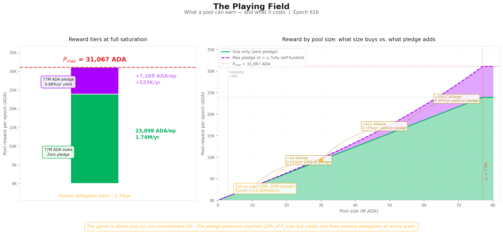

*POL.3.1 — The pledge "playing field" as a stack of reward tiers. Any saturated pool earns the **size ceiling** (76.9% of $P_{\max}$) without pledging; the remaining **23.1% bonus** requires the operator to pledge the full saturation amount (77M ADA) — a yield of just 0.68%/yr on locked capital.*

**Three reward tiers:**

| Tier | Reward/epoch | Reward/year | What it requires |
| --- | --- | --- | --- |
| **$P_{\max}$** — absolute ceiling | **31,067 ADA** | **2.27M ADA** | 77M ADA stake + 77M ADA pledge + $\bar{p}=1$ |
| **Size ceiling** — zero pledge | **23,898 ADA** | **1.74M ADA** | 77M ADA stake + $\bar{p}=1$. No pledge needed. |
| **Pledge bonus** — the gap | **7,169 ADA** | **523K ADA** | The difference. Requires 77M ADA of *personal* capital pledged. |

The size-only ceiling ($\lambda_{\text{size}} \times P_{\max}$) is what **any** saturated pool earns regardless of pledge. It captures **76.9%** of $P_{\max}$. The remaining **23.1%** requires the operator to **pledge the entire saturation amount** (77M ADA).

The implied yield: $523\text{K ADA/yr} \div 77\text{M ADA} = \mathbf{0.68\%\text{/yr}}$ — **below the passive delegation yield** of ~2.3%/yr.

**The bonus at every scale:**

| Pool size | ν | Zero-pledge reward | Full self-pledge (π=1) reward | Bonus | Relative uplift | Yield on pledge capital |
| --- | --- | --- | --- | --- | --- | --- |
| 3M ADA | 0.039 | 931 ADA/ep | 932 ADA/ep | **+0.4 ADA** | +0.05% | 0.001%/yr |
| 10M ADA | 0.130 | 3,104 ADA/ep | 3,120 ADA/ep | **+16 ADA** | +0.5% | 0.011%/yr |
| 30M ADA | 0.390 | 9,312 ADA/ep | 9,736 ADA/ep | **+424 ADA** | +4.6% | 0.10%/yr |
| 50M ADA | 0.649 | 15,520 ADA/ep | 17,484 ADA/ep | **+1,964 ADA** | +12.7% | 0.29%/yr |
| 77M ADA | 1.000 | 23,898 ADA/ep | 31,067 ADA/ep | **+7,169 ADA** | +30.0% | 0.68%/yr |

A **10M ADA pool** where the operator pledges the entire pool earns **16 ADA more per epoch** — a yield of **0.01%/yr** on a 10M lockup.

A typical healthy pool (30M ADA stake, 100K ADA pledge) gains **3.6 ADA/epoch** from pledge — *less than the variance of a single block*.

> **Finding POL.O2.F2 — Pledging earns less than passive delegation, even at maximum scale.** A fully-saturated pool whose operator pledges the entire saturation amount earns just **0.68%/yr** on that pledged capital — below the **2.3%/yr** anyone can earn by passively delegating. At every realistic scale, the bonus is too small to justify the capital lockup. The "game" for operators is overwhelmingly about **size** (ν), not **commitment** (π).

*The bonus exists in the formula but not in the economics.*

### 3.4.3. The envelope mechanics — and the three structural defects of A

The proportioning envelope splits each pool's reward into a size-proportional base and a pledge-tied bonus:

$$E(\nu, \pi) = \underbrace{\lambda_{\text{size}} \cdot \nu}_{\text{base}} + \underbrace{\lambda_{\text{pledge}} \cdot A(\nu, \pi)}_{\text{pledge bonus}}$$

**The base** is well-behaved — purely proportional to saturation, independent of pledge. A zero-pledge pool earns $E(\nu, 0) = 76.923\% \cdot \nu$, and at full saturation it captures **76.9% of $P_{\max}$**. The remaining **23.1% is gated by the activation function** $A(\nu, \pi)$ — and that is where the pledge problem lives.

**A factorises into a size factor and a pledge-intensity factor:**

$$A(\nu, \pi) \;=\; \underbrace{\nu^2}_{\text{size factor}} \;\cdot\; \underbrace{\pi \cdot \bigl[1 - \pi(1-\nu)\bigr]}_{\text{pledge-intensity factor}}$$

The two factors are independent and multiplicative. This factorisation is decisive — three structural defects follow from it directly. They are *pre-empirical*: properties of the algebra that hold regardless of $a_0$, regardless of mainnet data, regardless of any CIP that operates around (rather than on) A.

**Defect 1 — Quadratic size penalty applies at every pledge ratio.**

The outer $\nu^2$ multiplies *every* $(\nu, \pi)$ configuration. A small pool is quadratically penalised for being small **before** pledge enters the picture. Even at the optimal pledge ratio for a given pool size, the bonus is still scaled by $\nu^2$. At $\nu = 0.1$ (a 7.7M pool), the bonus contribution is capped at **1% of what a saturated pool earns**, no matter how committed the operator.

> **Finding POL.O2.F4 — Small pools cannot earn meaningful pledge bonus, no matter how committed the operator.** The formula scales the bonus by **pool-size squared** ($\nu^2$) before pledge is priced — at every pledge ratio. A pool at **10% of saturation** is structurally capped at **1% of the bonus a saturated pool earns**, regardless of operator commitment. The penalty is permanent: it holds at every $\pi$ and cannot be unlocked by raising $a_0$ or any other parameter that does not touch A itself.

**Defect 2 — A is non-monotone in π for any ν < 0.5.**

Take the partial derivative:

$$\frac{\partial A}{\partial \pi} \;=\; \nu^2 \bigl[1 - 2\pi(1-\nu)\bigr]$$

This is zero at $\pi^* = 1 / [2(1-\nu)]$. Two regimes:

- **ν ≥ 0.5:** $\pi^* \geq 1$. The maximum sits at or beyond the unit interval; A is monotone increasing in π over $[0, 1]$. Pledging more always earns more bonus.
- **ν < 0.5:** $\pi^* < 1$. The maximum sits **strictly inside** $[0, 1]$. **Pledging beyond $\pi^*$ pays less, not more.** A pool at half-saturation peaks at $\pi = 1$; below half-saturation, fully self-pledging *destroys* part of the bonus the operator could have earned by committing less. Essentially the entire mainnet population sits below half-saturation.

Worked example at $\nu = 0.3$ (a Healthy-tier pool ≈ 23M ADA):

| π | A(0.3, π) | vs. interior max |
|---:|---:|---:|
| 0.30 | 0.0233 | -27% |
| 0.50 | 0.0292 | -9% |
| **0.714 (= π*)** | **0.0321** | **max** |
| 0.80 | 0.0317 | -1% |
| **1.00 (full self-pledge)** | **0.0270** | **-16%** |

The formula whose stated purpose is "skin in the game" pays the operator **less for putting in more skin**, for the entire population of pools below half-saturation.

> **Finding POL.O2.F5 — Pledging more pays less past a sweet spot — for almost every pool on mainnet.** For any pool below half-saturation, the bonus peaks at an interior pledge ratio $\pi^{*} = 1/[2(1-\nu)] < 1$, and pledging beyond that point *reduces* the bonus. At $\nu = 0.3$ the peak sits near **71%** pledge ratio, and full self-pledge pays **16% less** than the peak. The formula formally rewards operators for **under-committing** — across essentially the entire mainnet pool landscape.

**Defect 3 — Cubic collapse at full self-pledge.**

At $\pi = 1$, the inner factor degenerates and the bonus reduces to:

$$A(\nu, 1) = \nu^3 \qquad \Rightarrow \qquad \text{bonus at full self-pledge} = \lambda_{\text{pledge}} \cdot \nu^3$$

The strongest possible commitment signal — every ADA pledged is the operator's own — is paid the worst-case scaling on sub-unit ν. The protocol designed an instrument to reward maximal commitment, and the algebra punishes it on size alone.

| Saturation (ν) | $A(\nu, 1) = \nu^3$ | Bonus (% of $P_{\max}$) | Total $E$ | Relative uplift over zero-pledge |
| --- | --- | --- | --- | --- |
| 1.0 (full) | 1.000 | 23.077% | **100%** | **30.0%** |
| 0.8 | 0.512 | 11.82% | 73.36% | 19.2% |
| 0.5 | 0.125 | 2.88% | 41.35% | **7.50%** |
| 0.3 | 0.027 | 0.62% | 23.70% | 2.70% |
| 0.1 | 0.001 | 0.023% | 7.72% | 0.30% |

> **Finding POL.O2.F6 — The strongest possible commitment signal is paid the worst-case reward.** When the operator pledges 100% of their own pool ($\pi = 1$), the bonus collapses to **pool-size cubed** ($\nu^3$). A half-saturated pool earns **12.5%** of the maximum bonus; a pool at 10% of saturation earns just **0.1%**. The protocol designed an instrument to reward maximal commitment, and the algebra punishes it on size alone.

**The three defects compound.** Defect 1 ensures small pools cannot earn meaningful bonus at any pledge level; Defect 2 ensures that within the small-pool regime, *more* commitment pays *less* past an interior optimum; Defect 3 ensures that even the maximum signal is suppressed by the size penalty cubed. The intended MPO-splitting penalty (the $-\pi^2(1-\nu)$ term in the inner factor) is achieved at the cost of all three.

*The mechanism was designed for a world of 500 saturated pools; the actual landscape cannot activate it — and the algebra would fight it even if it could.*

> **For a deeper walk-through** — three operators (Bob at $\nu \approx 0.03$, Charles at $\nu \approx 0.22$, Alice at $\nu \approx 1$) traced across three pledge scenarios, and the implications for CIP-0050 / CIP-0037 which operate around A rather than on it — see [the stake-cap synthesis, §2.2 *The deeper bottleneck — A(ν, π) itself*](../../../../solution-evaluation/pools-distribution/README.md#22-the-deeper-bottleneck--a-itself).

### 3.4.4. The evidence on mainnet

Absolute pledge amounts are misleading — a 1M ADA pledge means something very different for a saturated pool (ν ≈ 1, π ≈ 0.013) than for a small one (ν ≈ 0.1, π ≈ 0.13).

The relevant metric is the **pledge ratio**: declared pledge divided by active stake. This is what the formula actually prices through the $A(\nu, \pi)$ term.

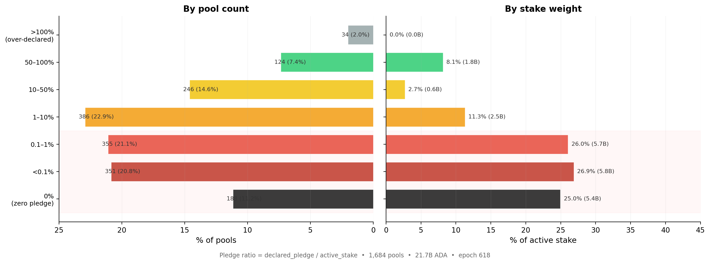

*POL.3.2 — Distribution of pledge ratio (declared pledge ÷ active stake) across the 1,684 pools with meaningful delegation. **78%** of staked ADA sits in pools with ratio < 1%, and the stake-weighted median is **0.07%** — pledge is functionally absent where stake concentrates.*

The chart covers the 1,684 registered pools with meaningful delegation (active stake > 10K ADA), excluding dormant and zombie registrations.

| Pledge ratio threshold | Cumul. % of pools | Cumul. % of stake | Stake (ADA) |
| --- | --- | --- | --- |
| < 0.1% | 32.0% | **51.9%** | 11.3B |
| < 1% | 53.1% | **78.0%** | 16.9B |
| < 10% | 76.0% | **89.4%** | 19.4B |

**78% of all staked ADA** sits in pools where the operator pledges less than **1%** of managed stake, and **89%** below 10%. *Only one ADA in ten is delegated to a pool where the operator commits more than a tenth of the stake they manage.*

The **stake-weighted median pledge ratio is 0.07%** — meaning half of all staked ADA sits in pools where the operator's personal commitment is less than one thousandth of delegated funds.

The unweighted median (**0.73%**) is 10× higher, reflecting the many smaller community pools with genuine skin-in-the-game but little stake weight.

> **Finding POL.O2.F1 — Almost no operator pledges meaningfully.** **78% of staked ADA** sits in pools where the operator pledges **less than 1%** of the stake they manage; the stake-weighted median pledge ratio is **0.07%**. Pledge is absent precisely where stake concentrates. The pools that dominate the network in economic terms operate with near-zero pledge ratios — for them, the $A(\nu, \pi)$ term contributes essentially nothing.

This asymmetry is the **structural signature** of the pledge problem. At π = 0.001 (pledge ratio 0.1 %) and ν = 0.5 (a half-saturated pool), the bonus is approximately **0.006 %** of $P_{\max}$ — and at the stake-weighted median π = 0.0007, even smaller still.

*The anti-Sybil mechanism is present in the formula but absent from the economics.*

## 3.5. Performance and oversaturation

Two minor waste sources complete the picture:

- **Performance ($\bar{p}$).** A pool's actual block production relative to its VRF-assigned expectation. The network-wide aggregate averages **0.977** — meaning ~2.3% of the pot is lost to missed blocks. This is the only factor the operator directly controls through infrastructure quality. For sub-block pools (expected blocks < 3/epoch), Poisson variance dominates and epoch-to-epoch results are noisy, but in aggregate the effect is small: **0.5% of the pot**.

- **Oversaturation.** Seven pools hold stake above $z_0 = 76.99\text{M ADA}$; the excess earns nothing. The saturation cap was designed for 500 pools; only 8 reach it. It binds on **0.3% of the pot**.

Combined: **0.8% of the pot**. *These are well-functioning mechanisms that do their job — they are not the problem.*

## 3.6. Summary

### 3.6.1. Current snapshot

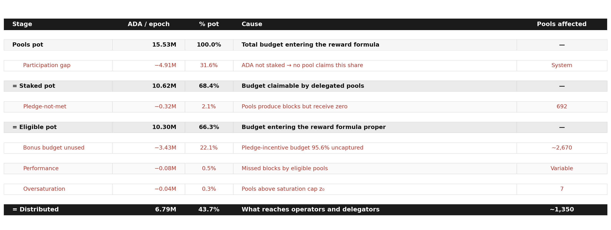

*POL.3.3 — Single-epoch waterfall (epoch 616) tracing the **15.53M ADA** pool pot from the participation-gap loss (31.6%) through the unused pledge-incentive budget (22.1%) and the secondary leakages, down to the **6.79M ADA / 44%** that actually reaches operators and delegators.*

> [!IMPORTANT]
> **Key observation (POL.O1).** Two causes account for **53.7% of the entire pools pot** returning to reserve: the participation gap (31.6%) and the unused pledge budget (22.1%). Everything else — pledge-not-met confiscation (2.1%), performance (0.5%), oversaturation (0.3%) — is secondary by an order of magnitude. The reform priority is unambiguous: the participation gap is upstream and outside the formula's control; the unused pledge budget is the single largest inefficiency that incentive reform *can* address.

The supporting findings, each surfaced where its evidence sits:

> **Finding POL.O1.F1 — Less than half the pool pot reaches its targets.** Only **6.79M of the 15.53M ADA per epoch** budgeted for distribution actually reaches operators and delegators — a **44% distribution efficiency**. The other **56% returns to the reserve unused** every epoch.

&nbsp;

> **Finding POL.O1.F4 — Two causes account for almost all the waste; everything else is rounding error.** The participation gap and the unused pledge-incentive budget together return **53.7% of the pot** to reserve. The remaining sources combined — pledge-not-met confiscation (**2.1%**), missed blocks (**0.5%**), oversaturation (**0.3%**) — add up to less than **3%** of the pot. The reform priority is unambiguous.

&nbsp;

> **Finding POL.O2.F3 — The pledge bonus budget goes unused.** Every epoch, **3.43M ADA** — **22%** of the pool pot — is reserved for the pledge bonus, but the formula's distribution mechanics return almost all of it to the reserve unclaimed (~250M ADA/year). This is the structural cost of maintaining $a_0 = 0.3$ on a landscape that cannot activate the bonus curve.

[§4 — The pool landscape](#4-the-pool-landscape-who-wastes-who-pledges-and-who-struggles) maps the population structure that produces this outcome — who controls which pools, who responds to the pledge signal, and who struggles below the production threshold.

### 3.6.2. Historical evolution

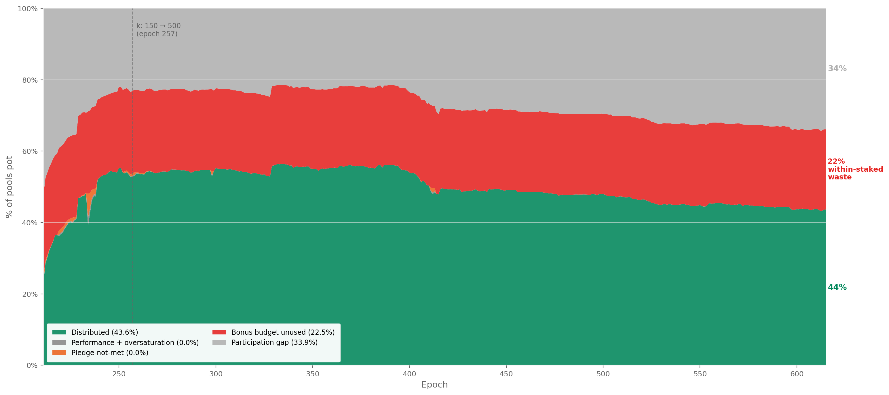

*POL.3.4 — Historical decomposition of the pool pot, Shelley launch (epoch 211) → epoch 615. Distribution efficiency peaked at **~55%** around epochs 300–400 and has since degraded to **43.6%**. The entire decline traces to the participation gap widening from **~22% to 34%**; no other component has moved materially.*

The historical decomposition reveals two facts that the single-epoch snapshot cannot:

**The participation gap is the only component that has moved.** Distribution efficiency peaked at **~55%** around epoch 300–400 and has since degraded to **43.6%**.

The entire decline traces to **falling participation**: the grey band widened from **~22% to 34%** as the ratio of active stake to theoretical capacity ($k \times z_0$) fell. No other component changed materially.

**The bonus budget has never activated.** The red band — pledge bonus unused — has sat at **~22–23% of the pot since Shelley epoch 211**. It was **23.1%** when $a_0 = 0.3$ was set, and it is **22.5%** today.

The pledge incentive was **not functional at launch**, did not improve after the $k$ increase at epoch 257, and has not responded to any subsequent change in the pool landscape.

*This is not a recent degradation. It is a structural failure present since the mechanism was deployed.*

### 3.6.3. Conclusion

**What the [*Incentive Mechanism Analysis*](https://github.com/input-output-hk/spo-incentives/blob/main/report.pdf) established.** Lopez de Lara (2025) produced the first waterfall decomposition of the pools pot and identified the **participation gap** and the **pledge-bonus shortfall** as the two dominant waste channels. The analysis characterised the bonus shortfall as economically neutral — a zero-sum redistribution where uncaptured ADA returns to the reserve.

**What this analysis adds.** The zero-sum framing is **incomplete**. The pledge bonus is the protocol's primary Sybil-resistance mechanism — the economic cost that makes pool proliferation expensive.

When **95.6%** of this budget fails to activate, the marginal cost of opening an additional pool drops to near zero. *The mechanism designed to make pool farms expensive becomes permissive.*

The **3.43M ADA** returning to the reserve every epoch is the budget the protocol explicitly allocates to its own security model — and the five-year historical record ([Historical evolution](#362-historical-evolution)) confirms it has **never responded to any change** in the pool landscape. This is not a recent degradation; it is a **structural failure** present since the mechanism was deployed.

Furthermore, the yield analysis ([The playing field: what pledge actually buys](#342-the-playing-field-what-pledge-actually-buys)) shows the bonus is **economically irrational** to pursue at every realistic scale, and the mainnet evidence ([The evidence on mainnet](#344-the-evidence-on-mainnet)) confirms that operators have responded accordingly — pledge is absent precisely where stake concentrates.

> **Finding POL.O1.F1 — Less than half the pool pot reaches its targets.** **6.79M of 15.53M ADA/epoch** — **44% distribution efficiency**.
>
> **Finding POL.O1.F2 — ADA that isn't staked at all is the single largest source of waste.** **4.91M ADA/epoch** (**31.6%** of the pot) — upstream and outside the formula's control.
>
> **Finding POL.O1.F3 — Almost all of the pledge-bonus budget is wasted.** **3.43M ADA/epoch** (**22.1%** of the pot, **95.6%** of the bonus allocation) — the single largest inefficiency reform can address.
>
> **Finding POL.O1.F4 — Two causes account for almost all the waste; everything else is rounding error.** Together **53.7%** of the pot; secondary causes total under **3%**.
>
> **Finding POL.O2.F1 — Almost no operator pledges meaningfully.** **78%** of staked ADA at pledge ratio **< 1%**; stake-weighted median **0.07%**.
>
> **Finding POL.O2.F2 — Pledging earns less than passive delegation, even at maximum scale.** **0.68%/yr** at saturation vs. **2.3%/yr** passive — economically irrational to pledge.
>
> **Finding POL.O2.F3 — The pledge bonus budget goes unused.** **3.43M ADA/epoch** reserved for the bonus returns unclaimed — the structural cost of $a_0 = 0.3$ on a landscape that cannot activate it.

[§4 — The pool landscape](#4-the-pool-landscape-who-wastes-who-pledges-and-who-struggles) identifies the actors who control this landscape and why they do not pledge.

---

# 4. The pool landscape — who wastes, who pledges, and who struggles

[§3 — Distribution efficiency](#3-distribution-efficiency) showed that **56.3% of the pools pot** never reaches operators — and that the single largest addressable cause is the **unused pledge-incentive budget**:

> **3.43M ADA/epoch (~250M ADA/year)** — returning to the reserve unused since Shelley launch.

The pledge mechanism — designed as Cardano's primary Sybil-resistance tool — has never activated:

| Signal | Value | Reading |
| --- | ---: | --- |
| Bonus budget wasted | **95.6%** | Near-total failure |
| Staked ADA in pools with pledge ratio < 1% | **78%** | Pledge is absent where stake concentrates |
| Best-case yield on pledge capital | **0.68%/yr** | Below passive delegation yield (2.3%/yr) |

*By every measure, the mechanism is broken.*

---

> **The question this section asks.** Prior work identified a population of struggling pools below the viability line as the primary policy concern. But **how many operators are genuinely in that position?** Who are they? And is their struggle a *cause* of the pledge failure — or a *consequence* of something deeper about who controls the landscape?

**How this section answers it:**

- **[§4.1 — Theoretical pool classification](#41-theoretical-pool-classification).** A size-based taxonomy grounded in the protocol's own mechanics, separating where operators struggle from where they thrive.
- **[§4.2 — Behind the pools: entity-level analysis](pools.html#42-behind-the-pools-entity-level-analysis).** **75% of staked supply** turns out to be operated by multi-pool entities whose relationship to the pledge mechanism ranges from **structural impossibility** to **strategic indifference**.
- **[§4.3 — The remaining single-pool operators](#43-the-remaining-single-pool-operators).** The community base that any reform ultimately aims to support — isolated from the MPO landscape.
- **[§4.4 — The full picture](#44-the-full-picture).** Who wastes, who pledges, and who genuinely struggles, in one synthesis.

## 4.1. Theoretical pool classification

Before looking at who controls the pools, a structural map of the landscape itself is needed.

### 4.1.1. The case for pool categorization

The reward curve is **continuous** — it maps stake to reward without discrete jumps. Yet the pool landscape is **not** continuous.

A pool with 50K ADA and one with 50M ADA both participate in the same formula, but they inhabit entirely different worlds: one barely produces blocks, the other anchors the delegation market.

Treating them as points on a single spectrum leads to conclusions that are **technically correct and analytically useless**. Three thresholds — **production**, **viability**, and **saturation** — emerge from the protocol's own mechanics and partition the space into tiers with distinct identities:

| Threshold | What it captures | Derived from |
| --- | --- | --- |
| **Production** | Minimum stake for regular block production | Slot leadership probability × epoch length |
| **Viability** | Minimum stake to cover operating costs | Fixed-cost floor ÷ reward rate per ADA |
| **Saturation** | Maximum efficient stake per pool | Circulating supply ÷ $k$ |

Each tier has a characteristic behaviour, a characteristic problem (or none), and a characteristic response to parameter changes.

> **Why this matters for CIP evaluation.** These thresholds are **dynamic** — they are functions of active stake, fixed costs, reward rates, and $k$. When a CIP proposes to change $k$ from 500 to 1000, the saturation cap halves and the tier boundaries shift. When active stake grows from 21B to 35B ADA, the production and viability lines rise. The taxonomy is a framework for reasoning across scenarios, not a snapshot of today's values.

### 4.1.2. Structural thresholds

#### 4.1.2.1. Production threshold

> **Key result:** at current active stake (21.18B ADA), a pool needs **~3M ADA** to be in the *productive population* — defined as the stake level at which the pool produces **at least one block per epoch with 95% probability**. The threshold is dynamic: it scales linearly with active participation and rises to ~5.35M ADA at full supply.

Block production is a **Poisson process** — leadership is assigned slot by slot, and a pool with relative active stake $\sigma$ has expected blocks per epoch $\lambda = L \cdot f \cdot \sigma$ (with $L = 432{,}000$ slots, $f = 0.05$, so $L \cdot f = 21{,}600$). The probability of producing at least one block in a given epoch is:

$$P(\geq 1 \text{ block}) \;=\; 1 - e^{-\lambda}$$

**For a 95% probability**, we need $\lambda \geq -\ln(0.05) \approx 3$. At today's $S_{\text{active}} = 21.57$B ADA:

$$\text{stake}_{\lambda = 3} \;=\; \frac{3 \cdot S_{\text{active}}}{L \cdot f} \;=\; \frac{3 \times 21.57\text{B}}{21{,}600} \;\approx\; \mathbf{3M \text{ ADA}}$$

This is the threshold at which a delegator can rely on the pool producing in 19 of 20 epochs — yield is a *signal*, not statistical noise. Below 3M ADA, blocks are still produced occasionally — at λ = 1 (~1M ADA stake), a pool has only a 63% chance of producing in any given epoch and 37% chance of producing nothing — but the income is too volatile for a delegator to read or for an operator to plan against.

**The mechanism.** Cardano's Ouroboros Praos assigns block production rights slot by slot. For each of the $L$ slots in an epoch, a pool with relative active stake $\sigma_i$ is elected slot leader with probability:

$$\phi(f, \sigma_i) = 1 - (1-f)^{\sigma_i}$$

where $f$ is the **active slot coefficient** and $\sigma_i = \text{stake}_i / S_{\text{active}}$. For small $\sigma_i$ (all pools below saturation), the expected block count simplifies to:

$$E[\text{blocks}_i] \approx L \times f \times \sigma_i$$

The protocol constants have **never changed**:

| Parameter | Symbol | Value |
| --- | --- | --- |
| Epoch length | $L$ | 432,000 slots |
| Active slot coefficient | $f$ | 0.05 |
| Expected blocks/epoch | $L \times f$ | 21,600 |

The only moving part is **total active stake** — and that makes the threshold dynamic:

$$\text{stake}_{n\text{-blocks}} \approx \frac{n \times S_{\text{active}}}{L \times f}$$

| Total active stake | 1-block threshold | 3-block threshold |
| --- | --- | --- |
| 10B ADA | 0.46M ADA | 1.39M ADA |
| 15B ADA | 0.69M ADA | 2.08M ADA |
| **21.18B ADA** (current) | **0.97M ADA** | **2.92M ADA** |
| 30B ADA | 1.39M ADA | 4.17M ADA |
| 38.49B ADA (full supply) | 1.78M ADA | 5.35M ADA |

At full participation the 3-block threshold rises to **5.35M ADA** — pushing more pools below viability.

**Why 3 blocks matters.** Block assignments are **Poisson-distributed**. The coefficient of variation ($\text{CV} = 1/\sqrt{\lambda}$) tells the story:

| Pool stake | E[blocks] | CV | What a delegator sees |
| --- | --- | --- | --- |
| 100K ADA | 0.10 | 316% | Mostly zero — one block is an event |
| 500K ADA | 0.51 | 139% | One block every ~2 epochs, very noisy |
| **~1M ADA** | **1.00** | **100%** | **0 blocks as likely as 2 — unreliable** |
| **~3M ADA** | **3.00** | **58%** | **Regular production begins** |
| 10M ADA | 10.27 | 31% | Stable reward stream |
| 77M ADA (z₀) | 79.09 | 11% | Near-deterministic |

At 1 block/epoch the reward is **as variable as its own mean**. At **3 blocks/epoch** the pool produces in the overwhelming majority of epochs — this is where a delegator can first observe *consistent* performance.

*The ~3M ADA line identified in prior work is not an arbitrary ADA amount: it is the point where Poisson noise stops dominating.*

> **Finding POL.O3.F1 — The production threshold is physics-based — emergent from slot-leadership, not a parameter.** A pool sits in the productive population when it produces **at least one block per epoch with 95% probability** ($\lambda \geq 3$, since $P(\geq 1) = 1 - e^{-\lambda}$). At today's active stake ($S_{\text{active}} \approx 21.57$B ADA), this requires **~3M ADA** of pool stake. Below it, blocks are still produced occasionally — at ~1M ADA the pool has only a 63% chance of producing in a given epoch — but income is too volatile to be read as a usable signal. The threshold rises with active stake: at full supply (~38.5B ADA), the production line climbs to **~5.35M ADA**.

**Current landscape:**

| Threshold | Pools above | Active stake covered |
| --- | --- | --- |
| ≥1 block/epoch (0.97M ADA) | 946 | 99.1% |
| ≥3 blocks/epoch (2.92M ADA) | 729 | 97.3% |
| ≥10 blocks/epoch (10.1M ADA) | 511 | 91.6% |

Below this threshold, pools produce too few blocks for delegators to assess reliability — and their reward variance is too high to sustain consistent yields.

#### 4.1.2.2. Viability threshold (orders of magnitude only)

> **Key result:** at today's ADA/USD price (~$0.25), the operator-viability threshold *coincides* with the production threshold (~3M ADA stake). The pool generates ~2,150 ADA/epoch on average — enough for the operator to keep the ~390 ADA they need and pass the rest to delegators. **But unlike production, viability is volatile** — it tracks the ADA/USD price, the operator's fee-structure choices, and the operator's actual cost setup. **This section discusses orders of magnitude only; the rest of this document and its visuals do not draw a viability line**, because the line moves too much to be a stable analytical reference.

**The question.** Production tells us *whether the pool produces blocks reliably*. Viability tells us *whether the operator can pay themselves enough — out of the pool's reward stream — to cover real costs*. The two answer different questions, and viability layers extra variables on top of production.

**Step 1 — what does an operator actually need to take per epoch?**

A Cardano stake pool requires one block-producing node and two relay nodes running 24/7 plus the operator's own time to monitor, patch, rotate keys, and participate in governance. Order-of-magnitude annual costs:

- **Infrastructure** (block-producer + 2 relays + monitoring + DNS + backups): **$1,320–3,240/year** at common VPS providers.
- **Operator labour** (5–15 hrs/month at DevOps/SRE market rates of $43–86/hour): **~$5,160/year** at the conservative lower bound (10 hrs/month × $43/hr).
- **Total cost floor: ~$7,160/year** minimum, easily doubling for a more demanding setup.

Costs are paid in fiat, so the ADA-equivalent moves with price:

| ADA/USD | Cost in ADA/year | Cost in ADA/epoch (73 epochs/yr) |
| ---: | ---: | ---: |
| $0.10 | ~71,600 | ~980 |
| $0.25 (today) | **~28,600** | **~390** |
| $0.50 | ~14,300 | ~196 |
| $1.00 | ~7,160 | ~98 |

**Step 2 — what stake makes the pool generate that much reward?**

Network pool pot ≈ **15.5M ADA/epoch** distributed across the **21,600 expected blocks/epoch** → average reward per block ≈ **715 ADA**. A pool with stake σ and λ = 21,600 × σ / S_active expected blocks gets **~λ × 715 ADA/epoch** in expectation.

For pool reward = 390 ADA/epoch (the cost an operator needs to extract today):

$$\lambda = \frac{390}{715} \approx 0.55 \quad\Rightarrow\quad \text{stake} = \frac{0.55 \cdot S_{\text{active}}}{21{,}600} \approx \mathbf{549K \text{ ADA}}$$

— but at 549K ADA, $\lambda = 0.55$ → P(0 blocks per epoch) = $e^{-0.55} \approx 58\%$. The pool earns 0 in over half of all epochs, with sporadic bursts when it wins a block. **Income at this stake level is mathematically positive but operationally unreliable.**

**Step 3 — viability collapses to production (today).**

For the operator's income to be *reliable enough to plan against*, the pool must sit at the production threshold (~3M ADA, λ=3, 95% prob of ≥1 block). At that level:

- Expected pool reward = 3 × 715 = **2,145 ADA/epoch**, *reliably* (95% of epochs)
- Operator needs only **~390 ADA/epoch** of that — about **18%** of pool reward
- The remaining 82% is available for delegators

**At $0.25 ADA, the operator-viability threshold is therefore the production threshold (~3M ADA).** The pool generates 5.5× what the operator needs; viability is comfortably absorbed by reliable production.

**How viability moves with price.**

| ADA/USD | Cost (ADA/epoch) | Stake for that reward in expectation | Reliable-income floor |
| ---: | ---: | ---: | ---: |
| $0.10 | ~980 | ~1.4M ADA | **~3M ADA** (production-bound) |
| $0.25 (today) | ~390 | ~549K ADA | **~3M ADA** (production-bound) |
| $0.50 | ~196 | ~275K ADA | **~3M ADA** (production-bound) |
| $1.00 | ~98 | ~140K ADA | **~3M ADA** (production-bound) |

Across this range, the **expectation-only** stake target moves between ~140K and ~1.4M ADA — but the **reliable-income floor** (where Poisson noise is small enough that monthly income covers monthly costs in nearly every epoch) is *always at or above* the production threshold.

If the ADA price drops further (say $0.05), the cost in ADA rises (~1,960 ADA/epoch), and the stake required for reliable coverage rises **above** production: the pool needs λ high enough that even bad-luck epochs cover the cost. This is the regime where viability *separates* from production and becomes a binding upper threshold of its own.

> **Finding POL.O3.F2 — Operator-viability is volatile and tracks the ADA/USD price; at today's prices it coincides with the production threshold, but separates upward when ADA falls.** A single-pool operator needs to extract roughly **390 ADA/epoch** today (~$7,160/yr cost in fiat at $0.25 ADA). At the production threshold (~3M ADA stake), the pool generates ~2,145 ADA/epoch on average, more than enough — viability and production coincide. At lower ADA prices the cost in ADA rises, and the reliable-income floor rises above production. The threshold is therefore not drawn as a fixed line in the rest of this document; it is treated as a separate volatile concept whose stability is a question for the V2 spec, not the diagnostic.

#### 4.1.2.3. Saturation threshold

> **Key result:** the saturation cap binds for **8 pools** — 1.6% of the design target of 500. With 56.5% participation, the system can support at most **282** saturated pools. The mechanism's central equilibrium tool is nearly inactive.

The saturation point $z_0 = \text{Supply}/k = 76.99\text{M ADA}$ was designed as the central equilibrium mechanism: once a pool reaches $z_0$, the per-ADA reward for its delegators drops, pushing stake toward smaller pools until all $k = 500$ pools are equally sized.

| Metric | Design | Reality |
| --- | --- | --- |
| Target pools at saturation | **500** | **8** |
| Theoretical capacity ($k \times z_0$) | **38.49B ADA** | — |
| Active stake | — | **21.75B ADA** |
| Capacity utilisation | 100% | **56.5%** |
| Max pools that could saturate | 500 | **282** |

The reason is **arithmetic**: $k = 500$ implicitly required near-complete participation (~100% of supply). Actual participation at **56.5%** makes the target **structurally unreachable** — regardless of operator behaviour or pledge reform.

> **Finding POL.O3.F3 — The saturation cap is a formula ceiling — $z_0 = 1/k$.** At $k = 500$, $z_0 = $ **77M ADA**. Beyond it, the per-pool reward stops scaling with stake. The cap exists to limit any single pool's share of the network's reward — a per-pool anti-Sybil device, fixed by parameter.

> **Note on the 8-pool saturation count.** At today's $z_0 = 76.99$M ADA, **8 pools** sit at or above the cap. This count is structurally misleading on its own: multi-pool entities deliberately split aggregate stake across many pools to avoid per-pool diminishing returns, so per-pool saturation count *cannot* read entity concentration. The upper-tail story is in [§4.2 — entity-level analysis](pools.html#42-behind-the-pools-entity-level-analysis).

The near-saturation zone (≥80% of $z_0$) contains **104 pools** — a thin cluster rather than the broad plateau the design envisioned. The bulk of the healthy pool landscape sits between **3M and 60M ADA**, far below saturation.

### 4.1.3. Tier definitions

The three thresholds partition the pool space into **nine tiers**. Boundary values are for epoch 616 (21.18B ADA active stake).

**Below viability — the struggling pools:**

| Tier | Stake range | What happens |
| --- | --- | --- |
| **Zero-stake** | 0 ADA | Registered, no stake, not operational |
| **Dormant** | >0 → ~100K | < 0.1 blocks/epoch — effectively zero production |
| **Sub-block** | ~100K → ~1M | Sporadic blocks, high variance — unreliable for delegators |
| **Sub-reliable** | ~1M → ~3M | Produces blocks but cannot cover the 340 ADA fixed cost |

**Above viability — the functioning landscape:**

| Tier | Stake range | What happens |
| --- | --- | --- |
| **Healthy** | ~3M → ~38.5M | Consistent production, viable economics — the core operating tier |
| **Large healthy** | ~38.5M → ~61.6M | Well-capitalised, efficient, stable reward stream |
| **Near-saturation** | ~61.6M → ~73.1M | Close to maximum reward density |
| **Saturated** | ~73.1M → ~80.8M | At the cap — maximum reward; mechanism binding |
| **Oversaturated** | > ~80.8M | Past the cap — delegators penalised, stake should migrate |

### 4.1.4. Pool distribution by tier

The three thresholds produce a **sharply asymmetric distribution**: the vast majority of pools cluster at the bottom of the stake scale, while the overwhelming majority of delegated ADA concentrates in the upper tiers.

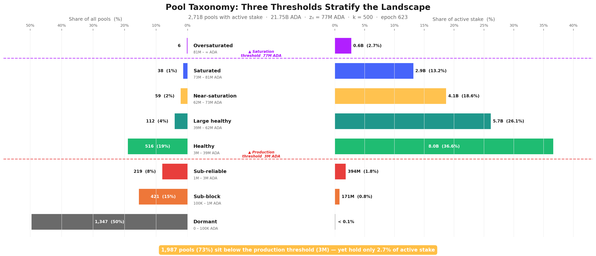

*POL.4.1 — Pool taxonomy at epoch 618. Mirrored bars: **share of pools** (left) vs. **share of active stake** (right) across the 8-tier landscape. The structural inversion is unmistakable — the **lower tail (Dormant + Sub-block + Sub-reliable)** holds 73% of pools but **2.7%** of stake; the **upper tail (Healthy and above)** is 27% of pools but **96.6%** of stake.*

The inversion is stark: **1,987 pools (73%)** sit below the production threshold (~3M ADA, 95% block-probability bar) — yet collectively hold only **2.7% of active stake**.

The top four tiers (Healthy and above) account for **27% of pools** but **96.6% of stake**. This structural gap between pool count and stake share is the **defining feature** of the current landscape and the primary motivation for the CIP proposals under evaluation.

> **Finding POL.O4.F1 — 1,987 pools (73%) sit below the production threshold (~3M ADA) and produce blocks too sporadically to carry consensus reliably.** At the production threshold a pool has a **95% probability** of producing ≥1 block per epoch (λ=3); below it Poisson noise dominates and yield is statistical noise. Collectively these pools hold only **2.7% of active stake** — ghost capacity the protocol admits but cannot reliably activate; neither delegators nor the consensus layer can read a meaningful signal from any single pool in this segment.

> **Finding POL.O4.F2 — The productive segment (731 pools, 27%) holds 96.6% of staked ADA — the actual consensus-carrying population.** Pool count is not stake share: the inversion of headline pool count vs. stake share is the defining structural feature of the landscape. The lower tail (1,987 sub-block pools) carries weight by count; the upper tail (the remaining 27%) carries weight by stake. This is the segment any reform of $k$, the pledge curve, or the saturation cap actually moves.

### 4.1.5. Conclusion

**What prior work established.** The **~3M ADA viability line** was identified as the primary policy concern, with operators below it flagged as the struggling population requiring reform attention.

**What this analysis adds.** The taxonomy separates three distinct boundaries that prior work fused into a single "viability line". The **production threshold** (~3M ADA) is a *physics boundary* — the stake level at which a pool produces ≥1 block per epoch with 95% probability; emergent from slot-leadership, not a parameter. The **viability threshold** is an *economic boundary* and structurally above production — covering not just `minPoolCost` (170 ADA floor / 340 dominant) but real infrastructure ($1,320–3,240/yr) and operator labour at market DevOps rates (~$5,160/yr at 10 hrs/mo × $43/hr). Because operator costs are fiat-denominated, the real viability target tracks the ADA/USD price; at today's prices no single-pool tier comfortably clears it. The **saturation cap** (77M ADA = $z_0 = 1/k$) is a *formula ceiling* on per-pool reward.

This analysis grounds the taxonomy in the protocol's own mechanics, extends it into a full **nine-tier taxonomy** spanning from zero-stake pools to oversaturated fleets, and surfaces two properties that matter for any CIP evaluation:

> **Finding POL.O3.F5 — Tier boundaries are dynamic — they shift with active stake, fixed costs, and $k$.** When a CIP proposes $k = 1000$, the saturation threshold halves to ~38.5M ADA and every current "Large healthy" pool is reclassified as near-saturation. When active stake grows from 21B to 35B ADA, production and viability lines rise proportionally. The taxonomy is a **framework for reasoning across scenarios**, not a snapshot of today's values — reform evaluation must track where the boundaries *move*.

But the taxonomy describes the terrain as if each pool were **independent**. It is not. Nothing in the Cardano protocol prevents a single entity — an exchange, a staking-as-a-service provider, or even a well-capitalised individual — from registering and operating multiple pools under different identities.

> **Finding POL.O3.F4 — The cleaner future state collapses viability into production.** Zeroing `minPoolCost` (or making it scale with the reward curve) removes the protocol-imposed floor, but the real labour-cost floor remains and viability stays above production unless a structural mechanism is introduced — e.g., a Rocket-Pool-style shared-operations path that lets sub-scale stake fund a single operator. The [§1.2.4.4.1 *Enforce the production threshold*](../../../README.md#12441-enforce-the-production-threshold-build-a-rocket-pool-for-cardano) proposal pairs both: a `minPoolCost` reform AND a sub-threshold path for stake that cannot reach the production line on its own.

Each pool appears as a separate entry on-chain, but the economic decisions (how much to pledge, how to price fees, whether to respond to incentive signals) are made at the **entity level**, not the pool level.

> **Finding POL.O4.F3 — The productive segment cannot be read pool-by-pool — it must be read at the entity level.** Many of the 731 productive pools are operated as fleets by a smaller set of entities; pool-by-pool analysis of the upper tail conceals the actual concentration and over-counts independent actors. The pool view tells us *how much stake is productive*; only the entity view tells us *who controls that stake* and *who responds to the pledge signal*. The entity-level breakdown — counts, archetypes, pledge stances — is the subject of [§4.2 — entity-level analysis](pools.html#42-behind-the-pools-entity-level-analysis) (POL.O5 and downstream).

[§4.2 — Behind the pools: entity-level analysis](pools.html#42-behind-the-pools-entity-level-analysis) looks behind the pools to identify who actually controls them — *and the answer reshapes the entire landscape*.


## 4.2. Behind the pools — entity-level analysis

The pool taxonomy above describes the terrain as if each pool were an **independent actor**. It is not. Nothing in the Cardano protocol prevents a single entity — an exchange, a staking-as-a-service provider, or a well-capitalised individual — from registering and operating multiple pools.

Each pool appears as a separate entry on-chain, but the economic decisions (how much to pledge, how to price fees, whether to respond to incentive signals) are made at the **entity level**, not the pool level.

Viewing the landscape pool-by-pool without entity attribution **pollutes every metric**: concentration appears lower, pledge ratios look more uniformly poor, and the policy-sensitive population is invisible.

This section first identifies who these entities are and how many there are ([§4.2.1 — Attribution method and headline figures](#421-attribution-method-and-headline-figures)), distinguishes who has enough capital to play the pledge game ([§4.2.2 — The scale-class divide](#422-the-scale-class-divide)), classifies them by archetype ([§4.2.3 — Operator archetypes](#423-operator-archetypes)), and measures how they behave with respect to pledge ([§4.2.4 — Pledge compliance: who plays and who doesn't](#424-pledge-compliance-who-plays-and-who-doesnt)).

### 4.2.1. Attribution method and headline figures

Cardano's on-chain data does **not natively group pools by operator** — a pool is registered with a cold key, a VRF key, and optional metadata, but nothing links two pools to the same controlling entity. The attribution therefore relies on a layered pipeline that combines **on-chain signals** (shared owner keys) with **off-chain heuristics** (public brand declarations, relay/metadata clustering, manual resolution against community databases).

**The full pipeline lives in the Census report**, which is the canonical source for entity attribution across the diagnostic — see [Census §3.3 — Cleaning: entity attribution](../../census/mainnet-analysis/README.md#33-behind-the-pools-4-entities-on-chain-become-85-with-off-chain-attribution) for the methodology and the on-chain-only vs combined-attribution numbers (the order-of-magnitude jump from **4 entities** detected on-chain alone to **85 entities** after layering off-chain signals — the on-chain-only layer misses the bulk of fleet structure).

**Headline figures** (productive set = pools ≥3M ADA at epoch 623, the production threshold from POL.O3.F1):

| | Entities | Productive pools | Stake | % of productive stake |
| --- | ---: | ---: | ---: | ---: |
| **Attributed entities (strict multi-pool + attributed single-pool)** | 83 | 449 | 16.24B ADA | **76.7%** |
| _of which:_ strict multi-pool fleets (n-MPO ≥ 2 productive pools) | 71 | 437 | 15.69B ADA | 74.1% |
| _of which:_ attributed single-pool operators (n-MPO = 1 productive pool, even when more pools are owned but sub-threshold) | 12 | 12 | 0.55B ADA | 2.6% |
| **Unattributed single-pool operators** | 284 | 284 | 4.94B ADA | 23.3% |
| **Total productive set** | **367** | **733** | **21.18B ADA** | **100%** |

n-MPO is counted on **productive pools only**: an entity that owns several pools but has only one above the 3M threshold is classified as an attributed single-pool operator — *not* a multi-pool fleet — because the remaining pools are sub-threshold and economically inactive. The 12 attributed single-pool entities collectively own **58 pools** but only 12 are productive; **IOG itself** sits in this bucket (34 owned, 1 productive). See [Census §3.4.1](../../census/mainnet-analysis/README.md#341-the-headline-picture-at-epoch-623) for the auditable per-entity breakdown.

> **Finding POL.O5.F1 — Three quarters of the network's productive stake sits in 83 named entities.** They operate 449 productive pools (≥3M ADA at epoch 623, the production threshold from [POL.O3.F1](#4121-production-threshold)) holding 16.24B ADA — 76.7% of productive stake. **71 are strict multi-pool fleets** (n-MPO ≥ 2 productive pools); **12 are attributed single-pool operators** — entities mapped by ticker, metadata, or relay clustering whose nominal fleet may be larger but whose productive footprint is exactly one pool (IOG is the textbook case: 34 owned, 1 productive). The remaining 284 unattributed single-pool operators (4.94B ADA, 23.3% of productive stake) are the numerical majority — but the attribution is a *lower bound*: operators running entirely separate per-pool infrastructure remain invisible. The unattributed single-pool population is analysed under that caveat in [§4.3 — The remaining single-pool operators](#43-the-remaining-single-pool-operators).

### 4.2.2. The scale-class divide

Before classifying these 83 entities by identity, **one purely structural distinction matters above all others**. The question is mechanical, not behavioural:

> Could the entity, if it chose to consolidate every pool it runs, fill *one* pool to the saturation cap?

The saturation cap $z_0 \approx 77\text{M ADA}$ divides the population in two:

| Class | Entities | Productive pools | Aggregate stake | What it means |
| --- | ---: | ---: | ---: | --- |
| **Saturation-scale** (aggregate stake ≥ z₀) | 48 | 379 | 14.55B ADA | Could fill at least one pool to the saturation cap. These are the only entities that can ever be "real" multi-pool operators with saturated pools. |
| **Sub-saturation** (aggregate stake < z₀) | 35 | 70 | 1.69B ADA | Total stake across the entire fleet does not reach a single saturation cap. Multi-pool by form but single-pool-like in economics. |

The split has nothing to do with pledging — it is a ceiling on what an entity could *ever* do at the pool tier, before any behavioural question is asked. Whether a saturation-scale entity then pledges or not is a separate question, taken up in [§4.2.4 — Pledge compliance](#424-pledge-compliance-who-plays-and-who-doesnt).

Sub-saturation entities are closer to single-pool operators in their relationship to the reward sharing scheme: their non-pledging is mechanical, not strategic.

> **Finding POL.O5.F2 — 48 MPO entities concentrate 14.55B ADA (68.7% of productive stake) in operators each big enough to fill a saturation cap.** Their aggregate stake clears one saturation cap ($z_0 \approx 77\text{M ADA}$), so they hold enough capital to fill at least one pool to the cap if they consolidated. The other 35 (1.69B ADA) are *sub-saturation*: even perfect consolidation does not add up to $z_0$. The 35 are multi-pool by form but single-pool-like in economics. *Entity-tier concentration is sharper than the 76.7% headline once the sub-saturation tail is stripped out — top 5 hold 25.7%, top 10 hold 39.1%.*

**The 48 saturation-scale MPOs, ranked by aggregate productive stake** (epoch 623). 🏛️ marks architecturally barred from pledging (CEX + IVaaS — see [§4.2.4.2](#4242-architectural-zero-pledge-cex-and-ivaas)).

| # | Entity | Archetype | Pools | Stake (M ₳) | % productive | Pledge ratio | Stance |
| ---: | --- | --- | ---: | ---: | ---: | ---: | --- |
| 1 | Coinbase / bison.run 🏛️ | CEX | 41 | 2,375 | 11.22% | 0.0% | Zero-pledge |
| 2 | CHUCK BUX | Opaque | 13 | 877 | 4.14% | 75.9% | Compliant |
| 3 | Figment 🏛️ | IVaaS | 20 | 866 | 4.09% | 0.0% | Zero-pledge |
| 4 | Binance 🏛️ | CEX | 20 | 690 | 3.26% | 0.0% | Zero-pledge |
| 5 | Kiln 🏛️ | IVaaS | 9 | 631 | 2.98% | 0.0% | Zero-pledge |
| 6 | Blockdaemon 🏛️ | IVaaS | 12 | 613 | 2.89% | 0.0% | Zero-pledge |
| 7 | Wave / Wavepool | Independent MPO | 14 | 613 | 2.89% | 35.4% | Compliant |
| 8 | Upbit 🏛️ | CEX | 20 | 574 | 2.71% | 0.7% | Zero-pledge |
| 9 | Everstake 🏛️ | IVaaS | 13 | 572 | 2.70% | 0.0% | Zero-pledge |
| 10 | eToro 🏛️ | CEX | 11 | 472 | 2.23% | 0.0% | Zero-pledge |
| 11 | YUTA 🏛️ | CEX | 25 | 459 | 2.17% | 0.3% | Zero-pledge |
| 12 | Cardano Foundation | Ecosystem steward | 6 | 395 | 1.87% | 99.1% | **Exemplary** |
| 13 | NORTH | Opaque fleet | 5 | 355 | 1.68% | 0.0% | Zero-pledge |
| 14 | NuFi | Platform/Wallet | 17 | 313 | 1.48% | 0.0% | Zero-pledge |
| 15 | Emurgo | Ecosystem steward | 8 | 269 | 1.27% | 0.0% | Zero-pledge |
| 16 | 1PCT | Independent MPO | 16 | 267 | 1.26% | 0.3% | Zero-pledge |
| 17 | ADV | Community fleet | 4 | 260 | 1.23% | 0.4% | Zero-pledge |
| 18 | SECUR | Community fleet | 5 | 231 | 1.09% | 0.3% | Zero-pledge |
| 19 | 5BINARIES | Multi-brand fleet | 6 | 225 | 1.06% | 0.2% | Zero-pledge |
| 20 | Bloom | Independent MPO | 7 | 223 | 1.05% | 33.2% | Compliant |
| 21 | AdaOcean | Independent MPO | 6 | 184 | 0.87% | 0.0% | Zero-pledge |
| 22 | CCV | Community fleet | 5 | 177 | 0.84% | 0.0% | Zero-pledge |
| 23 | DIGI | Opaque fleet | 5 | 168 | 0.79% | 0.6% | Zero-pledge |
| 24 | EDEN | Opaque fleet | 5 | 164 | 0.78% | 0.0% | Zero-pledge |
| 25 | Adalite Platform | Platform/Wallet | 3 | 158 | 0.75% | 93.0% | **Exemplary** |
| 26 | MS4 | Community fleet | 4 | 156 | 0.74% | 0.2% | Zero-pledge |
| 27 | DAPP | Multi-brand fleet | 5 | 140 | 0.66% | 1.1% | Zero-pledge |
| 28 | StakeBowl 🏛️ | CEX | 2 | 140 | 0.66% | 0.0% | Zero-pledge |
| 29 | TITAN | Community fleet | 2 | 136 | 0.64% | 0.4% | Zero-pledge |
| 30 | ATADA | Multi-brand fleet | 2 | 131 | 0.62% | 2.0% | Zero-pledge |
| 31 | BigLazyCat | Independent MPO | 3 | 130 | 0.62% | 0.0% | Zero-pledge |
| 32 | AICHI | Community fleet | 2 | 120 | 0.57% | 0.2% | Zero-pledge |
| 33 | SIPO | Community fleet | 3 | 114 | 0.54% | 0.1% | Zero-pledge |
| 34 | NEDS1 | Community fleet | 4 | 114 | 0.54% | 0.9% | Zero-pledge |
| 35 | SPS | Community fleet | 5 | 100 | 0.47% | 0.0% | Zero-pledge |
| 36 | Spire | Independent MPO | 3 | 99 | 0.47% | 1.3% | Zero-pledge |
| 37 | KTO | Opaque fleet | 6 | 98 | 0.46% | 0.3% | Zero-pledge |
| 38 | P2P | Independent MPO | 5 | 93 | 0.44% | 0.0% | Zero-pledge |
| 39 | PAUL1 | Community fleet | 2 | 93 | 0.44% | 0.2% | Zero-pledge |
| 40 | PILOT | Community fleet | 2 | 92 | 0.43% | 1.5% | Zero-pledge |
| 41 | AutoStake | Independent MPO | 2 | 87 | 0.41% | 0.0% | Zero-pledge |
| 42 | COOL | Multi-brand fleet | 6 | 86 | 0.41% | 0.7% | Zero-pledge |
| 43 | ACL | Community fleet | 3 | 86 | 0.41% | 2.0% | Marginal |
| 44 | FIDA | Multi-brand fleet | 5 | 84 | 0.40% | 0.4% | Zero-pledge |
| 45 | CAFE | Community fleet | 2 | 81 | 0.38% | 0.2% | Zero-pledge |
| 46 | ISP | Multi-brand fleet | 4 | 79 | 0.37% | 0.1% | Zero-pledge |
| 47 | HOPE | Multi-brand fleet | 8 | 78 | 0.37% | 0.5% | Zero-pledge |
| 48 | FREE | Multi-brand fleet | 3 | 77 | 0.36% | 0.2% | Zero-pledge |
| | **Total** | | **379** | **14,549** | **68.7%** | — | — |

The shape is *deeply concentrated at the head and uniformly zero-pledge below*. **Coinbase / bison.run alone holds 11.2% of all productive stake** (more than every entity ranked 13–48 combined). The top 11 entities hold over **40%** of productive stake; entities ranked 12–48 (37 entities) hold the remaining ~28%, a long tail of **mid-sized fleets each below 2% of productive**.

**Pledge stance flips the picture again.** Down the entire ranking, only **5 entities** are not zero-pledge:
- **2 Exemplary** (≥80%): Cardano Foundation (rank 12, 99.1%) and Adalite Platform (rank 25, 93.0%) — and CF pledges by mandate
- **3 Compliant** (30–80%): CHUCK BUX (rank 2, 75.9%), Wave / Wavepool (rank 7, 35.4%), Bloom (rank 20, 33.2%)
- **1 Marginal** (2–30%): ACL (rank 43, 2.0%)

Everyone else — **42 of 48** — sits at zero-pledge.

### 4.2.3. Operator archetypes

Scale class answers whether an entity *could* run a saturated pool. It does not explain *what kind* of operation it is or how it relates to the reward mechanism.

An exchange with 2B ADA and a community fleet with 200M ADA are both saturation-scale — but their relationship to pledge is entirely different. One holds custodied retail funds it **legally cannot pledge**; the other **chooses not to**.

To separate structural constraints from strategic choices, each entity is classified by its **delegation source and operating model**. The capital split from [§4.2.2 — The scale-class divide](#422-the-scale-class-divide) is important enough to elevate **Sub-saturation** to a first-class archetype in its own right — cleanly isolating the sub-scale fleets that should not be read through the same lens as a Coinbase or a Binance.

#### 4.2.3.1. Classification

**Archetype definitions:**

| Archetype | Code | Entities | Delegation source | Self-pledge | Incentive alignment |
| --- | --- | ---: | --- | --- | --- |
| Exchange Custody | `cex` | 6 | Retail balances custodied by a centralised exchange | Structurally zero | None |
| Institutional Validator | `ivaas` | 4 | Institutional clients via staking-as-a-service | Near-zero | Partial |
| Sub-saturation fleet | `capital_insufficient` | 37 | Mixed sovereign/community/operator stake, below one saturated pool in aggregate | Structurally limited by scale | single-pool-like |
| Community Branded Fleet | `community_branded_fleet` | 13 | Sovereign delegators choosing a branded pool family | Variable | Full |
| Independent MPO | `independent_mpo` | 8 | Sovereign delegators choosing the operator directly | Meaningful | Full |
| Multi-Brand Fleet | `multi_brand_fleet` | 8 | Sovereign delegators across multiple brands | Variable | Full |
| Opaque / Unresolved | `opaque` | 1 | Unknown | High | Unknown |
| Ecosystem Steward | `ecosystem` | 2 | Foundation or protocol developer self-stake | High | Mission-driven |
| Platform / Wallet | `platform` | 2 | Wallet users; staking mediated by platform UX | Variable | Partial |
| Opaque Fleet | `opaque_fleet` | 4 | Unknown — no public-facing brand | Near-zero | Unknown |

The canonical classification lives in [`mpo_entity_archetypes.csv` (view on GitHub)](https://github.com/input-output-hk/spo-incentives/blob/main/reward-system-spec/diagnostic/sub-flows/census/mainnet-analysis/data/mpo_entity_archetypes.csv) — includes `exclude_from_baseline` and `capital_class` fields. All entity data now lives in the dedicated `entities/` folder at report level.

**Snapshot by archetype (productive set, epoch 623):**

| Archetype | Entities | Productive pools | Stake (B ₳) | % productive | Scale class |
| --- | ---: | ---: | ---: | ---: | --- |
| Exchange Custody (CEX) | 6 | 119 | 4.71 | 22.2% | Saturation-scale |
| Institutional Validator (IVaaS) | 4 | 54 | 2.68 | 12.7% | Saturation-scale |
| Community Branded Fleet | 13 | 43 | 1.76 | 8.3% | Saturation-scale |
| Independent MPO | 8 | 56 | 1.70 | 8.0% | Saturation-scale |
| Multi-Brand Fleet | 8 | 39 | 0.90 | 4.3% | Saturation-scale |
| Opaque / Unresolved | 1 | 13 | 0.88 | 4.1% | Saturation-scale |
| Opaque Fleet | 4 | 21 | 0.79 | 3.7% | Saturation-scale |
| Ecosystem Steward | 2 | 14 | 0.66 | 3.1% | Saturation-scale |
| Platform / Wallet | 2 | 20 | 0.47 | 2.2% | Saturation-scale |
| Sub-saturation fleet | 35 | 70 | 1.69 | 8.0% | Sub-saturation |
| **Total** | **83** | **449** | **16.24** | **76.7%** | — |

**Two readings from this table:**

**By entity count** — the largest archetype is **Sub-saturation** (**35 of 83**). Most of the long tail that appears as community-branded fleets, protocol projects, and smaller independent clusters falls into this bucket.

The first-order fact is not brand identity but **scale**: nearly half of all MPO entities are **sub-scale** for the saturation-level pledge game.

**By stake** — the landscape is dominated by **custodial and validator infrastructure**. **CEX + IVaaS alone control 7.39B ADA (34.9% of productive stake)** across 173 productive pools, all with near-zero effective pledge.

The saturation-scale sovereign archetypes (community fleets, independent MPOs, multi-brand fleets, ecosystem/platform operators, opaque fleets) collectively manage another **~7.17B ADA**. This is the population where the distinction between *can play*, *won't play*, and *does play* becomes analytically useful — [Pledge compliance — who plays and who doesn't](#424-pledge-compliance-who-plays-and-who-doesnt) measures exactly that.

#### 4.2.3.2. Current distribution

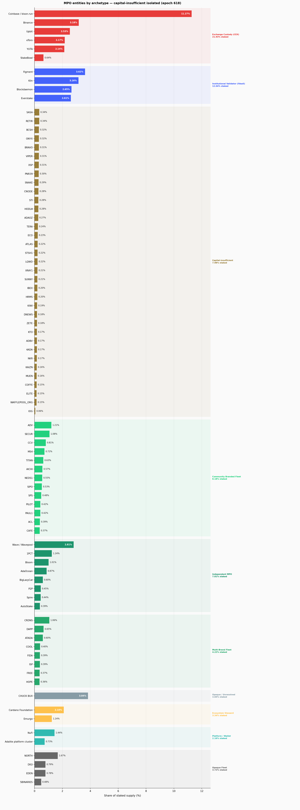

*POL.4.2 — Stake share by MPO archetype, ranked. **CEX + IVaaS** (custodial / institutional) dominate the upper bars at 19.2% of supply; sovereign archetypes (community fleets, independent MPOs, multi-brand fleets) collectively hold a comparable share but at structurally different pledge behaviour.*

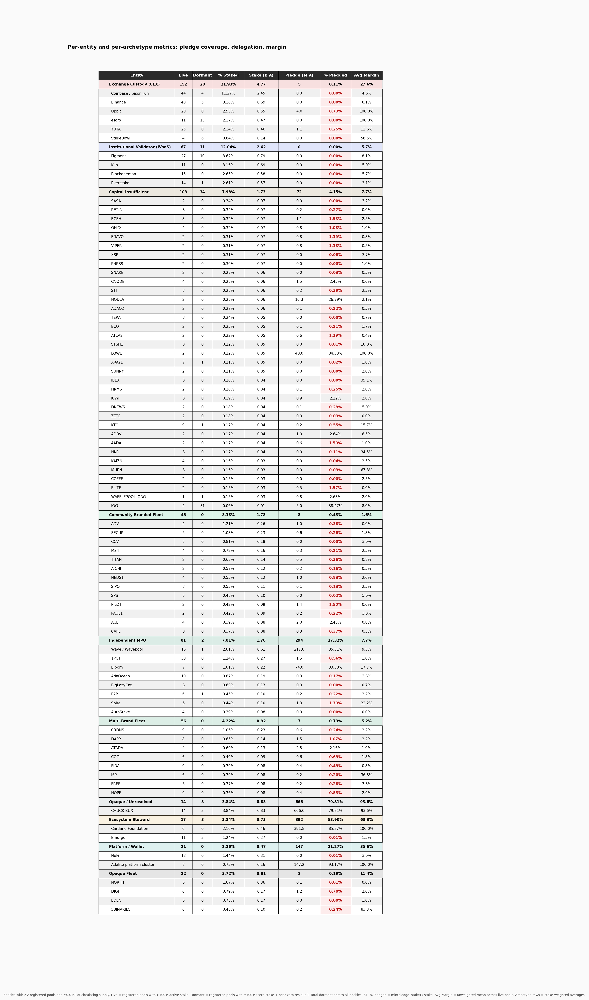

*POL.4.3 — Per-entity metrics for every entity ≥ 0.01% of circulating supply: live pool count, stake share, pledge-coverage ratio, and average margin. The **top six** (Coinbase, Binance, Figment, CHUCK BUX, Upbit, Cardano Foundation) jointly exceed 20% of staked supply.*

The figure groups every entity with **≥0.01%** of circulating supply by archetype. The bar chart shows their share of staked supply; the metrics table below it reports pool counts, pledge coverage, and average margin for each entity and archetype subtotal.

The concentration is immediate: the **top six entities** (Coinbase, Binance, Figment, CHUCK BUX, Upbit, Cardano Foundation) collectively exceed **20% of staked supply**. The long tail of sub-saturation and community fleets — numerous by entity count — barely registers in stake terms.

Per-entity descriptions including pledge-coverage ratios are in the annex: **[entities/docs/mpo_entity_profiles.md](../../census/mainnet-analysis/docs/mpo_entity_profiles.md)**.

#### 4.2.3.3. Historical evolution

The archetype-level composition has been **remarkably stable** across three years of Shelley operation. The aggregate MPO share has hovered around **42–43%** of circulating supply since epoch 300 — the internal mix shifts, but the total barely moves.

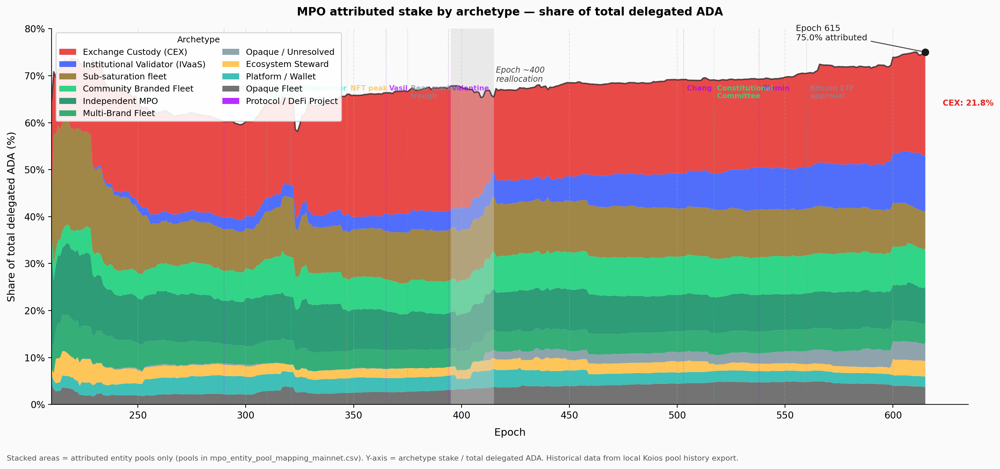

*POL.4.4 — Stacked-area history of MPO stake share by archetype (Shelley → epoch 618). Aggregate MPO share has been **flat at ~42–43%** of circulating supply since epoch 300; the internal mix shifts (CEX growing, community fleets stable, ecosystem stewards declining), but the total barely moves.*

That stability masks significant **entity-level rotation**:

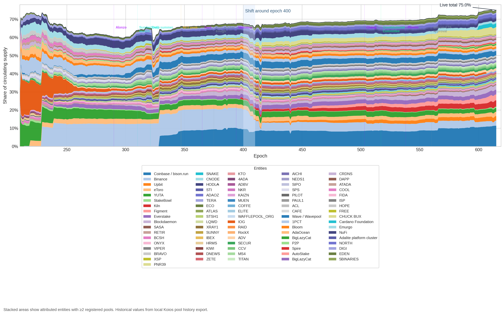

*POL.4.5 — Per-entity stake-share trajectories. Below the calm aggregate sits real rotation: Binance + IOG fall, Coinbase + Figment rise, community fleets churn — yet the aggregate MPO share holds. The mechanism is stable in macro composition while individual operators are constantly entering and exiting.*

| Movement | Epoch range | What happened |
| --- | --- | --- |
| **Binance** retreat | 400 → 618 | 7.4% → 1.8% of supply — largest single-entity decline |
| **Coinbase / bison.run** steady | 300 → 618 | Held ~6% throughout — the anchor of the CEX archetype |
| **Figment** emergence | 584 → 618 | Zero → 2.1% — rapid institutional validator growth |
| **CHUCK BUX** appearance | 410 → 584 | Appeared abruptly, now 3.8% — opaque provenance |

The entities rotate but the archetype totals persist. CEX as a whole has remained at roughly **12–13%** of supply throughout.

*This is the structural signature of a **fixed background**: the MPO landscape is not converging toward pledge compliance over time — it is cycling entities through the same zero-pledge archetypes.*

### 4.2.4. Pledge compliance — who plays and who doesn't

The archetype taxonomy answers *who is operating*. The more consequential question for mechanism design is: **how does each entity sit relative to the pledge game?**

Before answering that, what "playing the pledge game" means — and why the answer is not a simple binary — must be defined.

#### 4.2.4.1. Pledge compliance classification

The pool-level pledge data reveals that MPO non-response to pledge incentives takes **two distinct forms**:

1. **Structural inaccessibility** — sub-saturation fleets do not have enough aggregate stake to make the saturation-level pledge game economically relevant.
2. **Saturation-scale zero-pledge** — entities that *could* operate inside the reward sharing scheme at meaningful scale, but still capture almost none of the pledge premium.

**How the pledge bonus scales.** For a saturated pool ($\sigma' = z_0$), the bonus captured scales exactly as $s'/z_0$ — at 1% effective pledge ratio, 1% of the bonus is captured; at 30%, 30%.

For a half-saturated pool the relationship is mildly super-linear (30% pledge captures ~51% of that pool's maximum bonus), but the qualitative picture is the same: **very low pledge means very low capture**, and the reward foregone returns to the reserve as *within-stake inefficiency*.

This creates a natural behavioural classification based on how much of the pledge bonus an entity **actually captures**. The same **2% / 30% / 80%** thresholds are retained for **saturation-scale** entities, but sub-saturation fleets are **not** forced into the same ladder. Instead, they are isolated in a separate stance:

| Stance | Eligibility | Effective pledge ratio | Interpretation |
| --- | --- | --- | --- |
| **Can't play** | Sub-saturation | n/a | Multi-pool by structure, but sub-scale for the saturation-level pledge game. Better analysed as single-pool-like background than as a stance failure. |
| **Zero-pledge** | Saturation-scale | < 2% | Forfeits the bonus almost entirely despite having enough aggregate stake to play. |
| **Marginal** | Saturation-scale | 2–30% | Partial capture. This is the real decision boundary for parameter adjustments. |
| **Compliant** | Saturation-scale | 30–80% | Captures a meaningful share of the bonus and is clearly responsive to the reward sharing scheme's incentives. |
| **Exemplary** | Saturation-scale | ≥ 80% | Captures the vast majority of the bonus. The last 20% of pledge yields diminishing marginal gains. |

The **2% lower threshold** marks the point below which bonus capture is indistinguishable from noise. The **30% threshold** is the median-capture point for half-saturated pools, and **80%** marks the zone where most of the available premium is already captured.

The only conceptual change is upstream: **sub-saturation entities are removed from this ladder before classification**.

**Applied to all 83 attributed entities (productive set, epoch 623):**

| Stance | Entities | Stake (B ₳) | % productive | Composition |
| --- | ---: | ---: | ---: | --- |
| **Can't play** | 35 | 1.69 | 8.0% | Sub-saturation fleets: mostly smaller branded clusters, protocol projects, and single-pool-like MPOs below one saturated pool in aggregate |
| **Zero-pledge** | 42 | 12.20 | 57.6% | All CEX, all IVaaS, Emurgo, NuFi, BigLazyCat, and most saturation-scale community / opaque fleets |
| **Marginal** | 1 | 0.09 | 0.4% | The only saturation-scale entity in the 2–30% band |
| **Compliant** | 3 | 1.71 | 8.1% | CHUCK BUX, Wave / Wavepool, and Bloom |
| **Exemplary** | 2 | 0.55 | 2.6% | Cardano Foundation and Adalite Platform |

The result is **two-layered**.

First, **35 of 83 entities (1.69B ADA)** sit outside the large-MPO pledge game altogether — they **can't play** in any economically meaningful sense.

Second, among the **48 saturation-scale MPOs**, fully **42 are zero-pledge**, holding **12.20B ADA (57.6% of productive stake)**.

*Once scale is no longer an excuse, zero-pledge is not a fringe pattern but the overwhelming norm.*

> **Finding POL.O5.F3 — 42 of the 48 saturation-scale MPOs forgo the pledge bonus despite having enough capital to pledge meaningfully.** They sit below the 2% pledge bar (zero-pledge) and forfeit ~556K ADA/epoch (~40.6M/year) in pledge bonus rather than lock capital that would qualify for it. The responsive middle is tiny: 1 marginal, 3 compliant, 2 exemplary. The bonus penalty (~11–21% of maximum reward for the largest offenders) is a *modest tax* on operators of multi-million-ADA fleets, not a deterrent. Small parameter changes cannot solve what is fundamentally a population-structure problem.

The responsive middle is correspondingly thin. Only **one** saturation-scale entity is truly **marginal** at the decision boundary, and only **three** are clearly **compliant** without already being near-fully self-funded.

The exemplary pair — **Cardano Foundation** and **Adalite** — already capture almost the full premium and act more as a **positive control** than as a policy target.

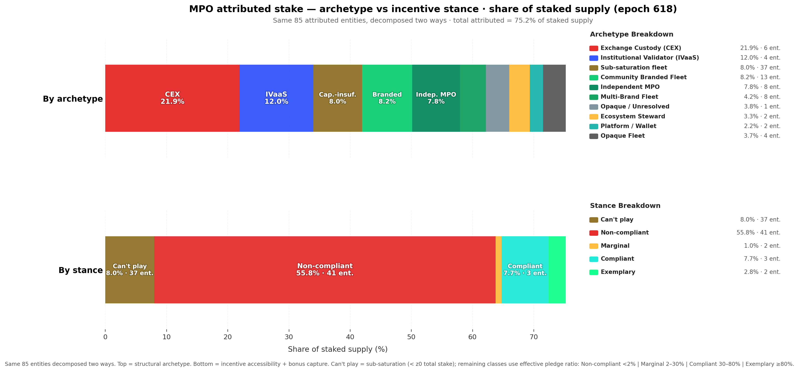

*POL.4.6 — MPO stake split across the four pledge-compliance stances (Can't play / Zero-pledge / Marginal / Compliant), broken down by archetype. **42 of 48 saturation-scale MPOs are zero-pledge**, holding 12.20B ADA — the responsive middle (Marginal + Compliant) is just 4 entities holding 1.80B.*

The figure decomposes the same attributed stake two ways: top bar by structural archetype, bottom bar by pledge compliance. The key split is now explicit:

- **1.69B ADA** sits in the ochre **"Can't play"** bucket;
- **12.20B ADA** sits in saturation-scale **zero-pledge** pools.

*The problem is therefore not a single low-pledge mass but a combination of **structural inaccessibility** and **large-scale strategic non-response**.*

> [!NOTE]
> **Implication for mechanism-design work.** Any proposed change to $a_0$, $k$, or the pledge-benefit curve should be evaluated against three separate populations, not one MPO blob: **Can't play** (35 sub-saturation entities, 8.0% of productive stake), **saturation-scale zero-pledge** (42 entities, 57.6%), and the thin **responsive middle** of marginal + compliant operators (4 entities, 8.5%). The exemplary population (2 entities, 2.6%) already captures most of the bonus.

#### 4.2.4.2. Architectural zero-pledge — CEX and IVaaS

The 42 zero-pledge entities are **not a uniform mass**. Two archetypes — **Exchange Custody** and **Institutional Validator** — account for **10 entities** and **7.39B ADA** (34.9% of productive stake), and their zero-pledge is *architectural*, not strategic.

> **Finding POL.O5.F4 — A third of productive stake is architecturally barred from pledging.** CEX (6 entities) and IVaaS (4 entities) — 10 entities operating 173 productive pools — hold 7.39B ADA, 34.9% of productive stake. Exchanges custody retail balances; institutional validators run client assets they do not own. No parameter change can move this stake into the pledge game — *it is architecturally outside*.

Understanding why they **cannot play** is essential before attempting any reform.

**Exchange Custody (CEX)** — 6 entities, 152 pools, 4.77B ADA (12.4% of supply)

Cardano's incentive mechanism was designed around a **principal–agent relationship**: an ADA holder freely delegates to a pool operator whose competitiveness is disciplined by pledge, margin, and saturation pressure.

Exchange-custody staking **breaks this relationship at every level**:

| Assumption | Protocol design | CEX reality |
| --- | --- | --- |
| Delegation is a sovereign choice | ADA holder picks a pool | Exchange assigns internally |
| Pledge reflects operator commitment | Operator locks own capital | Cannot pledge custodied funds (legal) |
| Saturation pushes stake to smaller pools | Delegators migrate when pool fills | Exchange creates a new pool silently |
| Margin signals quality | Delegators compare margins | Users see a fixed APY, not pool params |

The six CEX entities split into **two revenue models**:

- The ***pass-through model*** (Coinbase, Binance, YUTA, StakeBowl) sets low on-chain margins (**4–13%**) and earns on custody, trading spread, and service products.
- The ***full-internalisation model*** (Upbit, eToro) sets **100% on-chain margin** and pays users a separate fixed APY — the protocol reward signal is **entirely decoupled** from the user experience.

**Institutional Validator (IVaaS)** — 4 entities, 67 pools, 2.62B ADA (6.8% of supply)

IVaaS entities serve institutional clients via **staking-as-a-service**. Unlike CEX, the underlying ADA holders could in principle choose another provider; in practice, switching costs and contractual arrangements create similar lock-in.

IVaaS entities *could* in principle pledge operator equity, but the obstacle is **scale**: to shift the pledge premium meaningfully at 500–800M ADA of managed stake would require self-pledging hundreds of millions of ADA — **unrealistic** for a staking-infrastructure company whose equity base is a fraction of the ADA it manages.

*IVaaS suppresses the pledge signal by economic necessity, not by legal constraint.*

**Pledge suppression summary — CEX and IVaaS entities (epoch 618):**

| Entity | Archetype | Pools (act) | Stake (B ₳) | Near-sat | Med. pledge | Margin | Why pledge ≈ 0 |
| --- | --- | ---: | ---: | ---: | ---: | ---: | --- |
| Coinbase / bison.run | CEX | 47 | 2.451 | 23 | 0 | 4.6% | Cannot pledge custodied funds (legal) |
| Binance | CEX | 50 | 0.691 | 1 | 2 ₳ | 6.1% | Cannot pledge custodied funds (legal) |
| Figment | IVaaS | 36 | 0.788 | 4 | 0 | 8.4% | Scale makes pledge premium uneconomic |
| Kiln | IVaaS | 11 | 0.687 | 6 | 100 ₳ | 5.0% | Scale makes pledge premium uneconomic |
| Everstake | IVaaS | 15 | 0.567 | 1 | 1K ₳ | 2.9% | Scale makes pledge premium uneconomic |
| Blockdaemon | IVaaS | 15 | 0.561 | 4 | 200 ₳ | 5.7% | Scale makes pledge premium uneconomic |
| Upbit | CEX | 20 | 0.551 | 0 | 200K ₳ | 100% | Cannot pledge custodied funds (legal) |
| eToro | CEX | 12 | 0.472 | 0 | 0 | 100% | Cannot pledge custodied funds (legal) |
| YUTA | CEX | 25 | 0.465 | 0 | 50K ₳ | 12.6% | Custodial/platform staking |
| StakeBowl | CEX | 9 | 0.140 | 2 | 0 | 80.7% | Custodial/platform staking |

Detailed entity profiles (Coinbase obfuscation, Binance ghost fleet, Figment/Ledger Live back-end, Kiln enterprise wallets, etc.) are in the annex: **[entities/docs/mpo_entity_profiles.md](../../census/mainnet-analysis/docs/mpo_entity_profiles.md)**.

**CEX-adjusted baseline.** Excluding CEX entities remains analytically useful because it removes structurally pledge-zero, non-sovereign stake from the denominator.

But the revised framing in [§3.4 — The eligible pot and the pledge problem](#34-the-eligible-pot-and-the-pledge-problem) shows that this is only a **partial cleanup**: a second fixed population also exists in the form of sub-saturation MPOs. The `exclude_from_baseline: true` flag in [`mpo_entity_archetypes.csv`](https://github.com/input-output-hk/spo-incentives/blob/main/reward-system-spec/diagnostic/sub-flows/census/mainnet-analysis/data/mpo_entity_archetypes.csv) identifies the custodial entities to drop when a CEX-free comparison is desired.

#### 4.2.4.3. The cost of zero-pledge

[The eligible pot and the pledge problem](#34-the-eligible-pot-and-the-pledge-problem) established that the network-wide pledge bonus uncaptured is **~770K ADA/epoch (~56.2M/year)** — the second-largest component of within-staked waste at **39%** of the total.

The pledge-compliance classification allows that waste to be **attributed to its sources**.

For each MPO pool, three reward levels are computed under the current formula $\hat{f}'(\nu, \pi, \bar{p})$:

- **Actual reward**: using the pool's current effective pledge ($\min(\text{declared}, \sigma \cdot S_{\text{active}})$)
- **Maximum reward**: assuming full self-pledge ($\pi = 1$) at the pool's current stake level
- **Lost reward**: the difference — ADA that returns to the reserve instead of being distributed

**MPO entities — reward loss by pledge compliance (productive set, epoch 623):**

| Stance | Entities | Stake (B ₳) | Lost (₳/epoch) | Lost (₳/year) | Share of MPO loss |
| --- | ---: | ---: | ---: | ---: | ---: |
| **Can't play** | 35 | 1.70 | ~38K | ~2.8M | 6.0% |
| **Zero-pledge** | 42 | 12.23 | ~556K | ~40.6M | **87.4%** |
| **Marginal** | 1 | 0.09 | ~5K | ~365K | 0.8% |
| **Compliant** | 3 | 1.71 | ~28K | ~2.04M | 4.4% |
| **Exemplary** | 2 | 0.55 | ~6K | ~440K | 1.0% |
| **Total** | **83** | **16.29** | **~636K** | **~46.4M** | 100% |

> [!NOTE]
> The table above covers the full attributed MPO set in the productive set: **83 entities** and **449 productive pools** (≥3M ADA at epoch 623). Reward-loss estimates use the current pool stake and declared pledge under the epoch 616 reward pot assumptions already used in [§2 — The initial design](#2-the-initial-design); column values are rounded to reflect that the reward-anatomy model is a structural illustration, not a forecast.

These MPO entities account for **~636K ADA/epoch** of pledge-bonus waste — **~83% of the network-wide total** (~770K). The remaining **~17%** is distributed across the unattributed single-pool population and residual edge cases outside the attributed MPO set.

> **Finding POL.O5.F3 (restated) — ~87% of MPO-attributable pledge waste comes from the 42 saturation-scale zero-pledge entities.** They hold 12.20B ADA and collectively forfeit ~556K ADA/epoch (~40.6M/year). The entire can't-play population (35 entities) contributes ~38K ADA/epoch (~2.8M/year) — an order of magnitude smaller.

The two populations of zero-pledge are **qualitatively different**:

- In the **can't-play** bucket, low capture reflects **sub-scale economics** — closer to single-pool under-capitalisation than to strategic indifference.
- In the **zero-pledge** bucket, large-fleet operators forfeit substantial absolute ADA but experience it as a **modest tax** (11–21% of maximum reward), not a punitive penalty.

**Top five contributors to MPO pledge waste:**

| Entity | Stance | Stake (B ₳) | Lost (₳/epoch) | Lost (₳/year) | % of max reward lost |
| --- | --- | ---: | ---: | ---: | ---: |
| Coinbase / bison.run | Zero-pledge | 2.45 | 155,714 | 11,367,098 | 17.2% |
| Kiln | Zero-pledge | 0.69 | 49,846 | 3,638,734 | 20.3% |
| Figment | Zero-pledge | 0.79 | 38,777 | 2,830,752 | 14.3% |
| Blockdaemon | Zero-pledge | 0.58 | 34,153 | 2,493,204 | 16.0% |
| NORTH | Zero-pledge | 0.36 | 30,226 | 2,206,526 | 21.2% |

**Coinbase alone** accounts for **24.5% of all MPO pledge waste** (~156K/epoch). The top five — all saturation-scale zero-pledge — account for **48.5%** of the total; adding **Everstake** brings the top six to just above **52%**.

These are large-scale entities where the absolute ADA forfeited is substantial, but as a percentage of their maximum reward it still ranges from roughly **11% to 21%** — the "cost of not pledging" is a **modest tax on reward**, not a punitive penalty.

*This is precisely why they remain zero-pledge: the current $a_0 = 0.3$ makes the pledge bonus a nice-to-have, not a must-have.*

Within the **can't-play** bucket, the largest contributors are much smaller in absolute terms: **RETIR** (~6.3K/epoch), **SNAKE** (~4.0K), **BRAVO** (~3.0K), **ADAOZ** (~3.0K), and **SASA** (~2.2K). These are **not giant custodial fleets** refusing a meaningful bonus. They are **sub-scale operators** for whom the pledge premium remains economically secondary.

> [!NOTE]
> **Connection to [The eligible pot and the pledge problem](#34-the-eligible-pot-and-the-pledge-problem).** The **636,771 ADA/epoch** of MPO pledge waste is the dominant subset of the ~770K network-wide "pledge bonus uncaptured" identified in [The eligible pot and the pledge problem](#34-the-eligible-pot-and-the-pledge-problem). MPO entities contribute **82.7%** of this waste because they concentrate large stake volumes at near-zero pledge ratios. The remaining ~17% is distributed across thousands of smaller pools where low absolute pledge is more a function of operator capital constraints than of strategic indifference.
>
> **Why this matters for mechanism design.** If a parameter change (e.g., increasing $a_0$) aims to reduce within-staked inefficiency, its impact would differ by stance. For **can't-play** MPOs it would mostly raise a cost they are structurally too small to optimise away. For **saturation-scale zero-pledge** MPOs it would increase a penalty they already ignore or cannot operationally access. In both cases, the likely first-order effect is more ADA returning to the reserve, not a clean behavioural transition toward pledge.

##### 4.2.4.3.1. Top 10 contributors to MPO pledge waste

The "top five" table above understates the concentration: extending to ten entities captures **over half** of all MPO-attributable waste.

The table below uses a per-pool bonus model — $\lambda_{\text{pledge}} \cdot R \cdot \sigma \cdot \frac{s}{s + a_0(1-s)}$ where $s = \min(\text{pledge}/z_0,\,1)$ — applied to every pool of each entity.

| Rank | Entity | Pools | Pledge (ADA) | Stake (ADA) | Ratio | Waste (₳/epoch) | Bonus capture |
| ---: | --- | ---: | ---: | ---: | ---: | ---: | ---: |
| 1 | Coinbase | 46 | 1,000 | 2,428M | 0.00% | 174,676 | 0.0% |
| 2 | AdaLite | 31 | 147,229,000 | 1,224M | 12.03% | 76,927 | 12.6% |
| 3 | Figment | 32 | 22 | 746M | 0.00% | 53,683 | 0.0% |
| 4 | Binance | 50 | 74 | 691M | 0.00% | 49,691 | 0.0% |
| 5 | Eve | 15 | 11,040 | 568M | 0.00% | 40,826 | 0.0% |
| 6 | Upbit | 20 | 4,000,000 | 546M | 0.73% | 38,713 | 1.5% |
| 7 | Blockdaemon | 14 | 2,300 | 531M | 0.00% | 38,208 | 0.0% |
| 8 | eToro | 12 | 0 | 472M | 0.00% | 33,942 | 0.0% |
| 9 | Yuta | 25 | 1,150,000 | 466M | 0.25% | 33,431 | 0.4% |
| 10 | NORTH | 5 | 50,000 | 363M | 0.01% | 26,097 | 0.1% |

These ten entities collectively forfeit **~566K ADA/epoch** — **52% of all MPO pledge waste**. **Eight of the ten** have bonus capture below 2%, meaning the pledge mechanism is essentially invisible to them.

**AdaLite** is the notable outlier: it pledges 147M ADA (**12% ratio**), yet its large fleet still leaves **77K/epoch** on the table — demonstrating that even partial pledging at scale produces significant absolute waste.

##### 4.2.4.3.2. Top 10 most exemplary MPOs

Not all multi-pool operators ignore pledge. A handful treat it as a **genuine commitment**.

To qualify for this table, an entity must operate **at least 2 pools** with a combined stake above **10M ADA**.

Entity-level pledge ratios at epoch 623 (productive set; entities with ≥2 productive pools and ≥10M ADA aggregate stake):

| Rank | Entity | Pools | Pledge (M ADA) | Stake (M ADA) | Ratio | Stance |
| ---: | --- | ---: | ---: | ---: | ---: | --- |
| 1 | LQWD (Liqwid) | 2 | 29 | 29 | 100.0% | Exemplary (sub-saturation) |
| 2 | Cardano Foundation | 6 | 392 | 395 | 99.1% | **Exemplary** |
| 3 | Adalite Platform | 3 | 147 | 158 | 93.0% | **Exemplary** |
| 4 | CHUCK BUX | 13 | 666 | 877 | 75.9% | Compliant |
| 5 | IOG | 2 | 5 | 12 | 42.9% | Compliant (sub-saturation) |
| 6 | Wave / Wavepool | 14 | 217 | 613 | 35.4% | Compliant |
| 7 | Bloom | 7 | 74 | 223 | 33.2% | Compliant |
| 8 | HODL₳ | 2 | 16 | 61 | 26.9% | Marginal |
| 9 | KIWI | 3 | 1 | 41 | 2.2% | Marginal |
| 10 | ACL | 3 | 2 | 86 | 2.0% | Marginal |

The top three — **LQWD (100%, sub-saturation)**, **Cardano Foundation (99.1%)**, and **Adalite Platform (93.0%)** — demonstrate that high pledge ratios *are* achievable at scale. These entities have made an **active choice** to lock capital, accepting the opportunity cost.

Yet the "exemplary" tier drops off immediately: **only two saturation-scale entities** clear the 80% bar — the rest tail off into the compliant range. The mechanism is designed so that every entity *should* be at 100%; the fact that it barely reaches double digits for most of the landscape confirms the [The eligible pot and the pledge problem](#34-the-eligible-pot-and-the-pledge-problem) diagnosis — *pledge as anti-Sybil friction is functionally broken.*

The concentration is **extreme**. Only **two MPO entities** in the productive set clear the exemplary (≥80%) pledge bar, and they hold **0.55B ADA** combined — a fraction of the **2.35B ADA** held by all entities that actively pledge (marginal + compliant + exemplary combined).

Of those two, **Cardano Foundation** pledges by **institutional mandate**, not because the mechanism incentivises it to do so.

Remove the Foundation and the mechanism's entire exemplary output rests on **a single private entity** — Adalite Platform.

*A Sybil-resistance mechanism designed for 500 pools is, in practice, a transfer programme for one.*

> **Finding POL.O5.F5 — The mechanism's exemplary signal rests on one private entity.** Only two MPO entities clear the ≥80% pledge bar at epoch 623 — Cardano Foundation (99.1%) and Adalite Platform (93.0%). CF pledges by institutional mandate, not economic incentive; remove it and the exemplary band collapses to a single entity. *A Sybil-resistance tool designed for 500 pools is, in practice, a transfer programme for one.*

#### 4.2.4.4. Pledge compliance × pool tier

Crossing the pledge-compliance classification with the pool-size taxonomy ([§4.1 — Theoretical pool classification](#41-theoretical-pool-classification)) reveals where MPO pledge compliance *actually sits* in the stake landscape — and the picture is **more telling than either dimension alone**.

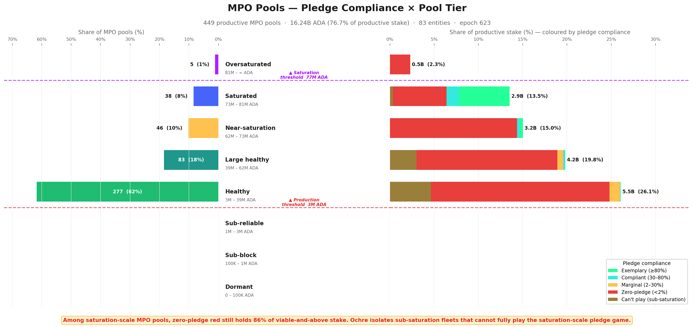

*POL.4.7 — Pool-level taxonomy coloured by the controlling entity's pledge-compliance stance. The upper tail (Healthy and above) is dominated by **zero-pledge red**: most productive pools are operated by entities that capture none of the pledge bonus despite being saturation-scale.*

The entity-level breakdown below shows exactly who sits where — each sub-bar is one entity's pools within a tier × stance group:

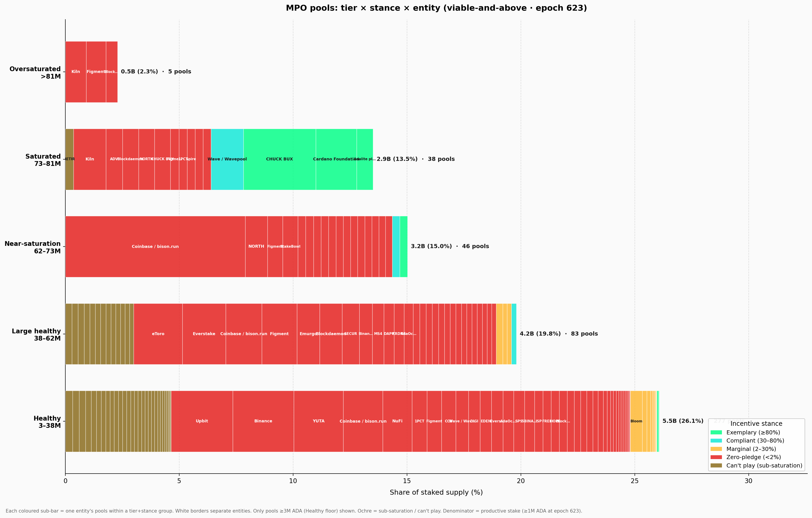

*POL.4.8 — Entity-level breakdown of pool tier × pledge stance, with each sub-bar one entity's pools within a (tier, stance) cell. Lets you read the **2-3 large operators** (Coinbase, Binance, Figment, etc.) responsible for most zero-pledge at the upper tiers.*

A third view isolates only the **saturation-scale zero-pledge** entities and recolours the bars by **pool-size tier** rather than by stance. The left panel shows fleet composition; the right panel shows where the stake sits:

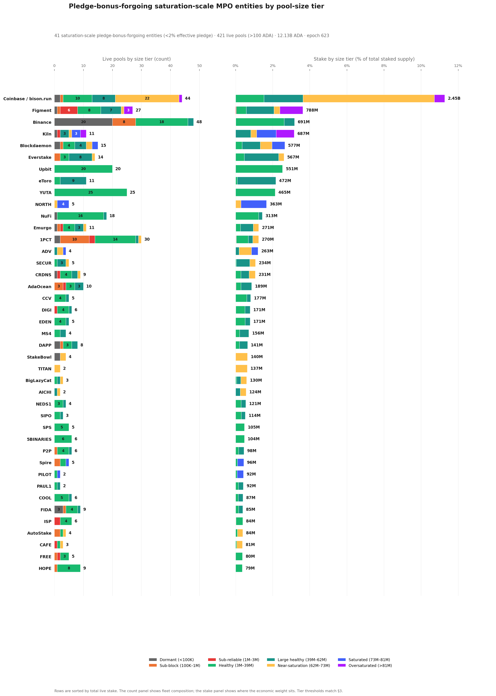

*POL.4.9 — Saturation-scale zero-pledge MPO entities, recoloured by pool-size tier rather than stance. Zero-pledge stance is **not a small-pool problem** — it dominates every tier from Healthy through Oversaturated, with **>99% of the 12B ADA** sitting in viable-and-above pools.*

The most striking observation is that **saturation-scale zero-pledge is not a small-pool problem** — it is a ***scale* phenomenon**.

Among saturation-scale MPOs, zero-pledge entities still dominate **every viable-and-above tier**, from Healthy through Oversaturated, accounting for **85.5% of saturation-scale viable-and-above MPO stake** (12.44B of 14.55B ADA). The intuition that low-pledge MPOs are marginal, under-resourced operators is **flatly contradicted** by the data: the largest single zero-pledge fleet, **Coinbase / bison.run** (2.45B ADA), is one of the most operationally successful entities on the network.

> **Finding POL.O5.F6 — Zero-pledge stance scales with size — it is not a small-pool problem.** Among saturation-scale MPO pools at or above the Healthy floor (≥3M ADA), 85.5% of stake (12.44B of 14.55B ADA) sits in zero-pledge pools. The pledge gap *widens* with fleet size — the larger the entity, the looser its pledge ratio.

This zero-pledge is also **widely spread across the tier spectrum**. Across the **42 saturation-scale zero-pledge entities**, productive stake splits across the full Healthy → Oversaturated range — no single tier dominates, and no single-tier reform can address the pattern.

**No single size bucket contains the problem.** This matters for mechanism design: if zero-pledge were confined to one tier, a targeted parameter adjustment might address it. Instead, any change to $z_0$, $minPoolCost$, or $a_0$ would ripple across *all* tiers — affecting compliant operators alongside the zero-pledge ones it aims to reach.

> **Finding POL.O5.F7 — No single-tier reform reaches zero-pledge.** Zero-pledge stake spreads across Healthy, Large healthy, Near-saturation, and Saturated/Oversaturated — every tier carries it. A reform targeting one tier leaves the others untouched and propagates secondary effects across the whole population; *any change reshapes the whole landscape, not just the segment it targets.*

The **can't-play** population is different in cause but not in surface footprint. Of its **1.74B ADA**, fully **1.72B** already sits in viable-and-above pools, concentrated mostly in **Healthy (0.97B)** and **Large healthy (0.61B)**.

So isolating sub-saturation fleets does **not** reveal a dormant micro-pool fringe. It reveals a **second structural population** of MPOs that are operationally real, often viable, but still too small in aggregate for the saturation-level pledge game to be the right behavioural lens.

The entity profiles reinforce this pattern:

- **Upbit** and **YUTA** remain almost pure Healthy-tier zero-pledge operators.
- **Binance** remains visibly bimodal — a healthy core alongside a long Dormant/Sub-block tail.
- **Kiln**, **Blockdaemon**, **eToro**, and **Everstake** skew upward into Large healthy, Saturated, or Oversaturated tiers, showing that the pledge signal remains **ignored even once pools are already operating at scale**.
- The sub-saturation long tail clusters mostly in Healthy and Large healthy bands rather than in the fringe of dormant micro-pools.

On the other side of the spectrum, **exemplary compliance exists only at saturation scale**: **Cardano Foundation** and **Adalite** self-pledge tens of millions of ADA per pool to reach the ≥80% threshold at $z_0 = 77M$.

The **compliant class** (**Wave**, **Bloom**, **CHUCK BUX**) appears in Near-saturation and Healthy tiers with 30–80% pledge ratios — proof that meaningful bonus capture *is* feasible at mid-scale, **but only for operators who own their delegated stake**.

The **marginal class**, by contrast, is nearly empty among MPOs: just **ATADA** and **ACL**.

### 4.2.5. Conclusion

**What the [*Incentive Mechanism Analysis*](https://github.com/input-output-hk/spo-incentives/blob/main/report.pdf) established.** Lopez de Lara (2025) identified multi-pool operators as a significant presence in the landscape and flagged exchange-custody stake as structurally outside the pledge mechanism. The analysis treated MPOs as a **single population** and recommended excluding CEX entities from baseline calculations.

**What this analysis adds.** The single-population framing obscures **three distinct sub-populations** with fundamentally different relationships to the pledge mechanism.

Attribution of **83 entities across 449 productive pools** (≥3M ADA at epoch 623) reveals that **76.7% of productive stake** is controlled by MPOs — but these entities split into saturation-scale (**48**) and sub-saturation (**35**) classes, and further into **ten archetypes** with different delegation sources, operating models, and structural constraints.

The compliance classification shows that zero-pledge is not a fringe pattern but the **overwhelming norm** among saturation-scale MPOs (**42 of 48**), and that the cost of that zero-pledge (**~556K ADA/epoch**) is concentrated in a handful of large entities for whom the penalty is a **modest tax**, not a deterrent.

The tier × stance cross-analysis confirms that zero-pledge spans *every* viable tier — *it is a scale phenomenon, not a small-pool problem.*

> **Finding POL.O5.F1 — Three quarters of the network's stake sits in 83 named entities.** They operate 449 productive pools (≥3M ADA at epoch 623) holding 16.24B ADA — 76.7% of productive stake. 73 are strict multi-pool fleets; 10 are single-pool operators attributed by ticker, metadata, or relay clustering.
>
> **Finding POL.O5.F2 — Only 48 of 83 MPO entities can ever run a saturated pool.** Their aggregate stake clears one saturation cap ($z_0 \approx 77\text{M ADA}$). The other 35 (1.69B ADA) are *sub-saturation*: even perfect consolidation does not reach $z_0$ — they are multi-pool by form, single-pool-like in economics. The split is purely structural and has nothing to do with pledge.
>
> **Finding POL.O5.F3 — 42 of the 48 saturation-scale MPOs forgo the pledge bonus despite having enough capital to pledge meaningfully.** They sit below the 2% pledge bar — they forfeit ~556K ADA/epoch (~40.6M/year) rather than lock capital that would qualify for it. The responsive middle is tiny: 1 marginal, 3 compliant, 2 exemplary.
>
> **Finding POL.O5.F4 — A third of productive stake is architecturally barred from pledging.** CEX + IVaaS — 10 entities operating 173 productive pools — hold 7.39B ADA (34.9% of productive stake). No parameter change can move this stake into the pledge game.
>
> **Finding POL.O5.F5 — The mechanism's exemplary signal rests on one private entity.** Only two MPO entities clear the ≥80% pledge bar — Cardano Foundation (99.1%) and Adalite Platform (93.0%). CF pledges by mandate; remove it and the exemplary band collapses to a single entity.
>
> **Finding POL.O5.F6 — Zero-pledge stance scales with size — it is not a small-pool problem.** Among saturation-scale MPO pools at or above the Healthy floor (≥3M ADA), 85.5% of stake (12.44B of 14.55B ADA) sits in zero-pledge pools.
>
> **Finding POL.O5.F7 — No single-tier reform reaches zero-pledge.** Zero-pledge stake spreads across Healthy, Large healthy, Near-saturation, and Saturated/Oversaturated — every tier carries it. *Any change reshapes the whole landscape, not just the segment it targets.*

The **double asymmetry** is now sharp:

- **1.69B ADA** of MPO stake **cannot enter** the game;
- Another **12.20B ADA could enter** it but largely does not.

*This is not a calibration gap that parameter tuning can close — it is a structural mismatch between the mechanism's assumptions and the operator populations that now dominate the stake landscape.*

[§4.3 — The remaining single-pool operators](#43-the-remaining-single-pool-operators) turns to the remaining 25% of stake: the unattributed single-pool operators who are the intended beneficiaries of any reform.

## 4.3. The remaining single-pool operators

The entity-level analysis above accounts for **16.24B ADA** across 83 attributed entities. The remaining **477 productive pools** carrying **5.28B ADA** (**24.5%** of productive stake) are the **unattributed single-pool operators** — individuals, small teams, and community projects running one pool with their own stake and organic delegation.

These are the operators the reward sharing scheme was **originally designed for**, and they are the population most affected by any parameter reform.

### 4.3.1. Tier distribution — what MPO removal reveals

**Reassessing the [*Incentive Mechanism Analysis*](https://github.com/input-output-hk/spo-incentives/blob/main/report.pdf)'s landscape.** Lopez de Lara (2025) classified all 2,919 non-retired pools at epoch 583 into four viability tiers, treating each pool as an independent actor:

- **Inactive** — 1,305 pools (44%), 47M ADA. Unmet pledge, no blocks, no updates.
- **Struggling** — 627 pools (22%), 191M ADA. Active but below 3M ADA stake and below the cumulative reward break-even point.
- **Viable but small** — 246 pools (8%), 368M ADA. Below 3M ADA stake but earning enough to cover costs.
- **Healthy** — 741 pools (26%), 21.14B ADA. Above the 3M ADA viability line, consistent production, financially sustainable.

That headline — *741 healthy pools controlling 97% of stake* — was presented as evidence of a functioning incentive scheme.

> The question this section answers: **how many of those 741 pools were single-pool operators, and how many were fleet members of multi-pool entities?**

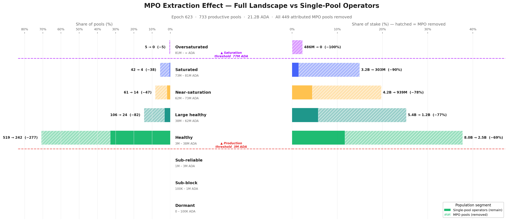

*POL.4.10 — The MPO-extraction effect on the pool taxonomy. Removing fleet-member pools collapses the Healthy tier from 741 → 283 pools and from 21.2B → 4.9B ADA — a **77% drop in stake**. The "large and diverse healthy ecosystem" was 61% MPO fleets.*

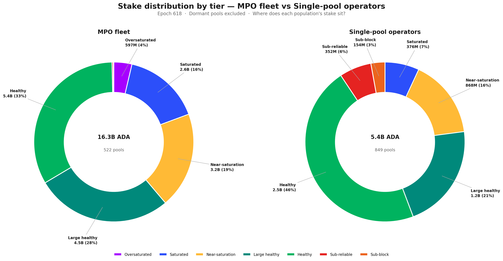

*POL.4.11 — Tier-by-tier split of stake between MPO-operated pools (in fleet) and single-pool operators. **Below viability**, single-pool operators dominate (the "long tail" is genuinely independent); **above viability**, MPO presence climbs to 53% Healthy → 79% Large healthy → 87% Saturated → 100% Oversaturated.*

The extraction effect is **starkly asymmetric**. Below the production threshold (3M ADA), MPO pools are rare — only **9%** of sub-block / sub-reliable pools are MPO fleet members. Above the production threshold, MPOs dominate: **53%** of Healthy pools, **79%** of Large healthy, **87%** of Saturated, and **100%** of Oversaturated.

*The higher the tier, the greater the MPO share.*

Mapping the [*Incentive Mechanism Analysis*](https://github.com/input-output-hk/spo-incentives/blob/main/report.pdf)'s categories to the finer tier taxonomy and applying entity attribution:

- **Inactive (1,305 pools)** → mostly Dormant and Sub-block in the tier taxonomy. MPO presence is low (**~9%**). This category is essentially unchanged by entity attribution — the long tail of inactive pools is **genuinely independent**.
- **Struggling (627 pools)** → maps to Sub-reliable and lower Sub-block tiers. MPO share remains modest (**~11%**). These operators are real — they are independent, they are trying, and they are failing.
- **Viable but small (246 pools)** → straddles the Sub-reliable/Healthy boundary. After extraction, the majority remain — these are the community operators the reward scheme was designed for.
- **Healthy (741 pools, 21.14B ADA)** → this is where the picture **collapses**. The epoch-618 snapshot shows **731 viable-and-above pools** (the near-identical count confirms structural stability). After removing MPO fleet members, only **284 independent productive single-pool operators remain** — **61% of the "healthy" headline was MPO pools**. The stake reduction is even more dramatic: from **21.2B to 4.94B ADA** — a **77% drop**.

The [*Incentive Mechanism Analysis*](https://github.com/input-output-hk/spo-incentives/blob/main/report.pdf)'s conclusion that *"the existence of a large and diverse set of healthy operators is an indicator of the incentive scheme's success"* was based on a population that was **neither as large nor as diverse** as it appeared.

*The 741 pools were not 741 independent actors making individual economic decisions — they were ~280 single-pool operators plus ~450 fleet members whose pledge, fee, and delegation strategies were set at the entity level.*

> **Finding F5.5 — The [*Incentive Mechanism Analysis*](https://github.com/input-output-hk/spo-incentives/blob/main/report.pdf)'s "741 healthy pools" were 61% MPO fleet members.** After entity attribution, only 284 independent productive single-pool operators remain (~38% of the headline count), holding 4.94B of the original 21.2B viable stake (~23%). The competitive field for single-pool operators is far smaller than the full landscape suggests. The incentive scheme's success should be measured against the 284, not the 741.

### 4.3.2. Pledge compliance and the policy-sensitive population

With MPOs removed, the single-pool landscape can be evaluated on its own terms: *do single-pool operators behave differently with respect to pledge?*

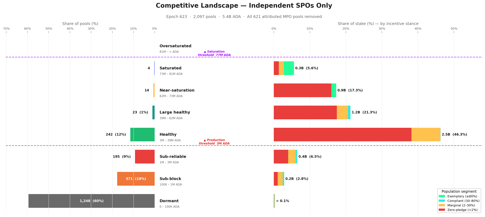

*POL.4.12 — Pool landscape **after MPO extraction** — single-pool operators only. The vast majority of single-pool pools sit below the production threshold (3M ADA) and are economically marginal; the centre of gravity sits in the Healthy tier — and reaching Near-saturation or above as an unattributed single-pool operator is **genuinely rare** (a handful of pools).*

The single-pool population at the **productive set (≥3M ADA at epoch 623, the 95%-block-probability threshold) is 284 pools holding 4.94B ADA**. Applying the pledge-compliance ladder from [Pledge compliance classification](#4241-pledge-compliance-classification) to that 284:

| Stance | Pools | Stake | % of single-pool productive | Reading |
| --- | ---: | ---: | ---: | --- |
| **Zero-pledge** (< 2%) | 227 | 3.98B ADA | **80.6%** | The large majority — pledge signal too weak at their scale |
| **Marginal** (2–30%) | 51 | 685M ADA | **13.9%** | Operators who *partially* pledge — the policy-sensitive population |
| **Compliant** (30–80%) | 3 | 50M ADA | 1.0% | Meaningful pledge — economically very thin |
| **Exemplary** (≥80%) | 3 | 225M ADA | 4.6% | Saturated single-pool operators self-staking ~75M ADA each |

The shape is *uniformly low-pledge*. Only **6 of 284 single-pool operators** clear the 30% bar at all (3 compliant + 3 exemplary, 275M ADA total ≈ 5.6% of single-pool productive stake). The exemplary tier is a *handful of large self-staked operators* (each ~75M ADA, near-100% pledge) — proof that single-pool exemplary pledging exists at scale, but only as 3 outliers.

**~81% of single-pool productive stake is zero-pledge** — *not because operators are irrational, but because the incentive is correctly priced as irrelevant at their scale*: the pledge yield (≤0.68%/year) is dominated by passive-delegation yield (~2.3%/year) at every realistic pledge level. The Healthy core that anchors the single-pool landscape sits almost entirely in the zero-pledge band.

**The marginal operators — the policy-sensitive population.** The **51 marginal single-pool operators** (685M ADA, **13.9%** of single-pool productive stake) sit at the **decision boundary**.

These operators partially pledge (between 2% and 30% of their pool stake) — enough to show awareness of the mechanism, not enough to capture a significant share of the bonus. They are the population **most likely to respond to a parameter change**: already engaged with the pledge concept, but not yet committed at a level where the current reward justifies further capital lock-up.

For mechanism design, this is the **highest-return target**. A reformed pledge curve that differentiates at realistic pledge levels (**100K–10M ADA**) rather than at saturation scale could shift this population toward higher compliance — provided the marginal reward exceeds the opportunity cost of locking additional capital.

### 4.3.3. Historical evolution — has the single-pool landscape always looked like this?

The tier and pledge snapshots above describe the current state. But the single-pool population is **not static** — pools enter, exit, grow, and shrink across epochs.

To understand whether the current picture is a recent development or a long-standing structural feature, the chart below tracks today's single-pool basket backwards through pool history, reconstructing each pool's pledge stance at every past epoch from on-chain pool update records.

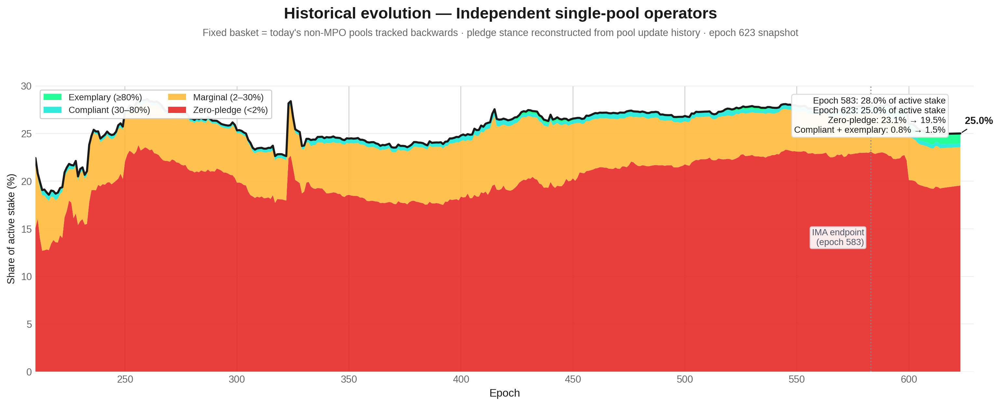

*POL.4.13 — Historical evolution of the independent single-pool segment. Stake share fell from **28.0% to 25.0%** since epoch 583 — a slow structural decline. The replacement process maintaining the ~950-pool quasi-equilibrium is driven by **MPO fleet expansion**, not by new independent entrants.*

The answer is **unambiguous**: the single-pool landscape has been **structurally stable since the early Shelley era**.

Single-pool operators have held between **20% and 28%** of active stake since epoch ~250, with the zero-pledge band (red) consistently dominating — typically **75–80%** of the single-pool-operator share. The marginal band (amber) has hovered at **4–6%** throughout, and the compliant + exemplary sliver has **never exceeded 2%** until the very recent epochs.

Two features stand out:

- First, the **drop from ~28% to ~25%** between epoch 583 (the [*Incentive Mechanism Analysis*](https://github.com/input-output-hk/spo-incentives/blob/main/report.pdf)'s endpoint) and epoch 618. This is **not noise** — it reflects a real decline in single-pool operator stake share, likely driven by delegation migrating toward MPO fleets offering lower margins and higher reliability. *The competitive landscape for single-pool operators is shrinking, not growing.*

- Second, the **composition within the band has barely moved**. Zero-pledge stake was **23.1%** at epoch 583 and is **19.5%** at epoch 618 — the drop tracks the overall decline, not a shift toward compliance. The compliant + exemplary slice improved from **0.8% to 1.5%**, but this remains negligible in absolute terms. *The pledge mechanism has not produced a behavioural transition among single-pool operators over any time horizon visible in the data.*

> **Finding POL.O6.F4 — The single-pool landscape is in slow structural decline.** Single-pool operators' share of active stake has fallen from 28.0% to 25.0% since epoch 583 — a 3 percentage-point loss in 35 epochs. The internal pledge composition has barely changed: zero-pledge stake dominates now just as it did at the start of the Shelley era.

### 4.3.4. Conclusion

> **Finding POL.O6.F1 — The [*Incentive Mechanism Analysis*](https://github.com/input-output-hk/spo-incentives/blob/main/report.pdf) overstated the competitive field by 3×.** The headline of 741 healthy pools collapses to 284 single-pool operators once MPO fleet members are removed. The "large and diverse" ecosystem presented as evidence of a functioning incentive scheme was 61% multi-pool fleet members operating under entity-level strategies unrelated to single-pool economics.

> **Finding POL.O6.F2 — Single-pool operators do not pledge better — they pledge *worse*.** 80.6% of single-pool productive stake is zero-pledge (pledge ratio < 2%). The compliant and exemplary classes combined hold only 5.8% of single-pool stake — economically negligible. The pledge mechanism, at current $a_0 = 0.3$, is correctly priced as irrelevant by the very population it was designed to reward.

> **Finding POL.O6.F3 — The policy-sensitive population is narrow but real.** 51 marginal operators (13.9% of single-pool productive stake) partially pledge — enough to show awareness, not enough to capture meaningful bonus. These are the operators most likely to respond to a reformed pledge curve. Any parameter change should be evaluated against this 16%, not against the 78% zero-pledge majority for whom the mechanism is structurally out of reach.

The implication is clear: **the reward sharing scheme, as currently parameterised, does not differentiate effectively at the scale where single-pool operators actually live**. The pledge bonus rewards saturation-level commitment that only MPOs and a handful of large community pools can reach.

*For the 2,097 single-pool operators carrying 5.4B ADA, the mechanism is functionally inert.*

## 4.4. The full picture

Section 3 has peeled the pool landscape layer by layer:

- **Structure** ([§4.1 — Theoretical pool classification](#41-theoretical-pool-classification)) — what a pool *can* be, from Dormant to Oversaturated, defined by protocol-derived tier boundaries.
- **Entities** ([§4.2 — Behind the pools: entity-level analysis](pools.html#42-behind-the-pools-entity-level-analysis)) — who actually controls the pools, how many games they play, and whether they respond to the pledge signal.
- **Single-pool operators** ([§4.3 — The remaining single-pool operators](#43-the-remaining-single-pool-operators)) — the community base that remains once the fleets are removed, and how it compares to the [*Incentive Mechanism Analysis*](https://github.com/input-output-hk/spo-incentives/blob/main/report.pdf)'s landscape.

This section reassembles those layers into a single map.

*The picture that emerges is one of three distinct populations — bad actors, good actors, and a struggling middle — competing on a field where the pledge mechanism reaches only a fraction of the stake it was designed to influence.*

### 4.4.1. The bad actors

The pool-level view — 2,718 registered pools spread across eight tiers — is a **statistical illusion**. Entity attribution reveals that **83 attributed entities** operate 449 productive pools and control **16.24B ADA — 76.7% of productive stake** (POL.O5.F1).

*The competitive dynamics, pledge decisions, and delegation flows are governed at the entity level, not the pool level.*

The vast majority of these entities do not play the pledge game. Among the 48 MPOs that are saturation-scale — meaning they hold enough aggregate stake to self-pledge at meaningful ratios — **42 are zero-pledge** (POL.O5.F3). They forfeit **~556K ADA/epoch** (~40.6M/year) in pledge bonus and absorb the cost without changing behaviour.

The zero-pledge has two distinct causes:

- **Architectural** (can't play). CEX and IVaaS operators — Coinbase, Binance, Upbit, Kiln, Figment, Everstake, and others — hold **7.39B ADA** at structurally zero pledge (POL.O5.F4). Exchanges cannot pledge customer deposits; validator-as-a-service providers do not own the institutional stake they operate. No parameter change can bring this capital into the pledge game.

- **Strategic** (won't play). The remaining saturation-scale fleets *could* pledge, but the reward trade-off is too weak. At $a_0 = 0.3$, the penalty amounts to 11–21% of maximum reward for the biggest offenders — a modest tax, not a deterrent. These actors are not maximizing within the reward sharing scheme alone; they optimize across a broader landscape where custody constraints, governance posture, brand continuity, and adjacent business lines all dominate the pledge signal. This is ***multi-game optimization***.

Adding the 35 sub-saturation MPOs (who are multi-pool by form but single-pool-like in economics), the non-responsive population totals **77 of 83 entities** — accounting for:

- **13.89B ADA** — 65.6% of productive stake
- **~636K ADA/epoch** in pledge waste — ~83% of the network total
- Every tier from Healthy through Oversaturated — meaning any parameter adjustment ripples across the full spectrum (POL.O5.F6, POL.O5.F7)

### 4.4.2. The good actors

A handful of entities demonstrate that high pledge *is* achievable at scale (entity-level aggregate ratio at epoch 623):

| Entity | Pledge ratio | Type |
| --- | ---: | --- |
| Cardano Foundation | 99.1% | Institutional mandate |
| Adalite Platform | 93.0% | Private choice |
| CHUCK BUX | 75.9% | Private choice (just below the exemplary bar) |
| Wave / Wavepool | 35.4% | Private choice |
| Bloom | 33.2% | Private choice |

These are deliberate capital commitments, not accidents. But the mechanism's entire MPO **exemplary** signal rests on **2 entities**, one of which (Cardano Foundation) pledges by institutional mandate rather than economic incentive (POL.O5.F5). That leaves **Adalite Platform** as the only private entity in the exemplary band — the rest tail off into the compliant range.

*A mechanism designed to differentiate 500 pools has collapsed into a transfer to one.*

Among single-pool operators, **360 exemplary pools** self-pledge at high ratios, proving that small operators *can* play. But they hold only **0.23B ADA** in aggregate — economically marginal.

*The good actors exist; they are too few and too small to anchor the mechanism.*

### 4.4.3. The struggling middle

The operators the reward sharing scheme was originally designed for — independent, single-pool, community-run — are the population **most affected by this landscape and least served by the current mechanism**.

**The field is far smaller than it appears.** The [*Incentive Mechanism Analysis*](https://github.com/input-output-hk/spo-incentives/blob/main/report.pdf)'s headline of 741 healthy pools collapses to **284 single-pool operators** once MPO fleet members are removed — the other 61% were fleet pools operating under entity-level strategies unrelated to single-pool economics (POL.O6.F1). The remaining 284 productive single-pool operators hold **4.94B ADA**, 23.3% of productive stake.

**They do not pledge better than MPOs — they pledge *worse*.** 80.6% of single-pool productive stake is zero-pledge (pledge ratio < 2%). The compliant + exemplary classes combined hold just **5.8%** of the basket — economically negligible (POL.O6.F2). The pledge mechanism, at current $a_0 = 0.3$, is correctly priced as irrelevant by the very population it was designed to reward.

**A policy-sensitive population exists, but it is narrow.** 51 marginal operators (13.9% of single-pool productive stake) partially pledge — enough to show awareness, not enough to capture meaningful bonus (POL.O6.F3). These operators sit at the decision boundary and are the most likely to respond to a reformed pledge curve.

**And the window is closing.** Single-pool operators' share of active stake has fallen from **28.0% to 25.0%** since epoch 583 — a 3 percentage-point loss in 35 epochs. The internal pledge composition has barely moved: *zero-pledge stake dominates now just as it did at the start of the observation window* (POL.O6.F4).

### 4.4.4. The pledge mechanism's actual reach

> How large is the arena where the pledge mechanism actually has an observable effect?

To measure this, all pools belonging to non-responsive MPOs are stripped out. Among the remaining MPO entities, only pools that are at least marginally pledging are retained. The result:

- **2,218 pools** carrying **7.89B ADA** — roughly **36% of active stake**
- Of which **121 retained MPO pools** account for **2.45B ADA**
- Everything outside this perimeter is either structurally unable or strategically unwilling to respond to the pledge signal

> **Finding POL.O7.F1 — The pledge mechanism's actual reach is 36% of active stake (7.89B ADA).** Strip out the entities that don't respond to the pledge signal and what remains — single-pool operators plus the few MPOs that pledge meaningfully — carries 7.89B ADA out of ~21.7B active. The other 13.89B ADA (65.6% of productive stake) is held by entities the bonus does not reach. *The mechanism was designed to discipline operator behaviour across the whole network; in practice it operates on roughly a third of it.*

> **Finding POL.O7.F2 — MPO non-response splits into three distinct populations.** Each one is non-responsive for a different reason, and conflating them is what keeps reform from working:
>
> - **Architectural** — 10 entities (CEX + IVaaS, **7.39B ADA**): legally cannot pledge. Exchanges custody retail balances; institutional validators run client assets they do not own.
> - **Strategic** — 32 sovereign saturation-scale MPOs (**4.80B ADA**): community fleets, independent MPOs, multi-brand fleets, ecosystem stewards. They *could* pledge but the bonus pays less than passive delegation at their scale, so they choose not to.
> - **Sub-scale** — 35 sub-saturation MPOs (**1.69B ADA**): aggregate stake below one saturation cap; pledging is mechanically too small to matter.
>
> *Three different problems wearing the same label.*

> **Finding POL.O7.F3 — No single parameter change addresses all three populations — each requires a different lever.**
>
> - *Architectural* responds to constitutional/contractual change — or to accepting that ~7.4B ADA is permanently outside the mechanism's scope.
> - *Strategic* responds to altering the relative payoff of pledging vs delegating — i.e., reforming the pledge-yield curve so the bonus is no longer dominated.
> - *Sub-scale* responds to a structural path (e.g., a shared-operations layer) for stake that cannot reach saturation alone.
>
> *Raising $a_0$ — the lever the "calibration" framing reaches for — addresses only the strategic group, and only weakly.*

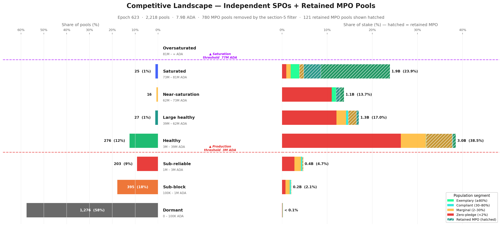

*POL.4.14 — The **incentive-responsive arena**: single-pool operators **plus** the retained MPO fleets (community / independent / multi-brand / ecosystem / platform), excluding CEX, IVaaS, and sub-saturation entities that cannot or do not respond to the pledge signal. **7.89B ADA — only 36% of active stake** sits in this arena. The pledge signal reaches a fraction of the network, not the whole.*

The retained MPOs — 70 marginal, 17 compliant, 34 exemplary — reshape the tier structure when added back. The Saturated tier, nearly empty in the single-pool-only view ([§4.3 — The remaining single-pool operators](#43-the-remaining-single-pool-operators)), now carries **2.0B ADA** (24.8% of the filtered basket).

*These are the only MPO pools where the pledge signal visibly influences behaviour.*

The contrast between the two views captures the **core asymmetry**:

| View | Compliant + exemplary stake | % of basket |
| --- | ---: | ---: |
| Single-pool operators only | 0.32B ADA | 5.8% |
| Filtered proxy (+ retained MPOs) | 2.07B ADA | 26.3% |
| **Multiplier** | | **6.6×** |

The pledge bonus *does* capture meaningful capital — but almost exclusively among operators who already sit at or near saturation scale.

*For the vast majority of single-pool operators, the mechanism is functionally inert.*

> **Finding POL.O7.F3 — The actual incentive-responsive arena holds 7.89B ADA — 36% of active stake.** Once non-responsive MPOs are stripped out and only marginally-pledging MPO pools are retained, the filtered proxy contains **2,218 pools** and **~36%** of staked supply. This is the ceiling on what any pledge-curve reform can directly move. Discussions of $a_0$, $k$, or the bonus shape that ignore the perimeter conflate the formula's nominal scope (the whole network) with its operative scope (just over a third of it).

### 4.4.5. The structural mismatch

The reward sharing scheme was designed for a world of independent, single-pool operators competing on pledge commitment. **The world that exists is fundamentally different.**

Three numbers frame the gap:

| Population | Stake | Relationship to pledge |
| --- | ---: | --- |
| Sub-saturation MPOs | 1.69B ADA | *Cannot* enter the game |
| Saturation-scale zero-pledge MPOs | 12.20B ADA | *Could* enter but do not |
| Single-pool operators | 5.28B ADA | Mechanism built for them, but delivers zero differentiation |

The tier boundaries that define all of these populations are themselves dynamic — functions of active stake, fixed costs, and $k$ (POL.O3.F5). A CIP proposing $k = 1000$ halves the saturation threshold; a CIP targeting `minPoolCost` reshapes the lower tail entirely.

*Any reform reshapes the terrain it targets.*

SL-D1 modelled a single-game world to derive tractable equilibria — this was standard and appropriate. But the on-chain reality is a multi-game environment where **77 of 83 MPO entities** are outside the intended pledge-response path.

*This is not a marginal edge effect.* It explains why the observed pool distribution diverges from the $k$-equilibrium the model predicts, and it defines the actual population structure against which any future reform must be evaluated.


---

# 5. Reproduction

## 5.1. Full rebuild

All figures and data summaries rebuild from a single entry point:

```bash
cd scripts/
bash build_all.sh
```

Or selectively:

```bash
python3 build_pool_distribution_snapshot.py   # snapshot JSON + MD
python3 build_reward_anatomy.py               # reward anatomy JSON
python3 build_reward_anatomy_visual.py
python3 build_playing_field_visual.py
python3 build_pledge_bonus_activation_visual.py
python3 build_saturation_utilisation_visual.py
python3 build_pool_landscape_by_size_visual.py
python3 build_three_thresholds_visual.py
# Entity scripts are now in census/mainnet-analysis/scripts/ — see §5.2
python3 build_mpo_progression_analysis.py      # reads local history CSV
```

**Requirements:** Python 3.9+, `matplotlib`, `numpy`. No other dependencies.

**Static input data** (self-contained in `data/`, no network required):
- `koios_pool_list_mainnet.csv` — current pool snapshot (one row per pool)
- `koios_pool_history_mainnet.csv` — epoch-by-epoch pool stake timeseries
- `pool_reward_pool_summary_mainnet.csv` — aggregated pool-level rewards
- `pool_reward_epoch_summary_mainnet.csv` — epoch-wide reward totals
- `koios_pool_updates_mainnet.csv` — pool registration/update history
- `mpo_progression_proxy_key_epochs_mainnet.csv` — historical concentration at key epochs

**Entity data** (now in `census/mainnet-analysis/data/`, generated by `census/mainnet-analysis/scripts/build_mpo_entity_deep_dive.py`):
- `mpo_entity_summary_mainnet.csv` — one row per attributed entity
- `mpo_entity_pool_mapping_mainnet.csv` — pool → entity mapping
- `mpo_entity_health_overview_mainnet.csv` — health metrics per entity
- `mpo_entity_archetypes.csv` — entity → archetype classification
- `mainnet_entity_owner_capital_status_quo.csv` — scale-class classification

## 5.2. Refreshing MPO data

The entity attribution scripts have moved to `census/mainnet-analysis/scripts/`. The progression script (`build_mpo_progression_analysis.py`) remains here but reads entity data from `census/mainnet-analysis/data/`.

**Refresh procedure:**

```bash
# Step 1 — refresh the base pool list and history (if not already done)
# These come from Koios exports — replace data/koios_pool_list_mainnet.csv
# and data/koios_pool_history_mainnet.csv with updated exports.

# Step 2 — re-run the MPO entity analysis (fetches live Koios data)
cd ../../census/mainnet-analysis/scripts/
python3 build_mpo_entity_deep_dive.py

# Step 3 — re-run the progression analysis (reads local history CSV + entity data)
cd ../../sub-flows/pools-distribution/mainnet-analysis/scripts/
python3 build_mpo_progression_analysis.py
```

`build_mpo_entity_deep_dive.py` (now in `census/mainnet-analysis/scripts/`) calls three Koios endpoints:
- `pool_list` — all registered pools with current stake and metadata
- `pool_groups` — Koios-curated group labels (used as a seed for entity attribution)
- `tip` + `totals` — live epoch number and circulating supply

The entity attribution logic (regex patterns, manual overrides, pledge thresholds) is entirely self-contained in the script — no external configuration file is needed. To add or update an entity cluster, edit the `ENTITY_PATTERNS` block near the top of `census/mainnet-analysis/scripts/build_mpo_entity_deep_dive.py`.

---

> **Status** — Built on 2026/04/21. Pool-level figures use the latest complete pool-history snapshot at epoch `616` (reward data) and epoch `618` (pool list/updates). Upstream treasury and reserve numbers are refreshed to epoch `623` in the companion [*Treasury & Pool Pots Distribution*](../../treasury-and-pool-pots-distribution/mainnet-analysis/) report; pool-side refresh to `623` is follow-up work. Historical analysis spans from epoch `208` (Shelley inception).
