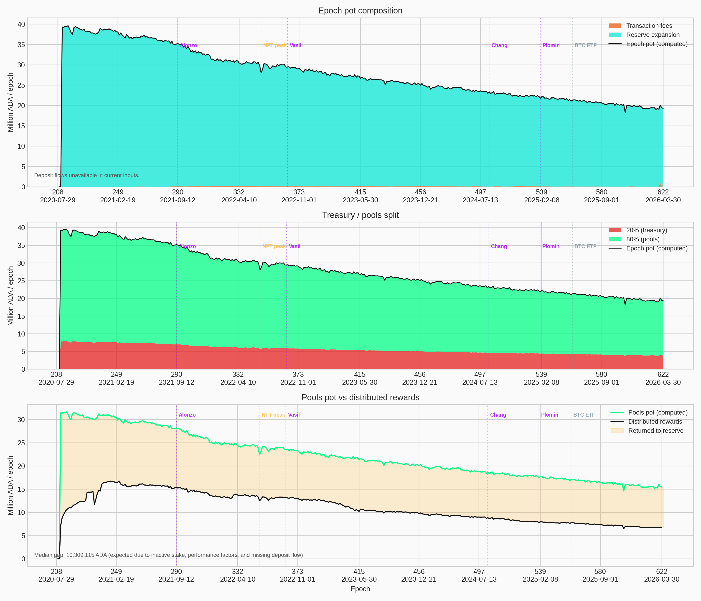
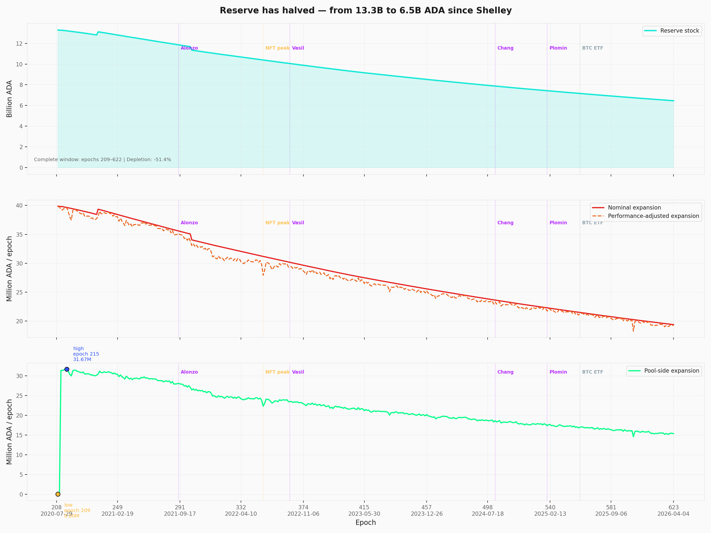
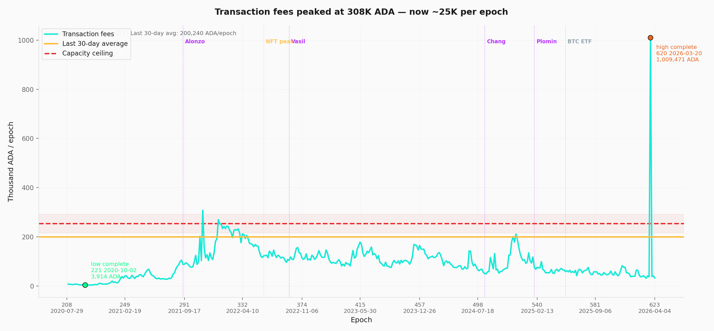
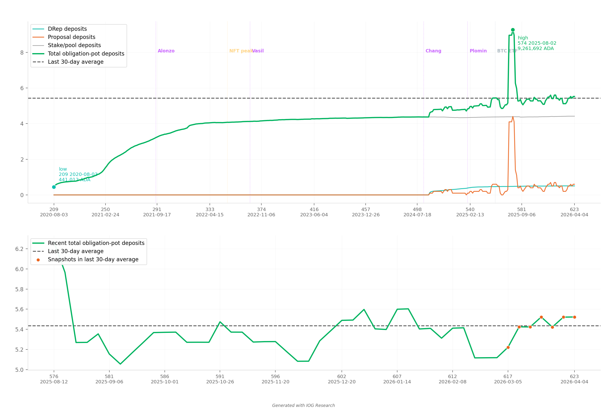
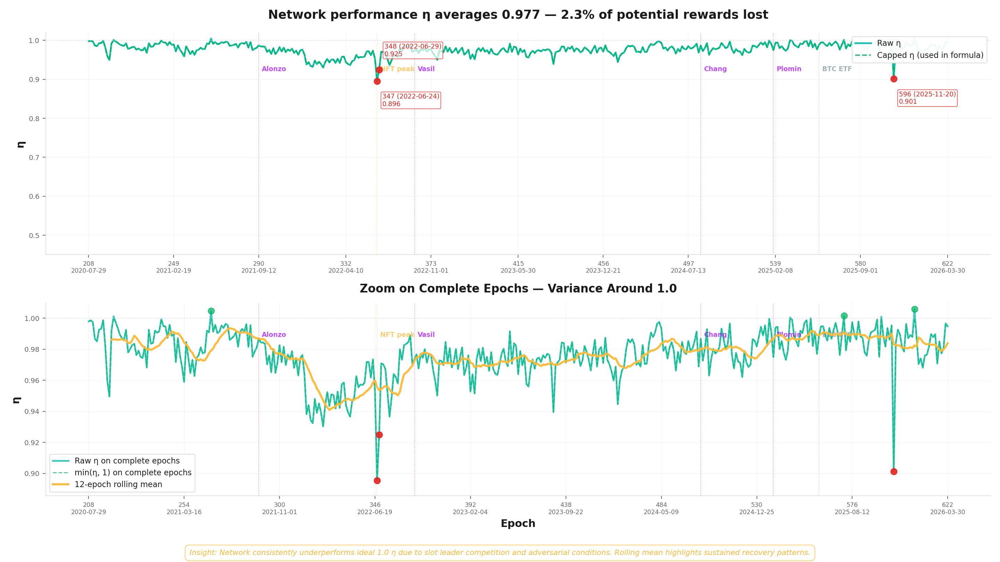
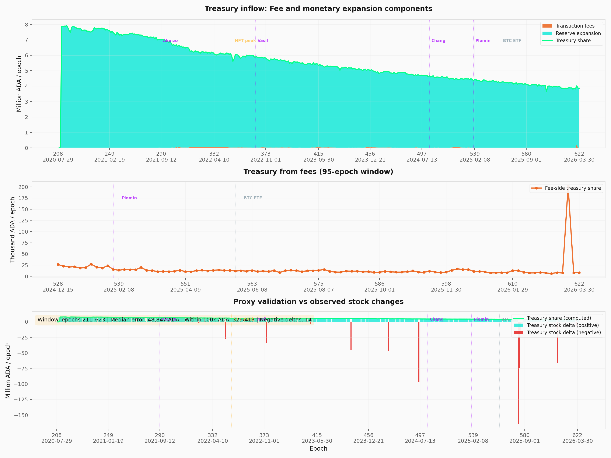
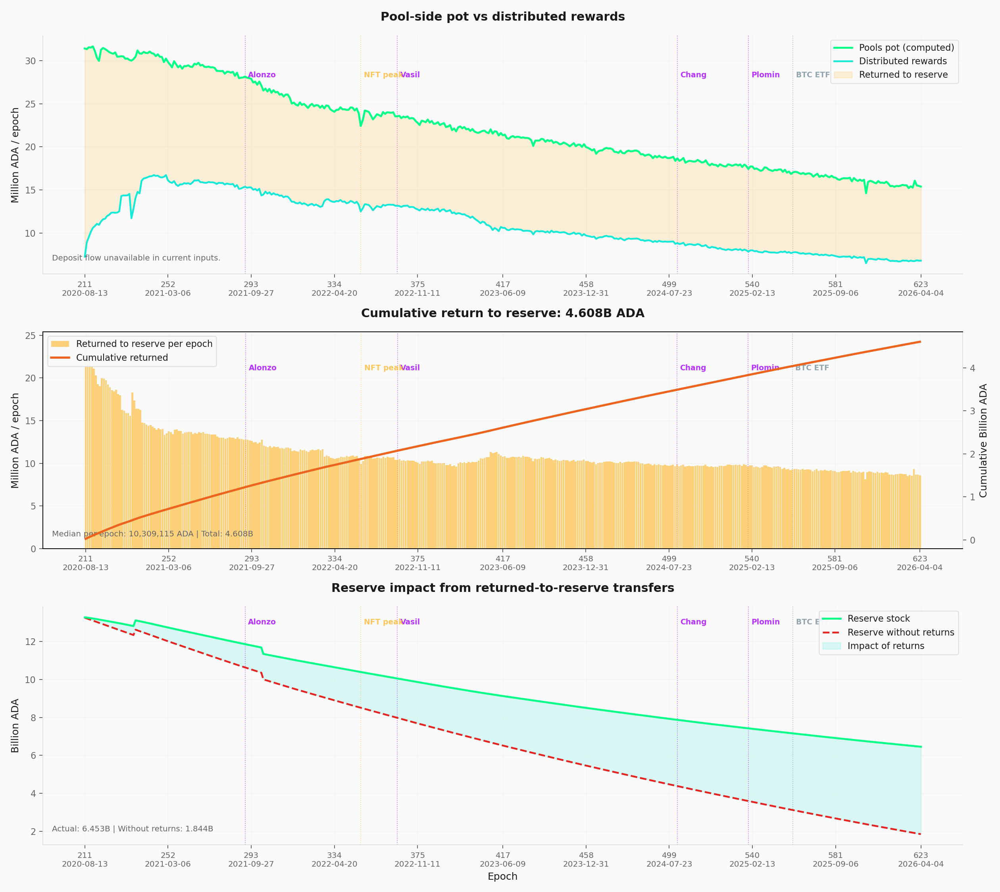

# Treasury & Pool Pots Distribution — Mainnet Analysis

This report documents the **first stage of Cardano's reward pipeline** — the epoch-level reward budget — and traces the structural forces that shape that budget *before any individual pool receives a single lovelace*. It builds on the empirical baseline established in the [*Analysis of Cardano's Incentive Mechanism*](https://github.com/input-output-hk/spo-incentives/blob/main/report.pdf) (Lopez de Lara, 2025; hereafter the *Incentive Mechanism Analysis*).

Every epoch, the protocol assembles a reward pot from three on-chain sources — monetary expansion, transaction fees, deposits — then splits it between the treasury (20%) and the pools pot (80%). At epoch 623, the gross pot stood at **~19.23M ADA**, the pools pot at **15.39M ADA** — but only **6.78M ADA** ultimately reached operators and delegators. *This report asks where the rest goes, why the pot decays as it does, and whether the budget layer is sustainable on the timeline the rest of the pipeline assumes.*

The companion [*The Pools Pot Distribution Gaps*](../../pools-distribution/mainnet-analysis/) takes the pools pot from this stage and analyses the pool-level reward curve that distributes it. *Where this stage sets the ceiling, that one allocates within it.*

**The epoch pot is a single-source budget.** The SL-D1 formula admits three inputs (fees, deposits, reserve expansion), but mainnet behaviour collapses to one: monetary expansion supplies **~99.8%** of the gross pot in essentially every epoch since Shelley. Transaction fees contribute **~0.17%** at epoch 623 and have never crossed 3% outside a single recent anomaly. Even at full realistic network capacity (~3.1 TPS, ~1.34M tx/epoch), fee revenue would reach **~254K ADA/epoch** — only **~1.3%** of the reserve expansion term. Closing the fee gap requires fee revenue to grow by **~100× (two orders of magnitude)** — combining a throughput upgrade (Leios), a structural shift in transaction demand, *and* higher per-tx pricing (no single lever suffices). SPOs assemble the pot reliably (block-production ratio η = **0.977** average since Shelley, with the cooperative-behaviour gate $\min(\eta, 1)$ activated in only 7 of 413 epochs) — *the supply-side cooperation the formula nominally polices is not what constrains the budget*.

**The reserve has crossed its half-life.** Stock has fallen from **13.29B → 6.45B ADA** in ~5.7 years — a **51.43%** depletion on an exponential schedule. Because the draw is a fixed **0.3%** of whatever remains, the absolute pot shrinks even when participation does not. The nominal expansion has already halved (from **~39.9M to ~19.36M ADA/epoch**). At current parameters, projected depletion forces **significant reward pressure around epochs 1000–1200 (~2028–2029)** and full depletion around **~epoch 3500 (~2040s)**. *The decision window for parameter governance is measured in epochs, not decades.*

**The reward mechanism operates at ~44% of its potential.** Of the **15.39M ADA** allocated to the pools pot at epoch 623, only **6.78M (44%)** reaches operators and delegators; the remaining **~8.61M returns to the reserve**. Over **413 epochs**, **4.61B ADA** has flowed back this way — *roughly **71% of the current reserve stock** exists because rewards were not fully distributed*. The dominant driver is upstream of the formula: **~16.8B ADA (~43.6%)** of circulating supply does not participate in delegation, and the gap decomposition attributes **~70.9%** of cumulative return-to-reserve to this non-participating capital. *The buffer is a side-effect of incomplete distribution, not a design feature — any reform that improves distribution efficiency therefore accelerates depletion.*

**Reward parameters have never been adjusted.** The two protocol parameters that govern this entire layer — the monetary expansion rate ($\rho = 0.3\%$) and the treasury rate ($\tau = 20\%$) — have remained at their day-one values for the full **~5.7 years** of mainnet operation. Neither has been the subject of a formal governance proposal. The current pot, treasury inflow, and reserve trajectory all reflect parameter choices made for a network with very different supply, participation, and pool-count conditions — *and the absence of any review path is itself a structural feature*.

These four findings (TRE.O1–TRE.O4) are **structural to the epoch-budget layer** and fall outside the scope of the four CIPs under evaluation (CIP-0023, CIP-0037, CIP-0050, CIP-0082). They document the sustainability context within which all CIP proposals operate.

The remainder of the report walks the budget pipeline: [the initial design](#2-the-initial-design) presents the SL-D1 formula in three layers (original notation → reader-friendly rewrite → mainnet parameterization); [the current snapshot](#3-current-snapshot) instantiates it at epoch 623; [the historical analysis](#4-historical) decomposes pot composition, reserve trajectory, fee volatility, deposits, η, treasury inflow, return-to-reserve, and protocol parameters across epochs 208–623; [the forward-looking section](#5-forward-looking) traces depletion, fee-to-expansion crossover, and upcoming events. All counts and amounts use the latest complete epoch with reward data (**epoch 623**, ending 2026/04/09) unless stated otherwise; source dataset `data/reward_epoch_pools_mainnet.csv` (Koios).

# Table of Contents

1. [Mainnet Observations](reserves.html#1-mainnet-observations)
2. [The initial design](#2-the-initial-design)
   - 2.1 [Formulas](#21-formulas)
      - 2.1.1 [SL-D1 (Original)](#211-sl-d1-original)
      - 2.1.2 [Reader-friendly epoch pot formula](#212-reader-friendly-epoch-pot-formula)
      - 2.1.3 [Mainnet parameterization](#213-mainnet-parameterization)
      - 2.1.4 [Concept glossary](#214-concept-glossary)
   - 2.2 [Design choices](#22-design-choices)
   - 2.3 [Downstream: where the pools pot goes next](#23-downstream-where-the-pools-pot-goes-next)
3. [Current snapshot](#3-current-snapshot)
4. [Historical](#4-historical)
   - [4.1. Epoch pot composition](#41-epoch-pot-composition)
   - [4.2. Reserve stock and monetary expansion](#42-reserve-stock-and-monetary-expansion)
   - [4.3. Transaction fees](#43-transaction-fees)
   - [4.4. Deposit obligations](#44-deposit-obligations)
   - [4.5. Block-production ratio (η)](#45-block-production-ratio)
   - [4.6. Treasury inflow decomposition](#46-treasury-inflow-decomposition)
   - [4.7. Return to reserve](#47-return-to-reserve)
   - [4.8. Protocol parameters](#48-protocol-parameters)
5. [Forward-looking](#5-forward-looking)
   - [5.1. Reserve depletion trajectory](#51-reserve-depletion-trajectory)
   - [5.2. Fee-to-expansion crossover](#52-fee-to-expansion-crossover)
   - [5.3. Upcoming events and risks](#53-upcoming-events-and-risks)
6. [Reproduction](#6-reproduction)
   - 6.1 [Full rebuild](#61-full-rebuild)

---

# 1. Mainnet Observations

| # | Observation | Section | Nature |
| --- | --- | --- | --- |
| | **TRE.O1 — The epoch pot rests on a single source — and that source has crossed its half-life** | | The protocol's reward formula admits three inputs to the epoch pot — monetary expansion, transaction fees, deposits. *In practice only one matters.* **Monetary expansion supplies ~99.8%** of the pot; fees contribute **~0.17%** and even at full realistic network capacity would cover only **1.3%** of the expansion term (a **~100× structural gap in fee revenue terms**); the deposit channel is unmeasurable at epoch granularity. Stake pool operators assemble the pot reliably (**η = 0.977** average — the cooperative-behaviour gate is satisfied but never binding). The budget therefore depends almost entirely on the reserve, which is **shrinking by 0.3% every epoch**. |
| TRE.O1.F1 | **Monetary expansion is the only material input to the pot — supplies ~99.8%, every epoch, since Shelley.** Outside a single recent anomaly at epoch 620 (~5% fee share), fees have never crossed 3% — even during peak NFT/DeFi activity. The pot's trajectory is therefore tied almost entirely to reserve stock and ρ; the formula admits three sources but the mechanism behaves as if it had one | [Epoch pot composition](#41-epoch-pot-composition) | Structural — unchanged since Shelley |
| TRE.O1.F2 | **Fee revenue is structurally insufficient — closing the gap requires fee revenue to grow ~100× (two orders of magnitude).** Fees contribute ~0.17% of the pot at epoch 623, and even the realistic capacity ceiling (~254K ADA/epoch at 3.1 TPS × 432K s × 0.19 ADA/tx) covers only ~1.3% of the reserve expansion term (~19.23M ADA). Closing the gap requires a throughput upgrade (Leios), a structural shift in transaction demand, *and* higher per-tx pricing (no single lever suffices); until that crossover, the second source named in the SL-D1 formula is a rounding error | [Transaction fees](#43-transaction-fees), [Fee-to-expansion crossover](#52-fee-to-expansion-crossover) | Structural — ~100× fee-revenue gap |
| TRE.O1.F3 | **The deposit channel is small and unmeasurable at epoch granularity.** Koios exposes a stock-level obligation series (~5.44M ADA average, max **9.26M ADA** at epoch 574) but not the per-epoch non-refundable flow that actually enters the pot. Cross-validation against treasury stock deltas leaves a median gap of only **~49K ADA** over epochs 211–623 — a rounding error against a pot of ~19M ADA. The third source in the SL-D1 formula is real on the balance sheet but invisible in the budget | [Deposit obligations](#44-deposit-obligations) | Data limitation — Koios coverage |
| TRE.O1.F4 | **Stake pool operators assemble the pot reliably — block production is not the bottleneck.** The cooperative-behaviour gate $\min(\eta, 1)$ has averaged **0.977** since Shelley and dropped only as low as **0.896** during a single infrastructure stress event (epoch 347). The clamp has activated in only **7 epochs out of 413**. Whatever else constrains the budget, the supply-side cooperation the formula nominally polices is *not* it — the gate is satisfied but never binding | [Block-production ratio (η)](#45-block-production-ratio-) | Structural — avg η = 0.977 |
| | **TRE.O2 — The reserve has crossed its half-life — the budget is on an exponential decay schedule** | | The reserve has fallen from **13.29B to 6.45B ADA** — **−51.43%** in ~5.7 years of Shelley operation. The decay is exponential: every epoch draws **0.3% of whatever remains**, so the nominal pot has already halved (from ~39.9M to ~19.36M ADA/epoch) and continues to shrink mechanically even when participation does not. Significant reward pressure is projected at **epochs 1000–1200** (~2028–2029) when expansion-driven rewards stop matching today's scale. |
| TRE.O2.F1 | **The reserve is half-depleted in 5.7 years and the nominal expansion has already halved.** Stock has fallen from **13.29B → 6.45B ADA** (a **−51.43%** decline) over ~5.7 years; the nominal monetary draw has dropped from **~39.9M → ~19.36M ADA/epoch**. Because the formula draws a fixed **0.3% of remaining reserve**, the decay is exponential — the absolute pot keeps shrinking even when participation does not. *The single-source budget identified in TRE.O1 is now visibly thinning, on a schedule the formula cannot reverse* | [Reserve stock and monetary expansion](#42-reserve-stock-and-monetary-expansion) | Structural — exponential decay |
| TRE.O2.F2 | **Significant reward pressure begins at epochs 1000–1200 (~2028–2029).** At current parameters and participation, the reserve reaches **~2B ADA** in this window — at which point per-epoch rewards drop materially. Full depletion is projected around **epoch 3500 (~2040s)**. The window for governance to intervene before the pot becomes too small to incentivise meaningful staking is on the order of **3–4 years** | [Reserve depletion trajectory](#51-reserve-depletion-trajectory) | Projected — ~2028–2029 |
| | **TRE.O3 — Less than half of the pools pot reaches operators and delegators — the rest props up the reserve as a side effect of low participation** | | Of the **15.39M ADA/epoch** allocated to the pools pot, only **6.78M ADA (~44%)** actually reaches operators and delegators; the remaining **~8.61M returns to the reserve**. Cumulatively over 413 epochs, **4.61B ADA** has flowed back this way — **~71% of the current reserve stock** exists because rewards were not fully distributed. The primary driver is upstream of the formula: **~16.8B ADA (~43.6% of circulating supply)** does not participate in delegation at all. The reserve has lasted as long as it has *because the system has been failing to pay out* — adoption that pulls inactive stake into the game would accelerate depletion. |
| TRE.O3.F1 | **Less than half of the pools pot reaches its intended recipients.** Of the **15.39M ADA** allocated to the pool side at epoch 623, only **6.78M ADA (~44%)** is distributed to operators and delegators; the remaining **~8.61M** returns to the reserve. The mechanism therefore operates at less than half of its design throughput in steady state — the SL-D1 distribution rules are intact, but the pool-by-pool conditions for full payout are not met across most of the landscape | [Return to reserve](#47-return-to-reserve) | Epoch 623 — 6.78M of 15.39M ADA |
| TRE.O3.F2 | **Cumulative undistributed rewards account for roughly three quarters of the current reserve stock.** Over **413 epochs** the return-to-reserve channel has accumulated **4.61B ADA** — about **71% of the 6.45B ADA** the reserve holds today. *This buffer is a side-effect of incomplete distribution, not a design feature*: the reserve has lasted as long as it has largely because the system has been failing to pay out. Any reform that improves distribution efficiency therefore accelerates depletion | [Return to reserve](#47-return-to-reserve) | Structural — side-effect, not design |
| TRE.O3.F3 | **Inactive stake (~43.6% of supply) is the dominant driver of the distribution gap.** Out of **~38.55B ADA** in circulation, only **~21.75B (~56.4%)** participates in delegation; the remaining **~16.8B ADA (~43.6%)** earns no rewards but still dilutes the per-ADA share. The decomposition attributes **~70.9%** of cumulative return-to-reserve to this non-participating capital. *The lever sits upstream of the formula — it is a participation problem, not a distribution-rule problem* | [Return to reserve](#47-return-to-reserve) | Upstream — outside formula control |
| | **TRE.O4 — The two parameters that govern this whole layer have never been adjusted** | | The treasury rate (**τ = 20%**) and the monetary expansion rate (**ρ = 0.3%**) have remained at their day-one values for the full ~5.7 years of mainnet operation. Neither has been the subject of a formal governance proposal. The current pot, treasury inflow, and reserve trajectory all reflect parameter choices made for a network with very different supply, participation, and pool-count conditions — and the absence of any review path is itself a structural feature. |
| TRE.O4.F1 | **Treasury rate (τ = 20%) and monetary expansion rate (ρ = 0.3%) have never been adjusted since Shelley.** Both parameters were set on 2020/07/29 and have remained at their day-one values across ~5.7 years of mainnet operation. Decentralisation $d$ was gradually reduced to 0 (epochs 208–257) and $k$ was raised from 150 to 500 (Aug 2020) — but the reward-level parameters that drive every quantity in this section remain frozen, and **neither has been the subject of a formal governance proposal** | [Protocol parameters](#48-protocol-parameters) | Governance — τ = 20%, ρ = 0.3% constant |

---

# 2. The initial design

The epoch-pot assembly and treasury/pools split analysed in this report were specified in [*Design Specification for Delegation and Incentives in Cardano*](https://github.com/IntersectMBO/cardano-ledger/releases/latest/download/shelley-delegation.pdf) (Kant, Brünjes & Coutts, IOHK, 2019 — deliverable **SL-D1**). The mechanism has been operational on mainnet since the Shelley hard fork on 2020/07/29 and its governing parameters ($\rho$, $\tau$) have never been modified since.

This section presents the formula in three layers — the original SL-D1 notation, a reader-friendly rewrite, and the mainnet-parameterized form — then identifies the two design choices that matter most for the empirical analysis that follows.

## 2.1. Formulas

### 2.1.1. SL-D1 (Original)

The design spec defines the **gross epoch pot** — the total ADA entering the reward pipeline each epoch:

$$
Pot^{\text{epoch}}
:=
F + D + \min(\eta,1)\,\rho\,(T_{\infty}-T)
$$

Then, the **treasury/pools split** — a single parameter $\tau$ determines how the pot is divided:

$$
R
:=
(1-\tau)\,Pot^{\text{epoch}}
$$

$$
TreasuryPot^{\text{epoch}}
:=
\tau\,Pot^{\text{epoch}}
$$

> **Reading note.** $F$ = transaction fees, $D$ = non-refundable deposits, $\eta$ = block-production ratio ($Blocks_{\text{produced}}/Blocks_{\text{expected}}$), $\rho$ = monetary expansion rate, $(T_{\infty}-T)$ = remaining reserve. The full mapping to reader-friendly names is in the glossary ([Concept glossary](#214-concept-glossary)).

### 2.1.2. Reader-friendly epoch pot formula

Same logic, with self-documenting names. The epoch pot aggregates **three inputs** — fees, deposits, and a reserve draw gated by the block-production ratio:

$$
Pot^{\text{epoch}}
= Fee^{\text{epoch}}_{\text{tx}}
+
Deposit^{\text{epoch}}_{\text{nonRefundable}}
+
\min\left(\frac{Blocks^{\text{epoch}}_{\text{produced}}}{Blocks^{\text{epoch}}_{\text{expected}}},1\right)\rho^{\text{monetaryExpansion}}_{\text{rate}}\left(Supply^{\text{system}}_{\text{total}}-Supply^{\text{system}}_{\text{circulating}}\right)
$$

The split is then purely multiplicative — no pool-level logic is involved:

$$
PoolsPot^{\text{epoch}}
:=
(1-\tau^{\text{treasury}}_{\text{rate}})\,Pot^{\text{epoch}}
$$

$$
TreasuryPot^{\text{epoch}}
:=
\tau^{\text{treasury}}_{\text{rate}}\,Pot^{\text{epoch}}
$$

Conservation — the split is exhaustive, nothing is lost:

$$
PoolsPot^{\text{epoch}} + TreasuryPot^{\text{epoch}}
= Pot^{\text{epoch}}
$$

### 2.1.3. Mainnet parameterization

Substituting the current mainnet protocol parameters ($\rho = 0.3\%$, $\tau = 20\%$, 21,600 expected blocks per epoch, 45 billion max supply):

$$
Pot^{\text{epoch}}
= Fee^{\text{epoch}}_{\text{tx}}
+
Deposit^{\text{epoch}}_{\text{nonRefundable}}
+
\min\left(\frac{Blocks^{\text{epoch}}_{\text{produced}}}{21{,}600},1\right)\cdot 0.3\% \cdot \left(45\,\text{billion} - Supply^{\text{system}}_{\text{circulating}}\right)
$$

$$
PoolsPot^{\text{epoch}}
:=
80\% \cdot Pot^{\text{epoch}}
$$

$$
TreasuryPot^{\text{epoch}}
:=
20\% \cdot Pot^{\text{epoch}}
$$

At epoch 623, this produces:

| Component | Value | Share of pot |
| --- | ---: | ---: |
| Reserve-sourced expansion ($\rho \times \text{Reserve}$) | 19.20M ADA | 99.83% |
| Transaction fees | 32,892 ADA | 0.17% |
| Deposits | unmeasurable | ~0% |
| **Gross epoch pot** | **~19.23M ADA** | **100%** |
| Treasury cut ($\tau = 20\%$) | 3.85M ADA | 20% |
| **Pools pot** ($1-\tau = 80\%$) | **15.39M ADA** | **80%** |

### 2.1.4. Concept glossary

| SL-D1 | Reader-Friendly | Meaning | Mainnet baseline |
| --- | --- | --- | --- |
| $F$ | $Fee^{\text{epoch}}_{\text{tx}}$ | Epoch transaction fees | Dynamic |
| $D$ | $Deposit^{\text{epoch}}_{\text{nonRefundable}}$ | Epoch non-refundable deposits | Dynamic |
| $\eta$ | $\frac{Blocks^{\text{epoch}}_{\text{produced}}}{Blocks^{\text{epoch}}_{\text{expected}}}$ | Epoch block-production ratio | $Blocks^{\text{epoch}}_{\text{expected}}=21{,}600$ |
| $\rho$ | $\rho^{\text{monetaryExpansion}}_{\text{rate}}$ | Monetary expansion rate | $0.3\%$ |
| $T_{\infty}-T$ | $Supply^{\text{system}}_{\text{total}}-Supply^{\text{system}}_{\text{circulating}}$ | Reserve entering the monetary-expansion term | $45\,\text{billion} - Supply^{\text{system}}_{\text{circulating}}$ |
| $\tau$ | $\tau^{\text{treasury}}_{\text{rate}}$ | Treasury take rate | $20\%$ treasury / $80\%$ pools |
| $R$ | $PoolsPot^{\text{epoch}}$ | Pool-side share of the epoch pot | $80\% \cdot Pot^{\text{epoch}}$ |
| n/a | $TreasuryPot^{\text{epoch}}$ | Treasury-side share of the epoch pot | $20\% \cdot Pot^{\text{epoch}}$ |

## 2.2. Design choices

Two design choices embedded at this stage matter for the rest of the analysis:

- **Cooperative-behavior gate.** The monetary expansion draw is scaled by $\min(\eta, 1)$ — the ratio of blocks actually produced to blocks expected. If pools collectively miss slots, the entire epoch pot shrinks. This discourages sabotage but also means the pot depends on aggregate network health. On mainnet, $\eta$ has averaged 0.977 since Shelley — the gate is satisfied but never binding (see [§4.5 — Block-production ratio (η)](#45-block-production-ratio)).

- **Fixed split rule.** The treasury/pools ratio is a protocol constant ($\tau$), not a function of network activity or reserve level. It does not adapt as the balance between fees and expansion shifts over time. Both $\rho$ and $\tau$ have been unchanged since Shelley (see [§4.8 — Protocol parameters](#48-protocol-parameters)).

A third property is structural rather than a parameter choice:

- **Single-source dominance.** Although the formula admits three inputs, monetary expansion accounts for ~99.8% of the epoch pot on mainnet (see [§4.1 — Epoch pot composition](#41-epoch-pot-composition)). The pot's trajectory is therefore determined almost entirely by the reserve stock and $\rho$. Transaction fees and deposits are second-order corrections — a condition that will only change when fee revenue grows by at least an order of magnitude ([Fee-to-expansion crossover](#52-fee-to-expansion-crossover)).

## 2.3. Downstream: where the pools pot goes next

The pools pot ($PoolsPot^{\text{epoch}}$) produced by this stage is the **total budget** entering the pool-level reward formula. That formula — specified in the same SL-D1 document — distributes the budget across individual pools based on their stake, pledge, and block performance. Any rewards not distributed return to the reserve.

The companion report [*The Pools Pot Distribution Gaps*](../../pools-distribution/mainnet-analysis/) analyses the pool-distribution stage in full, including the SL-D1 reward curve, its normalized rewrite, and the efficiency and behavioural analysis of mainnet outcomes.

At epoch 623, of the 15.39M ADA entering the pool-distribution stage, only **6.78M ADA (44.0%) was distributed** to operators and delegators. The rest returned to the reserve — primarily because ~43.6% of circulating ADA does not participate in delegation. This return-to-reserve mechanism is analysed in [§4.7 — Return to reserve](#47-return-to-reserve) and its implications for reserve sustainability in [Reserve depletion trajectory](#51-reserve-depletion-trajectory).

---

# 3. Current snapshot

Reference epoch: **623** (2026/04/04 – 2026/04/09), latest complete epoch with reward data. The formulas in §2 produce the values below.

| Metric | Value |
| --- | --- |
| Reserve stock | **6.45B ADA** (down 51.43% from Shelley inception) |
| Monetary expansion rate ($\rho$) | **0.3%** |
| Treasury rate ($\tau$) | **20%** |
| Block-production ratio (η) | **0.992** (epoch 623) · **0.977** historical average |
| Gross epoch pot proxy | **19.23M ADA** |
| — Reserve-sourced expansion | 19.20M ADA (**99.83%**) |
| — Transaction fees | 32,892 ADA (**0.17%**) |
| Treasury cut (20%) | **3.85M ADA** |
| Pools pot (80%) | **15.39M ADA** |
| Observed paid rewards | **6.78M ADA** |
| Return to reserve (this epoch) | **8.61M ADA** (undistributed) |
| 30-day average fees (epochs 618–623) | **200,240 ADA/epoch** (distorted by epoch 620 anomaly — see [Transaction fees](#43-transaction-fees)) |
| Median return to reserve (epochs 211–623) | **10.31M ADA/epoch** |
| Cumulative return to reserve (epochs 211–623) | **4.61B ADA** (~71% of current reserve) |

---

# 4. Historical

## 4.1. Epoch pot composition



*TRE.4.1 — Epoch pot composition since Shelley: gross pot decomposed into reserve-sourced expansion and transaction fees, the resulting treasury/pools split, and the gap between the pool-side proxy and observed paid rewards. Reserve expansion supplies **~99.8%** of the pot in essentially every epoch.*

The top panel decomposes the gross epoch pot into its two measurable sources — **reserve-sourced monetary expansion** and **transaction fees** — since Shelley (epoch 208). Monetary expansion has dominated in **every single epoch**; outside the epoch 620 anomaly (see [Transaction fees](#43-transaction-fees)), fees have **never exceeded 3%** of the pot, even during peak activity (epoch 304, ~308K ADA).

> **Finding TRE.O1.F1 — Monetary expansion is the only material input to the epoch pot.** Reserve-sourced expansion supplies **~99.8%** of the gross pot in essentially every epoch since Shelley; fees and deposits sit at the noise floor. The pot's trajectory is therefore tied almost entirely to reserve stock and $\rho$ — the formula admits three sources, but the mechanism behaves as if it had one. This single-source dependence makes reserve depletion the binding constraint on every downstream layer.

The middle panel shows the resulting **treasury / pools split** ($\tau = 20\%$). Both tracks decline in parallel, *reflecting the shrinking reserve*.

The bottom panel compares the **pool-side pot proxy** to **observed paid rewards**. The persistent gap (~**10.3M ADA/epoch** median) represents rewards that were not distributed and returned to the reserve — see [§4.7 — Return to reserve](#47-return-to-reserve).

## 4.2. Reserve stock and monetary expansion



*TRE.4.2 — Reserve stock, nominal monetary draw, and pool-side contribution since Shelley. Reserve has fallen from **13.29B to 6.46B ADA** — a **−51.35%** decline in **5.7 years** — and the nominal expansion has halved from ~39.9M to ~19.39M ADA/epoch.*

**Reserve stock** (top panel).
The reserve has fallen from **13.29B ADA** (epoch 209) to **6.46B ADA** (epoch 622) — a decline of **−51.35%** over ~5.7 years.

**Nominal draw** (middle panel).
The nominal monetary expansion ($\rho \times \text{Reserve}$) has decreased from ~39.9M ADA/epoch to ~19.39M ADA/epoch, tracking the reserve decline mechanically.

**Pool-side contribution** (bottom panel).
After applying the treasury cut, decentralisation gate $g(d)$, and block-production ratio, the pool-side reserve term peaked at **31.7M ADA/epoch** (epoch 215, 2020/09/02) and currently sits at ~15.43M ADA/epoch.

The declining trajectory is structural: each epoch draws from a smaller reserve, producing a smaller pot. The monetary expansion rate $\rho = 0.3\%$ has remained constant since Shelley.

> **Finding TRE.O2.F1 — The reserve has crossed its half-life in 5.7 years of Shelley operation.** Stock has fallen from **13.29B to 6.45B ADA** — a **−51.43%** decline — and the nominal expansion has already halved from **~39.9M to ~19.36M ADA/epoch**. Because the draw is a fixed **0.3%** of whatever remains, the decay is exponential and the absolute pot shrinks even when participation does not. The single-source budget identified in TRE.O1 is now visibly thinning, on a schedule the formula cannot reverse.

## 4.3. Transaction fees



*TRE.4.3 — Per-epoch transaction fees across the Shelley era against the realistic capacity ceiling. Structural baseline sits at **30–50K ADA/epoch**; the all-time peak of **1.01M ADA** at epoch 620 is a single anomaly that distorts the rolling average.*

| Metric | Value |
| --- | --- |
| Coverage | Epochs 208–623 |
| 30-day average (epochs 618–623) | **200,240 ADA/epoch** (distorted — see anomaly note below) |
| Structural baseline (ex-anomalies) | **30–50K ADA/epoch** |
| All-time minimum | 3,914 ADA (epoch 221, 2020/10/02) |
| All-time maximum | 1,009,471 ADA (epoch 620, 2026/03/20) |

Fee revenue is **volatile** and tracks network activity spikes (NFT minting, DeFi waves), but the structural baseline sits around **30–50K ADA/epoch**.

**Epoch 620 anomaly.** Epoch 620 recorded **1.01M ADA in fees** — a **~30× jump** over the surrounding baseline, with normal block production (21,180 blocks, η = 0.981). This single epoch pulls the rolling 30-day average from ~32K ADA/epoch to the 200K figure above and displaces the prior all-time maximum (epoch 304, 308K ADA). The driver is upstream — large-transaction-volume event or governance-scale activity — and warrants follow-up in the next analysis pass. Downstream pot and return-to-reserve figures are **not materially affected**, since fees remain <1% of the pot even at this level.

The **realistic capacity ceiling** (red dashed line on the visual) estimates the maximum fee revenue if the network operated at full realistic throughput: **~254K ADA/epoch** (3.1 TPS × 432,000 s × 0.19 ADA avg fee).

Even at this theoretical maximum, fees would cover only **~1.3% of the reserve expansion term** (19.23M ADA at epoch 623). The epoch 620 anomaly briefly exceeded this ceiling during exceptional activity.

The *Analysis of Cardano's Incentive Mechanism* (Lopez de Lara, 2025; hereafter the *Incentive Mechanism Analysis*, [§5.1 — Reserve depletion trajectory](#51-reserve-depletion-trajectory)) estimates the network would need to process **12–16× more transactions** than its current realistic maximum capacity to fund rewards through fees alone — requiring **both** a throughput upgrade (Leios) **and** a fundamental shift in network utilization.

In **fee-revenue terms**, that target translates to a **~100× increase (two orders of magnitude)** over today's ~32 K ADA/epoch — because the throughput multiplier alone, at current per-tx pricing, would only carry fees to ~15–20% of the pot. Closing the rest of the gap requires tiered or congestion-based pricing alongside the throughput shift.

> **Finding TRE.O1.F2 — Fee revenue is structurally insufficient to fund the pot, even at full capacity.** At epoch 623 fees contribute **~0.17%** of the gross pot, and even the realistic capacity ceiling of **~254K ADA/epoch** (3.1 TPS × 432,000 s × 0.19 ADA) covers only **~1.3%** of the reserve expansion term. Closing the gap requires fee revenue to grow by **~100× (two orders of magnitude)** — a step change combining higher throughput (Leios), structurally higher transaction demand, **and** higher per-tx pricing (no single lever suffices, see [§5.2](#52-fee-to-expansion-crossover)). Until that crossover, the second source named in the SL-D1 formula is a rounding error.

## 4.4. Deposit obligations



*TRE.4.4 — Stock-level deposit obligation (stake key, DRep, governance) across epochs 209–623. The obligation averages **~5.44M ADA** in recent epochs and peaked at **9.26M ADA** at epoch 574; the per-epoch flow into the pot is unmeasurable at epoch granularity.*

| Metric | Value |
| --- | --- |
| Coverage | Epochs 209–623 |
| 30-day average obligation (epochs 617–623) | ~5.44M ADA |
| Minimum | 441K ADA (epoch 209, 2020/08/03) |
| Maximum | 9.26M ADA (epoch 574, 2025/08/02) |

The deposit obligation (stake key, DRep, proposal deposits) is tracked as a **stock-level proxy** because the true epoch-level non-refundable deposit flow ($Deposit^{\text{epoch}}_{\text{nonRefundable}}$) is not directly available in the Koios dataset. The actual per-epoch contribution to the epoch pot is likely small and irregular.

The `general_reward_pot` proxy omits deposits entirely, and the resulting median verification gap (~49K ADA against treasury stock deltas) suggests this omission is acceptable for analysis purposes.

> **Finding TRE.O1.F3 — The deposit channel is small and unmeasurable at epoch granularity.** Koios exposes a stock-level obligation series (~5.44M ADA average, max **9.26M ADA** at epoch 574) but not the per-epoch non-refundable flow that actually enters the pot. Cross-validation against treasury stock deltas leaves a median gap of only **~49K ADA** over epochs 211–623 — a rounding error against a pot of ~19M ADA. The third source in the SL-D1 formula is real on the balance sheet but invisible in the budget.

## 4.5. Block-production ratio (η)



*TRE.4.5 — Block-production ratio η across the Shelley era. The network has averaged **η = 0.977** since launch and only dropped to a minimum of **0.896** during a single epoch (347); the $\min(\eta, 1)$ clamp has activated in only **7 of 413** epochs.*

The block-production ratio $\eta = \frac{\text{Blocks produced}}{\text{Blocks expected}}$ acts as the **cooperative-behavior gate** in the epoch pot formula: $\min(\eta, 1)$ scales the monetary expansion draw.

| Metric | Value |
| --- | --- |
| Average η (complete epochs) | **0.977** |
| Minimum η | 0.896 (epoch 347, 2022/06/24) |
| Maximum η | 1.006 (epoch 606, 2026/01/09) |
| Epochs with η > 1 (clipped) | 7 |

The network has consistently filled ~97% of available slots since Shelley.
The $\min(\eta, 1)$ clamp has been activated in only 7 epochs.
The cooperative incentive is **satisfied but never binding**.

Even at the lowest observed η (0.896, epoch 347 — infrastructure stress), the impact on the epoch pot was a ~10% reduction, not a system-level event.

> **Finding TRE.O1.F4 — Stake pool operators assemble the pot reliably; block production is not the bottleneck.** The cooperative-behaviour gate $\min(\eta, 1)$ has averaged **0.977** since Shelley and dropped only as low as **0.896** during a single infrastructure stress event (epoch 347). The clamp has activated in only **7** epochs out of **413**. Whatever else constrains the budget, the supply-side cooperation that the formula nominally polices is not it — the gate is satisfied but never binding.

## 4.6. Treasury inflow decomposition



*TRE.4.6 — Treasury inflow decomposed into the fee-side cut and the reserve-side cut. The reserve-side draw dominates throughout; the proxy verifies against observed treasury stock deltas with a median absolute gap of **48,846 ADA** over epochs 211–623.*

This visual decomposes the treasury inflow into its two observable components: the **fee-side cut** ($\tau \times Fee^{\text{epoch}}_{\text{tx}}$) and the **reserve-side cut** ($\tau \times g(d)\,\min(\eta,1)\,\rho \times \text{Reserve}$).

The top panel shows total treasury inflow since Shelley — the declining slope mirrors the reserve depletion.
The middle panel zooms on the fee-side contribution in recent epochs.
The bottom panel verifies the proxy against observed treasury stock deltas.

**Verification.** On epochs 211–623, the median absolute gap between the proxy and observed treasury stock delta is **48,846 ADA**. 329 out of 413 epochs fall within 100K ADA. The 14 epochs with negative stock deltas correspond to treasury outflows (governance disbursements).

## 4.7. Return to reserve



*TRE.4.7 — Per-epoch return to reserve and its cumulative impact on reserve stock. The undistributed pool-side rewards have accumulated to **4.61B ADA** — about **71%** of the **6.45B ADA** reserve stock at epoch 623.*

Not all of the pool-side pot is distributed as rewards. The difference between the pool-side pot proxy and observed paid rewards **returns to the reserve** — *a mechanism that significantly slows reserve depletion*.

| Metric | Value |
| --- | --- |
| Analysis window | Epochs 211–623 |
| Median per-epoch return | **10.31M ADA** |
| Cumulative return | **4.61B ADA** |
| Largest single-epoch return | 24.19M ADA (epoch 211, 2020/08/13) |

> **Finding TRE.O3.F1 — Less than half of the pools pot reaches its intended recipients.** Of the **15.39M ADA** allocated to the pool side at epoch 623, only **6.78M ADA (~44%)** is distributed to operators and delegators; the remaining **~8.61M** returns to the reserve. The mechanism therefore operates at less than half of its design throughput in steady state — the SL-D1 distribution rules are intact, but the pool-by-pool conditions for full payout are not met across most of the landscape.

**Reserve impact.**
At epoch 623, the actual reserve stood at **6.45B ADA**. Without the return-to-reserve mechanism, the counterfactual reserve would be only **1.84B ADA** — meaning approximately **4.61B ADA** (**~71% of the current reserve**) exists because rewards were not fully distributed.

> **Finding TRE.O3.F2 — Cumulative undistributed rewards account for roughly three quarters of the current reserve stock.** Over **413 epochs** the return-to-reserve channel has accumulated **4.61B ADA** — about **71%** of the **6.45B ADA** the reserve holds today. This buffer is a side-effect of incomplete distribution, not a design feature: the reserve has lasted as long as it has largely because the system has been *failing to pay out*. Any reform that improves distribution efficiency therefore accelerates depletion.

The primary driver is **inactive stake** — the **~16.8B ADA not participating in consensus**. The gap decomposition analysis attributes **~70.9%** of the cumulative return to inactive/non-eligible stake.

> **Finding TRE.O3.F3 — Inactive stake is the dominant driver of the distribution gap.** Out of **~38.55B ADA** in circulation, only **~21.75B (~56.4%)** participates in delegation; the remaining **~16.8B ADA (~43.6%)** earns no rewards but still dilutes the per-ADA share. The decomposition attributes **~70.9%** of cumulative return-to-reserve to this non-participating capital. The lever sits upstream of the formula — it is a participation problem, not a distribution-rule problem.

## 4.8. Protocol parameters

Three protocol parameters directly govern the epoch-pot assembly and treasury/pools split. All three have been constant since they reached their current value.

| Parameter | Symbol | Value | History |
| --- | --- | --- | --- |
| Monetary expansion rate | $\rho$ | 0.3% (0.003) | Set at Shelley (epoch 208), **never changed** |
| Treasury growth rate | $\tau$ | 20% (0.2) | Set at Shelley (epoch 208), **never changed** |
| Decentralisation | $d$ | 0 | Reduced from 1.0 to 0.0 over epochs 208–257, **inert since** |

$\rho$ controls how much of the reserve is drawn each epoch. At **0.3%**, the current draw is **~19.36M ADA/epoch**. This rate has **never been the subject of a governance proposal**, despite the reserve crossing its half-life.

$\tau$ sets the treasury/pools split. At **20%**, the treasury receives **~3.85M ADA/epoch** and the pools pot receives **~15.39M ADA/epoch**. This ratio has likewise **never been reviewed**.

> **Finding TRE.O4.F1 — The two parameters that govern this entire layer have never been adjusted since Shelley.** Both the treasury rate (**$\tau = 20\%$**) and the monetary expansion rate (**$\rho = 0.3\%$**) have remained at their day-one values for the full ~5.7 years of mainnet operation. Neither has been the subject of a formal governance proposal. The current pot, treasury inflow, and reserve trajectory all reflect parameter choices made for a network with very different supply, participation, and pool-count conditions — and the absence of any review path is itself a structural feature.

$d$ affected the epoch pot during the Shelley-to-decentralisation transition through the gate function $g(d)$. It reached 0 at epoch 257 and has been **inert since** — included here only for completeness.

---

# 5. Forward-looking

## 5.1. Reserve depletion trajectory

The reserve has lost **51.43%** of its initial value in ~5.7 years. The depletion is **not linear** — it follows an **exponential decay** driven by $\rho \times \text{Reserve}$, meaning each epoch draws a smaller absolute amount.

The *Incentive Mechanism Analysis* (*Incentive Mechanism Analysis* §4.3 / Figure 19) projects:

| Horizon | Reserve estimate | Implication |
| --- | --- | --- |
| **Epochs 1000–1200** (~2028–2029) | ~2B ADA | Significant pressure on reward levels begins |
| **~Epoch 3500** (~2040s) | near-zero | Full reserve depletion at current parameters |

> **Finding TRE.O2.F2 — Significant reward pressure is projected at epochs 1000–1200, roughly 2028–2029.** At current parameters and participation, the reserve is forecast to fall to **~2B ADA** within that window — the point at which per-epoch monetary expansion becomes too small to sustain today's nominal reward levels. Full depletion sits around **epoch 3500 (~2040s)**, but the operational threshold arrives much earlier. The decision window for parameter governance is measured in epochs, not decades.

The return-to-reserve mechanism ([§4.7 — Return to reserve](#47-return-to-reserve)) is currently extending the reserve's life by returning ~10.31M ADA/epoch. However, if inactive stake were to enter consensus (e.g. through governance incentives or exchange staking changes), this buffer would shrink, accelerating depletion.

## 5.2. Fee-to-expansion crossover

For the reward system to become self-sustaining, fees must eventually replace monetary expansion as the dominant input to the epoch pot.

**Current gap.** Fees represent ~0.19% of the epoch pot. Closing this gap requires a combination of:

| Lever | Current | Required for fee self-sufficiency |
| --- | --- | --- |
| Network utilization | ~234K tx/epoch (~13% of realistic capacity) | 12–16× current realistic max |
| Fee per transaction | ~0.19 ADA avg | Higher value through tiered pricing or congestion |
| Network capacity | ~1.34M tx/epoch (3.1 TPS realistic) | Leios upgrade (higher throughput) |

No single lever is sufficient. The report recommends a multi-pronged approach: capacity expansion (Leios), tiered fee models (Kiayias et al., 2023), and ecosystem growth to drive transaction volume.

## 5.3. Upcoming events and risks

**Leios upgrade.** Designed to substantially increase network throughput. This is a **necessary precondition for fee growth**, but does not guarantee traffic. *"Leios provides the highway — it does not guarantee the traffic"* (Lopez de Lara, 2025, §5).

**Governance activation of latent stake.** If a significant portion of the **~16.8B ADA** currently outside consensus enters staking — through governance incentives, exchange policy changes, or new delegation products — the return-to-reserve buffer shrinks, the pool-side pot gets distributed more fully, and reserve depletion **accelerates**.

*This is a double-edged dynamic: more participation strengthens decentralization but increases sustainability pressure.*

**Parameter governance.** The monetary expansion rate $\rho$ and treasury rate $\tau$ are currently **fixed constants**. The report recommends they be treated as **dynamic parameters** subject to periodic governance review.

A reduction in $\rho$ would slow reserve depletion but also reduce per-epoch rewards, affecting operator viability. A change in $\tau$ would shift the treasury/pools balance. **Neither has been adjusted since Shelley.**

---

# 6. Reproduction

## 6.1. Full rebuild

All figures and data summaries can be regenerated from the source dataset in a single pass:

```bash
cd scripts/
bash build_all.sh
```

Or individually:

```bash
cd scripts/
python3 build_general_reward_pot_visual.py        # → figures/general_reward_pot_mainnet.png + data/general_reward_pot_mainnet.md
python3 build_monetary_expansion_reserve_history.py # → figures/monetary_expansion_reserve_history_mainnet.png + data/*.md + data/*.csv
python3 build_fee_epoch_tx_history_visual.py       # → figures/fee_epoch_tx_history_mainnet.png + data/fee_epoch_tx_history_mainnet.md
python3 build_treasury_epoch_source_visual.py      # → figures/treasury_epoch_source_mainnet.png + data/treasury_epoch_source_mainnet.md
python3 build_deposit_obligation_history_visual.py # → figures/deposit_obligation_history_mainnet.png + data/deposit_obligation_history_mainnet.md
python3 build_return_to_reserve_impact_visual.py   # → figures/return_to_reserve_impact_mainnet.png + data/return_to_reserve_impact_mainnet.md
python3 build_eta_history_visual.py                # → figures/eta_history_mainnet.png + data/eta_history_mainnet.md
```

**Requirements:** Python 3.9+, `matplotlib`, `numpy`. No other dependencies.

**Input data** (self-contained in `data/`, no network required):
- `reward_epoch_pools_mainnet.csv` — Koios epoch-level export (epochs 208–623): block counts, fees, reserves, treasury, deposits, stake levels, and reward parameters

**Generated data summaries** (produced by scripts, checked in for offline reference):
- `general_reward_pot_mainnet.md` — gross pot proxy breakdown (expansion vs fees)
- `monetary_expansion_reserve_history_mainnet.md` — reserve trajectory and draw mechanics
- `monetary_expansion_reserve_history_mainnet.csv` — reserve history with nominal/adjusted draws
- `fee_epoch_tx_history_mainnet.md` — fee volatility metrics and capacity ceiling estimates
- `treasury_epoch_source_mainnet.md` — treasury decomposition and stock delta validation
- `deposit_obligation_history_mainnet.md` — deposit obligation stock proxy
- `return_to_reserve_impact_mainnet.md` — undistributed rewards and counterfactual reserve
- `eta_history_mainnet.md` — block-production ratio statistics

---

> **Status** — Built on 2026/04/21 from mainnet data at epoch `623` plus historical analysis from epoch `208` (Shelley inception).
