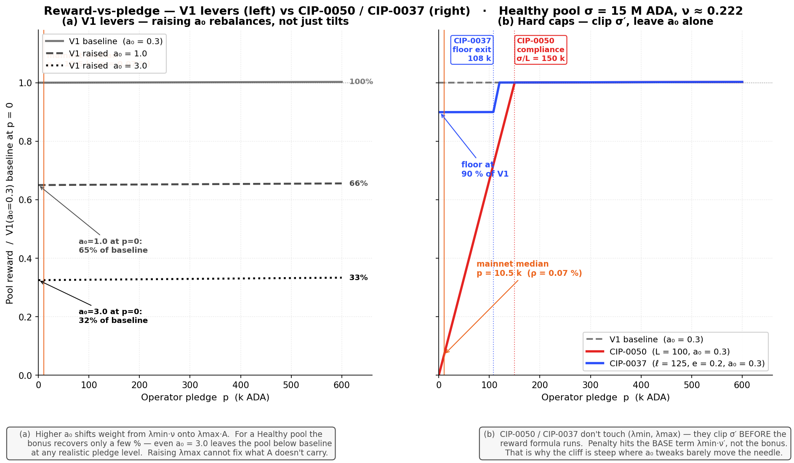
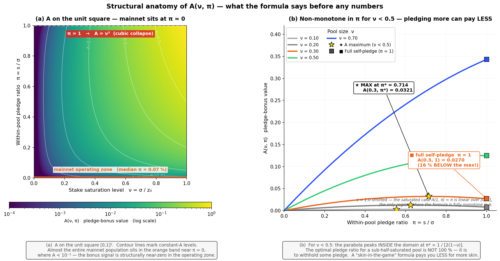
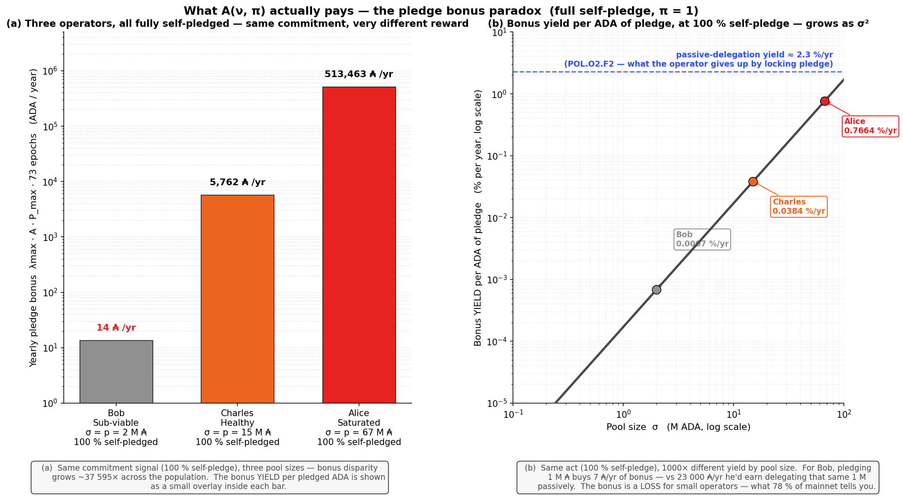
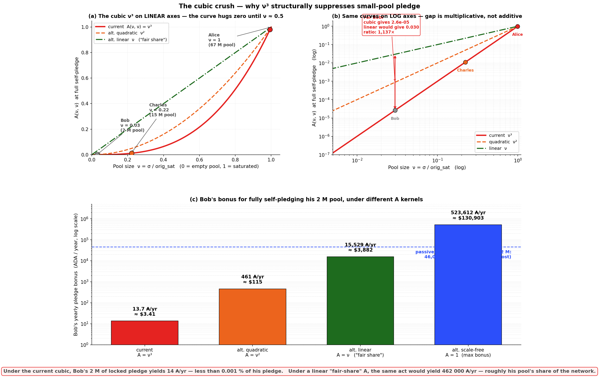

# Stake-Cap Layer — CIP Evaluation Synthesis

This folder evaluates the CIPs that act on the **stake-cap layer** of the Cardano reward pipeline — the reward-eligible pool stake $\sigma'$ that enters the SL-D1 reward formula, *upstream* of the operator/member split that the [fee layer](../operator-delegator/README.md) reshapes.

<a class="cps-stage cps-stage-done" href="intended-game.html" title="The Intended Game — plain-prose design baseline">
Stage 01
The Intended Game
Design intent &middot; baseline
</a>
&rarr;
<a class="cps-stage cps-stage-done" href="diagnostic.html" title="The Mainnet Diagnostic — observations &amp; findings">
Stage 02
Mainnet evidence
Observations &amp; Findings
</a>
&rarr;
<a class="cps-stage cps-stage-done" href="problem-statements.html" title="Induced Problems — proto-CPS scoped against the diagnostic">
Stage 03
Induced problem
proto-CPS
</a>
&rarr;
<a class="cps-stage cps-stage-done" href="solution-design.html" title="Solution Design — prioritising the nine problems into directions and milestones">
Stage 04
Solution Design
Directions &amp; milestones
</a>
&rarr;

Stage 05
CIPs (Evaluation)
IntersectMBO governance &middot; this section

&rarr;
<a class="cps-stage cps-stage-future" href="build-scoping.html" title="Build Estimation / Scoping — sizing the build for the V2 stage-1 reform">
Stage 06
Build Estimation / Scoping
Build sizing
</a>

<nav class="cps-sublocation" aria-label="Position within the CIPs evaluation">
<a href="solution-evaluation.html">Existing CIPs</a> &rarr; Stake-Cap layer &middot; CIP-0050 &amp; CIP-0037
</nav>

Two CIPs are in scope: [CIP-0050](cip-0050.md) and [CIP-0037](cip-0037.md). Both target a real broken signal that the [mainnet diagnostic](../../diagnostic/README.md) confirms — pledge is priced as irrelevant by the operator population. **78 % of staked ADA sits in pools with pledge ratio under 1 %**; **42 of the 48 largest multi-pool operators forfeit the pledge bonus**; pledged ADA yields 0.68 %/yr while the same ADA placed as passive delegation yields 2.3 %/yr. Both CIPs respond by making pledge **binding** on the reward formula — without sufficient pledge, the pool's reward-eligible stake is clipped.

**Assessment on both CIPs — problem validated · root-level solution researched · recommendation: repair the pledge signal at its source first, then assess whether a σ′ cap is still needed as a secondary step.**

**Start with the solution, because it is the exciting part.** A genuine V2 stake-cap reform reinforces the pledge signal **at its source** rather than gating it, through four moves on the reward-distribution layer:

- **Repair `A(ν, π)`** so pledge is not a dominated strategy at any operator size:
  - a **smoother operator onset at low ν** — no cubic crush of small pools as they grow;
  - a design that **does not privilege fully-private pools (π = 1)** — the V2 target is not "everyone runs a 100 %-pledged pool";
  - explicit reward for the **balanced-commitment regime (π ≈ 0.5)** — pledge serving as a credible signal *and* the pool remaining open to delegation.
- **Reduce `λ_size`** so the *commitment* axis carries more of the signal and the *size* axis carries less. Today the envelope `E(ν, π) = λ_size·ν + λ_pledge·A(ν, π)` is split `λ_size ≈ 76.9 %` + `λ_pledge ≈ 23.1 %` (set by `a₀ = 0.3`). This rebalancing only makes sense once `A` is repaired — otherwise it amplifies the broken gradient. The size-weight cut **does double duty**: it reduces what low-pledge pools currently extract via the size axis, *and* the freed weight funds the viability slice in the next move.
- **Add a viability package for pools entering the lifecycle — open a new `λ_viability` sub-budget.** Today the envelope is split **two ways** (`λ_size + λ_pledge`); the recommendation is a **three-way split** `λ_size + λ_pledge + λ_viability`, **without raising the total pool pot**. While transaction-fee inflows are still small, the global allocation stays where it is; it grows back naturally as Tx fees mature into a larger share of the pot. The funding source for `λ_viability` is the `λ_size` reduction above — *nothing new is taken from elsewhere; nothing is asked from the reserve*. `λ_viability` is **conditional**: a pool benefits **only if its operator pledges according to rules to be specified** (a minimum pledge ratio or a pledge-growth schedule across lifecycle stages), so the viability function lives on the **reward-distribution layer (pre-split)**, not bolted onto pricing — pricing tools (`minPoolCost`, margin, rate) stay free as competitive levers (see the [fee-layer synthesis](../operator-delegator/README.md)).
- **Activate the `λ_pledge` budget that has been underused for years.** POL.O1.F3 documents that **95.6 % of the pledge-bonus budget already returns to the reserve unused every epoch** — the single largest addressable inefficiency in the system today. A repaired `A` with a reduced `λ_size` is what activates this budget; it is not new ADA, it is unused ADA already inside the formula's envelope.

This path lets the pledge signal recover **with** the operator population, not against it — and, by the same act, recovers the largest inefficiency the diagnostic flags.

**Where the two CIPs sit relative to that source.** CIP-0050 and CIP-0037 add a third lever — clip σ′ *before* the formula runs — on top of `a₀` and `k`, but they accept `A(ν, π)` as given. That function carries three structural pathologies the σ′ clip does not reach (full walkthrough in [Appendix A — Why V1's pledge incentive doesn't work](#appendix-a-why-v1s-pledge-incentive-doesnt-work)):

- a permanent quadratic `ν²` size penalty applies at *every* pledge ratio — small pools are crushed regardless of how committed the operator is;
- a non-monotonicity in π for sub-half-saturated pools — a 2 M operator (ν ≈ 0.03) earns **8.7×** *more* bonus by pledging 51 % than by fully self-pledging. The formula explicitly incentivises small operators to *under-commit*;
- a cubic `ν³` collapse at full self-pledge — a saturated operator earns **37 595×** more bonus than a 2 M operator at maximum commitment, because the size factor cubes when the pledge factor saturates.

The σ′ clip changes *who can earn the V1 reward*; it does not repair what `A` does to the pledge signal — so the relative bonus disparity, the under-commitment incentive, and the cubic crush all carry through unchanged.

**Why sequencing matters in today's regime.** Almost no one pledges at scale yet: the stake-weighted median pool sits at π = **0.07 %**, **78 %** of staked ADA is in pools below 1 % pledge ratio, and **42 of the 48** saturation-scale multi-pool operators forfeit the pledge bonus. Switched on now, a hard cap binds on **every** segment at once — small / single-pool retail (clipped to ~7 % of V1 reward, without liquid capital to raise pledge above the cap), multi-pool entities (clipped on the per-pool axis, splitting pledge across pools shrinks each envelope), and custodial-by-extraction (CEX / IVaaS, ~21 % of productive stake, which cannot self-pledge custodied retail funds by construction). Repairing the signal first lets the population pledge up *before* the cap binds, so a σ′ cap deployed afterward reinforces a working signal instead of clipping a broken one — the sequencing [μ02 — Guarantee operator viability](../../generated-website/problem-statements.html#problem-1-3-3-1) and the foundational work in [Solution Design Milestone 1](../../README.md#21-milestone-1-repair-pledge-sustain-the-small-spo-base) call for.

## Table of Contents

- [1. The two candidates — same primitive, different floor](#1-the-two-candidates-same-primitive-different-floor)
- [2. Reading order](#2-reading-order)
- [3. References](#3-references)
- [Appendix A — Why V1's pledge incentive doesn't work](#appendix-a-why-v1s-pledge-incentive-doesnt-work)
  - [A.1. The `a₀` lever rebalances, it doesn't tilt](#a1-the-a0-lever-rebalances-it-doesnt-tilt)
  - [A.2. The deeper bottleneck — `A(ν, π)` itself](#a2-the-deeper-bottleneck-a-itself)
    - [A.2.1. Anatomy of the function — before any numbers](#a21-anatomy-of-the-function-before-any-numbers)
    - [A.2.2. What `A` actually pays — three operators across three pledge levels](#a22-what-a-actually-pays-three-operators-across-three-pledge-levels)
    - [A.2.3. The cubic `ν³` — visualised](#a23-the-cubic-3-visualised)
    - [A.2.4. What this means for the CIP critique](#a24-what-this-means-for-the-cip-critique)
  - [A.3. What this implies for the CIP candidates](#a3-what-this-implies-for-the-cip-candidates)

## 1. The two candidates — same primitive, different floor

**The shared intent.** Under V1, the saturation cap is a **constant** — `orig_sat = 1/k ≈ 67.44 M ₳` at `k = 500` — independent of pledge. A pool can attract delegation up to that ceiling regardless of how much pledge the operator puts up; pledge enters the reward calculation only via the small bonus term $a_0$ in the SL-D1 numerator (worth ≈ 30 % of the reward at $a_0 = 0.3$, but structurally dominated by passive-delegation yield). Both CIPs in this folder share a single intent: **replace this constant horizontal cap with a function of pledge**. The new cap rises linearly with the operator's pledge until it reaches the V1 ceiling — beyond that, the new rule and V1 coincide.

| Mechanism | Simplified formula | Effective parameters |
| --- | --- | --- |
| V1 baseline | $\sigma' = \min(\sigma,\ \text{orig\_sat})$ | $k$ only |
| **CIP-0050** — Pledge Leverage cap | $\sigma' = \min\!\bigl(\sigma,\ \text{orig\_sat},\ L\cdot p\bigr)$ | $L$ (one scalar) |
| **CIP-0037** — Dynamic Saturation curve | $\sigma' = \min\!\bigl(\sigma,\ \mathrm{clamp}(\ell\cdot p,\ e\cdot\text{orig\_sat},\ \text{orig\_sat})\bigr)$ | $(e, \ell)$ — $p_{100\%} = \text{orig\_sat}/\ell$ is derived |

*Table 1.1 — The two stake-cap candidates as σ′-clipping rules. CIP-0050 is a single hard cap proportional to pledge; CIP-0037 is the same slope plus a floor at $e \cdot \text{orig\_sat}$ when pledge is too small.*

**Structural kinship.** For any pool large enough that $\sigma \geq \text{orig\_sat}$, the two candidates are **the same primitive** — a linear-in-pledge slope capped at the V1 saturation — differing only on what happens when pledge is low:

- **CIP-0050** clips the stake cap to $L \cdot p$ — at zero pledge, $\sigma' = 0$ (hard break).
- **CIP-0037** clamps the stake cap to $\ell \cdot p$ but places a **floor** at $e \cdot \text{orig\_sat}$ — at zero pledge, $\sigma' = e \cdot \text{orig\_sat} \approx 13.49$ M ₳ at reference.

Reference leverages differ by convention ($\ell = 125$ vs $L = 100$), not by design intent.

*STK.1.1 — CIP-0037 vs CIP-0050 at matched leverage ($\ell = L = 125$, panel b): the two are the same linear-in-pledge primitive capped at $\text{orig\_sat}$; the only structural difference is CIP-0037's **20 % floor** at zero pledge.*

Panel (b) matches leverage at $\ell = L = 125$ to isolate the floor as the sole structural difference. **CIP-0037 is CIP-0050 plus a floor** — both target the same pledge-as-signal and concentration intent via the same mechanism; CIP-0037 softens the low-pledge edge at a three-scalar governance cost instead of a one-scalar one.

**The two candidates at a glance.**

| Candidate | Instrument | Assessment | Per-CIP file | Source |
| --- | --- | --- | --- | --- |
| **CIP-0050** — Pledge Leverage-Based Staking Rewards | Hard cap $L \cdot p$ — one scalar | **Problem validated → root-level fix first** — strongest paired with the source-level `A` repair and a fee-layer viability slice | [`cip-0050.md`](cip-0050.md) | [CIP-0050](https://cips.cardano.org/cip/CIP-0050) · PR [#242](https://github.com/cardano-foundation/CIPs/pull/242), [#1042](https://github.com/cardano-foundation/CIPs/pull/1042) |
| **CIP-0037** — Dynamic Saturation Based on Pledge | Pledge-indexed curve with 20 % floor — three scalars | **Problem validated → root-level fix first** — same target as CIP-0050; the 20 % floor softens the clip at a 3× governance surface | [`cip-0037.md`](cip-0037.md) | [CIP-0037](https://cips.cardano.org/cip/CIP-0037) · PR [#163](https://github.com/cardano-foundation/CIPs/pull/163) |

*Table 1.2 — The two stake-cap candidates and the assessment carried in their per-CIP files.*

## 2. Reading order

1. [`cip-0050.md`](cip-0050.md) — the primitive in its cleanest one-scalar form ($L$). Start here: every structural finding on the slope carries into CIP-0037.
2. [`cip-0037.md`](cip-0037.md) — the same primitive with an added floor and two effective governance parameters $(e, \ell)$. Read as "CIP-0050 plus floor" — the formula walkthrough in its Appendix A makes the kinship explicit.
3. [Appendix A — Why V1's pledge incentive doesn't work](#appendix-a-why-v1s-pledge-incentive-doesnt-work) — the structural critique of `A(ν, π)` itself, which neither CIP modifies. Optional for casual readers; essential for anyone designing a successor proposal.

## 3. References

- **Folder parent:** [`../README.md`](../README.md) — solution-evaluation landing + cross-CIP conclusion.
- **Cross-layer subfolder:** [`../operator-delegator/README.md`](../operator-delegator/README.md) — fee-layer evaluations.
- **Standalone `k`-lever analysis** (held-formula-fixed assumption): [cip-0082 §B.3 standalone k-lever deep dive](../operator-delegator/cip-0082.md#b3-standalone-k-lever-deep-dive).
- **Diagnostic anchor for the A(ν, π) critique:** [pools-distribution §2.3](../../diagnostic/sub-flows/pools-distribution/mainnet-analysis/README.md#23-reward-function).

## Appendix A — Why V1's pledge incentive doesn't work

V1 already exposes a pledge-incentive knob: the **pledge influence factor** $a_0$ (currently `0.3` on mainnet). It enters the SL-D1 reward envelope as the weight of the pledge-bonus term:

$$E(\nu, \pi) \;=\; \underbrace{\lambda_{\text{size}} \cdot \nu}_{\text{base — independent of pledge}} \;+\; \underbrace{\lambda_{\text{pledge}} \cdot A(\nu, \pi)}_{\text{bonus — pledge-sensitive}}$$

with $\lambda_{\text{size}} = 1/(1+a_0)$, $\lambda_{\text{pledge}} = a_0/(1+a_0)$, and the **pledge-bonus activation function**

$$A(\nu, \pi) \;:=\; \nu^2 \cdot \pi \cdot \bigl[1 - \pi(1-\nu)\bigr]$$

(Notation and derivation in [diagnostic / pools-distribution §2.3](../../diagnostic/sub-flows/pools-distribution/mainnet-analysis/README.md#234-normalized-coordinates-pool-size-and-pledge-ratio).)

**What ν and π actually mean.** Both are **dimensionless ratios** in $[0, 1]$ that capture the two structurally independent degrees of freedom an operator controls.

| Symbol | Definition | Range | What it measures | Concrete example |
|---|---|---:|---|---|
| **ν**  | $\sigma / z_0$ | $[0, 1]$ | **Stake saturation level** — what fraction of one fully-saturated V1 pool the *total* stake represents (with $z_0 = 1/k \approx$ 67.44 M ADA at mainnet $k=500$) | Healthy 15 M pool: $\nu = 15/67.44 = 0.222$.  Saturated pool: $\nu \approx 1$. |
| **π**  | $s / \sigma$ | $[0, 1]$ | **Within-pool pledge ratio** — fraction of the pool's stake that the operator commits as their own | Pool with 10 % pledge ratio: $\pi = 0.10$.  Fully self-pledged pool: $\pi = 1$.  Mainnet stake-weighted median: $\pi \approx 0.07\,\%$. |

*Table A.1 — The two structural axes of the V1 reward formula.*

ν and π are **structurally independent** — pool size and commitment fraction can vary freely, each on its own [0, 1] interval. The operating mainnet population sits very near the π = 0 axis: 78 % of staked ADA is in pools with π < 1 %.

A reading shortcut: when you see **ν** in the formula, think *"how big is the pool relative to one full V1 pool"*. When you see **π**, think *"how much of the pool is the operator's own ADA"*.

The natural question is therefore: *why propose CIP-0050 / CIP-0037 instead of just raising `a₀`?* The answer requires looking at three nested layers — the lever's **shape**, the bonus function's **structure**, and what no proposal currently touches.

### A.1. The `a₀` lever rebalances, it doesn't tilt

Raising `a₀` shifts more weight from the base term ($\lambda_{\text{size}}\nu$) onto the bonus term ($\lambda_{\text{pledge}}A$). For a low-pledge pool this *reduces* the base by more than the bonus can recover — the operator is punished smoothly, not catalysed.

*STK.A.1 — V1 levers vs σ′-clipping CIPs on a Healthy pool: raising $a_0$ from 0.3 → 3.0 cuts zero-pledge reward smoothly to **32 %**; the CIPs leave $a_0$ alone but cliff-clip $\sigma'$ at the pledge threshold, hitting the structurally larger base term.*

Panel (a). For a Healthy pool ($\sigma = 15$ M, $\nu \approx 0.222$): raising $a_0$ from `0.3` → `1.0` drops the zero-pledge reward to **65 %** of baseline; raising to `3.0` drops it to **32 %**. The bonus barely recovers across the full pledge range — even at 600 k of self-pledge the higher-`a₀` curves stay below baseline. **The `a₀` lever cannot make pledge "matter more" without first making low-pledge pools earn less.**

Panel (b). CIP-0050 and CIP-0037 don't touch $(λ_{\min}, λ_{\max})$. They clip $\sigma'$ before the reward formula runs, so the penalty hits the **base term** $λ_{\min} \cdot \nu'$ — which is structurally *much larger* than $λ_{\max} \cdot A$ at any reasonable pool size. That is why their cliff is steep where `a₀` tweaks barely move the needle.

### A.2. The deeper bottleneck — `A(ν, π)` itself

Both `a₀` (rebalancing) and CIP-0050 / CIP-0037 (clipping) operate **around** the A function. Neither modifies it. So before plugging any numbers in, dissect the function itself: what does it say structurally?

#### A.2.1. Anatomy of the function — before any numbers

*STK.A.2 — Structure of $A(\nu, \pi)$ on the unit square: the bonus is non-monotone in $\pi$ for any $\nu < 0.5$, with an interior maximum at $\pi^{*} = 1/[2(1-\nu)]$ — sub-half-saturated operators earn **less** by fully self-pledging.*

**(i) The factorisation: pure size factor × pledge-intensity factor.**

A admits a clean multiplicative decomposition:

$$A(\nu, \pi) \;=\; \underbrace{\nu^2}_{\text{size factor}} \;\cdot\; \underbrace{\pi \cdot \bigl[1 - \pi(1-\nu)\bigr]}_{\text{pledge-intensity factor}}$$

The two effects are independent and multiplicative. The **outer factor $\nu^2$** is a quadratic dependence on pool size — independent of pledge, applying at *every* commitment level. A pool earns bonus proportional to $\nu^2$ before any consideration of how much its operator pledges. The **inner factor** $\pi[1 - \pi(1-\nu)]$ controls how the pledge ratio modulates the bonus, with a weak coupling to $\nu$ via the $(1-\nu)$ term.

This is the central observation: *pool size enters the bonus quadratically as a pure penalty against small pools, regardless of how committed the operator is*. Even at the OPTIMAL pledge ratio for a given pool size, the bonus is still scaled by $\nu^2$.

**(ii) Tour of the corners and edges.**

| Configuration | Condition | A reduces to | Interpretation |
|---|---|---|---|
| Zero pledge | $\pi = 0$ | $A = 0$ | No bonus, sensible. |
| Saturated pool | $\nu = 1$ | $A = 1 \cdot \pi \cdot [1 - 0] = \pi$ | Linear in $\pi$, well-behaved. The only regime where A is monotone clean. |
| Full self-pledge | $\pi = 1$ | $A = \nu^2 \cdot 1 \cdot [1 - (1-\nu)] = \nu^3$ | The cubic collapse. |
| Designed maximum | $(\nu, \pi) = (1, 1)$ | $A = 1$ | Saturated pool fully self-pledged. |

*Table A.2 — A(ν, π) at the four corners and edges of the unit square. The third row (full self-pledge) is where the elaborate quadratic construction collapses to a cubic.*

The third row is where the elaborate quadratic construction collapses. At full self-pledge, the inner factor $\pi[1 - \pi(1-\nu)]$ degenerates to $\nu$, and combined with the outer $\nu^2$ produces $\nu^3$ — cubing sub-unit numbers. That cube is the critical pathology, but as (i) made explicit, the underlying $\nu^2$ size penalty is permanent regardless of pledge.

**(iii) The pledge-intensity factor and what it was meant to do.**

The inner factor $\pi[1 - \pi(1-\nu)] = \pi - \pi^2(1-\nu)$ has two pieces with distinct intents. The linear $\pi$ part is the bilinear "more pledge → more bonus" signal. The quadratic $-\pi^2(1-\nu)$ part is a **splitting penalty** the SL-D1 design adds on purpose: an MPO who splits a fixed total pledge across $N$ pools shrinks the per-pool $\pi$, and the quadratic term penalises high-$\pi$/low-$\nu$ configurations the protocol associates with potential gaming.

The construction *does* achieve that intent in some regions. But it pays a heavy price elsewhere — pathology (iv) below.

**(iv) The structural defect — A is non-monotone in π for any ν < 0.5.**

Take the partial derivative of A with respect to π at fixed ν:

$$\frac{\partial A}{\partial \pi} \;=\; \nu^2 \bigl[1 - 2\pi(1-\nu)\bigr]$$

This is zero at $\pi^* = 1 / [2(1-\nu)]$ and negative for $\pi > \pi^*$. Two regimes follow:

- For $\nu \geq 0.5$: $\pi^* \geq 1$, so the maximum sits **at or beyond the boundary** of the unit interval. Inside $[0, 1]$, A is monotone increasing in $\pi$ — pledging more always earns more bonus. ✓
- For $\nu < 0.5$: $\pi^* < 1$, so the maximum sits **strictly inside** $[0, 1]$. Increasing pledge ratio from $\pi^*$ up to $\pi = 1$ (full self-pledge) **decreases** A. *Pledging more pays less.*

Worked example at $\nu = 0.3$ (a Healthy-tier pool around 20 M ADA):

| π | A(0.3, π) |
|---:|---:|
| 0.30 | 0.0233 |
| 0.50 | 0.0292 |
| 0.65 | 0.0319 |
| **0.714 (= π*)** | **0.0321 ← max** |
| 0.80 | 0.0317 |
| **1.00 (full self-pledge)** | **0.0270 — 16 % below the max** |

*Table A.3 — A(0.3, π) for a Healthy-tier pool: the maximum sits at π = 0.714, not at π = 1; pledging beyond ~71 % destroys part of the bonus.*

For a pool exactly at half-saturation ($\nu = 0.5$), the optimum is at $\pi = 1$. Below half-saturation, an operator who fully self-pledges *destroys* part of their bonus. The formula whose stated purpose is "skin in the game" pays you **less for putting in more skin**, for the entire population of pools below half-saturation — which is essentially the entire mainnet population.

Panel (b) of the figure shows this: each curve is A at fixed ν as a function of π over the unit interval. The gold star marks the interior maximum; the square marks the full self-pledge endpoint. For $\nu < 0.5$, the square is *below* the star.

**(v) Summary of structural critiques — before any numbers.**

1. The bonus has a **quadratic outer size penalty** $\nu^2$ that holds at every pledge ratio. Small pools are quadratically penalised for being small, before pledge enters the picture.
2. At full self-pledge ($\pi = 1$), the inner factor degenerates and A collapses to $\nu^3$ — the worst-case manifestation of the size penalty, compounding with a residual $\nu$ from the inner factor.
3. For any pool below half-saturation, A is non-monotone in $\pi$ — pledging beyond $\pi^* = 1/[2(1-\nu)]$ actively reduces the bonus.
4. The intended MPO-splitting penalty (the $-\pi^2(1-\nu)$ term) is achieved at the cost of (1)–(3).

These are pre-empirical defects: they hold regardless of mainnet data, regardless of what `a₀` is set to, regardless of CIP reforms acting on σ′. They are properties of the algebra. With this in hand, the next subsection puts numbers on what they mean for actual operators.

#### A.2.2. What `A` actually pays — three operators across three pledge levels

**Cast.** Three honest operators, all running pools of different sizes:

- **Bob** runs a Sub-reliable 2 M ADA pool ($\nu \approx 0.03$).
- **Charles** runs a Healthy 15 M ADA pool ($\nu \approx 0.222$).
- **Alice** runs a Saturated 67 M ADA pool ($\nu \approx 0.99$).

All three are below half-saturation except Alice, so Bob and Charles already sit in the non-monotone regime described in (iv). Now follow the same three pledge configurations on each.

**Scenario A — what mainnet actually does today (median pledge ratio 0.07 %).** This is where 78 % of staked ADA actually sits today. Operators put down a token amount of pledge and earn near-zero bonus — but lose nothing significant either, because the opportunity cost of pledging that token amount is also small.

| Operator | Pool σ | Pledge p (0.07 %) | Yearly bonus from A |
|---|---:|---:|---:|
| Bob | 2 M | 1 400 ₳ | **0.3 ₳/yr** ($0.08) |
| Charles | 15 M | 10 500 ₳ | **18 ₳/yr** ($4.50) |
| Alice | 67 M | 47 000 ₳ | **362 ₳/yr** ($90) |

*Table A.4 — Today's mainnet equilibrium: every operator earns near-zero bonus. The formula is essentially silent about pledge.*

Even Alice — a Saturated pool with the median pledge ratio — only earns ~$90/yr in pledge bonus. The formula is essentially silent about pledge for everyone in this scenario. *This is the equilibrium the diagnostic captures.*

**Scenario B — what CIP-0050 demands at L = 100 (1 % pledge ratio).** To reach the CIP-0050 compliance threshold (`p ≥ σ/L`), each operator must commit substantially more capital. The bonus *does* grow — but the disparity across pool sizes already shows up sharply.

| Operator | Pool σ | Pledge p (1 %) | Yearly bonus from A |
|---|---:|---:|---:|
| Bob | 2 M | 20 000 ₳ | **4.6 ₳/yr** |
| Charles | 15 M | 150 000 ₳ | **257 ₳/yr** |
| Alice | 67 M | 670 000 ₳ | **5 168 ₳/yr** |

*Table A.5 — At CIP-0050 compliance: same act (1 % pledge ratio), 1 123× more bonus for Alice than for Bob. Bob loses ~100× by complying (locked capital yielding 0.023 % vs 2.3 % passive).*

Same act (1 % pledge ratio) — Alice earns **1 123× more bonus than Bob** for committing the same *fraction* of her pool. And Bob has just been asked to lock 20 000 ₳ ($5 000) of his own capital to earn 4.6 ₳/yr ($1.15) in bonus. *The yield on his pledge is 0.023 % vs 2.3 % passive — he loses ~100× by complying.*

**Scenario C — the maximum signal anyone can give (100 % self-pledge, π = 1).** The strongest possible commitment: every ADA in the pool is the operator's own. No MPO games, no delegator slack — pure skin-in-the-game. This is the corner $\pi = 1$ and triggers the cubic collapse from (ii).

| Operator | Pool σ | Pledge p (100 %) | Yearly bonus from A |
|---|---:|---:|---:|
| Bob | 2 M | 2 M | **14 ₳/yr** |
| Charles | 15 M | 15 M | **5 762 ₳/yr** |
| Alice | 67 M | 67 M | **513 463 ₳/yr** |

*Table A.6 — At maximum commitment: 37 595× disparity between Alice and Bob. The cubic ν³ dominates.*

Even at the *maximum possible commitment*, Alice earns **37 595× more bonus than Bob** — because the cubic $\nu^3$ that emerges at $\pi = 1$ collapses the bonus on pool size, not on the strength of the commitment signal.

Furthermore — and this is pathology (iv) made tangible — Bob is on the *wrong side* of the maximum. His optimal pledge ratio is $\pi^* = 1/[2(1-\nu)] = 1/(2 \cdot 0.9703) \approx 0.515$ (about 51 % of his pool, $p^* \approx 1.03$ M ADA). At full self-pledge he earns 14 ₳/yr; at the interior optimum he would earn ~122 ₳/yr — **8.7× more bonus by withholding half his potential pledge**. The formula explicitly incentivises him to *under-commit*.

*STK.A.3 — Full-self-pledge bonus across three operators: Alice (Saturated) earns **37 595×** more bonus than Bob (Sub-reliable) for the same maximum commitment, and all three earn pledge yields below the **2.3 %/yr** passive-delegation alternative.*

Panel (a) is Scenario C as a bar chart at log scale (the disparity is too large for linear axes). Panel (b) re-expresses the same disparity as a "bonus yield" — bonus per ADA of pledge per year — and overlays the passive-delegation yield (~2.3 %/yr) the operator gives up by locking that pledge: Bob's pledge yields **0.0007 %/yr** in bonus, Charles's **0.038 %/yr**, Alice's **0.77 %/yr**. All three are below passive delegation, but Bob is by far the most penalised.

#### A.2.3. The cubic `ν³` — visualised

Combine the corner-collapse from (ii) with the non-monotone pathology from (iv): the operator who gives the *strongest possible signal* (full self-pledge, $\pi = 1$) is paid by $\nu^3$ — a destruction operator on sub-unit numbers, layered on top of the permanent $\nu^2$ size penalty.

*STK.A.4 — The cubic $\nu^3$ that emerges at $\pi = 1$ vs the linear "fair share" $\nu$: at Bob's $\nu = 0.03$, the kernel destroys a factor of **~1 137×** of the bonus he would otherwise earn.*

Panel (a) shows `ν³` (red) versus quadratic `ν²` (orange) and linear `ν` (green, "fair share"). On linear axes, the cubic curve hugs zero until `ν ≈ 0.5` and then leaps to 1 at full saturation — so anyone running a pool below half-saturation is in the flat region where pledge barely matters.

Panel (b) shows the same curves on log axes — the gap between cubic and linear is **multiplicative**, not additive. For Bob's `ν = 0.03`: the cubic gives `2.6 × 10⁻⁵`, while a linear A would give `0.030` — a **1 137× ratio**. That ratio is what the formula is destroying.

Panel (c) makes the cubic crush tangible in dollars. Bob's 2 M pool, fully self-pledged:

| A kernel | Bob's yearly bonus | In USD @ \$0.25/ADA |
|---|---:|---:|
| **current  A = ν³** | 14 ₳/yr | $3.41 |
| alt. quadratic  A = ν² | 461 ₳/yr | $115 |
| alt. linear  A = ν   ("fair share") | 15 529 ₳/yr | $3 882 |
| alt. scale-free  A = 1 | 523 612 ₳/yr | $130 903 |

*Table A.7 — Bob's bonus under alternative kernels: the cubic destroys ~1 137× of what a linear "fair share" would pay.*

Compare to the **passive-delegation alternative**: if Bob delegates that 2 M instead of pledging it, he earns ~46 000 ₳/yr at 2.3 %/yr. Under the current cubic, pledging costs him ~46 000 ₳/yr in opportunity for 14 ₳/yr in bonus. *Pledging is a 3 286× loss for him.* Under a linear A, the bonus alone (15 529 ₳/yr) would be a third of his opportunity cost — pledging would still lose, but less catastrophically. Under the scale-free kernel, pledging would be net positive even for the smallest operator.

#### A.2.4. What this means for the CIP critique

Walking through the structural anatomy and the three scenarios reveals one cumulative argument:

1. **The function is structurally awkward** before any data is plugged in (A.2.1). Permanent quadratic size penalty $\nu^2$, non-monotonic in $\pi$ for sub-half-saturation pools, and at full self-pledge it collapses to a cubic.
2. **Mainnet today (Scenario A).** The bonus is silent for everyone. The 78 % zero-pledge equilibrium is the predictable consequence of a formula with a near-zero gradient in the operating region.
3. **At CIP-0050 compliance (Scenario B).** The disparity across pool sizes becomes severe — Alice gets 1 123× more bonus than Bob for the same *relative* effort. Bob loses ~100× by complying.
4. **At maximum commitment (Scenario C).** The disparity becomes catastrophic — 37 595× — and the cubic $\nu^3$ at the corner $\pi = 1$ is the algebraic reason.

CIP-0050 and CIP-0037 modify the *enforcement* of pledge (clip $\sigma'$ if pledge is too low) but not the *pricing* of pledge inside A. After their reform, the relative bonus disparity across operator sizes remains identical; the non-monotone regime for $\nu < 0.5$ remains identical; the cubic collapse at full self-pledge remains identical. They patch around A without touching it.

A reform that touched A directly — replacing the kernel with one that doesn't impose the quadratic size penalty $\nu^2$ at every pledge ratio, or that doesn't cube small pools at full commitment — would be the most structural way to repair the pledge signal at its source. **No CIP currently in scope proposes this.** This is the deepest critique of both candidates in this folder: they accept A as given and patch around it, when A is the central piece of the pledge incentive.

This reading extends the formal critique at [diagnostic / pools-distribution §2.3.5](../../diagnostic/sub-flows/pools-distribution/mainnet-analysis/README.md#235-reader-friendly-reward-function): *"the bonus term $\lambda_{\text{pledge}}A(\nu, \pi)$ is non-linear and asymmetric in its two inputs. The outer factor $\nu^2$ imposes a quadratic size penalty that holds at every pledge ratio; at full self-pledge ($\pi = 1$) the inner factor degenerates and the bonus collapses to $\lambda_{\text{pledge}}\nu^3$ — the cubic that suppresses the bonus structurally for any pool below saturation."*

### A.3. What this implies for the CIP candidates

The two CIPs in this folder accept the V1 reward formula as given and patch around it via $\sigma'$ clipping. Three honest readings follow from §A.1 and §A.2:

- **CIP-0050 and CIP-0037 are not strictly worse than raising `a₀`.** They achieve the same intent (make pledge bind) without the smooth-but-uniformly-painful penalty that an `a₀` raise imposes on every low-pledge pool. The cliff/floor shape is *different*, not necessarily *worse*.
- **The "MPO fleet-splitting" property neither `a₀` nor an A reform would deliver as cleanly.** CIP-0050's revenue-neutral pool-splitting ($N \cdot L \cdot (P/N) = L \cdot P$) is an *algebraic identity* of its primitive that smooth levers cannot reproduce without coordination across pools. This is the strongest standalone argument for the CIP-0050 family.
- **None of the three reform vectors (`a₀`, σ' clip, A redesign) are mutually exclusive — and the deepest one is missing from the conversation.** The CIP discussion treats `σ'` clipping as the only available primitive. A revision of A itself — removing the $\nu^2$ outer size penalty, or replacing the inner $\pi[1-\pi(1-\nu)]$ factor with a kernel that doesn't cube small pools at full commitment — would be the most structural way to repair the pledge signal at the right end of the formula. No CIP currently in scope proposes this.

The two `σ'`-clipping candidates are evaluated on their own terms in the per-CIP files. The framing above is a reading aid, not a verdict — it reframes "is CIP-0050/0037 the right reform?" as "is `σ'` clipping the right *layer* of intervention?".

> **Status:** Active 2026/04/23. Subfolder of [`../README.md`](../README.md). Candidates that act on the stake-cap layer of the Cardano reward pipeline.
