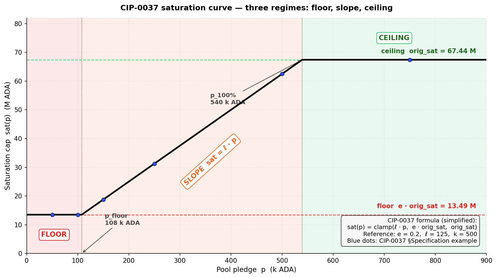
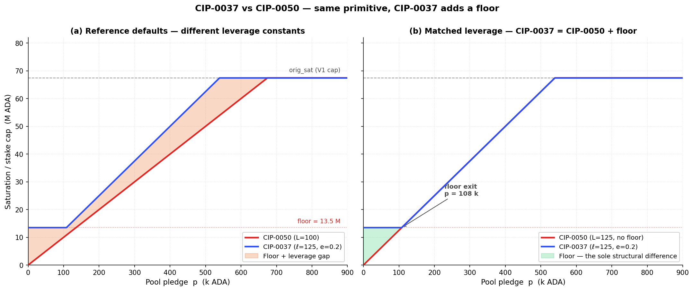

# CIP-0037 — Dynamic Saturation

> **CIP-0037 · Dynamic Saturation Based on Pledge** · 2021 · Casey Gibson · adds three parameters $(e, \ell, p_{100\%})$ · hard fork required · **Problem validated · root-level solution researched · recommendation: repair the pledge signal at its source first, then assess whether this curve is still needed as a secondary step**
>
> [official page](https://cips.cardano.org/cip/CIP-0037) · [PR #163](https://github.com/cardano-foundation/CIPs/pull/163)

CIP-0037 is the second stake-cap candidate in the bundle — same diagnostic target as CIP-0050 (POL.O2.F1: 78 % of staked ADA below 1 % pledge ratio; POL.O2.F2: pledge yield 0.68 %/yr against 2.3 %/yr passive), reached through a different primitive: a smooth saturation curve $\text{sat}(p) = \text{clamp}(\ell \cdot p, e \cdot \text{orig\_sat}, \text{orig\_sat})$ that grows with pledge, with a 20 % floor at the bottom and the V1 cap at the top.

**CIP-0037 is CIP-0050 plus a floor — same primitive, with a softer landing at the bottom and three times the governance surface at the top.** Read side-by-side at matched leverage, the slope and the ceiling are identical; the sole structural difference is the 20 % floor protecting pools below 13.49 M ADA.

Three findings frame the assessment:

- The 20 % floor delivers a genuine soft landing — every pool below 13.49 M ADA is unaffected at zero pledge, where CIP-0050 would clip to zero.
- Above the floor, the ~108 k ADA absolute pledge hurdle is the same for a 2 M pool and a 50 M pool — capital-capability bias is sharper than CIP-0050's at the operator level.
- Three parameters, an ADA-denominated ceiling anchor, and a `k`-coupled curve all raise the governance surface against CIP-0050's dimensionless $L$.

*The instrument trades a sharper algebra for a softer floor — and pays for the floor with three calibration handles that drift with `k` and the ADA / USD rate.*

## Table of Contents

- [1. What CIP-0037 proposes](#1-what-cip-0037-proposes)
- [2. The problem it tries to fix](#2-the-problem-it-tries-to-fix)
- [3. Assessment — validated problem, root-level fix first](#3-assessment-validated-problem-root-level-fix-first)
- [4. What it does to mainnet today](#4-what-it-does-to-mainnet-today)
- [5. Read more](#5-read-more)
- [Appendix A — Mechanism in detail](#appendix-a-mechanism-in-detail)
  - [A.1. The formula](#a1-the-formula)
  - [A.2. Three regimes — floor, slope, ceiling](#a2-three-regimes-floor-slope-ceiling)
  - [A.3. Structural kinship with CIP-0050](#a3-structural-kinship-with-cip-0050)
  - [A.4. Structural properties (theorems, not predictions)](#a4-structural-properties-theorems-not-predictions)
  - [A.5. Quantification at current mainnet parameters](#a5-quantification-at-current-mainnet-parameters)
  - [A.6. MPO fleet-split example](#a6-mpo-fleet-split-example)
- [Appendix B — Findings](#appendix-b-findings)
  - [B.1. S1 — Mechanical sharpness, softened by the 20 % floor](#b1-s1-mechanical-sharpness-softened-by-the-20-floor)
  - [B.2. S2 — Capital-capability bias](#b2-s2-capital-capability-bias)
  - [B.3. S3 — Governance, price-robustness, entity-level, and viability gaps](#b3-s3-governance-price-robustness-entity-level-and-viability-gaps)
- [Appendix C — Origin and references](#appendix-c-origin-and-references)
  - [C.1. Identity card](#c1-identity-card)
  - [C.2. Origin and context](#c2-origin-and-context)
  - [C.3. References](#c3-references)

## 1. What CIP-0037 proposes

CIP-0037 replaces the static V1 saturation cap (~67 M ADA) with a saturation curve indexed on pledge. The curve has three regimes:

- **20 % floor** at zero or near-zero pledge — a hollow pool still keeps a fifth of the V1 capacity.
- **Linear slope** through the mid-pledge range.
- **Ceiling** at full pledge that recovers the V1 cap.

Three parameters control the curve — $e$ (floor), $\ell$ (slope), and $p_{100\%}$ (ceiling anchor). A hard fork is required; no pool re-registration.

Read alongside [CIP-0050](cip-0050.md), the algebraic content is the same primitive: a linear-in-pledge slope capped at the V1 saturation. The only structural difference is the floor. CIP-0050 leaves zero-pledge pools at zero reward; CIP-0037 keeps them at 20 %. *CIP-0037 is CIP-0050 plus a floor.*

## 2. The problem it tries to fix

Same problem as CIP-0050, framed differently. The CIP's own framing (Casey Gibson, 2021):

> *"An SPO might have a pledge of 30,000 ADA across 10 pools, while another SPO might have 1,000,000 pledge but only has 1 pool with a small amount of active stake. Since there is no technical advantage to having a high pledge, the meaning and purpose of a pledge is redundant."*

The mainnet evidence behind that quote:

- **78 % of staked ADA** sits in pools with pledge ratio under 1 %.
- **42 of the 48 largest multi-pool operators** forfeit the pledge bonus.
- Pledged ADA yields ~0.68 %/yr; the same ADA placed as passive delegation yields ~2.3 %/yr.

Operators have rationally decided pledge isn't worth the opportunity cost.

CIP-0037 makes per-pool reward capacity grow with pledge. Splitting a fixed pledge across many pools shrinks each pool's envelope — the incentive to expand a multi-pool fleet becomes self-defeating.

## 3. Assessment — validated problem, root-level fix first

#### 1. The 20 % floor delivers the pledge signal with a soft landing — but only below 13.49 M ADA.

Pledge becomes a decisive input to the saturation cap, monotone on the slope regime, and the **20 % floor protects every pool below 13.49 M ADA** (Dormant, Sub-block, Sub-reliable, and the lower half of the Healthy tier) regardless of pledge level. Zero-pledge pools keep one fifth of V1 capacity instead of dropping to zero.

*That is a genuine advantage over CIP-0050's hard break — but it ends at the Healthy-tier midpoint.* → [The curve as pledge-as-signal — full mechanism](#b1-s1-mechanical-sharpness-softened-by-the-20-floor)

#### 2. Above the floor, capital capability discriminates harder as the pool grows.

The pledge needed to leave the floor is **108 k ADA absolute** — the same hurdle for a 2 M pool and a 50 M pool. The fraction of stake an operator must self-pledge to escape the floor therefore *falls* as the pool grows: ~5.4 % for a 2 M pool, ~0.22 % for a 50 M pool. Larger operators clear the floor on a smaller pledge ratio than smaller operators do — exactly inverse to V2 §3.4's concentration-reduction goal at the operator level.

Healthy-tier and above pools at the median retail pledge ratio (0.07 %) lose **10–82 % of reward**. → [Capital-capability bias — full quantification](#b2-s2-capital-capability-bias)

#### 3. Three parameters, an ADA-denominated anchor, and a `k`-coupled curve triple the governance surface.

Three scalars to calibrate $(e, \ell, p_{100\%})$ against CIP-0050's single dimensionless $L$ — and the ceiling anchor $p_{100\%} = 500\,000$ ADA is **absolute**, so its fiat cost slides with the ADA/USD rate (\$50 k at \$0.10/ADA, \$500 k at \$1.00/ADA, \$2.5 M at \$5.00/ADA). Any `k` change reshapes the entire curve via $\text{orig\_sat} = \text{Supply}/k$, forcing joint recalibration of all three parameters.

*Where CIP-0050 is price-invariant by construction, CIP-0037 needs to be re-pegged on material price moves and re-tuned on every `k` change.* → [Governance, price-robustness, and viability gaps](#b3-s3-governance-price-robustness-entity-level-and-viability-gaps)

The remainder of the document walks the proposal in three steps: §4 quantifies what changes on mainnet today; Appendix A unpacks the formula, the three regimes (floor, slope, ceiling), and the structural kinship with CIP-0050; Appendix B documents the per-finding evidence with verdict tags.

## 4. What it does to mainnet today



*CIP-0037.4.1 — At reference parameters ($e = 0.2$, $\ell = 125$, $p_{100\%} = 500$ k): floor at **13.49 M ADA** below 108 k pledge, linear slope through the mid-range, ceiling at **67.44 M ADA** above ~540 k pledge.*

| Pool tier (representative σ) | Pledge at 0.07 % ratio | Effective σ' | V1 reward preserved |
|---|---:|---:|---:|
| Sub-reliable (2 M) | 1.4 k ₳ | 2 M (σ < floor) | **100 %** — protected by the floor |
| Healthy (15 M) | 10.5 k ₳ | 13.49 M (floor binds) | **~90 %** — mild clip |
| Large healthy (50 M) | 35 k ₳ | 13.49 M (floor binds) | **~27 %** — severe clip |
| Saturated (77 M) | 53.9 k ₳ | 13.49 M (floor binds) | **~18 %** — clipped to floor |

The 20 % floor protects pools up to 13.49 M ADA. The lower half of the Healthy tier and everything below it stays whole at zero pledge.

Above 13.49 M, the same absolute pledge threshold (~108 k ADA) applies regardless of pool size. The harder a pool grows on delegation, the more aggressively the cap clips it at the median retail pledge ratio.

Stake-weighted, that puts two populations in the clipped zone:

- The entire Custodial-by-extraction segment — 2.04 B ADA, 21 % of productive stake — which cannot self-pledge by definition.
- Most of the Healthy-and-above retail population.

## 5. Read more

- **The proposal itself** — [CIP-0037 on cardano-cips.org](https://cips.cardano.org/cip/CIP-0037)
- **How it fits the four-CIP bundle** — [Intro & Conclusion of the 4 CIPs](../README.md)
- **Stake-cap layer comparison with CIP-0050** — [Stake-Cap synthesis](README.md)
- **Companion stake-cap CIP** — [CIP-0050 — Pledge Leverage](cip-0050.md)
- **Mechanism in detail** (formula, three regimes, kinship with CIP-0050, MPO fleet-split worked example) — [Appendix A](#appendix-a-mechanism-in-detail)
- **Full findings list** (S1–S3 with quantitative findings) — [Appendix B](#appendix-b-findings)
- **Origin, V2-milestone mapping, and diagnostic-finding anchors** — [Appendix C](#appendix-c-origin-and-references)

## Appendix A — Mechanism in detail

This appendix gives the full mechanical decomposition of CIP-0037: the formula in its simplified clamped form, the three regimes, structural kinship with CIP-0050, structural properties, and quantification at current mainnet parameters. The opener summarises the conclusions; this appendix carries the derivations and figures that back them.

### A.1. The formula

CIP-0037 replaces the static $z_0 = 1/k$ saturation cap with a pledge-indexed saturation function. Simplified from the canonical source (see errata note below):

$$\boxed{\text{sat}(p) \;=\; \text{clamp}\bigl(\ell \cdot p,\;\; e \cdot \text{orig\_sat},\;\; \text{orig\_sat}\bigr)}$$

where $\text{clamp}(x, \text{lo}, \text{hi}) = \min(\text{hi}, \max(\text{lo}, x))$.

Parameters:

- $\text{orig\_sat} = \text{Supply} / k$ — the V1 baseline saturation cap (≈ 67.44 M ₳ at $k = 500$).
- $e$ — floor multiplier (reference: 0.2 → 20 % of V1 cap minimum).
- $\ell$ — pledge leverage constant (reference: 125).
- $p$ — pool pledge (absolute ADA).
- $p_{100\%} = \text{orig\_sat} / \ell$ — pledge level at which $\text{sat}$ reaches the ceiling. The CIP lists $p_{100\%}$ as a third parameter; it is in fact determined by $\ell$ and $k$. At reference, $p_{100\%} \approx 540\,000$ ADA — the CIP approximates this by the round figure $500\,000$.

The reward-eligible stake becomes $\sigma' = \min(\sigma, \text{sat}(p))$; the reward curve then applies to $\sigma'$. The operator/member split is unchanged.

> **Errata — reconciling the simplified form with the CIP source.** The canonical CIP-0037 specification publishes the formula as JavaScript:
>
> ```
> new_sat   = orig_sat * Math.max(e, min(1/k, pledge/orig_sat * l));
> final_sat = max(new_sat, orig_sat);
> ```
>
> with custom helper functions where `max(v1, v2)` returns the **smaller** value and `min(v1, v2)` returns the **larger** — the names are inverted relative to their semantics. Read with real-world semantics: the inner `real_max(1/k, p·ℓ/orig_sat)` is dominated by the slope term for any pledge above ≈ 1 080 ADA (the $1/k$ guard never binds in practice), and the outer `final_sat` line clamps to the ceiling $\text{orig\_sat}$. The net operation is exactly $\text{clamp}(\ell \cdot p, e \cdot \text{orig\_sat}, \text{orig\_sat})$ — the form used above.

**Design surface.**

| Property | Value |
| --- | --- |
| New parameters | $(e, \ell, p_{100\%})$ — three anchors (effectively two, $p_{100\%}$ is derived) |
| Reference values | $e = 0.2$, $\ell = 125$, $p_{100\%} = 500\,000$ ADA |
| Layer | Stake-cap (applied *before* reward curve) |
| Fee-layer split | Unchanged |
| Hard fork | Required (new ledger rule) |
| Re-registration | Not required |
| Governance surface | 3 scalars (vs CIP-0050's 1) |

### A.2. Three regimes — floor, slope, ceiling

Three regimes fall directly from the clamp.

| Regime | Condition | sat(p) |
|---|---|---:|
| **Floor** | $p \leq e \cdot \text{orig\_sat} / \ell = 108$ k ADA | $e \cdot \text{orig\_sat}$ = 13.49 M |
| **Slope** | $108$ k $< p <$ $540$ k | $\ell \cdot p$ |
| **Ceiling** | $p \geq \text{orig\_sat} / \ell = 540$ k ADA | $\text{orig\_sat}$ = 67.44 M |

The blue dots on the curve in figure A.1 are the six numerical example points the CIP itself publishes in its Specification section — they lie exactly on the clamped piecewise curve.

### A.3. Structural kinship with CIP-0050

Read side-by-side, CIP-0037 and CIP-0050 are **the same primitive** applied to a large pool ($\sigma \geq \text{orig\_sat}$):

- **CIP-0050** effective cap on reward-eligible stake: $\min(\text{orig\_sat}, L \cdot p)$ — linear in pledge, V1 ceiling, **hard break at zero pledge**.
- **CIP-0037** effective cap: $\text{clamp}(\ell \cdot p, e \cdot \text{orig\_sat}, \text{orig\_sat})$ — linear in pledge with slope $\ell$, V1 ceiling, **floor at** $e \cdot \text{orig\_sat}$.

The slope is identical. Reference leverage differs only by convention ($\ell = 125$ vs $L = 100$). The **sole structural difference** is the floor:



*A.2 — Side-by-side of CIP-0037 vs CIP-0050: at matched leverage ($\ell = L = 125$, panel b), the **20 % floor** is the sole structural difference — slope and ceiling are identical.*

Panel (a) uses each CIP's reference leverage ($\ell = 125$ for CIP-0037, $L = 100$ for CIP-0050) — the gap conflates the 25 % leverage difference with the floor. Panel (b) matches leverage at $\ell = L = 125$ to **isolate the floor as the sole structural difference**. Reading this correctly reframes the two proposals: *CIP-0037 is CIP-0050 plus a floor.* Every S1 / S2 / S3 finding in [Appendix B](#appendix-b-findings) carries across one-for-one, modulated by whether the floor binds in the regime considered.

### A.4. Structural properties (theorems, not predictions)

| Property | Statement | Type |
|---|---|---|
| **Floor** | $\text{sat}(0) = e \cdot \text{orig\_sat}$ — zero-pledge pools retain $e = 20\,\%$ of V1 capacity | Algebraic |
| **Monotonicity in pledge** | $\partial \text{sat}/\partial p \geq 0$ on the slope regime (and weakly on the clamps) | Algebraic |
| **Three regimes** | Floor ($p < p_{\text{floor}}$), slope ($p_{\text{floor}} \leq p < p_{100\%}$), ceiling ($p \geq p_{100\%}$) | Algebraic |
| **MPO fleet-split penalty** | Splitting pledge budget $P$ across $N$ equal pools: per-pool sat shrinks (below $p_{100\%}$) as $N$ grows | Algebraic |
| **Price dependence** | $p_{100\%}$ is absolute ADA; fiat-denominated opportunity cost shifts with the ADA/USD rate | Structural |
| **k-dependence** | $\text{orig\_sat} = \text{Supply}/k$ — any $k$ change reshapes the entire curve | Structural |

The first four are the **design strengths**; the last two are governance-surface costs that distinguish CIP-0037 from CIP-0050's dimensionless primitive.

### A.5. Quantification at current mainnet parameters

All calibrations use reference parameters ($e = 0.2$, $\ell = 125$, $p_{100\%} = 500$ k, $k = 500$, $\text{orig\_sat} = 67.44$ M ₳).

**Pledge-to-threshold mapping.** The pledge needed to exit the floor regime:

$$p_{\text{floor-exit}} = \frac{e \cdot \text{orig\_sat}}{\ell} = \frac{0.2 \cdot 67.44 \text{ M}}{125} \approx 108\,000 \text{ ₳}$$

**A pool with less than ~108 k ₳ of absolute pledge is in the floor regime regardless of pool size.** This is the single most important calibration consequence: escaping the floor requires an *absolute* pledge threshold, not a ratio.

**Saturation under reference parameters by pledge level:**

| Pledge (absolute ADA) | Regime | sat (ADA) | % of V1 cap |
|---:|---|---:|---:|
| 0 | Floor | 13.49 M | 20.0 % |
| 50 000 | Floor | 13.49 M | 20.0 % |
| 108 000 | Floor / Slope boundary | 13.49 M | 20.0 % |
| 150 000 | Slope | 18.75 M | 27.8 % |
| 250 000 | Slope | 31.25 M | 46.3 % |
| 500 000 | Slope (approaching ceiling) | 62.50 M | 92.7 % |
| 750 000 | Ceiling | 67.44 M | 100 % |
| 1 000 000+ | Ceiling | 67.44 M | 100 % |

**Effect on the nine-tier taxonomy** — the diagnostic groups pools by stake size into nine canonical tiers running from *Dormant* (≈ 50 K ADA, too small to produce blocks reliably) up to *Oversaturated* (above the V1 cap), with *Sub-reliable* / *Healthy* / *Large healthy* / *Saturated* spanning the productive range. Full definitions in [pools-distribution §4.1.3](../../diagnostic/sub-flows/pools-distribution/mainnet-analysis/README.md#413-tier-definitions). Hollow pool ($p = 0$):

| Canonical tier | Rep. σ | sat(0) = 13.49 M | σ' = min(σ, sat) | V1 reward fraction preserved |
|---|---:|---:|---:|---:|
| Zero-stake | 0 | 13.49 M | 0 | — |
| Dormant | 50 K | 13.49 M | 50 K | 100 % (unchanged) |
| Sub-block | 500 K | 13.49 M | 500 K | 100 % (unchanged) |
| Sub-reliable | 2 M | 13.49 M | 2 M | 100 % (unchanged) |
| Healthy | 15 M | 13.49 M | **13.49 M** | **~90 %** (mild clip) |
| Large healthy | 50 M | 13.49 M | **13.49 M** | **~27 %** (severe clip) |
| Near-saturation | 67 M | 13.49 M | **13.49 M** | **~20 %** (clipped to floor) |
| Saturated | 77 M | 13.49 M | **13.49 M** | **~18 %** (relative to V1 sat of 77 M pool ≈ 24 000 ₳/ep) |
| Oversaturated | 85 M | 13.49 M | **13.49 M** | **~16 %** |

The 20 % floor protects pools with $\sigma \leq 13.49$ M — that is, **all tiers up to and including Sub-reliable** and the lower half of the Healthy tier. Above 13.49 M, zero-pledge pools are clipped in proportion to (13.49 M / σ). A zero-pledge Saturated pool (77 M) keeps ~18 % of its V1 reward.

**Stake-weighted effect on mainnet** (back-of-envelope from POL.O2.F1 + diagnostic §4.3.3, at reference parameters, hollow approximation for zero-pledge pools):

| Segment | Stake | Typical pledge regime | Reward effect |
|---|---:|---|---|
| Custodial-by-pledge (treasury self-pledge) | 1.59 B ₳ | Ceiling | Unchanged |
| Custodial-by-extraction (custodied retail funds) | 2.04 B ₳ | Floor (p ≈ 0) | Clipped to 20 % cap |
| Custodial-by-delegation | 0.92 B ₳ | Mixed | Mixed |
| Retail compliant (pledge ratio ≥ ~1–2 %, absolute ≥ 108 k) | ~0.99 B ₳ | Slope or ceiling | Mostly unchanged |
| Retail zero-pledge (pledge below floor-exit threshold) | ~16.0 B ₳ | Floor | **Clipped** — pools below 13.5 M unaffected; Healthy-tier pools above ~13.5 M lose 10 % or more; Large-healthy+ lose 73 % or more |

### A.6. MPO fleet-split example

CIP's own worked case: 1 M ADA pledge budget at reference parameters.

| Pools | Pledge / pool | V1 per-pool cap | CIP-0037 per-pool cap | Total fleet cap |
|---:|---:|---:|---:|---:|
| 1 | 1 000 000 | 100 % of K | 100 % of K | 1 × 67.44 = 67.44 M |
| 2 | 500 000 | 100 % of K | ~92.7 % of K | 2 × 62.5 = 125 M |
| 4 | 250 000 | 100 % of K | ~46 % of K | 4 × 31 = 124 M |
| 8 | 125 000 | 100 % of K | ~28 % of K | 8 × 19 = 152 M |
| 16 | 62 500 | 100 % of K | 20 % (floor) | 16 × 13.5 = 216 M |

At reference parameters, a 16-pool MPO fleet with 1 M pledge actually **gains** fleet capacity vs single-pool (all 16 hit the floor) — the regressive tail the CIP aims to foreclose. The penalty is only active while some pools sit on the slope regime; once enough pools cross into the floor, the splitting penalty vanishes. The CIP-0050 property "pool-splitting revenue-neutral" is **strictly tighter** than CIP-0037's slope-regime penalty.

## Appendix B — Findings

Three cards organise the analysis: what the curve actually delivers (S1), the capital-capability bias from the Healthy tier upward (S2), and the governance, price-robustness, and entity-level gaps unique to this parameterisation (S3).

<article class="sro-card sro-card-pro" id="b1-s1-mechanical-sharpness-softened-by-the-20-floor" data-group="1" markdown="1">
<header class="sro-head">
<span class="sro-badge sro-group-1">S1</span>
<div class="sro-titles"><span class="sro-eyebrow">Synthesis 01 · 3 findings · the design-strength row</span><h3 class="sro-title">Mechanical sharpness, softened by the 20 % floor</h3></div>
<span class="sro-count">3 findings</span>
</header>
<p class="sro-abstract" markdown="1">**What the curve actually delivers: pledge becomes a decisive input, the smallest pools stay protected, and fleet-splitting incurs a penalty on the slope regime.** All three properties follow directly from the formula.</p>
<div class="sro-findings-label">Findings</div>
<ol class="sro-findings" markdown="1">
<li class="sro-finding" id="s1-f1" data-group="1" markdown="1">
<a class="sro-fid sro-fid-stack sro-group-1" href="#s1-f1" title="S1.F1 — Delivers"><span class="sro-fid-label">[D] #1</span><span class="sro-fid-ref">S1.F1</span></a>
<div class="sro-body" markdown="1"><div class="sro-evidence" markdown="1">**Monotonicity in pledge.** On the slope regime ($p_{\text{floor-exit}} \leq p < p_{100\%}$), $\partial \text{sat} / \partial p > 0$ — higher pledge strictly widens the saturation envelope. Direct delivery on V2 §3.2 pledge-as-signal: pledge becomes a decisive input to the reward calculation rather than a cosmetic yield nudge.</div></div>
</li>
<li class="sro-finding" id="s1-f2" data-group="1" markdown="1">
<a class="sro-fid sro-fid-stack sro-group-1" href="#s1-f2" title="S1.F2 — Delivers"><span class="sro-fid-label">[D] #2</span><span class="sro-fid-ref">S1.F2</span></a>
<div class="sro-body" markdown="1"><div class="sro-evidence" markdown="1">**20 % floor protects the smallest pools.** $\text{sat}(0) = 0.2 \cdot \text{orig\_sat} \approx 13.49$ M ₳. Any pool with total stake ≤ 13.49 M is unaffected under zero pledge — covering Dormant, Sub-block, Sub-reliable, and the lower half of the Healthy tier. Unlike CIP-0050, the instrument does not zero out hollow pools; it caps them at 20 % of the V1 saturation.</div></div>
</li>
<li class="sro-finding" id="s1-f3" data-group="1" markdown="1">
<a class="sro-fid sro-fid-stack sro-group-1" href="#s1-f3" title="S1.F3 — Delivers"><span class="sro-fid-label">[D] #3</span><span class="sro-fid-ref">S1.F3</span></a>
<div class="sro-body" markdown="1"><div class="sro-evidence" markdown="1">**MPO fleet-split penalty on the slope regime.** Splitting a fixed pledge budget $P$ across $N$ equal pools places each pool at pledge $P/N$. On the slope regime (below $p_{100\%}$), per-pool saturation shrinks as $N$ grows — fleet splitting is no longer reward-free. Pool-level §3.4 concentration pressure.</div></div>
</li>
</ol>
</article>

#### Where the splitting penalty stops working.

CIP-0050 makes pool-splitting strictly revenue-neutral: total reward cap across $N$ pools equals the single-pool cap, for any pledge budget.

CIP-0037 makes it revenue-neutral *only above the floor*. Below the floor, a split fleet actually gains capacity — every pool hits the 20 % floor and contributes 13.49 M each. CIP-0050's hard-cap property is structurally tighter on the pool-level concentration target.

<article class="sro-card sro-card-pro" id="b2-s2-capital-capability-bias" data-group="2" markdown="1">
<header class="sro-head">
<span class="sro-badge sro-group-2">S2</span>
<div class="sro-titles"><span class="sro-eyebrow">Synthesis 02 · 4 findings</span><h3 class="sro-title">Capital-capability bias</h3></div>
<span class="sro-count">4 findings</span>
</header>
<p class="sro-abstract" markdown="1">**The 20 % floor protects the bottom; the Healthy tier and above are clipped by the median retail pledge ratio.** Once a pool grows past 13.49 M ADA, the same absolute pledge threshold (~108 k ADA) applies regardless of size — so the cap discriminates by capital capability, same as CIP-0050.</p>
<div class="sro-findings-label">Findings</div>
<ol class="sro-findings" markdown="1">
<li class="sro-finding" id="s2-f1" data-group="2" markdown="1">
<a class="sro-fid sro-fid-stack sro-group-2" href="#s2-f1" title="S2.F1 — Regresses"><span class="sro-fid-label">[R] #1</span><span class="sro-fid-ref">S2.F1</span></a>
<div class="sro-body" markdown="1"><div class="sro-evidence" markdown="1">**Median retail pledge is in the floor regime; Healthy-tier and above are clipped.** At reference parameters, a pool needs **108 k ₳ of absolute pledge** to leave the floor regime. POL.O2.F1: stake-weighted median retail pledge ratio is 0.07 %; for a 15 M pool this is 10.5 k ₳ — an order of magnitude below the floor-exit threshold. Healthy-tier retail pools (σ > 13.49 M) with this pledge level are clipped to 13.49 M — a 10 % cut at the low end of the tier, growing to a 65 % cut at the top (σ = 38.5 M). Large-healthy, Near-saturation, and Saturated tiers lose 73 % or more of V1 reward.</div></div>
</li>
<li class="sro-finding" id="s2-f2" data-group="2" markdown="1">
<a class="sro-fid sro-fid-stack sro-group-2" href="#s2-f2" title="S2.F2 — Regresses"><span class="sro-fid-label">[R] #2</span><span class="sro-fid-ref">S2.F2</span></a>
<div class="sro-body" markdown="1"><div class="sro-evidence" markdown="1">**Custodial-by-extraction (21 % of productive stake) cannot respond.** Custodial-by-extraction entities (57 entities, 2.04 B ADA) hold custodied retail funds they legally cannot self-pledge. Their pools operate at $p \approx 0$; under CIP-0037 they sit on the floor with σ' capped at 13.49 M. The affected population cannot adjust; the reform's response channel is closed for this segment.</div></div>
</li>
<li class="sro-finding" id="s2-f3" data-group="2" markdown="1">
<a class="sro-fid sro-fid-stack sro-group-2" href="#s2-f3" title="S2.F3 — Regresses"><span class="sro-fid-label">[R] #3</span><span class="sro-fid-ref">S2.F3</span></a>
<div class="sro-body" markdown="1"><div class="sro-evidence" markdown="1">**The floor-exit threshold is pool-size-independent — mechanically regressive.** The ~108 k ADA to exit the floor is the same absolute pledge for a 2 M pool and a 50 M pool. The fraction of σ that must be self-pledged to escape the floor *falls* as the pool grows: for a 2 M pool, ~5.4 %; for a 15 M pool, ~0.72 %; for a 50 M pool, ~0.22 %. Larger operators can satisfy the reform at a smaller pledge ratio — the capital hurdle is easier at scale, exactly inverse to the V2 §3.4 concentration-reduction goal at the operator level.</div></div>
</li>
<li class="sro-finding" id="s2-f4" data-group="2" markdown="1">
<a class="sro-fid sro-fid-stack sro-group-2" href="#s2-f4" title="S2.F4 — Blind spot"><span class="sro-fid-label">[B] #4</span><span class="sro-fid-ref">S2.F4</span></a>
<div class="sro-body" markdown="1"><div class="sro-evidence" markdown="1">**The "operators will pledge more" bet is contradicted by POL.O2.F2 + POL.O5.F3.** Same as for CIP-0050: pledge yield 0.68 %/yr is structurally dominated by passive-delegation yield 2.3 %/yr; 42 of 48 saturation-scale MPOs already forfeit the bonus today. CIP-0037 changes the saturation curve but not the opportunity-cost comparison that produces the current non-pledge equilibrium.</div></div>
</li>
</ol>
</article>

#### Reading the four findings together.

The 20 % floor softens CIP-0037 at the very bottom — Sub-reliable pools and below stay whole even at zero pledge. That is a real advantage over CIP-0050's hard break.

From the Healthy tier upward, the picture inverts. The floor-exit threshold of ~108 k ADA is the same absolute amount for a 2 M pool and a 50 M pool. Mid-tier retail pools therefore need absolute pledge levels most operators simply do not have, and the cut bites harder than the floor's headline 20 % suggests.

The discrimination is by capital capability — same as CIP-0050.

<article class="sro-card sro-card-pro" id="b3-s3-governance-price-robustness-entity-level-and-viability-gaps" data-group="3" markdown="1">
<header class="sro-head">
<span class="sro-badge sro-group-3">S3</span>
<div class="sro-titles"><span class="sro-eyebrow">Synthesis 03 · 4 findings</span><h3 class="sro-title">Governance, price-robustness, entity-level, and viability gaps</h3></div>
<span class="sro-count">4 findings</span>
</header>
<p class="sro-abstract" markdown="1">**Three governance costs unique to CIP-0037's parameterisation, plus the same small-pool viability risk as CIP-0050.** Three parameters instead of one, an absolute pledge anchor that drifts with the ADA/USD rate, the same entity-level concentration left untouched, and a softer but real version of the small-pool viability risk.</p>
<div class="sro-findings-label">Findings</div>
<ol class="sro-findings" markdown="1">
<li class="sro-finding" id="s3-f1" data-group="3" markdown="1">
<a class="sro-fid sro-fid-stack sro-group-3" href="#s3-f1" title="S3.F1 — Regresses"><span class="sro-fid-label">[R] #1</span><span class="sro-fid-ref">S3.F1</span></a>
<div class="sro-body" markdown="1"><div class="sro-evidence" markdown="1">**Governance surface 3× CIP-0050.** Three parameters $(e, \ell, p_{100\%})$ to calibrate, each with interlocking effects. Any `k` change reshapes the curve (via $\text{orig\_sat} = \text{Supply}/k$) and requires joint re-calibration of all three. V2 §4.4 governability cost is material.</div></div>
</li>
<li class="sro-finding" id="s3-f2" data-group="3" markdown="1">
<a class="sro-fid sro-fid-stack sro-group-3" href="#s3-f2" title="S3.F2 — Regresses"><span class="sro-fid-label">[R] #2</span><span class="sro-fid-ref">S3.F2</span></a>
<div class="sro-body" markdown="1"><div class="sro-evidence" markdown="1">**Price-dependence breaks V2 §4.3 price-robustness.** $p_{100\%} = 500\,000$ ADA is **absolute**, not a ratio. The fiat cost of reaching full pledge shifts directly with the ADA/USD rate: at \$0.10 it costs \$50 k; at \$1.00 it costs \$500 k; at \$5.00 it costs \$2.5 M. Operator behaviour responds to fiat cost; the calibration needs to be re-pegged on material price moves. CIP-0050's dimensionless $L$ is structurally price-invariant by construction.</div></div>
</li>
<li class="sro-finding" id="s3-f3" data-group="3" markdown="1">
<a class="sro-fid sro-fid-stack sro-group-3" href="#s3-f3" title="S3.F3 — Regresses"><span class="sro-fid-label">[R] #3</span><span class="sro-fid-ref">S3.F3</span></a>
<div class="sro-body" markdown="1"><div class="sro-evidence" markdown="1">**Entity-level §3.4 concentration gap.** Custodial-by-pledge entities with native pledge above $p_{100\%}$ operate on the ceiling regime — σ' = orig\_sat regardless of pledge size. The 10 entities / 1.59 B ADA segment that dominates entity-level concentration today is entirely unaffected by CIP-0037, same as under CIP-0050.</div></div>
</li>
<li class="sro-finding" id="s3-f4" data-group="3" markdown="1">
<a class="sro-fid sro-fid-stack sro-group-3" href="#s3-f4" title="S3.F4 — Blind spot"><span class="sro-fid-label">[B] #4</span><span class="sro-fid-ref">S3.F4</span></a>
<div class="sro-body" markdown="1"><div class="sro-evidence" markdown="1">**§3.1 small-pool viability risk — softer than CIP-0050 but present.** Healthy-tier retail single-pool operators (214 entities, 2.44 B ₳ per operator-delegator §4.3.3) with sub-compliant pledge see 10–64 % of pool reward clipped at reference parameters. Because the fee-layer split is unchanged, both operator take and delegator ROS drop proportionally. Without a companion §3.1 fee-layer instrument, CIP-0037 risks accelerating attrition in the Healthy-tier single-pool population V2 §3.1 names as the priority.</div></div>
</li>
</ol>
</article>

#### Putting the cards together.

CIP-0037 shares the same structural critique as CIP-0050: correct target (the pledge signal), correct layer (reward-distribution pre-split), but with capital-capability bias, small-pool viability risk, and an entity-level concentration gap.

What CIP-0037 does differently:

- **Genuine softening at the very bottom.** The 20 % floor protects all pools below 13.49 M ADA, regardless of pledge.
- **Higher governance cost.** Three parameters to calibrate, plus an absolute anchor that drifts with the ADA/USD rate.

#### Deployment order it needs.

Same precondition as CIP-0050: a fee-layer viability instrument must be active first to protect the retail population most exposed to clipping. The sequence:

1. Fee-layer viability instrument first — secures small-pool revenue and delegator yield.
2. Stake-cap instrument (CIP-0037 *or* CIP-0050, not both).
3. `k` recalibration last, leveraging the consolidation the stake-cap induces.

## Appendix C — Origin and references

### C.1. Identity card

| Field | Value |
| --- | --- |
| CIP number | CIP-0037 |
| Title | Dynamic Saturation Based on Pledge |
| Author | Casey Gibson |
| Created | 2021/12/03 |
| Category | Ledger |
| Status | Proposed (as of 2026/04) |
| Official page | [cips.cardano.org/cip/CIP-0037](https://cips.cardano.org/cip/CIP-0037) |
| Source (GitHub) | [cardano-foundation/CIPs / CIP-0037](https://github.com/cardano-foundation/CIPs/tree/master/CIP-0037) |
| Discussion PR | [cardano-foundation/CIPs #163](https://github.com/cardano-foundation/CIPs/pull/163) |

### C.2. Origin and context

**Authorship and moment.** Written in December 2021 by Casey Gibson. The CIP's motivation:

> *"An SPO might have a pledge of 30,000 ADA across 10 pools, while another SPO might have 1,000,000 pledge but only has 1 pool with a small amount of active stake. Since there is no technical advantage to having a high pledge, the meaning and purpose of a pledge is redundant."*

The CIP proposes a saturation function $\text{sat}(p)$ that grows with pledge. Splitting a fixed pledge across more pools moves each pool left on the curve, reducing per-pool capacity.

**Scope.** CIP-0037 modifies **the saturation formula itself** — the pool-distribution stage of the reward pipeline. The fee-layer split (`minPoolCost`, `minPoolMargin`, `poolRate`) is untouched. It is therefore a pools-distribution-layer instrument with the same mechanical footprint as CIP-0050.

**Relation to other CIPs.**
- **CIP-0050** — the other stake-cap candidate. Same V2 targets (§3.2 + pool-level §3.4); different primitive (hard cap vs smooth curve). Same-layer pairing not canonical.
- **Fee-layer CIPs (CIP-0023, CIP-0082)** — compose cleanly on the mechanical axis (different pipeline stage) but target different V2 milestones.
- **`k` lever** — $\text{orig\_sat} = \text{Supply}/k$ is a reference scale for CIP-0037; any `k` change directly reshapes the saturation curve. Standalone k analysis: [cip-0082 §B.3 standalone k-lever deep dive](../operator-delegator/cip-0082.md#b3-standalone-k-lever-deep-dive).

### C.3. References

- **Induced problems addressed (and not):** [μ01 — Closing the Consensus Incentive Gap (pledge paradox)](../../generated-website/problem-statements.html#problem-1-2-3) — partially, via the dynamic-saturation curve ; [μ02 — Guarantee operator viability](../../generated-website/problem-statements.html#problem-1-3-3-1) — *regressed* (same as CIP-0050: σ′ clip on top of broken `A(ν, π)`) ; [μ04 — SPO supply side](../../generated-website/problem-statements.html#problem-2-1-3-1) — partially.
- **Solution Design milestones potentially affected:** [Solution Design M1 — Repair pledge, sustain the small SPO base](../../README.md#21-milestone-1-repair-pledge-sustain-the-small-spo-base) (the four-move repair) ; [Solution Design §2.5 — Research axis on concentration](../../README.md#25-research-axis-reduce-the-concentration-effects-that-distort-both-populations).
- **Numerical baselines:** [Appendix A.5](#a5-quantification-at-current-mainnet-parameters) of this file (pledge-to-threshold mapping, nine-tier effect, MPO fleet-split example); [pools-distribution §4.1.3](../../diagnostic/sub-flows/pools-distribution/mainnet-analysis/README.md#413-tier-definitions) (nine-tier taxonomy); [operator-delegator §4.3.3](../../diagnostic/sub-flows/operator-delegator-distribution/mainnet-analysis/README.md) (custodial / retail decomposition).
- **Diagnostic findings cited in this file:** POL.O2.F1, POL.O2.F2, POL.O5.F1, POL.O5.F2, POL.O5.F3, POL.O6.F2 (pools-distribution); OPE.O6.F4, OPE.O7.F1 (operator-delegator).
- **Companion CIP:** [`cip-0050.md`](cip-0050.md) — alternative stake-cap primitive (hard cap vs smooth curve). Same-layer pairing is not canonical; a coherent V2 package picks one.
- **Fee-layer companions (§3.1 instruments):** [`../operator-delegator/cip-0023.md`](../operator-delegator/cip-0023.md), [`../operator-delegator/cip-0082.md`](../operator-delegator/cip-0082.md). CIP-0037's precondition for constructive deployment is a fee-layer viability instrument active first.
- **Transversal lever:** [cip-0082 §B.3 standalone k-lever deep dive](../operator-delegator/cip-0082.md#b3-standalone-k-lever-deep-dive) — standalone `k`-raise analysis. $\text{orig\_sat} = \text{Supply}/k$ means any `k` change directly reshapes the CIP-0037 curve; joint recalibration required.
- **Canonical source:** CIP-0037 official page at [cips.cardano.org/cip/CIP-0037](https://cips.cardano.org/cip/CIP-0037); source PR [#163](https://github.com/cardano-foundation/CIPs/pull/163).

> **Status:** Active 2026/04/23. Stake-cap-layer candidate. CIP identity and sources in [Appendix C.1](#c1-identity-card); evaluation references in [Appendix C.3](#c3-references).
