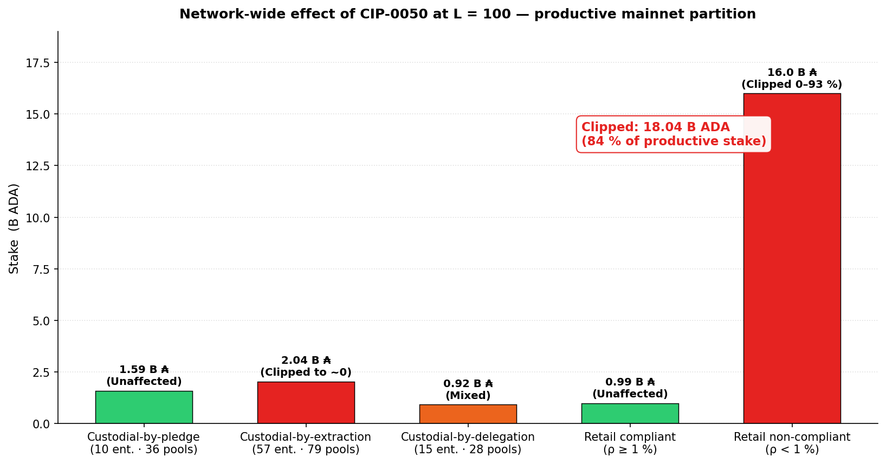
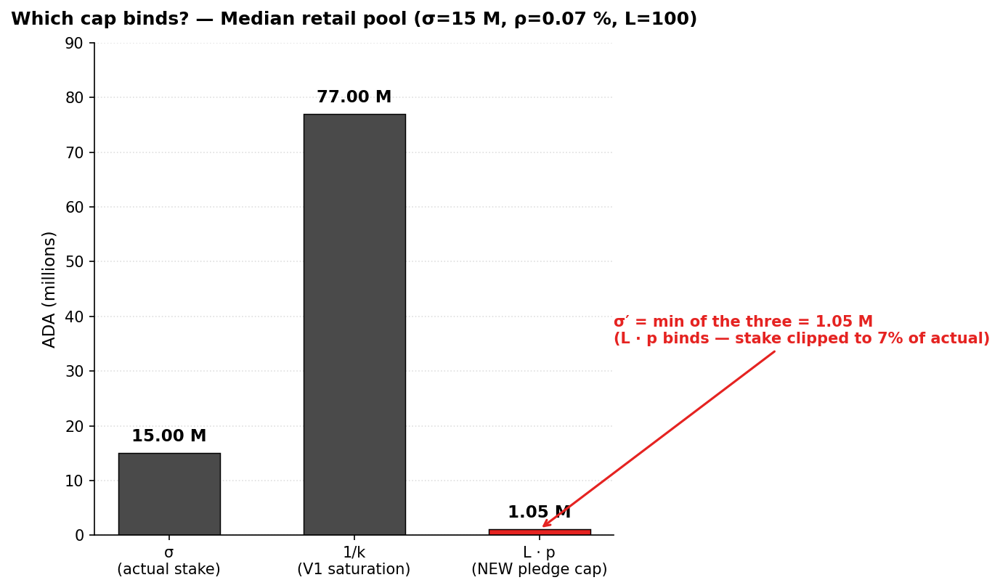
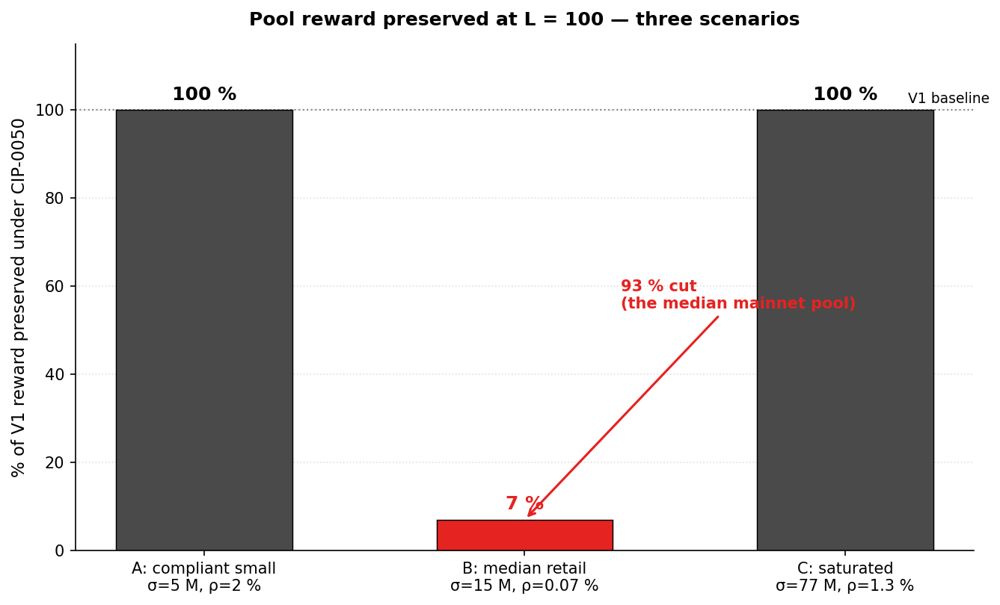
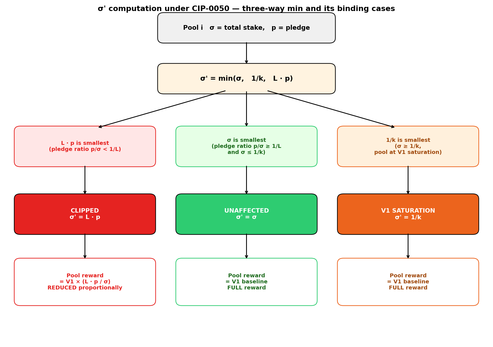
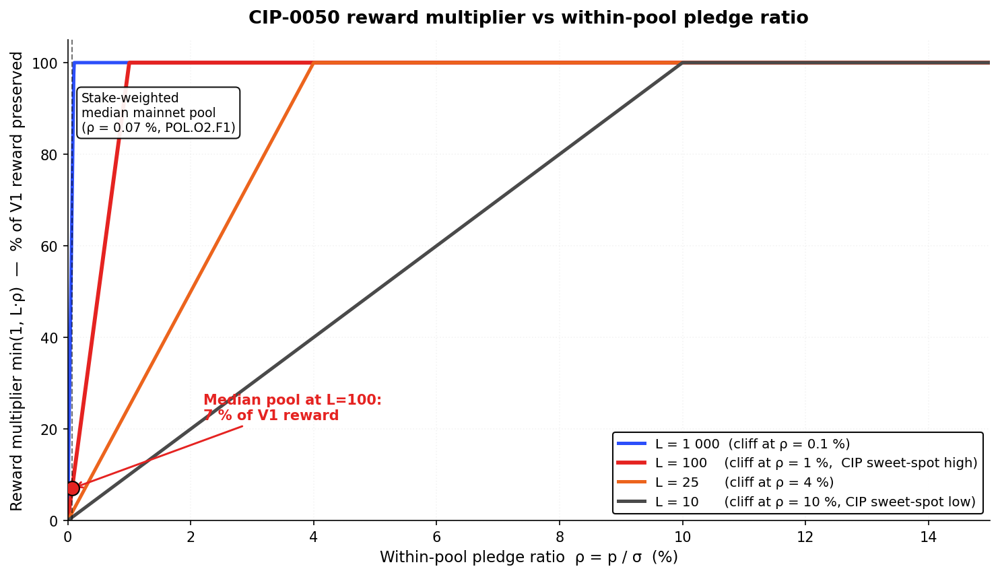
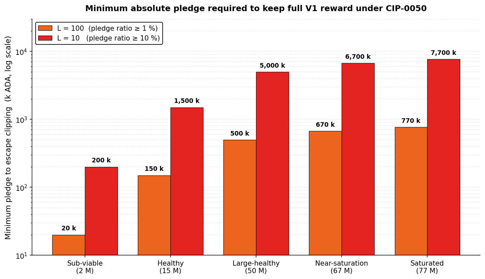
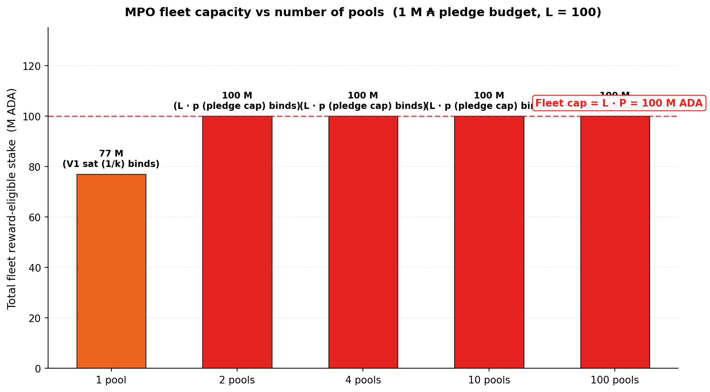
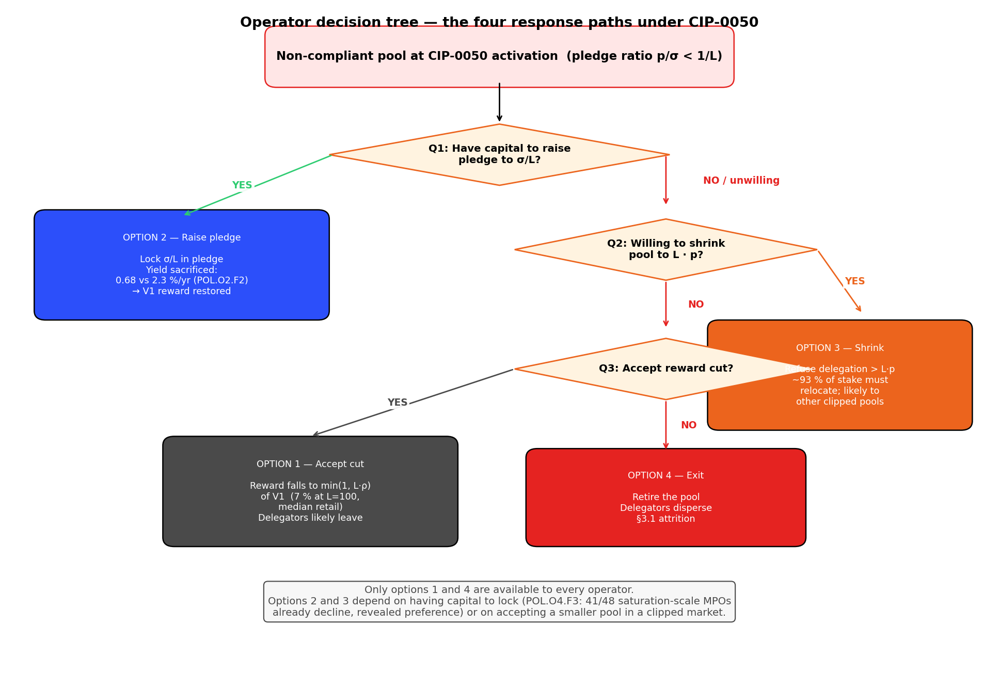
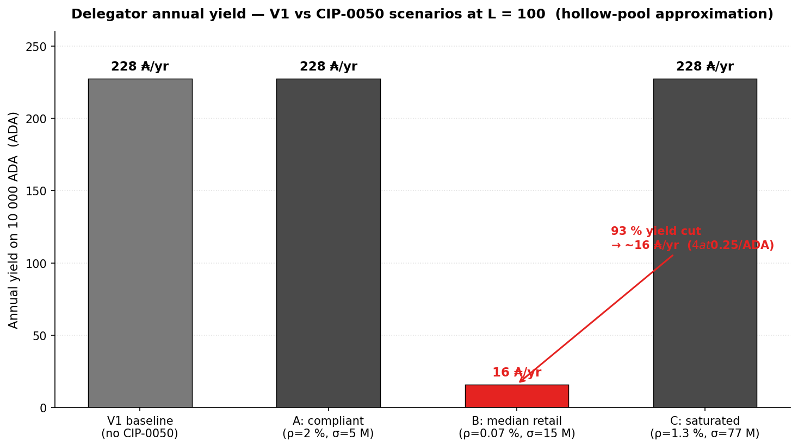

# CIP-0050 — Pledge Leverage

> **CIP-0050 · Pledge Leverage-Based Staking Rewards** · 2022, updated 2025 · Liesenfelt et al. · adds one parameter `L` · hard fork required · **Problem validated · root-level solution researched · recommendation: repair the pledge signal at its source first, then assess whether the σ′ cap is still needed as a secondary step**
>
> [official page](https://cips.cardano.org/cip/CIP-0050) · [original PR #242](https://github.com/cardano-foundation/CIPs/pull/242) · [2025 update PR #1042](https://github.com/cardano-foundation/CIPs/pull/1042)

CIP-0050 attacks the diagnostic's central pledge pathology — *95.6 % of the pledge-bonus budget returns to reserve unclaimed* (POL.O1.F3), 78 % of staked ADA sits in pools with pledge ratio below 1 % (POL.O2.F1), and pledged ADA earns 0.68 %/yr against 2.3 %/yr passive (POL.O2.F2). The proposal converts pledge from a 22 % yield nudge into a hard cap on reward-eligible stake: a pool collects rewards on at most $L \cdot p$, with $L = 100$ the recommended endpoint.

**CIP-0050 is the sharpest pledge-as-signal lever in the candidate bundle — and it lands cleanest once the root-level repair has restored the signal it caps.** The cap delivers two structural properties by algebra (zero pledge → zero reward; pool-splitting revenue-neutral). The depth the diagnostic adds: the **root cause of the broken pledge signal is the bonus function `A(ν, π)`** in the SL-D1 reward formula, which CIP-0050 leaves untouched, so at $L = 100$ the standalone cap **clips ~84 % of productive stake** — including pools that produce blocks reliably and serve delegators well. Repair `A` first and the population can pledge up *before* the cap binds; the cap then reinforces a working signal rather than clipping a broken one.

Three findings frame the assessment:

- The cap is mechanically sharp — both design properties hold as theorems, not predictions.
- The change is **too radical**: ~84 % of productive stake clipped at L = 100, including pools that produce blocks reliably and serve delegators well — and the root cause of the broken pledge signal (`A(ν, π)`) is left untouched.
- In today's regime, **most of the pool pot returns to reserve unused**: distribution efficiency falls from 44 % to ~8 %, and **network-wide delegator yield collapses from ~2.27 % to ~0.44 %** — an 80 % drop. The closing-incentive-gap pathology the diagnostic flags (POL.O1) gets dramatically worse, not better.

*The instrument names the right target and lands cleanly on it — but lands on a population the V2 spec is supposed to protect, not discipline.*

## Table of Contents

- [1. What CIP-0050 proposes](#1-what-cip-0050-proposes)
- [2. The problem it tries to fix](#2-the-problem-it-tries-to-fix)
- [3. Assessment — validated problem, root-level fix first](#3-assessment-validated-problem-root-level-fix-first)
- [4. What it does to mainnet today](#4-what-it-does-to-mainnet-today)
- [5. Read more](#5-read-more)
- [Appendix A — Mechanism in detail](#appendix-a-mechanism-in-detail)
  - [A.1. The formula](#a1-the-formula)
  - [A.2. Three worked scenarios](#a2-three-worked-scenarios)
  - [A.3. How much pledge does an operator need](#a3-how-much-pledge-does-an-operator-need)
  - [A.4. The cliff at the pledge-ratio threshold](#a4-the-cliff-at-the-pledge-ratio-threshold)
  - [A.5. Structural properties (theorems, not predictions)](#a5-structural-properties-theorems-not-predictions)
  - [A.6. What this means for different operator types](#a6-what-this-means-for-different-operator-types)
  - [A.7. Operator decision tree](#a7-operator-decision-tree)
  - [A.8. The delegator perspective](#a8-the-delegator-perspective)
  - [A.9. The CIP's recommended deployment ramp](#a9-the-cips-recommended-deployment-ramp)
  - [A.10. Composition with a `k`-raise — when does a stake-cap actually deconcentrate?](#a10-composition-with-a-k-raise-when-does-a-stake-cap-actually-deconcentrate)
- [Appendix B — Findings](#appendix-b-findings)
  - [B.1. S1 — Mechanical sharpness on pledge-as-signal](#b1-s1-mechanical-sharpness-on-pledge-as-signal)
  - [B.2. S2 — Too radical, root cause unfixed](#b2-s2-too-radical-root-cause-unfixed)
  - [B.3. S3 — Pool pot returns to reserve, network-wide yield collapses](#b3-s3-pot-returns-to-reserve-yield-collapses)
- [Appendix C — Origin and references](#appendix-c-origin-and-references)
  - [C.1. Identity card](#c1-identity-card)
  - [C.2. Origin and context](#c2-origin-and-context)
  - [C.3. References](#c3-references)

## 1. What CIP-0050 proposes

CIP-0050 turns pledge into a hard cap on pool earnings. The new rule: a pool collects rewards on at most $L$ times its operator's own pledge, on top of the existing saturation cap.

Three consequences fall out immediately:

- A pool with zero pledge earns zero reward.
- Splitting one pool into many leaves the total reward cap unchanged.
- Pledge becomes a binding constraint on what the protocol pays out.

The instrument adds a single dimensionless parameter $L$ (the proposal targets $L = 100$). It needs a hard fork to install the new ledger variable; no pool re-registration. **It is the sharpest pledge-as-signal proposal in the candidate bundle.**

## 2. The problem it tries to fix

Today, pledge barely affects what an operator earns. The mainnet evidence is clear:

- **78 % of staked ADA** sits in pools with pledge ratio under 1 %.
- **42 of the 48 largest multi-pool operators** forfeit the pledge bonus entirely.
- Pledged ADA yields ~0.68 %/yr; the same ADA placed as passive delegation yields ~2.3 %/yr.

Operators have rationally chosen to ignore the pledge bonus — it costs them more than it pays. The reward formula prices pledge as a soft 22 % nudge, and the operator population treats it as cosmetic.

CIP-0050 converts that nudge into a constraint: no pledge, no reward.

#### Sybil resistance — what is actually being defended.

A **Sybil attack** is when one person pretends to be many. In Cardano staking, that means a single operator running many separate pools to capture more rewards than they would running just one — even though the protocol's design assumes those pools belong to *different* operators.

Today, registering a pool costs about **500 ADA** of refundable deposit. The protocol cannot tell on-chain whether two pools belong to the same person, unless that person declares it. This is how Cardano ends up with **449 productive pools but only 83 distinct entities** behind them (POL.O5.F1) — the protocol target says ~500 slots, the reality says fewer than 100 hands.

CIP-0050's pledge cap is, at its core, an **anti-Sybil instrument**. The reasoning: if every pool needs its own pledge to earn rewards, then splitting one pool into N copies costs N times the pledge. Sybil becomes capital-bound, not just registration-bound.

This is the intuition the proposal's advocates build their case on. It is correct as far as it goes — and the diagnostic agrees with the mechanics. *The disagreement that follows is about who on mainnet actually pledges under the new rule, and who ends up paying the cost regardless.*

## 3. Assessment — validated problem, root-level fix first

#### 1. The cap is mechanically sharp on pledge-as-signal — zero pledge, zero reward.

A zero-pledge pool earns zero reward; a fleet split across $N$ pools earns the same total cap as one. Both properties hold by algebra, not by behavioural assumption — pledge becomes a binding constraint on the reward-eligible stake.

*This is the sharpest pledge-as-signal expression in the candidate bundle*, and the only one that makes pool-splitting strictly revenue-neutral at the pool level. → [The cap as pledge-as-signal — full mechanism](#b1-s1-mechanical-sharpness-on-pledge-as-signal)

#### 2. The change is too radical — it removes V1 rewards from a large majority of currently-productive pools without fixing the root cause in the formula.

At $L = 100$ and the stake-weighted-median retail pledge ratio of **0.07 %**, the cap binds at $0.07\sigma$ and pool reward drops to **~7 %** of its V1 baseline; **78 %** of staked ADA sits in pools below the 1 % compliance threshold. The custodial CEX / IVaaS segment — **21 %** of productive stake — cannot self-pledge at all and collapses to zero reward by construction. **~84 %** of productive stake — including pools that produce blocks reliably and serve delegators well — sees a material cut.

And the mechanism that produces today's broken pledge signal — the bonus function **`A(ν, π)`** inside the SL-D1 reward envelope — is left entirely untouched. The σ′ clip is a new gate *before* the formula runs; it does not repair what `A` does to the pledge signal once a pool is past the gate. → [Too radical, root cause unfixed — full quantification](#b2-s2-too-radical-root-cause-unfixed)

#### 3. Most of the pool pot returns to reserve and network-wide delegator yield collapses.

Today, the diagnostic shows **~56 %** of the pool pot already returns to reserve unused every epoch — *the single largest addressable inefficiency in the system* (POL.O1.F3: 95.6 % of the pledge-bonus budget already wasted). CIP-0050 at L = 100, applied to today's pledge distribution, clips eligible σ′ on ~84 % of productive stake — collapsing distribution efficiency from **44 % to ~8 %** and pushing return-to-reserve to **~92 %**. Network-wide stake-weighted delegator yield drops from **~2.27 % to ~0.44 %** — an **80 % collapse**.

*The closing-incentive-gap pathology the diagnostic flags as the largest addressable inefficiency in the system gets dramatically worse, not better.* → [Pool pot returns to reserve — yield collapses](#b3-s3-pot-returns-to-reserve-yield-collapses)

The remainder of the document walks the proposal in three steps: §4 quantifies what changes on mainnet today; Appendix A unpacks the formula, the three binding regimes, and the four operator response paths; Appendix B documents the per-finding evidence with verdict tags.

## 4. What it does to mainnet today

*CIP-0050.4.1 — At the proposal's recommended $L = 100$, **~18 B ADA — 84 % of productive stake — sits in pools that would be clipped or collapsed**. Red = clipped, green = unaffected, orange = mixed.*

| Segment | Stake | Reward effect at L = 100 |
|---|---:|---|
| Custodial-by-pledge (treasury operators) | 1.59 B | Unchanged — already compliant |
| Custodial-by-extraction (CEX / IVaaS) | 2.04 B | **Collapses to ~0** — funds are custodied retail balances; no self-pledge possible |
| Custodial-by-delegation | 0.92 B | Mixed |
| Retail, pledge ≥ 1 % | ~0.99 B | Unchanged |
| Retail, pledge < 1 % (median 0.07 %) | ~16.0 B | **Clipped 0–93 %** |

84 % of productive stake clipped or collapsed at the long-run target is the headline asymmetry.

The CIP's staged ramp ($L = 10\,000 \to 1\,000 \to 100$) is meant to soften this. The ramp bets that operators raise pledge between steps.

The diagnostic finds little evidence that operators do this. And the 2.04 B custodial-by-extraction segment cannot pledge at all — they hold custodied retail funds, not their own capital.

#### What the proposal's own forward-looking simulation shows.

The CIP-0050 advocates published a forward-looking simulation using the Edinburgh Reward-Sharing Simulation engine, projecting network behaviour at $k = 2\,000$. Two of their scenarios are directly comparable:

| Scenario | $a_0$ | $L$ | Independent entities at $k = 2\,000$ |
|---|---:|---:|---:|
| Baseline (current rules, no L) | 0.3 | — | **~159** |
| CIP-0050 active | 0.3 | 10–10 000 | **~160** |

A **one-entity improvement** in their own model. The advocates frame this as "network pledge rises slightly under CIP-0050" — accurate. But the headline measure of decentralisation (the count of distinct entities holding the network) is essentially flat when L is the only thing that changes.

The larger improvement they cite (~116 entities at $a_0 = 0.1$ versus ~160 at $a_0 = 0.3$) comes from restoring `a_0` to **0.3 — its current mainnet value**. That part of the gain is already in place; it is not a CIP-0050 contribution.

Read together with the mainnet snapshot above (~84 % of productive stake clipped or collapsed at L = 100), the picture is consistent: **the cap reshuffles money among the same handful of large operators that produce today's concentration.** It does not break the concentration regime; it just changes who qualifies for the V1 reward.

## 5. Read more

- **The proposal itself** — [CIP-0050 on cardano-cips.org](https://cips.cardano.org/cip/CIP-0050)
- **How it fits the four-CIP bundle** — [Intro & Conclusion of the 4 CIPs](../README.md)
- **Stake-cap layer comparison with CIP-0037** — [Stake-Cap synthesis](README.md)
- **Mechanism in detail** (formula, three scenarios, the cliff at the pledge-ratio threshold, operator decision tree, deployment ramp) — [Appendix A](#appendix-a-mechanism-in-detail)
- **Full findings list** (S1 mechanical sharpness, S2 too radical / root cause unfixed, S3 entity-level gap) — [Appendix B](#appendix-b-findings)
- **Origin, V2-milestone mapping, and diagnostic-finding anchors** — [Appendix C](#appendix-c-origin-and-references)

## Appendix A — Mechanism in detail

This appendix gives the full mechanical decomposition of CIP-0050: the formula, the binding regimes, three worked scenarios, and the operator/delegator response surface. The opener summarises the conclusions; this appendix carries the derivations and figures that back them.

### A.1. The formula

CIP-0050 modifies the reward-eligible stake $\sigma'$ entering the SL-D1 reward function (full treatment in [pools-distribution §2.3](../../diagnostic/sub-flows/pools-distribution/mainnet-analysis/README.md#23-reward-function)):

$$\sigma'^{(50)}_{i} = \min\!\left(\sigma_{i},\ \frac{1}{k},\ L \cdot p_{i}\right)$$

**Symbols — inherited from the SL-D1 formula as simplified in the sub-flow.** The RSS protocol normalises stake and pledge as **fractions of circulating supply**, not absolute ADA. Under that convention:

- $\sigma_i$ — pool $i$'s **total stake** (pledge + delegated), as a fraction of circulating supply.
- $p_i$ — pool $i$'s **pledge**, as a fraction of circulating supply.
- $k$ — target-pool count protocol parameter.
- $z_0 = 1/k$ — the **saturation threshold** as a fraction of circulating supply. At $k = 500$ and today's mainnet supply, $z_0 \cdot \text{Supply} \approx 77$ M ADA in absolute terms.
- $L$ — new leverage cap, dimensionless ($L \geq 1$).

The reward curve is expressed in two **normalised coordinates** (from pools-distribution §2.3):

- **$\nu = \sigma / z_0$ — stake saturation level:** what fraction of one fully-saturated V1 pool the total stake represents. $\nu = 1$ means the pool is at V1 saturation; $\nu > 1$ means oversaturated.
- **$\pi = s / \sigma$ — within-pool pledge ratio:** the fraction of the pool's stake the operator commits as their own. $\pi = 0$ means hollow pool; $\pi = 1$ means full self-pledge.

These are independent coordinates over $[0, 1] \times [0, 1]$. The pool reward is $\hat f'(\nu, \pi, \bar p) = \bar p \cdot P_{\max} \cdot E(\nu, \pi)$ where $P_{\max} = R/k$ (reward ceiling) and $E(\nu, \pi)$ is the envelope function (see [pools-distribution §2.3](../../diagnostic/sub-flows/pools-distribution/mainnet-analysis/README.md#23-reward-function)).

**CIP-0050 in normalised coordinates.** Substituting $\sigma = \nu z_0$ and $p = s = \pi \nu z_0$ into the CIP formula and dividing by $z_0$:

$$\nu'^{(50)}_{i} \;=\; \min\!\left(\nu_{i},\ 1,\ L \cdot \pi_{i} \cdot \nu_{i}\right) \;=\; \nu_{i} \cdot \min\!\left(1,\ \tfrac{1}{\nu_{i}},\ L \cdot \pi_{i}\right)$$

For pools below or at V1 saturation ($\nu \leq 1$) the second term $1/\nu \geq 1$ is dominated, so the formula simplifies to $\nu' = \nu \cdot \min(1, L \cdot \pi)$. The reward becomes $\hat f' = \bar p \cdot P_{\max} \cdot E(\nu', \pi)$.

**Reading the formula — the three binding cases:**

| Constraint | What it does | When it binds |
| --- | --- | --- |
| $\nu$ (or $\sigma$) | The pool's actual total-stake saturation | Not binding by itself — it is the target $\nu'$ starts from |
| $1$ (or $1/k$) | The V1 saturation cap — same as today | When the pool is at or above saturation ($\nu \geq 1$, i.e. $\sigma \geq z_0 \approx 77$ M ADA) |
| $L \cdot \pi \cdot \nu$ (or $L \cdot s$) | **New** — cap proportional to absolute pledge | When the **within-pool pledge ratio is too low**: $L \cdot \pi < 1$, i.e. $\pi < 1/L$ |

For $L = 100$: the new cap binds whenever the pool's **within-pool pledge ratio** $\pi$ falls below **1 %**. Above 1 %, CIP-0050 is invisible; at or below 1 %, the effective saturation level $\nu'$ is clipped to $L \cdot \pi \cdot \nu$ and the reward shrinks accordingly. *The compliance condition reduces to a direct threshold on the pledge ratio.*

**Visualising the three caps — which one wins, for the median retail pool.**

*A.1 — Three competing caps for the median retail pool ($\sigma = 15$ M, $p = 10.5$ k): the new pledge-leverage cap $L \cdot p = 1.05$ M ADA wins the min, slicing the reward-eligible stake to **7 %** of the pool's actual size.*

**Design surface.**

| Property | Value |
| --- | --- |
| New parameter | $L$ (`pledgeLeverage`), dimensionless |
| Range | $1 \leq L \leq 10\,000$ |
| CIP-recommended sweet spot | $L \in [10, 100]$ |
| Layer | Stake-cap (applied *before* reward curve) |
| Fee-layer split | Unchanged |
| Hard fork | Required (new ledger variable) |
| Re-registration | Not required |
| Governance surface | 1 scalar |

### A.2. Three worked scenarios

The three min-arguments ($\nu$, 1, $L\cdot\pi\cdot\nu$) — equivalently $(\sigma, 1/k, L\cdot s)$ in absolute units — carve the state space into three regimes. Each scenario below shows the four quantities $(\sigma, s, \nu, \pi)$ alongside the binding cap. $z_0 \approx 77$ M ADA at today's mainnet, $L = 100$.

**Scenario A — Compliant small pool (within-pool pledge ratio $\pi \geq 1/L = 1\,\%$).**

| Quantity | Value |
| --- | --- |
| Total stake $\sigma_{\text{abs}}$ | 5 M ₳ |
| Pledge $s_{\text{abs}}$ | 100 k ₳ |
| Stake saturation level $\nu = \sigma/z_0$ | 0.065 (6.5 % of V1 saturation) |
| Pledge ratio $\pi = s/\sigma$ | **0.020 (2 %)** — at or above $1/L = 1\,\%$ |
| $L \cdot \pi$ | 2.0 — greater than 1, so $L\cdot\pi\cdot\nu = 2\nu > \nu$, does **not** bind |
| $\nu' = \min(\nu, 1, L\cdot\pi\cdot\nu)$ | **$\nu$** — cap inactive |
| Pool reward | V1 baseline, unchanged |

**Scenario B — Zero-pledge mainnet-median pool (within-pool pledge ratio 0.07 %).**

| Quantity | Value |
| --- | --- |
| Total stake $\sigma_{\text{abs}}$ | 15 M ₳ (Healthy tier) |
| Pledge $s_{\text{abs}}$ | 10.5 k ₳ (stake-weighted median per POL.O2.F1) |
| $\nu = \sigma / z_0$ | 0.195 (19.5 % of V1 saturation) |
| $\pi = s/\sigma$ | **0.0007 (0.07 %)** — far below $1/L = 1\,\%$ |
| $L \cdot \pi$ | 0.07 — less than 1, so $L\cdot\pi\cdot\nu = 0.07\,\nu < \nu$, **cap binds** |
| $\nu' = \min(\nu, 1, L\cdot\pi\cdot\nu)$ | $\nu' = L\cdot\pi\cdot\nu = $ **0.0136** (saturation level clipped to 1.4 % of V1) |
| Pool reward | $\nu'/\nu = L\cdot\pi = 0.07 \approx$ **7 % of V1 baseline** — 93 % cut |

**Scenario C — Saturated pool with thin pledge.**

| Quantity | Value |
| --- | --- |
| Total stake $\sigma_{\text{abs}}$ | 77 M ₳ (at saturation) |
| Pledge $s_{\text{abs}}$ | 1 M ₳ |
| $\nu = \sigma / z_0$ | 1.0 (at V1 saturation) |
| $\pi = s/\sigma$ | **0.013 (1.3 %)** — above $1/L = 1\,\%$ |
| $L \cdot \pi$ | 1.3 — greater than 1, so $L\cdot\pi\cdot\nu = 1.3 > 1$, the V1 cap (1) wins |
| $\nu' = \min(\nu, 1, L\cdot\pi\cdot\nu)$ | $\nu' = $ **1.0** (V1 saturation cap binds) |
| Pool reward | V1 baseline, unchanged |

**The core consequence.** For a given $L$, the reform partitions the pool population by a single threshold on the **within-pool pledge ratio** $\pi$: at or above $1/L$, CIP-0050 is inactive; below it, the effective saturation level $\nu'$ is clipped to $L \cdot \pi \cdot \nu$ and the pool reward scales with the clip ratio $\nu'/\nu = L \cdot \pi$. Scenarios A and C both illustrate "cap does not bind" but for different reasons — A is compliant on pledge ratio; C is bounded by V1 saturation before the pledge cap can bite.

**The three scenarios side by side.**

*A.2 — Reward fraction preserved across the three scenarios at $L = 100$: compliant (A) and saturated (C) pools keep **100 %**; the zero-pledge median retail pool (B) drops to **~7 %** — a binary line at $\pi = 1/L$.*

### A.3. How much pledge does an operator need

For any pool with stake $\sigma$, the minimum pledge to escape clipping at $L = 100$ is:

$$p_{\min} = \frac{\sigma}{L} = \frac{\sigma}{100}$$

Worked across the **canonical nine-tier taxonomy** that the diagnostic uses to bracket pools by stake size — running from *Dormant* (≈ 50 K ADA, too small to produce blocks reliably) through *Sub-block*, *Sub-reliable*, *Healthy*, *Large healthy*, *Near-saturation*, *Saturated* (~77 M ADA, at the V1 cap) to *Oversaturated*. Full definitions in [pools-distribution §4.1.3](../../diagnostic/sub-flows/pools-distribution/mainnet-analysis/README.md#413-tier-definitions); the seven middle tiers are the productive range used here:

| Tier | Representative σ | Minimum pledge to escape clipping at $L = 100$ | Minimum pledge at $L = 10$ |
|---|---:|---:|---:|
| Dormant | 50 K | 500 ₳ | 5 000 ₳ |
| Sub-block | 500 K | 5 000 ₳ | 50 000 ₳ |
| Sub-reliable | 2 M | 20 000 ₳ | 200 000 ₳ |
| Healthy | 15 M | 150 000 ₳ | 1 500 000 ₳ |
| Large healthy | 50 M | 500 000 ₳ | 5 000 000 ₳ |
| Near-saturation | 67 M | 670 000 ₳ | 6 700 000 ₳ |
| Saturated | 77 M | 770 000 ₳ | 7 700 000 ₳ |

At $L = 100$, a Healthy-tier pool needs **150 k ADA** (≈ \$37 k USD at \$0.25/ADA) to escape clipping. A Saturated-tier pool needs **770 k ADA** (≈ \$192 k USD). At the tighter $L = 10$ the CIP considers, the pledge requirement is **10× higher** — a Healthy pool would need 1.5 M ADA (≈ \$375 k USD).

### A.4. The cliff at the pledge-ratio threshold

**How the σ' is computed — the three-way min.**

*A.3 — Decision flow for the three-way min computing $\sigma'$: each pool falls into one of three regimes — **Clipped** (pledge cap binds), **Unaffected** (actual stake binds), or **V1 saturation** ($1/k$ binds, CIP-0050 is a no-op).*

**Reward preserved vs pledge ratio — the cliff shape at different $L$ values.**

*A.4 — Reward fraction preserved as a function of within-pool pledge ratio $\pi$ for four leverage values: linear ramp up to the cliff at $\pi = 1/L$, flat at 100 % above. Median-pool marker at $\pi = 0.07\,\%$ falls in the clipped regime for every $L \geq 10$.*

The stake-weighted-median retail pledge ratio is **0.07 %**. That is marked on the X axis above and falls in the clipped regime at every $L \geq 10$. At the CIP's recommended $L = 100$, the median pool preserves only 7 % of its V1 reward.

**The ramp seen from the median mainnet pool.** Reading the same curve at the median pledge ratio (π = 0.07 %) as the CIP's staged $L$ tightens:

| Leverage $L$ | Cliff threshold (minimum compliant pledge ratio) | Median-pool reward fraction (π = 0.07 %) |
|---:|---:|---:|
| $L = 10\,000$ (near-inactive) | 0.01 % | ~100 % (essentially no effect) |
| $L = 1\,000$ | 0.1 % | ~70 % |
| $L = 100$ (CIP sweet-spot high end) | **1 %** | **~7 %** |
| $L = 25$ | 4 % | ~1.75 % |
| $L = 10$ (CIP sweet-spot low end) | 10 % | ~0.7 % |

*Table A.4 — Reward fraction preserved at the median retail pledge ratio at each step of the CIP's recommended ramp.*

### A.5. Structural properties (theorems, not predictions)

Four properties follow directly from the formula — independent of any behavioural assumption.

| Property | Statement |
|---|---|
| **Zero-pledge hard break** | $\pi = 0 \Rightarrow \sigma' = 0$ — see [Appendix B.1 — F1](#b1-s1-mechanical-sharpness-on-pledge-as-signal) |
| **Pool-splitting revenue-neutral** | $N$ pools sharing pledge $P$ give the same total cap $L \cdot P$ as one pool — see [Appendix B.1 — F2](#b1-s1-mechanical-sharpness-on-pledge-as-signal) |
| **Monotonicity in pledge** | $\partial \sigma'/\partial p \geq 0$ on the binding branch — higher pledge is strictly (weakly) rewarded |
| **Price invariance** | $L$ is dimensionless; the cap is a ratio — robust to ADA/USD price moves |

*Table A.5 — The four structural properties of the CIP-0050 σ′ rule. The first two are the design's main strengths and are quantified at finding-level in Appendix B.1.*

### A.6. What this means for different operator types

**A concrete example.** Consider three mainnet operator archetypes (profiles inferred from [operator-delegator §4.3.3](../../diagnostic/sub-flows/operator-delegator-distribution/mainnet-analysis/README.md)):

| Operator type | Pool stake σ | Self-pledge p | Pledge ratio | σ' at L = 100 | V1 reward preserved | What they must do to stay whole |
|---|---:|---:|---:|---:|---:|---|
| **Everstake-style 11+ MPO** (per pool) | 33.4 M ₳ | ~30 k ₳ (0.09 %) | 0.09 % | 3.0 M ₳ | **9 %** | Add ~304 k ADA pledge per pool — for an 11-pool fleet, ~3.3 M ADA total |
| **Community single-pool** (typical retail) | 11.4 M ₳ | ~8 k ₳ (0.07 %) | 0.07 % | 0.8 M ₳ | **7 %** | Add ~106 k ADA pledge — ≈ \$27 k USD at \$0.25/ADA |
| **Cardano Foundation / private treasury** | 77 M ₳ | large (e.g. 60 M ₳ at 78 % ratio) | ≥ 1 % | 77 M ₳ | **100 %** | Nothing — already compliant |

**The operator-level implication.** Compliance under CIP-0050 at $L = 100$ requires the operator to **lock 1 % of the pool's total stake as pledge**. Three populations face very different economics:

- **Custodial-by-extraction (CEX / IVaaS)** — *cannot* self-pledge (funds are custodied retail balances, legally separate from operator capital). σ collapses to σ' = 0. Their **only recourse is to attract pledge-holding partners or exit**.
- **Retail small-pool operators** — the median pool needs hundreds of thousands of ADA in additional self-pledge. Most operators in this segment **do not have this capital liquid**. Their realistic options are: (a) shrink the pool by refusing delegation beyond $L \cdot p$, (b) accept the reward cut, (c) exit.
- **Treasury / foundation pools** — already compliant by construction. The reform is a no-op for this segment.

The reform's **signal to the network** is: *"to operate a pool that captures delegation, you must prove 1 % of the pool's stake in personal capital"*. That signal is clean in principle — it is exactly the pledge-as-binding-commitment V2 §3.2 asks for — but it acts as a **new gate before the reward formula runs**, while leaving the formula itself (the `A(ν, π)` bonus function that produces today's non-pledging equilibrium) untouched (see [Appendix B.2 — Too radical, root cause unfixed](#b2-s2-too-radical-root-cause-unfixed)).

**Minimum pledge to escape clipping, by tier.**

*A.6 — Minimum pledge needed per tier to escape clipping: a Healthy pool requires **150 k ADA** at $L = 100$ and **1.5 M ADA** at $L = 10$ — linear in pool stake and in $1/L$.*

**The pool-size sweep at median pledge.** At the stake-weighted-median pledge ratio of 0.07 %, the fraction of reward preserved is the *same* for every pool size (7 %) — but the absolute stake clipped scales with σ:

| Tier | σ | Pledge at 0.07 % ratio | $L \cdot p$ (at $L = 100$) | σ' | V1 stake clipped away |
|---|---:|---:|---:|---:|---:|
| Sub-reliable | 2 M | 1.4 k ₳ | 140 k | 140 k | **1.86 M ₳** (93 %) |
| Healthy | 15 M | 10.5 k ₳ | 1.05 M | 1.05 M | **13.95 M ₳** (93 %) |
| Large healthy | 50 M | 35 k ₳ | 3.5 M | 3.5 M | **46.5 M ₳** (93 %) |
| Near-saturation | 67 M | 47 k ₳ | 4.7 M | 4.7 M | **62.3 M ₳** (93 %) |
| Saturated | 77 M | 53.9 k ₳ | 5.39 M | 5.39 M | **71.6 M ₳** (93 %) |

The relative impact is uniform (7 % preserved everywhere at the same pledge ratio), but the absolute "stake in exile" grows linearly with the pool. A Saturated-tier pool with the median pledge ratio loses 71.6 M ₳ of reward-earning stake — the bulk of its delegation effectively becomes unrewarded overnight unless the operator raises pledge.

**MPO fleet example — the revenue-neutrality of pool-splitting.** Consider an operator with 1 M ₳ of pledge capital and a fleet of delegation-attracting pools.

*A.7 — Fleet reward-eligible capacity vs pool count for an operator with 1 M ADA pledge: capacity plateaus at $L \cdot P =$ 100 M ADA once $L \cdot p < 1/k$, making pool-splitting revenue-neutral.*

| Configuration | Pledge per pool | σ' per pool | Binding cap | Total fleet σ' |
|---|---:|---:|---|---:|
| 1 pool | 1 000 000 ₳ | up to 77 M | V1 saturation ($1/k$) | **77 M** |
| 2 pools | 500 000 ₳ | 50 M each ($L \cdot p$ binds at 50 M < 77 M) | $L \cdot p$ | **100 M** |
| 4 pools | 250 000 ₳ | 25 M | $L \cdot p$ | **100 M** |
| 10 pools | 100 000 ₳ | 10 M | $L \cdot p$ | **100 M** |
| 100 pools | 10 000 ₳ | 1 M | $L \cdot p$ | **100 M** |

Above the threshold where $L \cdot p < 1/k$, fleet capacity = $L \cdot P$ constant. The MPO fleet-expansion incentive disappears at the pool level.

### A.7. Operator decision tree

*A.8 — Four response paths an operator faces under the new cap (accept the cut, raise pledge, shrink, exit), gated by the question "do you have $1/L$ of pool stake in liquid capital to lock?".*

A zero-pledge operator facing the cap has four response paths. Using the **Healthy-tier 15 M ₳ pool** as the reference (10.5 k ₳ pledge = 0.07 % ratio):

| Option | Action | Outcome | Feasibility |
|---|---|---|---|
| 1 — **Accept the cut** | Do nothing | Pool reward falls to 7 % of V1; operator take and delegator ROS both cut proportionally (fee split is unchanged) | Always available; signals to delegators "this pool no longer competes" |
| 2 — **Raise pledge to compliance** | Add ~140 k ₳ pledge to reach 1 % ratio (~\$35 k USD at \$0.25/ADA) | Cap no longer binds; pool reward restored to V1 | Feasible only for operators with this much liquid capital; opportunity cost = pledge yield (0.68 %/yr) vs passive delegation (2.3 %/yr) — **negative on that axis alone** (POL.O2.F2) |
| 3 — **Shrink the pool** | Refuse delegation beyond $L \cdot p = 1.05$ M | Pool stays compliant but at a fraction of its current size; ~14 M ₳ of former delegation must relocate | Feasible but destructive: delegators seek new pools that are themselves likely clipped |
| 4 — **Exit** | Retire the pool | Stake and delegators both dispersed | Feasible; contributes to the small-pool attrition V2 §3.1 is meant to prevent |

Only options 1 and 4 are accessible to every operator. The diagnostic answers — for 78 % of stake, and for 42 of 48 saturation-scale MPOs — *no, by revealed preference* — to the central question "do you have 1/L of your pool's stake in liquid capital willing to lock it?".

### A.8. The delegator perspective

A delegator holding 10 000 ₳ in a pool that gets clipped experiences the cut as a per-ADA ROS reduction. Using the three scenarios:

| Scenario | Pool σ | Pledge ratio | σ'/σ | Gross yield (ADA/yr per 10 k) | Net ROS after fee | Delegator yield change |
|---|---:|---:|---:|---:|---:|---|
| A — Compliant | 5 M | 2 % | 1.00 | 227 ₳ | ~2.25 % | **Unchanged** |
| B — Zero-pledge median | 15 M | 0.07 % | 0.07 | **16 ₳** | **~0.14 %** | Drops by ~**93 %** |
| C — Saturated high-pledge | 77 M | 1.3 % | 1.00 | 227 ₳ | ~2.26 % | **Unchanged** |

A delegator in Scenario B — a typical retail pool on mainnet today — would see their **yield drop from ~227 ₳/yr to ~16 ₳/yr** per 10 k ADA staked. On 10 k ADA over a year, that is the difference between \$56 vs \$4 at \$0.25/ADA.

*A.9 — Annual yield on a 10 000 ADA stake across the three scenarios: compliant pools preserve **~227 ADA/yr**; the zero-pledge median pool collapses to **~16 ADA/yr** (a **~93 %** cut).*

At this level of compression, delegators have strong incentive to re-delegate — but per OPE.O7.F1, the observed delegator response to yield signals is not reliable, so whether the re-delegation actually occurs is the empirical open question (see [Appendix B.3 — Pool pot returns to reserve, yield collapses](#b3-s3-pot-returns-to-reserve-yield-collapses)).

### A.9. The CIP's recommended deployment ramp

The CIP acknowledges that moving from today's regime (where pledge is cosmetic) to $L = 100$ is a shock and proposes a staged activation:

| Stage | $L$ | Cliff threshold | Rationale |
|---:|---:|---:|---|
| Activation | 10 000 | 0.01 % | Near-inactive — installs the parameter in the ledger; most pools already compliant |
| Stage 1 | 1 000 | 0.1 % | Mild clipping; operators can observe and adjust |
| Stage 2 | 100 | 1 % | CIP-recommended long-run target |
| Stage 3 (optional) | 25 | 4 % | Tighter Sybil floor |

The ramp's implicit assumption: each step gives operators time to adjust their pledge upward before the next step. The reform rests on the assumption that this adjustment occurs — otherwise the system moves through successive regressive states. Whether the adjustment actually happens is the empirical question analysed in [Appendix B.2](#b2-s2-too-radical-root-cause-unfixed).

### A.10. Composition with a `k`-raise — when does a stake-cap actually deconcentrate?

The proposal's advocates argue L works *in synergy* with raising `k`. Their logic, walked through plainly:

- Today, raising `k` from 500 to a higher value just creates more pool slots that existing multi-pool operators absorb at near-zero marginal cost (the diagnostic confirms this — see [cip-0082 §B.3](../operator-delegator/cip-0082.md#b3-standalone-k-lever-deep-dive));
- With L active, splitting a fixed pledge across more pools shrinks each pool's reward envelope. Existing fleets cannot absorb the new slots without raising real pledge.

**The mechanical part is correct.** A stake-cap layer is a genuine precondition for a constructive `k`-raise. Without it, every k-raise to date has produced multi-pool absorption (the August 2020 `k: 150 → 500` raise produced today's MPO landscape).

What the advocates' argument does not address is the population that gets stranded by the cap *before* any k-raise happens. At L = 100 today, ~84 % of productive stake earns rewards through pools that fall outside the cap. Raising `k` on top of that does not help any of those pools — they were already clipped. So under (CIP-0050 alone) + (k-raise) on today's mainnet:

- the upper-tail concentration shifts toward operators with both real pledge and capacity for more pools — a small population in practice;
- the small-pool tail still bleeds out: both operator income and delegator yield fall;
- the custodial-by-extraction segment (~21 % of productive stake) still collapses, because the operators of those pools legally cannot self-pledge.

**The deconcentration goal is reachable along this path only if a fee-layer viability instrument runs in parallel** — something to keep the small-pool tail alive while the stake-cap pressures the upper tail and the `k`-raise opens new slots for new entrants. This is the **fee-layer → stake-cap → k-recalibration** sequencing the [solution-evaluation conclusion](../README.md#3-conclusion) names.

Without the fee-layer step, CIP-0050 + k-raise reaches a *smaller* productive population, not a more decentralised one.

## Appendix B — Findings

Three cards below organise the analysis: what the cap actually delivers (S1), why it is too radical and leaves the root cause `A(ν, π)` unfixed (S2), and the macro-level damage to pool-pot distribution efficiency and network-wide delegator yield (S3).

<article class="sro-card sro-card-pro" id="b1-s1-mechanical-sharpness-on-pledge-as-signal" data-group="1" markdown="1">
<header class="sro-head">
S1

Synthesis 01 · 2 findings · the design-strength row<h3 class="sro-title">Mechanical sharpness on pledge-as-signal</h3>

2 findings
</header>

**What the instrument actually delivers: zero-pledge pools earn nothing, pool-splitting is revenue-neutral.** Both properties follow directly from the formula — they hold as algebra, not as predictions about how operators will react.

Findings

<ol class="sro-findings" markdown="1">
<li class="sro-finding" id="s1-f1" data-group="1" markdown="1">
<a class="sro-fid sro-fid-stack sro-group-1" href="#s1-f1" title="S1.F1 — Delivers">[D] #1S1.F1</a>

**Zero-pledge hard break.** For any pool with $\pi = 0$, the cap $L \cdot p$ evaluates to zero and clips the entire stake. A zero-pledge pool earns zero reward under CIP-0050. This is the sharpest possible expression of "pledge is a binding signal" — it converts a cosmetic yield nudge (~22 % gap at $a_0 = 0.3$) into a total reward cut-off. Direct delivery on V2 §3.2.

</li>
<li class="sro-finding" id="s1-f2" data-group="1" markdown="1">
<a class="sro-fid sro-fid-stack sro-group-1" href="#s1-f2" title="S1.F2 — Delivers">[D] #2S1.F2</a>

**Pool-splitting is revenue-neutral.** For an entity with pledge budget $P$ split across $N$ pools of equal pledge $p = P/N$, the total reward cap across the fleet is $N \cdot (L \cdot P/N) = L \cdot P$ — identical to what a single pool with the entire pledge would capture. The MPO fleet-expansion incentive disappears at the pool level under CIP-0050. Direct delivery on V2 §3.4 *pool-level* concentration.

</li>
</ol>
</article>

Both properties hold by algebra, not by assumption about how operators will behave. That is what makes CIP-0050 the sharpest pledge-as-signal instrument in the bundle.

<article class="sro-card sro-card-pro" id="b2-s2-too-radical-root-cause-unfixed" data-group="2" markdown="1">
<header class="sro-head">
S2

Synthesis 02 · 3 findings<h3 class="sro-title">Too radical — clips most existing pools without fixing the root cause in the formula</h3>

3 findings
</header>

**The cap removes V1 rewards from a large majority of currently-productive pools — without repairing the root cause of the broken pledge signal.** The mechanism that produces today's non-pledging equilibrium is the bonus function `A(ν, π)` inside the SL-D1 reward envelope. CIP-0050 adds a new gate *before* the formula runs but leaves `A` itself untouched — so the assumptions the reform rests on do not actually flip.

Findings

<ol class="sro-findings" markdown="1">
<li class="sro-finding" id="s2-f1" data-group="2" markdown="1">
<a class="sro-fid sro-fid-stack sro-group-2" href="#s2-f1" title="S2.F1 — Regresses">[R] #1S2.F1</a>

**A radical clip — ~84 % of productive stake at L = 100, including reliable producers.** The median retail pool — pledge ratio **0.07 %** (POL.O2.F1) — sees pool reward drop to **~7 %** of its V1 baseline at L = 100 ([Appendix A.3](#a3-how-much-pledge-does-an-operator-need)). **78 %** of staked ADA sits in pools below the 1 % compliance threshold; **~84 %** of productive stake is clipped or collapsed at the CIP's recommended endpoint (see [the mainnet snapshot in §4](#4-what-it-does-to-mainnet-today)). A pool can produce blocks reliably, serve delegators well, and operate with integrity — and still see a material cut, because the cap acts on a property of the operator, not on the pool's contribution to the network.

</li>
<li class="sro-finding" id="s2-f2" data-group="2" markdown="1">
<a class="sro-fid sro-fid-stack sro-group-2" href="#s2-f2" title="S2.F2 — Regresses">[R] #2S2.F2</a>

**The custodial segment (~21 % of productive stake) cannot respond.** Custodial-by-extraction entities (57 entities, 2.04 B ADA — see [operator-delegator §4.3.3](../../diagnostic/sub-flows/operator-delegator-distribution/mainnet-analysis/README.md)) hold *custodied* retail funds they legally cannot self-pledge. CIP-0050 clips their stake to zero; their reward collapses with no available adjustment. The affected population is exactly the one that cannot change its behaviour in response to the reform — so for this slice, the cap is not a signal, it is just a removal.

</li>
<li class="sro-finding" id="s2-f3" data-group="2" markdown="1">
<a class="sro-fid sro-fid-stack sro-group-2" href="#s2-f3" title="S2.F3 — Blind spot">[B] #3S2.F3</a>

**The root cause is `A(ν, π)`, and CIP-0050 does not touch it.** Pledge is cosmetic on mainnet today because the bonus function inside the SL-D1 reward envelope makes pledging a dominated strategy. Three structural pathologies in `A` produce that result — full anatomy in the [stake-cap layer synthesis](README.md):

- a **quadratic `ν²` size penalty** that applies at *every* pledge ratio — small pools are crushed regardless of how committed the operator is;
- a **non-monotonicity in π for sub-half-saturated pools** — at ν ≈ 0.03 a 2 M operator earns **8.7×** more bonus by pledging 51 % than by pledging 100 %; the formula explicitly *incentivises small operators to under-commit*;
- a **cubic `ν³` collapse at full self-pledge** — at maximum commitment, a saturated operator earns 37 595× more bonus than a 2 M operator at the same pledge ratio.

Adding a σ′ clip *before* the formula runs changes who qualifies to earn the V1 reward; it does not repair what `A` does to the pledge signal once a pool is past the gate. The opportunity-cost data confirms the dominance relation persists: pledge yield is **0.68 %/yr** at best vs **~2.3 %/yr** passive (POL.O2.F2); 42 of 48 saturation-scale MPOs forfeit the bonus today (POL.O5.F3) and have no new mechanical reason to flip under CIP-0050.

</li>
</ol>
</article>

#### Reading the three findings together.

CIP-0050 is a **radical reform**. It removes V1 rewards from a large majority of currently-productive pools — including pools that produce blocks reliably and serve delegators well. The reform then **bets that operators will respond by pledging up**, restoring rewards through compliance.

The diagnostic shows the bet does not hold, because the **formula bottleneck `A(ν, π)` that produces today's non-pledging equilibrium carries through unchanged**. The σ′ clip is a new gate before the formula; it does not repair the gradient inside the formula. So the dominance relation that already convinced 78 % of stake to ignore pledge survives the reform.

A genuine V2 stake-cap reform must **redesign `A`** itself — smoother operator onset at low ν, no design preference for fully-private pools, explicit reward for the balanced-commitment regime. See the [stake-cap layer synthesis](README.md) for the three properties an `A`-redesign must deliver. The σ′ clip is at most a complement to that redesign, not a substitute.

<article class="sro-card sro-card-pro" id="b3-s3-pot-returns-to-reserve-yield-collapses" data-group="3" markdown="1">
<header class="sro-head">
S3

Synthesis 03 · 3 findings<h3 class="sro-title">Most of the pool pot returns to reserve — network-wide delegator yield collapses</h3>

3 findings
</header>

**The reform bets the operator population will pledge up. The diagnostic shows it will not — and as long as it does not, CIP-0050 forces a much larger share of the pool pot back to the reserve every epoch, accentuating exactly the inefficiency the diagnostic flags as the single largest addressable one in the system (POL.O1.F3: 95.6 % of the pledge-bonus budget already wasted today). Network-wide delegator yield collapses with it.**

Findings

<ol class="sro-findings" markdown="1">
<li class="sro-finding" id="s3-f1" data-group="3" markdown="1">
<a class="sro-fid sro-fid-stack sro-group-3" href="#s3-f1" title="S3.F1 — Blind spot">[B] #1S3.F1</a>

**The bet that the SPO landscape will pledge up cannot be verified — and the mainnet evidence points the other way.** CIP-0050 only stops being a pure clip if operators raise pledge to clear the L = 100 compliance line (1 % of pool stake). Today: **78 %** of staked ADA sits in pools at pledge ratio below 1 % (POL.O2.F1); **42 of the 48** saturation-scale multi-pool operators forfeit the pledge bonus today (POL.O5.F3); pledge yield is **0.68 %/yr** at best vs **~2.3 %/yr** passive (POL.O2.F2). The dominance relation that produced today's non-pledging equilibrium is unchanged by CIP-0050 — the cap is a *new gate* before the reward formula, not a *new gradient* inside it. **There is no mainnet signal predicting compliance at scale.**

</li>
<li class="sro-finding" id="s3-f2" data-group="3" markdown="1">
<a class="sro-fid sro-fid-stack sro-group-3" href="#s3-f2" title="S3.F2 — Regresses">[R] #2S3.F2</a>

**Most of the pool pot would return to reserve unused.** Today, **~56 %** of the 15.53 M ADA/epoch pool pot already returns to reserve unused (POL.O1.F1) — the participation gap (31.6 %) plus the unclaimed pledge-bonus budget (22.1 %, POL.O1.F3) plus minor causes. This is the *single largest addressable inefficiency in the system*. Applying L = 100 to today's pledge distribution stacks a new clip *on top* of that:

<table class="sro-evidence-table">
<thead><tr><th>Segment</th><th>Share of productive stake</th><th>Effect on σ′ at L = 100</th></tr></thead>
<tbody>
<tr><td>Compliant retail (π &ge; 1 %) + custodial-by-pledge</td><td>~12 %</td><td>Unchanged — full V1 reward</td></tr>
<tr><td>Custodial-by-extraction (CEX / IVaaS)</td><td>~9.5 %</td><td><strong>σ′ → 0</strong> — operators legally cannot self-pledge</td></tr>
<tr><td>Retail at low pledge (median π = 0.07 %)</td><td>~74 %</td><td><strong>σ′ → ~7 % of σ</strong> — pool reward drops to ~7 % of V1 baseline</td></tr>
<tr><td>Custodial-by-delegation</td><td>~4 %</td><td>Mixed — roughly half-clipped on average</td></tr>
</tbody>
</table>

Stake-weighted, the **eligible σ′ falls to ~19 %** of original. Pool rewards distributed drop from **~6.79 M to ~1.29 M ADA/epoch** — a **75 % drop** in absolute distribution. Distribution efficiency: **44 % → ~8 %**. Return-to-reserve: **~56 % → ~92 %**. Annual extra ADA returning to reserve: **~400 M ADA/yr** on top of today's already-large leak. The pathology POL.O1 names does not get fixed; it gets significantly worse.

</li>
<li class="sro-finding" id="s3-f3" data-group="3" markdown="1">
<a class="sro-fid sro-fid-stack sro-group-3" href="#s3-f3" title="S3.F3 — Regresses">[R] #3S3.F3</a>

**Network-wide delegator yield collapses by ~5×.** Today's net delegator ROS is ~**2.27 %/yr** on a compliant pool. Under CIP-0050 at L = 100 with today's pledge distribution:

<table class="sro-evidence-table">
<thead><tr><th>Where the delegator sits</th><th>Today (V1)</th><th>Under CIP-0050</th><th>Effect</th></tr></thead>
<tbody>
<tr><td>Compliant pool (~12 % of stake)</td><td>~2.27 %</td><td>~2.27 %</td><td>Unchanged</td></tr>
<tr><td>Custodial-by-extraction pool (~10 %)</td><td>~2.27 %</td><td><strong>~0 %</strong></td><td>Total cut</td></tr>
<tr><td>Median retail pool, π = 0.07 % (~74 %)</td><td>~2.27 %</td><td><strong>~0.16 %</strong></td><td>14× cut, 93 % drop</td></tr>
</tbody>
</table>

Stake-weighted **network-wide ROS drops from ~2.27 % to ~0.44 %** — an **80 % collapse** in the headline yield delegators see across the network. Concrete: a **10 K ADA delegation** at the median retail pool earns ~**227 ADA/yr** today and would earn **~16 ADA/yr** under CIP-0050 — a 211 ADA/yr loss per 10 K stake. ADA staking becomes structurally uncompetitive against passive holding (no risk, no fees) and against any external benchmark.

</li>
</ol>
</article>

#### Reading the three findings together.

CIP-0050 frames itself as a "soft cut-off". On today's mainnet — where the SPO landscape has **already shown** it cannot or will not pledge at compliance scale — it is anything but soft.

The dominance relation that produces today's non-pledging equilibrium is **unchanged** by the reform. So the cap acts as a binding clip on the majority of productive stake. **Most of the pool pot returns to the reserve, and delegator yield collapses across the network.** The closing-incentive-gap pathology the diagnostic names — *the single largest addressable inefficiency in the system* — gets dramatically worse, not better.

The fix is not at the cap. The fix is at the gradient: **redesign `A(ν, π)` so pledge stops being a dominated strategy** ([stake-cap layer synthesis](README.md)), and **secure operator viability via the fee-layer first** so the small-pool tail does not bleed out while the cap is biting. The "fee-layer first → stake-cap → k recalibration" sequencing the [solution-evaluation conclusion](../README.md#3-conclusion) names is the only order that does not move the productive landscape through a regressive intermediate state.

## Appendix C — Origin and references

### C.1. Identity card

| Field | Value |
| --- | --- |
| CIP number | CIP-0050 |
| Title | Pledge Leverage-Based Staking Rewards |
| Authors | Michael Liesenfelt, Ryan Wiley, Rich Manderino, Stef M, Wayne, Homer J, Chad |
| Created | 2022/04/04 |
| Last updated | 2025/05/20 |
| Category | Ledger |
| Status | Proposed (as of 2026/04) |
| Official page | [cips.cardano.org/cip/CIP-0050](https://cips.cardano.org/cip/CIP-0050) |
| Source (GitHub) | [cardano-foundation/CIPs / CIP-0050](https://github.com/cardano-foundation/CIPs/tree/master/CIP-0050) |
| Discussion PRs | [#242 (original)](https://github.com/cardano-foundation/CIPs/pull/242), [#1042 (2025 update)](https://github.com/cardano-foundation/CIPs/pull/1042) |

### C.2. Origin and context

**Authorship and moment.** Written in April 2022 by Michael Liesenfelt and co-authors, updated in May 2025. The authors' central observation: under $a_0 = 0.3$, the yield gap between zero-pledge and fully-pledged pools is ~22 % — "statistically unnoticed" by delegators and dominated by epoch-to-epoch variance. The CIP converts pledge from a *nudge* (a small yield advantage that delegators could notice) into a *constraint* (a hard cap on reward-eligible stake that makes pledge decisive).

**Scope.** CIP-0050 modifies **the reward-distribution formula itself** (the σ' clipping rule), not the fee-layer split. It is therefore a pools-distribution-layer instrument, not a fee-layer instrument. A pool with clipped σ' produces less reward in total; the split between operator and delegators remains whatever the fee-layer parameters (`minPoolCost`, `poolRate`) dictate.

**Relation to other CIPs in the evaluation bundle.**
- **Fee-layer CIPs (CIP-0023, CIP-0082)** act on a different layer (post-per-pool-allocation split). CIP-0050 composes cleanly with either on the mechanical axis — they act on sequential stages of the reward pipeline — but the two sets target different V2 milestones.
- **CIP-0037** is the other stake-cap candidate in this evaluation. Same target (§3.2 pledge signal + §3.4 concentration) via a different primitive (smooth saturation curve vs hard cap). A coherent V2 package picks one stake-cap instrument; stacking both is not canonical.
- **`k` lever** is the transversal parameter. CIP-0050 text argues $L$ converts a `k`-raise from a concentration risk into a decentralisation lever (stake-cap CIPs foreclose MPO fleet expansion; new slots therefore go to new operators rather than existing fleets). Standalone k-analysis: [cip-0082 §B.3 standalone k-lever deep dive](../operator-delegator/cip-0082.md#b3-standalone-k-lever-deep-dive).

### C.3. References

- **Induced problems addressed (and not):** [μ01 — Closing the Consensus Incentive Gap (pledge paradox)](../../generated-website/problem-statements.html#problem-1-2-3) — partially, via the σ′ clip ; [μ02 — Guarantee operator viability](../../generated-website/problem-statements.html#problem-1-3-3-1) — *regressed* (the cap deepens the viability gap, see §A.10) ; [μ04 — SPO supply side](../../generated-website/problem-statements.html#problem-2-1-3-1) — partially, via fragmentation cost.
- **Solution Design milestones potentially affected:** [Solution Design M1 — Repair pledge, sustain the small SPO base](../../README.md#21-milestone-1-repair-pledge-sustain-the-small-spo-base) (the four-move repair this CIP would interact with) ; [Solution Design §2.5 — Research axis on concentration](../../README.md#25-research-axis-reduce-the-concentration-effects-that-distort-both-populations) (the entity-level work CIP-0050's pledge-leverage cap engages indirectly).
- **Numerical baselines:** [Appendix A.3](#a3-how-much-pledge-does-an-operator-need) of this file (pledge-ratio-to-clip mapping at L=100); [pools-distribution §4.1.3](../../diagnostic/sub-flows/pools-distribution/mainnet-analysis/README.md#413-tier-definitions) (nine-tier taxonomy); [operator-delegator §4.3.3](../../diagnostic/sub-flows/operator-delegator-distribution/mainnet-analysis/README.md) (custodial / retail decomposition).
- **Diagnostic findings cited in this file:** POL.O2.F1, POL.O2.F2, POL.O5.F1, POL.O5.F2, POL.O5.F3, POL.O6.F2 (pools-distribution); OPE.O6.F4, OPE.O7.F1 (operator-delegator).
- **Companion CIP:** [`cip-0037.md`](cip-0037.md) — alternative stake-cap primitive (smooth curve vs hard cap). Same-layer pairing is not canonical.
- **Fee-layer companions (§3.1 instruments):** [`../operator-delegator/cip-0023.md`](../operator-delegator/cip-0023.md), [`../operator-delegator/cip-0082.md`](../operator-delegator/cip-0082.md). CIP-0050's precondition for constructive deployment is a fee-layer viability instrument active first.
- **Transversal lever:** [cip-0082 §B.3 standalone k-lever deep dive](../operator-delegator/cip-0082.md#b3-standalone-k-lever-deep-dive) — the standalone `k`-raise analysis; CIP-0050 is the stake-cap companion that converts a k-raise from a concentration risk into a decentralisation lever (CIP's own argument).
- **Canonical source:** CIP-0050 official page at [cips.cardano.org/cip/CIP-0050](https://cips.cardano.org/cip/CIP-0050); source PRs [#242](https://github.com/cardano-foundation/CIPs/pull/242) and [#1042](https://github.com/cardano-foundation/CIPs/pull/1042).
