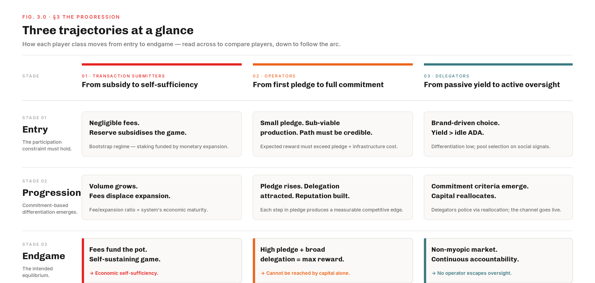

# The Intended Game — A Narrative Description of the Consensus Incentive Mechanism

The formal game-theoretic properties of the Cardano reward curve were established in *Reward Sharing Schemes for Stake Pools* (Brünjes, Kiayias et al., 2020, EuroS&P), which proves that $k$ pools is a Nash equilibrium under specific assumptions. The engineering specification *SL-D1* (Kant, Brünjes & Coutts, 2019) translates those results into protocol-level formulas. **Neither document tells the story of the game as it should play out** — who plays, why they enter, how they progress, and what equilibrium the mechanism is supposed to converge toward. This document is an attempt to supply that missing baseline. It is the normative reference the [mainnet diagnostic](../diagnostic/README.md) measures every divergence against, and the design objective the [V2 specification](../README.md) reasons toward.

Stage 01
The Intended Game
Design intent &middot; baseline &middot; this page

&rarr;
<a class="cps-stage cps-stage-future" href="../diagnostic/README.md" title="The Mainnet Diagnostic — observations &amp; findings">
Stage 02
Mainnet evidence
Observations &amp; Findings
</a>
&rarr;
<a class="cps-stage cps-stage-future" href="../generated-website/problem-statements.html" title="Induced Problems — proto-CPS scoped against the diagnostic">
Stage 03
Induced problem
proto-CPS
</a>
&rarr;
<a class="cps-stage cps-stage-future" href="../generated-website/solution-design.html" title="Solution Design — prioritising the nine problems into directions and milestones">
Stage 04
Solution Design
Directions &amp; milestones
</a>
&rarr;
<a class="cps-stage cps-stage-future" href="../generated-website/solution-evaluation.html" title="Evaluation of the four reward-related CIPs against the nine induced problems">
Stage 05
CIPs (Evaluation)
IntersectMBO governance
</a>
&rarr;
<a class="cps-stage cps-stage-future" href="../generated-website/build-scoping.html" title="Build Estimation / Scoping — sizing the build for the V2 stage-1 reform">
Stage 06
Build Estimation / Scoping
Build sizing
</a>

**Three player classes are locked in a strict dependency chain.** Transaction submitters generate the economic value that funds the epoch pot. Operators commit capital and infrastructure to secure the network. Delegators allocate stake and police the operator population. Each enters with a different motivation, holds a different strategic instrument, and follows a different trajectory. The reward curve's task is to make every link individually rational and incentive-compatible, so the chain holds without trust between participants.

**Pledge and liquid delegation are the two pillars of the security model.** Pledge is the operator's commitment bond — visible, declared, tied to a verifiable economic cost. Liquid delegation is the community's continuous approval signal — non-consensual, revocable at every epoch, and the protocol's substitute for the governance layer it does not have at the consensus level. Pledge without delegation is accountability with no enforcer; delegation without pledge is a vote with no consequence. The four security properties — accountability, delegation as counter-power, Sybil resistance, decentralisation — emerge only when both pillars bear weight simultaneously within each pool.

**When all three trajectories function as intended, they form a self-reinforcing cycle.** Demand funds rewards. Rewards make participation rational. Operators compete on pledge because the curve prices commitment. Delegators back the most committed operators because commitment is observable. The resulting network — decentralised, accountable, Sybil-resistant — is more valuable, attracts more demand, and sustains the cycle. The reward curve's success or failure is measured against this target.

The remainder of the document fixes the [design objective the mechanism must hit](#1-the-design-objective), introduces the three [players and their strategic instruments](#2-the-players), traces each [intended trajectory and the four security properties the equilibrium must satisfy](#3-the-progression), and closes with the [aligned dynamics that knit the trajectories into a virtuous cycle](#4-the-aligned-dynamics-the-virtuous-cycle).

# Table of Contents

- [1. The design objective](#1-the-design-objective)
- [2. The players](#2-the-players)
  - [2.1. Transaction submitters — the source of economic demand](#21-transaction-submitters-the-source-of-economic-demand)
  - [2.2. Operators — capital at risk](#22-operators-capital-at-risk)
  - [2.3. Delegators — the oversight layer](#23-delegators-the-oversight-layer)
  - [2.4. The dependency chain](#24-the-dependency-chain)
- [3. The progression](#3-the-progression)
  - [3.1. Transaction submitters — from subsidy to self-sufficiency](#31-transaction-submitters-from-subsidy-to-self-sufficiency)
  - [3.2. Operators — from first pledge to full commitment](#32-operators-from-first-pledge-to-full-commitment)
  - [3.3. Delegators — from passive yield to active oversight](#33-delegators-from-passive-yield-to-active-oversight)
  - [3.4. The security properties the equilibrium must satisfy](#34-the-security-properties-the-equilibrium-must-satisfy)
- [4. The aligned dynamics — the virtuous cycle](#4-the-aligned-dynamics-the-virtuous-cycle)

# 1. The design objective

The consensus layer needs three security invariants:

| Invariant | What it requires |
|---|---|
| **Sybil resistance** | A sufficiently large number of independent block producers, each with meaningful personal capital at risk. |
| **Accountability** | Each block producer subject to continuous community oversight. |
| **Decentralisation** | No single entity able to capture a dominant share of consensus power. |

Cardano cannot enforce these by fiat. It has no licensing authority, no operator selection committee, no means of compelling participation. It must instead rely on **mechanism design**: economic rules — the reward curve — that make rational, self-interested participants collectively produce the desired system properties.

The reward curve *is* the mechanism. Its success or failure is measured by a single criterion: does the *equilibrium* — the stable state toward which rational play converges — exhibit the security invariants above?

Two conditions must hold for this to work:

| Condition | Meaning |
|---|---|
| **Individual rationality** | Each player must be better off entering the game than staying out. |
| **Incentive compatibility** | The strategy that maximises each player's individual reward must also reinforce the system's security properties. |

When both conditions hold, the protocol does not need to trust its participants — only that they are rational.

# 2. The players

Three distinct classes participate in the mechanism. Each has a different *motivation* for entering, a different *strategy space* (in mechanism-design terms), and a different *trajectory* as the system matures.

| Player | Role | Strategic instrument |
|---|---|---|
| **Transaction submitters** | Source of economic demand | Fee payments — revealed-preference signal for network value |
| **Operators** | Block production and network security | **Pledge** — personal capital locked as a commitment bond |
| **Delegators** | Capital allocation and operator oversight | **Liquid delegation** — continuous, revocable approval signal |

## 2.1. Transaction submitters — the source of economic demand

**Why they matter.** Transaction submitters need reliable, censorship-resistant settlement. They do not participate in the staking game directly — they are *users* of the service the game produces. Their willingness to pay fees is a revealed-preference signal: it measures what the network is actually worth.

**How they feed the game.** They submit transactions and pay fees. Those fees, together with the monetary expansion draw from the reserve, fund the epoch pot the reward pipeline distributes. Without them there is no economic activity to secure, and no sustainable revenue to fund the operators who secure it.

**Marginal today, existential tomorrow.** Today fees contribute about 0.19% of the epoch pot — the game is almost entirely funded by monetary expansion from a depleting reserve. As the reserve crosses its half-life and expansion shrinks, the system's economic viability progressively shifts onto fee revenue.

> [!NOTE]
> Transaction submitters are a **latent constraint**: marginal today, existential tomorrow. Their long-term participation is what makes the staking game *sustainably worth playing* for every other participant.

*See also:* [Treasury & Pool Pots Distribution](../diagnostic/README.md#11-treasury-pool-pots-distribution) for the on-chain flow; [Mainnet Observations](../diagnostic/README.md#112-mainnet-observations) (TRE.O1, TRE.O2) for current fee-vs-expansion ratios.

## 2.2. Operators — capital at risk

**An open seat at the deflationary table.** A prospective operator believes in Cardano. ADA has a capped supply and a depleting reserve — it is structurally deflationary. From this perspective, the consensus game looks like an investment thesis, not a job offer: by operating a pool, an operator continuously accumulates an asset whose scarcity increases mechanically over time. The nominal yield in ADA, compounded by the deflationary trajectory of the asset, makes the expected real return deeply attractive on a long horizon.

The entry should be *accessible* — anyone with conviction and a realistic initial stake should be able to begin building this position. Not an exclusive club; an open, meritocratic game where commitment is the competitive edge.

> This is the narrative that attracts operators: a credible, long-term capital accumulation path anchored in consensus participation, open to anyone who believes in the technology.

**The participation constraint.** Operators seek a return on two forms of capital: the ADA they pledge and the infrastructure they maintain. A rational operator enters when the expected reward — block production fees, pool margin, stake-proportional share — exceeds the combined opportunity cost of pledged capital and operational expenses. In mechanism-design terms, the *participation constraint* must be satisfied: the operator must be better off running a pool than simply delegating the same ADA.

**Pledge as the primary instrument.** The operator's primary strategic instrument is **pledge**: personal capital locked into the pool. Pledge serves as the protocol's *commitment mechanism* — the signal through which an operator demonstrates alignment with the network. An operator who pledges significant ADA has more to lose from protocol failure or misbehaviour than one who pledges nothing. This skin in the game is the protocol's primary defence against Sybil attacks. Operators also set a *margin* (their fee) and maintain infrastructure quality, but at this layer the reward curve is primarily sensitive to pledge and total stake.

**The arc from newcomer to pillar.** A new operator starts with a small pledge, minimal delegation, and sub-reliable block production. The intended trajectory is one of *increasing commitment*: as the operator builds reputation and attracts delegation, they pledge more, the pool grows, and they earn a larger share of the pools pot. Each step up in pledge should produce a measurable competitive advantage — visible to delegators and economically meaningful to the operator — so the progression from "new pool" to "established pool" to "fully committed pool" is a legible arc both players can follow.

## 2.3. Delegators — the oversight layer

**Yield-seeking with minimal effort.** Delegators seek yield on their ADA holdings with minimal effort and risk. They do not produce blocks and bear no operational cost. Their entire strategic space reduces to a single decision: *which pool to delegate to*. A rational delegator maximises risk-adjusted return, favouring pools with high expected yield, reliable performance, and trustworthy operators.

The natural selection metric is the **annualised return on stake (ROS)** — the single number aggregating pool performance, operator fees, and saturation into a comparable yield figure. But the formula's structure ensures that the yield spread between well-run pools is narrow — a few tenths of a percent. This narrow spread is a design consequence, not an accident: yield alone cannot meaningfully differentiate most of the pool landscape. A second criterion enters — one the formula does not price but that the mechanism depends on.

**Liquid delegation as continuous approval.** The strategic instrument is **liquid delegation**: the ability to freely choose a pool — and freely withdraw at any time. This makes delegation a *continuous approval signal*. No operator can capture stake permanently; an operator who underperforms or behaves badly faces immediate capital flight.

> [!IMPORTANT]
> Liquid delegation is the protocol's **accountability mechanism** and its primary anti-monopoly tool. But it only functions if pools *need* delegators — if operators depend on community-sourced stake to reach their optimal reward. Without that dependency, delegators have no leverage and the accountability channel collapses.

**The delegator as ethical arbiter.** Because the yield spread between well-run pools is narrow, the delegator's choice is not purely economic — it is partly an expression of values. Two pools that offer identical ROS may differ in ways the formula does not capture but that matter to the delegator and to the network:

- **Commitment.** A pool where the operator has pledged meaningful personal capital is structurally more aligned with the delegator's interest than one where the operator pledges nothing. The operator has more to lose, the accountability channel is active, and the pool is less likely to change strategy abruptly.
- **Independence.** Delegating to an independent single-pool operator contributes to decentralisation in a way that delegating to the tenth pool of a large multi-pool operator (MPO) fleet does not. The protocol does not distinguish between the two; the delegator who values a decentralised network may deliberately choose the independent operator.
- **Transparency and conduct.** Operators differ in how they communicate fee changes, maintain infrastructure, and engage with the community. A delegator who exits a pool after a surprise margin increase is exercising the accountability mechanism — even if the formal yield difference is negligible.

The delegator, in this sense, acts as an **ethical arbiter** of the pool landscape. Where the formula is indifferent, the delegator is not. The mechanism's long-term health depends on enough delegators treating this ethical dimension as part of their decision — supporting commitment, independence, and transparency beyond what yield alone would justify.

**Myopic and non-myopic delegation.** The formal literature distinguishes two delegator models that map directly onto the yield-vs-ethics tension above.

A **myopic** delegator optimises for the *current epoch*. The decision is purely backward-looking: which pool delivered the highest ROS last epoch? Delegation flows toward the largest, most reliable, lowest-fee pools — none of pledge, operator commitment, or network-level properties affect the per-ADA yield in the next five days.

A **non-myopic** delegator anticipates the *downstream effects* of delegation decisions. Brünjes & Kiayias (2020) prove that the *k*-pool equilibrium holds under non-myopic play: delegators who factor in long-term consequences converge on a distribution of *k* pools. For the non-myopic delegator, the ethical dimension of pool selection is not a luxury but a rational strategy — supporting committed, independent operators produces a more decentralised, accountable, and valuable network, which sustains the yield the delegator depends on.

> [!IMPORTANT]
> The mechanism implicitly *assumes* non-myopic delegation. But the information environment it creates — narrow yield spreads, invisible pledge, pool size as the dominant signal — rewards myopic behaviour. The mechanism needs non-myopic delegators to reach its intended equilibrium, but provides myopic delegators with no reason to become non-myopic.

This is the core tension in the delegator's role. The ethical arbitration the mechanism depends on operates *outside* the formula, sustained only by the delegator's understanding that the network they help shape is the network they depend on.

## 2.4. The dependency chain

These three roles form a dependency chain.

The mechanism's task is to make each link *individually rational* and *incentive-compatible* — so the chain holds without trust between participants.

At this layer (pool distribution), the reward curve directly governs the operator–delegator relationship. Neither alone should be able to maximise rewards: the mechanism deliberately requires both. This **interdependence** is the core of the design. Operators need delegators for scale; delegators need operators for block production. The reward curve should make their partnership the individually rational path for both.

Transaction submitters are upstream — their contribution is mediated through the epoch pot — but they set the ultimate economic boundary within which the operator–delegator game plays out.

*See also:* [Treasury & Pool Pots Distribution](../diagnostic/README.md#11-treasury-pool-pots-distribution) for the upstream flow.

# 3. The progression

Each player class experiences the game through its own trajectory — entry, progression, endgame. A well-designed mechanism makes each *individually rational* at every stage, so no player has a reason to drop out or deviate.

The three trajectories are developed in detail below. Read across the matrix to compare players at the same stage; read down to follow each player's arc.

## 3.1. Transaction submitters — from subsidy to self-sufficiency

**Entry.** Early adopters use the network for basic settlement. Transaction volume is low and fees contribute negligibly to the epoch pot. The game is almost entirely funded by monetary expansion from the reserve — a bootstrap subsidy that makes staking rewards viable before organic demand exists.

**Progression.** As the network matures, transaction volume and diversity grow. Fee revenue increases, gradually reducing dependence on the reserve. The ratio of fees to expansion becomes a measure of the system's economic maturity.

**Endgame.** Fee revenue fully replaces monetary expansion as the primary funding source for the epoch pot. The staking game is self-sustaining: operators and delegators are paid by the economic activity they secure, not by a depleting reserve. The protocol has achieved *economic self-sufficiency*.

## 3.2. Operators — from first pledge to full commitment

**Entry.** A new operator registers a pool, pledges an initial amount, and begins attracting delegation. The mechanism must make this *individually rational*: the expected payoff should offer a credible path forward — not just survival but growth — so the *participation constraint* is met from the start.

**Progression.** As the operator builds reputation and delegation, the mechanism should reward increasing pledge commitment. Each step up in pledge should produce a measurable competitive advantage — visible to delegators, economically meaningful to the operator. The progression from "new pool" to "established pool" to "fully committed pool" should be a legible arc both players can follow.

**Endgame.** The operator has committed deeply (high pledge) and earned broad delegation. Their pool captures the maximum reward the protocol offers. This state should require *both* high pledge and high delegation — it cannot be attained by capital alone or by delegation alone.

## 3.3. Delegators — from passive yield to active oversight

**Entry.** A new delegator selects a pool and allocates stake. Differentiation between pools is low — delegation may be driven by brand, community ties, or social signals rather than on-chain metrics. Participation must still be *individually rational*: delegation yield should exceed the opportunity cost of holding idle ADA.

**Progression.** As the pool landscape matures and the mechanism produces legible differences between pools, delegators increasingly differentiate on *commitment-based criteria*: pledge level, track record, margin policy. Capital flows toward the most committed operators and away from uncommitted ones. The accountability mechanism becomes active — delegators are *policing* operator behaviour through capital reallocation.

**Endgame.** Delegators act as an efficient market for operator commitment — and as ethical arbiters of the pool landscape. Capital moves fluidly to pools that best combine commitment and performance, and exits quickly from those that fall short. The accountability mechanism operates at full power: no operator can sustain high rewards without continuous community approval. This endgame requires non-myopic delegation — delegators who factor in commitment, independence, and network health, not only current-epoch yield.

*See also:* [The delegator as ethical arbiter](#23-delegators-the-oversight-layer); [Myopic and non-myopic delegation](#23-delegators-the-oversight-layer).

## 3.4. The security properties the equilibrium must satisfy

The three trajectories above describe individual paths. But the protocol does not care which path any single operator or delegator takes — it cares whether the *equilibrium* that emerges from the aggregate of all rational choices preserves the security invariants from [the design objective](#1-the-design-objective).

The formal literature defines these invariants implicitly through the constraints the reward function must satisfy: the equilibrium must exhibit *k* independent block producers, each bearing a non-trivial personal cost, subject to continuous community oversight, with no single entity able to capture a dominant share of consensus power. Four properties encode these invariants. They are not a menu of desirable features — they are essential elements of the security argument. Losing any one degrades the model; losing two or more can break it.

| Property | What it secures | Mechanism |
|---|---|---|
| **Accountability** | Operators are identifiable and have something to lose | Pledge (static bond) + delegation (dynamic discipline) |
| **Delegation as counter-power** | Community oversight substitutes for governance | Revocable staking rights create a credible exit threat |
| **Sybil resistance** | *k* pools represent *k* independent entities | Pledge bonus makes fragmentation economically dominated |
| **Decentralisation** | No single actor dominates block production | Calibrated entry barrier: commitment, not wealth alone |

**Accountability — the bond and the enforcer.** The Ouroboros security model assumes that block producers are *identifiable* and have *something to lose*. Accountability is the property that connects a block-producing identity to a real economic cost: if the operator misbehaves — equivocates, censors, goes offline — there must exist a mechanism through which that behaviour imposes a loss proportional to the damage caused.

Cardano's consensus layer does not implement slashing. Unlike protocols that destroy a validator's deposit upon detectable misbehaviour, Ouroboros relies on an indirect accountability structure built from two components operating at different time-scales:

- **Pledge as a static bond.** Capital registered in the pool certificate creates a visible, on-chain commitment. It is not custodially locked — the operator retains the keys — but it is *declared*: the protocol observes it at every epoch boundary, and failure to maintain the declared amount triggers a total reward wipe (the pledge-unmet penalty). An operator who has pledged substantial capital has an observable, verifiable stake in the pool's continued operation. The cost of abandoning or sabotaging the pool includes forfeiting the competitive position pledge confers.
- **Delegation as a dynamic discipline.** Delegators can revoke their delegation unilaterally, at any epoch boundary, without the operator's consent. This is the protocol's primary enforcement mechanism: an operator who degrades performance, raises fees exploitatively, or behaves dishonestly faces capital flight. The pool shrinks, rewards drop, and the operator's income falls — not because the protocol punished them, but because the community withdrew its approval.

These two components are not redundant. The static bond ensures the operator has a *minimum* cost of entry and a *minimum* exposure to the pool's fate — it exists even when no delegator is watching. The dynamic discipline ensures the operator faces *continuous* pressure to maintain performance — it operates even when the bond is too small to matter on its own.

> A system that relies on only one component is fragile. Pledge without delegation produces accountability that is entirely self-referential: the operator answers to no one but themselves. Delegation without pledge produces accountability without cost: the operator can walk away from a misbehaving pool and register a new one at zero loss. The security model requires both — a floor of personal exposure *and* a continuous external check.

**Delegation as counter-power — the protocol's substitute for governance.** Delegation in the SL-D1 design is not merely a capital-routing mechanism. It is the protocol's substitute for the governance layer Cardano does not have at the consensus level.

The formal design separates control over *funds* (payment keys) from rights in the *PoS protocol* (staking keys). A delegator who assigns their staking key to a pool does not transfer custody — they grant a revocable licence to include their stake in the pool's block-production weight. The revocation is non-consensual: the protocol processes it without requiring the operator's approval. This makes delegation a *continuous approval signal* rather than a one-time capital commitment.

The disciplinary power of this mechanism depends on a structural condition: **the operator must need delegators more than delegators need the operator.** If a pool is filled entirely with the operator's own capital, delegator exit is irrelevant. If a pool is filled entirely by external delegation, delegator exit destroys the operator's income — but only if the operator has something at stake that makes rebuilding costly. The ratio between owner stake and delegated stake determines the *leverage* delegators have.

> [!NOTE]
> The pledge/delegation ratio is not an accounting detail — it defines the **power structure** within the pool. For the credible exit threat to function, both parties must have real stakes: the operator cannot be replaced without cost (pledge and infrastructure matter), and the delegators cannot be ignored without cost (their departure shrinks the pool materially). This mutual dependency is the structural condition the mechanism must produce.

**Sybil resistance — making fragmentation expensive.** The *k*-pool target assumes that *k* pools represent *k* *independent* block-producing entities. Sybil resistance is the property that makes this assumption defensible: creating additional block-producing identities must carry a cost high enough that fragmentation is economically dominated by honest, single-pool operation.

Brünjes & Kiayias (2020, §4) formalise this through the pledge parameter *a₀*. The reward function *r(σ, λ)* includes a pledge-sensitive component — the *λ_pledge · A(ν, π)* term — designed so that splitting capital across *n* pools dilutes the pledge bonus per pool. An attacker who fragments into *n* identities must commit capital linearly: each pool requires its own pledge to earn the bonus. The intended cost of a Sybil attack scales as *O(n)* in committed capital.

This defence has a quantitative precondition: **the pledge bonus must be large enough that forfeiting it is costly.** If the bonus is negligible, the Sybil tax approaches zero. The formal mechanism exists; whether its economic bite is sufficient is a question of parameter calibration.

There is a subtlety in *how* the Sybil cost operates. When the cost comes from the pledge mechanism itself — forfeiting a meaningful bonus by fragmenting — it is the *design* that provides the defence. When the cost comes from raw capital requirements alone — an attacker simply running out of money — the defence is incidental, not engineered. The mechanism should ensure that the Sybil cost operates through the reward structure, not merely through wealth constraints that exist independently of the protocol.

**Decentralisation — more than a pool count.** Decentralisation is the property the *k*-pool target is supposed to produce: consensus power distributed across many independent entities, with no single actor or coordinated group able to dominate block production.

This requires more than a count of pools. A network with 500 pool certificates but a handful of controlling entities is not decentralised in any security-relevant sense — it merely *appears* decentralised at the certificate level while concentrating power at the entity level. Decentralisation requires that pools be operated by *distinct, economically independent* actors.

The entry barrier determines who can participate. If the barrier is too high — requiring enormous personal capital per pool — the operator set shrinks to a small, wealthy elite, and block production becomes permissioned by wealth. If the barrier is too low — requiring no meaningful commitment — entry is cheap, but competitive dynamics drive concentration through brand, convenience, and scale rather than through commitment. In both cases the resulting equilibrium fails the decentralisation test, though for different structural reasons.

The mechanism must calibrate the barrier so that *commitment* — not wealth alone and not zero-cost entry — determines who can participate. The entry requirement should be high enough to be meaningful but low enough that operators of moderate means can enter, with delegation providing the growth path beyond the initial commitment.

**The four properties interlock.** These four properties are not independent. The interactions constrain the design space:

| Interaction | What it means |
|---|---|
| **Accountability × delegation-as-counter-power** | Two faces of the same disciplinary structure. In a system without slashing, the *only* continuous enforcement mechanism is delegator exit. Pledge creates the precondition; delegation creates the mechanism. Accountability without delegation is a bond with no enforcer; delegation without accountability is a vote with no consequence. |
| **Sybil resistance × decentralisation** | In tension. A higher Sybil cost (more pledge per pool) raises the entry barrier and can reduce the number of independent operators. A lower Sybil cost lowers the barrier but makes fragmentation cheap. The mechanism must calibrate so the pledge requirement is high enough to impose a real cost on fragmentation but low enough — with delegation supplying the rest of the stake — that operators of moderate means can still compete. |
| **Decentralisation × delegation-as-counter-power** | Mutually reinforcing. More independent operators means more choices for delegators, which strengthens the exit threat, which improves accountability, which makes the operator landscape more trustworthy, which attracts more delegation to committed pools. This is the virtuous cycle the next section describes. |

**The structural requirement.** Taken together, the four properties impose a specific structural requirement on the equilibrium the mechanism must produce:

> [!IMPORTANT]
> **Each pool must combine meaningful operator commitment with meaningful external delegation.**
>
> Operator commitment (pledge) is required for accountability and Sybil resistance — it creates the bond that makes misbehaviour costly and fragmentation expensive. External delegation is required for counter-power and decentralisation — it creates the oversight mechanism and ensures the entry barrier does not exclude operators of moderate means.

An equilibrium where operators fund pools entirely from their own capital satisfies accountability narrowly but eliminates delegation's disciplinary role and restricts participation to the capital-rich. An equilibrium where operators commit nothing satisfies no property — the bond is absent, the Sybil defence is gone, and concentration emerges through market dynamics unchecked by any commitment signal.

The design's target is an equilibrium where the pledge/delegation ratio within each pool reflects genuine *interdependence* between operator and community — where neither party can be absent without degrading the security properties the consensus layer depends on. This is the benchmark against which any evaluation of the mechanism's actual performance must be measured.

# 4. The aligned dynamics — the virtuous cycle

When all three trajectories function as intended, they form a self-reinforcing cycle.

Transaction submitters generate economic demand that funds the epoch pot. The epoch pot rewards operators and delegators, making participation *individually rational* for both.

Operators compete on pledge because the mechanism makes pledge the primary competitive dimension. Delegators reward the most committed operators because the mechanism makes commitment observable and economically meaningful.

This selective pressure produces an operator landscape that is decentralised (many independent, committed pools), accountable (delegators can exit at any time), and Sybil-resistant (pledge is costly to fake). A more secure, decentralised network is more valuable — it attracts more transaction demand, which grows fee revenue, which funds better rewards, which sustains the cycle.

> [!NOTE]
> This is the **incentive-compatible equilibrium** the mechanism should converge toward: a state where each player, pursuing their own rational self-interest, reinforces the system's security properties — and where no player can improve their payoff by deviating.

The reward curve's success or failure is measured against this target.

> **Next:** The divergence analysis — what actually happens when each player class tries to play this game — has been moved to [The Player Populations](../diagnostic/README.md#2-the-player-populations) in the main report.

> **Status:** Working document — companion to the main [Cardano Reward Pipeline](../diagnostic/README.md) analysis (the [Pools distribution](../diagnostic/README.md#12-pools-distribution) sub-section).
