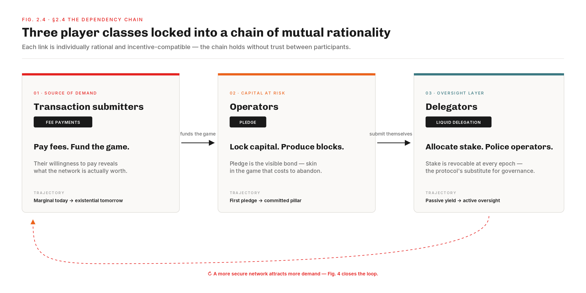
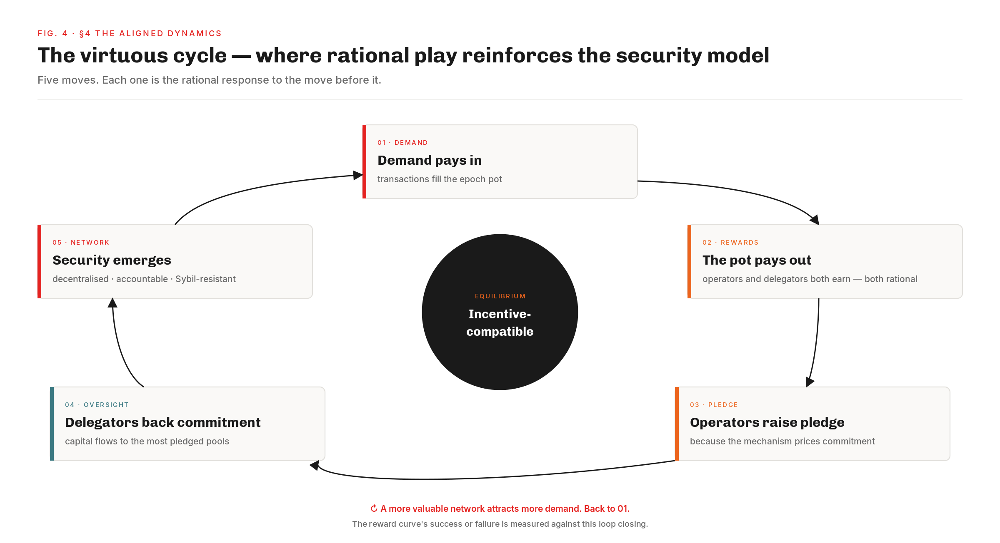

# Welcome — Cardano Reward System / The Holistic Reading

This is the work-in-progress website on  **Cardano Reward System / The Holistic Reading** — a holistic reading of today's reward mechanism, the **directions of exploration** that reading suggests for a successor, and an evaluation of the existing reward CIPs through the same holistic prism. The work is being conducted by the **Cardano Business Unit (CBU)** within . The aim: give the Cardano community a shared empirical and analytical foundation against which any proposal can be evaluated on common ground.

Nothing here is yet a deployed mechanism nor a finalised proposal — the analysis, the directions of exploration, and the CIP evaluation are all open to community challenge and refinement.

To begin, a **sample of six insights** — a glimpse, across the reward system, of the drifts the diagnostic surfaces. Some have already been spotted, intuitively, by one or more of the existing reward CIPs that set out to address them; others appear here for the first time. A teaser, in the hope it will draw you deeper:

<article class="diag-teaser-box">

Reserve &amp; reward pot

13.29B → 6.45B ADA

Reserve · −51.43% in 5.7 yr · draws ρ = 0.3% every epoch

Epoch pot · epoch 623

Gross pot assembled~19.23M ADA

funded by Tx fees0.17%

funded by the reserve99.83%

Pools pot (τ = 80%)15.39M ADA

paid to participants6.78M · 44%

returns to reserve8.61M · 56%

Reserve-funded by design — fees would need to grow <strong>~100× in revenue terms</strong> to retire the reserve draw. Half-distributed by side-effect: incomplete payouts have already piled up ~71% of today's reserve stock.

</article>

<article class="diag-teaser-box">

Pledge paradox

0.07%

Stake-weighted median pledge — 78% of pools sit below 1%

Why the budget leaks

Yield at full pledge (saturated)0.68% / yr

Yield from passive delegation2.3% / yr

Bonus budget per epoch3.43M ADA · 22% of pot

returns unclaimed95.6%

Pledging pays ~3× worse than doing nothing — the strongest commitment signal has priced itself out.

</article>

<article class="diag-teaser-box">

Yield collapse

5.3% → 2.0%

Average Yield Index — tracks reserve depletion (R² = 0.99) over 413 epochs

Below the alternatives, today

USD risk-free rate4.3% / yr

Cardano AYI (epoch 623)2.0% / yr

Projected descent

+12mo · Q2 2027~1.7%

+20mo · Q4 2027&lt; 1.5%

+42mo · Q3 2029&lt; 1.0%

Already below the alternatives — and the slope is straight. The whole yield surface descends as a unit; no pool-level strategy can offset it.

</article>

<article class="diag-teaser-box">

Single SPO viability

291 · 24.4%

Independent single-pool operators <strong>on the productive set</strong> · 5-year decline · the designed entry-to-established path is effectively closed

Losing ground (epoch 300 → 623)

Productive single-pool count555 → 291

Share of productive stake39.1% → 24.4%

The independents the design was supposed to grow are losing ground on the productive set every epoch.

</article>

<article class="diag-teaser-box">

MPO concentration

83 · 76.7%

Multi-pool operators <strong>on the productive set</strong> · 5-year ascent · capture rising share since Shelley launch

Gaining ground (Shelley launch → epoch 623)

Multi-pool entity count23 → 85

Productive pools controlled135 → 660

Share of productive stake65% → 75.6%

Three quarters of the network runs on 83 entities — and the count keeps growing.

</article>

<article class="diag-teaser-box">

Delegator concentration

1 000 · 57%

Top staking addresses on the productive set · Gini 0.976 — more concentrated than US wealth

Where the wealth sits (epoch 623)

Top 100 wallets23.7%

Top 1 000 (0.07%)57.0%

Top 10 000 (0.74%)79.2%

Locked since epoch 280

Delegator population150K → 1.36M

A thousand wallets decide where the rewards land — and 9× delegator growth did not shift them.

</article>

## Why a holistic approach

Four pieces of work surround Cardano's reward mechanism today:

- **The formal design** — [*Delegation Incentives Design Specification (SL-D1)*](pdf-viewer.html?file=references/design-specs/delegation-incentives-design-spec_kant-brunjes-coutts_2019.pdf) by Kant, Brünjes & Coutts (2019), the original mathematical specification authored by IO Research before launch. Its companion paper [*Reward Sharing Schemes for Stake Pools*](pdf-viewer.html?file=references/research-papers/reward-sharing-schemes_brunjes-kiayias-et-al_2020.pdf) (Brünjes, Kiayias et al., EuroS&P 2020) proves *k* pools is a Nash equilibrium under specific assumptions.
- **A prior mainnet analysis** — [*Analysis of Cardano's Incentive Mechanism*](pdf-viewer.html?file=references/previous-analasys/spo-incentives-analysis_lopez-de-lara_2025.pdf) by Lopez de Lara (November 2025, tag **SD-L**), the first systematic look at the reward mechanism against on-chain evidence. The work on this site builds directly on it and extends the reflection.
- **Four reward-related CIPs** advanced through Intersect governance since launch: [CIP-0023](../solution-evaluation/operator-delegator/cip-0023.md), [CIP-0037](../solution-evaluation/pools-distribution/cip-0037.md), [CIP-0050](../solution-evaluation/pools-distribution/cip-0050.md), [CIP-0082](../solution-evaluation/operator-delegator/cip-0082.md) — each tackling a specific facet of the mechanism.
- **Five-and-a-half years of mainnet** — an empirical record large enough to confront design intent and to revisit any prior analysis on updated data.

What no document held in a single frame was *all four at once* — design intent, prior diagnostic, proposed fixes, and the current mainnet record — read against each other rather than in isolation. Cardano's reward mechanism was designed as a **single coherent equilibrium**, not a stack of separable parameters: pledge, delegation, the reward curve, the fee structure, the reserve schedule — all interact. A fix to one parameter without seeing the system as a whole risks moving the bottleneck rather than removing it. The drifts the diagnostic surfaces — only a small sample of which is previewed above — are not independent bugs; they are softer links in the same chain. Reading the four pieces against each other is what the work assembled on this site sets out to do, one document at a time. **Six documents, in sequence:**

<a class="cps-stage cps-stage-done" href="../the-intended-game/README.md" title="Stage 01 — The Intended Game: plain-prose design baseline">
Stage 01
The Intended Game
Design intent &middot; baseline
</a>
&rarr;
<a class="cps-stage cps-stage-done" href="../diagnostic/README.md" title="Stage 02 — Mainnet evidence: observations and findings, by sub-flow">
Stage 02
Mainnet evidence
Observations &amp; Findings
</a>
&rarr;
<a class="cps-stage cps-stage-done" href="../generated-website/problem-statements.html" title="Stage 03 — Induced Problems: 9 proto-CPSs surfaced by the diagnostic">
Stage 03
Induced problem
9 proto-CPSs
</a>
&rarr;
<a class="cps-stage cps-stage-done" href="../README.md" title="Stage 04 — Solution Design: prioritising the nine problems into directions and milestones">
Stage 04
Solution Design
Directions &amp; milestones
</a>
&rarr;
<a class="cps-stage cps-stage-done" href="../solution-evaluation/README.md" title="Stage 05 — Evaluation of the four pre-existing reward CIPs against the nine induced problems">
Stage 05
CIPs (Evaluation)
IntersectMBO governance
</a>
&rarr;
<a class="cps-stage cps-stage-done" href="../implementation-scope/README.md" title="Stage 06 — Build Estimation / Scoping: sizing the build for the V2 stage-1 reform">
Stage 06
Build Estimation / Scoping
Build sizing
</a>

The work starts from the design intent. [*SL-D1*](pdf-viewer.html?file=references/design-specs/delegation-incentives-design-spec_kant-brunjes-coutts_2019.pdf) and [the EuroS&P paper](pdf-viewer.html?file=references/research-papers/reward-sharing-schemes_brunjes-kiayias-et-al_2020.pdf) are rigorous but dense, and the intent — *who plays, why they enter, how they progress, what equilibrium the formula is supposed to converge toward* — sits between the formulas, not on the surface. So we wrote the plain-prose companion SL-D1 never had: **[The Intended Game](../the-intended-game/README.md)**. It starts from the players — transaction submitters fund the epoch pot via fees, operators commit pledge and infrastructure, delegators allocate stake and police operators, and non-participants sit outside the game altogether. Each enters with a different motivation and holds a different strategic instrument; the reward curve's task is to make every link individually rational, so the chain holds without trust between participants.

Security in that chain rests on two pillars and two only — **pledge** (visible, declared, locked, costly to fake) and **liquid delegation** (continuous, revocable, non-consensual, no lockup). Together they are meant to produce four security properties as a joint output: Sybil resistance, accountability, decentralisation, and economic viability. The two pillars cannot be tuned separately — weaken either and all four properties degrade together. When everything holds, the system runs as a virtuous cycle: demand funds rewards, rewards select committed operators, committed operators secure the network, and a more secure network attracts more demand. A chain, not a stack — break any link and the cycle decays.

With that normative baseline in place, the next step was a systematic confrontation with mainnet evidence. [Lopez de Lara's November 2025 analysis](pdf-viewer.html?file=references/previous-analasys/spo-incentives-analysis_lopez-de-lara_2025.pdf) (**SD-L**) already opened that path; **[The Mainnet Diagnostic](../diagnostic/README.md)** picks it up, extends it on six more months of data, and reorganises the work around the four sub-flows of the reward pipeline — Treasury & Pool-Pots, Pools Distribution, Operator-Delegator split, Staking Census — each measuring divergence between the intended trajectory and the observed one, observation code by observation code. The seven boxes above are only a small sample of what it surfaces.

A diagnostic alone is not actionable. Each divergence has to be turned into a problem statement any successor can be evaluated against. **[Induced Problems](../generated-website/problem-statements.html)** consolidates them as **nine proto-CPSs** — five micro (μ01–μ05) and four macro (M01–M04), framed for the IntersectMBO governance process.

With both the diagnostic and the problem statements in hand, the four pre-existing reward CIPs can be read against the same prism. **[Existing reward CIPs — Evaluation](../solution-evaluation/README.md)** reads [CIP-0023](../solution-evaluation/operator-delegator/cip-0023.md), [CIP-0037](../solution-evaluation/pools-distribution/cip-0037.md), [CIP-0050](../solution-evaluation/pools-distribution/cip-0050.md), and [CIP-0082](../solution-evaluation/operator-delegator/cip-0082.md) against the same nine induced problems. The CIPs each spot real issues, intuitively — but they were drafted independently, before this diagnostic existed and without a system-wide framework, and a fix that looks right for one stage can be undone by a distortion at another. The evaluation asks whether the proposed fixes carry the weight the diagnostic asks of them.

Where they leave gaps, the work has to carry on. **[Solution Design](../README.md)** organises directions of exploration around the nine induced problems, with one priority rule: *root causes before scale-up*.

Finally, a direction is only a proposal until someone can say what it costs to build. **[Build Estimation / Scoping](../implementation-scope/README.md)** sizes the V2 stage-1 reform — naming every ledger, CDDL, Constitution-guardrail, node, and assurance work item the recommended design requires, and the hard-fork-then-parameter-update path that ships it.

> **Status:** Active 2026/05/13. Landing page of *Cardano Reward System / The Holistic Reading*.
